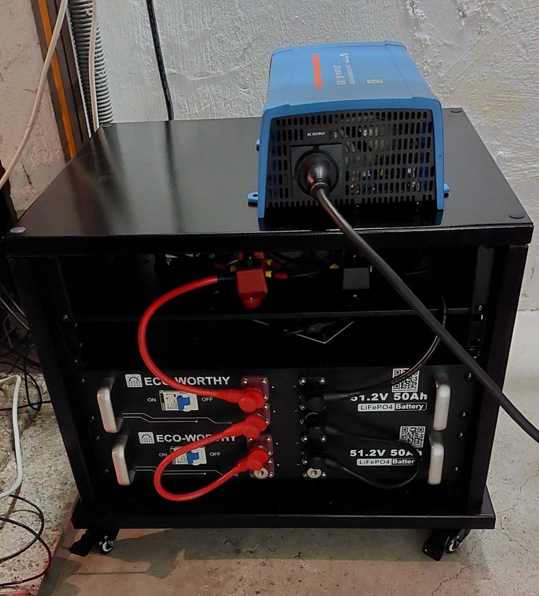
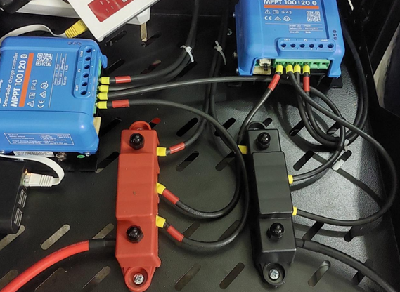

# (Gesamt-)Inhaltsverzeichnis {#Inhaltsverzeichnis}

-   [Hauptseite mit Zusammenfassung etc.](index.md)
-   [Photovoltaik und ihr möglicher Ertrag](PV.md)
-   [Stromverbrauch und Einspeisung im Haushalt](SV.md)
-   [Eigenverbrauch und seine Berechnung](EV.md)
-   [Nutzungsvarianten](SSG.md)
    -   [Direkte Netzeinspeisung (Steckersolargerät SSG, „Balkonkraftwerk“)](SSG.md#SSG)
    -   [Hausnetzeinspeisung mit Pufferspeicher](Speicher.md)
    -   [Inselanlage (mit Speicherung) und Kombination](Insel.md)
-   [Auswahl und Nutzung von Komponenten](Komp.md)
-   [Beispiel-Konfigurationen](#Beispiele)
    -   [Mobile Inselanlage](#Mobilanlage)
<!-- -   [Steckersolargerät](#Steckeranlage) -->
    -   [SSG mit DC-gekoppeltem Speicher](#SSG-DC-gekoppelt)
    -   [Kombi-Anlage](#Kombianlage)

Beispiel-Konfigurationen {#Beispiele}
------------------------

### Mobile Inselanlage {#Mobilanlage}

Für unser [Wohnmobil](https://perlen.DavOh.de/Camper.html) verwende ich:
-   seit April 2024:\
    2 × [120&nbsp;Wp starre Eco-Worthy Solarpanel](
    https://www.manomano.de/p/eco-worthy-240-watt-12v-solarmodul-mit-aluminiumrahmen-hocheffizientes-monokristallines-solarpanel-solarenergieeingang-von-12v-fuer-boote-wohnmobile-vans-anhaengerhaushalt-75267927?product_id=128166485),
    für 100€\
    _Hilfreiche Videos zur Montage aufs Dach:
    [hier](https://www.youtube.com/watch?v=5OrX56gWZd8) (von Sika)<!--,
    [hier](https://www.youtube.com/watch?v=-oNCwqhQv1U)--> und z.B.
    [hier](https://www.youtube.com/watch?v=HAwRP3jstVQ&t=89s)._
     {:width="798" .right}

    Davor hatte ich ab Sommer 2019:\
    <!-- relativ günstige  zu meiner vollen Zufriedenheit-->
    2 × 100&nbsp;Wp flexible Solarpanels [Dokio
    DFSP-100M](https://www.amazon.de/DOKIO-Batterie-wasserdicht-Wohnmobil-Oberfl%C3%A4che/dp/B07FYW3C6W),
    ca. 180€\
    _Diese hatte ich einfach mit extrem starken doppelseitigen Klebeband
    auf das Blechdach unseres Wohnmobils geklebt, was problemlos gehalten hat.
    Etwas lästig war die Kabelführung ins Innere._\
    _Ich kann solche billigen flexiblen Module nicht empfehlen.
    Sie brachten selbst unter bester Einstrahlung nie die versprochene Leistung
    und waren bereits nach 5 Jahren so [verschlissen](
    https://www.mydealz.de/deals/2120-watt-starre-solarmodule-monokristallin-eco-worthy-0-mwst-2339382#comment-47075234) (auch durch
    Verschmutzung und Reinigungsversuche) inkl. Rissbildung,
    dass sie kaum noch Ertrag brachten: je 10-20 Wp Leistung.\
    {:width="798" .right}

-   15&nbsp;A Solar-Laderegler [Victron SmartSolar MPPT 75/15](
    https://www.victronenergy.de/solar-charge-controllers/smartsolar-mppt-75-10-75-15-100-15-100-20),
    [ca. 60€](
https://www.idealo.de/preisvergleich/OffersOfProduct/6019083_-smartsolar-mppt-75-15-victron.html)\
    Dieser Regler unterstützt Batterien mit 12 oder 24&nbsp;V und Ladeströme
    bis 15&nbsp;A (wobei selbst bei einer 12&nbsp;V Batterie für 200 Wp
    bei waagerechter Dachmontage in der Praxis auch 10&nbsp;A genügt hätten).\
    Die BlueSolar-Variante wäre etwas günstiger, aber sehr praktisch finde ich
    bei den SmartSolar-Modellen die Abfrage mit dem Smartphone über Bluetooth.\
    Leider unterbinden die Victron-Regler nicht das Laden bei unter 0°C,
    was bei LiFePO4-Akkus zu Schäden führen kann, wenn man sie im Winter nicht
    abklemmt. Allerdings bietet Victron eine Lösung mit einem Zusatzgerät namens
    [Smart Battery Sense](
    https://www.idealo.de/preisvergleich/OffersOfProduct/201937361_-smart-battery-sense-victron.html),
    das allerdings etwa 40€ extra kostet.

-   12,8&nbsp;V 100&nbsp;Ah 4S1P LiFePO4-Batterie inkl. 100&nbsp;A BMS [Delong
    DL-12100](https://www.alibaba.com/product-detail/Delong-Factory-Rechargeable-12-8V-100Ah_62388029440.html),
    inkl. DDP-Versand direkt aus China im März 2019 ca. 400€.\
    In Deutschland wurden zu der Zeit solche Batterien hingegen noch
    für ungefähr 1000€ verkauft. Siehe auch [meinen
    myDealz-Beitrag](https://www.mydealz.de/deals/12v-100ah-lifepo4-akku-mit-bms-ab-400-zb-fur-solaranlage-oder-wohnmobilbatterie-ersatz-1350559)
    dazu mit interessanter Diskussion.

-   [2000&nbsp;W
    Wechselrichter](https://de.aliexpress.com/wholesale?SearchText=pure+sine+wave+inverter+2000w),
    ebenfalls direkt aus China, ca. 70€

<!--
### Steckersolargerät {#Steckeranlage}

Für eine sehr einfache, aber effiziente Anlage zur Netzeinspeisung
finde ich folgende Komponenten besonders interessant bzw. zu empfehlen:

-   2 × 400&nbsp;Wp starre SSP [EcoDelta -
    ECO-400M-66SA](Datenblatt_ECO-380-400M-66SA.pdf) mit besonders hoher
    Effizienz: 213&nbsp;Wp/m², ca. 540€\
    oder 4 × 150&nbsp;Wp flexible ETFE SSP Solarmodule [Solarfam
    SZ-150-36MFE](Solarfam_SSP_SZ-150-36MFE.pdf) mit 188&nbsp;Wp/m², ca.
    [664€](https://stromvoll.com/shop/#!/150W-Flexible-Solar-panel-1170-x-680-x-2-mm/p/396304457)\
    oder 2 × 310&nbsp;Wp sehr langlebige flexible Solarmodule [Sunman eArc
    SMF310M-6X10DW](Datenblatt_Sunman_flexible_310W.pdf) mit 187&nbsp;Wp/m²,
    ca.
    [500€](https://www.idealo.de/preisvergleich/Liste/119495785/sunman-310.html?sortKey=minPrice)

-   Mikrowechselrichter mit 2 * 300&nbsp;W MPPT [Hoymiles
    HM-600](https://www.hoymiles.com/de/products/microinverter/single-phase/),
    ca. [200€](https://www.idealo.de/preisvergleich/OffersOfProduct/201802725_-hm-600-mikrowechselrichter-hoymiles.html)
-->
<!-- \
    oder 1000&nbsp;W Micro Grid Tie Inverter Inverter SG1000MQ(https://www.ebay.de/itm/124731502486), ca. 200€\
    oder 600&nbsp;W WR mit 2 × 400&nbsp;W Eingängen und WLAN [Deye Sun600g3-EU-230](
    https://deye.com/de/product/sun600-800-1000g3-eu-230-600-1000w-single-phase-2-mppt-micro-inverter-rapid-shutdown/),
    ca. [190€](https://www.idealo.de/preisvergleich/OffersOfProduct/202156668_-sun600g3-eu-230-600w-deye-inverter.html)
-->
<!-- \
    _Achtung_, in älteren Versionen (etwa 1.471, bis ca. Ende 2022) der
    [Firmware](https://github.com/dasrecht/deye-firmware/tree/main/0_D0002_18)
    reißen die Wechselrichter von Deye, sowie baugleich Bosswerk
    und revolt (Pearl), beim WLAN-Zugang [sträfliche Sicherheitslücken](
    https://www.photovoltaikforum.com/thread/187077-achtung-wifi-sicherheit-der-deye-und-bosswerk-mi600-300-sowie-baugleiche-microwe/).
    Man kann aber einfach per E-Mail ein [Firmware-Update übers Internet](
    https://www.heise.de/news/Sicherheitsluecke-bei-Mikrowechselrichtern-von-Deye-Haendler-nicht-zustaendig-7483376.html)
    <!- https://www.mydealz.de/comments/permalink/40076009 ->
    <!- customerservice@solarmanpv.com oder service@deye.com.cn auf  ->
    machen lassen oder das Update auf mindestens Version MW3\_16U_5406\_1.53
    selbst [über einen PC durchführen](
    https://zinnzgreen.de/service/deye-mikrowechselrichter-systemupdate/).
    <!-
    https://www.photovoltaikforum.com/thread/191598-fw-update-offline-deye-sun600g3-eu230-und-baugleiche/ ->
    Ohnehin empfiehlt sich, solchen Geräten nur Zugang zum Gastnetz zu geben.\
    **Update vom Juli 2023:** Aufgrund unvollständigen [NA-Schutzes](
    https://www.energie-experten.org/erneuerbare-energien/photovoltaik/betrieb/na-schutz)
    ist für dieses weit verbreitete Modell die [Betriebserlaubnis vorläufig erloschen](
    https://www.heise.de/news/Balkonkraftwerke-Fehlendes-Relais-bei-Deye-hat-weitere-Folgen-9218441.html).
    https://www.mydealz.de/comments/permalink/45968453 Relaisbox
-->

### SSG (Balkonanlage) mit DC-gekoppeltem Speicher] {#SSG-DC-gekoppelt}

{:.left width="386"}
{:.right width="386"}

Hier ein Beispiel für eine gelungene, aber etwas aufwendige effiziente Lösung
mit DC-gekoppelter Anbindung eines 48&nbsp;V LiFePO4 Speichers
(bestehend aus einer oder zwei Batterien), wozu je ein Victron
SmartSolar MPPT 100/20-48V [Solar-Laderegler](Komp.md#Laderegler) verwendet wird.
Sowohl für die sofortige Nutzung des erzeugten PV-Stroms als auch für das
bedarfsgerechte Laden und Entladen des Speichers kommt ein
(derzeit auf max. 600&nbsp;W Leistung gedrosselter) Hoymiles HM-800
[Netzwechselrichter](Komp.md#Netzwechselrichter) zum Einsatz,
der per Heimautomatisierung über eine Ahoy-DTU oder OpenDTU geregelt wird.\
Optional wird hier ein Victron Phoenix 48&nbsp;V 800&nbsp;W
[Inselwechselrichter](Komp.md#Inselwechselrichter) verwendet,
was dann Notstrom-Fähigkeit mit Batterie-gepufferter Sonnenenergie bietet.

{:.right width="798"}

Weil die Batteriespannung für eine Balkonanlage recht hoch ist
und die Solar-Laderegler bis zu 100&nbsp;V Eingangspannung vertragen,
können und müssen die PV-Module in Reihe geschaltet werden,
und die Kabelquerschnitte können auch auf DC-Seite relativ gering bleiben,
ohne dass es zu nennenswerten Leitungsverlusten kommt.\
Die hier beschriebene Lösung wäre aber auch basierend auf einem 24&nbsp;V Speicher
gut möglich, zumal der Eingangspannungs-Bereich des verwendeten Wechselrichters
auch den Bereich um 24&nbsp;V umfasst und die Kabel zwischen Laderegler,
Speicher und Wechselrichter kurz gehalten werden können.

Damit die Batterien auch bei Minusgraden geladen werden können,
kommt hier eine [Pflanzen-Heizmatte wie diese](
https://www.ebay.de/itm/354441767526?var=623842819621Plfan) zum Einsatz, welche
man dann allerdings noch temperaturgeregelt mit Strom versorgt werden muss.
Einfacher wäre, eine Wärmematte mit verbundenem Thermostat zu verwenden.

Die Regelung sollte nach den Optimierungs-Prinzipien erfolgen, die im Abschnitt
zu [Regelungsstrategien für Stromspeicher](Speicher.md#Regelungsstrategien) erklärt sind.
Die dazu nötige Messung des Gesamt-Leistungssaldos am Einspeisepunkt des Haushalts,
also wie viel gerade aus dem externen Netz gezogen oder dorthin eingespeist
wird, erfolgt wie im Abschnitt [Gesamt-Strommessung](SV.md#Gesamtstrom) beschrieben.
Wenn dazu (wie im Bild dargestellt) Tibber Pulse verwendet wird, kann die
Nutzung des Speichers auch vom aktuellen Strompreis abhängig gemacht werden.

Die Batteriespannung (damit indirekt der ungefähre [Ladezustand](Komp.md#Ladezustand)
des Speichers) und die PV-Leistung kann z.B. über ein Victron VE.Direct USB-Kabel
von der [Victron Venus Firmware auf einem Raspberry Pi](
https://www.victronenergy.com/blog/2017/09/06/raspberry-pi-running-victrons-venus-firmware/)
(hier genügt 2. oder 3. Generation) abgefragt werden.

Als Grundlage für die selbst programmierte Regelung wurde hier die Perl-basierte
[FHEM](https://fhem.de/fhem_DE.html) auf einem Raspberry Pi 4 verwendet.
Alternativen dazu und Details zur DC-Kopplung sind im
[Abschnitt zur Implementierung der Speicher-Regelung](Speicher-Eigenbau.md#Regelungsimplementierung)
aufgeführt.

In Minimalausstattung würde die Anlage mit Eco-Worthy 48&nbsp;V 2,5&nbsp;kWh Speicher
ohne PV-Module unter 1000€ kosten.
Mit allen optionalen Komponenten inkl. Inselwechselrichter hat die Anlage
mit 5&nbsp;kWh Speicherkapazität ohne PV-Module im Herbst 2023 knapp 2200€ gekostet.\
Details zu der Anlage können bei
[Michael Steigemann](mailto:michael.steigemann) von
[Solar2030.de](https://solar2030.de/) erfragt werden.

### Kombi-Anlage {#Kombianlage}

Als Steckersolargerät mit wahlweise direkter oder gepufferter Netzeinspeisung
(aber auch evtl. für eine Notstromversorgung daheim
und einen längeren autarken Aufenthalt mit dem Wohnmobil)
habe ich im Sommer 2022 folgende Komponenten gekauft:

-   4 × [150&nbsp;Wp flexible ETFE SSP Solarmodule SZ-150-36MFE](Solarfam_SSP_SZ-150-36MFE.pdf)
    <!-- https://de.enfsolar.com/pv/panel-datasheet/crystalline/48547 -->
	<!-- https://www.solarfam.nl/150w-shingle-etfe-flexible-solar-panel-solarfam.html -->
    für 600€, Stand Januar 2026 ca. 440€.
	Aber leider kann ich auch diese flexiblen Panels absolut nicht empfehlen,
	denn schon nach zwei Jahren Einsatz brachten sie nur noch etwa 60%
	der ursprünglichen Leistung. Ihre Degradation war also völlig inakzeptabel.
	Der Hersteller verspricht nach 5 Jahren eigentlich noch mind. 80% Leistung.\
    _Zuerst hatte ich gekauft, dann aber nicht verwendet,\
    weil mir ihre Anbringung an der Balkonbrüstung im 4.&nbsp;Stock zu riskant war:\
    4 × [120&nbsp;Wp starre Eco-Worthy
    Solarpanel](https://www.manomano.de/p/2x120watt-solarpanel-solarmodul-12v-12volt-monocrystalline-wohnwagen-wohnmobil-48845318),
    für 240€ ohne MwSt (Stand März 2024)\
    Diese Eco-Worthy Module kann ich empfehlen, wenn man keine größeren
    verwenden kann.
    Sie bringen jedenfalls die versprochene Spitzenleistung,
    was gerade bei günstigen Modellen nicht selbstverständlich ist._

-   [Deye Sun600g3-EU-230](
    https://deye.com/de/product/sun600-800-1000g3-eu-230-600-1000w-single-phase-2-mppt-micro-inverter-rapid-shutdown/)
    600&nbsp;W (2 × 400&nbsp;W Eingänge) MPPT Mikrowechselrichter für 170€,
    [Stand März 2024 ca. 135€](
    https://www.idealo.de/preisvergleich/OffersOfProduct/202156668_-sun600g3-eu-230-600w-deye-inverter.html)\
    _Anfangs habe ich einen 700&nbsp;W Netzwechselrichter verwendet
    mit 2 × MPPT (und angeblich WLAN) SG-700W bzw.
    [Mars Rock EC700MD](https://de.aliexpress.com/item/1005002469159821.html)
    (oder [ähnlich mit LCD](https://www.ebay.de/itm/165694072328)), ca. 135€.\
    Zumindest bei meinem Gerät ist das WLAN nicht nutzbar.
    Die MPP-Tracker sind träge und für die Verwendung an einer Batterie
    [nicht geeignet](https://www.photovoltaikforum.com/thread/206537-hoymiles-hm-350-von-51-2v-akku/?postID=3657033#post3657033).
    Der Gesamt-Wirkungsgrad ist bescheiden --- ist also gar nicht zu empfehlen.
    Siehe auch ein [Reparatur-Video](https://youtu.be/i63ibUhQpjw)
    zu einem ähnlichen Gerät._

-   [EASun ISolar SPH-3K](https://de.aliexpress.com/item/1005003665568494.html)
    24&nbsp;V Hybridwechselrichter
    mit 3000&nbsp;VA (6000&nbsp;VA Spitzenlast) Sinus-Wechselrichter
    (mit USV-Funktion und angeblich 93% max. Wirkungsgrad),
    40-50&nbsp;A PWM Solar-Laderegler und 20-30&nbsp;A Batterieladegerät über Netzstrom,
    für 185€\
    _Die [MPPT-Version](https://de.aliexpress.com/item/1005004488463489.html)
    hätte vermutlich eine deutlich bessere Solarwandlungs-Effizienz.
    Sehr unschön ist, dass es während einer monatelangen Standby-Phase meine
    u.g. 2,5 kWh LiFePO4-Batterie tiefentladen und damit teilgeschädigt hat.
    Ich nutze das Gerät nicht mehr, höchstens als Inselwechselrichter._

-   [CERRNSS LF-24100](https://de.aliexpress.com/item/1005004727815962.html)
    24&nbsp;V 100&nbsp;Ah LiFePO4-Batterie mit 8S1P-Konfiguration
    inkl. 100&nbsp;A BMS und Spannungsanzeige, gekauft für ca. 570€\
    _Diese Zellen sind [qualitativ allerdings nicht ganz so
    gut](https://www.youtube.com/watch?v=4OYlp1aMtTU) wie die von Delong._\
    _Stand März 2024 gibt es 2,5&nbsp;kWh LFP-Speicher schon für [ca. 360€](
    https://www.mydealz.de/deals/eco-worthy-lifepo4-batterie-24v-100-ah-2330374)_

Im Winter 2023/24 kamen folgende Komponenten zur lastgeregelten
AC-Kopplung des Pufferspeichers hinzu:

-   [Meanwell HLG-600H-36AB](
    https://www.meanwell.com/Upload/PDF/HLG-600H/HLG-600H-SPEC.PDF)
    per Software dimmbarer LED-Treiber, hier als Batterie-Ladegerät genutzt,\
    mit max. 600&nbsp;W Ausgangleistung und bis zu 36 V Ausgangspannung,
    [ca. 230€](https://www.idealo.de/preisvergleich/ProductCategory/23615.html?q=MeanWell_HLG-600H-36AB)

-   [3,3V PWM zu 0-10V Analogwandler](https://ebay.us/aN5npL), ca. 10€,\
    [Wemos D1 Mini ESP8266](https://ebay.us/fLji3Y) Mikrocontroller Board mit
    WLAN, ca. 5€\
    und Spannungswandler zur Stromversorgung mit
    [12&nbsp;V, ca. 16€](https://ebay.us/PZJcI5) und
    [5&nbsp;V, ca. 12€](https://www.ebay.de/itm/174850731478)\
    <!--  https://www.der-kanal-homepage.de/affiliate-links-ebay -->
    _Viel einfacher und in Summe günstiger wäre ein [Shelly Plus 0-10V Dimmer](
    https://www.shelly.com/de/products/shop/shelly-plus-0-10-v-dimmer),
    [ca. 16€](
    https://www.idealo.de/preisvergleich/OffersOfProduct/203476653_-plus-0-10v-dimmer-shelly.html), welcher allerdings noch [eine 10&nbsp;V Quelle und einen
    Vorwiderstand benötigt](
    https://www.amazon.de/gp/customer-reviews/RH1HUSAUFMBX4/ref=cm_cr_getr_d_rvw_ttl?ie=UTF8&ASIN=B0CM28PJYL)._

-   [Hoymiles HM-300](
    https://pluginsolar.de/wp-content/uploads/2022/03/HM-300-Technische-Daten.pdf),
    per Software dynamisch limitierbarer Netzwechselrichter\
    mit max. 300&nbsp;W Ausgangleistung, [ca. 70€](
    https://www.idealo.de/preisvergleich/OffersOfProduct/201802732_-hm-300-mikrowechselrichter-hoymiles.html)

-   [ESP32](
    https://devarounder.de/welches-esp32-board-development-bords-furs-projekt/)
    mit [OpenDTU](https://github.com/tbnobody/OpenDTU),
    fertig konfektioniert mit WLAN-Modul und OLED-Display,
    [ca. 30€](https://www.kleinanzeigen.de/s-opendtu/k0)

-   [Shelly 3EM](https://www.shelly.com/de/products/shop/shelly-3em-1)
    dreiphasiges Leistungs- und Energiemessgerät mit WLAN und Relais, [ca. 75€](
    https://www.idealo.de/preisvergleich/OffersOfProduct/202769156_-3em-nur-fuer-pv-anlagen-shelly.html)

-   3 ×
    [Shelly Plus 1PM](https://www.shelly.com/de/products/shop/shelly-plus-1-pm)
    1-phasiges Leistungs- und Energiemessgerät mit WLAN und Relais, [ca. 17€](
    https://www.idealo.de/preisvergleich/OffersOfProduct/201650823_-plus-1pm-1-stck-shelly.html),\
    hier verwendet am Batterie-Ladegerät, -Wechselrichter und PV-Wechselrichter

<!--
    _Günstiger und sehr hochwertig geht es im [Eigenbau: 12&nbsp;V 280&nbsp;Ah
    schon ab 600€](https://www.youtube.com/watch?v=F0Ot7JOR2VM)._

-   24&nbsp;V auf 12&nbsp;V Tiefsetzsteller 60&nbsp;W [Akozon GYVRM / LY-KREE / Cocar
    K241205](https://www.amazon.de/Netzteil-Spannungswandler-Transformator-Konverter-Sonnensystem-5A/dp/B01KQWWQUI)
    mit angeblich 96% Wirkungsgrad, ca. 13€

-   Programmierbarer Batteriespannungswächter [DC 6-40&nbsp;V LED Battery Charger
    Discharger Board Under Over Voltage Protection Module](
    https://www.ebay.de/itm/313940626703),  ca. 6€

-   Gleichspannungswandler mit Strombegrenzung [300&nbsp;W 20&nbsp;A DC DC Wandler
    Step Down Wandler Konverter Spannungsregler, einstellbar](
    https://www.ebay.de/itm/385099914040), ca. 12€
-->

<!--
Local IspellDict: german8
LocalWords: title keywords toc start refresh markdown pandoc width style margin
LocalWords: zusammenfassung Messgeraet CC BY Std webp Ferrariszaehler IAMKlaus
LocalWords: Unabhaengigkeitsrechner Stromwaechter Play SDM clams comment fazit
LocalWords: output calculation power unit rating Europe TSUN InGe DPM anker only
LocalWords: left right irradiance GHI buehneTop clear both png tgl RS solix eArc
LocalWords: potential csv grid tie inverter tmy peff ieff curb WiFi align Naja
LocalWords: standby xls jpg Balkonsolar center limiter off to html Rs Controler
LocalWords: blackout brownout panels busbars shingle panel up number solarbank
LocalWords: maximum point tracking sine wave efficiency boost true SG Shellys DL
LocalWords: converter step consumption pdf balancer equalizer mppt em Script
LocalWords: buck down SA SZ DW MQ EC LF small LY KREE Battery test br ATON Full
LocalWords: Charger Discharger Board Under Over Voltage Protection sub cpp img
LocalWords: Speicherungs current  Regelungs Eigenverbrauchsv WSW if PowerLimiter
LocalWords: telemetry gateway distort cell document sections profile Passthrough
LocalWords: post text standard conditions Reflexions PVSOL SOL assuming MG Stick
LocalWords: operating temperature Timeseries crystSi PVCalculator and NPB Komp
LocalWords: with entnahme bend OSO SSW SSO ready anlagen plugin date int limits
LocalWords: author today abstract This the ignored extension yaml txt interface
LocalWords: metadata add Austria description bagatellgrenze Loadprofiles
LocalWords: Yong Hui Green SolarPower backup net metering MPP Tracker SusEnergy
LocalWords: created changed nbsp pvroi ac dc break even fig SoC DoD MW Premium
LocalWords: Sense is end index output md ref of pv px Eff vs discussioncomment
LocalWords: my var pl zip load capacity feed spill deg magazine OC SC EcoWorthy
LocalWords: data transfer solar cut cells open short circuit voltage lim
LocalWords: Ruecklaufsperre mdash Ueberlastung overpaneling LocalWords OW Heat
LocalWords: Bestrahlungsstaerke curves under different levels irradiation state
LocalWords: Microinverter What are Amps Volts SMF charge discharge Un Ent shunt
LocalWords: protector Micro Eco Worthy ISolar SPH GYVRM Cocar version cron job
LocalWords: Delivered Latest Downgraded shelly emeter file status returned MYPV
LocalWords: Zweirichtungszaehler issuecomment collect Notifications height ELWA
LocalWords: Plugs comments January Settings ons configuration states excl comp
LocalWords: sensor export float uksa tamorix custom firmware en Central zell TR
LocalWords: 
-->
