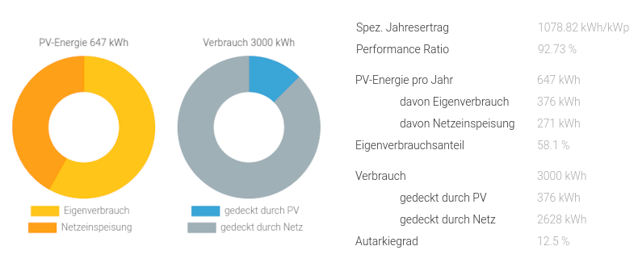
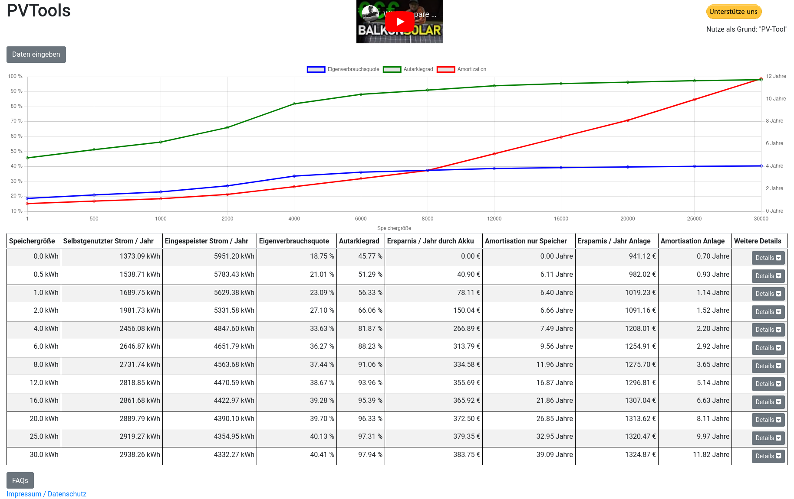

# (Gesamt-)Inhaltsverzeichnis {#Inhaltsverzeichnis}

-   [Hauptseite mit Zusammenfassung etc.](index.md)
-   [Photovoltaik und ihr möglicher Ertrag](PV.md)
-   [Stromverbrauch und Einspeisung im Haushalt](SV.md)
-   [Eigenverbrauch und seine Berechnung](#Eigenverbrauch)
    -   [Typische Rentabilität kleiner PV-Anlagen](#rentabel)
    -   [Online-Berechnung](#online)
        - [Stecker-Solar-Simulator und Unabhängigkeitsrechner](#HTW)
        - [PV*SOL](#PVSOL)
        - [PVTool@AkkuDoktor](#PVTool)
        - [brodsoft Stromverlauf](#brodsoft)
        - [PV Calculator](#PVCalculator)
    -   [Ökonomisch orientierte PV-Rechner](#PV-Rechner)
    -   [SolBatSim: Hochauflösende flexible Simulation](#SolBatSim)
-   [Nutzungsvarianten](SSG.md)
    -   [Direkte Netzeinspeisung (Steckersolargerät SSG, „Balkonkraftwerk“)](SSG.md#SSG)
    -   [Hausnetzeinspeisung mit Pufferspeicher](Speicher.md)
    -   [Inselanlage (mit Speicher) und Kombination](Insel.md)
-   [Auswahl und Nutzung von Komponenten](Komp.md)
-   [Beispiel-Konfigurationen](Bsp.md)

Eigenverbrauch und seine Berechnung {#Eigenverbrauch}
-----------------------------------------------------

Wer privat eine PV-Anlage betreibt, möchte möglichst viel von ihrem Ertrag
auch selbst verbrauchen, und zwar am besten direkt. Überschüssigen Strom in
einer Batterie für spätere Nutzung [zwischenzuspeichern](Speicher.md)
ist technisch aufwendig, teuer und mit zusätzlichen Verlusten behaftet.

Der *Eigenverbrauch* über einen gegebenen Zeitraum bestimmt sich
als Integral (bzw. näherungsweise als Riemann-Summe) über

min(PV-Leistung(t) + Speicher-Entnahmeleistung(t), Haushaltslast(t))

wobei PV-Leistung(t) die im Zeitpunkt t vom Wechselrichter abgegebene Leistung
ist, Speicher-Entnahmeleistung(t) die einem ggf. vorhandenen Speicher entnommene
Leistung (gemessen ebenfalls am Ausgang des jeweiligen Wechselrichters) und
Haushaltslast(t) die im Zeitpunkt t insgesamt vom Haushalt benötigte Leistung.\
Meist kann man die Haushaltslast nicht direkt messen, weil Wechselrichter
üblicherweise hinter dem Messpunkt für die [Gesamt-Strommessung](SV.md#Gesamtstrom)
einspeisen. Weil erzeugte oder einem Speicher entnommene Leistung dann
mit umgekehrten Vorzeichen in den Leistungssaldo am Unterverteiler eingeht,
errechnet sich die Last
* ohne Speicher und bei DC-gekoppeltem Speicher
als Summe aus dem Gesamt-Leistungssaldo am Unterverteiler
  und der Ausgangsleistung des Wechselrichters, bzw.
* bei AC-gekoppeltem Speicher
  als Summe aus Gesamt-Leistungssaldo, Ausgangsleistung des PV-Wechselrichters
  und Ausgangsleistung des Batterie-Wechselrichters,
  abzüglich Eingangsleistung des Ladegeräts.

Wenn die Daten eines [Zweirichtungszählers](SV.md#Stromzähler) vorliegen, lässt sich
der Eigenverbrauch einfach durch die Differenz aus PV-Nettoertrag (+ ggf. einem
Speicher entnommene Energie) und extern eingespeister Energie berechnen.

Der direkte (nicht ggf. über einen Speicher erhöhte) PV-Eigenverbrauch ergibt
sich, wenn in der Berechnung die Speicher-Entnahme durch 0 ersetzt wird.

Der nicht selbst genutzte Anteil, also die &mdash; stets nicht-negative &mdash;
Differenz aus PV-Leistung (+ Speicher-Entnahmeleistung) und
davon selbst verwendeter Leistung, wird meist ins externe Netz eingespeist.
Bei Steckersolargeräten geschieht dies ohne Vergütung,
aber auch wenn man selbst erzeugten Strom als Kleinunternehmer verkauft,
hat man zusätzliche Bürokratie und bekommt ziemlich wenig heraus.

Ökonomisches Ziel ist also, den Eigenverbrauchsanteil zu maximieren.
Der *Eigenverbrauchsanteil* (*Nutzungsgrad*) ist
der Anteil der Netto-Stromerzeugung, der direkt verbraucht wird
(oder ggf. nach gewissen Verlusten über einen Speicher).
Je höher er ist, desto weniger Energie wird ins externe Stromnetz eingespeist.
Je kleiner die Anlage ist, umso leichter kann man eine hohe Eigenverbrauchsquote
erreichen, allerdings dann bei entsprechend kleinerem Stromvolumen.

Damit verwandt ist der *Eigendeckungsanteil* (*Selbstversorgungsgrad*), also der
Anteil des Eigenverbrauchs (ggf. mit Batterieentladung abzüglich Ladeverlusten)
am Gesamtverbrauch.
Je höher er ist, desto weniger Energie muss von extern bezogen werden.
Er wird oft auch als
[*Autarkiegrad*](https://klarsolar.de/unterschied-eigenverbrauch-autarkie/)
bezeichnet, was etwas irreführend ist, denn typischerweise arbeitet
der Wechselrichter der PV-Anlage auch dann nicht ohne Verbindung zum Netzstrom,
wenn gerade kein *Netzbezug* (also Stromfluss von außen) stattfindet.
Je größer die Anlage ist, umso höher fällt der Autarkiegrad aus,
allerdings oft zu Lasten des Eigendeckungsanteils.
Eine Quasi-Autarkie (Eigendeckungsanteil 100%)
kann man aber nur mit enormer Stromspeicher-Kapazität erreichen.

[{:.center}](
https://klarsolar.de/wp-content/uploads/2022/10/Eigenverbrauchsanteil-bei-einer-7kWp-Anlage-mit-5kW-Speicher.pnghttps://klarsolar.de/unterschied-eigenverbrauch-autarkie/)
Das Bild veranschaulicht den typischen Stromverlauf bei einer Hausdach-PV-Anlage
mit 7kWp Nennleistung und 5kWh Stromspeicher an einem ziemlich sonnigen Tag mit
mittags etwas Wolken. Weitere schöne Erklärungen mit Grafiken gibt es
[hier](https://brodsoft.de/stromverlauf/pages/simulation).

### Typische Rentabilität kleiner PV-Anlagen {#rentabel}

Wenn die Einsparung an Stromkosten durch eine PV-Anlage die Kosten eingeholt hat,
hat sich die Anlage *amortisiert*, also die Investition kaufmännisch gelohnt.
Die Investition rentiert sich im Verhältnis der Jahres-Ersparnis zu den Kosten.

Wie eingangs geschrieben kann man bei optimaler Platzierung von Solarmodulen
pro Jahr etwa 1,1&nbsp;kWh Strommenge pro Wp installierter Solarleistung gewinnen.
Rechnen wir beispielsweise mit einer Investition für die PV-Anlage von 0,55€/Wp
(inklusive anteiliger Kosten für Wechselrichter, Montage, Reparatur, etc.),
dann ergeben sich einmalige Kosten von 0,5€ pro&nbsp;kWh Jahresertrag.\
Nehmen wir für die folgenden Beispiele zudem an, dass der sog. *Arbeitspreis*,
also die Kosten für vom Stromanbieter bezogenen Strom, 30&nbsp;ct/kWh beträgt.
Dann spart man also 0,30€ für jede kWh Strom, die von der PV-Anlage produziert
wird und die man auch selbst verbraucht, statt sie von außen einzukaufen.\
Anfang 2023 fiel in Deutschland die Mehrwertsteuer für die Komponenten kleiner
privaten PV-Anlagen weg, aber auch die Strompreise sanken im Frühjahr wieder auf
etwa 30&nbsp;ct/kWh. Außerdem wurden PV-Module und Mikrowechselrichter durch ein
globales Überangebot günstiger, so dass man Steckersolargeräte mit über
800&nbsp;Wp inzwischen für unter 400€ bekommt.

Eine Balkonanlage mit 850&nbsp;Wp Nennleistung kann einen Jahres-Bruttoertrag
von etwa 1080&nbsp;kWh erreichen, was bei 86% Gesamtsystem-Wirkungsgrad ca.
935&nbsp;kWh Netto-Ertrag (Einspeisung des Wechselrichters) pro Jahr bedeutet.
Wenn wir mit Kosten von 0,55€/Wp rechnen, ergibt das für diese Anlage 467,50€.

- Falls man den erzeugten PV-Strom komplett selbst verbraucht, was aber
praktisch kaum der Fall sein wird, ergäbe sich eine Einsparung von 280€
pro Jahr und somit eine Amortisation der Investition in nur 20 Monaten.
Die Rendite würde in diesem Fall satte 60% betragen.

- Bei einem durchschnittlichen Haushalts-Nutzungsprofil und Jahresverbrauch von
3000&nbsp;kWh liegt der selbst genutzte Ertrag bei etwa 620&nbsp;kWh pro Jahr.
Der Eigenverbrauchsanteil liegt also bei 67% des Nettoertrags
(und der Eigendeckungsanteil bei 21% des Verbrauchs).\
Damit werden bei 30&nbsp;ct/kWh Arbeitspreis jährlich 186€ eingespart.
Für die Investition von 467,50€ ergibt sich eine Amortisationszeit
von 2,5 Jahren und eine immer noch ausgezeichnete Rendite von 40%.

[//]: #
<!--
./Solar.pl Lastprofil_17_teils_31.csv 3000 Timeseries_48.215_11.727_SA2_1kWp_crystSi_14_35deg_0deg_2005_2020.csv 850 -peff 92
Lastprofil-Datei            : Lastprofil_17_teils_31.csv
Nächtliche Durchschnittslast=  189 W von 0 bis 6 Uhr
Minimallast (Grundlast)     =   10 W am *-06-15 um 05:22
Maximallast                 =11028 W am *-12-03 um 14:44

PV-Nennleistung             =  850 Wp
Max. PV-Bruttoleistung      =  920 W am 2020-03-23 um 12h
PV-Bruttoertrag             = 1083 kWh
PV-DC-Ertrag                =  996 kWh, PV-System-Wirkungsgrad 92%
PV-Nettoertrag              =  936 kWh bei Wechselrichter-Wirkungsgrad 94%
Max. PV-Nettoleistung       =  796 W am 2020-03-23 um 12h

Verbrauch                   = 3000 kWh über ein Jahr
PV-Eigenverbrauch           =  623 kWh
PV-Überschuss               =  313 kWh
Max. PV-Überschuss          = 4.05 kWh am 2020-03-24
Netzeinspeisung             =  313 kWh
PV-Eigenverbrauchsanteil    =   67 % des PV-Nettoertrags (Nutzungsgrad)
Eigendeckungsanteil         =   21 % des Verbrauchs (Autarkiegrad)

TODO check/update ./Solar.pl Lastprofil_4673_kWh.csv 3000 Timeseries_48.215_11.727_SA2_1kWp_crystSi_14_35deg_0deg_2005_2020.csv 600 -peff 92 -tmy
-->
<!--
Mittlere Last/Tag je Stunde = 210 175 162 160 171 224 307 339 351 365 366 381
                              383 365 362 361 395 450 509 538 516 464 382 284
Last-Anteil pro 3 Stunden   =  7%  7% 12% 14% 14% 15% 19% 14%
Last-Anteil pro Monat       = 10%  9%  9%  8%  8%  7%  7%  7%  7%  8%  9% 10%
Anteil pro Wochentag (Mo-So)= 14% 13% 13% 14% 15% 15% 16%

PV-Nominalleistung          =  600 Wp
Max. PV-Bruttoleistung      =  607 W am TMY (2008..2020)-04-15 um 13:00 h
PV-Bruttoertrag             =  764 kWh, PV-System-Wirkungsgrad 92%
Mittlere PV-Leistung je Std = 0 0 0 0 0 1 9 49 115 205 252 284 282 272 245 190 120 55 12 2 0 0 0 0
PV-Anteil pro 3 Stunden     =  0%  0%  8% 35% 38% 17%  1%  0%
PV-Anteil pro Monat         =  4%  5%  9% 12% 11% 11% 12% 11%  9%  7%  5%  4%
Max. PV-Nettoleistung       =  525 W am TMY (2008..2020)-04-15 um 13:00 h
PV-Nettoertrag              =  660 kWh bei Wechselrichter-Wirkungsgrad 94%

Verbrauch durch Haushalt    = 3000 kWh
PV-Eigenverbrauch           =  463 kWh
Netzeinspeisung             =  197 kWh
Mittlere Einspeisung je Std = 0 0 0 0 0 0 0 3 19 49 75 92 89 84 69 41 16 3 0 0 0 0 0 0
PV-Eigenverbrauchsanteil    =   70 % des Nettoertrags (Nutzungsgrad)
Eigendeckungsanteil         =   15 % des Verbrauchs (Autarkiegrad)

Bei Lastprofil_4685_kWh.csv Eigenverbrauch (509 kWh) 578 kW
TODO check/update ./Solar.pl Lastprofil_4685_kWh.csv 4685 Timeseries_48.215_11.727_SA2_1kWp_crystSi_14_35deg_0deg_2005_2020.csv 600 -peff 92 -tmy
PV-Nominalleistung          =  600 Wp
Max. PV-Bruttoleistung      =  607 W am TMY (2008..2020)-04-15 um 13:00 h
PV-Bruttoertrag             =  764 kWh, PV-System-Wirkungsgrad 92%
Max. PV-Nettoleistung       =  525 W am TMY (2008..2020)-04-15 um 13:00 h
PV-Nettoertrag              =  660 kWh bei Wechselrichter-Wirkungsgrad 94%

Verbrauch durch Haushalt    = 4685 kWh
PV-Eigenverbrauch           =  578 kWh
Netzeinspeisung             =   83 kWh
PV-Eigenverbrauchsanteil    =   87 % des Nettoertrags (Nutzungsgrad)
Eigendeckungsanteil         =   12 % des Verbrauchs (Autarkiegrad)

TODO check/update ./Solar.pl Lastprofil_H0_BDEW.csv 3000 Timeseries_48.215_11.727_SA2_1kWp_crystSi_14_35deg_0deg_2005_2020.csv 600 -peff 92 -tmy
Info: assuming Lastprofil_H0_BDEW.csv is a BDEW load profile
Mittlere Last/Tag je Stunde = 209 156 135 129 130 148 239 335 388 416 425 445
                              481 454 394 355 342 389 475 537 504 444 390 298
Last-Anteil pro 3 Stunden   =  6%  5% 12% 16% 16% 13% 18% 14%
Last-Anteil pro Monat       = 10%  9%  9%  8%  8%  7%  7%  7%  7%  8%  9% 10%
Anteil pro Wochentag (Mo-So)= 14% 14% 14% 14% 14% 16% 14%

PV-Nettoertrag              =  660 kWh bei PV-System-Eff. 92%, Wechselrichter-Eff. 94%
Verbrauch durch Haushalt    = 3000 kWh
PV-Eigenverbrauch           =  642 kWh
Netzeinspeisung             =   19 kWh
PV-Eigenverbrauchsanteil    =   97 % des Nettoertrags (Nutzungsgrad)
Eigendeckungsanteil         =   21 % des Verbrauchs (Autarkiegrad)

-->

- Bei einem hohen Jahresverbrauch von 6000&nbsp;kWh können durchschnittlich
sogar 800&nbsp;kWh im Jahr (also 86% des Nettoertrags) selbst genutzt werden.

[//]: #
<!--
./Solar.pl Lastprofil_17_teils_31.csv 6000 Timeseries_48.215_11.727_SA2_1kWp_crystSi_14_35deg_0deg_2005_2020.csv 850 -peff 92 

Verbrauch                   = 6000 kWh über ein Jahr
PV-Eigenverbrauch           =  801 kWh
Netzeinspeisung             =  136 kWh
PV-Eigenverbrauchsanteil    =   86 % des PV-Nettoertrags (Nutzungsgrad)
Eigendeckungsanteil         =   13 % des Verbrauchs (Autarkiegrad)
-->

- Bei geringem Jahresverbrauch von 1500&nbsp;kWh können durchschnittlich nur
430&nbsp;kWh im Jahr (also 46% des Nettoertrags) selbst genutzt werden.

[//]: #
<!--
./Solar.pl Lastprofil_17_teils_31.csv 1500 Timeseries_48.215_11.727_SA2_1kWp_crystSi_14_35deg_0deg_2005_2020.csv 850 -peff 92
Verbrauch                   = 1500 kWh über ein Jahr
PV-Eigenverbrauch           =  428 kWh
Netzeinspeisung             =  508 kWh
PV-Eigenverbrauchsanteil    =   46 % des PV-Nettoertrags (Nutzungsgrad)
Eigendeckungsanteil         =   29 % des Verbrauchs (Autarkiegrad)
-->

- Wenn bei 3000&nbsp;kWh Jahresverbrauch montags bis freitags von 8 bis 16 Uhr
nur eine konstante Last von 100&nbsp;W anfällt, liegt der Eigenverbrauch
entsprechend relativ gering bei 465&nbsp;kWh im Jahr (also 50% des Nettoertrags)
und die Amortisationszeit für die veranschlagten Kosten bei 3,3 Jahren.

In den beiden zuletzt genannten Fällen könnte man zwar überlegen, nur 1 PV-Modul
(statt 2) zu installieren, aber dann hätte man auch langfristig weniger Nutzen,
so dass das angesichts der geringen Kosten für PV-Module nicht ratsam wäre.

[//]: #
<!--
./Solar.pl Lastprofil_17_teils_31.csv 3000 Timeseries_48.215_11.727_SA2_1kWp_crystSi_14_35deg_0deg_2005_2020.csv 850 -peff 92 -load 83

Verbrauch                   = 3000 kWh über ein Jahr
Adaptierte konstante Last   =  100 W an Mo..Fr von 8 bis 16 Uhr
PV-Eigenverbrauch           =  465 kWh
Netzeinspeisung             =  472 kWh
PV-Eigenverbrauchsanteil    =   50 % des PV-Nettoertrags (Nutzungsgrad)
Eigendeckungsanteil         =   15 % des Verbrauchs (Autarkiegrad)
-->

Für die Amortisation des energetischen Aufwands
zur Herstellung einer Mini-PV-Anlage sollte man nach [Angaben des DKE](
https://www.dke.de/de/arbeitsfelder/energy/mini-pv-anlage-solar-strom-balkon-nachhaltig-erzeugen)
allerdings noch 2-3 Jahre zusätzlich rechnen.
In die Gesamt-Ökobilanz einer PV-Anlage und ihrer Nutzung gehen natürlich
noch weitere Effekte ein, die sich aber kaum quantifizieren lassen.

### Online-Berechnung {#online}

Achtung: Die in diesem Abschnitt genannten Simulatoren
setzen bei Einsatz eines Pufferspeichers eine ideale Speicherstrategie voraus.
Ihre Ergebnisse **gelten nicht bei Verwendung einer primitiven Regelung**, wie
sie für [Steckersolargeräte mit Speicherbatterie](Speicher.md) typisch sind.
Für diese kann aber der [u.g. 'SolBatSim'](EV.md#SolBatSim) verwendet werden.

#### Stecker-Solar-Simulator und Unabhängigkeitsrechner {#HTW}

Der Eigendeckungsanteil und Eigenverbrauchsanteil lässt sich sehr einfach
näherungsweise mit dem „[Stecker-Solar-Simulator](
https://solar.htw-berlin.de/rechner/stecker-solar-simulator/)“
für Balkonkraftwerke bzw. dem „[Unabhängigkeitsrechner](
https://solar.htw-berlin.de/rechner/unabhaengigkeitsrechner/)“
für Hausdach-PV-Anlagen der HTW Berlin berechnen. Hier im Bild die Ausgabe
bei 3000&nbsp;kWh Jahres-Stromverbrauch, einem Strompreis von 40&nbsp;ct/kWh und für
PV-Module mit Südausrichtung, 35° Anstellwinkel (Neigung) und ohne Verschattung.

Beide Simulationen nutzen intern Daten der Wetterstation Lindenberg bei Berlin
aus dem Jahr 2017, in dem die Sonneneinstrahlung schwächer als normal war ---
für Süddeutschland kann man also gut 15% mehr PV-Leistung ansetzen. Als Eingabe
verwenden sie den >Jahresstromverbrauch (mit einer typischen Lastverteilung) und
die PV-Nennleistung (mit einem spezifischen PV-Jahresertrag von 1024&nbsp;kWh/kWp).
Man kann auch eine (nutzbare) Speicherkapazität angeben, wobei ein typischer
Wirkungsgrad für LiFePO4-Batterien von 95% und typische Wandlungsverluste
des Ladereglers und des Wechselrichters von jeweils 94% angenommen werden.
Implizit wird eine optimale bedarfsgerechte Lade-/Entladeregelung vorausgesetzt.

Der Unabhängigkeitsrechner liefert auch den Anteil der Batterieentladung an der
Stromversorgung, den man zur Ertrags- und [Wirtschaftlichkeitsberechnung von
PV-Speichern](https://www.youtube.com/watch?v=bE5fLy0w3MM&t=674s)
verwenden kann (und zwar durch Multiplikation mit dem Stromverbrauch).
Für Anlagen ohne Stromspeicher sind die Ergebnisse sehr realistisch.

#### PV*SOL {#PVSOL}

Von der sehr soliden kommerziellen
[Simulationssoftware PV*SOL](https://valentin-software.com/)
gibt es auch eine kostenlose
[Online-Variante](https://pvsol-online.valentin-software.com/).
Auch diese ist eigentlich für große Haus-PV-Anlagen gedacht, aber wenn man beim
Wechselrichter 'TSUN' auswählt, lässt sie sich für Balkonanlagen u.ä. verwenden,
geht aber von einem für Steckersolargeräte zu hohen System-Wirkungsgrad
(über 92%) aus.

Der mögliche Eigenverbrauch hängt natürlicherweise stark vom gewählten
Lastprofil ab. Mit der Auswahl '2 Personen mit einem Kind'
bekommt man Ergebnisse, die dem von der HTW Berlin verwendeten Durchschnitt
am nächsten kommen (aber etwas niedriger ausfallen).
<!-- Leider werden die Details der Lastprofile nicht offengelegt. -->

#### PVTool@AkkuDoktor {#PVTool}

Eine sehr einfache Möglichkeit, online die Amortisation zu berechnen, bietet
auch das [PVTool von „AkkuDoktor“](https://www.akkudoktor.net/pvtool-rechner/).
Als Besonderheit kann man hier schön sehen, wie sich Eigenverbrauchsquote,
Autarkiegrad und Amortisation in Abhängigkeit von der Anwesenheit und Kapazität
eines Stromspeichers ändern.

 <!-- Andreas Schmitz -->
Inzwischen kann man für die Simulation ein eigenes Lastprofil
(allerdings nur in Stundenauflösung) hochladen und verwenden lassen.\
Für Speicher wird stillschweigend eine [optimale lastbasierte Lade- und
Entladestrategie](https://github.com/nick81nrw/PVTools/issues/53) angenommen.
<!-- Es werden keine Speicherverluste berücksichtigt.-->
Die Lade- und Entlade-Wirkungsgrade der Speicherbatterie (inkl. Verluste während
der Speicherzeit) werden standardmäßig sehr hoch angenommenen: 99%.
Das mag für [DC-Kopplung](Speicher.md#Kopplung) passen, ist aber für AC-Kopplung
viel zu hoch, wobei man das in den erweiterten Einstellungen anpassen kann.\
Standardmäßig wird die Lade- und Entladeleistung etwas praxisfern nicht begrenzt,
was sich aber ebenfalls in den erweiterten Einstellungen korrigieren lässt.

Bis Anfang Dezember 2023 waren die Simulationsergebnisse v.A. ohne Speicher
und bei kleineren Speicherkapazitäten deutlich zu optimistisch.
Das lag v.A. daran, dass das [Standard-Haushalts-Lastprofil H0 des VDEW](
https://www.bdew.de/energie/standardlastprofile-strom/) (inzwischen: BDEW)
von 1996/97 verwendet wurde, und zwar auch nur in Stundenauflösung
(statt in der verfügbaren 15-minütigen Auflösung).
Damit konnten keinerlei Lastspitzen berücksichtigt werden,
wozu mindestens Minutenauflösung (besser: Sekundenauflösung) benötigt wird.\
Das wurde [deutlich verbessert](
https://www.akkudoktor.net/2023/12/11/pv-tool-grosses-update/).

Stand April 2024 gibt es allerdings noch
[Unklarheiten z.B. bei den Wirkungsgraden](
https://github.com/nick81nrw/PVTools/issues/11#issuecomment-1858879387),
[Merkwürdigkeiten wie kleine nächtliche PV-Erträge und konstante Netzbezüge](
https://github.com/nick81nrw/PVTools/issues/37) und
[eindeutige Fehler](https://github.com/nick81nrw/PVTools/issues/47).

#### brodsoft Stromverlauf {#brodsoft}

[{:.center}](
https://brodsoft.de/stromverlauf/profiles/simulation)
Eine ältere Simulation des Eigenverbrauchs für einen gegebenen PV-Nettoertrag
mit Fokus auf Stromspeicher (mit gegebener nutzbarer Kapazität und Effizienz),
gibt es von [brodsoft](https://brodsoft.de/stromverlauf/profiles/simulation).
Diese basiert auf realen Profildaten für PV-Erzeugung und Stromverbrauch,
mit denen die Berechnung auf Stundenbasis erfolgt.
Man kann sich in der Ausgabe auch für jeden Monat Grafiken ausgeben lassen
darauf sehr schön den Verlauf der elektrischen Größen ansehen.
Außerdem gibt es gute Info-Seite mit guten Erklärungen zu Eigenverbrauchsanteil
und Eigendeckungsanteil zu Strategien zu ihrer Optimierung.
Diese Simulation berechnet für die o.g. 600&nbsp;Wp Beispiel-Anlage je nach Auswahl
des Profils einen Eigenverbrauch von teils 601&nbsp;kWh (Profil „allgemein 13/14“)
und mehr, aber typischerweise eher 514&nbsp;kWh (Profil „InGe 16“) pro Jahr.

#### PV Calculator {#PVCalculator}

[{:.right width="400"}](
https://play.google.com/store/apps/details?id=com.pvstrom.pvcalculator)

Es gibt auch eine Android-App namens [PV Calculator](
https://play.google.com/store/apps/details?id=com.pvstrom.pvcalculator)
von SusEnergy mit sehr schöner Darstellung der Ergebnisse.
Sie verwendet die Daten von PVGIS und rechnet leider nur auf Stundenbasis.

Für die o.g. Beispiel-Anlage mit 850&nbsp;Wp kommt sie für die gegebenen
Wirkungsgrade auf einen zu geringen Jahres-Nettoertrag von 764&nbsp;kWh,
aber auf einen zu hohen Eigenverbrauch von 686&nbsp;kWh. Das liegt teils an den
angebotenen Profilen (z.B. VDEW-H0-Werktag), die eine sehr geringe zeitliche
Auflösung haben und täglich die gleiche Last annehmen, wobei man
in der Premium-Variante immerhin selbst welche pro Jahreszeit definieren kann.
Aber das Hauptproblem ist, dass die Last nur im stundenweisen Durchschnitt
betrachtet wird, also die typischen Lastspitzen unberücksichtigt bleiben.
Damit ergibt sich bei 3000&nbsp;kWh Jahres-Strombedarf für die meisten Profile
unrealistischerweise so gut wie keine Netzeinspeisung und selbst für das Profil
„Peak Morgen Abends“ eine viel zu niedrige Netzeinspeisung von 137&nbsp;kWh.
Außerdem wird etwas verwirrend im Gesamtergebnis nicht der resultierende
Eigenverbrauch (hier 627&nbsp;kWh) dargestellt,
sondern der Nettoertrag und der Netzbezug.

Man kann auch Speichernutzung mit simulieren lassen, aber die Ergebnisse können
schon wegen der stundenweisen Berechnung ebenfalls nicht realistisch sein.

Interessante Funktionen wie die Verwendung eigener Lastprofile
und der Export der Simulationsergebnisse sind inzwischen
der kostenpflichtigen Premium-Variante vorenthalten.

### Ökonomisch orientierte PV-Rechner {#PV-Rechner}

Für die rein kaufmännische Berechnung der Rendite einer PV-Anlage
und/oder Stromspeicher gibt es ein einfaches [Online-Tool namens *pvroi*](
https://r4nt.github.io/pvroi/?inflation=0.02&sell_price=0.082&initial_buy_price=0.35&show_panels=on&show_battery=on&panels_years=25&panels_initial_output_pa=900&panels_self_use=0.25&panels_decay=0.8&panels_select_method=irr_from_price&panels_price=1800&panels_irr=&battery_years=10&battery_contribution=8400&battery_output_per_kwh=0.8&battery_decay=0.8&battery_select_method=irr_from_price&battery_price=13000&battery_irr=0.06)
auf Englisch. Es berücksichtigt Inflation und Degradation,
aber keine darüber hinausgehende Reparaturen bzw. Abschreibung.
Als Ergebnis bekommt man entweder für gegebenen Preis die jährliche Rendite in %
(und kann dann vergleichen, ob die Investition mehr bringt als eine andere)
oder umgekehrt: Für eine Wunsch-Rendite den Maximalpreis für die Komponenten.

<!--
Zyklenzahl pro Jahr = EV-Steigerung pro Jahr / Speicher-Wirkungsgrad / ( Kapazität * Entladetiefe )
Gesamt-EV-Steigerung = EV-Steigerung pro Jahr * Lebensdauer
Gesamt-Speicherertrag = Gesamt-EV-Steigerung * (Strompreis - Einspeisevergütung  / Speicher-Wirkungsgrad)
break-even: Speicherkosten = Gesamt-Speicherertrag

Zyklenzahl pro Jahr =
Speicherkosten / (Strompreis - Einspeisevergütung/Speicher-Wirkungsgrad)
/ Lebensdauer / Speicher-Wirkungsgrad / ( Kapazität * Entladetiefe )

EV-Steigerung pro Jahr  =
Speicherkosten / (Strompreis - Einspeisevergütung/Speicher-Wirkungsgrad)
/ Lebensdauer
-->

Die Offline-Tabellenkalkulation [*PV-Rechner*](PV-Rechner_v6+.xls)
hat als besonderen Schwerpunkt die kaufmännische Betrachtung inklusive Rendite
und Kapitalkosten unter Berücksichtigung von Abschreibung für Reparaturen u.ä.
Er ist für „große“ PV-Anlagen auf Hausdächern konzipiert, und behandelt optional
gesondert das Laden eines E-Fahrzeugs<!-- (was normalerweise öfter zu
Sonnenscheinzeiten erfolgen kann)-->, den Betrieb einer Wärmepumpe und
die Nutzung eines Stromspeichers, funktioniert aber auch für Steckersolargeräte.
Als Eingabe erwartet er u.A. den spezifischen PV-Jahresertrag, die Ausrichtung
der Module und den geschätzten Anteil des während der Sonnenscheindauer
im Haushalt nutzbaren Ertrages.
Energieflüsse werden der Einfachheit halber nur grob auf Monatsbasis gerechnet,
so dass wichtige tageszeitliche Effekte und Lastspitzen nicht berücksichtigt
werden. Besonders die Simulation des Stromspeichers ist stark idealisiert.

[{:.center}](PV-Rechner_v6+.xls)

Bei der o.g. typischen Balkonanlage für 660€ mit 600&nbsp;Wp und 660&nbsp;kWh Jahresertrag
ergibt sich mit dem PV-Rechner für einen Haushalt mit 3000&nbsp;kWh Jahresverbrauch,
der zu 28% während der Haupt-Sonnenscheinzeiten erfolgt,
ein etwas zu optimistischer Solarstrom-Eigenverbrauch von etwa 530&nbsp;kWh pro Jahr.
Damit könnte man bei 40&nbsp;ct/kWh jährlich ca. 205€ Stromkosten einsparen, was eine
Amortisationszeit von 3,2 Jahren und eine satte (Anfangs-)Rendite von 26% ergäbe.

Hinweis: Der PV-Rechner stammt von [Falko (bonotos)](https://www.bonotos.com/)
Der originale beinhaltet auch seiner letzten Version 22-06 einen groben Fehler
in der Rendite-Formel, der zu (fast) doppelt überhöhten Rendite-Zahlen führt.
Ich habe mich mit Falko zu diesen und anderen Punkten ausgetauscht.
Er möchte an dem Tool nichts mehr machen.
So stelle ich hier eine verbesserte und etwas erweiterte Version zur Verfügung.

### SolBatSim: Hochauflösende flexible Simulation {#SolBatSim}

[*SolBatSim*](https://github.com/DDvO/SolBatSim),
ein selbst entwickelter Simulator, basiert auf Lastprofilen
des Stromverbrauchs mit mindestens stündlicher, aber besser minütlicher
(oder noch höherer) Auflösung. Daher und weil er die verschiedenen
Arten von möglichen Verlusten differenziert berücksichtigt
kommt er auf sehr realistische Ergebnisse.
Aufgrund seiner großen Flexibilität deckt er fast alle üblichen Situationen ab.
Aus diesen Gründen ist er auch als Referenz für andere Simulationen verwendbar.

Für die [o.g. Beispiel-Anlage](EV.md#rentabel) für den Raum München mit 600&nbsp;Wp
und einem  PV-Nettoertrag (nach Wechselrichter-Verlusten) von etwa 662&nbsp;kWh
ergibt sich mit dieser Simulation unter Verwendung minutengenauer Lastprofile
ohne Speicher je nach Profil ein Eigenverbrauch von ca. 460&nbsp;kWh.

Das Ergebnis fällt nicht so günstig wie bei den zuvor genannten Simulationen
aus, v.A. weil hier die in der Praxis relativ häufigen Lastspitzen immerhin im
Minutenbereich berücksichtigt werden, die von einer Mini-Solaranlage praktisch
kaum abgefangen werden können, so dass der Eigenverbrauchsanteil geringer ist
als bei einer über Stunden oder gar ganze Monate gemittelten Betrachtung.

<!-- TODO: Testbeispiele in Solar.txt durchgehen -->   
<!-- TODO: CSV_74_Loadprofiles_1s_W_var.zip verwenden -->   
Vergleichsrechnungen auf Grundlage eines Lastprofils mit (annähernd)
sekündlicher Auflösung haben ergeben, dass die Lastspitzen nur teilweise einen
spürbaren Einfluss auf die Nutzbarkeit des PV-Ertrags von kleinen Anlagen haben.
Bei 600&nbsp;Wp sind die Eigenverbrauchs-Ergebnisse bei Lastdaten auf Stundenbasis
etwa 3 bis 6% zu optimistisch, auf Minutenbasis nur bis etwa 1%.
<!-- bei 3000 kWh: 593 562 557  6%   bei 6000 kWh: 630 623 622  1% -->

<!--
Local IspellDict: german8
LocalWords: title keywords toc start refresh markdown pandoc width style margin
LocalWords: zusammenfassung Messgeraet CC BY Std webp Ferrariszaehler IAMKlaus
LocalWords: Unabhaengigkeitsrechner Stromwaechter Play SDM clams comment fazit
LocalWords: output calculation power unit rating Europe TSUN InGe DPM anker only
LocalWords: left right irradiance GHI buehneTop clear both png tgl RS solix eArc
LocalWords: potential csv grid tie inverter tmy peff ieff curb WiFi align Naja
LocalWords: standby xls jpg Balkonsolar center limiter off to html Rs Controler
LocalWords: blackout brownout panels busbars shingle panel up number solarbank
LocalWords: maximum point tracking sine wave efficiency boost true SG Shellys DL
LocalWords: converter step consumption pdf balancer equalizer mppt em Script
LocalWords: buck down SA SZ DW MQ EC LF small LY KREE Battery test br ATON Full
LocalWords: Charger Discharger Board Under Over Voltage Protection sub cpp img
LocalWords: Speicherungs current  Regelungs Eigenverbrauchsv WSW if PowerLimiter
LocalWords: telemetry gateway distort cell document sections profile Passthrough
LocalWords: post text standard conditions Reflexions PVSOL SOL assuming MG Stick
LocalWords: operating temperature Timeseries crystSi PVCalculator and NPB Komp
LocalWords: with entnahme bend OSO SSW SSO ready anlagen plugin date int limits
LocalWords: author today abstract This the ignored extension yaml txt interface
LocalWords: metadata add Austria description bagatellgrenze Loadprofiles
LocalWords: Yong Hui Green SolarPower backup net metering MPP Tracker SusEnergy
LocalWords: created changed nbsp pvroi ac dc break even fig SoC DoD MW Premium
LocalWords: Sense is end index output md ref of pv px Eff vs discussioncomment
LocalWords: my var pl zip load capacity feed spill deg magazine OC SC
LocalWords: data transfer solar cut cells open short circuit voltage lim
LocalWords: Ruecklaufsperre mdash Ueberlastung overpaneling LocalWords OW Heat
LocalWords: Bestrahlungsstaerke curves under different levels irradiation state
LocalWords: Microinverter What are Amps Volts SMF charge discharge Un Ent shunt
LocalWords: protector Micro Eco Worthy ISolar SPH GYVRM Cocar version cron job
LocalWords: Delivered Latest Downgraded shelly emeter file status returned MYPV
LocalWords: Zweirichtungszaehler issuecomment collect Notifications height ELWA
LocalWords: Plugs comments January Settings ons configuration states excl comp
LocalWords: sensor export float uksa tamorix custom firmware en Central zell TR
LocalWords: 
-->
