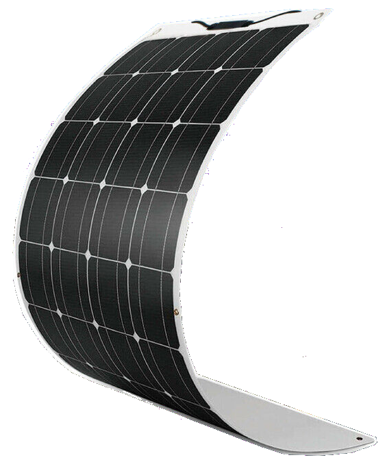
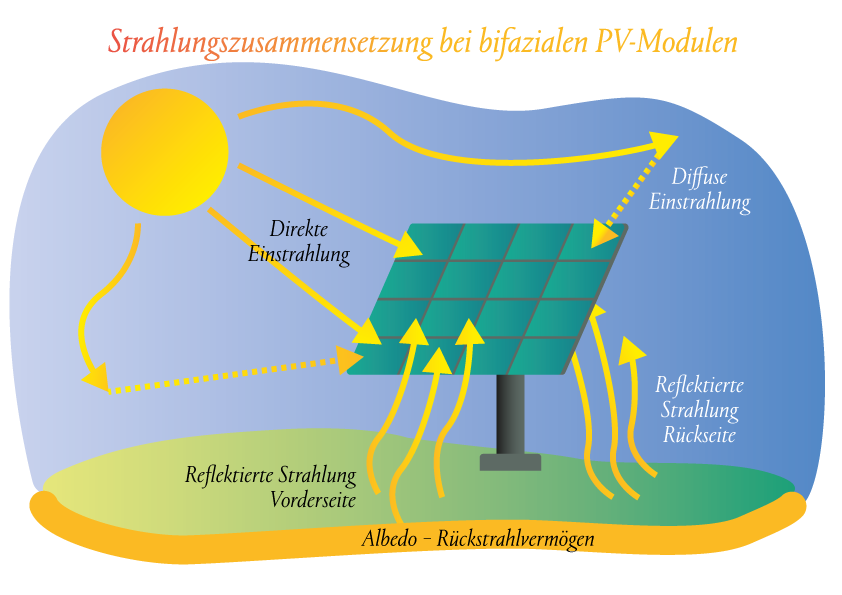
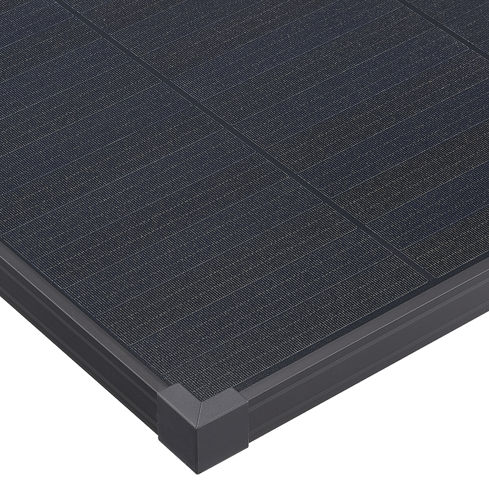
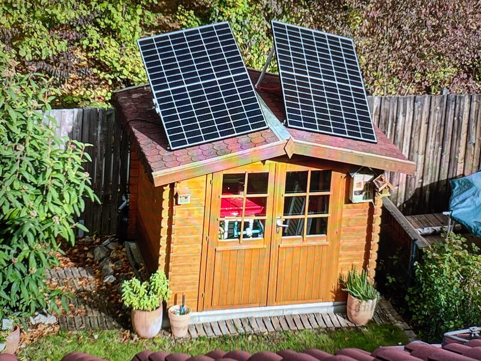
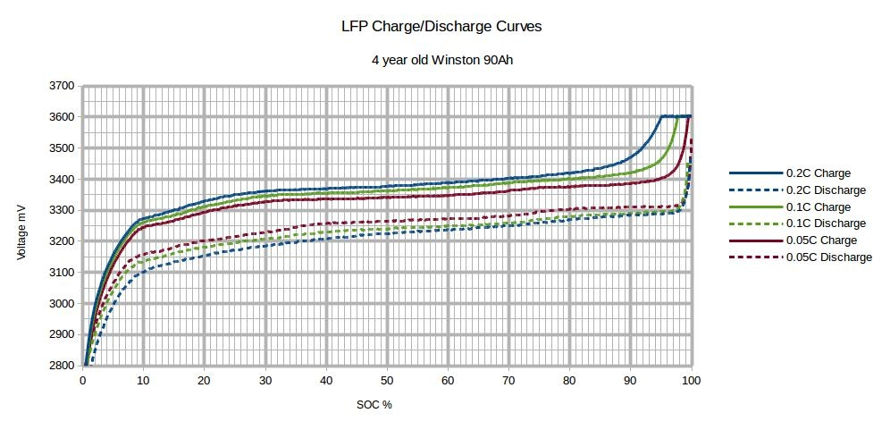

# (Gesamt-)Inhaltsverzeichnis {#Inhaltsverzeichnis}

-   [Hauptseite mit Zusammenfassung etc.](index.md)
-   [Photovoltaik und ihr möglicher Ertrag](PV.md)
-   [Stromverbrauch und Einspeisung im Haushalt](SV.md)
-   [Eigenverbrauch und seine Berechnung](EV.md)
-   [Nutzungsvarianten](SSG.md)
    -   [Direkte Netzeinspeisung (Steckersolargerät SSG, „Balkonkraftwerk“)](SSG.md#SSG)
    -   [Hausnetzeinspeisung mit Batteriepuffer](Speicher.md)
    -   [Inselanlage (mit Batteriespeicherung) und Kombination](Insel.md)
-   [Auswahl und Nutzung von Komponenten](#Komponenten)
    -   [PV-Module](#PV-Module)
        - [Elektrischer Anschluss](#Anschluss)
        - [Anbringung und Rechtliches](#Anbringung)
    -   [Mikrowechselrichter und andere Stromrichter](#Stromrichter)
        - [MPPT-Solarregler](#MPPT)
        - [Solar-Laderegler](#Laderegler)
        - [Wechselrichter](#Wechselrichter)
        - [Netzwechselrichter](#Netzwechselrichter)
        - [Inselwechselrichter](#Inselwechselrichter)
        - [Hybridgeräte: Solar-Laderegler mit Wechselrichter](#Hybrid)
        - [Gleichspannungswandler](#Gleichspannungswandler)
    -   [Speicherbatterien](#Speicherbatterien)
        - [Batterie-Ladezustand](#Ladezustand)
        - [Batterie-Kapazität](#Kapazität)
        - [Batterie-Strukturierung](#Strukturierung)
        - [Kombination aus Batterie und Wechselrichter](#Kaskadierte)
        - [Tiefsetzsteller](#Tiefsetzsteller)
        - [Spannungswächter](#Spannungswächter)
-   [Beispiel-Konfigurationen](Bsp.md)

Auswahl und Nutzung von Komponenten {#Komponenten}
--------------------------------------------------

### PV-Module {#PV-Module}

Solarmodule (engl. _solar panels_) werden intern aus vielen in Reihe
geschalteten Solarzellen zusammengesetzt, die Sonnenlicht in Gleichstrom
umwandeln.

{:.right width="550"}
Bei den üblichen Silizium-Solarzellen steigt der entnehmbare Strom
(Kurzschlussstrom) linear mit der Bestrahlungsstärke. Ihre
Leerlaufspannung hingegen steigt schon bei geringer Helligkeit stark an
und nähert sich dann nur noch langsam steigend dem Wert 0,63&nbsp;V.

Generell sind *monokristalline* Zellen zu bevorzugen, auch wenn sie ein wenig
teurer sind als *polykristalline* oder *amorphe*, weil sie einen höheren
Wirkungsgrad haben.

{:.center}
Leider bricht die Leistung von in Reihe geschalteten Zellen ein, sobald auch
nur eine davon verschattet wird. Daher werden in den üblichen größeren Modulen
sog. *Bypass-Dioden* eingesetzt, die bei *Teilverschattung* immerhin einen
Teil der Leistung fließen lassen.

In vielen PV-Modulen werden inzwischen sog.
[*Halbzellen*](https://gruenes.haus/halbzellenmodule/) (engl. *half cut cells*)
in doppelter Anzahl verwendet. Durch die Halbierung der Größe fließt durch
sie nur halb so viel Strom, was die inneren elektrischen Verluste verringert
und damit die [Leistung um 2 bis 3 Prozentpunkte erhöht](
https://www.energie-experten.org/erneuerbare-energien/photovoltaik/solarmodule/halbzellen).
Entsprechend größer ist der Effekt bei [Modulen aus Drittelzellen](
https://www.csp.fraunhofer.de/content/dam/imws/csp/de/documents/Modultechnologie/Produktblatt/Drittelzellenmodul/FhG-CSP_Drittelzellenmodul_DE.pdf).

{:.center}
Bei Halbzellenmodulen und noch mehr bei Drittelzellenmodulen
verringert sich durch geschickte interne Parallelschaltung von Zellsträngen
die Empfindlichkeit auf Teilverschattung.

{:width="442"}
{:.right width="342"}
[Klassische Solarmodule](https://gruenes.haus/pv-modul-groesse-gewicht/) haben
einen Aluminiumrahmen und eine Größe von typischerweise ca. 1,7&nbsp;m × 1&nbsp;m × 3&nbsp;cm,
was eine Nennleistung von etwa 350&nbsp;Wp ergibt, und eine Masse von ca. 20&nbsp;kg.\
Die günstigeren herkömmlichen Module haben auf der Vorderseite Glasscheibe
und auf der Rückseite eine Folie und werden daher Glas-Folien-Module genannt.
Für die Montage auf stabilen Flächen (z.B. Hausdach) gelten sie als ausreichend.
[Glas-Glas-Module](
https://solarenergie.de/solarmodule/arten/glas-glas-solarmodule)
sind robuster und langlebiger, allerdings auch etwas teurer und schwerer.
Wegen meist dünnerem Glas auf der Vorderseite und besserer Wärmeableitung
auf der Rückseite sind sie ein wenig effizienter als Glas-Folien-Module.

[{:.right width="550"}](
https://www.roedl.de/themen/erneuerbare-energien/2020-08/vertikale-bifaziale-photovoltaiksysteme-potenzial-landwirtschaft)
Eine besondere Variante der Glas-Glas-Module sind [bifaziale Module](
https://www.energie-experten.org/erneuerbare-energien/solarenergie/solarzelle/bifacial),
also „zweigesichtige“ Module, welche einfallendes Licht nicht nur auf ihrer
Vorderseite nutzen können, sondern in einem gewissen Maß auch gestreutes Licht
auf ihrer Rückseite --- natürlich nur, wenn sie geeignet montiert sind.
Günstig ist in diesem Fall eine hohe *Albedo* der Flächen hinter den Modulen,
also ein möglichst hohes Reflexions- oder Rückstrahlvermögen der Oberflächen.

{:style="clear:both"}

(Semi-)Flexible Module sind teurer und gelten (bis auf Ausnahmen) als weniger
langlebig als starre, aber viel leichter und nur wenige Millimeter dick.
Sie sind meist auch wesentlich kleiner --- üblicherweise 1,2&nbsp;m × 0,5&nbsp;m
bei einer Nennleistung von 100&nbsp;Wp und einer Masse von 1 bis 2&nbsp;kg. Vorsicht, bei
flexiblen Modulen übertreiben Händler besonders gern mit den Leistungsdaten.\
[Hier](https://solar-generatoren.de/die-richtigen-solarmodule-fuers-wohnmobil/)
ein Vergleich verschiedener Solarmodul-Typen in Hinblick auf die
Verwendung für Wohnmobile.

{:width="392"}
{:.right width="392"}
Technisch besonders interessant finde ich die überlappende Anordnung und direkte
Verschaltung von Solarzellen ohne Stromschienen (engl. _busbars_) in
[*Schindel-Modulen*](https://www.strom-forschung.de/aktuelles/news/2022/schindel-solarmodule-innovativ-verschaltet-und-industriell-herstellbar)
(engl. _SSP_ = _shingle solar panel_). Dadurch steigt der Wirkungsgrad, weil
die Fläche besser genutzt wird und bei Teilverschattung und Wärme die
Verluste verringert werden. Allerdings ist diese Bauart selten zu finden
und verhältnismäßig teuer, so dass sie nur dann sinnvoll ist, wenn man
Platz sparen will/muss.

#### Elektrischer Anschluss {#Anschluss}

Solarmodule haben als Stromanschluss meist die praktischen MC4-Steckverbinder.
Diese sind einpolig, aber insofern verpolungssicher, dass per Konvention
auf Seite der Stromquelle für den Pluspol ein (männlicher) Stecker
und für den Minuspol eine Buchse (als ein weiblicher Verbinder) verwendet wird.
Allerdings ist unsinnigerweise auf allen MC4-Steckern ein "+" aufgeprägt
und auf allen MC4-Buchsen ein "-", was für PV-Module passt, aber
für den Wechselrichters (also auf Seite des Verbrauchers) genau verkehrt ist.
{:width="720"}
<!-- https://www.photovoltaikforum.com/thread/159926-hoymiles-300-polarit%C3%A4t-falsch-beschriftet/?postID=3585375#post3585375 -->

Generell sollten die Solarkabel, also die Verbindungen der Module
(untereinander und zum [Solarregler bzw. Wechselrichter](#Stromrichter)),
möglichst kurz sein, weil da relativ hohe Ströme fließen,
was proportional zur Länge zu spürbaren Verlusten führt.
Aus dem selben Grund sollte der [Leitungsquerschnitt](
https://electronicbase.net/de/leitungsquerschnitt-berechnen/)
nicht zu klein sein --- mindestens 4&nbsp;mm², bei längeren Kabeln
und höheren Strömen eher 6&nbsp;mm² (was allerdings teurer ist).

Wer keine Außensteckdose hat und kein Loch durch die Außenwand bohren will bzw.
darf, kann eine kleine PV-Anlage auf dem Balkon oder im Garten auch über ein
Fenster oder eine Tür mit einem Flachbandkabel (z.B. [MC4-Fensterdurchführung](
https://solarmodule-gladbeck.de/produkt/solar-mc4-fensterdurchfuehrung/?sld=3)
oder [selbst gebaut](https://www.youtube.com/watch?v=S7qKzvbc_Gg))
anschließen. Das kann auch dann interessant sein, wenn man einen
[DC-gekoppelten](index.md#Ladung) Speicher nicht außerhalb der Wohnung platzieren will.

Solarmodule kann man wie Batteriezellen [seriell und/oder parallel](
https://photovoltaik-guru.de/module/reihenschaltung-und-parallelschaltung-elektronik-kurz-erklaert.html),
verbinden, um mehr Leistung zu erhalten, ohne für jedes Modul
einen eigenen [Regler](#MPPT) bzw. Regler-Eingang verwenden zu müssen.
Dabei sollten die Module den gleichen Strom bzw. ungefähr die gleiche Spannung
liefern, weil es sonst Verluste gibt.\
Wenige große Solarmodule sind technisch und wirtschaftlich typischerweise
etwas günstiger als entsprechend viele kleine.

-   Bei [*Reihenschaltung*](https://de.wikipedia.org/wiki/Reihenschaltung) (oft
    auch *Serienschaltung* genannt) hängt man die Module einfach hintereinander,
    wobei sich die Spannungen der einzelnen Module addieren
    und der Gesamtstrom sich aus dem Minimum der möglichen Einzelströme ergibt.

    Der wesentliche Vorteil gegenüber der Parallelschaltung ist, dass
    der Strom in den Kabeln und der damit verbundene Verlust nicht steigt.

    Ein wesentlicher Nachteil der Reihenschaltung ist,
    dass es dabei viel leichter zu [Verlusten durch Teilverschattung](
    https://photovoltaikbuero.de/pv-know-how-blog/teilverschattung-bei-solarmodulen-messungen/)
    kommt, weil der Gesamtstrom und damit die Gesamtleistung einbricht,
    sobald auch nur eines der Module verschattet wird.
    Aus diesem Grund sollten nur gleichartige Module in Reihe geschaltet werden,
    die zudem gleich ausgerichtet sind und nur gleich(zeitig) verschattet werden,
    wobei hier [Bypass-Dioden](#PV-Module) eine gewisse Abhilfe schaffen.

-   Bei [*Parallelschaltung*](https://de.wikipedia.org/wiki/Parallelschaltung)
    addieren sich die Ströme der einzelnen Module bzw. parallelen Modulstränge.
    Weil dabei der Teil mit der geringsten Spannung alle anderen auf sein Niveau
    herunterzieht, sollten die zusammenzuschaltenden Spannungen etwa gleich sein.

    Der elektrische Verlust ist größer als bei Reihenschaltung, andererseits
    gibt es deutlich weniger Verluste durch Verschattung einzelner Module
    bzw. Modul-Stränge, weil die Modulspannungen bei Verschattung kaum abnehmen
    und somit ein verschatteter Strang die Spannung anderer unverschatteter
    parallele Stränge kaum herunterzieht.

    Wenn in einem Strang mindestens zwei Module in Reihe geschaltet sind,
    kann es bei Kurzschluss eines Moduls (etwa durch einen Defekt, aber sehr
    unwahrscheinlich) zu einem Rückstrom über andere parallele Stränge kommen.
    Wenn es mindestens zwei andere Stränge gibt, kann der so groß sein,
    dass die übrigen Module des ersten Strangs überhitzen und zerstört werden.
    Deswegen werden in einem solchen Szenario Sicherungen oder
    sog. *Strangdioden* (auch *Stringdioden* oder *Sperrdioden* genannt)
    [empfohlen](https://files.sma.de/downloads/Rueckstrom-UDE083010.pdf).\
    Wenn bei einem Balkonkraftwerk PV-Module nur parallel angeschlossen werden,
    kann das allerdings nicht passieren, und dann wäre die Verwendung von Dioden
    sogar kontraproduktiv, weil sie zu einem gewissen Leistungsverlust führen.

    Für die parallele Verschaltung bieten sich Y-Kabel mit MC4-Anschlüssen an.
    Die Kabel auf parallelen Zweigen sollten möglichst kurz und ungefähr gleich
    lang sein, damit nicht zusätzliche Verluste durch unterschiedlichen
    Spannungsabfall entstehen.

    [Hier](
    https://www.photovoltaikforum.com/core/article/49-ost-west-anlage-mit-einem-wechselrichter/)
    ein schöner Artikel für eine klassische Anwendung der Parallelschaltung:
    geteilte Ost-West-Ausrichtung von PV-Modulen auf einem Hausdach
    oder um den Ertrag über den Tag möglichst gleichmäßig zu verteilen,
    ohne dafür unbedingt mehr als einen [MPPT](#MPPT)-Eingang zu benötigen.

Generell **muss man tunlichst darauf achten**, dass an jedem Eingang eines
[Ladereglers oder Wechselrichters](#Stromrichter) die Spannung die erlaubte
maximale Eingangsspannung (*VDC max*) des Geräts nicht überschreiten
kann, weil dieses sonst leicht zerstört wird.
Die maximale Spannung eines PV-Moduls wird durch die im Datenblatt angegebene
(*Leerlaufspannung*, engl. *open-circuit voltage, VOC*) gegeben.
Die erlaubte Eingangsspannung muss nicht nur bei [*Normalbedingungen (NOCT)*](
https://photovoltaiksolarstrom.com/photovoltaiklexikon/noct/)
mit 45°C Betriebstemperatur bzw. idealisierten Standard-Testbedingungen (STC)
mit 25°C eingehalten werden, sondern auch bei sehr niedrigen Temperaturen, wo
die Modulspannung je nach Temperaturkoeffizient etwa 10 bis 20% höher sein kann.
Allerdings werden PV-Module gerade im Winter durch den niedrigen Sonnenstand
eher nicht unter Optimalbedingungen betrieben, so dass die Leerlaufspannungen
auch da kaum über den für NOCT oder STC angegebenen Wert kommen.

Im Gegensatz dazu ist der je nach Einstrahlung und Temperatur maximal gelieferte
Strom, welcher im Modul-Datenblatt als *Kurzschlussstrom* (engl.
*short-circuit current, ISC*) angegeben wird, weniger kritisch.
Er darf den maximal nutzbaren Strom eines Regler-Eingangs (*IDC max*)
durchaus überschreiten -- allerdings wird in dem Moment PV-Leistung verschenkt,
weil der Regler (bzw. Wechselrichter) die Leistung der angeschlossenen Module
nur bis zu einem bestimmten Maximalwert aufnimmt.\
Es ist ähnlich wie z.B. bei einem an einer Wohnungssteckdose angeschlossenen
Gerät, das durch seinen Innenwiderstand seine Stromaufnahme begrenzt, obwohl
die Steckdose viel mehr (je nach Absicherung z.B. 16&nbsp;A) liefern könnte.\
Ein [MPPT-Regler](#MPPT) beginnt mit seiner Optimierung mit der Leerlaufspannung
der angeschlossenen PV-Module oder sonstigen Stromquelle, wobei anfangs noch
fast kein Strom fließt, und verringert dann seinen Innenwiderstand sukzessive
so lange, bis das Maximum an PV-Leistung erreicht wurde
oder er an der Grenze seiner Fähigkeit zur Stromaufnahme angekommen ist.

<!--https://www.photovoltaikforum.com/thread/135363-envertech-erlaubt-keine-%C3%BCberbelegung-der-neuen-evt-300-und-evt-560/-->

Wenn allerdings ein Regler und der nachgeschaltete Wechselrichter für längere
Zeit unter Volllast läuft und das Gerät nicht gut dafür ausgelegt ist,
kann es sein, dass es das nicht so gut verträgt und schneller altert als normal.
<!-- https://www.mydealz.de/comments/permalink/46048287 -->
Es könnte bei PV-Strom-Überangebot und schnell wechselnder Einstrahlung
auch zu möglicherweise schädlichen kurzzeitigen Überlastungen kommen,
wenn der MPPT-Regler nicht schnell genug nachregelt.
Außerdem könnte sich der Regler bzw. Wechselrichter durch eine Fehlfunktion
selbst überlasten. Daher und wegen der Garantiebedingungen empfiehlt es sich,
den im Datenblatt des Geräts genannten absoluten Maximal-Eingangsstrom,
welcher auch [*maximaler DC-Kurzschlussstrom* (*ISC PV max*)](
https://www.sma-sunny.com/wechselrichter-hochstrommodule-missverstaendnis-i-dc-max/)
genannt wird, nicht längerfristig zu überschreiten oder zumindest
für ausreichende Kühlung des Geräts in solchen Situationen zu sorgen.
<!-- https://www.mydealz.de/comments/permalink/46587457 -->
Zum Beispiel schreibt der Hoymiles-Support zum maximalen Eingangsstrom eines
HM-600:
> 1. Bedeutet das, dass egal wieviel Strom anliegt nur 11,5&nbsp;Ampere verarbeitet / abgenommen werden können.
> 2. Lassen Sie bitte den Strom nicht über 15A ansteigen, da dies den Wechselrichter beschädigen kann.

Dies alles gilt im Prinzip auch dann, wenn ein Solar-Mikrowechselrichter
statt an PV-Module an eine Batterie als Stromquelle angeschlossen wird,
welche meist wesentlich mehr Strom (z.B. 100 A) liefern kann.
Der Einschaltstrom des Geräts hält sich entgegen mancher Befürchtungen
in Grenzen &mdash; ich konnte je nach Modell max. 1,5&nbsp;A messen.\
Die üblichen Hoymiles-Geräte, z.B. HM-800, funktionieren an einer Batterie
erfahrungsgemäß ohne Probleme. Auch ein Deye Sun 600, wobei der nicht selbst
regelbar ist und dann konstant 270&nbsp;W je Eingang liefert.
Ein Eingang meines billigen Mars Rock SG-700W hat den Test allerdings nicht
bestanden und ist nun tot, nachdem sich das Gerät beim Hochfahren des MPPT
überlastet hat.\
Wer da auf der sicheren Seite sein will, kann je Eingang eine auf die gegebene
maximale Belastbarkeit abgestimmte Sicherung (z.B. 15&nbsp;A) dazwischenschalten.

Übrigens ist es bei einem HM-1500 und der Verwendung von drei großen Modulen
mit gleicher Ausrichtung merkwürdigerweise besonders günstig, das dritte Modul
über ein Y-Kabel am Minuspol mit beiden MPPT zu verbinden (z.B. an Eingang 2
und 3), aber seinen Pluspol nur an einem der beiden Eingänge anzuschließen,
um eine [möglichst gleichmäßige Aufteilung der Eingangsleistung](
https://github.com/tbnobody/OpenDTU/discussions/1078#discussioncomment-8971629)
zu erhalten.

{:.right width="530"}
Zu beachten ist noch:
* Die Betriebsspannung der PV-Module am Eingang des Wechselrichters bzw.
[Solar-Ladereglers](#Laderegler) muss über seiner Anlaufspannung liegen,
damit er starten kann, und sollte im [MPPT](#MPPT)-Bereich der Regelung liegen,
weil sonst Leistung verloren geht.
* Die Eingangsspannung eines Solar-Ladereglers muss
je nach Modell bis zu 5&nbsp;V über der gewünschten Ausgangsspannung (z.B. der
Speicherbatterie) liegen, damit der Regler effektiv Strom liefern kann.
Wenn man z.B. kleine Solarmodule mit 100&nbsp;Wp und 22,6&nbsp;V Leerlaufspannung hat,
wird es ohne Reihenschaltung bei einer Ladeschlussspannung von ca. 14,5&nbsp;V
einer LiFePO4-Batterie bei wolkigem Wetter (mit einer Einstrahlung von
vielleicht nur 100 - 200&nbsp;W/m²) ziemlich eng.

#### Anbringung und Rechtliches {#Anbringung}

{:.left width="386"}
{:.right width="386"}

{:style="clear:both"}
Zur Montage bzw.
Aufständerung von Solarmodulen auf einem Hausdach oder an einem Balkon
[hier](https://www.youtube.com/watch?v=TKeu6YGVuus) ein Überblick-Video.
[Hier](https://machdeinenstrom.de/balkonkraftwerk-montageloesungen-fuer-die-balkonbruestung/)
ein Artikel mit speziellen Tipps zur Installation an einer Balkonbrüstung.
Es gibt aber auch andere Möglichkeiten, wie z.B. auf einer Garage, einem
Gartenhaus, einer Gartenfläche, an der Hauswand oder als Teil einer Pergola.

{:.right width="798"}

Bei Anbringung von PV-Modulen am Gemeinschaftseigentum einer Wohnanlage,
also z.B. an der Hausfassade oder außen an einer Balkonbrüstung,
ist meist eine vorherige Genehmigung
durch die Wohnungseigentümergemeinschaft (WEG) erforderlich. Und zwar
typischerweise wegen Sicherheitsbedenken, Haftungsfragen, möglichen Folgekosten
und eventuell wegen des optischen Gesamt-Erscheinungsbilds der Wohnanlage.
Musteranträge dafür gibt es u.A. [hier](https://solar2030.de/balkonkraftwerk/).

<!--
Erfreulicherweise sieht die [PV-Strategie 2023 des dt. BMWK](
https://www.bmwk.de/Redaktion/DE/Publikationen/Energie/photovoltaik-stategie-2023.pdf?__blob=publicationFile)
„einen Anspruch auf Zustimmung für den Betrieb eines Steckersolargerätes“ vor.
-->
Voraussichtlich [im zweiten Quartal 2024](
https://www.computerbild.de/artikel/cb-News-Energie-Bundeskabinett-Balkonkraftwerk-Wohnung-Privileg-36684829.html)
werden Steckersolargeräte in den [Katalog
privilegierter Maßnahmen im Wohnungseigentumsgesetz und im BGB aufgenommen](
https://www.bmj.de/SharedDocs/Pressemitteilungen/DE/2023/0913_WEG.html).
Vermieter und WEGs können dann Balkonkraftwerke u.ä. nicht mehr ablehnen,
haben aber weiterhin ein Mitspracherecht, Rahmenbedingungen dafür festzulegen.

Durch PV-Geräte auf Sondereigentum, z.B. innerhalb eines Balkons bzw. einer
Dachterrasse und in Gärten (auch auf einem Gartenhaus), ist die WEG nicht
betroffen und daher eine Regelung über sie weder erforderlich noch möglich.

Auch zu gesetzlichen Regelungen und technischen Normen (z.B. des VDE) können
Vermieter und die WEG/Hausverwaltung keine inhaltlichen Vorgaben machen.

[Hier ein guter Artikel](https://www.homeandsmart.de/balkonkraftwerk-mieter)
auch mit weiteren Informationen zu rechtlichen Aspekten.

Wichtig ist, dass die PV-Module sicher angebracht werden, so dass sie sich auch
z.B. bei Sturm nicht lösen und etwa auf darunter befindliche Flächen fallen
können, wo sich Menschen bewegen oder aufhalten können
([Verkehrssicherungspflicht](https://de.wikipedia.org/wiki/Verkehrssicherungspflicht)).

<!--
https://www.dibt.de/de/aktuelles/meldungen/nachricht-detail/meldung/aktualisiert-welche-bauaufsichtlichen-bestimmungen-gelten-fuer-photovoltaik-module-pv-module

Das Deutsches Institut für Bautechnik (DIBt) hat seine Information
zu Stecker-PV-Anlagen im Oktober 2023 überarbeitet und ergänzt:

Sonderfall Stecker-PV-Anlagen („Balkonkraftwerke")

Stecker-PV-Anlagen – sogenannte „Balkonkraftwerke“ – bestehen aus PV-Modulen,
Wechselrichter, Kabel mit Stecker
und werden über eine Steckdose an den Verbraucherstromkreis angeschlossen.
Anders als bei PV-Anlagen, die mit dem Stromkreis fest verbunden werden
und bei denen die Verbindung zwischen baulicher Anlage und Stromquelle
nicht ohne weiteres aufzulösen ist, kann bei „Balkonkraftwerken“
die Verbindung zur baulichen Anlage im Hinblick auf die Energieeinspeisung
durch das einfache Ziehen des Steckers wieder gelöst und das „Balkonkraftwerk"
beliebig durch den Nutzer (z.B. bei Auszug eines Mieters)
vom Balkon einfach und ohne großen Aufwand abmontiert werden.
Da in diesem Fall die PV-Module nicht dauerhaft in die bauliche Anlage eingebaut
werden, sind sie keine Bauprodukte i.S.d. § 2 Abs. 10 Nr. 1 MBO.

Verwendbarkeitsnachweise scheiden demgemäß
für PV-Module von „Balkonkraftwerken" aus.
Bauteile der baulichen Anlage, an denen die Montage der PV-Module von
„Balkonkraftwerken“ erfolgen soll, müssen dafür geeignet sein (Aufnahme von
Windlasten u.a.). Haben die PV-Module jedoch selbst eine Funktion für die
bauliche Anlage, z.B. die Funktion der Absturzsicherung, sind sie
Teil der baulichen Anlage und damit Bauprodukt i.S.d. § 2 Abs. 10 Nr. 1 MBO.
-->
Wie das Deutsche Institut für Bautechnik (DIBt) im September 2023
klargestellt hat, [gelten Steckersolargeräte nicht als Bauprodukt](
https://www.golem.de/news/4-meter-regel-technische-bauvorschriften-gelten-nicht-fuer-balkonkraftwerke-2309-177565.html), weil sie nicht dauerhaft verbaut
werden, so dass technische Bauvorschriften (wie etwa besondere Verordnungen
für Glasoberflächen bei über 4&nbsp;m Montagehöhe) nicht anwendbar sind.
Somit ist auch für PV-Module mit ggf. mehr als 2&nbsp;m² Fläche
[kein Verwendbarkeitsnachweis gefordert](
https://www.computerbild.de/artikel/cb-News-Energie-Balkonkraftwerk-montieren-Bauvorschrift-4-Meter-36665659.html).\
Bei spiegelnden Oberflächen kann es allerdings Probleme mit Blendeffekten geben.

Es wird eine Privathaftpflichtversicherung benötigt, die PV-Anlagen einschließt.

Schäden am Steckersolargerät selbst, z.B. durch Wettereinflüsse wie Hagel und
Blitzeinschlag, kann der Besitzer [durch eine Hausratversicherung abdecken](
https://www.allianz.de/recht-und-eigentum/hausratversicherung/balkonkraftwerk/),
auch wenn das SSG am Balkon befestigt ist.

Für PV-Anlagen ist die Wohngebäudeversicherung nur relevant, wenn sie fest mit
dem Gebäude verbunden sind. Eine Montage an der Balkonbrüstung zählt dazu nicht.
Steckersolargeräte müssen nicht in die Gebäudeversicherung eingeschlossen
werden, aber der Versicherung muss mitgeteilt werden (durch die Hausverwaltung),
dass die Installation von Steckersolargeräten geplant ist.

### Mikrowechselrichter und andere Stromrichter {#Stromrichter}

Als [*Stromrichter*](https://www.energie-lexikon.info/stromrichter.html)
werden allgemein elektronische Geräte bezeichnet,
mit denen eine Stromart in eine andere umgewandelt werden kann.

#### MPPT-Solarregler {#MPPT}

{:.right width="500"
style="margin-left: 40px}
Für die Umwandlung des recht volatilen „rohen“ Solarstroms auf die
gewünschte Zielspannung benötigt man regelnde Gleichspannungswandler, die kurz
[*Solarregler*](http://solarwelten.de/solaranlagen-und-zubehoer/solarregler/)
genannt werden. Sie sollten aber nicht nur das Spannungsniveau anpassen.
Solarzellen sind beim Verhältnis von Spannung und Strom sehr flexibel, wobei
das Optimum ihrer Leistung, also dem Produkt aus Spannung und Strom, von der
Einstrahlung abhängt, und die kann sich z.B. durch Wolkenzug schnell ändern.
Daher sollte eine sich zügig anpassende Leistungsoptimierung stattfinden,
genannt [*MPPT*](https://de.wikipedia.org/wiki/Maximum_Power_Point_Tracking).
Das ist die Abkürzung des englischen Begriffs _maximum power point tracking_,
auf Deutsch *Maximal-Leistungspunkt-Suche*.
Die für den aktuellen Zeitpunkt ermittelte optimale Spannung muss dann noch
durch den Gleichspannungswandler auf die gewünschte Zielspannung gebracht werden.
Die komplexe Regelung bringt also auch bei großer Spannungsdifferenz zwischen
PV-Ausgang und Wechselrichter-Eingang bzw. Batterie-Anschluss und auch
unter stark schwankenden Bedingungen eine (nahezu) optimale Energieausbeute.

#### Solar-Laderegler {#Laderegler}

{:.right width="400"
style="margin-left: 30px; margin-right: 30px"}
Wenn man über Solarmodule eine Batterie laden möchte, verwendet man einen
*Solar-Laderegler*, also einen Solarregler mit Batterieladefunktion. Wie
im Abschnitt zuvor erklärt, sollte er für eine optimale Ausbeute MPPT betreiben.

Sehr einfache und billige Regler mit Batterieladefunktion
verwenden stattdessen *Pulsweitenmodulation* (*PWM*).
Ein PWM-Regler verbindet die Batterie zum Laden praktisch direkt mit dem
PV-Ausgang, wobei dieser auf das Niveau der Batterie heruntergezogen wird ---
unabhängig davon, ob die Solarzellen damit an ihrem Leistungsoptimum laufen.
Wenn die Batterie voll wird, also ihre Absorbtionsspannung erreicht,
findet nur noch eine pulsierte Ladung statt, die Ladungsverluste ausgleicht.
PWM-Regler arbeiten also nur dann effizient, wenn die optimale PV-Spannung
gleich der Batterie-Ladespannung ist. Der Unterschied zur MPPT-Regelung wird
[hier](https://www.amumot.de/solar-laderegler-12v-mppt/) sehr schön erklärt.
Der durchschnittliche Minderertrag durch PWM-Regelung wird mit 20% angegeben.

Mit billigen chinesischen Ladereglern, die angeblich MPPT machen
(aber vermutlich eigentlich nur PWM) habe ich keine guten Erfahrungen gemacht.
Die MPPT-Laderegler der europäischen Marken Victron und Votronic sind dagegen
sehr gut.

#### Wechselrichter {#Wechselrichter}

Für die Umwandlung von Gleichstrom in Wechselstrom (bei uns meist mit
230&nbsp;V) benötigt man einen
[*Wechselrichter*](https://de.wikipedia.org/wiki/Wechselrichter)
(manchmal auch *Spannungswandler* genannt, engl. _inverter_).
Eine schöne Übersicht zu den verschiedenen Arten von Wechselrichtern,
die für kleine PV-Anlagen geeignet sind, findet sich [hier](
https://mona-stefan.de/li-ion-akkus-18650/akkus/19-wechselrichter-inverter-3).

Bei jedem Wechselrichter sollte man darauf achten, dass er ordentlichen
Wechselstrom liefert (sog. *reine Sinuswelle*, engl. _pure sine wave_)
und einen hohen
[Wirkungsgrad](https://www.energie-experten.org/erneuerbare-energien/photovoltaik/wechselrichter/wirkungsgrad)
(engl. _efficiency_) hat.
Der kritischste Punkt ist, das seine maximale Eingangsspannung nicht
überschritten werden darf, weil er sonst zerstört wird.

#### Netzwechselrichter {#Netzwechselrichter}

{:.right width="500"}
Für die Einspeisung von Gleichstrom ins Wechselstromnetz kommt ein
*netzgekoppelter Wechselrichter* (engl. _grid-tie inverter_) zum Einsatz.
Dieser wird auch *Netzwechselrichter*, *Einspeisewechselrichter*,
*netzgeführter Wechselrichter* oder *fremd geführter Wechselrichter* genannt,
weil er sich automatisch an die Frequenz und Phase des anliegenden Wechselstroms
anpasst.

Bei wegfallender Stromverbindung schaltet ein Netzwechselrichter seinen Ausgang
v.A. aus Sicherheitsgründen ab.
Der sog. *Netz- und Anlagenschutz* (*[NA-Schutz](
https://www.energie-experten.org/erneuerbare-energien/photovoltaik/betrieb/na-schutz)*)
nach VDE-Anwendungsregel verhindert, dass bei Stromausfall und Reparaturarbeiten
am Netz unkontrolliert Strom ins Netz fließt. Er verhindert auch, dass man nach
Ziehen des 230&nbsp;V Netzsteckers eines Mikrowechselrichters beim Berühren der
blanken Kontakte einen Stromschlag bekommen kann.

Bei Steckersolargeräten wird meist ein *Solar-Mikrowechselrichter* verwendet,
welcher einen MPPT-Solarregler in einem Netzwechselrichter integriert.
Im Zusammenhang von Solaranlagen wird meist vereinfacht nur von einem
„*Wechselrichter*“ (*WR*) gesprochen.
Zur Dimensionierung von Solar-Wechselrichtern gibt es
z.B. [hier und auf den Folgeseiten](
https://photovoltaikbuero.de/pv-know-how-blog/ist-bei-der-wechselrichterauslegung-zu-beachten-kriterium-1/)
ausführliche Hinweise.

Der [Wirkungsgrad eines Wechselrichters](
https://www.energie-experten.org/erneuerbare-energien/photovoltaik/wechselrichter/wirkungsgrad)
ist meist deutlich geringer als vom Hersteller angegeben.
Hoymiles nennt einen nach CEC gewichteten Wert von 96,50%,
aber der ist nicht nur irreführend, sondern schlicht übertrieben.\
<!-- https://www.photovoltaikforum.com/thread/182721-wirkungsgrad/ -->
Mein HM-300 kommt (allerdings nur mit einfachen Geräten nachgemessen)
​im Durchschnitt der zehn Drosselungsstufen 10, 20, ... 100% auf einen
realen Wert von 92,9%.  Bei unter 10% der Nennleistung sind es um die 80%.\
Über die DTU (data transfer unit) bekommt man ziemlich konstant 95,5% geliefert.

Im Gegensatz zu Solarkabeln ([siehe oben](#Anschluss)) können 230&nbsp;V-Kabel
zwischen Netzwechselrichter und Steckdose durchaus länger sein (z.B. 5 - 10&nbsp;m),
ohne dass es größere Leitungsverluste gibt.
Allerdings kann es dort je nach Kabellänge und -Querschnitt bei größeren Strömen
zu einem höheren Spannungsabfall kommen, der die Netzkopplung des WR stört.

#### Inselwechselrichter {#Inselwechselrichter}

{:.right width="450"}
*Inselwechselrichter* (engl. _off-grid inverter_),
auch *selbst geführter Wechselrichter* genannt,
werden vom Stromnetz unabhängig betrieben. Mit ihnen kann man die üblichen
Haushaltsgeräte auch im Falle eines Stromausfalls mit einer Batterie versorgen,
natürlich nur im Rahmen der Belastbarkeit und Kapazität der Batterie.
Damit ergibt sich eine [Inselanlage](Insel.md#Inselanlage).

Besonders bei dieser Art von Wechselrichter ist darauf zu achten,
dass er eine reine Sinusspannung liefert und dass sein Wirkungsgrad hoch ist.
Hinzu kommen weitere Punkte:
* Seine Dauerleistung muss für die daran betriebenen Geräte groß genug sein.
Es ist empfehlenswert, ihn mit etwas Leistungsreserve zu dimensionieren,
weil seine Lebensdauer sonst leiden und er je nach Bauart
unangenehm lautes Lüftergeräusch verbreiten kann.
* Seine Spitzenleistung muss auch den Anlaufstrom angeschlossener Geräte
abdecken. Die benötigte Anlaufleistung eines Kühl- oder Gefrierschranks
kann das [Fünffache der Scheinleistung](
http://www.off-grid-systems.de/mediafiles/Sonstiges/bedienungsanleitung/Wechselrichter/Handbuch-LMP3000W.pdf)
(angegeben in Volt × Ampere = VA, nicht nur [Wirkleistung](
https://www.energie-experten.org/energie-sparen/strom-sparen/elektrischer-strom/schein-wirk-blindleistung),
angegeben in Watt) im laufenden Betrieb betragen.
Da können schon mal 1000&nbsp;VA zusammenkommen (wenn auch nur für 1-2 Sekunden).
* Sein Leerlauf-/Ruhestromverbrauch (engl. _standby power consumption_)
sollte gering sein.

#### Hybridgeräte: Solar-Laderegler mit Wechselrichter {#Hybrid}

[{:.right width="450"}](
https://de.aliexpress.com/item/1005003665568494.html)
Kombigeräte, die die Funktionen Solar-Laderegler, Batterie-Netzladegerät und
Wechselrichter in sich vereinen, werden *Hybridwechselrichter* genannt.
Sie werden meist in [Kombi-Anlagen](Insel.md#Kombination) verwendet.

Solche Geräte sind in ihrer Funktionsweise sehr praktisch, brauchen
weniger Platz, sind im Einkauf günstiger und zudem einfacher zu installieren
und zu verwenden als entsprechende Einzelkomponenten. Sie haben aber aber [auch
Nachteile](https://www.oeko-energie.de/shop1/de/Solarstrom/Insel-WR/Kombigeraet-Laderegler-MPPT-Wechselrichter-Batterieladegeraet/)
wie geringe Flexibilität bei der Komponentenwahl
und größere Wahrscheinlichkeit für einen Ausfall und dann höhere Kosten.

Es gibt einfache sehr günstige Hybridgeräte mit Inselwechselrichter,
z.B. von [EASun](https://de.aliexpress.com/item/1005003665568494.html)
bzw. [Y&H](https://de.aliexpress.com/item/1005002870436441.html) (Yong Hui),
aber auch recht solide, aber teurere z.B. von [Green Cell](
https://www.solarserver.de/2021/07/26/green-cell-bietet-neuen-solarwechselrichter-an/).
Verbraucher werden direkt daran angeschlossen, also nicht über das Hausnetz.
Damit können Elektrogeräte vorzugsweise mit Solarstrom versorgt werden.
Bei unzureichender Stromzufuhr aus den Solarmodulen ergänzt das Gerät
die benötigte Leistung automatisch aus der angeschlossenen Batterie und schaltet
bei leerer Batterie (oder je nach konfigurierter Präferenz auch schon bei
fehlendem Solarstrom) eine externe Stromquelle (Stromnetz oder Generator) hinzu.
Zum Laden der Batterie wird vorzugsweise Solarstrom verwendet,
optional aber auch die externe Stromquelle.

Hybridgeräte mit Netzwechselrichter dienen hingegen dem *Netzparallelbetrieb*.
Sie werden also (zusätzlich zur externen Stromversorgung, möglichst zentral)
ans Hausnetz angeschlossen und versorgen die Verbraucher mit Solarstrom
und unter konfigurierbaren Umständen mit Strom aus der angeschlossenen Batterie.
Diese Variante ist für daheim praktischer, aber auch teurer.\
Besonders sinnvoll ist hier die Option der Nulleinspeisung, also dass
der Wechselrichter nur so viel Leistung (aus den PV-Modulen oder der Batterie)
ins Hausnetz einspeist, wie für die aktuelle Last benötigt wird,
welche über ein Energiemessgerät dem Hybridgerät mitgeteilt wird.

Es gibt sogar Hybridgeräte, die neben der Nutzungsart für eine Inselanlage
(also die netzunabhängige Stromversorgung) auch den Netzparallelbetrieb
mit [lastabhängiger Strompufferung](index.md#Regelungsstrategien) ermöglichen, etwa den
[SolarPower24 Infinisolar V](
https://gbc-solino.cz/headpage-de/hybrid-wechselrichter-de/infini-solar-de/).
Dieser kostet allerdings (zusammen mit einem für die lastabhängige Steuerung
nötigen Energiemessgerät) an die 1000€ und funktioniert nur mit PV-Spannungen
ab 250&nbsp;V und einer Batteriespannung von 48&nbsp;V, ist also für Steckersolargeräte
nicht geeignet. Details zu seiner Verwendung sind [hier](
https://mona-stefan.de/index.php?option=com_content&view=article&id=820)
schön beschrieben.

<!--
https://www.photovoltaikforum.com/thread/130146-infinisolar-v-ii-3k-modbus/?postID=3043629#post3043629

Die Beschreibungen z.B. auf https://www.ebay.de/itm/275488457372 sind zwar sehr dürftig, aber
immerhin liest man: „Mehrere programmierbare Betriebsmodi: Grid-Tie, Off-Grid und Grid-Tie mit Backup“
was ich sehr interessant finde, denn sonst habe ich kein Hybridgerät gefunden, das Insel- und Netzbetrieb unterstützt.

Hier gibt es mehr Informationen: https://gbc-solino.cz/headpage-de/hybrid-wechselrichter-de/infini-solar-de/
In den Datenblättern (im Anhang) wird Kommunikation mit RS485 bzw. Modbus erwähnt, was vermuten lassen könnte,
dass man auch was steuern kann, aber eigentlich sehe ich für eine externe Steuerung keine Notwendigkeit, denn:
Im Handbuch (auch im Anhang) auf Seite 21 ist eine RS-485-Verbindung zu einem dreiphasigen Energiemessgerät abgebildet. Und später werden verschiedene auch lastabhängige Modi erklärt die m.E. wenig Wünsche offen lassen, z.B.

Zitat

Grid-tie with backup (III)
-->

#### Gleichspannungswandler {#Gleichspannungswandler}

{:.right width="400"
style="margin-left: 40px; margin-right: 40px"}
Ein *Gleichspannungswandler* (engl. _DC-to-DC-converter_) dient zur Anpassung
des Niveaus von Gleichspannungen. Er sollte möglichst wenig Verluste haben.
Typisch sind, je nach Typ und aktueller Auslastung, etwa 5 bis 7%.

Ein [Aufwärtswandler](https://de.wikipedia.org/wiki/Aufw%C3%A4rtswandler)
(engl. _boost converter_ oder _step-up converter_) kann zum Beispiel dazu verwendet
werden, die Spannung einer 12&nbsp;V Pufferbatterie auf eine für den Eingang
des Netzwechselrichters passende Spannung (z.B. mindestens 20&nbsp;V) zu bringen.

Für die Nutzung zur [regelbaren Konstanteinspeisung](index.md#Konstanteinspeisung)
aus einem Strompuffer ins Hausnetz sollte der Spannungswandler
über eine einstellbare Strombegrenzung verfügen.

Die Strombegrenzung durch einen DC-DC-Wandler kann auch dazu verwendet werden,
beim Anschluss eines Netzwechselrichters an eine Pufferbatterie
[den Einschaltstrom und MPPT-Anlaufstrom eines empfindlichen Geräts zu begrenzen
 und für eine Nulleinspeisung die Leistung per PWM zu steuern](
https://www.photovoltaikforum.com/thread/206537-hoymiles-hm-350-von-51-2v-akku/?postID=3657918#post3657918).

### Speicherbatterien {#Batterien}

Ein aufladbarer Speicher für elektrischen Strom wird auch *Akkumulator*
(lateinisch für "Aufsammler", kurz *Akku*) genannt. Besonders bei einem
Verbund von Akkuzellen spricht man gern auch von einer *Batterie*.
[Hier](https://linergy.de/wiki/grundlagen-der-akkutechnik/) eine informative
Seite zu den damit verbundenen elektrotechnischen Grundbegriffen.

{:.right width="450"}
Für die Stromspeicherung bieten sich heutzutage
[*Lithium-Eisenphosphat*-Batterien](
https://de.wikipedia.org/wiki/Lithium-Eisenphosphat-Akkumulator)
(*LiFePO4* oder noch kürzer *LFP*) an.
Diese sind zwar bei gleicher Nennkapazität bislang teurer als
*Blei-Batterien* (inkl. Varianten wie Gel und AGM), wie man sie vom Auto kennt,
aber sind <!-- wartungsfrei, --> nicht so groß und schwer.
Sie sind langlebiger und spannungsstabiler,
haben weniger Selbstentladung, einen höheren Wirkungsgrad
(etwa 95%, bei geringen Lade- und Entladeströmen auch 97%) und vertragen
ein Vielfaches an Lade-/Entladezyklen sowie recht hohe Lade-/Entladeströme,
so dass sie in weniger als einer Stunde geladen bzw. entladen werden können.
Außerdem haben sie keinen „Memory-Effekt“
und haben im Vergleich Bleiakkus eine fast doppelt so hohe
effektiv nutzbare Kapazität (nämlich etwa 90% der Nennkapazität).
Im Vergleich zu anderen Lithium-Ionen-Akkutypen inklusive Lithium-Polymer (LiPo),
welche eine noch höhere Energiedichte haben, sind sie recht robust und
[weniger gefährlich](https://www.youtube.com/watch?v=aIy6S0TdSSE&t=514s).
und vermutlich weniger umweltschädlich, weil sie weniger Lithium enthalten.
<!--
Es hat bei einem großen LiFePO4-Speicher aber auch schon eine Explosion gegeben.
https://www.pv-magazine.de/2023/10/27/ursache-fuer-die-explosion-des-30-kilowattstunden-batteriespeichers-wird-wohl-ungeklaert-bleiben/
-->
Alle Lithium-basierten Batterien benötigen, anders als Blei-Batterien, für die
Reihenschaltung der internen Akkuzellen ein sog. *Batteriemanagementsystem*
(*BMS*), das für eine gleichmäßige Spannungsverteilung der Zellen sorgt.

Eine typische 100&nbsp;Ah Starterbatterie wiegt etwa 26&nbsp;kg und kostet nur etwa 100€.
Aus ihrer Nennkapazität von 12&nbsp;V × 100&nbsp;Ah = 1200&nbsp;Wh sollte man aber höchstens
50% entnehmen, damit die Batterie nicht durch Tiefentladung Schaden nimmt,
also maximal 600&nbsp;Wh.
Selbst dann hält ein Bleiakku nur etwa 500 bis 1000 Lade-/Entladezyklen.

[{:.right width="500"}](
https://www.sciencedirect.com/science/article/pii/S0306261922004688?via%3Dihub#fig6)
Die Zahl der Lade-/Entladezyklen eines LiFePO4-Akkus, bis die Kapazität merklich
nachgelassen hat, wird mit etwa 5000 angegeben, die Zahl der Jahre mit 15 - 20.
Die Degradation und Lebensdauer
[hängt stark von der Maximalladung (SoC) und Entladetiefe (DoD) ab](
https://www.sciencedirect.com/science/article/pii/S0306261922004688?via%3Dihub#fig6),
aber auch von der Höhe der Lade- und Entladeströme.

Eine 12,8&nbsp;V 100&nbsp;Ah LiFePO4-Batterie wiegt etwa 11&nbsp;kg und kann problemlos zu 90%
entladen werden, so dass sich eine effektive Kapazität von 1150&nbsp;Wh ergibt.
Unter Berücksichtigung von Speicherungsverlusten und des Wandlungsverlustes
eines Wechselrichters lässt sich damit ein Gerät mit 1000&nbsp;W Leistungsaufnahme
(z.B. Staubsauger, Kaffeemaschine oder Fön) etwa eine Stunde lang betreiben.

#### Batterie-Ladezustand {#Ladezustand}

Der *Ladezustand* (engl. *state of charge*, kurz *SoC*) eines Speichers
wird meist in Prozent der Nennkapazität angegeben.
Die Bestimmung des aktuellen Ladezustands einer Lithium-basierten Batterie
ist nicht so einfach möglich wie man meinen könnte.
Das liegt nicht nur daran, dass die Spannungskurve beim Laden und Entladen
in Abhängigkeit vom Ladezustand nicht linear verläuft, sondern recht flach,
mit zunehmend größerer Steigung bei Annäherung an 0% und an 100%.
<!-- https://www.mydealz.de/comments/permalink/46614434 -->

Die Batteriespannung verhält sich beim Laden bzw. Entladen wie Kaugummi:
Zu Beginn eines Ladevorgangs steigt sie sofort stark, dann schwächer an
und sackt nach seinem Ende innerhalb ein paar Minuten Ruhe wieder etwas ab.
Umgekehrt fällt die Spannung zu Beginn eines Entladevorgangs erst stark,
dann schwächer, aber erholt sich nach seinem Ende wieder ein wenig.

[{:.left width="250"}](
https://www.amazon.de/dp/B092W19DMS)
Man kann also nur in Ruhe einigermaßen von der Spannung auf den Ladezustand
schließen. Daher empfiehlt sich sehr die Verwendung der Coulomb-Methode,
also das Mitschneiden der hinein- bzw. herausfließenden Ladungsmenge. Dann
ergibt sich aus dem Startzustand und dem Saldo der Strommenge der Ladezustand.
[Hier](https://github.com/DDvO/SolBatHome/blob/master/packages/battery.yaml)
eine Konfiguration für den Home Assistant, die den Ladezustand in Ruhe über
die Spannung und während des (Ent-)Ladens über die Coulomb-Methode bestimmt.

Zur Messung der relativ hohen Ströme wird meist ein *Nebenwiderstand* verwendet,
engl. [*shunt*](https://de.wikipedia.org/wiki/Shunt_(Elektrotechnik)).
Billige Mess- und Anzeigegeräte taugen oft nichts;
brauchbare Geräte wie den [Batteriecomputer TR16](
https://www.microcharge.de/anleitungen/Anleitung_Batteriecomputer_TR16_Deutsch.pdf)
bekommt man so [ab 35€](https://www.amazon.de/dp/B092W19DMS).

#### Batterie-Kapazität {#Kapazität}

Um den Wandlungsverlust von ca. 10% eines Wechselrichters zu vermeiden,
sollte man bei einer Inselanlage die Verbraucher möglichst direkt an der
Batterie anschließen, was z.B. bei LED-Lampen, Radios und
USB-Ladebuchsen gut machbar ist --- aber auch bei Laptops,
wenn man für sie ein Netzteil mit 12&nbsp;V (statt 230&nbsp;V) Eingang verwendet.
Bei mittlerer Last von 25&nbsp;W ergeben sich mit einer voll geladenen 12,8&nbsp;V 100&nbsp;Ah
LiFePO4-Batterie gut 50 Stunden Betriebszeit. Ein durchschnittlicher 3,6&nbsp;V
Smartphone-Akku mit 2500&nbsp;mAh hat 9&nbsp;Wh Kapazität.
Wenn er jeweils zu 80% entladen ist, lässt er sich damit etwa 160 mal aufladen.\
Zum Vergleich: Eine Powerbank mit nominell 20.000&nbsp;mAh Kapazität hat
(aufgrund oft stark überzogener Hersteller-Angaben und Verlusten bei der
Wandlung von 3,6&nbsp;V auf die 5&nbsp;V eines USB-Anschlusses) effektiv eher die
Hälfte dieser Kapazität. Ein durchschnittlicher Smartphone-Akku lässt
sich über die Powerbank in der Praxis nur etwa 10&nbsp;mal aufladen.

Der Preis einer Batterie pro kWh sinkt mit steigender Größe/Gesamtkapazität.

#### Batterie-Strukturierung {#Strukturierung}

{:.right width="400"}
Wenn man die Wahl
hat zwischen höherer Spannung (d.h. mehr Akkuzellen in Reihe) oder
größere bzw. mehr Zellen parallel, dann besser die höhere Spannung nehmen.
Also ist z.B. eine 24&nbsp;V 100&nbsp;Ah Batterie einer mit 12&nbsp;V und 200&nbsp;Ah vorzuziehen,
aus folgenden Gründen:

-   Hohe Ströme belasten elektronische Bauteile besonders stark, bringen
    mehr Verluste und verlangen größere Kabelquerschnitte, die schnell
    unhandlich werden.

-   Ein Solar-Laderegler ist vor Allem durch seinen Ausgangsstrom
    begrenzt. So verkraftet ein [Victron BlueSolar MPPT
    100/30](Datenblatt_BlueSolar-MPPT-100-30-100-50.pdf) eine
    PV-Leerspannung von max. 100&nbsp;V (was die Reihenschaltung von
    mindestens 2 Solarmodulen erlaubt). Er liefert einen max. Ladestrom
    von 30&nbsp;A, woraus sich bei Betrieb an einer 12&nbsp;V Batterie eine
    maximale Leistung von 360&nbsp;W ergibt, bzw. unter Berücksichtigung von
    PV-Verlusten eine sinnvolle maximale Leistung der Solarmodule von
    440&nbsp;Wp. Bei 24&nbsp;V Batteriespannung ist hingegen die doppelte Leistung
    (880&nbsp;Wp) möglich. Wenn man anders herum für die doppele PV-Leistung
    bei 12&nbsp;V Batteriespannung bleiben will bzw. muss, braucht man einen
    Laderegler mit doppelter Strom-Belastbarkeit, und der kostet ca. 50
    bis 80% mehr.

-   Vermutlich können Wechselrichter mit 24&nbsp;V Eingangsspannung etwas
    effizienter arbeiten als solche mit 12&nbsp;V, weil Strom und Spannungsspreizung
    geringer sind.

Man kann Batterien [parallel oder in Reihe schalten](
https://photovoltaik-guru.de/module/reihenschaltung-und-parallelschaltung-elektronik-kurz-erklaert.html).
* Bei Parallelschaltung muss die Spannung der Batterien gleich sein,
während ihre Kapazität unterschiedlich sein darf
und sich Kapazitäten sowie die Lade- bzw. Entladeströme addieren.
* Wenn man hingegen Batterien in Reihe (also hintereinander) schaltet,
müssen die Kapazitäten gleich sein, während die Spannungen unterschiedlich
sein dürfen und sich addieren. So kommt man z.B. von 2 × 12&nbsp;V auf 24&nbsp;V.
Dabei muss für eine dauerhafte *Balancierung* (gleichmäßige Spannungslage)
der Batterien gesorgt werden, wie es auch das BMS innerhalb einer Batterie
für die Einzelzellen tut. Dafür gibt es
spezielle *Batterie-Balancierer* (engl. _balancer_ oder _equalizer_),
wie im [Video von Dimitri](https://youtu.be/BcWKrPj6-qs) schön vorgeführt.

#### Kombination aus Batterie und Wechselrichter {#Kaskadierte}

Ganz anders als herkömmliche Batterien und Wechselrichter funktioniert
die patentierte sog. [*Kaskadierte H-Brücken*-Technologie](
https://www.finepower.com/fachartikel-hocheffizienter-umrichter-fuer-batteriespeichersysteme/),
der [Firma SAX](https://sax-power.net/).
Dabei schaltet eine komplexe Software-Regelung, die gleichzeitig als BMS dient,
einzelne LiFePO4-Batteriezellen zur Einspeisung zyklisch so zusammen, dass
darüber sehr direkt die nötige Wechselstrom-Sinuskurve synthetisiert wird.
Daraus ergeben sich einige Vorteile, insbesondere ein Wirkungsgrad von über 99%,
besonders platzsparende und langlebige Batterien ohne externen Wechselrichter,
sowie die Nutzbarkeit zur Einspeisung und als Notstromanlage mit USV-Funktion.
Leider sind die Produkte sehr teuer: 5700€ für eine Anlage mit 5,2&nbsp;kWh.

#### Tiefsetzsteller {#Tiefsetzsteller}

{:.right width="350"
style="margin-left: 10px; margin-right: 10px"}
Ein Problem bei der Verwendung von Gleichstrom ist, dass sehr unterschiedliche
Spannungen verwendet werden. Niederspannungs-Geräte im Fahrzeugbereich erwarten
meist 12&nbsp;V, während im IT-Bereich Spannungen von 5&nbsp;V und darunter üblich sind.
Das passt alles nicht zu Batteriespannungen von 24&nbsp;V oder&nbsp;48&nbsp;V.
Aber es gibt für Geräte mit mäßigem Strombedarf (bis etwa 5&nbsp;A)
eine recht effiziente und kostengünstige Möglichkeit, die Spannung anzupassen,
nämlich sog. *Tiefsetzsteller* (auch *Abwärtswandler* genannt,
engl. _DC-DC buck converter oder _step-down converter_).

#### Spannungswächter {#Spannungswächter}

{:style="clear:both"}
{:.right width="450"
style="margin-left: 50px; margin-right: 50px"}
Für die Nutzung einer Batterie als [Stromspeicher](index.md#Batteriepuffer) zur
zeitversetzten Einspeisung ins Hausnetz braucht man einen *Spannungswächter*,
der die Einspeisung z.B. bei nahezu voller Batterie einschaltet und jedenfalls
bei nahezu leerer Batterie ausschaltet. Wenn dieser nicht schon z.B. in einem
Energiemanagement-System integriert ist, kann man auch ein einfaches fertiges
Modul verwenden, das man nur noch geeignet anschließen und einstellen muss.

<!--
Local IspellDict: german8
LocalWords: title keywords toc start refresh markdown pandoc width style margin
LocalWords: zusammenfassung Messgeraet CC BY Std webp Ferrariszaehler IAMKlaus
LocalWords: Unabhaengigkeitsrechner Stromwaechter Play SDM clams comment fazit
LocalWords: output calculation power unit rating Europe TSUN InGe DPM anker only
LocalWords: left right irradiance GHI buehneTop clear both png tgl RS solix eArc
LocalWords: potential csv grid tie inverter tmy peff ieff curb WiFi align Naja
LocalWords: standby xls jpg Balkonsolar center limiter off to html Rs Controler
LocalWords: blackout brownout panels busbars shingle panel up number solarbank
LocalWords: maximum point tracking sine wave efficiency boost true SG Shellys DL
LocalWords: converter step consumption pdf balancer equalizer mppt em Script
LocalWords: buck down SA SZ DW MQ EC LF small LY KREE Battery test br ATON Full
LocalWords: Charger Discharger Board Under Over Voltage Protection sub cpp img
LocalWords: Speicherungs current  Regelungs Eigenverbrauchsv WSW if PowerLimiter
LocalWords: telemetry gateway distort cell document sections profile Passthrough
LocalWords: post text standard conditions Reflexions PVSOL SOL assuming MG Stick
LocalWords: operating temperature Timeseries crystSi PVCalculator and NPB
LocalWords: with entnahme bend OSO SSW SSO ready anlagen plugin date int limits
LocalWords: author today abstract This the ignored extension yaml txt interface
LocalWords: metadata add Austria description bagatellgrenze Loadprofiles
LocalWords: Yong Hui Green SolarPower backup net metering MPP Tracker SusEnergy
LocalWords: created changed nbsp pvroi ac dc break even fig SoC DoD MW Premium
LocalWords: Sense is end index output md ref of pv px Eff vs discussioncomment
LocalWords: my var pl zip load capacity feed spill deg magazine OC SC
LocalWords: data transfer solar cut cells open short circuit voltage lim
LocalWords: Ruecklaufsperre mdash Ueberlastung overpaneling LocalWords OW Heat
LocalWords: Bestrahlungsstaerke curves under different levels irradiation state
LocalWords: Microinverter What are Amps Volts SMF charge discharge Un Ent shunt
LocalWords: protector Micro Eco Worthy ISolar SPH GYVRM Cocar version cron job
LocalWords: Delivered Latest Downgraded shelly emeter file status returned MYPV
LocalWords: Zweirichtungszaehler issuecomment collect Notifications height ELWA
LocalWords: Plugs comments January Settings ons configuration states excl comp
LocalWords: sensor export float uksa tamorix custom firmware en Central zell TR
LocalWords: 
-->
