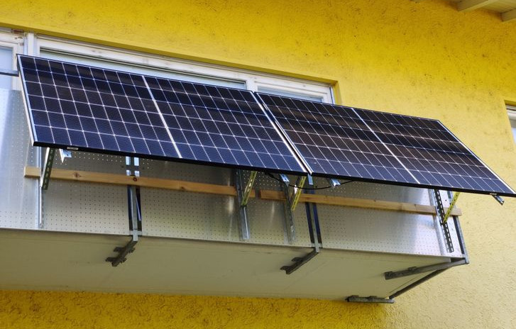

# (Gesamt-)Inhaltsverzeichnis {#Inhaltsverzeichnis}

-   [Hauptseite mit Zusammenfassung etc.](index.md)
-   [Photovoltaik und ihr möglicher Ertrag](PV.md)
-   [Stromverbrauch und Einspeisung im Haushalt](SV.md#)
-   [Eigenverbrauch und seine Berechnung](EV.md)
-   [Nutzungsvarianten](SSG.md#Nutzung)
    -   [Direkte Netzeinspeisung (Steckersolargerät SSG, „Balkonkraftwerk“)](#SSG)
        - [Hintergrund der Beschränkung auf 600 bzw. 800&nbsp;W](#Bagatellgrenze)
        - [Kappungsverlust durch Drosselung auf 600 bzw. 800&nbsp;W](#Kappungsverlust)
    -   [Hausnetzeinspeisung mit Batteriepuffer](Speicher.md)
    -   [Inselanlage (mit Batteriespeicherung) und Kombination](Insel.md)
-   [Auswahl und Nutzung von Komponenten](Komp.md)
-   [Beispiel-Konfigurationen](Bsp.md)

Nutzungsvarianten {#Nutzung}
----------------------------

Solarmodule liefern in direkter Abhängigkeit von der Einstrahlungsstärke
sehr variablen Gleichstrom (je nach Nennleistung maximal z.B. 11&nbsp;A)
mit einer Spannung je nach Modultyp von üblicherweise 22 bis 44&nbsp;V.
Dieser „rohe“ Strom ist direkt erst mal kaum verwendbar,
außer z.B. zum Aufheizen eines Warmwasserspeichers mit einem [PV-Heizstab](
https://www.net4energy.com/de-de/energie/pv-heizstab) --
siehe dazu den Abschnitt [Stromverbrauch](SV.md#Stromverbrauch).

Normalerweise wird der PV-Strom daher in Wechselstrom umgewandelt und direkt
ins Hausnetz eingespeist, was das Thema des [folgenden Abschnitts](#SSG) ist.

Man kann gerade nicht benötigten PV-Strom auch in einer Batterie
zwischenspeichern, was ein [anderer Abschnitt](Speicher.md#Batteriespeicher) behandelt,
der auch erklärt, dass sich das kaum lohnt.

### Direkte Netzeinspeisung (Steckersolargerät SSG, „Balkonkraftwerk“) {#SSG}

{:.left width="400"}
{:.right width="378"}

{:style="clear:both"}

Typischerweise speisen PV-Anlagen, Balkonkraftwerke u.ä. den erzeugten Strom
nach Umwandlung durch einen netzgekoppelten Wechselrichter
([Netzwechselrichter](Komp.md#Netzwechselrichter),
[Solarwechselrichter](https://de.wikipedia.org/wiki/Solarwechselrichter),
engl. _grid-tie inverter_) direkt ins Hausnetz oder öffentliche Stromnetz ein,
wo er sofort in irgendeiner Form verbraucht wird (bzw. der Rest verlorengeht).

Wichtig zu beachten ist, dass diese Nutzungsart abseits eines bestehenden
Wechselstrom-Netzes und während eines Stromausfalls nicht funktioniert,
weil sich der verwendete Wechselrichter mit dem Stromnetz synchronisieren muss.

Hier geht es um *Steckersolargeräte* (*SSG*) &mdash; das sind kleine
Photovoltaikanlagen (mit typischerweise zwei PV-Modulen), die über einen
Mikrowechselrichter und eine Steckdose einfach mit dem Hausnetz verbunden
werden, z.B. an einer Außensteckdose auf dem Balkon oder der Terrasse.
Sie werden auch z.B. *Stecker-PV-Anlage*, *Steckersolaranlage*,
oder *Balkonkraftwerk* (*BKW*) genannt.
Im [§ 3 Nr. 43 EEG-E (*Erneuerbare-Energien-Gesetz*)](https://www.haufe.de/recht/deutsches-anwalt-office-premium/balkonkraftwerke-wemog-1-einfuehrung_idesk_PI17574_HI15563245.html) werden sie
<!--[voraussichtich](
https://www.bmwk.de/Redaktion/DE/Downloads/Gesetz/20230816-entwurf-eines-gesetzes-zur-aenderung-des-erneuerbare-energien-gesetzes.pdf)-->
wie folgt definiert:
> Steckersolargerät ein Gerät, das aus einer Solaranlage oder aus mehreren Solaranlagen, einem Wechselrichter, einer Anschlussleitung und einem Stecker zur Verbindung mit dem Endstromkreis eines Letztverbrauchers besteht.

Rechtlich bedeutsam ist die Einstufung durch den VDE als _Gerät_,
denn im Gegensatz zu elektrischen Anlagen
dürfen elektrische Geräte auch von Laien in Betrieb genommen werden.

Meist werden Steckersolargeräte über einen normalen Schukostecker angeschlossen.
Das ist sehr einfach und flexibel. Es ermöglicht auch, ganz simpel und günstig
ein Energiemessgerät für die erzeugte Strommenge dazwischenzustecken,
wie es unten zur [Strommessung](SV.md#Strommessung) dargestellt ist.
Der im Abschnitt über [Netzwechselrichter](Komp.md#Netzwechselrichter) beschriebene
NA-Schutz macht diese Lösung sicher genug, weil der Wechselrichter
die Stromzufuhr sofort unterbricht, wenn man den
Stecker aus der Dose zieht und seine blanken Kontakte berühren kann.
Anfang 2023 [sprach sich der VDE dafür aus](
https://www.vde.com/de/presse/pressemitteilungen/2023-01-11-mini-pv), „den
Schuko-Stecker für die Einspeisung [...] zu dulden“, und [das BMWK](
https://www.bmwk.de/Redaktion/DE/Publikationen/Energie/photovoltaik-stategie-2023.pdf?__blob=publicationFile)
will „Schukostecker als Energiesteckvorrichtung ebenfalls zulassen“,
was vsl. [im Laufe des Jahres 2024](
https://www.dke.de/de/arbeitsfelder/energy/news/produktnorm-fuer-steckerfertige-pv-anlagen)
offiziell geregelt wird.

{:.right width="450"}
Man kann aber auch, wie vom VDE bislang empfohlen, eine spezielle
*Energiesteckdose* verwenden. Diese wird auch [*Einspeisesteckdose*](
https://www.solarenergie-info.de/wieland-einspeisesteckdose/) genannt
und ist meist von der Firma Wieland. Sie gilt als besonders sicher,
ist aber auch recht teuer und muss von einem Elektriker installiert werden.
[Hier](https://priwatt.de/blog/wieland-vs-schuko-stecker-was-eignet-sich-am-besten-fur-mein-balkonkraftwerk/)
ein ausführlicher Vergleich.
Eine weitere Möglichkeit ist, den Wechselrichter direkt fest mit dem Hausnetz
zu verdrahten, was den Betrieb sogar noch sicherer macht.

Die oft [*Balkonkraftwerk*](https://www.steckdosensolar.de/) genannten Anlagen
haben meist eine recht geringe PV-Nennleistung von etwa 600 bis 800&nbsp;Wp.
Das hat neben der geringen Größe und sehr überschaubaren Kosten auch damit zu
tun, dass sie selbst installiert werden dürfen und genehmigungsfrei sind,
wenn sie [maximal 600&nbsp;W in die Steckdose einspeisen](
https://solarblitz.blogspot.com/2019/08/zulassigkeit-von-balkonkraftwerken-plug.html).
Dies gilt bislang für Deutschland und die Schweiz; in Österreich gilt nach einer
allgemeineren EU-Regel für die vereinfachte Nutzung eine Obergrenze von 800&nbsp;W.
Seit Anfang 2023 [empfiehlt selbst der VDE](
https://www.vde.com/de/presse/pressemitteilungen/2023-01-11-mini-pv),
sich in Abweichung zur bislang geltenden technischen Norm VDE-AR-N 4105
künftig auch in Deutschland an der „Bagatellgrenze bis 800&nbsp;W“ zu orientieren.\
Anfang März 2023 startete eine Petition für die
[schnelle Umsetzung des VDE-Positionspapiers](https://balkon.solar/petition/),
<!--https://epetitionen.bundestag.de/content/petitionen/_2023/_02/_17/Petition_146290.html-->
und auch die [PV-Strategie 2023 des dt. BMWK](
https://www.bmwk.de/Redaktion/DE/Publikationen/Energie/photovoltaik-stategie-2023.pdf?__blob=publicationFile)
will „die Grenze auf 800&nbsp;VA Wechselstromleistung zu erhöhen“.\
Die Erhöhung der Obergrenze in Deutschland, wobei der [VDE federführend ist](
https://www.dke.de/de/arbeitsfelder/energy/news/produktnorm-fuer-steckerfertige-pv-anlagen),
wird [sich noch hinziehen](https://youtu.be/gi36KzH5VhA), nach Informationen
der DGS noch bis mindestens Sommer 2024, wahrscheinlich eher Herbst 2024.

In Deutschland sind PV-Anlagen anmeldepflichtig, wenn sie ins externe Netz
einspeisen können.
Für Steckersolargeräte ist der Aufwand der Online-Registrierung im
[Marktstammdatenregister (MaStR)](https://www.marktstammdatenregister.de/MaStR)
der Bundesnetzagentur gering.
Eigentlich sollte ab Anfang 2024 die ihre zusätzliche Anmeldung beim
Netzbetreiber entfallen, aber das hat sich [erst einmal verzögert](
https://www.giga.de/news/neue-regeln-fuer-2024-balkonkraftwerk-besitzer-muessen-weiter-warten/).

Nach einem [Artikel im pv magazine von 2022](
https://www.pv-magazine.de/2022/02/24/markt-groesser-als-gedacht-rund-190-000-stecker-solar-geraete-bereits-installiert/)
wurde geschätzt, dass nur 10 bis 20% der Steckersolargeräte tatsächlich beim
Netzbetreiber angemeldet wurden. Eine dort genannte Umfrage hat auch ergeben,
dass etwa 77% der Anlagen mit einem Schuko-Stecker angeschlossen wurden.
Bei etwa 1/3 der Anlagen befinden sich die PV-Module auf oder an einem Balkon;
bei etwa der Hälfte werden die Module z.B. auf einem Flachdach oder im Garten
aufgeständert.

#### Hintergrund der Beschränkung auf 600 bzw. 800&nbsp;W {#Bagatellgrenze}

Gründe für die Leistungsbegrenzung bei der Einspeisung von PV-Strom
sind nicht nur Sicherheitsbedenken bzgl. der Stromleitungen im Haushalt.
Weitere technische und wirtschaftliche Gründe sind mögliche und
nicht immer gut kalkulierbare Rückwirkungen auf das allgemeine Stromnetz.
* Bei massenhafter Einspeisung von Solarstrom und kräftigem Sonnenschein
kann der Strom im Verteilnetz z.B. durch ziehende Wolken sehr stark schwanken,
was seine Stabilität beeinträchtigen könnte.
* Außerdem kann es passieren, dass der Netzbetreiber bei großen Schwankungen
teils besonders teuren Strom nachkaufen muss bzw. für überschüssigen Strom einen
sehr geringen oder gar negativen Preis bekommt, sprich „Strafe zahlen“ muss.
* Auch könnten sich Freileitungen, durch die ungewöhnlich viel Strom fließt,
stärker als üblich ausdehnen und eventuell gefährlich durchhängen.

Wenn jedoch durch sog.
[*Nulleinspeisung*](https://www.energie-experten.org/erneuerbare-energien/photovoltaik/eigenverbrauch/nulleinspeisung)
sichergestellt ist, dass kein lokal erzeugter Strom ins externe Netz fließt,
können PV-Anlagen [auch z.B. mit 1800&nbsp;W Leistung](
https://www.pv-magazine.de/2022/07/04/indielux-startet-crowdfunding-fuer-serienproduktion-seines-einspeisewaechters-fuer-stecker-solar-geraete/)
aus Sicht der Netzbetreiber problemlos und normgerecht betrieben werden.\
[{:.right}](
https://www.indielux.com/produkt/ready2plugin-einspeisewaechter/)
Für die Nulleinspeisung gibt es inzwischen eine spezielle Lösung zu kaufen,
nämlich den [indielux ready2plugin Stromwächter](https://www.indielux.com/produkt/ready2plugin-einspeisewaechter/),
der allerdings etwa 400€ kostet.
Er wird auch *Einspeisewächter* genannt, weil er für Steckersolargeräte
<!-- mit oder ohne Speicher --> eine Nulleinspeisung realisiert und damit
nebenbei dafür sorgt, dass nicht mehr als 600 bzw. 800&nbsp;VA eingespeist werden.
Der Stromwächter ist inzwischen mit vielen steuerbaren Wechselrichtern
kompatibel und setzt eine per RS485 mit Modbus oder WLAN angebundene Messung des
aktuellen Netz-Strombezugs z.B. mit einem Shelly 3EM voraus.\
Wesentlich günstiger wäre
ein Eigenbau mit [OpenDTU-OnBattery](Speicher.md#OpenDTU-OnBattery),
das eine Nulleinspeisung auch ohne Batterie realisieren kann.\
Allerdings ist eine Nulleinspeisung für reinen PV-Strom (also ohne Batterie)
[energetisch sehr ungeschickt](https://youtu.be/wxP5uMdtMmk?t=797).

Man kann durchaus annehmen, dass Beschränkungen auch dadurch motiviert sind,
dass die Energieversorgungsunternehmen möglichst wenig Konkurrenz haben wollen.

Eine Rolle spielt jedenfalls auch die Versicherungswirtschaft,
die sich Schadensfälle so weit irgend möglich vom Hals halten will.

Die sog. [*Bagatellgrenze* bei 600 bzw. 800&nbsp;Watt](
https://www.computerbild.de/artikel/cb-Tipps-Energie-Balkonkraftwerk-800-Watt-erlaubt-35272303.html)
dient in erster Linie der erleichterten Anmeldung von Steckersolargeräten.
Die Beschränkung leistet aber auch einen aus Sicht des VDE wichtigen Beitrag zum
Schutz der Stromleitungen im Haus in folgendem sehr selten auftretenden Fall:\
[{:.right width="400"}](
https://www.sonnenenergie.de/index.php?id=30&tx_ttnews%5Btt_news%5D=254)
Wenn über die Wohnungs-Stromleitung, an der die Einspeisung
stattfindet, gleichzeitig sehr kräftig Strom verbraucht wird, kann es unter
ungünstigen Umständen passieren, dass über längere Zeit auf Teilen der Leitung
mehr Strom fließt als die Sicherung eigentlich erlauben würde, was dann zu
einer mehr oder weniger übermäßigen Erwärmung der Leitung führt.\
Wenn L der momentane Gesamt-Verbrauch auf der Leitung ist und P die momentane
Erzeugung auf derselben Leitung, kommt bei der Sicherung die Leistung L&nbsp;-&nbsp;P an.
Wenn die Sicherung auf 16&nbsp;A ausgelegt ist und die dort ankommende Leistung
vom Betrag her, also |L&nbsp;-&nbsp;P|, kleiner als 3680&nbsp;W (= 230&nbsp;V × 16&nbsp;A) ist,
löst die Sicherung nicht aus. (Ein 16&nbsp;A Leitungsschutzschalter wird genau
genommen sogar erst dann auslösen, wenn über ihn dauerhaft mindestens 18&nbsp;A
fließen oder länger als eine Stunde mehr als ca. 23&nbsp;A. Daher will der VDE
Stand März 2024 die [PV-Leistung von SSGs auf 960 Wp beschränken](
https://www.youtube.com/watch?v=Vrv4s94gejY).)
Wen L oder P größer als 3680&nbsp;W ist,
fließen auf einem Teilabschnitt der Leitung mehr als 16&nbsp;A Strom.\
Das kann beispielsweise passieren, wenn gerade die Erzeugung 6&nbsp;A Strom liefert
und der Stromverbrauch zwischen 16&nbsp;A und 22&nbsp;A liegt.\
Das ist allerdings insgesamt in der Praxis höchst unwahrscheinlich,
denn fast niemand betreibt an derselben Leitung gleichzeitig Geräte, die in
Summe einen Verbrauch L von über 3680&nbsp;W haben, und dass z.B. durch einen
Kurzschluss extrem viel Strom fließt, ist möglich, aber kommt selten vor.
Und selbst wenn das der Fall ist und die Balkonanlage währenddessen für eine
gewisse Zeit weniger Leistung als L&nbsp;-&nbsp;3680&nbsp;W (bzw. bei einem
16&nbsp;A Leitungsschutzschalter erhöht um Faktor 1,13 bzw. 1,45) liefert,
löst die Sicherung wie üblich aus und die Überlast ist beendet.

Von der ESTI (Schweiz) wird aus diesem Grund
die Leitungsüberlastung durch Steckersolargeräte
[nicht normativ betrachtet](https://www.pvplug.de/positionspapier/).
In Irland macht man sich da auch keine Sorgen und [erlaubt sogar 6&nbsp;kW für
einphasige bzw. 11&nbsp;kW für dreiphasige Einspeisung](
https://www.energiezukunft.eu/erneuerbare-energien/solar/grosszuegige-bagatellgrenze-fuer-pv-anlagen/)
zu einfachen Anschluss- und Abrechnungsregeln.\
In Deutschland [schreibt VDE&nbsp;V 0100-551-1 vor](
https://myblogexperience.de/balkonkraftwerk-warum-nur-600-watt-teil-2/),
dass die Strombelastbarkeit des Leiters größer sein muss als der Nennstrom
der Sicherung und der Ausgangsstrom des Netzwechselrichters zusammen.
Dann ist man auf jeden Fall auf der sicheren Seite, aber von dieser Regel hat
man als Nichtelektriker wenig, weil man die Belastbarkeit der Leitung kaum
wissen wird und man auch nicht einfach den Sicherungsautomaten wechseln kann.
<!--
Besonders in Deutschland herrscht die Neigung, alles möglichst idiotensicher zu
machen, damit unter keinen Umständen etwas passieren kann. Dann besteht aber
die Gefahr, dass das Verhältnis von Aufwand zu Nutzen viel zu ungünstig wird.
https://www.mydealz.de/comments/permalink/40887036
-->

Was relativ einfach zu machen ist,
um das das Risiko einer eventuellen Leitungsüberlastung zu verringern,
ist die Sicherung bzw. den Schutzschalter von 16&nbsp;A auf z.B. 10 oder
13&nbsp;A zu reduzieren.\
Eine (allerdings relativ aufwendige) Möglichkeit,
das potentielle Überlastungsproblem ganz auszuschalten,
wäre für die kleine PV-Anlage eine Extra-Leitung zum Unterverteiler zu legen,
auf der sicher keine (starken) Verbraucher angeschlossen werden.

#### Kappungsverlust durch Drosselung auf 600 bzw. 800&nbsp;W {#Kappungsverlust}

Die Nennleistung der verwendeten Solarmodule kann und sollte in Summe durchaus
größer sein als die maximale Ausgangsleistung des Wechselrichters &mdash;
also bei einem 600&nbsp;W Wechselrichter statt 600&nbsp;Wp eher 800 bis 1000&nbsp;Wp.
Denn in der Praxis wird auch mit solchen Modul-Nennleistungen
eine Wechselrichter-Ausgangsleistung von 600&nbsp;W ohnehin kaum erreicht,
und wenn, dann auch nicht oft, besonders nicht in sonnenarmen Zeiten.
**Der Unterschied beim nutzbaren Jahres-Gesamtertrag ohne/mit Drosselung des
Wechselrichters auf 600&nbsp;W ist sehr gering: etwa 10&nbsp;kWh**, also knapp 3€ im Jahr.

Diese Erkenntnis ist schon recht alt und wurde wohl erst [für größere Anlagen](
https://www.photovoltaikforum.com/thread/79306-wechselrichter-unterdimensionierung-welche-ertragseinbu%C3%9Fen/)
diskutiert, aber wird auch immer wieder [für kleine Anlagen neu entdeckt](
https://mini-pv-anlage-600-w-oder-800-w.jimdosite.com/).\
Nochmal geringer ist der Unterschied beim Eigenverbrauch für ein Steckersolargerät,
wie die u.g. Ergebnisse [genauer Simulationen](EV.md#SolBatSim) zeigen.

Man hat durch eine gewisse [Überdimensionierung der PV-Module](
https://energiewende-tipps.de/ueberbelegung-eines-balkonkraftwerkes/)
(auch *Überbelegung* oder *Unterdimensionierung* des Wechselrichters genannt,
engl. _overpaneling_)
auch zu ungünstigen Tages- und Jahreszeiten entsprechend mehr Ausbeute
(eigentlich sogar überproportional mehr, weil die Anlaufspannung der Regelung
schneller erreicht wird), allerdings auf eher niedrigem absoluten Niveau.

Die Drosselung der Wechselrichter wird aus energetischen Gründen durch
eine Leistungsbegrenzung bereits auf Eingangsseite umgesetzt.
Leider verwenden einige Modelle (zumindest die von Bosswerk/revolt/Deye G2
und G3, aber nicht die von Hoymiles), wie man in [Diagrammen](
https://www.photovoltaikforum.com/thread/180129-deye-sun600-und-sun2000-erfahrungen/)
sehen kann, dabei direkt den Ziel-Grenzwert, statt zu berücksichtigen,
dass aufgrund des Wirkungsgrades auf der Ausgangsseite 5-10% weniger ankommen
&mdash; pro genutztem Eingang sind es z.B. beim Deye Sun 600 maximal etwa 270&nbsp;W.
So können bei real 90% Wirkungsgrad höchstens 540&nbsp;W geliefert werden.
Obwohl der Netto-Ertrag durch diese ungeschickte Form der Abregelung also oft
sogar unnötig stark verringert wird, ist der Effekt auf den nutzbaren Ertrag
längst nicht so groß wie man meinen könnte.

Nehmen wir beispielsweise eine PV-Anlage mit 1000&nbsp;Wp, die je nach Standort
und Ausrichtung zu einem Ertrag von 1272&nbsp;kWh brutto pro Jahr führen kann,
also bei einem PV-System-Wirkungsgrad von 92% und einem typischen
Wechselrichter-Wirkungsgrad von 94% etwa 1100&nbsp;kWh Netto-Ertrag.
Bei 3000&nbsp;kWh Jahresverbrauch mit einem durchschnittlichen Lastprofil
macht der effektive Verlust durch Drosselung auf 600&nbsp;W Eingangsleistung
des Wechselrichters (also 564&nbsp;W Ausgangsleistung bei den 94% Wirkungsgrad)
nur ungefähr 10&nbsp;kWh aus. Dies erklärt sich durch zwei Effekte:
* Die Abregelung findet zwar während etwa 650 Sonnenstunden im Jahr statt, aber
die Differenz auf den sonst möglichen Netto-Ertrag ist moderat: etwa 80&nbsp;kWh.
Dieser Verlust ist schon nicht groß, und er wird durch Folgendes nochmal
deutlich kleiner:
* Nur während in Summe etwa 90 Stunden wird zeitgleich zu dieser Abregelung
bei einem durchschnittlichen Lastprofil überhaupt so viel Strom verbraucht,
dass sich die Drosselung beim Eigenverbrauch bemerkbar macht. Und die Menge
dieses Verbrauchs, bei dem also mehr als 528&nbsp;W Leistung beansprucht werden,
ist ziemlich gering, so dass der Verlust effektiv nur 10&nbsp;kWh ausmacht.

Selbst wenn man es schafft, die Last innerhalb des Tages so zu verschieben,
dass täglich zwischen 8 und 16 Uhr doppelt so viel verbraucht wird wie normal
und morgens und abends entsprechend weniger, ist der effektive Kappungsverlust
im Jahr immer noch nur 20&nbsp;kWh (während in Summe effektiv 190 Stunden).\
Und wenn man täglich zwischen 8 und 16 Uhr keine Lastspitzen hat, die über die
Kappungsgrenze gehen (sondern z.B. nur eine konstante Grundlast von 100&nbsp;W),
dann verschwindet der effektive Kappungsverlust natürlich völlig.

[//]: #
<!--
https://www.mydealz.de/comments/permalink/40266559
https://www.mydealz.de/comments/permalink/40042755

./Solar.pl Lastprofil_4673_kWh.csv 3000 Timeseries_48.215_11.727_SA2_1kWp_crystSi_14_35deg_0deg_2005_2020.csv 1000 -tmy -peff 92
88%: -peff 93.617
Verbrauch gemäß Lastprofil  = 4674 kWh
Grundlast                   =  184 W

PV-Nominalleistung          = 1000 Wp
Bruttoleistung max.         = 1009 W am TMY-04-15 um 13:00 h
PV-Bruttoertrag             = 1272 kWh
PV-Nettoertrag              = 1100 kWh bei PV-System-Eff. 92%, WR-Eff. 94%
Ertragsanteil 9-15 Uhr MEZ  =   73 %

Last durch Haushalt         = 3000 kWh
PV-Eigenverbrauch           =  612 kWh
Netzeinspeisung             =  488 kWh

./Solar.pl Lastprofil_4673_kWh.csv 3000 Timeseries_48.215_11.727_SA2_1kWp_crystSi_14_35deg_0deg_2005_2020.csv 1000 -tmy -peff 92 -curb 564

PV-Nettoertrag              = 1023 kWh bei PV-System-Eff. 92%, WR-Eff. 94%
Eigenverbrauch mit Drossel  =  603 kWh
Eigenverbrauchsverlust      =    9 kWh während 90 h durch Drosselung auf 564 W
Netzeinspeisung             =  420 kWh

./Solar.pl Lastprofil_4673_kWh.csv 3000 Timeseries_48.215_11.727_SA2_1kWp_crystSi_14_35deg_0deg_2005_2020.csv 1000 -tmy -peff 92 -curb 564 -bend 1,1,1,1,.5,.5,.5,.5,2,2,2,2,2,2,2,2,.5,.5,.5,.5,1,1,1,1

Last-Verzerrung je Stunde   = 1 1 1 1 .5 .5 .5 .5 2 2 2 2 2 2 2 2 .5 .5 .5 .5 1 1 1 1
PV-Eigenverbrauch           =  716 kWh mit Drosselung
PV-Eigenverbrauchsverlust   =   19 kWh netto während 190 h durch Drosselung auf 564 W
Netzeinspeisung             =  307 kWh

./Solar.pl Lastprofil_4673_kWh.csv 3000 Timeseries_48.215_11.727_SA2_1kWp_crystSi_14_35deg_0deg_2005_2020.csv 1000 -tmy -peff 92 -curb 564 -load 111 7:8..16

Konstante Last              =  100 W  von 8 bis 16 Uhr
PV-Eigenverbrauch           =  371 kWh mit Drosselung
PV-Eigenverbrauchsverlust   =    0 kWh netto während 0 h durch Drosselung auf 564 W
Netzeinspeisung             =  652 kWh
-->

<!--
./Solar.pl Lastprofil_4673_kWh.csv 3000 Timeseries_48.215_11.727_SA2_1kWp_crystSi_14_35deg_0deg_2005_2020.csv 1000 -tmy -peff 92 -ieff 94 -curb 564 -capacity 1250 -dc

Lastprofil-Datei            : Lastprofil_4673_kWh.csv
Grundlast                   =  184 W
Maximallast                 =13795 W am 2010-02-26 um 06:55 h

PV-Daten-Datei              : Timeseries_48.215_11.727_SA2_1kWp_crystSi_14_35deg_0deg_2005_2020.csv
Neigungswinkel, Azimut      = 35°, 0°
Breitengrad, Längengrad     = 48.215, 11.727
Simuliertes PV-Jahr         = TMY (2008..2020)

PV-Nominalleistung          = 1000 Wp
Max. PV-Bruttoleistung      = 1009 W am TMY (2008..2020)-04-15 um 13:00 h
PV-Bruttoertrag             = 1272 kWh, PV-System-Wirkungsgrad 92%
Max. PV-Nettoleistung       =  564 W am TMY (2008..2020)-01-03 um 11:00 h
PV-Netto-Ertragsverlust     =   77 kWh während 678 h durch WR-Ausgangsdrosselung auf 564 W
TODO wrong: PV-Netto-Ertragsverlust     = 5.18 kWh während 641 h durch WR-Ausgangs-Drosselung auf 564 W   
PV-Nettoertrag              = 1023 kWh bei Wechselrichter-Wirkungsgrad 94%
-->
<!--
Verbrauch durch Haushalt    = 3000 kWh

Speicherkapazität           = 1250 Wh mit max. Ladehöhe 90%, max. Entladetiefe 90%, DC-gekoppelt
Optimale Ladestrategie (nicht gebrauchte Energie), max. Laderate 1 C
Optimale Entladestrategie (so viel wie gebraucht), max. Entladerate 1 C
Verlust durch Überlauf      =    0 kWh
Ladeverlust                 =   21 kWh durch Lade-Wirkungsgrad 94%
Speicherverlust             =   17 kWh durch Speicher-Wirkungsgrad 95%
Verlust während Entladung   =   68 kWh durch Entlade-WR-Wirkungsgrad 94%
PV-Nutzung über Speicher    =  301 kWh
Zwischenspeicherung         =  337 kWh (nach Ladeverlust)
Vollzyklen pro Jahr         =  337 der effektiven Kapazität

PV-Eigenverbrauch           =  903 kWh
PV-Eigenverbrauchsverlust   = 5.18 kWh netto - nur näherungsweise, tatsächlich 3 kWh - während 38?? h durch WR-Ausgangsdrosselung auf 564 W   
Netzeinspeisung             =  161 kWh
PV-Eigenverbrauchsanteil    =   77 % des PV-DC-Ertrags (Nutzungsgrad)
Eigendeckungsanteil         =   30 % des Verbrauchs (Autarkiegrad)
-->
<!--
 # -curb hat keine Auswirkung mit -dc und -pass 0
./Solar.pl Lastprofil_4673_kWh.csv 3000 Timeseries_48.215_11.727_SA2_1kWp_crystSi_14_35deg_0deg_2005_2020.csv 1000 -tmy -peff 92 -ieff 94 -curb 564 -capacity 1250 -dc -pass 0 -feed 600

Speicherkapazität           = 1250 Wh mit max. Ladehöhe 90%, max. Entladetiefe 90%, DC-gekoppelt
Speicher-Umgehung           =    0 W, max. Laderate 1 C
Konstanteinspeisung         =  600 W, max. Entladerate 1 C
Verlust durch Überlauf      = 0.94 kWh
Ladeverlust                 =   70 kWh durch Lade-Wirkungsgrad 94%
Speicherverlust             =   55 kWh durch Speicher-Wirkungsgrad 95%
Verlust während Entladung   =   63 kWh durch Entlade-WR-Wirkungsgrad 94%
PV-Nutzung über Speicher    =  579 kWh
Zwischenspeicherung         = 1099 kWh (nach Ladeverlust)
Vollzyklen pro Jahr         =  1099 der effektiven Kapazität

PV-Eigenverbrauch           =  579 kWh
PV-Eigenverbrauchsverlust   =    0 kWh netto während 0 h durch WR-Ausgangsdrosselung auf 564 W
Netzeinspeisung             =  402 kWh
PV-Eigenverbrauchsanteil    =   50 % des PV-DC-Ertrags (Nutzungsgrad)
Eigendeckungsanteil         =   19 % des Verbrauchs (Autarkiegrad)
-->
<!--
 # -curb hat keine Auswirkung mit -dc und -pass 0
./Solar.pl Lastprofil_4673_kWh.csv 3000 Timeseries_48.215_11.727_SA2_1kWp_crystSi_14_35deg_0deg_2005_2020.csv 1000 -tmy -peff 92 -ieff 94 -curb 564 -capacity 1250 -dc -pass 0 -feed lim 1000

Speicherkapazität           = 1250 Wh mit max. Ladehöhe 90%, max. Entladetiefe 90%, DC-gekoppelt
Speicher-Umgehung           =    0 W, max. Laderate 1 C
Maximaleinspeisung          = 1000 W, max. Entladerate 1 C
Verlust durch Überlauf      =  164 kWh
Ladeverlust                 =   60 kWh durch Lade-Wirkungsgrad 94%
Speicherverlust             =   47 kWh durch Speicher-Wirkungsgrad 95%
Verlust während Entladung   =   53 kWh durch Entlade-WR-Wirkungsgrad 94%
PV-Nutzung über Speicher    =  836 kWh
Zwischenspeicherung         =  936 kWh (nach Ladeverlust)
Vollzyklen pro Jahr         =  936 der effektiven Kapazität

PV-Eigenverbrauch           =  836 kWh
PV-Eigenverbrauchsverlust   =    0 kWh netto während 0 h durch WR-Ausgangsdrosselung auf 564 W
Netzeinspeisung             =    0 kWh
PV-Eigenverbrauchsanteil    =   71 % des PV-DC-Ertrags (Nutzungsgrad)
Eigendeckungsanteil         =   28 % des Verbrauchs (Autarkiegrad)
-->

Bei Abweichung von der optimalen Südausrichtung verschwinden,
zumindest wenn Module mit unterschiedlicher Ausrichtung parallel geschaltet
werden (also für sie nur ein gemeinsamer MPPT-Eingang verwendet wird),
die ohnehin äußerst geringen Eigenverbrauchs-Einbußen durch Kappung von
z.B. 1000&nbsp;Wp auf 600&nbsp;W zusehends
und sind bei Ost-West-Aufteilung (Azimut +/-90°) gar nicht mehr vorhanden.

<!--
https://www.photovoltaikforum.com/thread/195109-optimale-ausrichtung-bei-2-modulen/?postID=3031434#post3031434

Verbrauch durch Haushalt    = 3000 kWh
PV-Nominalleistung          = 500+500 Wp
Breitengrad                 =   48.269
Längengrad                  =   10.408
-->

<!-- Neigungswinkel              =   30° Azimut = +/-90°
./Solar.pl Lastprofil_4673_kWh.csv 3000 Timeseries_48.269_10.408_SA2_1kWp_crystSi_14_30deg_90deg_2005_2020.csv 500 Timeseries_48.269_10.408_SA2_1kWp_crystSi_14_30deg_-90deg_2005_2020.csv 500 -peff 92 -tmy -curb 800

PV-Nettoertrag              =  889 kWh
PV-Netto-Ertragsverlust     =    0 kWh während 0 h durch Drosselung auf 800 W
PV-Eigenverbrauch           =  576 kWh mit Drosselung
PV-Eigenverbrauchsverlust   =    0 kWh netto während 0 h durch Drosselung auf 800 W
-->
<!--
./Solar.pl Lastprofil_4673_kWh.csv 3000 Timeseries_48.269_10.408_SA2_1kWp_crystSi_14_30deg_90deg_2005_2020.csv 500 Timeseries_48.269_10.408_SA2_1kWp_crystSi_14_30deg_-90deg_2005_2020.csv 500 -peff 92 -tmy -curb 600

PV-Nettoertrag              =  888 kWh
PV-Netto-Ertragsverlust     =    1 kWh während 72 h durch Drosselung auf 600 W
PV-Eigenverbrauch           =  575 kWh mit Drosselung
PV-Eigenverbrauchsverlust   =    0 kWh netto während 9 h durch Drosselung auf 600 W
-->

<!-- Neigungswinkel              =   30° Azimut = +/-45°
./Solar.pl Lastprofil_4673_kWh.csv 3000 Timeseries_48.269_10.408_SA2_1kWp_crystSi_14_30deg_45deg_2005_2020.csv 500 Timeseries_48.269_10.408_SA2_1kWp_crystSi_14_30deg_-45deg_2005_2020.csv 500 -peff 92 -tmy -curb 800

PV-Nettoertrag              = 1031 kWh
PV-Netto-Ertragsverlust     =    0 kWh während 0 h durch Drosselung auf 800 W
PV-Eigenverbrauch           =  606 kWh mit Drosselung
PV-Eigenverbrauchsverlust   =    0 kWh netto während 0 h durch Drosselung auf 800 W
-->
<!--
./Solar.pl Lastprofil_4673_kWh.csv 3000 Timeseries_48.269_10.408_SA2_1kWp_crystSi_14_30deg_45deg_2005_2020.csv 500 Timeseries_48.269_10.408_SA2_1kWp_crystSi_14_30deg_-45deg_2005_2020.csv 500 -peff 92 -tmy -curb 600

PV-Nettoertrag              = 1003 kWh
PV-Netto-Ertragsverlust     =   28 kWh während 382 h durch Drosselung auf 600 W
PV-Eigenverbrauch           =  603 kWh mit Drosselung
PV-Eigenverbrauchsverlust   =    3 kWh netto während 46 h durch Drosselung auf 600 W
-->

<!-- Neigungswinkel              =   30° Azimut = 0°
./Solar.pl Lastprofil_4673_kWh.csv 3000 Timeseries_48.269_10.408_SA2_1kWp_crystSi_14_30deg_0deg_2005_2020.csv 1000 -peff 92 -tmy -curb 800

PV-Nettoertrag              = 1088 kWh bei PV-System-Eff. 92%, Wechselrichter-Eff. 94%
PV-Netto-Ertragsverlust     =    1 kWh während 31 h durch Drosselung auf 800 W
PV-Eigenverbrauch           =  609 kWh mit Drosselung
PV-Eigenverbrauchsverlust   =    0 kWh netto während 3 h durch Drosselung auf 800 W
-->
<!--
./Solar.pl Lastprofil_4673_kWh.csv 3000 Timeseries_48.269_10.408_SA2_1kWp_crystSi_14_30deg_0deg_2005_2020.csv 1000 -peff 92 -tmy -curb 600

PV-Nettoertrag              = 1037 kWh
PV-Netto-Ertragsverlust     =   52 kWh während 532 h durch Drosselung auf 600 W
PV-Eigenverbrauch           =  603 kWh mit Drosselung
PV-Eigenverbrauchsverlust   =    6 kWh netto während 64 h durch Drosselung auf 600 W
-->

Aus den genannten Gründen lohnt es sich (jedenfalls bei PV-Nennleistungen
bis um die 1000&nbsp;Wp) nicht, statt eines auf 600&nbsp;W gedrosselten Wechselrichters
einen teureren mit 800&nbsp;W Maximalleistung zu nehmen oder darauf zu warten,
bis diese in Deutschland offiziell unter die Bagatellgrenze fallen.

Hingegen **bieten 800 bis 1000&nbsp;Wp statt 600&nbsp;Wp PV-Nennleistung bei relativ
geringen Zusatzkosten eine sinnvolle Reserve für schwächere Sonnenstunden**,
wodurch der Netto-Ertrag trotz Kappung etwa 200 bis 350&nbsp;kWh höher liegt,
und der Eigenverbrauch immerhin 80 bis 140&nbsp;kWh höher im Jahr.
Die Amortisationszeit der Gesamt-Anlage bleibt dabei ziemlich gleich, und auf
lange Sicht ergibt sich eine entsprechend höhere Kostenersparnis als mit 600&nbsp;Wp.

<!--
Neigungswinkel              =   38°
Azimut                      =    0°
Breitengrad                 =   48.215
Längengrad                  =   11.727

./Solar.pl Lastprofil_4673_kWh.csv 3000 Timeseries_48.269_10.408_SA2_1kWp_crystSi_14_30deg_0deg_2005_2020.csv 600 -curb 564 -tmy -peff 92

PV-Nominalleistung          =  600 Wp
Max. PV-Bruttoleistung      =  631 W am TMY-04-15 um 12:00 h
PV-Bruttoertrag             =  755 kWh
PV-Nettoertrag              =  663 kWh bei PV-System-Eff. 92%, Wechselrichter-Eff. 94%
PV-Netto-Ertragsverlust     =    0 kWh während 0 h durch Drosselung auf 564 W
Ertragsanteil 9-15 Uhr MEZ  =   72 %

Verbrauch durch Haushalt    = 3000 kWh
PV-Eigenverbrauch           =  461 kWh mit Drosselung
PV-Eigenverbrauchsverlust   =    0 kWh netto während 0 h durch Drosselung auf 564 W
Netzeinspeisung             =  192 kWh
PV-Eigenverbrauchsanteil    =   70 % des Nettoertrags (Nutzungsgrad)
Eigendeckungsanteil         =   15 % des Verbrauchs (Autarkiegrad)
-->
<!--
./Solar.pl Lastprofil_4673_kWh.csv 3000 Timeseries_48.269_10.408_SA2_1kWp_crystSi_14_30deg_0deg_2005_2020.csv 800 -curb 564 -tmy -peff 92

PV-Nominalleistung          =  800 Wp
Max. PV-Bruttoleistung      =  841 W am TMY-04-15 um 12:00 h
PV-Bruttoertrag             = 1007 kWh
PV-Nettoertrag              =  861 kWh bei PV-System-Eff. 92%, Wechselrichter-Eff. 94%
PV-Netto-Ertragsverlust     =    9 kWh während 220 h durch Drosselung auf 564 W
Ertragsanteil 9-15 Uhr MEZ  =   72 %

Verbrauch durch Haushalt    = 3000 kWh
PV-Eigenverbrauch           =  542 kWh mit Drosselung
PV-Eigenverbrauchsverlust   =    1 kWh netto während 29 h durch Drosselung auf 564 W
Netzeinspeisung             =  319 kWh
PV-Eigenverbrauchsanteil    =   63 % des Nettoertrags (Nutzungsgrad)
Eigendeckungsanteil         =   18 % des Verbrauchs (Autarkiegrad)
-->
<!--
./Solar.pl Lastprofil_4673_kWh.csv 3000 Timeseries_48.269_10.408_SA2_1kWp_crystSi_14_30deg_0deg_2005_2020.csv 1000 -curb 564 -tmy -peff 92

PV-Nominalleistung          = 1000 Wp
Max. PV-Bruttoleistung      = 1051 W am TMY-04-15 um 12:00 h
PV-Bruttoertrag             = 1259 kWh
PV-Nettoertrag              = 1015 kWh bei PV-System-Eff. 92%, Wechselrichter-Eff. 94%
PV-Netto-Ertragsverlust     =   73 kWh während 682 h durch Drosselung auf 564 W
Ertragsanteil 9-15 Uhr MEZ  =   70 %

Verbrauch durch Haushalt    = 3000 kWh
PV-Eigenverbrauch           =  601 kWh mit Drosselung
PV-Eigenverbrauchsverlust   =    8 kWh netto während 89 h durch Drosselung auf 564 W
Netzeinspeisung             =  414 kWh
PV-Eigenverbrauchsanteil    =   59 % des Nettoertrags (Nutzungsgrad)
Eigendeckungsanteil         =   20 % des Verbrauchs (Autarkiegrad)
-->

Wenn PV-Module in zwei Ausrichtungen aufgeteilt sind, sollten jeweils
Module mit unterschiedlicher Ausrichtung (z.B. Südost und Südwest) parallel
geschaltet werden, weil sich dann sowohl die Last für den Wechselrichter
als auch der Nutzen für den Haushalt besser über den Tagesverlauf verteilen.
Dies ist besonders ratsam, wenn der Wechselrichter stark gedrosselt wird, weil
der Limit-Wert leider meist [einfach gleichmäßig auf die Eingänge aufgeteilt wird](
https://mikrowechselrichter.eu/blogs/drosselung-leistungsbegrenzung-von-hoymiles-wechselrichtern/warum-sollten-mikrowechselrichter-besser-nicht-gedrosselt-werden)
und somit erhebliche unnötige Verluste entstehen können.
<!-- https://www.mydealz.de/comments/permalink/46760795 -->
Etwa ist es bei 4 PV-Modulen mit je 400&nbsp;Wp nicht sehr sinnvoll, einen
Wechselrichter mit z.B. 1600&nbsp;W Leistung und 4 MPPT zu verwenden, besonders
wenn man diesen auf 600 bzw. 800&nbsp;W Ausgangsleistung drosselt. Denn dann
sind durch die gleichmäßige Aufteilung der Drosselung auf alle MPPT-Eingänge
nur noch 150 bzw. 200&nbsp;W je Eingang möglich.\
Stattdessen kann man auch einen günstigeren 600 bzw. 800&nbsp;W Wechselrichter
nutzen und an jedem seiner zwei Eingänge dabei jeweils zwei Module parallel anschließen.
Dass die Eingänge dabei dann teilweise an die Grenze ihres Eingangsstroms
kommen, ist typischerweise [unproblematisch](Komp.md#Anschluss). Wer das trotzdem
vermeiden will, kann auch z.B. einen HM-1500 verwenden, der nur 2 MPPT hat.

Anders sieht es bei den seit Frühjahr 2024 verfügbaren Deye G4 Wechselrichtern
aus, denn bei diesen wird die [Höhe der Limitierung wirklich auf die
Ausgangsleistung bezogen](https://www.youtube.com/watch?v=9W1WTIYNEyo&t=532s)
und nicht dumm gleichmäßig auf alle MPPT-Eingänge verteilt.

<!--
Local IspellDict: german8
LocalWords: title keywords toc start refresh markdown pandoc width style margin
LocalWords: zusammenfassung Messgeraet CC BY Std webp Ferrariszaehler IAMKlaus
LocalWords: Unabhaengigkeitsrechner Stromwaechter Play SDM clams comment fazit
LocalWords: output calculation power unit rating Europe TSUN InGe DPM anker only
LocalWords: left right irradiance GHI buehneTop clear both png tgl RS solix eArc
LocalWords: potential csv grid tie inverter tmy peff ieff curb WiFi align Naja
LocalWords: standby xls jpg Balkonsolar center limiter off to html Rs Controler
LocalWords: blackout brownout panels busbars shingle panel up number solarbank
LocalWords: maximum point tracking sine wave efficiency boost true SG Shellys DL
LocalWords: converter step consumption pdf balancer equalizer mppt em Script
LocalWords: buck down SA SZ DW MQ EC LF small LY KREE Battery test br ATON Full
LocalWords: Charger Discharger Board Under Over Voltage Protection sub cpp img
LocalWords: Speicherungs current  Regelungs Eigenverbrauchsv WSW if PowerLimiter
LocalWords: telemetry gateway distort cell document sections profile Passthrough
LocalWords: post text standard conditions Reflexions PVSOL SOL assuming MG Stick
LocalWords: operating temperature Timeseries crystSi PVCalculator and NPB Komp
LocalWords: with entnahme bend OSO SSW SSO ready anlagen plugin date int limits
LocalWords: author today abstract This the ignored extension yaml txt interface
LocalWords: metadata add Austria description bagatellgrenze Loadprofiles
LocalWords: Yong Hui Green SolarPower backup net metering MPP Tracker SusEnergy
LocalWords: created changed nbsp pvroi ac dc break even fig SoC DoD MW Premium
LocalWords: Sense is end index output md ref of pv px Eff vs discussioncomment
LocalWords: my var pl zip load capacity feed spill deg magazine OC SC
LocalWords: data transfer solar cut cells open short circuit voltage lim
LocalWords: Ruecklaufsperre mdash Ueberlastung overpaneling LocalWords OW Heat
LocalWords: Bestrahlungsstaerke curves under different levels irradiation state
LocalWords: Microinverter What are Amps Volts SMF charge discharge Un Ent shunt
LocalWords: protector Micro Eco Worthy ISolar SPH GYVRM Cocar version cron job
LocalWords: Delivered Latest Downgraded shelly emeter file status returned MYPV
LocalWords: Zweirichtungszaehler issuecomment collect Notifications height ELWA
LocalWords: Plugs comments January Settings ons configuration states excl comp
LocalWords: sensor export float uksa tamorix custom firmware en Central zell TR
LocalWords: 
-->
