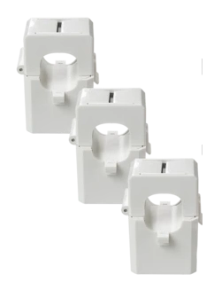
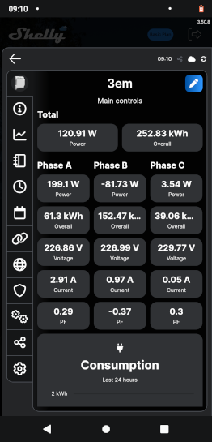

# (Gesamt-)Inhaltsverzeichnis {#Inhaltsverzeichnis}

-   [Hauptseite mit Zusammenfassung etc.](index.md)
-   [Photovoltaik und ihr möglicher Ertrag](PV.md)
-   [Stromverbrauch und Einspeisung im Haushalt](#Stromverbrauch)
    - [Strommessung](#Strommessung)
        - [Einphasige Strommessung](#einphasig)
        - [Gesamt-Strommessung](#Gesamtstrom)
        - [Details zum Shelly (Pro) 3EM](#Shelly3EM)
    - [Stromzähler und Rücklaufsperre](#Stromzähler)
-   [Eigenverbrauch und seine Berechnung](EV.md)
-   [Nutzungsvarianten](SSG.md)
    -   [Direkte Netzeinspeisung (Steckersolargerät SSG, „Balkonkraftwerk“)](SSG.md#SSG)
    -   [Hausnetzeinspeisung mit Batteriepuffer](Speicher.md)
    -   [Inselanlage (mit Batteriespeicherung) und Kombination](Insel.md)
-   [Auswahl und Nutzung von Komponenten](Komp.md)
-   [Beispiel-Konfigurationen](Bsp.md)

Stromverbrauch und Einspeisung im Haushalt {#Stromverbrauch}
--------------------------------------------

Wenn man Strom(kosten) sparen möchte, ist der direkteste, effizienteste und
umweltfreundlichste Ansatz natürlich, erst mal den Stromverbrauch zu senken.
Stromfressende Geräte sollte man so weit wie möglich meiden.
Kandidaten dafür sind vor Allem elektrische Heizungen (auch für Warmwasser)
und alte und/oder unnötig große Kühlschränke und Gefriertruhen.
Wer die Möglichkeit hat, erhitzt Wasser und kocht deutlich effizienter mit Gas.
Zum Wäsche waschen genügt meist auch 30° (statt 40° oder höher).
Fernseher und Computer müssen normalerweise nicht immer laufen.
Geräte, die einen hohen Verbrauch im Bereitschaftsmodus haben,
könnte man bei längerem Nichtgebrauch auch ganz abschalten.
Man kann beispielsweise in einem 3-Personen-Haushalt
durchaus auf unter 1500&nbsp;kWh im Jahr kommen.

Erst der zweite Schritt zum Einsparen von Stromkosten ist dann eine
geeignet dimensionierte PV-Anlage.
Je mehr in Haushalt tagsüber verbraucht wird, desto größer der zu erwartende
Einsparungseffekt durch eine Anlage ohne Stromspeicher.
Denn diese Nutzungsart lohnt sich nur insoweit, wie man während der
Sonnenscheindauer den erzeugten Strom direkt sinnvoll verbrauchen kann.
Am einfachsten und am besten planbar geschieht das über
ständig und mehr oder weniger gleichmäßig laufende Verbraucher
wie Internetanschluss, Computerserver, Heizungspumpen, Lüftung, Kühlschränke,
Klimaanlage und Geräte, die im Bereitschaftsmodus (engl. _standby_) sind.
Darüber hinaus kann man gezielt diverse Haushaltsgeräte und Ladegeräte
vorzugsweise dann betreiben, wenn hohe Sonneneinstrahlung vorhanden ist.
Dazu bieten sich insbesondere Spülmaschinen, Waschmaschinen und das Laden von
Batterien an, wobei die Akkus von E-Bikes oder E-Rollern von der Größenordnung
und ihrem zeitlichen Nutzungsprofil besonders geeignet sind.

Überschüssigen Strom kann man über Klimaanlagen, modifizierte Kühlschränke
<!-- Node Red + Elecpow https://www.mydealz.de/comments/permalink/47109375 -->
und [*Power-to-Heat (P2H)*](https://de.wikipedia.org/wiki/Power-to-Heat)
ziemlich clever nutzen.
Letzteres beinhaltet die Verwendung für eine elektrische Heizung, die verstärkte
Nutzung einer Wärmepumpe (welche den Nutzeffekt sogar vervielfacht) oder
das zusätzliche Aufheizen des Warmwasserbehälters einer normalen Heizanlage
über einen [PV-Heizstab](https://www.net4energy.com/de-de/energie/pv-heizstab)
oder der Einsatz eines gesonderten PV-Boilers.
All dies führt zu weniger Verbrauch von fossilen Brennstoffen und kann
je nach Größe der dafür nötigen Investition längerfristig Kosten sparen.

{:style="clear:both"}
{:.right width="378"}
Ein *PV-Heizstab* funktioniert im Prinzip wie ein Tauchsieder und erfordert
keine Wandlung des Stroms, hat also praktisch keine elektrischen Verluste, wenn
er gleichstromseitig (DC-gekoppelt, ohne Wechselrichter) angeschlossen wird.
Es kommt aber zu thermischen Verlusten in Abhängigkeit von der Wärmedämmung,
wenn das darüber erwärmte Wasser nicht zeitnah verwendet wird.
Auf jeden Fall muss sichergestellt werden, dass das Wasser im Boiler
nicht überhitzt, falls zu viel PV-Energie vorhanden ist.\
Natürlich setzt eine Nutzung von Solarstrom aus Überschuss voraus,
dass der aktuelle sonstige Stromverbrauch gemessen wird [(z.B. von my-PV)](
https://www.my-pv.com/de/produkte/my-pv-wifi-meter), und in die Regelung
[(z.B. von Victron)](https://www.victronenergy.com/live/actor_ess) eingeht.
Beispielsweise beim [AC Thor](
https://www.klimaworld.com/ac-thor-set-pv-manager-fuer-eigenverbrauch-warmwasserbereitung-mit-solarstrom.html) und beim [MYPV AC ELWA 2](
https://www.klimaworld.com/mypv-ac-elwa-2-elektrischer-heizstab-3-5-kw.html)
ist das der Fall, und beim deutlich weniger teuren
[ATON](https://www.ta.co.at/x2-energiemanagement/aton-power-to-heat/).
Allerdings verwenden alle drei eine AC-Kopplung des Heizstabes,
was Wechselrichter-Verluste mit sich bringt, aber wohl die Regelung
vereinfacht und die Möglichkeit bietet, notfalls mit Netzstrom nachzuheizen.
Diverse andere Heizstäbe und
[Solarboiler](https://www.solarversand.de/photovoltaik-wasserboiler-30-liter/)
haben kein solches Energiemanagement, so dass dieses noch ergänzt werden müsste.
Es fallen besonders für PV-Heizstäbe und PV-Boiler also zusätzlichen Montage-
und Regelungs-Aufwände an, weshalb sie sich nur bei größeren PV-Anlagen lohnen.

### Strommessung {#Strommessung}

#### Einphasige Strommessung {#einphasig}

{:.right width="300"
style="margin-left: 30px; margin-right: 30px"}
Den Stromverbrauch von Elektrogeräten im Haushalt kann man recht einfach
mit Strom-Messgeräten in Steckdosenform bestimmen. Diese messen nicht nur
die momentan von angeschlossenen Verbrauchern beanspruchte Leistung in Watt,
sondern bei längerer Verwendung auch die über die Zeit verbrauchte Energie
(Strommenge) in kWh.\
Man kann ein solches Gerät auch dafür nutzen, die Einspeisung seines
Steckersolargeräts ins Hausnetz zu messen (wobei möglicherweise die
Zahlen etwas zu gering dargestellt werden, weil anscheinend einige solcher
Messgeräte die im Einspeise-Fall etwas erhöhte Spannung nicht berücksichtigen).\
Ein Test smarter Steckdosen mit Messfunktion findet sich z.B. [hier](
https://www.computerbild.de/bestenlisten/Smarte-Steckdose-Test-21931325.html)
und bescheinigt übrigens dem Shelly Plug S eine ungenaue Messung, was <!-- nach
Aussagen von Nutzern in Foren --> auch für den Shelly 1PM <!--und 3EM --> gilt.
Bei der neueren "Plus"-Generation des Plug S und 1PM wurde das behoben.

{:style="clear:both"}

{:.right width="300"}
[Hier](https://greenergains.de/balkonkraftwerk-einspeisung-messen/)
ein Artikel zur Messung der von einem Balkonkraftwerk gelieferten Strommenge
mit Fokus auf Messsteckdosen.
Technisch detaillierter ist [dieser schöner Artikel](
https://blog.helmutkarger.de/balkonkraftwerk-teil-6-monitoring/)
mit Schwerpunkt auf einphasigen Shelly-Messgeräten wie dem Plus 1PM.
Diese Geräte ermöglichen die detaillierte automatische Erfassung
von Spannung, Strom, Wirkleistung etc. in Sekundenauflösung.\
Zusammen mit einer Messung des nach außen ins Netz eingespeisten
[Gesamt-Strommenge](#Gesamtstrom) lässt sich der
[Eigenverbrauch](EV.md#Eigenverbrauch) bestimmen.

Übrigens sollte man einige Shelly Mini-Varianten mit Vorsicht genießen,
also besser nur mit einer passenden zusätzlichen Sicherung betreiben,
weil sie keinen eingebauten Überstromschutz haben. Insbesondere der
[Shelly 1 Mini Gen3](https://www.shelly.com/de/products/shop/shelly-1-mini-gen3),
welcher mit nur max. 8&nbsp;A belastbar ist, könnte bei Überlast
nicht nur kaputt gehen, sondern auch erst mal [unentdeckt eine unkontrollierte
Fehlschaltung herbeiführen](https://www.mydealz.de/comments/permalink/46432363).

<!--
Naja, so einfach ist es nicht, wie die Kollegen hier schreiben.
- Leitungsschutzschalter 16&nbsp;A ist, wie der Name schon sagt, um die Leitungen in der Wand zu schützen und kein Geräteschutz. Der Shelly ist aber in dem Fall ein Gerät, auch wenn es wiederum andere Geräte schaltet.
- Ein Geräteschutz ist eine zugängliche oder auch nicht zugängliche Feinsicherung bemessen am maximal zulässigen Strom des Gerätes (in dem Fall der Shelly mit seiner max. Strombelastung des Relais)
Keine Ahnung, ob die Shellys eine Feinsicherung eingelötet haben.
- Wenn der Shelly bei 10-15A bereits abraucht aber der LSS 16&nbsp;A (noch) nicht auslöst, kann auch Schlimmeres passieren, je nach abgerauchtem Schaltzustand der Relaiskontakte und des Shelly selbst. z.B. wenn er hinter der Gardine in der Jalousieschalterdose montiert ist und selbst Funken,Feuer schlägt.
- Ich finde es aber weitaus schlimmer, wenn durch wiederkehrende Überlastung die Relaiskontakte irgendwann mal UNBEMERKT kleben bleiben, denn je nach angeschlossenem Gerät (z.B. Heizung) kann das böse ins Auge gehen. Man sieht und riecht es dem Shelly nicht an. Selbst der Schaltzustand in der App würde einem suggerieren, dass das Gerät aus ist, aber die Kontakte kleben und das Gerät weiterhin mit Spannung versorgen.
Angeschlossene Geräte hoher Leistung sollten zumindest noch einen eigenen Schutz haben, wie z.B. Thermostate etc.
Bei einem Jalousiemotor, sollte das kein Problem sein, denn die schalten ja selbst ab und man darf sie ja auch mit (gegenseitig verriegelten) Schaltern verwenden.

Zur Sicherheit würde ich überhaupt nie Geräte mit mehr als 8-10&nbsp;A an irgendwelche WiFi-Steckdosen/Dosenaktoren im Miniaturformat betreiben.
Mir ist in letzten Jahren aufgefallen, dass die smarten Steckdosen immer kleiner werden, die Relais dementsprechend auch und viele Hersteller diese immer noch mit 16A bewerben.
Die alten, von vor 4-6 Jahren, die noch groß und klobig waren, wie eine Zeitschaltuhr, denen habe ich schon mehr Ampere anvertraut.
Ist aber ein generelles Problem der aktuellen smarten Technik. Alle Hersteller versuchen auf engstem Raum die Wandler von 230V auf 3,3 bzw 5V, die (Funk)-Elektronik und das Relais auf die Größe einer Streichholzschachtel zu minimieren und suggerieren einem, dass man damit locker seinen Ablufttrockner betreiben kann. Eine Zeit lang geht das alles sicher..eine Zeit lang..ja.
Woher soll ein Laie das alles auch wissen, wenn die Geräte so einfach zu montieren/einzustecken sind.
-->

#### Gesamt-Strommessung {#Gesamtstrom}

Den Netto-Jahresverbrauch seines Haushalts erfährt man automatisch über die
jährliche Stromabrechnung bzw. bestimmt ihn selbst durch die Differenz der
Zählerstände im Jahresabstand.

Sowohl als Basis der Energieabrechnung für einen Haushalt als auch für die
optimale [Regelung](Speicher.md#Regelungsstrategien) eines Stromspeichers ist es nötig,
den *Gesamt-Leistungssaldo* (in Summe über alle drei Phasen) zu bestimmen.
Diese geschieht am Einspeisepunkt des Haushalts, also am Hauptverteiler
eines Einfamilienhauses bzw. am Unterverteiler/Sicherungkasten einer Wohnung.
Ein [Stromzähler](#Stromzähler) bestimmt daraus die verbrauchte (und teils auch
eingespeiste) Energie durch zeitliche Integration des Gesamt-Leistungssaldos.

Besonders im Zusammenhang mit einer [Konstanteinspeisung](Speicher.md#Konstanteinspeisung)
aus [Batteriespeichern](Speicher.md) ist die *Minimallast* interessant,
also der im Laufe der Zeit geringste Leistungsbezug (Verbrauch) im Haushalt.
Dieser Wert wird gern (allerdings nicht ganz richtig)
als [Grundlast](https://de.wikipedia.org/wiki/Grundlast) bezeichnet.\
Die Minimallast lässt sich über den Haushalts-Stromzähler
näherungsweise bestimmen, indem man die Differenz der Zählerstände
über einen Zeitraum von mehreren Stunden, zu dem sonst keine Verbraucher
eingeschaltet sind (z.B. nachts), durch die Zahl der Stunden teilt.\
Elektronische Zähler geben meist auch einen LED-Blinkimpuls z.B. pro bezogener
Wattstunde (Wh) ab - dann kann man die Maximalzeit in Sekunden
zwischen zwei Impulsen nehmen und 3600s durch diesen Wert teilen.\
Dabei sollten periodisch laufende Verbraucher wie Kühlschränke möglichst
ausgeschaltet sein, weil sie sonst das Messergebnis nach oben verfälschen.\
Genauer ist es, den Verlauf der aufgenommenen Leistung über mindestens einen Tag
zu messen, wie im Folgenden beschrieben, und davon den Minimalwert zu nehmen.

Der jeweils aktuelle Gesamt-Leistungssaldo und der Haushalts-Stromverbrauch
(ggf. abzüglich Erzeugung durch Photovoltaik) über die Zeit hinweg
lässt sich auch kontinuierlich und automatisiert messen und übertragen.
Das kann für eine Online-Ablesung und genauere Analyse
des Verbrauchs interessant sein. Besonders wichtig ist es aber für die optimale
lastabhängige [Regelung](Speicher.md#Regelungsstrategien) der Ladung und/oder Entladung
eines Stromspeichers.

* Man kann sich die Verbrauchsdaten über den
sog. [„Volkszähler“](https://www.volkszaehler.org/),
[„powerfox poweropti“](https://poweropti.powerfox.energy/),
[Tibber Pulse](https://tibber.com/de/pulse) o.ä.
aus dem offiziellen Haushalts-Stromzähler übermitteln lassen &mdash;
sofern ein digitaler Stromzähler verbaut ist und man Zugang zu diesem hat.
Allerdings kann man den powerfox inzwischen nur noch über die Cloud verwenden,
womit man [höchstens alle 25 Sekunden](
https://community.home-assistant.io/t/using-anker-solix-solarbank-e1600-in-ha/636063)
Daten bekommt und die vermutlich auch noch deutlich verzögert,
was ihn für eine lastbasierte Regelung ziemlich unbrauchbar macht.\
Zur Verwendung der [Tasmota](https://www.tasmota.info/)-Software
gibt es [hier](https://hessburg.de/tasmota-wifi-smartmeter-konfigurieren/)
eine schöne Anleitung.<!--, aber auch für andere
[Smarthome-Projekte](https://hessburg.de/category/technik/smarthome/).-->

{:.right width="140"}
{:.right width="150"}
* Alternativ kann man ein 3-Phasen-Energiemessgerät wie das
[Shelly 3EM](https://www.shelly.com/de/products/shop/shelly-3em-1) verwenden
(bzw. das etwas teurere, aber wohl genauere
[Shelly Pro 3EM](https://www.shelly.com/de/products/shop/shelly-pro-3-em-120-a-1))
oder das [my-PV WiFi Meter](https://www.my-pv.com/de/produkte/my-pv-wifi-meter).
<!--https://www.mydealz.de/comments/permalink/44178073-->
So ein Messgerät wird in den Sicherungskasten bzw. Unterverteiler der Wohnung
[eingebaut](https://youtu.be/TqYkyg_2-z8), was aus Sicherheitsgründen durch
Fachpersonal erfolgen sollte &mdash; jedenfalls muss man genau wissen,
was man tut und was die einzelnen (Drehstrom- und Schutz-)Leitungen bedeuten.\
Immerhin wird über die mitgelieferten praktischen
Klapp-[Stromwandler](https://de.wikipedia.org/wiki/Stromwandler) der Stromfluss
gemessen, ohne dass die Leitungen dafür aufgetrennt werden müssen, im Gegensatz
etwa zum Billigartikel [Eastron SDM72D-M](https://www.amazon.de/dp/B08XDFK2W2).
 
Die Datenanbindung erfolgt meist über WLAN, wobei das neuere Shelly Pro 3EM auch
einen Bluetooth- und LAN-Anschluss hat, allerdings nicht mehr ein Relais.\
<!--https://www.mydealz.de/comments/permalink/44544522-->
Zum Shelly Pro 3EM
und seiner Verknüpfung mit dem [Zendure SolarFlow](Speicher.md#SolarFlow) gibt es [hier](
https://www.tueftler-und-heimwerker.de/shelly-pro-3em-stromverbrauch-ueberwachen-nulleinspeisung-regeln/)
einen sehr schönen und recht fundierten Artikel,
allerdings mit kommerzieller Verflechtung.
Das meiste davon gilt auch für die nicht-Pro-Variante.

#### Details zum Shelly (Pro) 3EM {#Shelly3EM}

<!--https://www.mydealz.de/comments/permalink/44178520-->
Die [Einbau-Anleitung des Herstellers](
https://kb.shelly.cloud/__attachments/63832224/User%20and%20Safety%20Guide%20-%20Multi%20language)
Allterco Robotics ist etwas unklar und teils unpassend:
Obwohl es nicht so aussieht, muss der Neutralleiter (N) auf jeden Fall (auch
zur Stromversorgung) angeschlossen werden, während die beim 3EM vorhandenen
Anschlüsse I und O für die Relais-Schaltung eines externen Geräts optional sind.
Und zumindest bei manchen 3EM muss der auf den Stromwandlern dargestellte Pfeil
entgegen der Anleitung zum externen Netz zeigen, nicht zum Haushalt &mdash;
bei richtiger Anbringung wird aus dem Netz bezogener Strom positiv dargestellt.

{:.right width="250"}
<!--https://www.mydealz.de/comments/permalink/44533142-->
Auf der
[Shelly Smart Control App](https://www.shelly.com/de/app/shelly-smart-control),
aber auch z.B. mit einem Browser, der mit dem lokalen HTTP-Zugang des Geräts
bzw. mit der [Shelly Cloud](https://control.shelly.cloud) verbunden wird, kann
man sich alle möglichen Daten über die angeschlossenen Phasen ausgeben lassen.

<!--https://www.mydealz.de/comments/permalink/44495110-->
Obwohl die Shelly [Online-Dokumentation](https://kb.shelly.cloud/knowledge-base/)
deutlich besser ist als im Bereich Heimautomatisierung üblich, kann man sie
nicht wirklich professionell nennen, sondern etwas chaotisch und unvollständig,
weil man dort relevante Informationen schwer und teils gar nicht findet,
und teilweise ist sie einfach irreführend oder zumindest veraltet.\
So habe ich nur über [einen Forums-Beitrag](
https://smarthome-forum.eu/forum/thread/16822-3-em-keine-csv-datei-gesamtverbrauch-mehr-zum-download/?postID=174227#post174227)
herausgefunden, dass der 3EM seit April 2022 keine über die drei Phasen
aufsummierten Daten mehr speichert bzw. sie nicht mehr als CSV-Datei ausgibt,
obwohl das in der &mdash; offenbar veralteten &mdash; [Dokumentation](
https://smarthome-forum.eu/attachment/5469-shell3em-data-export-pdf/)
anders behauptet wird. Man kann aber über ein
Online-Downgrade auf Version 1.11.8
(dazu einfach in einem Browser
``http://lokale-IP-Adresse-des-3EM/ota?url=http://archive.shelly-support.eu/v1.11.8-3EM-fix/SHEM-3_build.zip``
eingeben und ca. 30 Sekunden warten) das frühere Verhalten wieder herstellen,
wobei allerdings die bislang im Gerät gespeicherten Messdaten gelöscht werden.
<!--
Delivered version: 20220415-105853/v1.11.7-25-gb3b096857-v1.11.7-3em
Latest version: 20230913-114244/v1.14.0-gcb84623
Downgraded version: 20220324-123835/v1.11.8-3EM-fix-g0014dcb
-->
Danach bekommt man über das lokale Web-Interface
(``http://lokale-IP-Adresse-des-3EM/emeter/3/em_data.csv``) wieder
die über alle drei Phasen aufsummierte importierte und exportierte Energie.\
Wobei man diese Art der Summierung auch selbst durchführen kann,
indem man zeilenweise die jeweils drei entsprechenden Werte
in den einzeln pro Phase exportierbaren CSV-Dateien zusammenzählt.

Auf welchem der diversen Shelly-Interfaces auch immer man Energiedaten bezieht,
sie sind immer nur getrennt für jede einzelne der drei Phasen aufsummiert.
Das hilft einem nicht, wenn man eigentlich an den Riemann-Summen
des positiven und des negativen Leistungssaldos interessiert ist,
also an der über die Zeit hinweg bezogenen und eingespeisten Energie,
wie sie ein [Zweirichtungszähler](#Stromzähler) liefert.\
Dabei hält sich in Online-Foren hartnäckig die etwas irreführende Aussage,
der Shelly (Pro) 3EM könne nicht saldieren bzw. tue dies falsch.
Dies ist in der Hinsicht unrichtig, dass dabei das Wort „saldieren“
mit der Zweiwege-Energie-Summation des Leistungssaldos verwechselt wird.
Das Gerät und die Interfaces von Shelly können sehr wohl die momentane Leistung
saldieren, aber die Riemann-Summenbildung (also Akkumulation der Leistungswerte
über die Zeit) geschieht zwar auch getrennt nach Bezug und Einspeisung,
aber leider nur getrennt für jede der drei Phasen.

Wenn man &mdash; wie es der Shelly (Pro) 3EM macht &mdash; bei Einspeisung
auf einer Phase​ erst über eine gewisse Zeit die Werte phasenweise getrennt und
nach der Richtung aufgeteilt aufsummiert und anschließend den Bezug auf den drei
Phasen zusammenrechnet und ebenso die​ Einspeisung auf den drei Phasen, dann
verschiebt sich das Ergebnis in Richtung weniger Energiebezug im Vergleich
zur Zweiwegezählung, wo erst saldiert wird und daher öfter ein positiver Saldo
entsteht, bevor aufgeteilt nach Richtung über die Zeit aufsummiert wird.
Das Ergebnis wäre nur dann gleich, wenn es zwischen den Phasen keinen Ausgleich
gibt, also zu jeder Zeit entweder auf der Phase, wo der Wechselrichter
angeschlossen ist, mindestens so viel verbraucht wie eingespeist wird,
so dass keine Einspeisung auf dieser Phase stattfindet, oder während der
Einspeisung auf dieser Phase auf den anderen Phasen kein Verbrauch stattfindet.

Hier ein einfaches Beispiel:
Nehmen wir an, während einer Stunde liefert eine Balkonanlage konstant 500&nbsp;W,
und gleichzeitig hängt an der selben Phase ein Gerät, das konstant 200&nbsp;W zieht,
so dass im Unterverteiler auf dieser Phase 300&nbsp;W Einspeisung ankommen.
Gleichzeitig hängt an den beiden anderen Phasen in der ersten halben Stunde
eine Last von konstant je 200&nbsp;W, in der zweiten halben Stunde konstant je 100&nbsp;W.
Nachdem der Shelly (Pro) 3EM einzeln über die Phasen summiert/integriert,
sind es über die Beispiel-Stunde für die erste Phase 0&nbsp;Wh Bezug und 300&nbsp;Wh
Einspeisung, für die beiden anderen jeweils 150&nbsp;Wh Bezug und 0&nbsp;Wh Einspeisung.
Er meldet also für die Stunde insgesamt 300&nbsp;Wh Bezug und 300&nbsp;Wh Einspeisung,
was bei Nettomessung zu einer ausgeglichenen Energiebilanz (0&nbsp;Wh) führt.
Ein Zweiwegezähler hingegen saldiert zuerst, und nachdem per Phasensaldo in der
ersten halben Stunde 100&nbsp;W aus dem Netz gezogen und in der zweiten halben Stunde
mit 100&nbsp;W eingespeist wird, kommt er auf 50&nbsp;Wh Bezug und 50&nbsp;Wh Einspeisung für
diese Stunde. Wegen fehlender Einspeisevergütung wird für 50&nbsp;Wh abkassiert.

<!--
Vermutlich hat ein scheinbarer Profi diesen Unfug aufgebracht, der dann von
einflussreichen Leuten in ihren Blogs und YouTube-Kanälen verbreitet wurde und
von jeder Menge Foren-Nutzern ohne Bildung und Sachverstand nachgeplappert wird.
Richtigstellungen werden solchen Möchtegern-Experten zumeist nicht verstanden
und stattdessen zurückgewiesen oder ignoriert.
-->

<!--
So hat auch der semikommerzielle 'IAMKlaus' folgenden
[Kommentar zu seinem irreführenden Blog-Artikel kurzerhand zensiert](
https://iamklaus.org/de/shelly-3em-photovoltaik-home-assistant-saldieren/?unapproved=19194&moderation-hash=9d7c46b3671d66116d98704c39b36fa7#comment-19194):

Dr. David von Oheimb 
November 19, 2023 um 19:23 Uhr

Die Aussage “Der Shelly 3EM kann nicht saldieren – er schaut sich Phase für Phase an.”
ist in dieser Formulierung falsch und irreführend. Sie beruht auf einem Missverständnis, was Saldieren bedeutet.

(Phasen-)Saldierung bedeutet nämlich schlicht und ergreifend, dass die Werte über alle drei Phasen zusammengezählt werden, wobei Einspeisung mit negativem Vorzeichen eingeht.
Saldieren kann man aktuelle Leistungswerte, aber auch (über die Zeit integrierte) Energiewerte.
Die darauf beruhende Energie-Abrechnung wird Nettomessung (engl. net metering genannt).

Im Gegensatz dazu werden in Deutschland und einigen anderen Ländern für die Stromabrechnung meist saldierende Zähler mit (Simulation einer) Rücklaufsperre verwendet.
Dabei bleiben nach der Saldierung der Leistungswerte negative Werte für die Integration/Summenbildung über die Zeit unberücksichtigt – also wird für die Zeitabschnitte, bei denen man netto einspeist (also mehr erzeugt als in Summe verbraucht), nichts verrechnet.

Ein Shelly 3EM (auch die Pro-Variante) unterstützt diese verquere Abrechnungsmethode mit Rücklaufsperre nicht. Wer sie trotzdem braucht/will, muss sie sich anderweitig zusammenbasteln, z.B. wie in diesem Artikel beschrieben.

Aber: Selbstverständlich kann ein Shelly 3EM (auch die Pro-Variante) saldieren,
und je nach verwendetem Interface liefert er auch saldierte Leistungs- und Energiewerte.

Dein Kommentar wartet auf Freischaltung.
-->

<!--
https://iamklaus.org/de/shelly-3em-photovoltaik-home-assistant-saldieren/?unapproved=19198&moderation-hash=c82098ba602331ba907d9dfcbc38177f#comment-19198

Dr. David von Oheimb
November 19, 2023 um 21:27 Uhr

Klaus, erst schreibst du irreführend bzgl. Saldierung,
dann lässt du dir nicht mal was sagen und zensierst auch kommentarlos die Korrektur.

Man kann daraus eigentlich nur schließen, dass du ein Möchtegern-Experte ohne Manieren bist.
Die von dir zensierter Korrektur-Nachricht von mir steht daher nun mit passendem Kommentar auf
https://ddvo.github.io/Solar/#Shelly3EM

Dein Kommentar wartet auf Freischaltung.

-->

<!--
https://iamklaus.org/de/shelly-3em-photovoltaik-home-assistant-saldieren/?unapproved=20657&moderation-hash=fe65b3c618fb45edb3e83b77be383ea4#comment-20657
https://iamklaus.org/de/shelly-3em-photovoltaik-home-assistant-saldieren/#comment-20657

Peter
January 5, 2024 um 07:11 Uhr

Vielen Dank für den YAML Code und die Anleitung!
Ich hatte allerdings erst mal das Problem, dass es in meiner einfachen Docker-basierten Installation des Home Assistant Installation in den Settings keinen Menüpunkt für Add-ons gibt, weil sie dort gar nicht unter\
stützt werden!
Ich habe dann erst einmal versucht, eine mächtigere Installation zu verwenden, bis ich feststellen musste, dass Ubuntu von HA nicht unterstützt wird :-(
Aber ich konnte die Datei ‘configuration.yaml’ auf meinem Ubuntu-System finden und direkt editieren.
Bitte erwähne diese Möglichkeit in deiner Anleitung.

IAMKLAUS
January 5, 2024 um 11:08 Uhr

Das stimmt. Als reine Docker-Version ist Home Assistant leider nicht sinnvoll nutzbar. Das bezieht sich aber nicht nur auf die Nutzung von Addons, sondern vielem mehr.

Peter
January 5, 2024 um 14:21 Uhr

Außer dass es etwas umständlicher ist, HA über die Datei ‘configuration.yaml’ zu konfigurieren, bin ich bislang mit dem Möglichkeiten und dem Funktionsumfang von HA zufrieden.

Wäre echt gut, wenn du zumindest kurz erwähnst, dass das (allerdings mit gewissen Einschränkungen) auch möglich ist. Deine Konfiguration hier geht jedenfalls auch in der Docker-Version (Home Assistant Container).

Dein Kommentar wartet auf Freischaltung.
-->

<!--
https://iamklaus.org/de/shelly-3em-photovoltaik-home-assistant-saldieren/?unapproved=20658&moderation-hash=d7a7099405d506a675f633351a06b899#comment-20658
https://iamklaus.org/de/shelly-3em-photovoltaik-home-assistant-saldieren/#comment-20658

Peter
January 5, 2024 um 07:23 Uhr

Ja, das ist mir auch aufgefallen.
Zwischen

% if (states(‘sensor.power_export’)|float(0)) > 0 and (states(‘sensor.power_solargen’)|float(0) – states(‘sensor.power_export’)|float(0)) 0 and (states(‘sensor.power_solargen’)|float(0) – states(‘sensor.power_export’)|float(0)) > 0 %}

fehlt eine Zeile.
Ich würde da einfach
{{ 0 }}
einfügen, weil die erste Bedingung eigentlich gar nicht erfüllt werden kann.
Denn wie könnte der Export größer werden als die Solarerzeugung?
Höchstens, wenn noch irgendeine andere Erzeugung stattfindet.

IAMKLAUS
January 5, 2024 um 12:22 Uhr

Hi Christian, wenn im if-Zweig nichts ausgeführt wird, dann setzt HA automatisch eine “0”. Ich habe ein {{0}} eingefügt, falls andere auch über den Punkt stolpern und sich fragen ob das funktioniert.

Das wurde schon bzgl. der originalen Implementierung diskutiert.
Ihr Autor 'uksa007' nennt Gründe, warum er diesen merkwürdigen Fall berücksichtigt.
In diesem Fall wird ein leerer String produziert, der dann zu einem Fehler führt, so dass nichts ausgegeben wird.
Siehe https://community.home-assistant.io/t/shelly-3em-3-phase-net-metering-templates-for-import-export-and-consumption/390237/54 und die (erst mal eingeklappte) Antwort von 'tamorix'.
-->

Ein weiteres Problem bei den auf dem Shelly (Pro) 3EM gespeicherten und über das
einfache Shelly-Browser-Interface exportierbaren Daten ist ihre geringe
zeitliche Detaillierung:
Für den aktuellen Tag und den Vortag immerhin in Minutenauflösung,
aber für die weiteren bis zu 365 Tage davor nur in 10-Minuten-Auflösung.\
Um ein minutengenaues Haushalts-Lastprofil etwa für ein ganzes Jahr zu erhalten,
kann man z.B. unter Linux einen sog. _cron job_ einrichten,
der die Datei täglich speichert.
Wenn auf mindestens einer der gemessenen Phasen Stromerzeugung z.B. über ein
Balkonkraftwerk stattfindet, muss man zur Bestimmung des Haushalts-Verbrauchs
noch die über die jeweiligen Zeitabschnitte produzierte Energie dazuzählen,
weil das Energiemessgerät nur die Differenz aus Verbrauch und Erzeugung erfasst.

Über das REST- und MQTT-Interface (z.B. über den HTTP-Endpunkt
``http://lokale-IP-Adresse-des-3EM/status``) kann man sekündlich
aktualisierte Statusdaten über das Gerät und die angeschlossenen Phasen beziehen
(inklusive der saldierten aktuellen Gesamtleistung und
dem bisherigen Netzbezug pro Phase und der bisherigen Einspeisung pro Phase)
und weiterverarbeiten, etwa mit [diesem Perl-Skript](
https://github.com/DDvO/SolBatSim/blob/master/3em_data_collect.pl).
Damit kann man auch parallel die Statusdaten eines Shelly Plus 1PM über den
HTTP-Endpunkt ``http://lokale-IP-Adresse-des-1PM//rpc/Shelly.GetStatus``)
auslesen, der am Wechselrichter einer kleinen PV-Anlage (Balkonkraftwerk o.ä.)
angeschlossen ist, und damit sowohl Verbrauch als auch Erzeugung protokollieren.
Der Verbrauch wird als Riemann-Summe über die Last berechnet,
welche sich als Summe aus Gesamt-Leistungssaldo und PV-Leistung ergibt.
Der [Eigenverbrauch](EV.md#Eigenverbrauch) wird als Riemann-Summe über
das Minimum aus Last und PV-Leistung berechnet. Das Skript
ist auch zur Bestimmung der importierten und exportierten Energie (wie mit
einen Zweiwegezähler) und zur Erzeugung von Ertrags- und Lastprofilen geeignet.\
Allerdings muss das Skript zur Protokollierung ständig laufen (wobei es eine
gewisse Robustheit gegen zeitweise Hänger und Neustarts hat), und bei den
HTTP-Verbindungen gibt es immer mal wieder Aussetzer von ein paar Sekunden,
welche dann per Interpolation der Last und Erzeugungsleistung abgefangen werden.

Eine etwas einfacher nutzbare und robustere Alternative ist die Verwendung der
Hausautomatisierungs-Software [Home Assistant](https://www.home-assistant.io/),
welche z.B. auf einem Mikrocontroller oder einem Heimserver ständig laufen kann.
Die Konfiguration mit YAML und Programmierung mit einer eingeschränkten Variante
von Python ist allerdings extrem mühsam, besonders die Fehlersuche (Debugging).
Man kann alle möglichen Sensordaten maximal im Sekundentakt auslesen und
über sog. [File Notifications](https://www.home-assistant.io/integrations/file/)
z.B. als CSV-Datei abspeichern, etwa wie in dieser [YAML-Konfiguration](
https://github.com/DDvO/SolBatHome/blob/master/configuration.yaml) definiert.
Diese Konfiguration bietet ebenfalls
* die sekundenweise Protokollierung der wichtigsten Leistungsdaten:
Bilanz am Unterverteiler pro Phase und saldierte Last,
sowie ggf. PV-Leistung, Speicher-Lade- und Entladeleistung
* die Erzeugung eines minutenweisen Ertrags- und Lastprofils
* die Bestimmung und stundenweise Protokollierung der verbrauchten
und ggf. erzeugten Energie inklusive des dabei erzielten PV-Eigenverbrauchs,
der Gesamt-Energiebilanz, sowie der importierten und exportierten Energie,
wie sie auch von einen Zweiwegezähler geliefert wird.
Bei Verwendung eines Batteriespeichers
kann auch die gespeicherte und entladene Energie protokolliert werden
sowie der Ladezustand jeweils zum Ende der vollen Stunde.

<!--https://www.mydealz.de/comments/permalink/44495110-->
Es gibt eine web(REST)/MQTT-API-Dokumentation für den [3EM](
https://shelly-api-docs.shelly.cloud/gen1/#shelly-3em-emeter-index-em_data-csv),
den [Pro 3EM](
https://shelly-api-docs.shelly.cloud/gen2/ComponentsAndServices/EMData#csv-file-download)
und ähnliche Produkte, wo auch einigermaßen das Format
und die Bedeutung der vom Gerät gelieferten CSV-Daten beschrieben ist.
Man findet aber keine klaren Hersteller-Informationen, wie und in welcher
zeitlichen Auflösung die z.B. über ``/status`` gelieferten phasenweisen
Energiedaten ``total`` und ``total_returned`` intern akkumuliert werden, nämlich
phasenweise getrennt für positive und negative Werte und wohl im Sekundentakt.\
Eine sehr fundierte Frage zur genauen Bedeutung der gelieferten Werte wurde
(bezogen auf den Pro 3EM) [im Shelly-Nutzerforum gestellt](
https://smarthome-forum.eu/forum/thread/21453-shelly-pro-3em-api-total-act-total-act-ret-combined-instant-phases-power-instead/https://smarthome-forum.eu/forum/thread/21453-shelly-pro-3em-api-total-act-total-act-ret-combined-instant-phases-power-instead/?postID=222899#post222899).
verbunden mit dem Wunsch sehr vieler Nutzer, die Aufsummierung wie in einem
Zweiwegezähler (wie sie in Deutschland und einigen anderen Ländern leider
statt der Nettomessung üblich ist) zu unterstützen.

Die Shelly-Nutzer werden bzgl. einer zeitlichen Zweiwege-Akkumulation des
Leistungssaldos [von Allterco Robotics seit Jahren hingehalten](
https://smarthome-forum.eu/forum/thread/15874-z%C3%A4hlweise-bzw-saldierende-z%C3%A4hlung/),
so dass man weiterhin auf
Software-Basteleien angewiesen ist. Dazu gibt es verschiedenste Ansätze.
* Ein Saldieren und anschließendes zeitliches Akkumulieren der Energiewere
aus den oben erwähnten direkt exportierten CSV-Dateien liefert bei vorhandener
Netzeinspeisung selbst dann falsche Resultate,
wenn es in Minutenauflösung geschieht.
* Ein Shelly Script wie
[dieses](https://github.com/sicanins/shelly-pro3EM-energycounter),
welches auch im [Smarthome-Forum auf Deutsch diskutiert](
https://smarthome-forum.eu/forum/thread/19204-saldierung-pro-3em-ja-nein-vielleicht/?postID=223945#post223945)
wurde und direkt auf dem Gerät alle 0,5 Sekunden
die saldierte Leistung getrennt für Import und Export akkumuliert,
ist bislang die beste und genaueste Lösung.
Auf dem älteren Shelly 3EM werden solche Skripten aber leider nicht unterstützt,
so dass man das dort nur mit einer custom firmware realisieren könnte.
<!-- ist aber für die wenigsten Nutzer machbar. -->
* Direkte Abfrage des Geräts im Sekundentakt über MQTT oder HTTP und
Aufbereitung der Leistungs-Daten wie etwa mit dem o.g. [Perl-Skript](
https://github.com/DDvO/SolBatSim/blob/master/3em_data_collect.pl).
Die Genauigkeit dieser und der folgenden Lösung
dürfte für die meisten Anwendungen ausreichen.
* Indirekte Abfrage des Geräts im Sekundentakt über
[Home Assistant](https://www.home-assistant.io/), welcher zur Aufbereitung der
Daten geeignet konfiguriert wird, wie etwa mit der o.g. [YAML-Konfiguration](
https://github.com/DDvO/SolBatHome/blob/master/configuration.yaml),
welche teils durch einen [Eintrag im HA-Forum](
https://community.home-assistant.io/t/shelly-3em-3-phase-net-metering-templates-for-import-export-and-consumption/390237) inspiriert ist.
<!-- https://community.home-assistant.io/t/shelly-3em-3-phase-net-metering-templates-for-import-export-and-consumption/390237/266?u=ddvo -->

### Stromzähler und Rücklaufsperre {#Stromzähler}

Für den selbst erzeugten und gleichzeitig verbrauchten Strom
spart man sich die Verbrauchskosten, weil der
[*Stromzähler*](https://de.wikipedia.org/wiki/Stromz%C3%A4hler)
nur die Differenz berücksichtigt
(jedenfalls solange sie positiv ist) und entsprechend langsamer läuft.
Es wird also nur der aus dem Netz bezogene Anteil des Verbrauchs berechnet.

<!--https://www.mydealz.de/comments/permalink/44533131-->
Übrigens ist es egal, auf welcher Drehstrom-Phase (L1, L2 oder L3) ein
Steckersolargerät angeschlossen wird und auf welcher Phase die möglicherweise
gleichzeitig verwendeten Verbraucher angeschlossen sind, weil (fast)
alle Stromzähler *phasensaldierend* arbeiten, d.h. sie bilden die Gesamtsumme
über alle drei Drehstrom-Leitungen aus dem Verbrauch und der Erzeugung, welche
dabei umgekehrtes Vorzeichen hat. Das hat erst mal noch nichts damit zu tun,
wie der Zähler mit dem Fall umgeht, dass mehr Solarstrom produziert als
in dem Moment im Haushalt verbraucht wird, dass also der Saldo negativ ist.

{:.right width="130"}
Von gewonnenen Strom fließt der Anteil, der nicht aktuell im Haushalt
verbraucht (oder gespeichert) wird, automatisch ins allgemeine Stromnetz.
Die in Deutschland inzwischen meist verbauten Stromzähler
simulieren allerdings für die Abrechnung eine *Rücklaufsperre*,
was man an dem entsprechenden Symbol auf dem Gehäuse erkennen kann.
Das bedeutet, dass ein negativer Saldo bei der Summierung für die Abrechnung
nicht berücksichtigt wird --- überschüssigen ins externe Netz eingespeisten
Strom verschenkt man damit praktisch an den Verteilnetzbetreiber.

{:.right width="550"}
Ein
[*Zweirichtungszähler*](https://www.4motions-energy.de/zweirichtungszaehler/),
<!--https://www.thermondo.de/info/rat/erneuerbare-energie/zweirichtungszaehler/-->
auch *Zweiwegezähler* genannt, differenziert die Menge des eingespeisten Stroms
(mit negativem Leistungssaldo) vom Netzbezug (mit positivem Leistungssaldo),
was durch ein Symbol mit Pfeilen in zwei Richtungen dargestellt wird.
Die Gesamtsumme (auch über ggf. verschiedene Tarifierungen hinweg)
des Energie-Bezugs wird dabei in einem Register mit der [*OBIS-Kennzahl*](
https://de.wikipedia.org/wiki/OBIS-Kennzahlen) 1.8.0 gespeichert und die
Gesamtsumme der Einspeisung in einem anderen Register mit Kennzahl 2.8.0.\
Das eröffnet die Möglichkeit der [*Einspeisevergütung*](
https://de.wikipedia.org/wiki/Einspeiseverg%C3%BCtung) (mit *Einspeisetarif*).
Eine angemeldete und vergütete Überschusseinspeisung ist möglich,
aber zumindest in Deutschland [mit Bürokratie und Kosten verbunden](
https://www.homeandsmart.de/balkonkraftwerk-einspeisung)
(einmalig Anmeldung und ggf. Zählertausch für etwa 100€;
jährlich Abrechnung, Steuererklärung, und Messstellengebühr meist 20€)
und bringt wenig --- die Einspeisevergütung ist staatlich festgelegt,
<!-- gemäß eEG [bis 2022 auf ca. 6&nbsp;ct/kWh](
https://www.zolar.de/blog/entwicklung-der-eeg-einspeiseverguetung)
und liegt--> [seit Anfang 2023 beträgt sie 8,2&nbsp;ct/kWh](
https://www.aroundhome.de/solaranlage/einspeiseverguetung/),
--- sehr mager im Vergleich zu den Marktpreisen für den Strombezug.

{:.right width="320"}
Die (meisten) klassischen *Ferrariszähler* mit mechanischer Drehscheibe
laufen einfach rückwärts, wenn mehr Strom erzeugt als verbraucht wird.
Das damit verbundene Abrechnungsmodell heißt
[Nettomessung](https://de.wikibrief.org/wiki/Net_metering)
(engl. _net metering_), weil hier direkt der (über den Abrechnungszeitraum
kumulierte) Saldo verrechnet wird.
Damit kann man überschüssigen Strom praktisch „unter der Hand verkaufen“,
und zwar zu dem gleichen Preis, den man auch für Strombezug bezahlen muss.
Das ist in vielen Ländern (z.B. in den Niederlanden, Italien und USA) offiziell
so geregelt, während es in Deutschland im Allgemeinen nicht erlaubt ist.

Anfang 2023 [sprach sich der VDE dafür aus](
https://www.vde.com/de/presse/pressemitteilungen/2023-01-11-mini-pv), dass
bei PV-Anlagen bis 800&nbsp;W die Zähler künftig „auch rückwärtslaufen dürfen“.
Nach den [Solar-Plänen des dt. BMWK vom 10.03.2023](
https://www.inside-digital.de/news/bundesregierung-plant-beseitigung-buerokratische-huerden-fuer-balkonkraftwerke)
wollte man allerdings nicht so weit gehen, sondern nur
„rückwärtsdrehende Zähler vorübergehend dulden, bis Zähler getauscht ist“. Es
wurde daraufhin eine Stellungnahme eingereicht mit dem Ziel, das noch zu ändern:

> Dass nicht [...] einfach Nettomessung gemacht wird, hemmt doch sehr den Ausbau privater Solaranlagen, weil sich diese daher allein durch den Eigenverbrauch (also vermiedenen Netzbezug) amortisieren müssen, was besonders für den sehr großen Teil der Bevölkerung schwer möglich ist,  der tagsüber daheim wenig Eigenverbrauch hat. Dass überschüssiger PV-Strom an den Verteilnetzbetreiber verschenkt wird, ist ein Ärgernis für die meisten Interessenten und Anlagenbetreiber und verleitet diejenigen, die sich technisch besser auskennen, sich zumindest Gedanken über Stromspeicher mit aufladbaren Batterien zu machen, welche jedenfalls für Steckersolaranlagen  schon regelungstechnisch unverhältnismäßig aufwendig sowie ökonomisch und ökologisch unsinnig bis kontraproduktiv sind.

> Daher zum Ziel der schnelleren und noch wesentlich weiteren Verbreitung kleiner privater PV-Anlagen unser Plädoyer, für Anlagen bis zur Bagatellgrenze von 800&nbsp;VA die Nettomessung einzuführen.

> Um das umzusetzen müssten auch keine bestehenden Zähler getauscht werden, denn alte (Ferraris-)Zähler können  meist ohnehin rückwärts laufen, und auch bei allen modernen Zweirichtungszählern inklusive Smart-Metering-Geräten kann man zur Abrechnung nach dem Nettomessungs-Prinzip einfach die Differenz aus Netzbezug und Einspeisung bilden.

> Die sich dadurch ergebende Reduktion der Umlagen und Entgelte aus dem Strompreis sollte für Staat und Netzbetreiber nicht ins Gewicht fallen, weil die Änderung nur die Nettoeinspeisung betrifft und durch die Bagatellgrenze gedeckelt wird.

> Durch den Wegfall der Rücklaufsperre für Steckersolargeräte entfällt für private Interessenten ein erhebliches psychologisches und ökonomisches Hindernis beim Einstieg in diese zukunftsweisende Technik, die der breiten Bevölkerung ermöglicht, ihren persönlichen Beitrag zu Ökologie und Klimaschutz im Zusammenhang mit der Energiewende zu leisten.

Inzwischen wurde allerdings klar, dass dieser Vorstoß nicht erfolgreich war. In
einer Zusammenfassung der Ergebnisse des [zweiten Photovoltaik-Gipfels des BMWK](
https://www.computerbild.de/artikel/cb-News-Energie-Habeck-PV-Strategie-Balkonkraftwerk-Gesetze-35705479.html)
am 5.5.2023 steht u.A.:

> *Rückwärtsdrehende Zähler dulden:* Wer ein Balkonkraftwerk anschließt, muss das an einem Zähler mit Rücklaufsperre tun, sodass bei mehr Stromproduktion als -verbrauch der Zähler nicht rückwärts drehen kann. Künftig will das Bundeswirtschaftsministerium ausdrücklich auch den Betrieb an rückwärtsdrehenden Ferraris-Zählern erlauben, und zwar übergangsweise -- bis ein Zweirichtungszähler installiert wird. Dies soll legal möglich machen, dass Menschen nicht auf den Zählerwechsel warten müssen, bevor sie ihr Balkonkraftwerk anschließen. Die Legalisierung des dauerhaften Betriebs von Balkonkraftwerken an solchen Zählern ist aber "nicht geplant".

In dem [finalisierten Photovoltaik-Strategie-Dokument](
https://www.bmwk.de/Redaktion/DE/Publikationen/Energie/photovoltaik-stategie-2023.pdf?__blob=publicationFile&v=4)
heißt es darüber hinaus:
> Ein dauerhafter Betrieb der Balkon-PV-Anlage hinter rückwärtsdrehenden Zählern sowie eine Ausweitung dieser Regelung auf leistungsstärkere PV-Anlagen ist nicht geplant und wäre auch nicht sachgerecht.

<!--
Local IspellDict: german8
LocalWords: title keywords toc start refresh markdown pandoc width style margin
LocalWords: zusammenfassung Messgeraet CC BY Std webp Ferrariszaehler IAMKlaus
LocalWords: Unabhaengigkeitsrechner Stromwaechter Play SDM clams comment fazit
LocalWords: output calculation power unit rating Europe TSUN InGe DPM anker only
LocalWords: left right irradiance GHI buehneTop clear both png tgl RS solix eArc
LocalWords: potential csv grid tie inverter tmy peff ieff curb WiFi align Naja
LocalWords: standby xls jpg Balkonsolar center limiter off to html Rs Controler
LocalWords: blackout brownout panels busbars shingle panel up number solarbank
LocalWords: maximum point tracking sine wave efficiency boost true SG Shellys DL
LocalWords: converter step consumption pdf balancer equalizer mppt em Script
LocalWords: buck down SA SZ DW MQ EC LF small LY KREE Battery test br ATON Full
LocalWords: Charger Discharger Board Under Over Voltage Protection sub cpp img
LocalWords: Speicherungs current  Regelungs Eigenverbrauchsv WSW if PowerLimiter
LocalWords: telemetry gateway distort cell document sections profile Passthrough
LocalWords: post text standard conditions Reflexions PVSOL SOL assuming MG Stick
LocalWords: operating temperature Timeseries crystSi PVCalculator and NPB Komp
LocalWords: with entnahme bend OSO SSW SSO ready anlagen plugin date int limits
LocalWords: author today abstract This the ignored extension yaml txt interface
LocalWords: metadata add Austria description bagatellgrenze Loadprofiles Node
LocalWords: Yong Hui Green SolarPower backup net metering MPP Tracker SusEnergy
LocalWords: created changed nbsp pvroi ac dc break even fig SoC DoD MW Premium
LocalWords: Sense is end index output md ref of pv px Eff vs discussioncomment
LocalWords: my var pl zip load capacity feed spill deg magazine OC SC
LocalWords: data transfer solar cut cells open short circuit voltage lim Elecpow
LocalWords: Ruecklaufsperre mdash Ueberlastung overpaneling LocalWords OW Heat
LocalWords: Bestrahlungsstaerke curves under different levels irradiation state
LocalWords: Microinverter What are Amps Volts SMF charge discharge Un Ent shunt
LocalWords: protector Micro Eco Worthy ISolar SPH GYVRM Cocar version cron job
LocalWords: Delivered Latest Downgraded shelly emeter file status returned MYPV
LocalWords: Zweirichtungszaehler issuecomment collect Notifications height ELWA
LocalWords: Plugs comments January Settings ons configuration states excl comp
LocalWords: sensor export float uksa tamorix custom firmware en Central zell TR
LocalWords: 
-->
