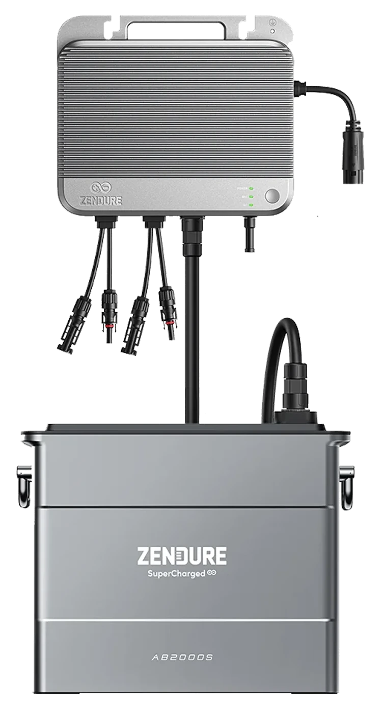
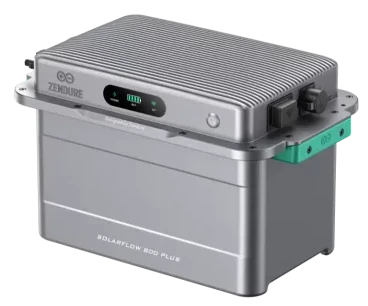
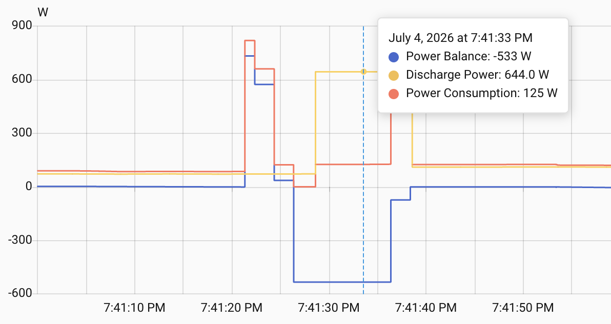

# Gesamt-Inhaltsverzeichnis {#Inhaltsverzeichnis}

-   [Hauptseite mit Zusammenfassung etc.](index.md)
-   [Photovoltaik und ihr möglicher Ertrag](PV.md)
-   [Stromverbrauch und Einspeisung im Haushalt](SV.md)
-   [Eigenverbrauch und seine Berechnung](EV.md)
-   [Nutzungsvarianten](SSG.md#Nutzung)
    -   [Direkte Netzeinspeisung (Steckersolargerät SSG, „Balkonkraftwerk“)](SSG.md#SSG)
    -   [Hausnetzeinspeisung mit Pufferspeicher](Speicher.md)
    -   [Inselanlage (mit Speicherung) und Kombination](Insel.md)
-   [Auswahl und Nutzung von Komponenten](Komp.md)
-   [Beispiel-Konfigurationen](Bsp.md)

### Zendure SolarFlow

{:.right
width="250" style="margin-left: 10px; margin-right: 10px"}
{:.right
width="250" style="margin-left: 10px; margin-right: 10px"}

Eine vom Preis-/Leistungsverhältnis sehr attraktive Produktserie finde ich
[Zendure SolarFlow](https://www.zendure.de/collections/solarflow-serie), insbesondere 800
[Pro](https://www.idealo.de/preisvergleich/OffersOfProduct/206560042_-solarflow-800-pro-1920wh-zendure.html) bzw.
[Plus](https://www.idealo.de/preisvergleich/OffersOfProduct/209331116_-solarflow-800-plus-zendure.html).
Die ist mit einem knapp 2 kWh Speicher inzwischen für unter 400€,
teils sogar unter 300€ erhältlich
und bietet dafür sehr viel, inklusive bidirektionalem Wechselrichter,
diverse Regelungsmodi sowie eine Batterieheizung bei kalten Temperaturen.
 
Die SolarFlow-Produkte bestehen aus
einer Steuereinheit (engl. *hub* oder *controller*) mit Hybrid-Wechselrichter
und einem oder optional auch mehreren Batterien.
Der SolarFlow 800 Plus hat nur 2 MPPT-Eingänge mit je max. 750&nbsp;W
(während die Pro-Variante 4 MPPT-Eingänge hat mit je max. 660&nbsp;W).
Seine Batterie vom Typ AB2000L ist bei gleicher Kapazität deutlich kompakter
und leichter und hat eine Gel-basierte Brandunterdrückung, während die
Batterie der Plus-Serie ein aktives Aerosol-basiertes System verwendet.
Dagegen bietet nur die Pro-Serie einen Off-Grid-Anschluss (Notstromfunktion).
Beide haben eine WR-Ausgangsleistung von max. 800&nbsp;W, wodurch sie in
Deutschland VDE-konform betreiben werden können,
und eine AC-Ladeleistung von 1000&nbsp;W.

Ein schöner Online-Artikel inkl. Test mit vielen Details zum SolarFlow 800 Plus
finde sich [hier](https://www.smartzone.de/zendure-solarflow-800-plus-test/).

Die Cloud-basierte Regelung des Herstellers,
genannt *Home Energie Management System* (*HEMS*)
hat eine brauchbare Reaktionszeit von etwa 4 bis 10 Sekunden und
erreicht nicht ganz eine Nulleinspeisung, wie weiter unten näher erläutert.
<!-- etwa 3 bis 5 Sekunden gemäß https://www.heise.de/bestenlisten/testsieger/top-10-balkonkraftwerk-mit-speicher-im-test-jetzt-besonders-guenstig/9g7b03h#id-1-zendure-solarflow-800-pro)-->
* Der „*Smart-CT*”-Modus verwendet als Eingaben die aktuelle PV-Leistung,
den Zustand der Batterie und die Leistungsbilanz im Haushalt, welche
mit einen externen Gerät wie z.B. einem Shelly (Pro) 3EM, oder einem Zendure
Smart Meter D0 / 3CT oder einem Smart Meter mit Lesekopf gemessen werden muss.
* Im sog. „*ZENKI*”-Modus werden zusätzlich dynamische Stromtarife,
Wetterprognosen und typische Stromverbrauchsmuster des Haushalt berücksichtigt.

Leider haben die SolarFlow-Systeme an verschiedenen Stellen
relativ große Verluste &mdash; mehr dazu etwas weiter unten.

Die App hat diverse Macken: Die Einrichtung der Geräte ist hakelig,
das Speichern von Options-Parametern wie der maximalen Einspeiseleistung
bringt teils irreführende Fehlermeldungen, und die Änderung des Regelungsmodus
(„Energieplan”) hat bei meinem Zendure SolarFlow 800 Plus meist keinen Effekt.
Während des Speicher-Ladens wird nicht die tatsächliche Ladeleistung nach Verlusten angezeigt,
sondern die Differenz aus PV-Leistung („Solarmodul”) und Leistungsabgabe („Heimnutzung”).
Immerhin werden PV-Leistung und Leistungsabgabe korrekt gemessen und angezeigt,
so dass man in den Zeiten, wo der Speicher in Ruhe ist (also weder geladen noch
entladen wird) auf den realen Verlust durch die Wechselrichtung schließen kann,
welcher je nach Einspeiseleistung ziemlich mau ist: bei 100&nbsp;W etwa 20%!

<!--
Zendure SolarFlow 800 Plus
Standby Bezug aus dem Netz: 0,3 W bzw. 0,85W; lt. Shelly 0,03 A => 7 W

34,3 V
2,65 A = 90,9 W vs. angezeigt: 88 W,
3,09 A = 105  W vs. angezeigt: 99 W

PV 1  35,4 V * 2,35 A    =  83 W, Anzeige PV  80 W Ausgang 61-62 vs real  61,5 - 77%
PV 2  34   V * 3,02 A    = 103 W, Anzeige PV  94 W Ausgang    72 vs real  72   - 77%
PV1+2 34,5 V*(1,93+2,47) = 152 W, Anzeige PV 151 W Ausgang   125 vs real 126   - 83%

Bypass Wirkungsgrad: 166/193 = 86%, 64 / 86 = 74 %,
Bypass Wirkungsgrad: 160 bzw. real 162.5 / 190 = 85 %,
Vergleich Deye Ausgangsleistung 166 W

Beim Laden angeblich 100% Wirkungsgrad (Heimnutzung 33 + Akku 93) / Solarmodul 126 = 100 %
--->

Unverzeihlich finde ich folgenden Bug:
Obwohl im Eigenverbrauchsmodus mit „Smart-CT”-Regelung ein 3-Phasen-Messgerät
(bei mir ein Shelly 3EM) verwendet wird und korrekte Daten zum Leistungssaldo liefert,
zeigt die App bei „Öffentliches Netz” statt Netzbezug oder -einspeisung immer "OW" an!
Dieses Fehlverhalten ist seit mindestens Sommer 2024 bekannt
und wurde also über 2 Jahre lang nicht behoben. Vermutlich ist der Grund dafür,
dass man für die Anwender nicht offensichtlich darstellen will, dass die Regelung
keine echte Nulleinspeisung bringt.

Die „Smart-CT”-Regelung führt trotz des Ziels, den Eigenverbrauch zu maximieren,
zu einen gewissen unerwünschten Energieexport ins externe Netz. Bei recht statischen
Verhältnissen sind es meist nur sehr kleine negative Leistungssalden von wenigen Watt
(bis ca. -20&nbsp;W), allerdings teilweise über Minuten hinweg.
Dies liegt v.A. an einer gewissen Ungenauigkeit der Regelung.
Eine einfache Ausweichlösung wäre, den Saldo-Ziel-Wert der Regelung statt auf 0
auf ca. 20&nbsp;W zu setzen (bzw. am Regelungseingang diesen Wert abzuziehen), so dass
der Saldo real zwischen ca. 0 und 40&nbsp;W schwanken würde und jedenfalls kaum noch
negativ würde, aber dafür bietet Zendure keine Option, die man einstellen könnte.
 
Es gibt aber bedingt durch die Trägheit der Regelung kurzzeitig auch
recht große negative Ausschläge, etwa jedes Mal wenn ein Kühlschrank-Kompressor beim
Anlaufen für etwa 2 Sekunden eine induktive Lastspitze von ca. 800&nbsp;W erzeugt.
Dann versucht die Zendure-Regelung unsinnigerweise, diese auszugleichen,
indem sie innerhalb von ein paar Sekunden die Einspeisung aus PV und/oder Speicher
auf über 600&nbsp;W erhöht, während die Lastspitze eigentlich schon wieder vorbei ist,
und diese dann auch noch über ca. 10&nbsp;Sekunden beibehält,
bis sie sich darauf eingestellt hat, dass der Kühlschrank für die nächsten Minuten
eine moderate nahezu konstante Zusatzlast von etwa 50&nbsp;W verursacht. 
Die durch solche Effekte bewirkte ungewollte Netzeinspeisung liegt aber
jedenfalls in unserem Haushalt in Summe bei nur 35&nbsp;Wh pro Tag,
was im Jahr je nach Strompreis einen Verlust von etwas unter 4€ ausmacht.
 
Auch wenn diese Netzeinspeisung verschmerzbar ist, sollte die App sie nicht einfach
unterschlagen. Auch normalen Netzbezug (wenn PV-Leistung und Batterieladung nicht
ausreichen, um die aktuelle Last abzudecken) sollte durch die App dargestellt werden.
Lade- und Entladeverluste werden, wie oben schon erwähnt, ebenfalls nicht angezeigt.

Die eingestellte Entladungsgrenze des Speichers wird von der SolarFlow-Regelung
einigermaßen eingehalten. Allerdings sinkt die Ladung des Speichers in Ruhe über Nacht
um etwa 1% ab, was bei bei 12 Stunden und dem AB2000 mit 1.920&nbsp;Wh Kapazität
eine Verlustleistung bzw. einen internen Verbrauch von 1,5 W ausmacht. 
Während der SolarFlow nichts einspeist oder aus dem Netz entnimmt, kann man an seinem
Netzstecker außerdem einen ständigen Verbrauch von etwa 7&nbsp;W messen. 
In Summe ergibt sich für den SolarFlow ein Eigenverbrauch von etwa 200&nbsp;Wh,
was aufs Jahr umgerechnet je nach Strompreis etwa 22€ ausmacht.

<!--
Local IspellDict: german8
LocalWords: description created changed webp right width style margin left px
LocalWords: br hub controller Off Grid Standby HEMS nbsp id mdash OW png
LocalWords: zendure solarflow Regelungsmodi Regelungsmodus ZENKI mau
LocalWords: Eigenverbrauchsmodus
-->
