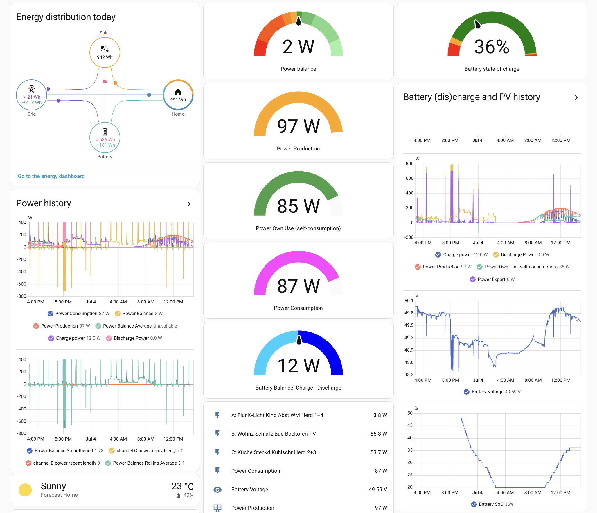

# (Gesamt-)Inhaltsverzeichnis {#Inhaltsverzeichnis}

-   [Hauptseite mit Zusammenfassung etc.](index.md)
-   [Photovoltaik und ihr möglicher Ertrag](PV.md)
-   [Stromverbrauch und Einspeisung im Haushalt](SV.md)
-   [Eigenverbrauch und seine Berechnung](EV.md)
-   [Nutzungsvarianten](SSG.md#Nutzung)
    -   [Direkte Netzeinspeisung (Steckersolargerät SSG, „Balkonkraftwerk“)](SSG.md#SSG)
    -   [Hausnetzeinspeisung mit Pufferspeicher](Speicher.md)
        - [Zendure SolarFlow](#allgemein)
        - [Zendure-App und Alternativen zur Darstellung der SolarFlow-Daten](#Daten)
        - [Zendure „Smart-CT”-Regelung und Alternativen](#Regelung)
        - [Interne Verluste des SolarFlow](#Verluste)
    -   [Inselanlage (mit Speicherung) und Kombination](Insel.md)
-   [Auswahl und Nutzung von Komponenten](Komp.md)
-   [Beispiel-Konfigurationen](Bsp.md)

### Zendure SolarFlow {#allgemein}

{:.right
width="250" style="margin-left: 10px; margin-right: 10px"}
{:.right
width="250" style="margin-left: 10px; margin-right: 10px"}

Eine vom Preis-/Leistungsverhältnis sehr attraktive Produktserie finde ich
[Zendure SolarFlow](https://www.zendure.de/collections/solarflow-serie), insbesondere 800
[Pro](https://www.idealo.de/preisvergleich/OffersOfProduct/206560042_-solarflow-800-pro-1920wh-zendure.html) bzw.
[Plus](https://www.idealo.de/preisvergleich/OffersOfProduct/209331116_-solarflow-800-plus-zendure.html).
Die ist mit einem knapp 2 kWh Speicher inzwischen für unter 400€,
teils sogar unter 300€ erhältlich
und bietet dafür sehr viel, inklusive bidirektionalem Wechselrichter,
diverse Regelungsmodi sowie eine Batterieheizung bei kalten Temperaturen.
Außerdem bietet sie über das sog. zenSDK eine hervorragende Unterstützung
für direkten Zugriff und eigene Regelung &mdash; mehr dazu [unten](#Regelung).
 
Die SolarFlow-Produkte bestehen aus
einer Steuereinheit (engl. *hub* oder *controller*) mit Hybrid-Wechselrichter
und einem oder optional auch mehreren Batterien.
Der SolarFlow 800 Plus hat nur 2 MPPT-Eingänge mit je max. 750&nbsp;W
(während die Pro-Variante 4 MPPT-Eingänge hat mit je max. 660&nbsp;W).
Seine Batterie vom Typ AB2000L ist bei gleicher Kapazität deutlich kompakter
und leichter und hat eine Gel-basierte Brandunterdrückung, während die
Batterie der Plus-Serie ein aktives Aerosol-basiertes System verwendet.
Dagegen bietet nur die Pro-Serie einen Off-Grid-Anschluss (Notstromfunktion).
Beide haben eine WR-Ausgangsleistung von max. 800&nbsp;W, wodurch sie in
Deutschland VDE-konform betreiben werden können,
und eine AC-Ladeleistung von 1000&nbsp;W.

Ein schöner Online-Artikel inkl. Test mit vielen Details zum SolarFlow 800 Plus
finde sich [hier](https://www.smartzone.de/zendure-solarflow-800-plus-test/).

Die Cloud-basierte Regelung des Herstellers,
genannt *Home Energie Management System* (*HEMS*)
hat eine brauchbare Reaktionszeit von etwa 4 bis 10 Sekunden und
erreicht nicht ganz eine Nulleinspeisung, wie weiter unten näher erläutert.
<!-- etwa 3 bis 5 Sekunden gemäß https://www.heise.de/bestenlisten/testsieger/top-10-balkonkraftwerk-mit-speicher-im-test-jetzt-besonders-guenstig/9g7b03h#id-1-zendure-solarflow-800-pro)-->
* Der „*Smart-CT*”-Modus verwendet als Eingaben die aktuelle PV-Leistung,
den Zustand der Batterie und die Leistungsbilanz im Haushalt, welche
mit einen externen Gerät wie z.B. einem Shelly (Pro) 3EM, oder einem Zendure
Smart Meter D0 / 3CT oder einem Smart Meter mit Lesekopf gemessen werden muss.
* Im sog. „*ZENKI*”-Modus werden zusätzlich dynamische Stromtarife,
Wetterprognosen und typische Stromverbrauchsmuster des Haushalt berücksichtigt.

Leider haben die SolarFlow-Systeme an verschiedenen Stellen einige Verluste,
die nicht ausgewiesen werden &mdash; mehr dazu in den nächsten Abschnitten.

#### Zendure-App und Alternativen zur Darstellung der SolarFlow-Daten {#Daten}

Die App hat ein sehr schickes Design und kann über die Cloud-Anbindung
des SolarFlow (welche über WLAN läuft) auch unterwegs verwendet werden.
Man kann mit ihr wichtige Einstellungen machen, aktuelle Daten abrufen
und (nicht sonderlich bequem) auch Statistiken über diverse Zeiträume ansehen.
Sie und die Software dahinter in der Steuereinheit haben diverse Macken,
auf die dieser Abschnitt an mehreren Stellen eingeht.
Schon die Einrichtung der Geräte ist nicht sehr benutzerfreundlich,
besonders wenn es um die Verbindung von Energiespeicher und Smart Meter geht,
und das Speichern von Options-Parametern wie der maximalen Einspeiseleistung
bringt teils irreführende Fehlermeldungen.
<!-- , und teils hatte bei meinem  SolarFlow 800 Plus
die Wahl eines anderen Regelungsmodus („Energieplan”) keinen Effekt.
Zumindest nachdem ich zum ersten mal den Eigenverbrauchsmodus eingestellt hatte,
hat die Wahl des Benutzerdefinierten Modus keinerlei Effekt. -->

Bei näherer Betrachtung der Leistungs-Daten, die ein SolarFlow liefert,
ergibt sich der Schluss, dass das Gerät nur die Leistung an den PV-Eingängen
und die Einspeise- bzw. Bezugsleistung an seinem Netzstecker misst und
die von ihm angegebene Lade- und Entladeleistung des angeschlossenen Speichers
daraus nur näherungsweise ohne Berücksichtigung der Verluste wie folgt bestimmt:

{:style="clear:both"}

{:.right width="300"
style="margin-left: 10px; margin-right: 10px"}
<!-- conv_50 SolarFlow-Energiefluss-Speicher-Ladung.png;
convert SolarFlow-Energiefluss-Speicher-Ladung.png -crop 540x760+0+360 \
+repage SolarFlow-Energiefluss-Speicher-Ladung.png
-->

* Beim Entladen des Speichers berechnet der SolarFlow-Controller
(unabhängig davon, ob gerade PV-Leistung vorhanden ist) als Entladeleistung
einfach die Differenz aus der PV-Leistung am Eingang („Solarmodul”)
und Leistungsabgabe („Heimnutzung”), und die App zeigt diese Differenz an.
Also nicht die tatsächliche Entladeleistung, denn die ist eigentlich höher,
nämlich um den Betrag der unvermeidlichen Verluste durch die Wechselrichtung,
welche sowohl den PV-Anteil als auch die Speicher-Entladung betreffen,
und um den Betrag der ebenfalls unvermeidlichen MPPT-Verluste beim PV-Anteil.
Siehe Bild rechts:
Wenn die PV-Leistung 158&nbsp;W beträgt und 200&nbsp;W ins Heimnetz abgegeben
werden, wird der Speicher eigentlich mit deutlich mehr als 42&nbsp;W entladen.

* Ebenso wird beim Laden des Speichers (sei es mit DC PV-Leistung und/oder
AC aus dem Heimnetz) als Ladeleistung einfach die Differenz aus der PV-Leistung
und Leistung an der Steckdose (welche beim Laden aus dem Heimnetz negativ ist)
gebildet und angezeigt.
Die tatsächliche Ladeleistung ist eigentlich geringer, weil von der Differenz
eigentlich noch die MPPT-Verluste und/oder die Verluste des AC-Ladegeräts
bzw. die Wechselrichtungs-Verluste (im Falle positiver Heimnetz-Einspeisung)
abzuziehen wären.

<!--
* Beim Laden des Speichers über die Steckdose
oder über die Solarmodule ohne Netzeinspeisung wird ebenfalls suggeriert,
dass keinerlei Verluste entstehen.
-->

<!--{:.right width="300"
style="margin-left: 10px; margin-right: 10px"}-->
{:.right width="300"
style="margin-left: 10px; margin-right: 10px"}

* Während beim Laden über die Steckdose im benutzerdefinierten Modus die
eingestellte Leistung von z.B. 200&nbsp;W (oder etwas weniger als das) angegeben
wird, wie im Bild rechts, schwankt zumindest bei meinem Gerät
aus irgendeinem Grund die tatsächlich vom Heimnetz bezogene Leistung
innerhalb von wenigen Sekunden teils enorm, und zwar zwischen 0 und
etwas mehr als dem gewünschten Wert (im gegebenen Beispiel bis ca. 209&nbsp;W).
<!--  TODO vielleicht liegt das an gleichzeitig schwankendem PV-input? -->

{:style="clear:both"}

{:.right width="300"
style="margin-left: 10px; margin-right: 10px"}

* Wenn der SolarFlow mit der App per Bluetooth (statt WLAN) verbunden ist,
werden PV-, Speicher- und Heimnetzanschluss-Leistung
nicht ganz synchron <!-- gemessen bzw. --> dargestellt:
Bei Änderungen der PV-Leistung hinkt die Darstellung teils
über mehrere Sekunden auf unterschiedlichen Seiten hinterher,
was zu teils grob inkonsistenten Zahlen führen kann wie rechts im Bild,
wo bei 52&nbsp;W PV-Leistung und 37&nbsp;W Heimnutzung der Akku mit angeblich
70&nbsp;W geladen wird.

<!--
PV 34,3 V
2,65 A = 90,9 W vs. angezeigt: 88 W,
3,09 A = 105  W vs. angezeigt: 99 W

PV 1  35,4 V * 2,35 A    =  83 W, Anzeige PV  80 W Ausgang 61-62 vs real  61,5 - 77%
PV 2  34   V * 3,02 A    = 103 W, Anzeige PV  94 W Ausgang    72 vs real  72   - 77%
PV1+2 34,5 V*(1,93+2,47) = 152 W, Anzeige PV 151 W Ausgang   125 vs real 126   - 83%

Bypass Wirkungsgrad: 166/193 = 86%, 64 / 86 = 74 %,
Bypass Wirkungsgrad: 160 bzw. real 162.5 / 190 = 85 %,
Vergleich Deye Ausgangsleistung 166 W

Beim Laden angeblich 100% Wirkungsgrad (Heimnutzung 33 + Akku 93) / Solarmodul 126 = 100 %
-->
{:.right width="300"
style="margin-left: 10px; margin-right: 10px"}

* Immerhin werden PV-Leistung und Leistung am Netzstecker ziemlich korrekt
gemessen und angezeigt, so dass man
in den Zeiten, wo der Speicher weder geladen noch entladen wird,
auf den realen Verlust durch MPPT und die Wechselrichtung schließen kann.
Im Bild rechts ergeben sich aus der Differenz von 27&nbsp;W aus PV-Leistung
246&nbsp;W und Heimnetz-Einspeisung 219&nbsp;W ein Verlust von 11%.
Der Wirkungsgrad im Bypass-Betrieb (hier 89%) ist also nicht toll, was aber
besonders bei geringer Auslastung des Wechselrichters leider normal ist.
Bei einer PV-Eingangsleistung von 190&nbsp;W beträgt der Verlust schon 16%,
und bei nur 29&nbsp;W sind es sogar 69%.

{:style="clear:both"}

{:.left width="250"
style="margin-left: 0px; margin-right: 25px"}

Völlig unverständlich finde ich folgenden Bug:
Obwohl im Eigenverbrauchsmodus mit „Smart-CT”-Regelung ein 3-Phasen-Messgerät
(bei mir ein Shelly 3EM) verwendet wird und korrekte Daten zum Leistungssaldo
liefert, zeigt die App in der Geräte-Ansicht unter „Energiefluss” des SolarFlow
bei „Öffentliches Netz” statt Netzbezug oder -einspeisung immer "OW" an!
Siehe Bild links. Dieses Fehlverhalten ist seit mindestens Sommer 2024 bekannt
und wurde damit schon über zwei Jahre lang nicht behoben.
<!--
Vieleicht ist der Grund dafür, dass man für die Anwender nicht offensichtlich
darstellen will, dass die Regelung keine echte Nulleinspeisung bringt.
-->
Den Netzbezug (wenn PV-Leistung und Batterie-Entladeleistung nicht ausreichen,
um die aktuelle Last abzudecken) sollte die App im „Energiefluss” darstellen.

{:.right width="250"
style="margin-left: 25px; margin-right: 0px"}

Auf ihrer Startseite (siehe das Bild rechts von fast der selben Zeit)
stellt die App den Netzbezug unter dem Namen „Stromnetz” aber korrekt dar.
Die Darstellung ist allerdings nur aktuell, wenn sie über WLAN verbunden ist -
bei Verbindung über Bluetooth wird sie nur dann aktualisiert,
wenn man zwischendurch auf eine andere Ansicht wechselt. Gemäß dem Bild
lässt sich aus dem korrekt angezeigten Haushalts-Verbrauch von 117&nbsp;W
und Netzbezug von 87&nbsp;W auf eine Einspeiseleistung von 30&nbsp;W schließen.
Im Bild davor wird sie auch explizit dargestellt: in dem Moment 29&nbsp;W.
<!-- Daraus und der PV-Leistung von 47&nbsp;W ergibt sich Bypass-Verlust von 19%
bei sehr geringer PV-Leistung. -->

Auch Netzeinspeisung (selbst wenn sie meist verschmerzbar gering ist)
sollte die App <!-- im „Energiefluss”, TODO oder auch im „Energiesystem”? -->
nicht einfach unterschlagen.
Wie oben erwähnt werden Lade- und Entladeverluste ebenfalls nicht angezeigt,
während man aus den Ausgaben auf den Wechselrichtungs-Verlust schließen kann,
wenn der Speicher nicht gerade geladen oder entladen wird.

Mehr Details und eine wesentlich bessere Darstellung bekommt man im
Home Assistant über die [Zendure Home Assistant Integration (Zendure-HA)](
https://github.com/Zendure/Zendure-HA). Dazu
[hier](https://iotdomotica.nl/tutorial/install-zendure-home-assistant-integration-tutorial)
eine Installationsanleitung.
Dann kann man sich auch eigene, abgeleitete Sensoren und erweitertes Reporting
definieren, wie ich es im [SolBatHome](https://github.com/DDvO/SolBatHome/)
gemacht habe, und sich ein Dashboard nach eigenen Wünschen zusammenstellen.

[{:.center}](
https://github.com/DDvO/SolBatHome/)

{:style="clear:both"}
#### Zendure „Smart-CT”-Regelung und Alternativen {#Regelung}

Die „Smart-CT”-Regelung von Zendure hat das Ziel, den Eigenverbrauch zu maximieren,
was v.A. durch eine Nulleinspeisung ins externe Netz erreicht werden sollte.
Trotzdem führt sie noch zu einen gewissen unerwünschten Energieexport.
Bei recht statischen Verhältnissen betragen die negativen Leistungssalden
meist nur wenige Watt, allerdings teilweise über Minuten hinweg, und
manchmal erreicht die Leistungsabgabe ans externe Netz fast 20&nbsp;W.
 
Dies liegt v.A. an einer gewissen Ungenauigkeit der Regelung.
Eine einfache Ausweichlösung wäre, den Saldo-Ziel-Wert der Regelung statt auf 0
auf ca. 20&nbsp;W zu setzen (bzw. am Regelungseingang diesen Wert abzuziehen),
so dass der Saldo real zwischen ca. 0 und 40&nbsp;W schwanken würde
und jedenfalls kaum noch negativ würde. Aber dafür bietet Zendure keine
einstellbare Option.

{:.right width="490"
style="margin-left: 10px; margin-right: 10px"}

Es gibt aber bedingt durch die Trägheit der Regelung kurzzeitig auch recht
große negative Ausschläge, etwa jedes Mal wenn ein Kühlschrank-Kompressor
beim Anlaufen für etwa 1-2 Sekunden eine induktive Lastspitze
von beispielsweise 800&nbsp;W erzeugt.
Dann versucht die Zendure-Regelung unsinnigerweise, diese auszugleichen,
indem sie nach ein paar Sekunden die Einspeisung aus PV
und/oder Speicher auf über 600&nbsp;W erhöht,
während die Lastspitze eigentlich schon wieder vorbei ist.
Diese behält sie dann auch noch über ca. 10&nbsp;Sekunden hinweg bei, bis sie
sich darauf eingestellt hat, dass der Kühlschrank für die nächsten Minuten
eine moderate nahezu konstante Last (von etwa 50&nbsp;W) verursacht. 

{:style="clear:both"}

Die durch solche Effekte bewirkte ungewollte Netzeinspeisung liegt aber
jedenfalls in unserem Haushalt in Summe bei moderaten 35&nbsp;Wh pro Tag,
was im Jahr je nach Strompreis einen Verlust von etwas unter 4€ ausmacht.
<!--
Zendure SolarFlow 800 Plus
Standby Bezug aus dem Netz: 0,3 W bzw. 0,85W; lt. Shelly 0,03 A => 7 W
-->
 
Die Schwächen des Zendure-HEMS kann durch Verwendung
einer alternative Regelung mit lokaler Kommunikation vermeiden.
* Auf allen neueren SolarFlow-Geräten wie der Pro- und AC-Serie und dem 800
Plus das offizielle *Zendure Local Control System* verfügbar,
auch [zenSDK RESTful API](https://github.com/Zendure/zenSDK) genannt.
Das ist über HTTP direkt zur Daten-Abfrage und zur Regelung verwendbar.
Leider sind die darüber abrufbaren Leistungsdaten zur Speicher-Ladung
und -Entlade- die selben idealisierten Daten (ohne Berücksichtigung von
Verlusten) wie [oben](#Daten) schon für die App-Ansicht bemängelt.
Eine relativ einfach nutzbare und einigermaßen frei konfigurierbare
Anwendung dafür ist die Home-Assistant-Integration
[Zendure-HA-zenSDK](https://github.com/Gielz1986/Zendure-HA-zenSDK/) von Gielz.
 
Über einen zenSDK HTTP-POST-Aufruf kann man aber auch sehr einfach
den inzwischen dort integrierten MQTT-Client einstellen und aktivieren.
* Mit etwas Aufwand kann man auf den klassischen SolarFlow-Hubs wie Hub 1200,
Hyper 2000 und Ace 1500, ein lokal nutzbares [MQTT-Interface freischalten](
https://github.com/reinhard-brandstaedter/solarflow-bt-manager)
und [für eine eigene Regelung nutzen](
https://tbsch.de/post/2025-06-15-zendure-solarflow-lokal-uber-mqtt-steuern/).

#### Interne Verluste des SolarFlow {#Verluste}

Wie jeder 'intelligente' Speicher verliert der SolarFlow ständig
eine gewisse Menge Energie durch elektrochemische Selbstentladung der Batterie
und durch den Eigenverbrauch seiner Elektronik. Diese Verluste müssen über die
angeschlossenen PV-Module oder notfalls auch aus dem Stromnetz gedeckt werden.

Während der SolarFlow nichts einspeist oder aus dem Netz entnimmt, kann man
an seinem Netzstecker einen ständigen Bezug von etwa 0,9&nbsp;W messen.
Das ergibt in 24 Stunden schon mal etwas über 20 Wh Eigenverbrauch.

{:.right
width="300" style="margin-left: 10px; margin-right: 10px"}

Auch wenn die eingestellte Entladungsgrenze des Speichers von der Regelung
eingehalten wird, sinkt die Ladung des Speichers in Ruhe über Nacht um etwa 1%
ab, was bei bei 12 Stunden und dem AB2000 mit 1.920&nbsp;Wh Kapazität
auf eine moderate Standby-Verlustleistung von 1,5 W&nbsp;hindeutet. 
Am Morgen dauert es denn erst mal ein Zeit lang, bis dieser Verlust
durch Nachladen mit Überschuss aus den PV-Modulen,
der nicht sofort im Haushalt gebraucht wird, wieder ausgeglichen ist. 
In der Zendure-App kann man sich (auch unabhängig von der verwendeten Regelung)
ansehen, wie viel Energie über einen Tag, eine Woche, einen Monat oder ein Jahr
in den Speicher geflossen sind und aus ihm heraus ins Heimnetz abgegeben wurde.
Besonders bei wenig PV-Ertrag ergibt sich eine ernüchternde Bilanz:
Allein um den Mindest-Ladestand von z.B. 20% über einen Tag hinweg zu erhalten,
müssen gemäß dem Screenshot im Bild in 24 Stunden scheinbar etwa 240&nbsp;Wh
in den Speicher nachgeladen werden. Davon sind allerdings gemäß der
[o.g. Betrachtung](#Daten) noch die ohnehin für PV-Nutzung unvermeidlichen
MPPT- und Wechselrichter-Verluste abzuziehen, so dass hier de facto etwa 20%
weniger anzusetzen sind. Trotzdem bleiben pro Tag ungefähr 190 Wh PV-Ertrag,
die nicht nutzbar sind,
sondern durch die Batterie selbst und den Rest des SolarFlow verbraucht werden!
An ertragsarmen Tagen ist das Gerät damit sogar kontraproduktiv.

Nach den genannten Messungen und den Beobachtungen und Interpretationen der
SolarFlow-Statistiken liegt der Eigenverbrauch des Systems, jedenfalls wenn
wenig PV-Ertrag vorhanden ist, in Summe bei etwas mehr als 210&nbsp;Wh pro Tag,
also im Schnitt bei ungefähr 9&nbsp;Watt Verlustleistung.
Das macht aufs Jahr umgerechnet je nach Strompreis etwa 25€ aus. 
Online findet man zum SolarFlow-Eigenverbrauch übrigens sehr unterschiedliche
Angaben von etwa 100 bis 300&nbsp;Wh pro Tag, was auf unsaubere Messungen
und unklare Interpretation der Daten zurückzuführen sein wird.

Wenn man den SolarFlow rein AC-gekoppelt betreibt,
lässt sich durch externe Messung der Energie, die über einen Zeitraum
in das Gerät geflossen bzw. aus ihm wieder entnommen wurde,
der Gesamt-Wirkungsgrad des Systems sehr einfach und klar bestimmen,
inklusive der Verluste durch das AC-Ladegerät und den Wechselrichter. 
So ergeben sich beispielsweise aus einer Investition von 175&nbsp;kWh
und Entnahme von 131&nbsp;kWh (über einen Zeitraum von 3 1/2 Monaten
<!--ab Ende März-->) ein System-Wirkungsgrad von 75%.
Von den 25% Verlust gehen vermutlich 15-18 Prozentpunkte auf den Wechselrichter.

<!--
Und mit "gutem Eigenverbrauch" meinst du wohl den Wirkungsgrad des Wechselrichters. Der ist nicht so toll. Je nach Auslastung ca. 80 bis 86 %.

Plus Verluste von in diesem Fall an die 160 W
durch den Wechselrichter beim Bypass der PV-Leistung,
was also einen miesen WR-Wirkungsgrad (bei geringer Auslastung)
von gerade mal 78% bedeutet. Nicht begeisternd.

Ah, okay, mit einer größeren PV-Anlage sieht die Sache natürlich anders aus!
Da amortisiert sich so ein günstiger kleiner Speicher wirklich sehr schnell.
https://www.mydealz.de/deals/aliexpress-de-balkonkraftwerk-mit-speicher-2810273#comments
-->
<!--
  Ich lade rein AC und da werde ich wohl einiges verlieren
  Ich habe auch erst seit 3,5 Monate diesen Akku
  Mein HA sagt mir diese Werte.
  Der hat 175kWh geladen und 131kWh entladen seit Ende März

Das ist auch insofern interessant, dass man sehen kann,
wie mau hier der Gesamt-Wirkungsgrad des SolarFlow ist, nämlich etwa 75%.

Davon werden ca. 15-18 Prozentpunkte auf seinen Wechselrichter gehen.
Ich gehe davon aus, dass du den SolarFlow nur AC-gekoppelt betreibst
und mit den 175 kWh die Gesamt-Energie gemeint ist,
die an seiner Steckdose reingeflossen sind. Dann sind da
in den internen Verlusten auch die Verluste durch das AC-Ladegerät enthalten
-->

<!--
Local IspellDict: german8
LocalWords: description created changed webp right width style margin left px
LocalWords: br hub controller Off Grid Standby HEMS nbsp id mdash OW png center
LocalWords: comments zendure solarflow Regelungsmodi Regelungsmodus ZENKI mau
LocalWords: Eigenverbrauchsmodus clear both Wechselrichtungs zenSDK RESTful
LocalWords: Gielz index md Komp Local Hyper Ace conv convert crop repage
LocalWords: LocalWords
-->
