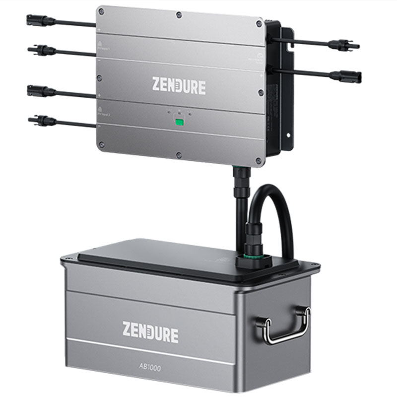

# (Gesamt-)Inhaltsverzeichnis {#Inhaltsverzeichnis}

-   [Hauptseite mit Zusammenfassung etc.](index.md)
-   [Photovoltaik und ihr möglicher Ertrag](PV.md)
-   [Stromverbrauch und Einspeisung im Haushalt](SV.md)
-   [Eigenverbrauch und seine Berechnung](EV.md)
-   [Nutzungsvarianten](SSG.md)
    -   [Direkte Netzeinspeisung (Steckersolargerät SSG, „Balkonkraftwerk“)](SSG.md#SSG)
    -   [Hausnetzeinspeisung mit Pufferspeicher](Speicher.md)
        - [Kommerzielle SSG-Speicherlösungen, Stand Sommer 2024](#kommerziell)
            - [Zendure SolarFlow, AIO 2400 und Hub 2000](#SolarFlow)
            - [Anker Solix](#Solix)
            - [Maxxisun Maxxicharge](#Maxxicharge)
            - [Tentek Tribune EMS](#Tentek)
            - [Weitere Produkte](#sonstige)
          - [Effizienz und Speicher-Amortisation](Speicher.md#Effizienz)
        - [SSG-Speicherlösungen im Eigenbau](Speicher-Eigenbau.md)
    -   [Inselanlage (mit Speicherung) und Kombination](Insel.md)
-   [Auswahl und Nutzung von Komponenten](Komp.md)
-   [Beispiel-Konfigurationen](Bsp.md)

# Kommerzielle SSG-Speicherlösungen, Stand Sommer 2024 {#kommerziell}

Hier eine kommentierte Übersicht,
insbesondere zu den jeweils unterstützten Lade- und Entladestrategien.

## Zendure SolarFlow, AIO 2400 und Hub 2000 {#SolarFlow}

{:.right width="400"}

Das wohl erste und bekannteste Produkt seiner Art ist das [Zendure SolarFlow](
https://www.chinahandys.net/zendure-solarflow-im-test-der-speicher-fuer-das-balkonkraftwerk/).
<!--
https://www.energiemagazin.com/zendure-solarflow-balkonkraftwerk-speicher/
https://www.allround-pc.com/artikel/2023/test-zendure-solarflow-speicher-fuer-dein-balkonkraftwerk
-->
Dieses Gerät und seine Nachfolger verfügen über zwei PV-Eingänge mit getrennten
MPPT. Soweit vorhanden, wird zur Einspeisung PV-Strom verwendet
und die ggf. zur Zielleistung fehlende Differenz aus dem Speicher entnommen.\
Wenn der Speicher voll ist, wird im Bypass-Modus der gesamte Ertrag eingespeist.\
Zur Bestimmung der Zielleistung gibt es inzwischen im Wesentlichen drei Modi:
* Im *Terminmodus* kann man abhängig von der Uhrzeit eine feste
Einspeiseleistung (in gewissen Stufen) einstellen, also im Wesentlichen eine
[Konstanteinspeisung bzw. Nachteinspeisung](Speicher-Eigenbau.md#Konstanteinspeisung).
Dem einfachen Spezialfall, ständig 100&nbsp;W einzuspeisen,
hat Zendure den Namen *Batterieprioritätsmodus* gegeben.
* Im sog. *Intelligenten Matching-Modus* wird mindestens so viel eingespeist
wie nötig, um den Verbrauch aller Geräte abzudecken, die an mit dem SolarFlow
online gekoppelten *Smart Plugs* (intelligente Steckdosen) hängen &mdash;
mindestens 100&nbsp;W und [meist deutlich mehr](
https://www.hartware.de/2023/08/21/zendure-solarflow-im-test/4/) als nötig.
* [Seit November 2023](https://www.prnewswire.com/news-releases/zendure-erreicht-bahnbrechende-integration-mit-shelly-pro-3em-shelly-3em-shelly-plus-plug-s-und-shelly-plug-s-und-verbessert-das-intelligente-energiemanagement-301985902.html)
gibt es den *Smart-CT-Modus*, bei dem die Einspeiseleistung dynamisch an den
über ein Shelly (Pro) 3EM gemessen Gesamtverbrauch im Haushalt angepasst wird.\
Nur diese Option ermöglicht eine effiziente Nutzung des PV-Ertrags.
Allerdings [zeigten Praxistests](https://youtu.be/YzKCvYB-axw&t=148s), dass die
Regelung auf Verbrauchs- und Ertrags-Schwankungen träge und ungenau reagiert.
Das liegt teils wohl dran, dass die Kommunikation nicht lokal,
sondern online [über eine Cloud](https://www.steuerdeinleben.de/zendure2000/)
abgewickelt wird, und dass Zendure die Geschwindigkeit einer Änderung der
Einspeiseleistung über den Netzwechselrichter (bislang) künstlich begrenzt.

Leider ermöglicht Zendure nicht, auch Speicher anderer Hersteller zu verwenden.\
Die größere (1.920&nbsp;Wh) Batterie hat eine eingebaute Heizung bei Minusgraden.

Ende Februar 2024 brachte Zendure zwei neue Varianten heraus:

* AIO 2400 &mdash; dazu [hier](
https://www.computerbase.de/2024-02/zendure-aio-2400-test-balkonkraftwerk-akku-speicher/)
eine Rezension
* Hub 2000 &mdash; dazu [hier](https://www.youtube.com/watch?v=emPIPINW7jo)
ein (nicht ganz unabhängiger) Praxistest.\
Der Hub 2000 bringt den großen Vorteil mit sich, dass er bis zu
2 * 900&nbsp;W PV-Leistung entgegennimmt; man kann also 4&nbsp;Module anschließen.
Zwar kann ein Zendure AB 2000 Speicher nur mit max. 1200&nbsp;W geladen werden,
aber das macht sich für die Rentabilität praktisch nicht bemerkbar.

Beide Produkte scheinen die selbe Steuerung zu verwenden wie beim ersten SolarFlow.

## Anker Solix {#Solix}

### Anker Solix Solarbank Version 1 {#Solix1}

Das zweite relativ bekannte Produkt ist die [Anker Solix Solarbank](
https://www.energiemagazin.com/anker-solix-solarbank-balkonkraftwerk-speicher/).
<!--https://www.chinahandys.net/anker-solix-solarbank-test/-->
Das Gerät hat nur einen MPPT (was aber [meist genügt](Komp.html#MPPT))
und bislang im Wesentlichen eine Betriebsart:
Einspeisung mit einer von der Uhrzeit abhängigen und ansonsten konstanten
Zielleistung, welche hier *Familienlastleistungsrate* (FLLR) genannt wird.
Sie ist zwischen 100 und 800&nbsp;W in Stufen von 10&nbsp;W wählbar,
kann aber auch 0&nbsp;W sein (keine Einspeisung).
Aufgrund einer Design-Einschränkung kann das Gerät diese Leistung nur entweder
direkt aus PV-Strom oder aus dem Speicher erbringen, also nicht gleichzeitig
aus beiden Quellen. Deshalb sind die Details der Steuerung etwas eigenartig:

{:.right width="560"}
* Wenn die PV-Leistung mindestens so hoch ist wie die FLLR,
  wird mit FLLR eingespeist und der Rest in den Speicher geladen
  (außer wenn er voll ist, dann erfolgt ein Bypass).
* Wenn die PV-Leistung mindestens 100&nbsp;W unter der FLLR liegt und höchstens
  100&nbsp;W beträgt, wird die FLLR dem Speicher entnommen
  (solange die Kapazität reicht) und die PV-Leistung geht verloren.
  Dieser Verlust ist zum Glück nicht groß: typischerweise 10&nbsp;kWh im Jahr.
* Ansonsten, also wenn die PV-Leistung zwischen 100&nbsp;W und der FLLR liegt
  oder weniger als 100&nbsp;W unter der FLLR
  (was bei einer FLLR von 200&nbsp;W aufs Gleiche hinausläuft),
  wird dem Speicher nichts entnommen und die verfügbare PV-Leistung eingespeist.

Das Produkt hat offenbar noch diverse Kinderkrankheiten, von denen z.B. [hier](
https://www.giga.de/test/anker-solix-solarbank-im-test-bezahlbarer-balkonkraftwerk-speicher-mit-schwaechen/)
berichtet wurde.
Im Jahr 2024 [will Anker Verbesserungen bringen](
https://www.energiemagazin.com/anker-solix-solarbank-balkonkraftwerk-speicher/#unser-test-fazit-zur-anker-solix-solarbank),
um auch Smart Plugs und Lastmessgeräte (Smart Home Integration) zu unterstützen.

<!-- https://www.mydealz.de/comments/permalink/45921047 -->
Es gibt Bastler, die dem Solix eine [nachgelagerte lastabhängige Drosselung](
https://community.home-assistant.io/t/using-anker-solix-solarbank-e1600-in-ha/636063)
über einen regelbaren Wechselrichter verpassen, so dass er über Nacht nur so
viel einspeisen kann wie gerade verbraucht wird. Das macht ihn zwar relativ
effizient, aber wer diesen Aufwand treibt, kann sich eigentlich gleich besser
und v.A. günstiger etwas [eigenes bauen](Speicher-Eigenbau.md).
(Zusätzlich auch tagsüber in die merkwürdige Solix-Steuerung einzugreifen oder
sie zu umgehen wäre noch deutlich komplizierter und würde wohl wenig bringen.)

### Anker Solix Solarbank 2 {#Solix2}

Im Juni 2024 brachte Anker verbesserte Nachfolgemodelle unter dem Namen
Solarbank 2 heraus. Die "Pro"-Variante hat 4 unabhängige MPPT-Eingänge
und einen integrierten 1000&nbsp;W Inselwechselrichter für Notstrom,
während die "Plus"-Variante 2 MPPT hat, mit je 600&nbsp;W Eingangsleistung.

Beide Varianten haben einen integrierten 800&nbsp;W Netzwechselrichter und
außerdem eine lastbasierte Lade- und Entladeregelung, die nach Angaben des
Herstellers sehr flink (innerhalb 3&nbsp;Sekunden) reagiert und damit eine nahezu
optimale Nulleinspeisung (mit etwa 10&nbsp;W Abweichung) ermöglichen sollte.
Ein [Test von ComputerBase](
https://www.computerbase.de/2024-06/anker-solix-solarbank-2-pro-test-akku-balkonkraftwerk/#abschnitt_leistung_mit_smart_meter_an_verbrauch_koppeln)
bestätigt das. Dies ist deutlich besser als man [im Eigenbau](Speicher-Eigenbau.md)
selbst mit einer sehr effizienten Regelung mit einem Hoymiles-Netzwechselrichter
erreichen kann, dessen Reaktionszeit schon ca. 10&nbsp;Sekunden beträgt.
Allerdings läuft das Ganze nur mit dem mitgelieferten proprietären WLAN-gekoppelten
3-Phasen-Messgerät, ist also nicht z.B. mit Shelly (Pro) 3EM kompatibel.
Die Regelung hat auch noch diverse Kinderkrankheiten und Beschränkungen.

Vier unabhängige MPPT wird man [kaum wirklich brauchen](Komp.html#MPPT) &mdash;
das Interessante daran ist vielmehr, dass sich bei der "Pro"-Variante damit
die mögliche Eingangsleistung verdoppelt (auf im Prinzip 2400&nbsp;Wp,
was dann aber nicht mehr als Balkonkraftwerk/SSG gilt), wodurch sich das System
bei passendem Lastprofil und richtig dimensioniertem Speicher deutlich rentabler
betreiben lässt als mit nur max. 1200&nbsp;Wp.\
Siehe [hier](Speicher.md#Effizienz) ein Simulationsergebnis dazu.

Die Behauptungen von Anker, nämlich eine Ersparnis von "bis zu 902€ pro Jahr",
sind allerdings massiv überzogen. Realistisch ist für einen typischen Haushalt
und mit 4 * 450&nbsp;Wp PV-Modulen, wobei das Ganze dann etwa 1500€ kostet,
ungefähr 860&nbsp;kWh Eigenverbrauch pro Jahr, also nur ungefähr 260€.\
Und wenn man den unlauteren Trick herausrechnet,
dass nämlich der weitaus größte Teil der tatsächlichen Ersparnis nicht durch das
Anker Solix, sondern schon durch die (extra zu beziehenden) PV-Module und
den Netzwechselrichter erreicht wird, sieht es für den Speicher nochmal viel
schlechter aus: typischerweise 400&nbsp;kWh und damit 120€ Ersparnis pro Jahr.

Die integrierte Kosteneinsprungs-Berechnung ist auch nicht realistisch, weil sie
einfach auf dem produzierten Strom basiert, statt die diversen auftretenden
Verluste zu berücksichtigen, und weil sie auch den Teil einrechnet,
der (zumindest kurzzeitig) ins externe Netz geht.

## Maxxisun Maxxicharge {#Maxxicharge}

Bislang kaum bekannt und erst ab März 2024 allgemein lieferbar ist der
[Maxxicharge Batteriespeicher](https://www.maxxisun.de/maxxicharge).
Seine Entwicklung erfolgt(e) in Zusammenarbeit mit Hochschule Anhalt komplett
in Deutschland und macht einen sehr soliden Eindruck.
<!-- Es wird 10 Jahre Garantie gegeben. -->
Im Gegensatz zu allen vergleichbaren Produkten wurde er von vornherein auf
[optimale lastabhängige Regelung der Speichernutzung konzipiert](https://www.maxxisun.de/post/zum-ersten-mal-wird-strom-aus-einem-balkonkraftwerk-wirklich-intelligent-verwaltet).

{:.right width="798"}

Bei der Steuereinheit, genannt Central Control Unit (CCU), wird entweder ein
[Shelly (Pro) 3EM](SV.md#Shelly3EM) mitgeliefert oder eine Variante des
[powerfox poweropti](https://poweropti.powerfox.energy/), welcher die CCU
mit Last-Daten im Sekundentakt versorgt, und zwar in einem eigens aufgespannten
WLAN, wobei die Reichweite durch eine mitgelieferte Antenne vergrößert wird.

In den Batterien ist eine Heizung eingebaut, die auch an einem Aufstellort
außerhalb des Hauses eine Ladung bei Minustemperaturen (bis -20°C) ermöglicht.\
Die größte Variante hat 5&nbsp;kWh nutzbare Kapazität und unterstützt bis zu 3&nbsp;kWp
Modulleistung. Es können auch mehrere Speicher zusammengeschaltet werden
(bis zu 80&nbsp;kWh). Der Regelungsalgorithmus berücksichtigen auch unterschiedliche
effektive Kapazitäten und Ladungsstände der [einzelnen Batterie(zell)en](
https://www.maxxisun.de/post/maxxicharge-batteriespeichersysteme-denken-mit).\
Nachdem normale SSGs künftig rechtlich auf 2000&nbsp;Wp Modulleistung beschränkt
sollen, wurde Hilfe bei der Anmeldung von Anlagen mit mehr Leistung
[in Aussicht gestellt](https://www.akkudoktor.net/forum/postid/148774/).
Am Ende [dieses Artikels](
https://energiewende-tipps.de/balkonkraftwerke-mit-nulleinspeisung-durch-maxxicharge-batteriespeicher/) dazu der interessante Hinweis, dass der Batteriespeicher
nicht ortsfeste PV-Anlagen offenbar nicht angemeldet werden müssen.

## Tentek Tribune EMS {#Tentek}

{:.right width="300"}

Seit März 2024 lieferbar ist der [Tentek Tribune EMS Controller](
https://www.notebookcheck.com/Balkonkraftwerke-effizient-nutzen-Neues-Dreiphasen-Energie-Steuersystem-von-Tentek-ist-vielseitig-und-anpassungsfaehig.775205.0.html).
Es gab bzw. gibt auch baugleiche Geräte unter anderen Namen wie
[Anfuote EMS-Steuerung](https://www.solarpower.anfuote.com/),
Spaun und easySuntower.

Dies ist das offenbar erste käufliche Steuergerät, das nicht nur mit allen
möglichen Netzwechselrichtern, sondern auch mit [so gut wie jeder Art
von Speicherbatterie mit 48&nbsp;V Systemspannung)](
https://www.tentekenergy.com/index.php/products/324.html) verwendbar ist.
Es hat [je nach Variante 2 bis 4 MPPT](
https://www.photovoltaikforum.com/thread/221060-tentek-tribune-ems-anfuote/?postID=3667554#post3667554)
zur Anbindung der PV-Module mit je 30&nbsp;A nomineller Ladeleistung
für einen DC-gekoppelten Speicher und bietet eine
[sehr gute lastabhängige Einspeise-Regelung](https://youtu.be/vRo15Xi9tMo),
wobei zur Messung des Haushalts-Lastsaldos ein mitgelieferter
WiFi-Energiemonitor [oder wahrscheinlich auch ein Shelly (Pro) 3EM](
https://www.youtube.com/watch?v=LFtjLljnRvA) verwendet werden kann.\
<!--
https://www.mydealz.de/deals/balkonkraftwerkspeicher-plugplay-speicher-balkonkraftwerk-anfuote-tentek-2310245#comments
https://www.photovoltaikforum.com/thread/221060-tentek-tribune-ems-anfuote/?pageNo=8
-->
Nach MPPT-Überlastungsschäden werden seit April/Mai 2024 die MPPT-Eingänge
durch ein Software-Update von 30&nbsp;A auf nur noch je 22&nbsp;A abgeregelt.
Nach Nutzer-Erfahrungen gibt es aber auch [weitere erhebliche Schwächen
bei der Qualität des Geräts und bei der Behandlung von Gewährleistungsansprüchen](
https://www.photovoltaikforum.com/thread/221060-tentek-tribune-ems-anfuote/?postID=3842305#post3842305).

Für das Gerät soll man in Deutschland inklusive WiFi-Energiemonitor
selbst mit MwSt-Befreiung 599€ oder mehr zahlen,
so dass man auch mit einer günstigen max. 2,5 kWh Batterie auf etwa 1000€ kommt.
Das wäre für ein Balkonkraftwerk mit 2 PV-Modulen ca. 300€ zu teuer,
denn wie [hier](Speicher.md#Effizienz) ausgeführt kann man damit in einem
durchschnittlichen Fall nur etwa 70€ pro Jahr sparen, so dass man selbst bei
700€ Kosten schon eine grenzwertig lange Amortisationszeit von 10 Jahren hat.
Deutlich besser sähe es bei 4 Modulen aus, aber dann gibt es teilweise die
o.g. Überlastungsprobleme.

Direkt aus China war das Gerät angeblich anfangs für unter 300€ erhältlich.
Das wäre aufgrund der Ausstattung auch realistischer, denn es leistet kaum
mehr als eine Eigenbau-Lösung mit [OpenDTU-OnBattery](Speicher-Eigenbau.md#OpenDTU-OnBattery) und
zwei MPPT-Ladereglern, was man mit mäßigem Aufwand selbst mit soliden Victron
BlueSolar-Geräten für ca. 140€ hinbekommen kann.
Wobei die Bedeutung mehrerer getrennter MPPT überschätzt wird &mdash;
so gut wie immer [genügt 1 MPPT-Laderegler](Komp.md#MPPT) mit passender Leistung.

## Weitere Produkte {#sonstige}

Es gibt weitere ähnliche Lösungen, etwa
* [EcoFlow PowerStream](
  https://www.chinahandys.net/ecoflow-powerstream-im-test/), welches ähnliche
  Modi bietet wie das ursprüngliche Zendure SolarFlow, also zeitabhängige
  Konstanteinspeisung oder die Verwendung von Smart Plugs,
  aber keine von der Gesamtlast abhängige Regelung.
* [GreenSolar Plug & Play Balkonkraftwerk Basisspeicher](
https://greensolar.de/produkt/plug-play-balkonkraftwerk-batteriespeicher-set-basisspeicher-erweiterungsspeicher)
  von der österreichischen Firma Green Solar
  (nicht zu verwechseln mit GreenAkku bzw. Bosswerk aus Deutschland), welches
  etwas günstiger ist, aber nur eine simple Konstanteinspeisung bietet
<!--
https://www.mydealz.de/deals/plug-play-balkonkraftwerk-batteriespeicher-basisspeicher-22-kwh-2249574#comments
https://www.notebookcheck.com/Deal-Balkonkraftwerk-Speicher-2-24-kWh-mit-Plug-Play-von-Greensolar-jetzt-mit-25-Rabatt-erhaeltlich.754099.0.html
https://www.homeandsmart.de/green-solar-speicher-ankuendigung
https://www.infranken.de/ratgeber/wohnen/energiesparen/balkonkraftwerk-speicher-fuer-899-euro-besser-als-anker-zendure-ecoflow-art-5639603
-->

## Zusammenfassung

Viele dieser Produkte haben mehr oder weniger starke Einschränkungen und
funktionieren in der Praxis nicht so gut und effizient wie vom Marketing behauptet.
Stand Anfang 2024 unterstützen nur Zendure SolarFlow und AIO 2400,
der Maxxisun Maxxicharge das Tentek/Anfuote EMS eine lastabhängige Regelung
und können damit unter realistischen Bedingungen rentabel sein.
Im Juni 2024 kam die Anker Solix Solarbank 2 hinzu.

<!--
Local IspellDict: german8
LocalWords: title keywords toc start refresh markdown pandoc width style margin
LocalWords: zusammenfassung Messgeraet CC BY Std webp Ferrariszaehler IAMKlaus
LocalWords: Unabhaengigkeitsrechner Stromwaechter Play SDM clams comment fazit
LocalWords: output calculation power unit rating Europe TSUN InGe DPM anker only
LocalWords: left right irradiance GHI buehneTop clear both png tgl RS solix eArc
LocalWords: potential csv grid tie inverter tmy peff ieff curb WiFi align Naja
LocalWords: standby xls jpg Balkonsolar center limiter off to html Rs Controler
LocalWords: blackout brownout panels busbars shingle panel up number solarbank
LocalWords: maximum point tracking sine wave efficiency boost true SG Shellys DL
LocalWords: converter step consumption pdf balancer equalizer mppt em Script
LocalWords: buck down SA SZ DW MQ EC LF small LY KREE Battery test br ATON Full
LocalWords: Charger Discharger Board Under Over Voltage Protection sub cpp img
LocalWords: Speicherungs current  Regelungs Eigenverbrauchsv WSW if PowerLimiter
LocalWords: telemetry gateway distort cell document sections profile Passthrough
LocalWords: post text standard conditions Reflexions PVSOL SOL assuming MG Stick
LocalWords: operating temperature Timeseries crystSi PVCalculator and NPB Komp
LocalWords: with entnahme bend OSO SSW SSO ready anlagen plugin date int limits
LocalWords: author today abstract This the ignored extension yaml txt interface
LocalWords: metadata add Austria description bagatellgrenze Loadprofiles
LocalWords: Yong Hui Green SolarPower backup net metering MPP Tracker SusEnergy
LocalWords: created changed nbsp pvroi ac dc break even fig SoC DoD MW Premium
LocalWords: Sense is end index output md ref of pv px Eff vs discussioncomment
LocalWords: my var pl zip load capacity feed spill deg magazine OC SC inrush
LocalWords: data transfer solar cut cells open short circuit voltage lim WLite
LocalWords: Ruecklaufsperre mdash Ueberlastung overpaneling LocalWords OW Heat
LocalWords: Bestrahlungsstaerke curves under different levels irradiation state
LocalWords: Microinverter What are Amps Volts SMF charge discharge Un Ent shunt
LocalWords: protector Micro Eco Worthy ISolar SPH GYVRM Cocar version cron job
LocalWords: Delivered Latest Downgraded shelly emeter file status returned MYPV
LocalWords: Zweirichtungszaehler issuecomment collect Notifications height ELWA
LocalWords: Plugs comments January Settings ons configuration states excl comp
LocalWords: sensor export float uksa tamorix custom firmware en Central zell TR
LocalWords: SmartShunt ComputerBase leistung meter Spaun easySuntower
-->
