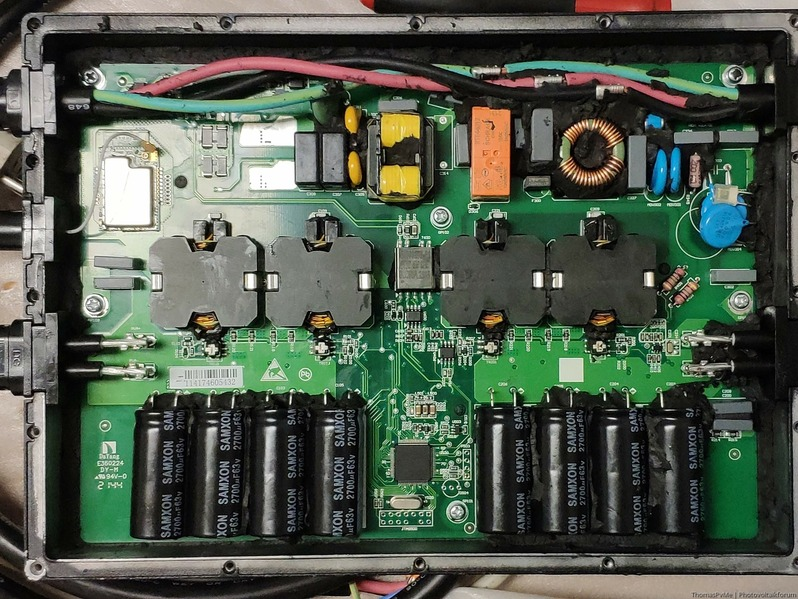

# (Gesamt-)Inhaltsverzeichnis {#Inhaltsverzeichnis}

-   [Hauptseite mit Zusammenfassung etc.](index.md)
-   [Photovoltaik und ihr möglicher Ertrag](PV.md)
-   [Stromverbrauch und Einspeisung im Haushalt](SV.md)
-   [Eigenverbrauch und seine Berechnung](EV.md)
-   [Nutzungsvarianten](SSG.md)
    -   [Direkte Netzeinspeisung (Steckersolargerät SSG, „Balkonkraftwerk“)](SSG.md#SSG)
    -   [Hausnetzeinspeisung mit Pufferspeicher](Speicher.md)
        - [SSG-Speicherlösungen im Eigenbau](#Eigenbau)
            - [Implementierung der Speicher-Regelung](#Regelungsimplementierung)
            - [Betrieb eines Mikrowechselrichters an einer Batterie](#Batterie-WR)
            - [Relativ einfache und günstige Lösung: OpenDTU-OnBattery](#OpenDTU-OnBattery)
            - [Weiteres Beispiel für DC-gekoppelten Speicher](Bsp.md#SSG-DC-gekoppelt)
            - [Ladung des Stromspeichers](#Ladung)
            - [Konstanteinspeisung](#Konstanteinspeisung)
            - [Lastgeregelte Einspeisung](#lastgeregelt)
    -   [Inselanlage (mit Speicherung) und Kombination](Insel.md)
-   [Auswahl und Nutzung von Komponenten](Komp.md)
-   [Beispiel-Konfigurationen](Bsp.md)

# SSG-Speicherlösungen im Eigenbau, Stand Frühjahr 2024 {#Eigenbau}

Wer für sein Balkonkraftwerk einen rentablen Stromspeicher haben will, kam bis
2024 um einen Eigenbau nicht herum, allein schon wegen der Batteriepreise.
Außerdem muss man sich technisch gut auskennen und einige Arbeit investieren,
um eine effiziente Regelung hinzubekommen.
In diesem Abschnitt einige Hinweise und Beispiele,
wie es gelingen kann und wie es (nicht) wirklich effizient wird.

## Implementierung der Speicher-Regelung {#Regelungsimplementierung}

Wie im Abschnitt über [Regelungsstrategien](Speicher.md#Regelungsstrategien) erklärt,
ist die wesentliche Eingangsgröße der Regelung eines Speichers
der Gesamt-Leistungssaldo am externen Netzanschluss des Haushalts.
Er lässt sich mit digitalem Zugang an einem modernen Stromzähler
oder mit einem Zusatzgerät im Unterverteiler messen,
wie im Abschnitt [Gesamt-Strommessung](SV.md#Gesamtstrom) beschrieben.

Über das Leistungssaldo sollte ein am Speicher angeschlossener dynamisch
drosselbarer [Netzwechselrichter](Komp.md#Netzwechselrichter) so geregelt werden,
dass durch Entladung des Speichers zumindest ein Teil der Haushalts-Last
kompensiert wird, aber nicht durch zu starke Entladung Energie aus dem Speicher
ins externe Netz eingespeist und damit verschenkt wird.

Wenn der Wechselrichter, der zur Entladung des Speicherbatterie verwendet wird,
mehrere Eingänge hat, kann man an die übrigen Eingänge auch noch direkt
PV-Module anschließen, deren Ertrag dann nicht über die Batterie gepuffert wird.

Für die Ladung des Speichers ist es eine grundsätzliche Entscheidung, ob diese
[DC- oder AC-gekoppelt](Speicher.md#Kopplung) geschehen soll.

Die (Lade- und) Entladeregelung wird auf irgendeine Weise programmiert und
muss ständig laufen, z.B. auf einen etwas stärkeren Einplatinen-Computer
wie Raspberry Pi 4 oder nebenbei auf einem Home-Server. Meist erfolgt
die Programmierung unter Zuhilfenahme einer Heimautomatisierungs-Software.

[Home Assistant](https://www.home-assistant.io/) ist da am bekanntesten.
Das bietet eine recht hübsche und flexible grafische Bedienungs-Oberfläche,
sowie eine relativ einfache Anbindung von Hardware-Komponenten z.B. von Shelly,
aber hat eine grauenhafte YAML -und Python-basierte Programmierumgebung mit nur
teilweise hilfreicher Dokumentation und schlechter Debugging-Unterstützung.

Wesentlich angenehmer programmierbar ist wohl die Perl-basierte „Freundliche
Hausautomation und Energie-Messung“ [(FHEM)](https://fhem.de/fhem_DE.html).

Weitere Möglichkeiten sind der [iobroker](https://www.iobroker.net/?lang=de#de/)
und das Projekt [Solaranzeige.de](https://solaranzeige.de/) für Raspberry Pi.

## Betrieb eines Mikrowechselrichters an einer Batterie {#Batterie-WR}

Wie im Abschnitt zum [Anschluss von PV-Modulen](Komp.md#Anschluss) näher
ausgefährt, muss unbedingt die maximale Wechselrichter-Eingangsspannung
eingehalten werden, während der erlaubte Eingangsstrom weniger kritisch ist.
Die Verwendung eines Solar-Mikrowechselrichters zur Ausspeisung der in einer
Batterie gespeicherten Energie ist bei den meisten Modellen nicht vorgesehen.
Das kann zu besonderen Effekten führen, nachdem eine Batterie
deutlich höhere Ströme (meist über 100&nbsp;A) liefern kann als PV-Module.

[{:.right width="798"}](
https://github.com/helgeerbe/OpenDTU-OnBattery/discussions/528#discussioncomment-9175492)
Beim Anschließen eines Wechselrichters werden eingangsseitig im Gerät relativ
große Kondensatoren aufgeladen (bei Hoymiles mit 4 × 2,7&nbsp;mF je Eingang).
Bei direkter Verbindung an eine Batterie erreicht aufgrund ihres sehr geringen
Innenwiderstands je nach Batterie, BMS, Verkabelung und Wechselrichter-Modell
die Spitze des Einschaltstroms (engl. _inrush current_) innerhalb der ersten
Millisekunde oft [mehr als 250&nbsp;A](https://www.photovoltaikforum.com/thread/206537-hoymiles-hm-350-von-51-2v-akku/?postID=3718575#post3718575)
&mdash; und zwar auch deutlich über das hinaus, was BMS und ggf. eine
zusätzliche Sicherung an (Dauerstrom-)Begrenzung geben.
Das macht sich durch einen Einschaltfunken bemerkbar.
Viele befürchten zumindest längerfristig ein gewisses Beschädigungsrisiko.
Um das auszuschließen, kann man beim Anschließen des Wechselrichters den Eingang
zum [*Sanftanlauf*](https://de.wikipedia.org/wiki/Sanftanlauf#Mit_Widerstand)
(engl. _soft start_) „vorladen“, wozu es relativ einfache Möglichkeiten gibt:
[{:.right width="370"}](
https://www.photovoltaikforum.com/thread/206537-hoymiles-hm-350-von-51-2v-akku/?postID=3726044#post3726044)
* Wenn vorhanden, eine entsprechende Soft-Start-Funktion der Batterie nutzen.
* Die Verbindung zunächst nur über einen
[Widerstand mit ca. 500&nbsp;Ohm und 5&nbsp;W Belastbarkeit](
https://www.photovoltaikforum.com/thread/185071-notwendigkeit-eines-vorschaltwiderstands-pre-charge-resistor/?postID=3718427#post3718427)
herstellen, der nach ein paar Sekunden ersetzt oder zumindest überbrückt wird.
* Bei DC-Kopplung den Wechselrichter-Eingang tagsüber erst mal über den
Solarlader mit den PV-Modulen verbinden und dann erst die Batterie zuschalten.

Allerdings sind für Kondensatoren
[transiente Ströme &mdash; auch sehr große &mdash; nicht schädlich](
https://github.com/helgeerbe/OpenDTU-OnBattery/discussions/528#discussioncomment-9191932).
Die Zuleitungen könnten bei extrem hohen Strömen Schaden nehmen,
aber die Eingangs-Leiterbahnen von Solarwechselrichtern wie denen von Hoymiles
[sind sehr massiv](
https://www.photovoltaikforum.com/thread/185071-notwendigkeit-eines-vorschaltwiderstands-pre-charge-resistor/?postID=3718427#post3726914).
Am ehesten leiden die Kontakte, die beim Anschließen verbunden werden, aber das
geschieht auch nicht sehr oft, und sie liegen ja außerhalb des Wechselrichters.
Also kann man sich bei den üblichen Solarwechselrichtern
einen Schutz vor hohem Anschluss-/Einschaltstrom einfach sparen.

[{:.right width="565"}](
https://www.photovoltaikforum.com/thread/206537-hoymiles-hm-350-von-51-2v-akku/?postID=3727987#post3727987)
Zu empfehlen ist aber, einen *Leitungsschutzschalter* (*LSS*) zwischen
Batterie und Wechselrichter einzusetzen. Wie [hier](
https://www.photovoltaikforum.com/thread/206537-hoymiles-hm-350-von-51-2v-akku/?postID=3727987#post3727987)
näher ausgeführt, mildert er den Einschaltimpuls etwas ab und erlaubt
eine bequemere Schaltung als z.B. das Stecken von MC4&minus;Verbindern.
Sollte er wegen Einschalt-Überstrom auslösen, genügt es meistens,
ihn gleich nochmals einzuschalten, weil sich die Eingangs-Kondensatoren
im Wechselrichter zuvor schon größtenteils aufgeladen haben.

Ein anderes Risiko ist, dass die MPPT-Regelung eventuell nicht ausreichend
bzw. nicht schnell genug auf ein überhöhtes Stromangebot reagiert, womit ihr
Innenwiderstand zu lange zu niedrig bleibt, was z.B. Leistungstransistoren
zerstören kann.
Um das auszuschließen, kann eine generelle Strombegrenzung z.B. durch einen
DC-DC-Wandler vorgeschaltet werden, was allerdings aufwendig ist
und zu ständigen Leistungsverlusten führt.

Die üblichen Hoymiles-Geräte, z.B. HM-300, HM-800 und HM-1500,
funktionieren zumindest an einer 24 V Batterie nach der Erfahrung vieler Nutzer
auch ohne besondere Maßnahmen <!-- zumindest vorerst scheinbar--> problemlos.
Auch z.B. ein Deye Sun 600, wobei der nicht dynamisch regebar ist
und dann konstant etwa 270&nbsp;W je Eingang liefert.
Ein Eingang meines billigen Mars Rock SG-700W hat den Test allerdings nicht
bestanden und ist nun tot, nachdem sich das Gerät beim Hochfahren des MPPT
nach ein paar Sekunden überlastet hat.

Auf jeden Fall ist v.A. zum Brandschutz bei möglichen Kurzschlüssen
empfehlenswert, möglichst nahe am Ausgang der Batterie eine passend
dimensionierte Sicherung bzw. Schutzschalter (mit z.B. 63&nbsp;A) einzusetzen.

Bei Hoymiles-Wechselrichtern gibt es an 24&nbsp;V Batterien allerdings ein
weiteres Problem: Bei höheren Limit-Werten (also im oberen Leistungsbereich)
kommt es zu [groben Abweichungen vom Sollwert](
https://www.photovoltaikforum.com/thread/221194-hm-400-an-batterie-limitierung-%C3%BCber-opendtu-eigenartig/?postID=3660691#post3660691).
Die Erklärung dafür ist, dass sie an jedem Eingang eine interne Strommessung
haben, bei der ab 10&nbsp;A Eingangsstrom allmählich eine Sättigung eintritt.
<!-- https://www.photovoltaikforum.com/thread/221194-hm-400-an-batterie-limitierung-%C3%BCber-opendtu-eigenartig/?postID=3696396#post3696396 -->
Das entspricht (bedingt durch den Wirkungsgrad) bei 25,5&nbsp;V Eingangsspannung
etwa 240&nbsp;W Ausgangsleistung je Eingang.
Bei einem HM-300, der nur einen Eingang hat, entspricht das 70% Limitierung.
Über diesem Wert steigt bis etwa 77% Limitierung die reale Ausgangsleistung
überproportional an, während die über die DTU (data transfer unit) gemeldete
Ausgangsleistung langsamer steigt, und zwar auf knapp 240&nbsp;W.
Jenseits der 77% stagniert die gemeldete Eingangs- und Ausgangsleistung, und
die tatsächliche Ausgangsleistung verbleibt bei knapp 320 W.\
Um Feedback über die tatsächliche aktuelle Ausgangsleistung des Hoymiles zu
erhalten, sollte man da also nicht den über die DTU gelieferten Daten trauen,
weil sie besonders bei höheren Werten stark von der Realität abweichen.
Stattdessen kann man sehr gut z.B. einen Shelly Plus 1PM verwenden,
welcher verlässliche Daten im Sekundentakt bietet.

## Relativ einfache und günstige Lösung: OpenDTU-OnBattery {#OpenDTU-OnBattery}

Inzwischen gibt es eine relativ einfache und kostengünstige Möglichkeit, mit
wenig Arbeitsaufwand und ohne eigene Programmierung zu einer recht effizienten
Speicherlösung für ein SSG/Balkonkraftwerk zu kommen, und zwar dank des
Projekts [OpenDTU-OnBattery](https://github.com/helgeerbe/OpenDTU-OnBattery).
Dies ist eine Weiterentwicklung der
[OpenDTU](https://github.com/tbnobody/OpenDTU), welche wie im Abschnitt zur
[Einspeisung aus einer Batterie](#lastgeregelt) beschrieben einen Mikrocontroller
zur offenen Kommunikation per WLAN mit einem Hoymiles-Wechselrichter einrichtet.

{:.right width="755"}
* Der Clou dabei ist, den OpenDTU Mikrocontroller auch gleich zur PV-Leistungs-
und lastbasierten Regelung der Einspeisung des Wechselrichters zu verwenden,
statt irgendwo anders z.B. Home Assistant oder iobroker laufen lassen zu müssen.
* Zudem wird natürlich ein dreiphasiges Leistungsmessgerät mit Dateninterface
([Shelly (Pro) 3EM](SV.md#Shelly3EM), Eastron SDM oder Stromzähler-Lesekopf mit
[Tasmota](https://www.tasmota.info/)-Software) benötigt, um den aktuellen
Leistungssaldo des Haushalts in Sekundenauflösung zu erhalten.
* Die Ladung des Speichers erfolgt (meist) effizient mit DC-Kopplung,
und zwar über einen [Solar-Laderegler](Komp.md#Laderegler) von Victron,
dessen [VE.Direct interface](
https://www.victronenergy.com/live/vedirect_protocol:faq) zur Regelung benötigt
wird, weil sich damit die PV-Leistung abfragen lässt.
Je nach der maximalen Gesamtspannung der hierbei meist in Reihe geschalteten
PV-Module genügt teils schon ein BlueSolar 75/15 und ansonsten normalerweise
ein 100/15 (der 100&nbsp;V Eingangsspannung verträgt).
* Der auf dem Bild dargestellte [Victron SmartShunt](
https://www.victronenergy.de/battery-monitors/smart-battery-shunt) dient der
genauen Messung des Batterie-Ladezustandes usw., ist aber nicht nötigt.
Die Batteriespannung muss für den (direkten) Anschluss des Wechselrichters
mindestens 24&nbsp;V betragen, was von allen Victron-Varianten unterstützt wird.
Für eine Batteriespannung von 48&nbsp;V eignet sich etwa der 100/20.
* Die aktuelle Batteriespannung kann über ein BMS-Interface, den Laderegler
und den Wechselrichter abgefragt werden, benötigt also kein Extra-Gerät.
* Außerdem werden nur noch ein USB-Anschluss o.ä. zur Stromversorgung sowie ein
paar Kabel zur Verbindung von Laderegler, Batterie und Wechselrichter gebraucht.
* Bei Betrieb des Speichers z.B. auf dem Balkon empfiehlt sich eine Heizmatte
mit Thermostat, um die Batterie auch bei Minustemperaturen laden zu können.

[Hier](https://github.com/helgeerbe/OpenDTU-OnBattery/wiki/Dynamic-Power-Limiter)
die Übersicht der konfigurierbaren Regelungsparameter.\
Der Regelungsalgorithmus, welcher in der C++-Quelldatei [PowerLimiter.cpp](
https://github.com/helgeerbe/OpenDTU-OnBattery/blob/development/src/PowerLimiter.cpp)
implementiert ist, arbeitet im Wesentlichen wie folgt:\
Berechne in einer Endlosschleife immer wieder einen neuen Zielwert (Limit)
für die Wechselrichter-Ausgangsleistung, sende ihn an das Gerät und warte, bis
positive Rückmeldung erfolgt, was beim Hoymiles meist 5-10&nbsp;Sekunden dauert.
Für den Zielwert, der im Wesentlichen aus der aktuellen Last durch den Hauhalt
und der PV-Leistung bestimmt wird, gibt es verschiedene Fälle:

|Batterie-Ladezustand|PV-Leistung|verwendeter Zielwert (Wechselrichter-Limit) | Auswirkung auf die Batterie |
|:-------------------|:----------|:-----------------------------------|:------------------------|
|gering|<&nbsp;20&nbsp;W|0 (Wechselrichter aus)|ggf. Ladung mit PV-Leistung|
|gering|≥&nbsp;20&nbsp;W|min(Last,&nbsp;PV−Leistung)|ggf. Ladung mit PV-Überschuss        |
|nicht&nbsp;gering&nbsp;oder voll&nbsp;und&nbsp;Bypass nicht&nbsp;erlaubt||Last<!--img width=16ex/-->|Entladung&nbsp;wenn&nbsp;Last&nbsp;>&nbsp;PV−Leistung, sonst Ladung mit PV-Überschuss (außer&nbsp;wenn&nbsp;voll)|
|voll&nbsp;und Bypass&nbsp;erlaubt||max(Last,&nbsp;PV−Leistung)|Entladung wenn Last > PV−Leistung, keine Ladung|

Die Regelung ist so flink wie möglich, aber berücksichtigt nicht die
<!-- im [Abschnitt zur Einspeisung](lastgeregelt) genannten -->
bei Betrieb an einer 24&nbsp;V Batterie
[teils groben Abweichungen eines Hoymiles-Geräts](
https://www.photovoltaikforum.com/thread/221194-hm-400-an-batterie-limitierung-%C3%BCber-opendtu-eigenartig/?postID=3660691#post3660691)
von großen Limit-Sollwerten.

Geht man davon aus, dass ein SSG mit Hoymiles-Wechselrichter bereits vorhanden
ist und angesichts dessen, dass
für ein SSG eine Nenn-Speicherkapazität von 1,28&nbsp;kWh ausreichend ist,
ergeben sich (Stand März 2024) bei günstigem Einkauf in etwa folgende Kosten:
* LiFePO4-Batterie 25,6&nbsp;V 50 Ah mit BMS: 200€
* Victron MPPT Laderegler: je nach Variante ca. 70€
* Shelly 3EM: 80€
* ESP32-Mikrocontroller plus passendes WLAN-Modul, fertig konfektioniert: 30€
* Heizmatte mit Thermostat: 20€
* Kleinteile wie Kabel und Stecker: 20€

Das ergibt in Summe 420€.
Wie [hier](Speicher.md#Batteriespeicher) ausgeführt, lassen für ein Balkonkraftwerk in einem
Durchschnittshaushalt mit effektiv 1 kWh Speicherkapazität etwa 200&nbsp;kWh
zusätzlicher Eigenverbrauch pro Jahr erzielen, was ungefähr 60€ entspricht.
Damit amortisiert sich diese Speicherlösung in etwa 7 Jahren.

## Weiteres Beispiel für DC-gekoppelten Speicher {#SSG-DC-gekoppelt}

Siehe [hier](Bsp.md#SSG-DC-gekoppelt) im Abschnitt '[Beispiele](Bsp.md)'.

## Ladung des Stromspeichers {#Ladung}

Wie im [Abschnitt über Lade-Kopplung des Speichers](Speicher.md#Kopplung)
erklärt, kann diese DC-seitig oder AC-seitig erfolgen.

Bei DC-Kopplung bietet es sich an, einen [Solar-Laderegler](Komp.md#Laderegler) zu
verwenden, denn der kümmert sich automatisch um die Regelung der Batterieladung.
Unabhängig davon, dass ein Wechselrichter angeschlossen und zeitweise mehr oder
weniger aktiv ist, versucht der Laderegler immer, die Batterie voll zu machen.
Je nachdem, wie viel Strom der Wechselrichter liefern soll, nimmt er dem Ausgang
des Ladereglers bzw. der Batterie entsprechend Strom weg, so dass zum Laden der
Batterie weniger oder gar nichts mehr übrig bleibt. Wenn der Wechselrichter
sich mehr Strom nimmt als der Laderegler liefert, wird die Batterie entladen.\
Für eine optimale [lastabhängige Regelung](#lastgeregelt)
muss also der Laderegler nicht von außen gesteuert werden,
sondern es genügt, die Ausgangsleistung des Wechselrichters so anzupassen,
dass der aktuelle Leistungssaldo am Einspeisepunkt der Haushalts
(der sich aus Haushalts-Last abzüglich PV-Leistung
und bisheriger Ausgangsleistung des Wechselrichters ergibt)
möglichst Null ist, jedenfalls nicht negativ.
Je nachdem, ob dabei die Differenz aus aktueller PV-Leistung und
Abruf durch den Wechselrichter positiv oder negativ ausfällt,
wird der Speicher mit dieser Differenz-Leistung geladen oder entladen.

Mit etwas Eigenarbeit
lässt sich mit Hilfe von [OpenDTU-OnBattery](#OpenDTU-OnBattery) und einem
Victron-Laderegler zur DC-Kopplung eine günstige und effiziente Lösung zusammenbauen.
Wenn die Anlage außerhalb des Hauses steht, sollte man für den Betrieb im Winter
den Speicher mit einer Heizung versehen und gegen Kälte isolieren.
Dafür bietet sich Wärmematte mit Thermostat an, welche es auch schon
[für 15€ gibt](https://www.amazon.de/KIPIDA-Reptilienheizmatte-Einstellbar-Reptilienw%C3%A4rmematte-Temperaturregelung/dp/B0CG3FCJ9H).
Die Heizmatte braucht nur dann aktiv sein, wenn bei unter 0°C die Sonne scheint.

Bei AC-Kopplung erfolgt die Speicher-Ladung unabhängig von der PV-Erzeugung
und erfordert ein steuerbares 230&nbsp;V-Ladegerät mit extra Regelung.
<!-- TODO Netzladegerät -->

Für eine kleine Anlage kann man zur AC-Kopplung wie in
[diesem Video](https://www.youtube.com/watch?v=fcFFUN3Pkbo&t=300s) beschrieben
ein regelbares Netzteil wie den
[MeanWell HLG-600H](MeanWell_HLG-600H.pdf)-30AB LED-Treiber verwenden
und über einen [Shelly Plus 0-10V Dimmer](
https://www.shelly.com/de/products/shop/shelly-plus-0-10-v-dimmer)) und
geeignete Software so steuern, dass PV-Überschuss in die Batterie geladen wird.

{:.right width="798"}
Die Steuerung kann auch über einen Mikrocontroller erfolgen, der ein PWM-Signal
erzeugt, das dann in ein 0-10&nbsp;V Analogsignal gewandelt wird, wie in
[diesem Vorgänger-Video](https://www.youtube.com/watch?v=WK9PQ1_TpU8) erklärt.

Manche verwenden zu diesem Zweck ein [Meanwell NPB Batterieladegerät](
https://www.elkoba.com/magazin/produkt/npb-1200-24/),
welches über sein CAN-Bus-Interface verfügt und über einen
[*Trucki2MeanWell Gateway (T2MG)*](https://trucki.de/t2mg/) Stick
gesteuert werden kann.
Allerdings sind als Ladestrom offenbar nur [50-100% des Nennstroms einstellbar](
https://www.digikey.de/de/product-highlight/m/mean-well/npb-series).
Außerdem wird jede Änderung normalerweise ins interne EEPROM gespeichert,
was bei sehr vielen Schreibzugriffen das Gerät beschädigen würde,
weshalb man ihre Frequenz z.B. auf 30 Sekunden einschränken sollte &mdash;
bzw. bei Modellen ab 2024 kann man diese Schreibfunktion wohl abschalten.

Wie im [Abschnitt über Regelungsstrategien](Speicher.md#Regelungsstrategien) beschrieben,
sollte die Aufladung der Batterie zu jeder Zeit nur in dem Maße erfolgen, wie
der PV-Strom gerade nicht anderweitig direkt genutzt werden kann (Lastvorrang).
Das optimiert die Speichernutzung in mehrfacher Hinsicht:
* Eine Speicherung ist im Vergleich zur direkten Nutzung
  immer mit zusätzlichen Verlusten verbunden.
* Je intensiver eine Batterie genutzt wird, desto schneller sinkt ihre Kapazität
  --- daher sollte die Zahl der Lade-/Entladezyklen nicht unnötig groß sein.
* Je voller der Strompuffer ist, desto größer die Wahrscheinlichkeit, dass er
  keine zusätzliche Ladung mehr aufnehmen kann und der Überschuss verloren geht.

Der Lastvorrang bringt für die Effizienz fast so viel wie eine optimale
[lastabhängige Entnahme](#lastgeregelt) aus der Batterie.

## Konstanteinspeisung {#Konstanteinspeisung}

In diesem und dem [folgenden Abschnitt](#lastgeregelt)
werden für die Entnahme von Energie aus einem Stromspeicher
verschiedene Strategien und mögliche Umsetzungen mit einem
[Netzwechselrichter](Komp.md#Netzwechselrichter) behandelt.

Die einfachsten Anlagen verwenden eine *Konstanteinspeisung*,
wobei der Netzwechselrichter immer die gleiche Leistung abgibt.
Eine zeitgesteuerte Variante wird *Nachteinspeisung* genannt.

Anlagen mit Konstanteinspeisung, bei der die PV-Erzeugung
nur in den Speicher geleitet wird (also ohne Überschussableitung oder
eine deutlich aufwendigere lastabhängige Batterie-Regelung),
bringen selbst bei optimierter Wahl der Entnahmeleistung sehr wenig,
weil bei voller Batterie relativ viel überschüssige Energie verloren geht.
Eine höhere konstante Entnahmeleistung oder eine Überschussableitung verringert
zwar den Komplettverlust des Überschusses, führt aber dazu, dass mehr Energie
im Haushalt nicht genutzt und stattdessen ins externe Netz abgegeben wird.

Bei einer Konstanteinspeisung sollte man die Einspeiseleistung so einstellen,
dass sie sicher unter der Minimallast bleibt und anderseits so hoch ist,
dass man die gespeicherte Energie auch bis zum nächsten Laden verbraucht.
Auch sollte man irgendwie dafür sorgen, dass maximal so viel geladen wird,
wie gerade tatsächlich an PV-Überschuss vorliegt (also die aktuelle Erzeugung
größer als der Verbrauch ist), aber auch nicht zu wenig geladen wird,
so dass der Speicher am Ende des Tages möglichst voll ist.
Je größer die Speicherkapazität im Vergleich zum Verbrauch und zur Erzeugung,
desto schwieriger ist das ohne lastabhängige Regelung hinzubekommen.\
Viele scheitern schon an der Bestimmung der [Minimallast](SV.md#Strommessung),
den diese ist geringer als etwa die (leichter bestimmbare) Durchschnittslast in
der Nacht. Wer die Konstanteinspeisung auf die nächtliche Durchschnittslast
einstellt, verschenkt über die meiste Zeit, wo periodisch laufende Geräte
wie Kühlschränke nicht laufen, mehr oder weniger teurer gespeicherten Strom.

Wenn die [o.g. Balkonanlage mit 1&nbsp;kWh Pufferspeicher](Speicher.md#Batteriespeicher) nur eine
Konstanteinspeisung verwendet (wobei hier eine Entladeleistung von nur 40&nbsp;W
optimal ist), ergibt sich mit der optimalen Ladestrategie eine Steigerung des
Jahres-Eigenverbrauchs durch die Speichernutzung um immerhin 115&nbsp;kWh auf 575&nbsp;kWh.
Das sind allerdings 65&nbsp;kWh weniger als wenn auch die Entladung lastoptimiert
wäre, weil 66&nbsp;kWh nicht genutzt und ins externe Netz abgeführt werden.\
Eine Erhöhung der nutzbaren Speicherkapazität auf 2&nbsp;kWh brächte nur 10&nbsp;kWh mehr.

<!--
TODO check/update ./Solar.pl Lastprofil_4673_kWh.csv 3000 Timeseries_48.215_11.727_SA2_1kWp_crystSi_14_35deg_0deg_2005_2020.csv 600 -peff 92 -tmy -capacity 1250 -dc -feed 45

Speicherkapazität           = 1250 Wh mit max. Ladehöhe 90%, max. Entladetiefe 90%, DC-gekoppelt
Optimale Ladestrategie (nicht gebrauchte Energie), max. Laderate 1 C
Konstanteinspeisung         =   40 W, max. Entladerate 1 C
Verlust durch Überlauf      =    0 kWh
Ladeverlust                 =   11 kWh durch Lade-Wirkungsgrad 94%
Speicherverlust             =    9 kWh durch Speicher-Wirkungsgrad 95%
PV-Nutzung über Speicher    =  112 kWh
Zwischenspeicherung         =  185 kWh (nach Ladeverlust)
Vollzyklen pro Jahr         =  185 der effektiven Kapazität

PV-Eigenverbrauch           =  575 kWh
Netzeinspeisung             =   65 kWh
PV-Eigenverbrauchsanteil    =   87 % des Nettoertrags (Nutzungsgrad)
Eigendeckungsanteil         =   19 % des Verbrauchs (Autarkiegrad)
-->
<!--
TODO check/update ./Solar.pl Lastprofil_4673_kWh.csv 3000 Timeseries_48.215_11.727_SA2_1kWp_crystSi_14_35deg_0deg_2005_2020.csv 600 -peff 92 -tmy -capacity 2500 -dc -feed 35

Speicherkapazität           = 2500 Wh mit max. Ladehöhe 90%, max. Entladetiefe 90%, DC-gekoppelt
Optimale Ladestrategie (nicht gebrauchte Energie), max. Laderate 1 C
Konstanteinspeisung         =   35 W, max. Entladerate 1 C
Verlust durch Überlauf      =    0 kWh
Ladeverlust                 =   11 kWh durch Lade-Wirkungsgrad 94%
Speicherverlust             =    9 kWh durch Speicher-Wirkungsgrad 95%
PV-Nutzung über Speicher    =  122 kWh
Zwischenspeicherung         =  189 kWh (nach Ladeverlust)
Vollzyklen pro Jahr         =   95 der effektiven Kapazität

PV-Eigenverbrauch           =  585 kWh
Netzeinspeisung             =   55 kWh
PV-Eigenverbrauchsanteil    =   89 % des Nettoertrags (Nutzungsgrad)
Eigendeckungsanteil         =   20 % des Verbrauchs (Autarkiegrad)
-->

Die hier aufgeführten Entnahme-Varianten geben keinen Lastvorrang,
sondern führen den erzeugten Solarstrom vorzugsweise in die Batterie.
Das ist natürlich am einfachsten, hat aber den großen Nachteil, dass zu den
Zeiten, wo die Batterie voll ist, **viel PV-Energie verloren geht** ---
etwa an sonnenreichen Tagen am Nachmittag, wenn die Solarleistung relativ groß
ist im Vergleich zur Batteriekapazität bzw. dem Verbrauch durch die Grundlast.

Wenn die Anlage eine Konstanteinspeisung hat und den PV-Strom nur auf diese
Weise nutzt, ergibt sich Folgendes: Selbst bei optimierter Entnahmeleistung
(in diesem Fall 180&nbsp;W) bringt die Batteriepufferung fast nichts: der
Eigenverbrauch steigt durch Speichernutzung gerade mal um 29&nbsp;kWh auf 489&nbsp;kWh.
Das liegt hier vor Allem an einer Netzeinspeisung von 74&nbsp;kWh
und am Verlust durch Überlauf von 29&nbsp;kWh,
außerdem an Lade- und Speicherverlusten von 38 + 30&nbsp;kWh bei 631 Vollzyklen.\
Eine Erhöhung der nutzbaren Kapazität auf 2&nbsp;kWh
brächte immerhin einen Eigenverbrauch von 532&nbsp;kWh
bei einer dann optimalen Konstanteinspeisung von 125&nbsp;W.

<!--
TODO check/update ./Solar.pl Lastprofil_4673_kWh.csv 3000 Timeseries_48.215_11.727_SA2_1kWp_crystSi_14_35deg_0deg_2005_2020.csv 600 -peff 92 -tmy -capacity 1250 -dc -pass 0 -feed 180

Speicherkapazität           = 1250 Wh mit max. Ladehöhe 90%, max. Entladetiefe 90%, DC-gekoppelt
Speicher-Umgehung           =    0 W, max. Laderate 1 C
Konstanteinspeisung         =  180 W, max. Entladerate 1 C
Verlust durch Überlauf      =   29 kWh
Ladeverlust                 =   38 kWh durch Lade-Wirkungsgrad 94%
Speicherverlust             =   30 kWh durch Speicher-Wirkungsgrad 95%
PV-Nutzung über Speicher    =  489 kWh
Zwischenspeicherung         =  631 kWh (nach Ladeverlust)
Vollzyklen pro Jahr         =  631 der effektiven Kapazität

PV-Eigenverbrauch           =  489 kWh
Netzeinspeisung             =   74 kWh
PV-Eigenverbrauchsanteil    =   74 % des Nettoertrags (Nutzungsgrad)
Eigendeckungsanteil         =   16 % des Verbrauchs (Autarkiegrad)
-->
<!--
TODO check/update ./Solar.pl Lastprofil_4673_kWh.csv 3000 Timeseries_48.215_11.727_SA2_1kWp_crystSi_14_35deg_0deg_2005_2020.csv 600 -peff 92 -tmy -capacity 2500 -dc -pass 0 -feed 130

Speicherkapazität           = 2500 Wh mit max. Ladehöhe 90%, max. Entladetiefe 90%, DC-gekoppelt
Speicher-Umgehung           =    0 W, max. Laderate 1 C
Konstanteinspeisung         =  125 W, max. Entladerate 1 C
Verlust durch Überlauf      =    7 kWh
Ladeverlust                 =   39 kWh durch Lade-Wirkungsgrad 94%
Speicherverlust             =   31 kWh durch Speicher-Wirkungsgrad 95%
PV-Nutzung über Speicher    =  532 kWh
Zwischenspeicherung         =  653 kWh (nach Ladeverlust)
Vollzyklen pro Jahr         =  327 der effektiven Kapazität

PV-Eigenverbrauch           =  532 kWh
Netzeinspeisung             =   51 kWh
PV-Eigenverbrauchsanteil    =   81 % des Nettoertrags (Nutzungsgrad)
Eigendeckungsanteil         =   18 % des Verbrauchs (Autarkiegrad)
-->

Man kann bei Konstanteinspeisung mit einer zusätzlichen *Überschussableitung*
(Bypass) dafür sorgen, dass bei vollem Speicher der Solarstrom an der Batterie
vorbei geleitet wird (und zwar möglichst in den Netzwechselrichter,
der auch zur Ausspeisung aus der Batterie verwendet wird).
In diesem Fall sind für die Konstanteinspeisung etwa 100&nbsp;W Entnahme optimal,
und der Eigenverbrauch steigt durch die Speichernutzung ein wenig mehr,
nämlich um 54&nbsp;kWh auf 514&nbsp;kWh.\
Eine Erhöhung der nutzbaren Kapazität auf 2&nbsp;kWh
brächte einen Eigenverbrauch von 539&nbsp;kWh,
wobei die optimale Leistung der Konstanteinspeisung hier bei 110&nbsp;W liegt.

<!--
TODO check/update ./Solar.pl Lastprofil_4673_kWh.csv 3000 Timeseries_48.215_11.727_SA2_1kWp_crystSi_14_35deg_0deg_2005_2020.csv 600 -peff 92 -tmy -capacity 1250 -dc -pass spill 0 -feed 100

Speicherkapazität           = 1250 Wh mit max. Ladehöhe 90%, max. Entladetiefe 90%, DC-gekoppelt
Speicher-Umgehung           =    0 W und für Überschuss, max. Laderate 1 C
Konstanteinspeisung         =  100 W, max. Entladerate 1 C
Verlust durch Überlauf      =    0 kWh
Ladeverlust                 =   32 kWh durch Lade-Wirkungsgrad 94%
Speicherverlust             =   25 kWh durch Speicher-Wirkungsgrad 95%
PV-Nutzung über Speicher    =  425 kWh
Zwischenspeicherung         =  537 kWh (nach Ladeverlust)
Vollzyklen pro Jahr         =  537 der effektiven Kapazität

PV-Eigenverbrauch           =  514 kWh
Netzeinspeisung             =   89 kWh
PV-Eigenverbrauchsanteil    =   78 % des Nettoertrags (Nutzungsgrad)
Eigendeckungsanteil         =   17 % des Verbrauchs (Autarkiegrad)
-->
<!--
TODO check/update ./Solar.pl Lastprofil_4673_kWh.csv 3000 Timeseries_48.215_11.727_SA2_1kWp_crystSi_14_35deg_0deg_2005_2020.csv 600 -peff 92 -tmy -capacity 2500 -dc -pass spill 0 -feed 110

Speicherkapazität           = 2500 Wh mit max. Ladehöhe 90%, max. Entladetiefe 90%, DC-gekoppelt
Speicher-Umgehung           =    0 W und für Überschuss, max. Laderate 1 C
Konstanteinspeisung         =  100 W, max. Entladerate 1 C
Verlust durch Überlauf      =    0 kWh
Ladeverlust                 =   37 kWh durch Lade-Wirkungsgrad 94%
Speicherverlust             =   29 kWh durch Speicher-Wirkungsgrad 95%
PV-Nutzung über Speicher    =  508 kWh
Zwischenspeicherung         =  619 kWh (nach Ladeverlust)
Vollzyklen pro Jahr         =  309 der effektiven Kapazität

PV-Eigenverbrauch           =  539 kWh
Netzeinspeisung             =   55 kWh
PV-Eigenverbrauchsanteil    =   82 % des Nettoertrags (Nutzungsgrad)
Eigendeckungsanteil         =   18 % des Verbrauchs (Autarkiegrad)
-->

Das Signal für die Überschussableitung wird wohl am besten vom Laderegler
kommen (z.B. optisch über die Ladekontrollleuchte). Es kann aber auch von der
Batteriespannung abhängig gemacht werden, wobei dann auch (meist ohne Probleme)
vorkommen kann, dass Laderegler und Wechselrichter gleichzeitig aktiv sind.

Wenn man schon einen Solar-Wechselrichter hat und diesen für eine ganz einfache
Netzeinspeisung verwenden möchte, könnte es schon genügen, ihn (über eine
Sicherung und wenn nötig eine gesonderte automatische Unterspannungsabschaltung)
mit der Batterie zu verbinden und nach Bedarf über einen Schalter zu steuern ---
natürlich nur, wenn die Batteriespannung im Eingangsspannungsbereich des
Wechselrichters liegt und es passt, ihn mit seiner vollen oder fest limitierten
Leistung zu betreiben. Dazu kann man beispielsweise einen auf 300&nbsp;W begrenzten
PV-Eingang nutzen oder die Drosselung konfigurieren, wie man es z.B. beim Deye
[selbst machen](https://www.photovoltaikforum.com/thread/191715-deye-sun600-umstellen-auf-800w/?pageNo=9#post3019090)
oder vom Kundendienst (Mail an service@deye.com.cn) programmieren lassen kann.

{:width="600" .right}
Etwas besser ist allerdings, die Einspeisung manuell regelbar zu gestalten.
Dazu bietet sich ein Netzwechselrichter wie von
[Soyosource](https://de.aliexpress.com/item/1005001445871590.html) bzw.
[PMSUN](https://www.amazon.de/PMSUN-netzgekoppelter-Wechselrichter-einstellbare-Batterieentladung/dp/B0B4RZNHF3)
an, der für die Verwendung an einer Batterie als Quelle ausgelegt ist
und dessen Ausgangsleistung innerhalb gewisser Grenzen einstellbar ist.

Wer zudem bereits eine Powerstation hat,
kann zwischen ihren Wechselstrom-Ausgang und den Netzwechselrichter ein
regelbares Netzteil hängen, wie [von Andreas Schmitz vorgeschlagen](
https://www.youtube.com/watch?v=ZXHAXrJS9CU),
was allerdings zu Zusatz-Verlusten durch Hin- und Her-Wandlung des Stroms führt.

Man kann auch einen normalen Solar-Wechselrichter verwenden und ihm
einen günstigen [Gleichspannungswandler](Komp.md#Gleichspannungswandler)
mit regelbarer Strombegrenzung (engl. _limiter_) vorschalten.
Allerdings passiert es dann leicht, dass sich die Regelungen der beiden Geräte
ins Gehege kommen. Daher stellt man die Eingangsspannung für den Wechselrichter
besser etwas unterhalb des [MPPT](Komp.md#MPPT)-Regelungsbereichs ein,
aber (zumindest anfangs) oberhalb seiner Anlaufspannung.
Außerdem kann es sein, dass der Wechselrichter versucht,
stets seine maximale Ausgangsleistung zu liefern, was bei eher geringer
Eingangsspannung zu einem entsprechend hohen Eingangsstrom führt,
der auch über der Stärke liegen kann, die das Gerät über längere Zeit verträgt.
Daher und aus Effizienzgründen ist es zu empfehlen, einen Wechselrichter zu
wählen, der direkt elektronisch regelbar ist, und das lastabhängig zu machen.

<!--
Allerdings hat keine der in diesem Abschnitt genannten Anlagen mit
Pufferspeicher eine Überschussableitung (Bypass) oder gar eine optimale Laderegelung.
* Bei bedarfsgerechter Einspeisung
  aus dem Speicher ohne Überschussableitung bei der Ladung des Speichers
  fällt die Steigerung des Eigenverbrauchs durch die Speichernutzung
  identisch aus, also wieder 128&nbsp;kWh auf 588&nbsp;kWh. Die Zahl der Vollzyklen
  pro Jahr (658) und die Lade- und Speicherverluste sind fast gleich.
  Darüber hinaus fällt wieder nur ein gleich kleiner Verlust von 3 kWh an, in
  diesem Fall nicht durch Netzeinspeisung, sondern durch Überlauf des Speichers.\
  Auch hier *bringt eine Erhöhung der nutzbaren Speicherkapazität praktisch nichts,
  und eine Verringerung auf 0,5&nbsp;kWh liefert aber wesentlich weniger*: 545&nbsp;kWh.

[//]: #
-->
<!--
TODO check/update ./Solar.pl Lastprofil_4673_kWh.csv 3000 Timeseries_48.215_11.727_SA2_1kWp_crystSi_14_35deg_0deg_2005_2020.csv 600 -peff 92 -tmy -capacity 1250 -dc -pass 0 -feed lim 600

Speicherkapazität           = 1250 Wh mit max. Ladehöhe 90%, max. Entladetiefe 90%, DC-gekoppelt
Speicher-Umgehung           =    0 W, max. Laderate 1 C
Maximaleinspeisung          =  600 W, max. Entladerate 1 C
Verlust durch Überlauf      =    2 kWh
Ladeverlust                 =   40 kWh durch Lade-Wirkungsgrad 94%
Speicherverlust             =   31 kWh durch Speicher-Wirkungsgrad 95%
PV-Nutzung über Speicher    =  588 kWh
Zwischenspeicherung         =  658 kWh (nach Ladeverlust)
Vollzyklen pro Jahr         =  658 der effektiven Kapazität

PV-Eigenverbrauch           =  588 kWh
Netzeinspeisung             =    0 kWh
PV-Eigenverbrauchsanteil    =   89 % des Nettoertrags (Nutzungsgrad)
Eigendeckungsanteil         =   20 % des Verbrauchs (Autarkiegrad)
-->
<!--
TODO check/update ./Solar.pl Lastprofil_4673_kWh.csv 3000 Timeseries_48.215_11.727_SA2_1kWp_crystSi_14_35deg_0deg_2005_2020.csv 600 -peff 92 -tmy -capacity 1875 -dc -pass 0 -feed lim 600

Speicherkapazität           = 1875 Wh mit max. Ladehöhe 90%, max. Entladetiefe 90%, DC-gekoppelt
Speicher-Umgehung           =    0 W, max. Laderate 1 C
Maximaleinspeisung          =  600 W, max. Entladerate 1 C
Verlust durch Überlauf      =    0 kWh
Ladeverlust                 =   40 kWh durch Lade-Wirkungsgrad 94%
Speicherverlust             =   31 kWh durch Speicher-Wirkungsgrad 95%
PV-Nutzung über Speicher    =  590 kWh
Zwischenspeicherung         =  660 kWh (nach Ladeverlust)
Vollzyklen pro Jahr         =  440 der effektiven Kapazität

PV-Eigenverbrauch           =  590 kWh
Netzeinspeisung             =    0 kWh
PV-Eigenverbrauchsanteil    =   89 % des Nettoertrags (Nutzungsgrad)
Eigendeckungsanteil         =   20 % des Verbrauchs (Autarkiegrad)
-->
<!--
TODO check/update ./Solar.pl Lastprofil_4673_kWh.csv 3000 Timeseries_48.215_11.727_SA2_1kWp_crystSi_14_35deg_0deg_2005_2020.csv 600 -peff 92 -tmy -capacity 625 -dc -pass 0 -feed lim 600

Speicherkapazität           =  625 Wh mit max. Ladehöhe 90%, max. Entladetiefe 90%, DC-gekoppelt
Speicher-Umgehung           =    0 W, max. Laderate 1 C
Maximaleinspeisung          =  600 W, max. Entladerate 1 C
Verlust durch Überlauf      =   51 kWh
Ladeverlust                 =   37 kWh durch Lade-Wirkungsgrad 94%
Speicherverlust             =   29 kWh durch Speicher-Wirkungsgrad 95%
PV-Nutzung über Speicher    =  545 kWh
Zwischenspeicherung         =  610 kWh (nach Ladeverlust)
Vollzyklen pro Jahr         =  1220 der effektiven Kapazität

PV-Eigenverbrauch           =  545 kWh
Netzeinspeisung             =    0 kWh
PV-Eigenverbrauchsanteil    =   82 % des Nettoertrags (Nutzungsgrad)
Eigendeckungsanteil         =   18 % des Verbrauchs (Autarkiegrad)
-->
<!--
* Bei Anlagen mit konstanter (nicht bedarfsgeregelter) Einspeisung hingegen
gibt es wie oben beschrieben auf die eine oder andere Weise
große Verluste, so dass die Steigerung des Eigenverbrauchs sehr gering ausfällt.
-->

{:style="clear:both"}

[{:.right width="380"
style="margin-left: 40px"}](
https://www.youtube.com/watch?v=N6NqMXQHP2I)
Auf jeden Fall muss für die Situation, dass die Batterieladung zur Neige geht
(bei LiFePO4 spätestens bei 90% Entladung) eine automatische Abschaltung
vorhanden sein, damit die Batterie nicht durch Tiefentladung geschädigt wird.
Wenn für den Notfall stets eine gewisse Strommenge zur Verfügung bleiben soll,
muss die Abschaltung schon entsprechend früher erfolgen.

Wenn der Solar-Laderegler einen Lastausgang mit einstellbarer Schutzabschaltung
hat, wie z.B. der Victron BlueSolar, kann man ihn so verwenden, wie Tobias Volk
(PV&E) in [diesem schönen Video](https://youtu.be/N6NqMXQHP2I) zeigt. Zudem
kann dessen Straßenlichtfunktion für die zeitliche Steuerung genutzt werden.

Eine Konstanteinspeisung auch noch zeitlich z.B. auf 18 Uhr abends bis 6 Uhr
morgens einzuschränken (also eine Nachteinspeisung) erweist sich aber als
völlig kontraproduktiv, weil der Speicher dann
sehr oft und schnell überläuft und damit massiv Energie verschwendet wird.
Es ergibt sich für die o.g. Anlage selbst bei einer optimierten Entnahmeleistung
von 80&nbsp;W dann nur noch ein Eigenverbrauch von 269&nbsp;kWh, also im Vergleich
zur Basis-Anlage ohne Speicher eine Verringerung um 190&nbsp;kWh!\
Durch Erhöhung der nutzbaren Speicherkapazität auf 2&nbsp;kWh
lassen sich zwar immerhin 398&nbsp;kWh Eigenverbrauch erreichen,
aber auch dann bleibt der Ansatz kontraproduktiv.

<!--
TODO check/update ./Solar.pl Lastprofil_4673_kWh.csv 3000 Timeseries_48.215_11.727_SA2_1kWp_crystSi_14_35deg_0deg_2005_2020.csv 600 -peff 92 -tmy -capacity 1250 -dc -pass 0 -feed 80 18..6

Speicherkapazität           = 1250 Wh mit max. Ladehöhe 90%, max. Entladetiefe 90%, DC-gekoppelt
Speicher-Umgehung           =    0 W, max. Laderate 1 C
Konstanteinspeisung         =   80 W von 18 bis 6 Uhr, max. Entladerate 1 C
Verlust durch Überlauf      =  344 kWh
Ladeverlust                 =   19 kWh durch Lade-Wirkungsgrad 94%
Speicherverlust             =   15 kWh durch Speicher-Wirkungsgrad 95%
PV-Nutzung über Speicher    =  269 kWh
Zwischenspeicherung         =  316 kWh (nach Ladeverlust)
Vollzyklen pro Jahr         =  315 der effektiven Kapazität

PV-Eigenverbrauch           =  269 kWh
Netzeinspeisung             =   13 kWh
PV-Eigenverbrauchsanteil    =   41 % des Nettoertrags (Nutzungsgrad)
Eigendeckungsanteil         =    9 % des Verbrauchs (Autarkiegrad)

TODO check/update ./Solar.pl Lastprofil_4673_kWh.csv 3000 Timeseries_48.215_11.727_SA2_1kWp_crystSi_14_35deg_0deg_2005_2020.csv 600 -peff 92 -tmy -capacity 2500 -dc -pass 0 -feed 150 18..6

Speicherkapazität           = 2500 Wh mit max. Ladehöhe 90%, max. Entladetiefe 90%, DC-gekoppelt
Speicher-Umgehung           =    0 W, max. Laderate 1 C
Konstanteinspeisung         =  150 W von 18 bis 6 Uhr, max. Entladerate 1 C
Verlust durch Überlauf      =  144 kWh
Ladeverlust                 =   31 kWh durch Lade-Wirkungsgrad 94%
Speicherverlust             =   24 kWh durch Speicher-Wirkungsgrad 95%
PV-Nutzung über Speicher    =  398 kWh
Zwischenspeicherung         =  516 kWh (nach Ladeverlust)
Vollzyklen pro Jahr         =  257 der effektiven Kapazität

PV-Eigenverbrauch           =  398 kWh
Netzeinspeisung             =   62 kWh
PV-Eigenverbrauchsanteil    =   60 % des Nettoertrags (Nutzungsgrad)
Eigendeckungsanteil         =   13 % des Verbrauchs (Autarkiegrad)

-->

Eine zusätzliche Überschussableitung bringt das Ergebnis zwar wieder ins
Positive, so dass sich bei dann optimaler Entnahmeleistung von 75&nbsp;W ein Gewinn
an Eigenverbrauch von 33&nbsp;kWh auf 493&nbsp;kWh ergibt, aber lohnenswert ist das nicht,
denn auch dann fällt der Gewinn immer nach geringer aus als ohne Einschränkung
auf die Nachtstunden (wo der Gewinn 54&nbsp;kWh beträgt).\
Eine Erhöhung der nutzbaren Kapazität auf 2&nbsp;kWh
brächte beim Eigenverbrauch nur 10&nbsp;kWh mehr.

<!--
TODO check/update ./Solar.pl Lastprofil_4673_kWh.csv 3000 Timeseries_48.215_11.727_SA2_1kWp_crystSi_14_35deg_0deg_2005_2020.csv 600 -peff 92 -tmy -capacity 1250 -dc -pass spill 0 -feed 75 18..6

Speicherkapazität           = 1250 Wh mit max. Ladehöhe 90%, max. Entladetiefe 90%, DC-gekoppelt
Speicher-Umgehung           =    0 W und für Überschuss, max. Laderate 1 C
Konstanteinspeisung         =   75 W von 18 bis 6 Uhr, max. Entladerate 1 C
Verlust durch Überlauf      =    0 kWh
Ladeverlust                 =   19 kWh durch Lade-Wirkungsgrad 94%
Speicherverlust             =   15 kWh durch Speicher-Wirkungsgrad 95%
PV-Nutzung über Speicher    =  268 kWh
Zwischenspeicherung         =  313 kWh (nach Ladeverlust)
Vollzyklen pro Jahr         =  312 der effektiven Kapazität

PV-Eigenverbrauch           =  493 kWh
Netzeinspeisung             =  134 kWh
PV-Eigenverbrauchsanteil    =   75 % des Nettoertrags (Nutzungsgrad)
Eigendeckungsanteil         =   16 % des Verbrauchs (Autarkiegrad)
-->
<!--
TODO check/update ./Solar.pl Lastprofil_4673_kWh.csv 3000 Timeseries_48.215_11.727_SA2_1kWp_crystSi_14_35deg_0deg_2005_2020.csv 600 -peff 92 -tmy -capacity 2500 -dc -pass spill 0 -feed 110 18..6

Speicherkapazität           = 2500 Wh mit max. Ladehöhe 90%, max. Entladetiefe 90%, DC-gekoppelt
Speicher-Umgehung           =    0 W und für Überschuss, max. Laderate 1 C
Konstanteinspeisung         =  110 W von 18 bis 6 Uhr, max. Entladerate 1 C
Verlust durch Überlauf      =    0 kWh
Ladeverlust                 =   27 kWh durch Lade-Wirkungsgrad 94%
Speicherverlust             =   21 kWh durch Speicher-Wirkungsgrad 95%
PV-Nutzung über Speicher    =  363 kWh
Zwischenspeicherung         =  445 kWh (nach Ladeverlust)
Vollzyklen pro Jahr         =  222 der effektiven Kapazität

PV-Eigenverbrauch           =  503 kWh
Netzeinspeisung             =  109 kWh
PV-Eigenverbrauchsanteil    =   76 % des Nettoertrags (Nutzungsgrad)
Eigendeckungsanteil         =   17 % des Verbrauchs (Autarkiegrad)
-->

{:style="clear:both"}

[{:.right width="350"}](
https://www.youtube.com/watch?v=f-iz6WE8GD8)
Um die Einspeisung automatisch in Abhängigkeit vom Ladezustand der Batterie
ein- und auszuschalten, kann man auch einen recht simplen
[programmierbaren Batteriespannungswächter](Komp.md#Spannungswächter) verwenden,
wie im [Video von Dimitri](https://www.youtube.com/watch?v=f-iz6WE8GD8) gezeigt.

Der Spannungswächter wird so eingestellt,
dass er beim Erreichen einer Batteriespannung, die
z.B. annähernd einer Vollladung entspricht, den Wechselrichter einschaltet und
z.B. in der Nähe der Batterie-Entladeschlussspannung diesen wieder ausschaltet.

Wie oben ausgeführt haben allerdings Anlagen mit Konstanteinspeisung
wie die gerade erwähnten Bastellösungen von Tobias Volk (PV&E) und von
Dimitri selbst mit zusätzlicher Überschussableitung eine miserable Rentabilität.

## Lastgeregelte Einspeisung {#lastgeregelt}

Deutlich effizienter als eine [Konstanteinspeisung](#Konstanteinspeisung)
ist es, das Ausspeisen aus einer Speicherbatterie ins Wechselstromnetz
lastabhängig zu machen und damit eine Nulleinspeisung zu realisieren.

{:style="clear:both"}

[{:.right width="500"}](
https://www.youtube.com/watch?v=jPgWE-qQ3SE&t=1012s)
Ein Netzwechselrichter mit eingebauter lastbasierter Strom-Begrenzungs-Regelung,
engl. _Grid Tie Inverter with Limiter (GTIL)_ wie der [Sun GTIL](
https://de.aliexpress.com/item/32840070519.html) von Y&H
oder ein ähnliches Gerät von [Soyosource](
https://mona-stefan.de/index.php?option=com_content&view=article&id=765)
<!--, gibt es mit 1000 und 2000&nbsp;W Leistung -->
ermöglicht eine einphasige Nulleinspeisung ohne Basteln und Programmieren.
Man muss nur den Limiter-Sensor im Unterverteiler (Sicherungskasten)
an der Phase anbringen, über die die Einspeisung laufen soll.
Dann lässt sich der Wechselrichter so einstellen, dass er maximal so viel
einspeist wie zum Ausgleich der aktuellen Last auf dieser Phase benötigt wird,
wie [von Dimitri vorgeführt](https://youtu.be/jPgWE-qQ3SE).
Für dreiphasige Anwendung ist gedacht, je Phase ein solches Gerät einzusetzen,
was sich eher nur für größere Anlagen lohnt. Man kann sich aber auch
einen 3-Phasen-Sensor für ein Gerät zusammenstricken, etwa wie [hier](
https://www.photovoltaikforum.com/thread/193693-sun1000-gti-nulleinspeisung-mit-3-phasen-limiter/?pageNo=1)
beschrieben.

Am Elegantesten und Flexibelsten, aber **deutlich aufwendiger** ist es,
einen per Software regelbaren Netzwechselrichter zu verwenden.
Wenn in die Regelung ein elektronisch auslesbarer möglichst
[dreiphasiger Lastsensor](SV.md#Gesamtstrom) eingebunden wird,
lässt sich die Einspeisung abhängig vom aktuellen Stromverbrauch (mit einer
gewissen Verzögerung) etwa über [OpenDTU-OnBattery](#OpenDTU-OnBattery)
<!-- einen mit einer Heimautomatisierung entsprechend programmierten Raspberry Pi-->
so regeln, dass eine Nulleinspeisung erreicht wird.
Mehr zum Thema Automatisierungssoftware im Abschnitt zur
[Implementierung einer Speicher-Regelung](#Regelungsimplementierung).

[{:.center}](
https://www.youtube.com/watch?v=yOcoux9IbzM)
Eine Möglichkeit wäre, vor einen Netzwechselrichter einen elektronisch
regelbaren DC-DC-Wandler zu hängen, z.B. den [Joy-IT DPM8616](
https://www.idealo.de/preisvergleich/ProductCategory/10314.html?q=DPM8616),
wobei die Regelung den aktuellen Verbrauch über einen
[„Volkszähler“](https://www.volkszaehler.org/) mitgeteilt bekommt, wie in einem
[Video von Andreas Schmitz](https://www.youtube.com/watch?v=yOcoux9IbzM)
vorgeführt, aber das diente eigentlich nur Demonstration der Idee.

{:style="clear:both"}

Inzwischen recht weit verbreitet ist,
einen Hoymiles Wechselrichter zu verwenden und über sein
[DTU-Interface](https://www.hoymiles.com/de/products/microinverter/dtu/)
(*Datenübertragungseinheit*,
engl. *data transfer unit* oder allgemein *telemetry gateway*)
die nicht-permanente Limitierung seiner Ausgangsleistung zu regeln.
Hierbei ist es wichtig, nicht die permanente Limitierung zu verwenden, weil das
mit der Zeit den dafür intern verwendenten Flash-Speicher schädigen würde.

[{:.right width="330"}](
https://blog.helmutkarger.de/balkonkraftwerk-teil-8-opendtu-und-ahoydtu-fuer-hoymiles-wechselrichter/)
An einem Netzwechselrichter der Hoymiles HM-Serie und für manche TSUN-Geräte
kann man statt der proprietären DTU von Hoymiles, welche relativ teuer ist
und selbst in der eingeschränkten WLite-Variante [mindestens 35€](
https://www.idealo.de/preisvergleich/OffersOfProduct/202182400_-gateway-dtu-wlite-hoymiles.html)
kostet, die offene
Bastel-Lösung [OpenDTU](https://github.com/roastedelectrons/HoymilesOpenDTU)
bzw. [AhoyDTU](https://ahoydtu.de/) verwenden. Für beide Varianten gibt es
schöne Anleitungen wie [diese](
https://blog.helmutkarger.de/balkonkraftwerk-teil-8-opendtu-und-ahoydtu-fuer-hoymiles-wechselrichter/)
und hilfreiche Videos auf YouTube wie [dieses](https://youtu.be/YJM913e0tiQ).
Wer nicht selbst die Elektronik zusammenlöten kann oder will, findet z.B. auf
[eBay-Kleinanzeigen](https://www.ebay-kleinanzeigen.de/s-hoymiles-dtu-ahoy/k0)
[{:.left width="230"; style="margin-right: 20px"}](
https://github.com/tbnobody/OpenDTU)
auch betriebsfertige Geräte ab 30€, Bausätze ab 20€. Man kann sie sowohl zum
[Auslesen](https://www.heise.de/select/ct/2022/24/2224315343257577596)
der PV-Ertrags- und Geräte- Daten als auch zum [Steuern](
https://community.symcon.de/t/modul-beta-hoymiles-modulwechselrichter-mit-opendtu/130965)
des Wechselrichters verwenden.

Leider ist die Reaktionszeit eines Hoymiles-Wechselrichters auf Änderungen des
(relativen oder absoluten) Limits recht lang und auch noch sehr ungleichmäßig:
er braucht meist etwa 5 bis 10, teils aber auch über 20 Sekunden,
um den eingestellten Wert (hoffentlich) zu erreichen.
Und wenn man zu schnell (z.B. nach 3 Sekunden) wieder neue Limit-Werte setzt,
verhält er sich teils chaotisch.
So ist durch seine Trägheit keine sehr flinke und exakte Regelung möglich.\
Zudem kommt es an einer 24&nbsp;V Batterie zu Problemen mit der Limitierung,
die am Ende des [Abschnitts zum Betrieb an einer Batterie](#Batterie-WR)
beschrieben sind.

{:style="clear:both"}

[{:.left width="400"}](
https://github.com/KlausLi/Esp-Soyosource-Controller)
Eine [alternative Lösung](https://github.com/KlausLi/Esp-Soyosource-Controller)
mit dreiphasiger Lastmessung ermöglicht der [Soyosource 1200](
https://mona-stefan.de/index.php?option=com_content&view=article&id=765)
in der Variante mit Limiter, wobei der mitgelieferte einphasige Lastsensor hier
nicht verwendet wird. Stattdessen wird ein ESP8266 Mikrocontroller
an einem RS485-Adapter zur Steuerung mit einer fertigen Software verwendet,
wobei er die Lastinformation per WLAN von einem Shelly (Pro) 3EM erhält.

{:style="clear:both"}

<!--
Ohne eigene Programmierung und Gebastel kommt man mit
dem [Tentek Tribune EMS](Speicher-2024.md#Tentek) aus.
-->

<!-- falsch:
Die Maximalleistung der bedarfsgerechten Einspeisung sollte möglichst hoch sein.
Bei einer z.B. auf 600&nbsp;W begrenzten Einspeisung beträgt für die o.g.
[Balkonanlage mit 1&nbsp;kWh Pufferspeicher und Überschussableitung](#Konstanteinspeisung)
die Steigerung des Eigenverbrauch durch die Speichernutzung 128&nbsp;kWh auf 588&nbsp;kWh.
Hier findet nur noch eine minimale Netzeinspeisung von 3&nbsp;kWh statt,
welche aus ungenutzter Überschussableitung resultiert.
Allerdings wird die Batterie im Schnitt pro Tag fast zweimal auf- und entladen
(655 Vollzyklen im Jahr), was neben größerer Degradation
zu erheblichen Lade- und Speicherverlusten von 39 + 31&nbsp;kWh führt.\
Eine Erhöhung der nutzbaren Speicherkapazität bringt praktisch nichts,
und eine Verringerung auf 0,5&nbsp;kWh liefert etwas weniger: 560&nbsp;kWh.
-->
<!--
TODO check/update ./Solar.pl Lastprofil_4673_kWh.csv 3000 Timeseries_48.215_11.727_SA2_1kWp_crystSi_14_35deg_0deg_2005_2020.csv 600 -peff 92 -capacity 1250 -dc -tmy -pass spill 0 -feed lim 600

Speicherkapazität           = 1250 Wh mit max. Ladehöhe 90%, max. Entladetiefe 90%, DC-gekoppelt
Speicher-Umgehung           =    0 W und für Überschuss, max. Laderate 1 C
Maximaleinspeisung          =  600 W, max. Entladerate 1 C
Verlust durch Überlauf      =    0 kWh
Ladeverlust                 =   39 kWh durch Lade-Wirkungsgrad 94%
Speicherverlust             =   31 kWh durch Speicher-Wirkungsgrad 95%
PV-Nutzung über Speicher    =  585 kWh
Zwischenspeicherung         =  655 kWh (nach Ladeverlust)
Vollzyklen pro Jahr         =  655 der effektiven Kapazität

PV-Eigenverbrauch           =  588 kWh
Netzeinspeisung             =    2 kWh
PV-Eigenverbrauchsanteil    =   89 % des Nettoertrags (Nutzungsgrad)
Eigendeckungsanteil         =   20 % des Verbrauchs (Autarkiegrad)
-->
<!--
TODO check/update ./Solar.pl Lastprofil_4673_kWh.csv 3000 Timeseries_48.215_11.727_SA2_1kWp_crystSi_14_35deg_0deg_2005_2020.csv 600 -peff 92 -capacity 2500 -dc -tmy -pass spill 0 -feed lim 600
Lastprofil-Datei            : Lastprofil_4673_kWh.csv
Grundlast                   =  184 W
Maximallast                 =13795 W am 2010-02-26 um 06:55 h

PV-Daten-Datei              : Timeseries_48.215_11.727_SA2_1kWp_crystSi_0_38deg_0deg_2005_2020.csv, enthaltene System-Effizienz 100% wurde übersteuert
Neigungswinkel, Azimut      = 38°, 0°
Breitengrad, Längengrad     = 48.215, 11.727
Simuliertes PV-Jahr         = TMY (2008..2020)

PV-Nominalleistung          =  600 Wp
Max. PV-Bruttoleistung      =  607 W am TMY (2008..2020)-04-15 um 13:00 h
PV-Bruttoertrag             =  764 kWh, PV-System-Wirkungsgrad 92%
Max. PV-Nettoleistung       =  525 W am TMY (2008..2020)-04-15 um 13:00 h
PV-Nettoertrag              =  660 kWh bei Wechselrichter-Wirkungsgrad 94%

Verbrauch durch Haushalt    = 3000 kWh

Speicherkapazität           = 2500 Wh mit max. Ladehöhe 90%, max. Entladetiefe 90%, DC-gekoppelt
Speicher-Umgehung           =    0 W und für Überschuss, max. Laderate 1 C
Maximaleinspeisung          =  600 W, max. Entladerate 1 C
Verlust durch Überlauf      =    0 kWh
Ladeverlust                 =   40 kWh durch Lade-Wirkungsgrad 94%
Speicherverlust             =   31 kWh durch Speicher-Wirkungsgrad 95%
PV-Nutzung über Speicher    =  590 kWh
Zwischenspeicherung         =  660 kWh (nach Ladeverlust)
Vollzyklen pro Jahr         =  330 der effektiven Kapazität

PV-Eigenverbrauch           =  590 kWh
Netzeinspeisung             =    0 kWh
PV-Eigenverbrauchsanteil    =   89 % des Nettoertrags (Nutzungsgrad)
Eigendeckungsanteil         =   20 % des Verbrauchs (Autarkiegrad)
-->
<!--
TODO check/update ./Solar.pl Lastprofil_4673_kWh.csv 3000 Timeseries_48.215_11.727_SA2_1kWp_crystSi_14_35deg_0deg_2005_2020.csv 600 -peff 92 -capacity 625 -dc -tmy -pass spill 0 -feed lim 600

Speicherkapazität           =  625 Wh mit max. Ladehöhe 90%, max. Entladetiefe 90%, DC-gekoppelt
Speicher-Umgehung           =    0 W und für Überschuss, max. Laderate 1 C
Maximaleinspeisung          =  600 W, max. Entladerate 1 C
Verlust durch Überlauf      =    0 kWh
Ladeverlust                 =   33 kWh durch Lade-Wirkungsgrad 94%
Speicherverlust             =   26 kWh durch Speicher-Wirkungsgrad 95%
PV-Nutzung über Speicher    =  495 kWh
Zwischenspeicherung         =  554 kWh (nach Ladeverlust)
Vollzyklen pro Jahr         =  1109 der effektiven Kapazität

PV-Eigenverbrauch           =  560 kWh
Netzeinspeisung             =   42 kWh
PV-Eigenverbrauchsanteil    =   85 % des Nettoertrags (Nutzungsgrad)
Eigendeckungsanteil         =   19 % des Verbrauchs (Autarkiegrad)
-->

<!--
Local IspellDict: german8
LocalWords: title keywords toc start refresh markdown pandoc width style margin
LocalWords: zusammenfassung Messgeraet CC BY Std webp Ferrariszaehler IAMKlaus
LocalWords: Unabhaengigkeitsrechner Stromwaechter Play SDM clams comment fazit
LocalWords: output calculation power unit rating Europe TSUN InGe DPM anker only
LocalWords: left right irradiance GHI buehneTop clear both png tgl RS solix eArc
LocalWords: potential csv grid tie inverter tmy peff ieff curb WiFi align Naja
LocalWords: standby xls jpg Balkonsolar center limiter off to html Rs Controler
LocalWords: blackout brownout panels busbars shingle panel up number solarbank
LocalWords: maximum point tracking sine wave efficiency boost true SG Shellys DL
LocalWords: converter step consumption pdf balancer equalizer mppt em Script
LocalWords: buck down SA SZ DW MQ EC LF small LY KREE Battery test br ATON Full
LocalWords: Charger Discharger Board Under Over Voltage Protection sub cpp img
LocalWords: Speicherungs current  Regelungs Eigenverbrauchsv WSW if PowerLimiter
LocalWords: telemetry gateway distort cell document sections profile Passthrough
LocalWords: post text standard conditions Reflexions PVSOL SOL assuming MG Stick
LocalWords: operating temperature Timeseries crystSi PVCalculator and NPB Komp
LocalWords: with entnahme bend OSO SSW SSO ready anlagen plugin date int limits
LocalWords: author today abstract This the ignored extension yaml txt interface
LocalWords: metadata add Austria description bagatellgrenze Loadprofiles
LocalWords: Yong Hui Green SolarPower backup net metering MPP Tracker SusEnergy
LocalWords: created changed nbsp pvroi ac dc break even fig SoC DoD MW Premium
LocalWords: Sense is end index output md ref of pv px Eff vs discussioncomment
LocalWords: my var pl zip load capacity feed spill deg magazine OC SC inrush
LocalWords: data transfer solar cut cells open short circuit voltage lim WLite
LocalWords: Ruecklaufsperre mdash Ueberlastung overpaneling LocalWords OW Heat
LocalWords: Bestrahlungsstaerke curves under different levels irradiation state
LocalWords: Microinverter What are Amps Volts SMF charge discharge Un Ent shunt
LocalWords: protector Micro Eco Worthy ISolar SPH GYVRM Cocar version cron job
LocalWords: Delivered Latest Downgraded shelly emeter file status returned MYPV
LocalWords: Zweirichtungszaehler issuecomment collect Notifications height ELWA
LocalWords: Plugs comments January Settings ons configuration states excl comp
LocalWords: sensor export float uksa tamorix custom firmware en Central zell TR
LocalWords: SmartShunt ComputerBase leistung meter Spaun easySuntower
-->
