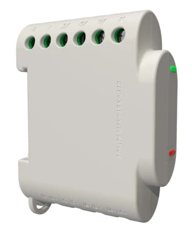

# Zusammenfassung {#Zusammenfassung}

Mit einem sog. *Balkonkraftwerk* kann man sehr einfach und relativ günstig
Solarstrom gewinnen und über eine Steckdose direkt ins Hausnetz einspeisen.
Das spart Stromkosten und kann sich je nach verwendeten Komponenten
und deren Aufstellung schon nach wenigen Jahren Betrieb rechnen ---
allerdings nur soweit man den Strom auch gleichzeitig selbst verbraucht.
Weil diese Betriebsart den überschüssigen Strom an die Allgemeinheit weitergibt
und keine Batterie benötigt, ist sie für die ökologische Gesamtbilanz am besten.

Für eine gewisse Unabhängigkeit von der nicht ständig kräftig vorhandenen
Sonneneinstrahlung und vom allgemeinen Stromnetz
braucht man eine aufladbare Batterie als Stromspeicher und weitere Geräte,
was das Ganze deutlich aufwendiger und teurer macht. Mit einer geeigneten
vom aktuellen Verbrauch im Haushalt abhängigen Regelung lässt sich überschüssige
Energie zwischenspeichern und mit gewissen Verlusten nach Bedarf wieder abrufen.
Eine sog. *Inselanlage* ist auch während Stromausfällen verwendbar,
soweit die Speicherkapazität und die Einstrahlung zum Nachladen reichen.

<!--https://www.handelsblatt.com/adv/firmen/balkonkraftwerk-solar.html-->
<!--https://cdn.daa.net/images/photovoltaik/balkonkraftwerk.jpg-->
<!--https://www.solaranlagen-portal.com/photovoltaik/balkonkraftwerk-->

# Abgrenzung und Zielsetzung {#Abgrenzung}

Hier geht es nicht um *Solarthermie*, also die direkte Gewinnung von Wärme
durch Sonneneinstrahlung, sondern um die Erzeugung von elektrischem Strom.
Es geht auch nicht primär um „große“ Photovoltaik-Anlagen etwa auf Hausdächern
(dazu gibt es z.B. einen fundierten [Leitfaden von der HTW Berlin](
https://solar.htw-berlin.de/wp-content/uploads/HTW-PV-Wegweiser.pdf)),
wobei viele Aspekte natürlich gleich oder leicht übertragbar sind.

Meine Motivation als Autor ist vor allem physikalisch-technische Bildung ---
also relevante Zusammenhänge zu verstehen und möglichst hilfreich darzustellen.
Ich verfolge keinerlei kommerzielle Interessen (Verkauf, Sponsoring, o.ä.) ---
finanziell geht mir es darum, wie ich selbst und Andere mit vertretbarem Aufwand
und geringen Kosten möglichst viel Nutzen aus eigenem Solarstrom ziehen können.

Alle Inhalte sind von mir selbst recherchiert (meist online) und beschrieben,
wobei ich viele Quellen verlinke, die ich interessant und hilfreich finde.
Sehr viel praktisch Relevantes habe ich durch den Austausch zu PV-Angeboten
auf [myDealz.de](https://www.mydealz.de/) mitbekommen, überprüft und eingebaut.
Um möglichst verlässliche und detaillierte Werte zum nutzbaren Ertrag von
PV-Anlagen auch mit besonderen Eigenschaften ohne oder mit Speicher zu erhalten,
habe ich einen eigenen [Simulator](#SolBatSim) mit vielen Optionen entwickelt,
dessen Ergebnisse an mehreren Stellen maßgeblich eingeflossen sind.

Als Privatperson und auch als naturwissenschaftlich-technisch versierter
Nichtprofi kann ich natürlich keine offiziellen Informationen bzw. absolut
verlässliche Hinweise geben und für die Inhalte keine Gewähr oder gar Haftung
übernehmen. Wer bezüglich steckerfertigen PV-Anlagen etwas Offizielleres sucht,
der sei z.B. auf den schönen [Leitfaden von SmartGridsBW](
https://smartgrids-bw.net/public/uploads/2020/04/IBZ-Leitfaden_Balkon-PV-Online.pdf)
und die [„Fachinformation“ des DKE](https://www.dke.de/de/arbeitsfelder/energy/mini-pv-anlage-solar-strom-balkon-nachhaltig-erzeugen)
verwiesen.

<!-- markdown-toc start - Run M-x markdown-toc-refresh-toc -->
<!--
**Inhaltsverzeichnis**

- [Zusammenfassung {#Zusammenfassung}](#zusammenfassung-zusammenfassung)
- [Abgrenzung {#Abgrenzung}](#abgrenzung-abgrenzung)
    - [Inhaltsverzeichnis](#inhaltsverzeichnis)
    - [Photovoltaik und ihr möglicher Ertrag {#Photovoltaik}](#photovoltaik-und-ihr-möglicher-ertrag-photovoltaik)
        - [Sonneneinstrahlung {#Sonneneinstrahlung}](#sonneneinstrahlung-sonneneinstrahlung)
        - [Nennleistung und Jahresertrag {#Nennleistung}](#nennleistung-und-jahresertrag-nennleistung)
        - [Optimale Ausrichtung von Solarmodulen {#Ausrichtung}](#optimale-ausrichtung-von-solarmodulen-ausrichtung)
            - [Aufteilung in mehrere Orientierungen {#Aufteilung}](#aufteilung-in-mehrere-orientierungen)
    - [Stromverbrauch im Haushalt {#Stromverbrauch}](#stromverbrauch-im-haushalt-stromverbrauch)
        - [Verbrauchsmessung {#Verbrauchsmessung}](#verbrauchsmessung-verbrauchsmessung)
        - [Stromzähler und Rücklaufsperre {#Stromzähler}](#stromzähler-und-rücklaufsperre-stromzähler)
    - [Eigenverbrauch und seine Berechnung {#Eigenverbrauch}](#eigenverbrauch-und-seine-berechnung)
        - [Typische Rentabilität kleiner PV-Anlagen {#rentabel}](#typische-rentabilitaet-kleiner-pv-anlagen-rentabel)
        - [Online-Berechnung {#Online}](#online-berechnung)
        - [Ökonomisch orientierter PV-Rechner {#PV-Rechner}](#oekonomisch-orientierter-pv-rechner)
        - [Hochauflösende Simulation: SolBatSim {#SolBatSim}](#solbatsim-hochauflösende-simulation)
    - [Nutzungsvarianten {#Nutzung}](#nutzungsmöglichkeiten-nutzung)
        - [Direkte Netzeinspeisung (Stecker-Solaranlage, „Balkonkraftwerk“) {#Balkonkraftwerk}](#direkte-netzeinspeisung-stecker-solaranlage-balkonkraftwerk-balkonkraftwerk)
            - [Beschränkung auf 600 bzw. 800 W und ihre Gründe {#Kappung}](#beschränkung-auf-600-w-und-ihre-gründe-kappung)
            - [Kappungsverlust durch Drosselung auf 600 W {#Kappungsverlust}](#kappungsverlust-durch-drosselung-auf-600-w-kappungsverlust)
        - [Hausnetzeinspeisung mit Batteriepuffer {#Batteriepuffer}](#hausnetzeinspeisung-mit-batteriepuffer-batteriepuffer)
            - [Regelungsstrategien für Stromspeicher {#Regelungsstrategien}](#regelungsstrategien-fuer-stromspeicher)
            - [Speicherbatterie {#Speicherbatterie}](#speicherbatterie-speicherbatterie)
            - [Ladung der Batterie {#Batterieladung}](#batterieladung-batterieladung)
            - [Entladung der Batterie {#Entnahme}](#einspeisung-aus-der-batterie-einspeisung)
        - [Inselanlage (mit Batteriespeicherung) {#Inselanlage}](#inselanlage-mit-batteriespeicherung-inselanlage)
        - [Kombination aus Hausnetzeinspeisung und Inselanlage {#Kombination}](#kombination-aus-hausnetzeinspeisung-und-inselanlage-kombination)
    - [Auswahl und Nutzung von Komponenten {#Komponenten}](#hinweise-für-die-auswahl-und-nutzung-von-komponenten-komponenten)
        - [Solarmodule {#Solarmodule}](#solarmodule-solarmodule)
            - [Elektrischer Anschluss {#Anschluss}](#anschluss-von-solarmodulen-anschluss)
            - [Montage {#Montage}](#montage-montage)
        - [Mikrowechselrichter und andere Stromrichter {#Stromrichter}](#mikrowechselrichter-und-andere-stromrichter-stromrichter)
            - [MPPT-Solarregler {#MPPT}](#mppt-solarregler-mppt)
            - [Solar-Laderegler {#Laderegler}](#solar-laderegler-laderegler)
            - [Wechselrichter {#Wechselrichter}](#wechselrichter-wechselrichter)
            - [Netzwechselrichter {#Netzwechselrichter}](#netzwechselrichter-netzwechselrichter)
            - [Inselwechselrichter {#Inselwechselrichter}](#inselwechselrichter-inselwechselrichter)
            - [Hybridgeräte: Solar-Laderegler mit Wechselrichter {#Hybrid}](#hybridgeräte-solar-laderegler-mit-wechselrichter-hybrid)
            - [Gleichspannungswandler {#Gleichspannungswandler}](#gleichspannungswandler-gleichspannungswandler)
        - [Speicherbatterien {#Speicher}](#speicherbatterien-speicher)
            - [Batterie-Dimensionierung {#Dimensionierung}](#batterie-dimensionierung-dimensionierung)
            - [Batterie-Strukturierung {#Strukturierung}](#batterie-strukturierung-strukturierung)
            - [Kombination aus Batterie und Wechselrichter {#Kaskadierte}](#kombination-aus-batterie-und-wechselrichter-kaskadierte)
            - [Tiefsetzsteller {#Tiefsetzsteller}](#tiefsetzsteller-tiefsetzsteller)
            - [Spannungswächter {#Spannungswächter}](#spannungswächter-spannungswächter)
    - [Beispiel-Konfigurationen {#Konfigurationen}](#beispiel-konfigurationen-konfigurationen)
        - [Mobile Inselanlage {#Mobilanlage}](#mobile-inselanlage-mobilanlage)
        - [Stecker-Solaranlage {#Steckeranlage}](#stecker-solaranlage-steckeranlage)
        - [Kombi-Anlage {#Kombianlage}](#kombi-anlage-kombianlage)
-->
<!-- markdown-toc end -->

<!-- pandoc -s - -toc index.md -o output.md -->

# Inhaltsverzeichnis

-   [Zusammenfassung](#Zusammenfassung)
-   [Abgrenzung](#Abgrenzung)
-   [Inhaltsverzeichnis](#inhaltsverzeichnis)
-   [Photovoltaik und ihr möglicher Ertrag](#Photovoltaik)
    -   [Sonneneinstrahlung](#Sonneneinstrahlung)
    -   [Nennleistung und Jahresertrag](#Nennleistung)
    -   [Optimale Ausrichtung von Solarmodulen](#Ausrichtung)
        - [Aufteilung in mehrere Orientierungen](#Aufteilung)
-   [Stromverbrauch im Haushalt](#Stromverbrauch)
    - [Verbrauchsmessung](#Verbrauchsmessung)
    - [Stromzähler und Rücklaufsperre](#Stromzähler)
-   [Eigenverbrauch und seine Berechnung](#Eigenverbrauch)
    -   [Typische Rentabilität kleiner PV-Anlagen](#rentabel)
    -   [Online-Berechnung](#Online)
    -   [Ökonomisch orientierter PV-Rechner](#PV-Rechner)
    -   [Hochauflösende Simulation: SolBatSim](#SolBatSim)
-   [Nutzungsvarianten](#Nutzung)
    -   [Direkte Netzeinspeisung (Stecker-Solaranlage, „Balkonkraftwerk“)](#Balkonkraftwerk)
        - [Beschränkung auf 600 bzw. 800 W und ihre Gründe](#Kappung)
        - [Kappungsverlust durch Drosselung auf 600 W](#Kappungsverlust)
    -   [Hausnetzeinspeisung mit Batteriepuffer](#Batteriepuffer)
        - [Regelungsstrategien für Stromspeicher](#Regelungsstrategien)
        - [Speicherbatterie](#Speicherbatterie)
        - [Ladung der Batterie](#Batterieladung)
        - [Entladung der Batterie](#Entnahme)
    -   [Inselanlage (mit Batteriespeicherung)](#Inselanlage)
    -   [Kombination aus Hausnetzeinspeisung und
        Inselanlage](#Kombination)
-   [Auswahl und Nutzung von Komponenten](#Komponenten)
    -   [Solarmodule](#Solarmodule)
        - [Elektrischer Anschluss](#Anschluss)
        - [Montage](#Montage)
    -   [Mikrowechselrichter und andere Stromrichter](#Stromrichter)
        - [MPPT-Solarregler](#MPPT)
        - [Solar-Laderegler](#Laderegler)
        - [Wechselrichter](#Wechselrichter)
        - [Netzwechselrichter](#Netzwechselrichter)
        - [Inselwechselrichter](#Inselwechselrichter)
        - [Hybridgeräte: Solar-Laderegler mit Wechselrichter](#Hybrid)
        - [Gleichspannungswandler](#Gleichspannungswandler)
    -   [Speicherbatterien](#Speicher)
        - [Batterie-Dimensionierung}](#Dimensionierung)
        - [Batterie-Strukturierung](#Strukturierung)
        - [Kombination aus Batterie und Wechselrichter](#Kaskadierte)
        - [Tiefsetzsteller](#Tiefsetzsteller)
        - [Spannungswächter](#Spannungswächter)
-   [Beispiel-Konfigurationen](#Konfigurationen)
    -   [Mobile Inselanlage](#Mobilanlage)
    -   [Stecker-Solaranlage](#Steckeranlage)
    -   [Kombi-Anlage](#Kombianlage)

Photovoltaik und ihr möglicher Ertrag {#Photovoltaik}
-----------------------------------------------------

Mit Solarzellen kann man Sonnenlicht in elektrische Energie umwandeln,
woraus sich auch die Bezeichnung *Photovoltaik (PV)* ableitet.

Leider ist diese Art der Stromgewinnung nicht besonders effizient.
Das [erste Photovoltaikmodul](
https://www.photovoltaik4all.de/seit-wann-gibt-es-photovoltaik) wurde 1883
von Charles Fritts entwickelt und hatte einen Wirkungsgrad von 1%.
Der [Wirkungsgrad](https://de.wikipedia.org/wiki/Solarzelle#Wirkungsgrad)
der heutzutage üblichen Photovoltaik-Technologie mit Siliziumzellen liegt
bei 18 bis 20%, wobei teilweise wohl auch 22% erreicht werden.
Wenn man nicht sehr mit Platz sparen muss, lohnt es sich allerdings kaum,
für einen wenige Prozentpunkte höheren Wirkungsgrad mehr Geld auszugeben.

Abgesehen vom Wirkungsgrad gibt es in der Praxis Verluste, die davon abhängen,
wie alt die PV-Module sind, wie sehr
ihre Ausrichtung von der aktuellen Einstrahlungsrichtung der Sonne abweicht
(wobei senkrechte Einstrahlung natürlich optimal, aber selten erreichbar ist),
wie stark sie verschattet und/oder verschmutzt sind und wie warm sie sind.
Die altersbedingten Verluste (*Degradation*) steigen ziemlich linear etwa 0,5%
pro Jahr, so dass sich bei einer projektierten Gesamt-Verwendungsdauer von 20
Jahren eine durchschnittliche Degradation (also nach 10 Jahren) von 5% ergibt.
Auch der termperaturbedingte Verlust ist praktisch linear und liegt je nach
Zelltyp bei insgesamt etwa 10%, wenn die Modultemperatur beispielsweise 55°C
beträgt, also 30°C über der Temperatur bei [*Standard-Testbedingungen (STC)*](
https://photovoltaiksolarstrom.com/photovoltaiklexikon/noct/) von 25°C.
Genaueres dazu z.B. [hier](
https://joint-research-centre.ec.europa.eu/pvgis-photovoltaic-geographical-information-system/getting-started-pvgis/pvgis-data-sources-calculation-methods_en#ref-5-calculation-of-pv-power-output).

Zu berücksichtigen ist zudem der elektrische Wirkungsgrad der übrigen PV-Anlage
(also z.B. von Wechselrichter, Leitungen, ggf. Batterie) von etwa 80 bis 95%.

Das Hauptproblem der Photovoltaik ist allerdings viel grundlegender, nämlich
die am Erdboden oft nicht oder nur schwach verfügbare Sonneneinstrahlung.

### Sonneneinstrahlung {#Sonneneinstrahlung}

<!--
[{:.right width="500"
style="margin-left: 10px; margin-right: 0px"}](
https://solargis.com/maps-and-gis-data/download/germany)
-->
Die von Solarzellen abgegebene Leistung hängt ziemlich linear
von der Intensität der Einstrahlung durch die Sonne ab.

Die Strahlungsleistung der Sonne auf unseren Planeten außerhalb der Atmosphäre
(also ohne Dämpfung durch Luftmoleküle, Wolken und Schmutz)
senkrecht zum Sonnenstand [berechnet sich zu 1367 W/m²](
https://www.photovoltaik4all.de/wie-kann-man-die-solarstrahlung-berechnen)
und wird als *terrestrische Solarkonstante* bezeichnet.
Die Stärke der tatsächlich auf den Erdboden treffende Sonneneinstrahlung,
welche als [*Globalstrahlung*](https://de.wikipedia.org/wiki/Globalstrahlung)
(engl. _global horizontal irradiance_, _GHI_), bezeichnet wird, ist natürlich
viel geringer.
Der 30-Jahres-Mittelwert in Deutschland liegt bei [etwa 125 W/m²](
https://www.solaranlage-ratgeber.de/photovoltaik/photovoltaik-leistung/photovoltaik-ertrag-in-sommer-und-winter).
Sie hängt stark vom Standort auf der Erde ab und ist je nach Bewölkung,
Tages- und Jahreszeit sehr variabel.
An einem wolkenlosen Sommertag werden maximal etwa 900 W/m² erreicht, bei
leichter Bewölkung mit teils reflektierter Strahlung [bis über 1000 W/m²](
https://www.photovoltaik4all.de/blog/welche-rolle-spielt-die-temperatur-einer-photovoltaikanlage).
Bei sehr schlechtem Wetter kann der Strahlungswert unter 100 W/m² sinken.

[{:.center}](
https://www.dwd.de/DE/leistungen/solarenergie/strahlungskarten_mvs.html#buehneTop)

Die Karten [des DWD](
https://www.dwd.de/DE/leistungen/solarenergie/strahlungskarten_mvs.html#buehneTop)
und [von Solargis](https://solargis.com/maps-and-gis-data/download)
geben einen Überblick, welche Summe an Globalstrahlung
pro Quadratmeter horizontaler Fläche durchschnittlich im Jahr zusammenkommt.
In Deutschland sind es im Schnitt der Jahre 1991 bis 2020 nach Berechnungen
des Deutschen Wetterdienstes [1086 kWh/m²](
https://www.dwd.de/DE/leistungen/_config/leistungsteckbriefPublication.pdf?view=nasPublication&nn=16102&imageFilePath=229809516383478732006435024051472532772736564919904973098512541260476561304284049751405651717289583982040495528279338628905695385542275499557266335698545506612756450227783221602239879972072419602639476858490617241105588560029118312992778838770436569905341248614940063541966138585151325296158670892628008524799090834749&download=true).

[{:.center width="798"}](
https://solargis.com/maps-and-gis-data/download/germany)
Das Sonneneinstrahlung erreicht uns nicht nur auf direktem Wege.
Sie wird auch durch die Erdatmosphäre gestreut und trifft
als *Diffusstrahlung* auf die Erde, selbst wenn die *Direktstrahlung*
durch Wolken oder feste Hindernisse abgeschattet wird.
Die Diffusstrahlung ist nahezu richtungsunabhängig und macht
im Jahresschnitt fast die Hälfte der Globalstrahlung auf die Horizontale aus.
Auf eine 40° nach Süden geneigte Fläche sind es gut 40% der Gesamtstrahlung.
Der Anteil der von der Erdoberfläche (z.B. durch Wolkenspiegelung oder Schnee)
auf die Fläche reflektierten Strahlung liegt dann bei knapp 2%.

### Nennleistung und Jahresertrag {#Nennleistung}

{:style="clear:both"}
Die **Nennleistung** von Solarmodulen wird in **Wp** ([*Watt Peak*](
https://de.wikipedia.org/wiki/Watt_Peak)) angegeben. Zu ihrer
Bestimmung verwendet man eine Referenzbestrahlung mit einem normierten
Sonnenlichtspektrum einer Stärke von 1000 W/m² bei Zelltemperatur 25°C.\
Bei näherer Betrachtung bedeutet die Nennleistung in kWp (also 1000 Wp)
die *effektive Solarfläche* des Moduls, also Fläche (in m²) ×
max. Wirkungsgrad.
Daher kann man auch den maximalen Wirkungsgrad eines Solarmoduls sehr
einfach nachrechnen, indem man seine Nennleistung in kWp durch seine
Fläche in m² teilt.

Die Wp-Angaben für Solarmodule sind mit Vorsicht zu genießen ---
hauptsächlich weil die tatsächliche Leistung wie oben erwähnt
stark von der Situation (Ausrichtung im Vergleich zum Sonnenstand, Bewölkung,
Verschattung usw.) abhängig und meist deutlich geringer ist. Außerdem weil
besonders chinesische Händler von flexiblen Solarmodulen dazu tendieren,
bei den Leistungsangaben deutlich zu übertreiben. Daher lohnt sich als
Plausibiltäts-Check, den Wirkungsgrad nachzurechnen.

In unseren Breitengraden ist je nach Standort bei optimaler statischer
Ausrichtung der Solarmodule ein Jahres-Ertrag von 1100 kWh pro kWp installierter
PV-Nennleistung möglich. Manche Angaben dazu sind mit [etwa 900 bis 1000 kWh](
https://www.energie-experten.org/erneuerbare-energien/photovoltaik/planung/ertrag)
eher zu konservativ bzw. etwas veraltet, andere sehr optimistisch mit
[bis zu 1200 bis 1300 kWh](https://gruenes.haus/photovoltaik-pv-ertrag/).
Es kommt schlichtweg darauf an, welche Werte man bei der Globalstrahlung
ansetzt (je nach Standort, in Deutschland in Jahressumme [etwa 1090 kWh/m²](
https://www.dwd.de/DE/leistungen/_config/leistungsteckbriefPublication.pdf?view=nasPublication&nn=16102&imageFilePath=229809516383478732006435024051472532772736564919904973098512541260476561304284049751405651717289583982040495528279338628905695385542275499557266335698545506612756450227783221602239879972072419602639476858490617241105588560029118312992778838770436569905341248614940063541966138585151325296158670892628008524799090834749&download=true))
und welche Annahmen man bzgl. Modul-Ausrichtung und Anlagen-Wirkungsgrad trifft.
<!-- bzw. bei der
rechnerischen Zahl der [Volllaststunden](https://gammel.de/de/lexikon/volllaststunden/6288) pro Jahr (nämlich [standardmäßig 1000 h/a](
https://www.photovoltaik4all.de/wie-kann-man-die-solarstrahlung-berechnen),
aber eher 1100 h/a) bezogen auf die Standardstrahlung von 1000 W/m².-->

[{:.center}](
https://solargis.com/maps-and-gis-data/download/europe)
Der Jahresertrag lässt sich leicht näherungsweise berechnen,
und zwar durch Multiplikation der Nennleistung der PV-Module in kWp
mit dem [*spezifischen PV-Jahresertrag*](
https://solar-direktinvest.de/photovoltaik/photovoltaik-investieren/spezifischer-jahresertrag-pv/) (engl. [_PV potential_, *PVOUT*](
https://globalsolaratlas.info/global-pv-potential-study)) in kWh/kWp.
Dieser ist standortspezifisch und beinhaltet Annahmen zu typischen praktisch
relevanten Faktoren wie den Verlust durch Verschmutzung und Wechselrichtung.\
Man erhält diese auch *spezifischer Ertrag* genannte Kenngröße aus den
groben [Karten von Solargis](https://solargis.com/maps-and-gis-data/download),
aus dem [Global Solar Atlas der Weltbank](
https://globalsolaratlas.info/map?c=50.10,11.05,7&s=48.1807,11.604e)
(auch von Solargis) oder am Genauesten aus der [PVGIS-Datenbank der EU](
https://re.jrc.ec.europa.eu/pvg_tools/de/)
bei der Standard-Eingabe von 1 kWp für die installierte max. PV-Leistung.

### Optimale Ausrichtung von Solarmodulen {#Ausrichtung}

Die Leistung von Solarmodulen hängt vor Allem von der Direktstrahlung ab ---
und zwar nicht nur von ihrer Intensität, sondern auch davon, wie sehr ihre
Fläche auf den aktuellen Sonnenstand ausgerichtet ist.
Dabei geht es um die zur Modulfläche senkrechte Komponente der Direktstrahlung,
also um den Faktor Kosinus der Winkelabweichung vom Lot auf die Modulfläche.

Mit der Diffusstrahlung,
welche wie oben erwähnt von der Richtung der Direktstrahlung unabhängig ist
und einen erstaunlich großen Anteil an der Gesamtstrahlung ausmacht,
können Solarzellen leider nicht sehr viel anfangen. Für diesen also
effektiv geringen Anteil wäre eine waagerechte Anordnung optimal.

{:width="392" }
{:width="385" .right}
Den [besten Jahres-Gesamtertrag](
https://machdeinenstrom.de/optimaler-ertrag-mit-mini-solar-kraftwerken/)
bekommt man in süddeutschen Breitengraden bei Orientierung genau nach Süden
und mit ca. 38° Neigung (also Winkel relativ zur Waagerechten).
Genaueres kann man z.B. über
[PVGIS](https://re.jrc.ec.europa.eu/pvg_tools/de/) (oder einfacher über
[Solarserver](https://www.solarserver.de/pv-anlage-online-berechnen/))
standortspezifisch anhand von Geo- und Klimadaten berechnen/simulieren,
wobei **es auf ein paar Grad hin oder her nicht ankommt**.

{:.center}
Diese Grafik zeigt sehr schön die relative Änderung des Jahres-Gesamtertrages
einer PV-Anlage mit zunehmender Winkel-Abweichung von Süden (*Azimut*)
abhängig vom Neigungswinkel, wenn der optimale Neigungswinkel 35° beträgt.
Sie wurde von [bonotos](https://www.bonotos.com/) erzeugt,
basierend auf [Daten von Prof. Konrad Mertens](
https://www.fh-muenster.de/eti/downloads/personen/professoren/mertens/frei/2022_05_31_FH-MS_Nachhaltigkeitstag_Vortrag_Solarenergie_Kein_Dach_ohne_Solarstrom_PDF.pdf)
von der FH Münster.

Beim PV-Ertrag und entsprechenden Simulationen ist zu beachten, dass dabei
üblicherweise **der Jahres-Gesamtertrag** betrachtet und optimiert wird.
Dieser **unterliegt der Annahme, dass man den zur jeweiligen Tageszeit
(und Jahreszeit) erzeugten Strom auch immer gleichmäßig nutzen kann**,
sei es durch direkten Eigenverbrauch,
Zwischenspeicherung (was allerdings auch Verluste mit sich bringt)
oder vergütete Einspeisung (die aber leider selten attraktiv ist).\
Wenn man --- wie mit den meisten Stecker-Solaranlagen --- den erzeugten Strom
nur direkt im Haushalt verbrauchen kann und der Rest ins externe Netz geht,
sollte man das Nutzungsprofil berücksichtigen, welches auch auch
[*Lastprofil*](https://www.energie-lexikon.info/lastprofil.html) genannt wird.

{:width="500" .right}
Durch [genaue Simulation](#SolBatSim) für durchschnittliche
Haushalts-Tages-Nutzungsprofile zeigt sich, dass
**eine Abweichung von der optimalen Ausrichtung
deutlich weniger Einbußen beim selbst genutzten Jahres-Gesamtertrag bringt**.
So liegt bei südlicher Ausrichtung, aber senkrechter Anbringung
im Verhältnis zur optimalen Neigung 35° die Einbuße beim Eigenverbrauch
nicht bei 30% vom Optimum, sondern je nach Lastprofil bei 23%.
Die Eigenverbrauchs-Einbuße durch Anbringung auf der West- oder Ostseite
liegt mit senkrechter Anbringung bei 46% und mit 35° Neigung bei 17%.

|   Azimut  | Neigung | Nettoertrag | Einbuße | Eigenverbrauch| Einbuße |
|--------------:|:----|------------:|--------:|--------------:|--------:|
|   W/O: +/-90° | 90° |   323 kWh   |   51%   |  249 kWh      |  46%    |
|   W/O: +/-90° | 35° |   522 kWh   |   16%   |  382 kWh      |  17%    |
| SW/SO: +/-45° | 90° |   432 kWh   |   35%   |  333 kWh      |  28%    |
| SW/SO: +/-45° | 35° |   623 kWh   |    6%   |  445 kWh      |   3%    |
|       Süd: 0° | 90° |   463 kWh   |   30%   |  355 kWh      |  23%    |
|       Süd: 0° | 35° |   661 kWh   |    0%   |  461 kWh      |   0%    |
|:-------------:|:----|------------:|--------:|--------------:|--------:|

Man hat also zur Ausrichtung seiner Solarmodule
bezüglich Eigenverbrauch größere Flexibilität als allgemein angenommen.

<!--
./Solar.pl Lastprofil_4673_kWh.csv 3000 Timeseries_48.215_11.727_SA2_1kWp_crystSi_14_35deg_0deg_2005_2020.csv 600 -peff 92

Neigungswinkel              =   35°
Azimut                      =    0°
Breitengrad                 =   48.215
Längengrad                  =   11.727

PV-Nominalleistung          =  600 Wp
Max. PV-Bruttoleistung      =  650 W am 2020-03-23 um 11:00 h
PV-Bruttoertrag             =  764 kWh
PV-Nettoertrag              =  661 kWh bei PV-System-Eff. 92%, Wechselrichter-Eff. 94%

Verbrauch durch Haushalt    = 3000 kWh
PV-Eigenverbrauch           =  461 kWh

./Solar.pl Lastprofil_4673_kWh.csv 3000 Timeseries_48.215_11.727_SA2_1kWp_crystSi_14_90deg_0deg_2005_2020.csv 600 -peff 92

Neigungswinkel              =   90°
Azimut                      =    0°

PV-Nominalleistung          =  600 Wp
Max. PV-Bruttoleistung      =  608 W am 2005-02-13 um 12:00 h
PV-Bruttoertrag             =  535 kWh
PV-Nettoertrag              =  463 kWh bei PV-System-Eff. 92%, Wechselrichter-Eff. 94%
PV-Eigenverbrauch           =  355 kWh

./Solar.pl Lastprofil_4673_kWh.csv 3000 Timeseries_48.215_11.727_SA2_1kWp_crystSi_14_35deg_45deg_2005_2020.csv 600 -peff 92

Neigungswinkel              =   35°
Azimut                      =   45°
Breitengrad                 =   48.215
Längengrad                  =   11.727

PV-Nominalleistung          =  600 Wp
Max. PV-Bruttoleistung      =  623 W am 2020-03-24 um 12:00 h
PV-Bruttoertrag             =  721 kWh
PV-Nettoertrag              =  623 kWh bei PV-System-Eff. 92%, Wechselrichter-Eff. 94%

Verbrauch durch Haushalt    = 3000 kWh
PV-Eigenverbrauch           =  445 kWh

./Solar.pl Lastprofil_4673_kWh.csv 3000 Timeseries_48.215_11.727_SA2_1kWp_crystSi_14_90deg_45deg_2005_2020.csv 600 -peff 92

Neigungswinkel              =   90°
Azimut                      =   45°

PV-Nominalleistung          =  600 Wp
Max. PV-Bruttoleistung      =  644 W am 2005-02-14 um 14:00 h
PV-Bruttoertrag             =  499 kWh
PV-Nettoertrag              =  432 kWh bei PV-System-Eff. 92%, Wechselrichter-Eff. 94%

Verbrauch durch Haushalt    = 3000 kWh
PV-Eigenverbrauch           =  333 kWh

/Solar.pl Lastprofil_4673_kWh.csv 3000 Timeseries_48.215_11.727_SA2_1kWp_crystSi_14_90deg_-90deg_2005_2020.csv 600 -peff 92

Neigungswinkel              =   90°
Azimut                      =  -90°

PV-Nominalleistung          =  600 Wp
Max. PV-Bruttoleistung      =  513 W am 2020-03-23 um 07:00 h
PV-Bruttoertrag             =  374 kWh
PV-Nettoertrag              =  323 kWh bei PV-System-Eff. 92%, Wechselrichter-Eff. 94%

Verbrauch durch Haushalt    = 3000 kWh
PV-Eigenverbrauch           =  249 kWh

./Solar.pl Lastprofil_4673_kWh.csv 3000 Timeseries_48.215_11.727_SA2_1kWp_crystSi_14_35deg_-90deg_2005_2020.csv 600 -peff 92

Neigungswinkel              =   35°
Azimut                      =  -90°
Breitengrad                 =   48.215
Längengrad                  =   11.727

PV-Nominalleistung          =  600 Wp
Max. PV-Bruttoleistung      =  556 W am 2020-05-06 um 08:00 h
PV-Bruttoertrag             =  604 kWh
PV-Nettoertrag              =  522 kWh bei PV-System-Eff. 92%, Wechselrichter-Eff. 94%
PV-Eigenverbrauch           =  382 kWh
-->

Wer aus irgendeinem Grund (etwa wegen der Befestigung) eine möglichst flache
Neigung der PV-Module wählt, sollte trotzdem mindestens 12° verwenden,
um eine Selbstreinigung der Moduloberflächen durch Niederschlag zu ermöglichen.

Wenn man Solarmodule (z.B. auf dem Dach eines Wohnmobils) in waagerechter Lage
anbringt, ist man von der Orientierung (Himmelsrichtung) unabhängig.
Allerdings kommen nach meiner Erfahrung
billige flexible PV-Module selbst mittags an sehr sonnigen Tagen
kaum über die Hälfte der angegebenen Spitzenleistung hinaus.

#### Aufteilung in mehrere Orientierungen {#Aufteilung}

Eine Aufteilung in zwei Orientierungen, z.B. die klassische
**Ost-West-Ausrichtung** oder irgendwo dazwischen nach Südosten und Südwesten,
**um zu versuchen, auf die Vormittags- und Nachmittagssonne zu optimieren,
lohnt sich nicht**, selbst
wenn man den Ertragsüberschuss über die Mittagszeit kaum nutzen kann.
Das liegt daran, dass die Strahlungsintensität aus südlichen Richtungen
in der Tages- und Jahressumme viel höher ist -- die Sonne scheint dort einfach
viel stärker und häufiger (besonders im Winter) als im Osten oder Westen.
Dieser Effekt wird selbst dann nicht durch eine geringere Nutzbarkeit tagsüber
ausgeglichen, wenn der Haushalt an Arbeitstagen von 8 bis 16 Uhr nur eine
Grundlast von z.B. 100 W hat: Dann hat Ost-West-Ausrichtung
im Sommer einen leichten Vorteil, während zu allen anderen Jahreszeiten
die Südausrichtung mehr Eigenverbrauch ermöglicht.\
Eine Ost-West-Ausrichtung (etwa aus baulichen Gründen) schadet der Eigennutzung
allerdings auch kaum, besonders wenn man tagsüber
im Vergleich zu den Morgen- und Abendstunden wenig Verbrauch hat.\
Im Extremfall, wenn täglich von 8 bis 18 Uhr gar kein Verbrauch stattfinden
würde, was sehr unrealistisch ist, brächte eine Ost-West-Ausrichtung einen
minimalen Vorteil beim Eigenverbrauch.

Dies ist das Ergebnis einer Reihe [genauer Simulationen](#SolBatSim)
für einen Haushalt in Süddeutschland mit 3000 kWh Jahresverbrauch mit einer
Stecker-PV-Anlage mit zwei 300 Wp PV-Modulen und Gesamtsystem-Wirkungsgrad 86%.
Für die Ausrichtungen -/+ 90° (also Ost/West), +/- 60°, +/- 30° und 0° (Süd)
zeigt die folgende Tabelle den PV-Nettoertrag und den Eigenverbrauch (EV)
in den angegebenen Situationen, sowie die jeweils optimale Neigung dafür.

|Azimut|Neigung|Nettoertrag|EV normal|EV Mo-Fr 8-16 h 100 W |EV tgl. 8-18 h 0 W|
|------------:|:----|----------:|--------:|----------------:|----------:|
| O/W: -/+90° | 15° |  549 kWh  |**456 kWh**|  364 kWh      |  306 kWh  |
| O/W: -/+90° | 30° |  531 kWh  |  451 kWh  |**367 kWh**    |  312 kWh  |
| O/W: -/+90° | 40° |  512 kWh  |  443 kWh  |  365 kWh      |**314 kWh**|
|      +/-60° | 30° |  590 kWh  |  481 kWh  |  378 kWh      |  313 kWh  |
|      +/-30° | 30° |  636 kWh  |  496 kWh  |  381 kWh      |  308 kWh  |
|rein Süd: 0° | 15° |  620 kWh  |  489 kWh  |  378 kWh      |**307 kWh**|
|rein Süd: 0° | 30° |  652 kWh  |**500 kWh**|**381 kWh**    |  304 kWh  |
|------------:|:----|----------:|--------:|----------------:|----------:|

Interessant ist in diesem Zusammenhang auch zu betrachten,
wie sich die Unterschiede über die Jahreszeiten verteilen.
* Wenn man an Arbeitstagen (Mo - Fr) tagsüber von 8 bis 16 Uhr
nur eine Grundlast von 100 W hat, verteilt sich bei optimaler Neigung von 30°
der Eigenverbrauch saisonal wie folgt:

[//]: #

|Azimut| Frühjahr| Sommer  | Herbst | Winter  | Summe   |
|-----:|--------:|--------:|-------:|--------:|--------:|
| O/W  |  94 kWh | 139 kWh | 95 kWh |  38 kWh | 367 kWh |
| Süd  |  99 kWh | 133 kWh |100 kWh |  48 kWh | 381 kWh |
|-----:|--------:|--------:|-------:|--------:|--------:|

[//]: #
Also kann im Sommer die Ost-/West-Ausrichtung für den Eigenverbrauch etwas
günstiger sein, und zu den übrigen Jahreszeiten (Herbst, Winter und Frühjahr)
ist die reine Südausrichtung günstiger.
Daher könnte man ein paar Euro sparen, wenn man (z.B. auf einem Flachdach)
bewegliche Module hat, indem man sie normalerweise alle nach Süden richtet
und im Sommer nach Westen und/oder Osten dreht.

* Bei normalem Lastprofil (also wenn man auch tagsüber nicht nur Grundlast hat)
lohnt sich aber nicht einmal eine saisonale Aufteilung,
denn dann verteilt sich bei 30° Neigung der Eigenverbrauch wie folgt:

|Azimut| Frühjahr| Sommer  | Herbst | Winter  | Summe   |
|-----:|--------:|--------:|-------:|--------:|--------:|
| O/W  | 114 kWh | 180 kWh |119 kWh | 38 kWh  | 451 kWh |
| Süd  | 129 kWh | 179 kWh |135 kWh | 57 kWh  | 500 kWh |
|-----:|--------:|--------:|-------:|--------:|--------:|

<!--
https://www.mydealz.de/comments/permalink/39540050
https://www.mydealz.de/comments/permalink/40256532

Variante extrem (Ost-West) gespreizt

./Solar.pl Lastprofil_17_teils_64.csv 3000 Timeseries_48.269_10.408_SA2_1kWp_crystSi_14_45deg_90deg_2005_2020.csv 300 Timeseries_48.269_10.408_SA2_1kWp_crystSi_14_45deg_-90deg_2005_2020.csv 300 # -load 130 -load 93 7:8..18

Neigungswinkel  =  45° Azimut =  90°
Neigungswinkel  =  45° Azimut = -90°
PV-Bruttoertrag = 595 kWh
PV-Nettoertrag  = 512 kWh bei System-Wirkungsgrad 86%
Last Haushalt  = 3000 kWh
Eigenverbrauch  = 436 kWh
Eigenverbrauch  = 362 kWh wenn Mo-Fr 8-16 Uhr nur 100 W Verbrauch (Grundlast)
Eigenverbrauch  = 313 kWh wenn täglich 8-18 Uhr kein Verbrauch

./Solar.pl Lastprofil_17_teils_64.csv 3000 Timeseries_48.269_10.408_SA2_1kWp_crystSi_14_40deg_90deg_2005_2020.csv 300 Timeseries_48.269_10.408_SA2_1kWp_crystSi_14_40deg_-90deg_2005_2020.csv 300 # -load 130 -load 93 7:8..18

Neigungswinkel  =  40° Azimut =  90°
Neigungswinkel  =  40° Azimut = -90°
PV-Bruttoertrag = 595 kWh
PV-Nettoertrag  = 512 kWh bei System-Wirkungsgrad 86%
Last Haushalt  = 3000 kWh
Eigenverbrauch  = 443 kWh
Eigenverbrauch  = 365 kWh wenn Mo-Fr 8-16 Uhr nur 100 W Verbrauch (Grundlast)
Eigenverbrauch  = 314 kWh wenn täglich 8-18 Uhr kein Verbrauch
/Solar.pl Lastprofil_17_teils_64.csv 3000 Timeseries_48.269_10.408_SA2_1kWp_crystSi_14_40deg_90deg_2005_2020.csv 300 Timeseries_48.269_10.408_SA2_1kWp_crystSi_14_40deg_-90deg_2005_2020.csv 300 -distort 1,1,1,1,2,2,2,2,.5,.5,.5,.5,.5,.5,.5,.5,2,2,2,2,1,1,1,1
PV-Eigenverbrauch           =  343 kWh

./Solar.pl Lastprofil_17_teils_64.csv 3000 Timeseries_48.269_10.408_SA2_1kWp_crystSi_14_35deg_90deg_2005_2020.csv 300 Timeseries_48.269_10.408_SA2_1kWp_crystSi_14_35deg_-90deg_2005_2020.csv 300

Neigungswinkel  =  35° Azimut =  90°
Neigungswinkel  =  35° Azimut = -90°
PV-Bruttoertrag = 607 kWh
PV-Nettoertrag  = 522 kWh bei System-Wirkungsgrad 86%
Last Haushalt  = 3000 kWh
Eigenverbrauch  = 447 kWh
Eigenverbrauch  = 366 kWh wenn Mo-Fr 8-16 Uhr nur 100 W Verbrauch (Grundlast)
Eigenverbrauch  = 313 kWh wenn täglich 8-18 Uhr kein Verbrauch

    ./Solar.pl Lastprofil_17_teils_64.csv 3000 Timeseries_48.269_10.408_SA2_1kWp_crystSi_14_34deg_90deg_2005_2020.csv 300 Timeseries_48.269_10.408_SA2_1kWp_crystSi_14_33deg_-90deg_2005_2020.csv 300

  Neigungswinkel  =  34° Azimut =  90°
  Neigungswinkel  =  33° Azimut = -90°
  PV-Bruttoertrag = 610 kWh
  PV-Nettoertrag  = 525 kWh bei System-Wirkungsgrad 86%
  Last Haushalt  = 3000 kWh
  Eigenverbrauch  = 449 kWh
  Eigenverbrauch  = 367 kWh wenn Mo-Fr 8-16 Uhr nur 100 W Verbrauch (Grundlast)

./Solar.pl Lastprofil_17_teils_64.csv 3000 Timeseries_48.269_10.408_SA2_1kWp_crystSi_14_30deg_90deg_2005_2020.csv 300 Timeseries_48.269_10.408_SA2_1kWp_crystSi_14_30deg_-90deg_2005_2020.csv 300 # -load 130 # -load 93 7:8..18

Neigungswinkel  =  30° (opt.) Azimut =  90°
Neigungswinkel  =  30° (opt.) Azimut = -90°
PV-Bruttoertrag = 617 kWh
PV-Nettoertrag  = 531 kWh bei System-Wirkungsgrad 86%
Last Haushalt  = 3000 kWh
Eigenverbrauch  = 451 kWh
                  Frühjahr 114, Sommer 180, Herbst 119, Winter 38
Eigenverbrauch  = 367 kWh (opt.) wenn Mo-Fr 8-16 Uhr nur 100 W Verbrauch (Grundlast)
                  Frühjahr 94, Sommer 139, Herbst 95, Winter 38
Eigenverbrauch  = 312 kWh wenn täglich 8-18 Uhr kein Verbrauch

./Solar.pl Lastprofil_17_teils_64.csv 3000 Timeseries_48.269_10.408_SA2_1kWp_crystSi_14_25deg_90deg_2005_2020.csv 300 Timeseries_48.269_10.408_SA2_1kWp_crystSi_14_25deg_-90deg_2005_2020.csv 300

Neigungswinkel  =  25° Azimut =   90°
Neigungswinkel  =  25° Azimut =  -90°
PV-Bruttoertrag = 625 kWh
PV-Nettoertrag  = 538 kWh bei System-Wirkungsgrad 86%
Last Haushalt  = 3000 kWh
Eigenverbrauch  = 453 kWh
Eigenverbrauch  = 366 kWh wenn Mo-Fr 8-16 Uhr nur 100 W Verbrauch (Grundlast)
Eigenverbrauch  =  kWh wenn täglich 8-18 Uhr kein Verbrauch

./Solar.pl Lastprofil_17_teils_64.csv 3000 Timeseries_48.269_10.408_SA2_1kWp_crystSi_14_20deg_90deg_2005_2020.csv 300 Timeseries_48.269_10.408_SA2_1kWp_crystSi_14_20deg_-90deg_2005_2020.csv 300

Neigungswinkel  =  20° Azimut =   90°
Neigungswinkel  =  20° Azimut =  -90°
PV-Bruttoertrag =  633 kWh
PV-Nettoertrag  =  544 kWh bei System-Wirkungsgrad 86%
Last Haushalt  = 3000 kWh
Eigenverbrauch  =  455 kWh
Eigenverbrauch  =  365 kWh wenn Mo-Fr 8-16 Uhr nur 100 W Verbrauch (Grundlast)
Eigenverbrauch  =  kWh wenn täglich 8-18 Uhr kein Verbrauch

./Solar.pl Lastprofil_17_teils_64.csv 3000 Timeseries_48.269_10.408_SA2_1kWp_crystSi_14_15deg_90deg_2005_2020.csv 300 Timeseries_48.269_10.408_SA2_1kWp_crystSi_14_15deg_-90deg_2005_2020.csv 300 # -load 130

Neigungswinkel  =  15° (opt.) Azimut =   90°
Neigungswinkel  =  15° (opt.) Azimut =  -90°
PV-Bruttoertrag = 639 kWh
PV-Nettoertrag  = 549 kWh bei System-Wirkungsgrad 86%
Last Haushalt  = 3000 kWh
Eigenverbrauch  = 456 kWh (opt.)
Eigenverbrauch  = 364 kWh wenn Mo-Fr 8-16 Uhr nur 100 W Verbrauch (Grundlast)
Eigenverbrauch  = 306 kWh wenn täglich 8-18 Uhr kein Verbrauch
-->

<!--
Variante stark gespreizt:

./Solar.pl Lastprofil_17_teils_64.csv 3000 Timeseries_48.269_10.408_SA2_1kWp_crystSi_14_35deg_60deg_2005_2020.csv 300 Timeseries_48.269_10.408_SA2_1kWp_crystSi_14_35deg_-60deg_2005_2020.csv 300

Neigungswinkel  =  35° Azimut =   60°
Neigungswinkel  =  35° Azimut =  -60°
PV-Bruttoertrag =  686 kWh
PV-Nettoertrag  =  590 kWh bei System-Wirkungsgrad 86%
Last Haushalt   = 3000 kWh
Eigenverbrauch  =  481 kWh
Eigenverbrauch  =  379 kWh wenn Mo-Fr 8-16 Uhr nur 100 W Verbrauch (Grundlast)

./Solar.pl Lastprofil_17_teils_64.csv 3000 Timeseries_48.269_10.408_SA2_1kWp_crystSi_14_30deg_60deg_2005_2020.csv 300 Timeseries_48.269_10.408_SA2_1kWp_crystSi_14_30deg_-60deg_2005_2020.csv 300 # -load 130

Neigungswinkel  =  30° (opt.) Azimut =   60°
Neigungswinkel  =  30° (opt.) Azimut =  -60°
PV-Bruttoertrag =  689 kWh
PV-Nettoertrag  =  592 kWh bei System-Wirkungsgrad 86%
Last Haushalt  = 3000 kWh
Eigenverbrauch  = 481 kWh
Eigenverbrauch  = 378 kWh wenn Mo-Fr 8-16 Uhr nur 100 W Verbrauch (Grundlast)
Eigenverbrauch  = 313 kWh wenn täglich 8-18 Uhr kein Verbrauch

./Solar.pl Lastprofil_17_teils_64.csv 3000 Timeseries_48.269_10.408_SA2_1kWp_crystSi_14_25deg_60deg_2005_2020.csv 300 Timeseries_48.269_10.408_SA2_1kWp_crystSi_14_25deg_-60deg_2005_2020.csv 300

Neigungswinkel  =  25° Azimut =   60°
Neigungswinkel  =  25° Azimut =  -60°
PV-Bruttoertrag =  689 kWh
PV-Nettoertrag  =  592 kWh bei System-Wirkungsgrad 86%
Last Haushalt  = 3000 kWh
Eigenverbrauch  =  480 kWh
Eigenverbrauch  =  377 kWh wenn Mo-Fr 8-16 Uhr nur 100 W Verbrauch (Grundlast)

./Solar.pl Lastprofil_17_teils_64.csv 3000 Timeseries_48.269_10.408_SA2_1kWp_crystSi_14_15deg_60deg_2005_2020.csv 300 Timeseries_48.269_10.408_SA2_1kWp_crystSi_14_15deg_-60deg_2005_2020.csv 300

Neigungswinkel  =  15° Azimut =   60°
Neigungswinkel  =  15° Azimut =  -60°
PV-Bruttoertrag =  680 kWh
PV-Nettoertrag  =  585 kWh bei System-Wirkungsgrad 86%
Last Haushalt  = 3000 kWh
Eigenverbrauch  =  474 kWh
Eigenverbrauch  =  372 kWh wenn Mo-Fr 8-16 Uhr nur 100 W Verbrauch (Grundlast)

      ./Solar.pl Lastprofil_17_teils_64.csv 3000 Timeseries_48.269_10.408_SA2_1kWp_crystSi_14_30deg_53deg_2005_2020.csv 300 Timeseries_48.269_10.408_SA2_1kWp_crystSi_14_33deg_-54deg_2005_2020.csv 300 

  Neigungswinkel  =  30° (opt.?) Azimut =  53°
  Neigungswinkel  =  33° (opt.?) Azimut = -54°
  PV-Bruttoertrag = 702 kWh
  PV-Nettoertrag  = 604 kWh bei System-Wirkungsgrad 86%
  Last Haushalt  = 3000 kWh
  Eigenverbrauch  = 485 kWh
  Eigenverbrauch  = 380 kWh wenn Mo-Fr 8-16 Uhr nur 100 W Verbrauch (Grundlast)
-->

<!--
Variante schwach gespreizt:

./Solar.pl Lastprofil_17_teils_64.csv 3000 Timeseries_48.269_10.408_SA2_1kWp_crystSi_14_45deg_30deg_2005_2020.csv 300 Timeseries_48.269_10.408_SA2_1kWp_crystSi_14_45deg_-30deg_2005_2020.csv 300

Neigungswinkel  =  45° Azimut =   30°
Neigungswinkel  =  45° Azimut =  -30°
PV-Bruttoertrag =  734 kWh
PV-Nettoertrag  =  631 kWh bei System-Wirkungsgrad 86%
Last Haushalt  = 3000 kWh
Eigenverbrauch  =  492 kWh
Eigenverbrauch  =  377 kWh wenn Mo-Fr 8-16 Uhr nur 100 W Verbrauch (Grundlast)

./Solar.pl Lastprofil_17_teils_64.csv 3000 Timeseries_48.269_10.408_SA2_1kWp_crystSi_14_36deg_30deg_2005_2020.csv 300 Timeseries_48.269_10.408_SA2_1kWp_crystSi_14_35deg_-30deg_2005_2020.csv 300

Neigungswinkel  =  36° Azimut =  30°
Neigungswinkel  =  35° Azimut = -30°
PV-Bruttoertrag = 741 kWh
PV-Nettoertrag  = 637 kWh bei System-Wirkungsgrad 86%
Last Haushalt  = 3000 kWh
Eigenverbrauch  = 496 kWh
Eigenverbrauch  = 380 kWh wenn Mo-Fr 8-16 Uhr nur 100 W Verbrauch (Grundlast)

./Solar.pl Lastprofil_17_teils_64.csv 3000 Timeseries_48.269_10.408_SA2_1kWp_crystSi_14_30deg_30deg_2005_2020.csv 300 Timeseries_48.269_10.408_SA2_1kWp_crystSi_14_30deg_-30deg_2005_2020.csv 300 # -load 130 -load 93 7:8..18

Neigungswinkel  =  30° (opt.) Azimut =   30°
Neigungswinkel  =  30° (opt.) Azimut =  -30°
PV-Bruttoertrag =  739 kWh
PV-Nettoertrag  =  636 kWh bei System-Wirkungsgrad 86%
Last Haushalt  = 3000 kWh
Eigenverbrauch  = 496 kWh
Eigenverbrauch  = 381 kWh wenn Mo-Fr 8-16 Uhr nur 100 W Verbrauch (Grundlast)
Eigenverbrauch  = 308 kWh wenn täglich 8-18 Uhr kein Verbrauch

./Solar.pl Lastprofil_17_teils_64.csv 3000 Timeseries_48.269_10.408_SA2_1kWp_crystSi_14_25deg_30deg_2005_2020.csv 300 Timeseries_48.269_10.408_SA2_1kWp_crystSi_14_25deg_-30deg_2005_2020.csv 300

Neigungswinkel  =  25° Azimut =   30°
Neigungswinkel  =  25° Azimut =  -30°
PV-Bruttoertrag =  733 kWh
PV-Nettoertrag  =  631 kWh bei System-Wirkungsgrad 86%
Last Haushalt   = 3000 kWh
Eigenverbrauch  =  494 kWh
Eigenverbrauch  = 381 kWh wenn Mo-Fr 8-16 Uhr nur 100 W Verbrauch (Grundlast)
-->

<!--
Variante nicht gespreizt:
   ./Solar.pl Lastprofil_17_teils_64.csv 3000 Timeseries_48.269_10.408_SA2_1kWp_crystSi_14_37deg_2deg_2005_2020.csv 600

  Neigungswinkel  =  37° (opt.?) Azimut = 2° (opt.?)
  PV-Bruttoertrag = 762 kWh
  PV-Nettoertrag  = 655 kWh bei System-Wirkungsgrad 86%
  Last Haushalt  = 3000 kWh
  Eigenverbrauch  = 500 kWh
  Eigenverbrauch  = 379 kWh wenn Mo-Fr 8-16 Uhr nur 100 W Verbrauch (Grundlast)

./Solar.pl Lastprofil_17_teils_64.csv 3000 Timeseries_48.269_10.408_SA2_1kWp_crystSi_14_35deg_0deg_2005_2020.csv 600 # -load 93 7:8..18

Neigungswinkel  =  35° Azimut = 0°
PV-Bruttoertrag =  761 kWh
PV-Nettoertrag  =  655 kWh bei System-Wirkungsgrad 86%
Last Haushalt  = 3000 kWh
Eigenverbrauch  = 500 kWh
Eigenverbrauch  = 379 kWh wenn Mo-Fr 8-16 Uhr nur 100 W Verbrauch (Grundlast)
Eigenverbrauch  = 302 kWh wenn täglich 8-18 Uhr kein Verbrauch

./Solar.pl Lastprofil_17_teils_64.csv 3000 Timeseries_48.269_10.408_SA2_1kWp_crystSi_14_30deg_0deg_2005_2020.csv 600 # -load 130 # -load 93 7:8..18

Neigungswinkel  =  30° (opt.) Azimut = 0°
PV-Bruttoertrag =  758 kWh
PV-Nettoertrag  =  652 kWh bei System-Wirkungsgrad 86%
Last Haushalt  = 3000 kWh
Eigenverbrauch  = 500 kWh
                  Frühjahr 129, Sommer 179, Herbst 135, Winter 57
Eigenverbrauch  = 381 kWh wenn Mo-Fr 8-16 Uhr nur 100 W Verbrauch (Grundlast)
                  Frühjahr 99, Sommer 133, Herbst 100, Winter 48
Eigenverbrauch  = 304 kWh wenn täglich 8-18 Uhr kein Verbrauch

./Solar.pl Lastprofil_17_teils_64.csv 3000 Timeseries_48.269_10.408_SA2_1kWp_crystSi_14_25deg_0deg_2005_2020.csv 600

Neigungswinkel  =  25° Azimut = 0°
PV-Bruttoertrag =  749 kWh
PV-Nettoertrag  =  645 kWh bei System-Wirkungsgrad 86%
Last Haushalt  = 3000 kWh
Eigenverbrauch  =  498 kWh
Eigenverbrauch  = 381 kWh wenn Mo-Fr 8-16 Uhr nur 100 W Verbrauch (Grundlast)
Eigenverbrauch  = 306 kWh wenn täglich 8-18 Uhr kein Verbrauch
./Solar.pl Lastprofil_17_teils_64.csv 3000 Timeseries_48.269_10.408_SA2_1kWp_crystSi_14_30deg_0deg_2005_2020.csv 600 -distort 1,1,1,1,2,2,2,2,.5,.5,.5,.5,.5,.5,.5,.5,2,2,2,2,1,1,1,1
PV-Eigenverbrauch           =  350 kWh

./Solar.pl Lastprofil_17_teils_64.csv 3000 Timeseries_48.269_10.408_SA2_1kWp_crystSi_14_20deg_0deg_2005_2020.csv 600 #-load 130

Neigungswinkel  =  20° Azimut = 0°
PV-Bruttoertrag =  737 kWh
PV-Nettoertrag  =  634 kWh bei PV-System-Eff. 91%, Wechselrichter-Eff. 94%
Last Haushalt  = 3000 kWh
Eigenverbrauch  = 495 kWh
Eigenverbrauch  = 380 kWh wenn Mo-Fr 8-16 Uhr nur 100 W Verbrauch (Grundlast)
Eigenverbrauch  = 307 kWh wenn täglich 8-18 Uhr kein Verbrauch

./Solar.pl Lastprofil_17_teils_64.csv 3000 Timeseries_48.269_10.408_SA2_1kWp_crystSi_14_15deg_0deg_2005_2020.csv 600 #-load 130 #-load 93 7:8..18

Neigungswinkel  =  15° Azimut = 0°
PV-Bruttoertrag =  721 kWh
PV-Nettoertrag  =  620 kWh bei PV-System-Eff. 91%, Wechselrichter-Eff. 94%
Last Haushalt  = 3000 kWh
Eigenverbrauch  = 489 kWh
Eigenverbrauch  = 378 kWh wenn Mo-Fr 8-16 Uhr nur 100 W Verbrauch (Grundlast)
Eigenverbrauch  = 307 kWh wenn täglich 8-18 Uhr kein Verbrauch
-->

**Also auch bei einem Verbrauchsprofil, das stark auf die Morgen- und
Abendstunden konzentriert ist, bringt eine Aufteilung der Modul-Ausrichtung
keinen Vorteil für den Eigenverbrauch.** Dagegen spricht zusätzlich 
die Tendenz zu stärkerer Verschattung durch den flacheren Sonnenstand.
Außerdem ist die geteilte Montage meist aufwendiger, und die beiden Richtungen
verlangen zur Optimierung eine getrennte [MPPT-Regelung](#MPPT).

Was die für den Eigenverbrauch optimale Neigung der PV-Module
bei einer Anlage mit 600 Wp betrifft, ergeben die Simulationen folgendes:
Bei reiner Südausrichtung (0° Azimut), ebenso bei einer Orientierung von +/- 30°
oder +/- 60° abweichend von Süden, ist eine Neigung von ungefähr 30° optimal.
Bei einer Orientierung von +/-90° abweichend von Süden (also rein Ost-West) 
ist bei einem normalen Lastprofil eine Neigung von ungefähr 15° am günstigen,
bei tagsüber nur Grundlast wieder 30° optimal.
Wobei eine Winkelabweichung von +/- 10° sehr wenig ausmacht.

Bei Verwendung von 4 PV-Modulen kann man im Sinne der Eigenverbrauchsoptimierung
und gleichmäßigeren Ertragsverteilung über den Tagesverlauf in Betracht ziehen,
eines nach Osten, zwei nach Süden und eines nach Westen auszurichten.
Bei 400 Wp Modulen ergibt die [Eigenverbrauchssimulation](#SolBatSim), wieder
für ein typisches Lastprofil und 3000 kWh Jahresverbrauch in Süddeutschland,
für alle drei Himmelsrichtungen eine optimale Neigungung von um die 25°
mit wieder sehr geringer Empfindlichkeit auf Abweichungen davon.\
Die Verteilung 1 × Ost -- 2 × Süd -- 1 x West resultiert in einem Nettoertrag
von 1576 kWh und einem Eigenverbrauch von 809 kWh bei optimalen 30°.\
Hingegen bringt die gemeinsame Ausrichtung der 4 Module nach Süden
erwartungsgemäß einen deutlich höheren Gesamt-Nettoertrag von 1734 kWh,
während der Eigenverbrauch von 816 kWh nur noch minimal höher ist,
und zwar bei optimaler Neigung von 25°.
Wenn der Haushalt an Arbeitstagen von 8 bis 16 Uhr allerdings
nur eine Grundlast von z.B. 100 W hat, hat die Aufteilung
auf drei Himmelsrichtungen beim Eigenverbrauch einen hauchdünnen Vorteil
von 3 kWh (nämlich 609 kWh gegenüber 606 kWh bei reiner Südausrichtung),
und zwar bei optimaler Neigung von 25 bis 30° der südlichen Module
und 35 bis 40° der östlichen und westlichen Module.\
Also lohnt sich auch die weitere Aufteilung auf drei Himmelsrichtungen nicht
wirklich, zumal eine gemeinsame Montage meist einfacher und günstiger ist
(und auch weniger störend aussehen sollte).

<!--
./Solar.pl Lastprofil_17_teils_64.csv 3000 Timeseries_48.269_10.408_SA2_1kWp_crystSi_14_40deg_90deg_2005_2020.csv 400 Timeseries_48.269_10.408_SA2_1kWp_crystSi_14_40deg_-90deg_2005_2020.csv 400 Timeseries_48.269_10.408_SA2_1kWp_crystSi_14_25deg_0deg_2005_2020.csv 800 -curb 1200 # -load 130
./Solar.pl Lastprofil_17_teils_64.csv 3000 Timeseries_48.269_10.408_SA2_1kWp_crystSi_14_35deg_90deg_2005_2020.csv 400 Timeseries_48.269_10.408_SA2_1kWp_crystSi_14_35deg_-90deg_2005_2020.csv 400 Timeseries_48.269_10.408_SA2_1kWp_crystSi_14_31deg_0deg_2005_2020.csv 800 -curb 1200 # -load 130
./Solar.pl Lastprofil_17_teils_64.csv 3000 Timeseries_48.269_10.408_SA2_1kWp_crystSi_14_30deg_90deg_2005_2020.csv 400 Timeseries_48.269_10.408_SA2_1kWp_crystSi_14_30deg_-90deg_2005_2020.csv 400 Timeseries_48.269_10.408_SA2_1kWp_crystSi_14_30deg_0deg_2005_2020.csv 800 -curb 1200 # load 130

40°+25°
PV-Nominalleistung = 1600 Wp = 400+400+800 Wp
PV-Bruttoertrag    = 1793 kWh
PV-Nettoertrag     = 1542 kWh bei PV-System-Eff. 91%, Wechselrichter-Eff. 94%
PV-Ertragsverlust  =    0 kWh während 0 h durch Drosselung auf 1200 W
Verbrauch Haushalt = 3000 kWh
Eigenverbrauch mit =  806 kWh
Eigenverbrauch mit =  609 kWh wenn Mo-Fr 8-16 Uhr nur 100 W Verbrauch
Eigenverbrauchsv.  =    0 kWh netto während 0 h durch Drosselung auf 1200 W

35°+31° opt. für tagsüber Grundlast
PV-Nominalleistung = 1600 Wp = 400+400+800 Wp
PV-Bruttoertrag    = 1820 kWh
PV-Nettoertrag     = 1566 kWh bei PV-System-Eff. 91%, Wechselrichter-Eff. 94%
PV-Ertragsverlust  =    0 kWh während 0 h durch Drosselung auf 1200 W
Verbrauch Haushalt = 3000 kWh
Eigenverbrauch mit =  808 kWh
Eigenverbrauch mit =  609 kWh wenn Mo-Fr 8-16 Uhr nur 100 W Verbrauch
Eigenverbrauchsv.  =    0 kWh netto während 0 h durch Drosselung auf 1200 W

30°
PV-Nominalleistung = 1600 Wp = 400+400+800 Wp
PV-Bruttoertrag    = 1833 kWh
PV-Nettoertrag     = 1576 kWh bei PV-System-Eff. 91%, Wechselrichter-Eff. 94%
PV-Ertragsverlust  =    0 kWh während 2 h durch Drosselung auf 1200 W
Verbrauch Haushalt = 3000 kWh
Eigenverbrauch mit =  809 kWh
Eigenverbrauch mit =  608 kWh wenn Mo-Fr 8-16 Uhr nur 100 W Verbrauch
Eigenverbrauchsv.  =    0 kWh während 0 h durch Drosselung auf 1200 W

25°
Eigenverbrauch mit =  807 kWh
Eigenverbrauch mit =  607 kWh wenn Mo-Fr 8-16 Uhr nur 100 W Verbrauch

./Solar.pl Lastprofil_17_teils_64.csv 3000 Timeseries_48.269_10.408_SA2_1kWp_crystSi_14_30deg_0deg_2005_2020.csv 1600 -curb 1200 # -load 130
./Solar.pl Lastprofil_17_teils_64.csv 3000 Timeseries_48.269_10.408_SA2_1kWp_crystSi_14_25deg_0deg_2005_2020.csv 1600 -curb 1200 # -load 130
./Solar.pl Lastprofil_17_teils_64.csv 3000 Timeseries_48.269_10.408_SA2_1kWp_crystSi_14_20deg_0deg_2005_2020.csv 1600 -curb 1200 # -load 130

30°
PV-Nominalleistung = 1600 Wp
PV-Bruttoertrag    = 2023 kWh
PV-Nettoertrag     = 1734 kWh bei PV-System-Eff. 91%, Wechselrichter-Eff. 94%
PV-Ertragsverlust  =    6 kWh während 106 h durch Drosselung auf 1200 W
Last Haushalt      = 3000 kWh
Eigenverbrauch mit =  816 kWh
Eigenverbrauch mit =  605 kWh wenn Mo-Fr 8-16 Uhr nur 100 W Verbrauch
Eigenverbrauchsv.  =    0 kWh während 5 h durch Drosselung auf 1200 W

25°
PV-Nominalleistung = 1600 Wp
PV-Bruttoertrag    = 1999 kWh
PV-Nettoertrag     = 1715 kWh bei PV-System-Eff. 91%, Wechselrichter-Eff. 94%
PV-Ertragsverlust  =    4 kWh während 84 h durch Drosselung auf 1200 W
Verbrauch Haushalt = 3000 kWh
Eigenverbrauch mit =  816 kWh
Eigenverbrauch mit =  606 kWh wenn Mo-Fr 8-16 Uhr nur 100 W Verbrauch
Eigenverbrauchsv.  =    0 kWh netto während 3 h durch Drosselung auf 1200 W

20°
PV-Nominalleistung = 1600 Wp
PV-Bruttoertrag    = 1966 kWh
PV-Nettoertrag     = 1688 kWh bei PV-System-Eff. 91%, Wechselrichter-Eff. 94%
PV-Ertragsverlust  =    3 kWh während 62 h durch Drosselung auf 1200 W
Verbrauch Haushalt    = 3000 kWh
Eigenverbrauch mit =  814 kWh
Eigenverbrauch mit =  606 kWh wenn Mo-Fr 8-16 Uhr nur 100 W Verbrauch
Eigenverbrauchsv.  =    0 kWh netto während 2 h durch Drosselung auf 1200 W
-->

Stromverbrauch im Haushalt {#Stromverbrauch}
--------------------------------------------

Wenn man Strom(kosten) sparen möchte, ist der direkteste, effizienteste und
umweltfreundlichste Ansatz natürlich, erst mal den Stromverbrauch zu senken.
Stromfressende Geräte sollte man so weit wie möglich meiden.
Kandidaten dafür sind vor Allem elektrische Heizungen (auch für Warmwasser)
und alte und/oder unnötig große Kühlschränke und Gefriertruhen.
Wer die Möglichkeit hat, erhitzt Wasser und kocht deutlich effizienter mit Gas.
Zum Wäsche waschen genügt meist auch 30° (statt 40° oder höher).
Fernseher und Computer müssen normalerweise nicht immer laufen.
Geräte, die einen hohen Verbrauch im Bereitschaftsmodus haben,
könnte man bei längerem Nichtgebrauch auch ganz abschalten.
Man kann beispielsweise in einem 3-Personen-Haushalt
durchaus auf unter 1500 kWh im Jahr kommen.

Erst der zweite Schritt zum Einsparen von Stromkosten ist dann eine
geeignet dimensionierte PV-Anlage.
Je mehr in Haushalt tagsüber verbraucht wird, desto größer der zu erwartende
Einsparungseffekt durch eine Anlage ohne Stromspeicher.
Denn diese Nutzungsart lohnt sich nur insoweit, wie man während der
Sonnenscheindauer den erzeugten Strom direkt sinnvoll verbrauchen kann.
Am einfachsten und am besten planbar geschieht das über die sog. *Grundlast*,
also ständig und mehr oder weniger gleichmäßig laufende Verbraucher
wie Kühlschränke, Internetanschluss, Computerserver
und Geräte, die im Bereitschaftsmodus (engl. _standby_) sind.
Darüber hinaus kann man gezielt diverse Haushaltsgeräte und Ladegeräte
vorzugsweise dann betreiben, wenn hohe Sonneneinstrahlung vorhanden ist.
Dazu bieten sich insbesondere Spülmaschinen, Waschmaschinen und das Laden von
Batterien an, wobei die Akkus von E-Bikes oder E-Rollern von der Größenordnung
und ihrem zeitlichen Nutzungsprofil besonders geeignet sind.

Eine ziemlich clevere Nutzung von überschüssigem Strom ist
[*Power-to-Heat (P2H)*](https://de.wikipedia.org/wiki/Power-to-Heat),
also die Verwendung für eine elektrische Heizung, die verstärkte Nutzung
einer Wärmepumpe (welche den Nutzeffekt sogar vervielfacht) oder
das zusätzliche Aufheizen des Warmwasserbehälters einer normalen Heizanlage
über einen [PV-Heizstab](https://www.net4energy.com/de-de/energie/pv-heizstab)
oder der Einsatz eines gesonderten PV-Boilers.
All dies führt zu weniger Verbrauch von fossilen Brennstoffen und kann
je nach Größe der dafür nötigen Investition längerfristig Kosten sparen.

{:style="clear:both"}
{:.right width="378"}
Ein *PV-Heizstab* funktioniert im Prinzip wie ein Tauchsieder und erfordert
keine Wandlung des Stroms, hat also praktisch keine elektrischen Verluste,
wenn er DC-seitig (ohne Wechselrichter) angeschlossen wird.
Allerdings kommt es je nach Stärke der Wärmedämmung zu thermischen Verlusten,
wenn das darüber erwärmte Wasser nicht zeitnah verwendet wird.
Auf jeden Fall muss sichergestellt werden, dass das Wasser im Boiler
nicht überhitzt, falls zu viel PV-Energie vorhanden ist.\
Natürlich setzt eine Nutzung von Solarstrom aus Überschuss voraus,
dass der aktuelle sonstige Stromverbrauch [gemessen wird](
https://www.my-pv.com/de/produkte/my-pv-wifi-meter) und in die Steuerung
eingeht. Beispielsweise beim [AC Thor](
https://www.klimaworld.com/ac-thor-set-pv-manager-fuer-eigenverbrauch-warmwasserbereitung-mit-solarstrom.html) und beim [MYPV AC ELWA 2](
https://www.klimaworld.com/mypv-ac-elwa-2-elektrischer-heizstab-3-5-kw.html)
ist das der Fall. Allerdings verwenden beide eine AC-Kopplung des Heizstabes,
was Wechselrichter-Verluste durch den mit sich bringt, aber wohl die Regelung
vereinfacht und die Möglichkeit bietet, notfalls mit Netzstrom nachzuheizen.
Diverse andere Heizstäbe und
[Solarboiler](https://www.solarversand.de/photovoltaik-wasserboiler-30-liter/)
haben kein solches Energiemanagement, so dass dieses noch ergänzt werden müsste.
Es fallen besonders für PV-Heizstäbe und PV-Boiler also zusätzlichen Montage-
und Regelungs-Aufwände an, weshalb sie sich nur bei größeren PV-Anlagen lohnen.

### Verbrauchsmessung {#Verbrauchsmessung}

{:.right width="300"
style="margin-left: 70px; margin-right: 70px"}
Den Stromverbrauch von Elektrogeräten im Haushalt kann man recht einfach
mit Energiekosten-Messgeräten in Steckdosenform bestimmen. Diese messen
nicht nur den momentanen Stromverbrauch in Watt, sondern bei längerer
Verwendung auch die über die Zeit verbrauchte Strommenge in kWh.

Den Jahresverbrauch seines Haushalts erfährt man automatisch über die
jährliche Stromabrechnung. Die Grundlast lässt sich über den Stromzähler
relativ einfach bestimmen, indem man die Differenz der Zählerstände
über einen Zeitraum von mehreren Stunden, zu dem sonst keine Verbraucher
eingeschaltet sind (z.B. nachts), durch die Zahl der Stunden teilt.

Eine schöne Übersicht von Geräten zur Messung auch der eingespeisten Strommenge
z.B. [hier](https://greenergains.de/balkonkraftwerk-einspeisung-messen/).

{:style="clear:both"}

{:.right width="200"}
Der Haushalts-Stromverbrauch lässt sich auch kontinuierlich und automatisiert
messen und übertragen. Das kann für eine Online-Ablesung und genauere Analyse
des Verbrauchs interessant sein. Besonders wichtig ist es aber für die optimale
lastabhängige [Regelung](#Regelungsstrategien) der Ladung und/oder Entladung
eines Stromspeichers.
* Man kann sich die Verbrauchsdaten über den
sog. [„Volkszähler“](https://hessburg.de/tasmota-wifi-smartmeter-konfigurieren/)
oder [„Powerfox“](https://hessburg.de/tasmota-wifi-smartmeter-konfigurieren/)
aus dem Haushalts-Stromzähler übermitteln lassen --
sofern ein moderner Stromzähler verbaut ist und man Zugang zu diesem hat.
* Alternativ kann man ein 3-Phasen-Energiemessgerät wie den
[Shelly 3EM](https://www.shelly.cloud/de/products/product-overview/shelly-3em-1)
oder den teureren, aber wohl genaueren [my-PV WiFi Meter](
https://www.my-pv.com/de/produkte/my-pv-wifi-meter) verwenden.
Dieses wird in den Sicherungskasten der Wohnung eingebaut,
was ein Fachmann machen sollte, und per WLAN eingebunden.

### Stromzähler und Rücklaufsperre {#Stromzähler}

Für den selbst erzeugten und gleichzeitig verbrauchten Strom spart man sich
die Verbrauchskosten, weil der *Stromzähler* nur die Differenz berücksichtigt
und entsprechend langsamer läuft.
Es wird also nur der vom Stromanbieter bezogene Anteil des Verbrauchs berechnet.

Übrigens ist es normalerweise egal, auf welcher Drehstrom-Phase (L1, L2 oder L3)
die Stecker-Solaranlage angeschlossen wird und auf welcher Phase
die gleichzeitig verwendeten Verbraucher angeschlossen sind ---
die Stromzähler arbeiten *phasensaldierend*, d.h. sie bilden die Gesamtsumme
über alle drei Leitungen aus dem Verbrauch und der Erzeugung,
welche dabei umgekehrtes Vorzeichen hat.

{:.left width="400"}
{:.right width="370"}
Von gewonnenen Strom fließt der Anteil, der nicht aktuell im Haushalt
verbraucht (oder gespeichert) wird, automatisch ins allgemeine Stromnetz.
Moderne Stromzähler haben eine *Rücklaufsperre*, was man an dem entsprechenden
Symbol auf dem Gehäuse erkennen kann. Das führt dazu, dass der überflüssige
Strom praktisch ins externe Netz verschenkt wird.
Die klassischen *Ferrariszähler* mit mechanischer Drehscheibe
laufen dagegen rückwärts, wenn mehr Strom erzeugt als verbraucht wird.
Damit kann man „unter der Hand Strom verkaufen“, was aber in Deutschland bislang
nicht erlaubt ist. Anfang 2023 [sprach sich der VDE jedoch dafür aus](
https://www.vde.com/de/presse/pressemitteilungen/2023-01-11-mini-pv), dass
bei PV-Anlagen bis 800 W die Zähler künftig „auch rückwärtslaufen dürfen“.

Ein *Zweirichtungszähler* kann die Menge des eingespeisten Stroms unabhängig
vom Verbrauch messen, was die Möglichkeit der Vergütung eröffnet.
Eine offiziell angemeldete und vergütete Einspeisung ist mit einiger Bürokratie
verbunden und bringt wenig --- die Vergütung sank in Deutschland gemäß eEG
[bis 2022 auf ca. 6 ct/kWh](
https://www.zolar.de/blog/entwicklung-der-eeg-einspeiseverguetung)
und steigt [ab 2023 auf etwa 8 ct/kWh](
https://www.aroundhome.de/solaranlage/einspeiseverguetung/),
--- immer noch sehr mager, besonders im Vergleich zum Verbrauchspreis.

Eigenverbrauch und seine Berechnung {#Eigenverbrauch}
-----------------------------------------------------

Wer privat eine PV-Anlage betreibt, möchte möglichst viel von ihrem Ertrag
auch selbst verbrauchen, und zwar am besten direkt. Überschüssigen Strom in
einer Batterie für spätere Nutzung zwischenzuspeichern ist aufwendig und teuer.
Der nicht selbst genutzte Anteil wird meist ins externe Netz eingespeist.
Bei Balkonkraftwerken geschieht dies ohne Vergütung, aber auch wenn man seinen
Strom als Kleinunternehmer verscherbelt, hat man einige Bürokratie und bekommt
ziemlich wenig heraus.

Also geht es ökonomisch darum, den Eigenverbrauchsanteil zu maximieren. Der
*Eigenverbrauchsanteil* (*Nutzungsgrad*) ist der Anteil der Netto-Stromerzeugung,
der direkt verbraucht (oder ggf. mit Batterie-Ladeverlusten gespeichert wird).
Je höher er ist, desto weniger Energie wird ins externe Stromnetz eingespeist.
Je kleiner die Anlage ist, umso leichter kann man eine hohe Eigenverbrauchsquote
erreichen, allerdings dann bei entsprechend kleinerem Stromvolumen.

Damit verwandt ist der *Eigendeckungsanteil* (*Selbstversorgungsgrad*), also der
Anteil des Eigenverbrauchs (ggf. mit Batterieentladung abzüglich Ladeverlusten)
am Gesamtverbrauch.
Je höher er ist, desto weniger Energie muss von extern bezogen werden.
Er wird oft auch als
[*Autarkiegrad*](https://klarsolar.de/unterschied-eigenverbrauch-autarkie/)
bezeichnet, was etwas irreführend ist, denn typischerweise arbeitet
der Wechselrichter der PV-Anlage auch dann nicht ohne Verbindung zum Netzstrom,
wenn gerade kein *Netzbezug* (also Stromfluss von außen) stattfindet.
Je größer die Anlage ist, umso höher fällt der Autarkiegrad aus,
allerdings oft zu Lasten des Eigendeckungsanteils.
Eine Quasi-Autarkie (Eigendeckungsanteil 100%)
kann man aber nur mit enormer Stromspeicher-Kapazität erreichen.

[{:.center}](
https://klarsolar.de/wp-content/uploads/2022/10/Eigenverbrauchsanteil-bei-einer-7kWp-Anlage-mit-5kW-Speicher.pnghttps://klarsolar.de/unterschied-eigenverbrauch-autarkie/)
Das Bild veranschaulicht den typischen Stromverlauf bei einer Hausdach-PV-Anlage
mit 7kWp Nennleistung und 5kWh Stromspeicher an einem ziemlich sonnigen Tag mit
mittags etwas Wolken. Weitere schöne Erklärungen mit Grafiken gibt es
[hier](https://brodsoft.de/stromverlauf/pages/simulation).

### Typische Rentabilität kleiner PV-Anlagen {#rentabel}

Wie eingangs geschrieben kann man bei optimaler Platzierung von Solarmodulen
pro Jahr etwa 1,1 kWh Strommenge pro Wp installierter Solarleistung gewinnen.
Rechnen wir beispielsweise mit einer Investition für die PV-Anlage von 1,10€/Wp
(inklusive anteiliger Kosten für Wechselrichter, Montage, Reparatur, etc.),
dann ergeben sich einmalige Kosten von 1€ pro kWh Jahresertrag.\
Nehmen wir für die folgenden Beispiele zudem an, dass der sog. *Arbeitspreis*,
also die Kosten für vom Stromanbieter bezogenen Strom, 40 Ct/kWh beträgt.
Dann spart man 0,40€ für jede kWh Strom, die von der PV-Anlage produziert wird
und die man auch selbst verbraucht, statt sie von außen einzukaufen.\
Wenn die Einsparung an Stromkosten durch die Anlage ihre Kosten eingeholt hat,
hat sich die Anlage *amortisiert*, also die Investition kaufmännisch gelohnt.
Die Investition rentiert sich im Verhältnis der Jahres-Ersparnis zu den Kosten.

* Falls man den erzeugten PV-Strom komplett selbst verbraucht,
was aber praktisch kaum der Fall ist, ergibt sich eine Einsparung von 0,40€
pro kWh Jahresertrag und eine Amortisation der Investition in nur 2,5 Jahren.
Die Rendite würde in diesem Fall satte 40% betragen.

* Eine typische Balkonanlage mit 600 Wp Nennleistung erreicht einen
Jahres-Bruttoertrag von etwa 765 kWh, was bei 86% Gesamtsystem-Wirkungsgrad
ca. 660 kWh Netto-Ertrag (Einspeisung des Wechselrichters) pro Jahr bedeutet.
Rechnen wir wieder mit Kosten von 1,10€/Wp, also für diese Anlage 660€.

  - Bei einem durchschnittlichen Haushalts-Tages-Nutzungsprofil und
  Jahresverbrauch von 3000 kWh liegt der selbst genutzte Ertrag bei etwa 460 kWh
  pro Jahr. Der Eigenverbrauchsanteil liegt also bei 70% des Nettoertrags
  (und der Eigendeckungsanteil bei 15% des Verbrauchs).\
  Damit werden bei 40 Ct/kWh Arbeitspreis jährlich 184€ eingespart.
  Für die Investition von 660€ ergibt sich eine Amortisationszeit von 3,6 Jahren
  und eine Rendite von 28%.

[//]: #
<!--
./Solar.pl Lastprofil_4673_kWh.csv 3000 Timeseries_48.215_11.727_SA2_1kWp_crystSi_0_38deg_0deg_2005_2020.csv 600 -peff 92
ergibt 457 kWh, aber noch etwas Lastspitzen-Abzug
88%: -peff 93.617

./Solar.pl Lastprofil_4673_kWh.csv 3000 Timeseries_48.215_11.727_SA2_1kWp_crystSi_14_35deg_0deg_2005_2020.csv 600 -peff 92

PV-Nominalleistung          =  600 Wp
Bruttoleistung max.         =  650 W am 2020-03-23 um 11:00 h
PV-Bruttoertrag             =  764 kWh
PV-Nettoertrag              =  661 kWh bei PV-System-Eff. 92%, Wechselrichter-Eff. 94%
Ertragsanteil 9-15 Uhr MEZ  =   73 %

Last durch Haushalt         = 3000 kWh
Eigenverbrauch              =  461 kWh
Netzeinspeisung             =  200 kWh
Eigenverbrauchsanteil       =   70 % des Nettoertrags (Nutzungsgrad)
Eigendeckungsanteil         =   15 % des Verbrauchs (Autarkiegrad)

Bei Lastprofil_4685_kWh.csv Eigenverbrauch 502 kWh
-->

  - Bei einem relativ hohen Jahresverbrauch von 6000 kWh können durchschnittlich
  sogar 570 kWh im Jahr (also 87% des Nettoertrags) selbst genutzt werden,
  was bei den angenommenen Kosten eine Amortisationszeit in 2,9 Jahren ergibt.

[//]: #
<!--
./Solar.pl Lastprofil_4673_kWh.csv 6000 Timeseries_48.215_11.727_SA2_1kWp_crystSi_0_38deg_0deg_2005_2020.csv 600 -peff 92

Verbrauch durch Haushalt    = 6000 kWh
PV-Eigenverbrauch           =  572 kWh
Netzeinspeisung             =   89 kWh
PV-Eigenverbrauchsanteil    =   87 % des Nettoertrags (Nutzungsgrad)
Eigendeckungsanteil         =   10 % des Verbrauchs (Autarkiegrad)
-->

  - Bei nur 1500 kWh Jahresverbrauch können durchschnittlich nur 330 kWh im Jahr
  (also 50 % des Nettoertrags) selbst genutzt werden,
  was eine Amortisation in genau 5 Jahren ergibt.

[//]: #
<!--
./Solar.pl Lastprofil_4673_kWh.csv 1500 Timeseries_48.215_11.727_SA2_1kWp_crystSi_0_38deg_0deg_2005_2020.csv 600 -peff 92

Last durch Haushalt         = 1500 kWh
Eigenverbrauch              =  329 kWh
Netzeinspeisung             =  332 kWh
Eigenverbrauchsanteil       =   50 % des Nettoertrags (Nutzungsgrad)
Eigendeckungsanteil         =   22 % des Verbrauchs (Autarkiegrad)
-->

  - Wenn bei 3000 kWh Jahresverbrauch montags bis freitags von 8 bis 16 Uhr
  nur eine Grundlast von 100 W anfällt, liegt die Eigennutzung bei 365 kWh
  im Jahr (also 55 % des Nettoertrags) und die Amortisationszeit bei 4,5 Jahren.

In den beiden zuletzt genannten Fällen könnte man überlegen,
weniger PV-Leistung als 600 Wp zu installieren,
allerdings hätte man dann auch langfristig weniger Nutzen.

[//]: #
<!--
./Solar.pl Lastprofil_4673_kWh.csv 3000 Timeseries_48.215_11.727_SA2_1kWp_crystSi_0_38deg_0deg_2005_2020.csv 600 -peff 92 -load 130

Last durch Haushalt         = 3000 kWh
Konstante Last              =  100 W an den ersten 5 Tagen der Woche von 8 bis 16 Uhr
Eigenverbrauch              =  365 kWh
Netzeinspeisung             =  296 kWh
Eigenverbrauchsanteil       =   55 % des Nettoertrags (Nutzungsgrad)
Eigendeckungsanteil         =   12 % des Verbrauchs (Autarkiegrad)

-->

Für die Amortisation des energetischen Aufwands
zur Herstellung einer Mini-PV-Anlage muss man nach [Angaben des DKE](
https://www.dke.de/de/arbeitsfelder/energy/mini-pv-anlage-solar-strom-balkon-nachhaltig-erzeugen)
allerdings noch 2-3 Jahre länger rechnen.
In die Gesamt-Ökobilanz einer PV-Anlage und ihrer Nutzung gehen natürlich
noch weitere Effekte ein, die sich aber kaum quantifizieren lassen.

### Online-Berechnung {#Online}

Der Eigendeckungsanteil und Eigenverbrauchsanteil lässt sich sehr einfach
näherungsweise mit dem „[Stecker-Solar-Simulator](
https://solar.htw-berlin.de/rechner/stecker-solar-simulator/)“
für Balkonkraftwerke bzw. dem „[Unabhängigkeitsrechner](
https://solar.htw-berlin.de/rechner/unabhaengigkeitsrechner/)“
für Hausdach-PV-Anlagen der HTW Berlin berechnen.

Beide Simulationen nutzen intern Daten der Wetterstation Lindenberg bei Berlin
aus dem Jahr 2017 ---
für Süddeutschland kann man also 10-15% mehr PV-Leistung ansetzen. Als Eingabe
verwenden sie den Jahresstromverbrauch (mit einer typischen Lastverteilung) und
die PV-Nennleistung (mit einem spezifischen PV-Jahresertrag von 1024 kWh/kWp).
Man kann auch eine (nutzbare) Speicherkapazität angeben, wobei ein typischer
Wirkungsgrad für LiFePO4-Batterien von 95% und typische Wandlungsverluste
des Ladereglers und des Wechselrichters von jeweils 94% angenommen werden.
Implizit wird eine optimale bedarfsgerechte Lade-/Entladeregelung vorausgesetzt.

Der Unabhängigkeitsrechner liefert auch den Anteil der Batterieentladung an der
Stromversorgung, den man zur Ertrags- und [Wirtschaftlichkeitsberechnung von
PV-Speichern](https://www.youtube.com/watch?v=bE5fLy0w3MM&t=674s)
verwenden kann (und zwar durch Multiplikation mit dem Stromverbrauch).
Für Anlagen ohne Stromspeicher sind die Ergebnisse sehr realistisch.

Eine sehr einfache Möglichkeit, online die Amortisation zu berechnen, bietet
auch das [PVTool von Andreas Schmitz („AkkuDoktor“)](https://www.akkudoktor.net/pvtool-rechner/).
Als Besonderheit kann man hier schön sehen, wie sich Eigenverbrauchsquote,
Autarkiegrad und Amortisation in Abhängigkeit von der Anwesenheit und Kapazität
eines Stromspeichers ändern.\
Allerdings sind die Ergebnisse deutlich zu optimistisch. Das liegt vermutlich
am verwendeten Lastprofil und unrealistisch hoch angenommenen Wirkungsgraden.
Er macht zu diesen wichtigen Punkten und sonstigen Grundlagen seiner Berechnung
auf seinen beiden PVTool-Seiten keinerlei Angaben.

[{:.center}](
https://brodsoft.de/stromverlauf/profiles/simulation)
Eine ältere Simulation des Eigenverbrauchs für einen gegebenen PV-Nettoertrag
mit Fokus auf Stromspeicher (mit gegebener nutzbarer Kapazität und Effizienz),
gibt es von [brodsoft](https://brodsoft.de/stromverlauf/profiles/simulation).
Diese basiert auf realen Profildaten für PV-Erzeugung und Stromverbrauch,
mit denen die Berechnung auf Stundenbasis erfolgt.
Man kann sich in der Ausgabe auch für jeden Monat Grafiken ausgeben lassen
darauf sehr schön den Verlauf der elektrischen Größen ansehen.
Außerdem gibt es gute Info-Seite mit guten Erklärungen zu Eigenverbrauchsanteil
und Eigendeckungsanteil zu Strategien zu ihrer Optimierung.
Diese Simulation berechnet für die o.g. 600 Wp Beispiel-Anlage je nach Auswahl
des Profils einen Eigenverbrauch von teils 601 kWh (Profil „allgemein 13/14“)
und mehr, aber typischerweise eher 514 kWh (Profil „InGe 16“) pro Jahr.

Es gibt auch eine Android-App namens [PV Calculator](
https://play.google.com/store/apps/details?id=com.pvstrom.pvcalculator)
mit relativ flexiblen Parametern und sehr schöner Darstellung der Ergebnisse.
Sie verwendet die Daten von PVGIS und rechnet auf Stundenbasis.
Für die o.g. Beispiel-Anlage mit 600 Wp kommt sie für die gegebenen
Wirkungsgrade korrekt auf einen Jahres-Nettoertrag von 664 kWh.
Trotzdem sind die Ergebnisse leider zu optimistisch. Das liegt teils an den
angebotenen Profilen (z.B. VDEW-H0-Werktag), die täglich die gleiche Last
annehmen, wobei man immerhin selbst welche pro Jahreszeit definieren kann.
Aber das Hauptproblem ist, dass die Last nur im stundenweisen Durchschnitt
betrachtet wird, also die typischen Lastspitzen unberücksichtigt bleiben.
Damit ergibt sich bei 3000 kWh Jahres-Strombedarf für die meisten Profile
unrealistischerweise so gut wie keine Netzeinspeisung und selbst für das
Profil „Peak Morgen Abends“ eine viel zu niedrige Netzeinspeisung von 52 kWh.
Außerdem wird etwas verwirrend im Gesamtergebnis nicht der resultierende
Eigenverbrauch (hier 612 kWh) dargestellt, sondern der Nettoertrag und der Netzbezug.

<!-- TODO Simulationen mit PV*Sol. --->   

Alle hier genannten Simulationen setzen bei Einsatz eines Pufferspeichers
eine ideale Speicherstrategie voraus.
Ihre Ergebnisse **gelten nicht bei Verwendung einer primitiven Regelung**, wie
sie für [Balkonkraftwerke mit Speicherbatterie](#Batteriepuffer) typisch sind.
Für diese kann aber der [u.g. Simulator](#SolBatSim) verwendet werden.

### Ökonomisch orientierter PV-Rechner {#PV-Rechner}

[{:.center}](PV-Rechner_v6+.xls)
Der per Tabellenkalkulation implementierte [PV-Rechner](PV-Rechner_v6+.xls)
hat als besonderen Schwerpunkt die kaufmännische Betrachtung inklusive Rendite
und Kapitalkosten unter Berücksichtigung von Abschreibung für Reparaturen u.ä.
Er ist für „große“ PV-Anlagen auf Hausdächern konzipiert, und behandelt optional
gesondert das Laden eines E-Fahrzeugs<!-- (was normalerweise öfter zu
Sonnenscheinzeiten erfolgen kann)-->, den Betrieb einer Wärmepumpe und
die Nutzung eines Stromspeichers, funktioniert aber auch für Balkonsolaranlagen.
Als Eingabe erwartet er u.A. den spezifischen PV-Jahresertrag, die Ausrichtung
der Module und den geschätzten Anteil des während der Sonnenscheindauer
im Haushalt nutzbaren Ertrages.
Energieflüsse werden der Einfachheit halber nur grob auf Monatsbasis gerechnet,
so dass wichtige tageszeitliche Effekte und Lastspitzen nicht berücksichtigt
werden. Besonders die Simulation des Stromspeichers ist stark idealisiert.

Bei der o.g. typischen Balkonanlage für 660€ mit 600 Wp und 660 kWh Jahresertrag
ergibt sich mit dem PV-Rechner für einen Haushalt mit 3000 kWh Jahresverbrauch,
der zu 28% während der Haupt-Sonnenscheinzeiten erfolgt,
ein etwas zu optimistischer Solarstrom-Eigenverbrauch von etwa 530 kWh pro Jahr.
Damit könnte man bei 40 Ct/kWh jährlich ca. 205€ Stromkosten einsparen, was eine
Amortisationszeit von 3,2 Jahren und eine satte (Anfangs-)Rendite von 26% ergäbe.

Hinweis: Der PV-Rechner stammt von [Falko (bonotos)](https://www.bonotos.com/)
Der originale beinhaltet auch seiner letzten Version 22-06 einen groben Fehler
in der Rendite-Formel, der zu (fast) doppelt überhöhten Rendite-Zahlen führt.
Ich habe mich mit Falko zu diesen und anderen Punkten ausgetauscht.
Er möchte an dem Tool nichts mehr machen.
So stelle ich hier eine verbesserte und etwas erweiterte Version zur Verfügung.

### Hochauflösende Simulation: SolBatSim {#SolBatSim}

*SolBatSim*, ein selbst entwickelter Simulator, basiert auf Lastprofilen
des Haushalts-Stromverbrauchs mit mindestens stündlicher, aber besser
minütlicher Auflösung und kommt daher auf sehr realistische Ergebnisse.
Dafür können zum Beispiel die 74 von der
Forschungsgruppe Solarspeichersysteme der HTW Berlin [veröffentlichen Profile](
https://solar.htw-berlin.de/elektrische-lastprofile-fuer-wohngebaeude/)
mit 1-Minuten-Auflösung (oder gar 1-Sekunden-Auflösung) verwendet werden.
Mit einem [Lastprofil-Skript](Lastprofil.pl) kann man aus diesen Rohdaten
Lastprofil-Dateien wie [diese](Lastprofil_4673_kWh.csv) synthetisieren.

Die zweite wichtige Eingabe sind die PV-Ertragsdaten, welche leider meistens
höchstens in Stunden-Auflösung erhältlich sind, wie etwa die PV-Ertragsdaten
von [PVGIS](https://re.jrc.ec.europa.eu/pvg_tools/de/). Von dort kann man
für einen gegebenen Standort und eine gegebene PV-Modul-Ausrichtung
(wahlweise für einen Abschnitt von Jahren zwischen 2005 und 2020
oder für ein [*typisches meteorologisches Jahr*](
https://help.valentin-software.com/pvsol/de/berechnungsgrundlagen/einstrahlung/klimadaten/)
Solardaten wie [diese](Solardaten_1215_kWh.csv) herunterladen.
Eine oder mehrere solcher Dateien (womit sich auch eine Linearkombination
von PV-Modulgruppen unterschiedlicher Ausrichtung, Verschattung und
Leistungsparameter abbilden lässt) wird dann zusammen einer Lastprofil-Datei
als Eingabe für ein [Simulator-Skript](Solar.pl) verwendet.

Für die Simulation kann das Lastprofil in einem wählbaren täglichen
Zeitabschnitt durch eine konstante (Grund-)Last adaptiert werden,
ebenso der Gesamt-Jahresverbrauch aus dem Lastprofil,
die Nennleistung jeder PV-Modulgruppe
und weitere Parameter wie der System-Wirkungsgrad der PV-Anlage
(resultierend aus Verlusten z.B. in den Leitungen und durch
Verschmutzung, Eigenverschattung und Alterung der Module)
und der Wirkungsgrad des Wechselrichters, welche als konstant angenommen werden.
Auch eine Limitierung der Wechselrichter-Ausgangsleistung
(auf [z.B. 600 W](#Kappungsverlust) wird unterstützt, außerdem
ein [Stromspeicher](#Batteriepuffer) mit gegebener nutzbarer Kapazität.

Für eine Batterie kann die Ladekopplung DC- oder AC-seitig simuliert,
die angenommenen Wirkungsgrade der Ladung und Speicherung frei bestimmt
und aus folgenden [weiter unten](#Batteriepuffer) näher behandelten
Lade- und Entladestrategien gewählt werden:
- Ladestrategie (solange die definierte Maximalladung nicht erreicht ist):
  - Lastvorrang (optimal): Speicherung der nicht anderweitig gebrauchten PV-Energie
  - vorrangige Speicherung (ohne Berücksichtigung der Last),
    wobei wahlweise Strom auch teils am Speicher vorbei geleitet werden kann:
    - für Überschuss, der nicht mehr in den Speicher passt, und/oder
    - für eine konstante PV-Bruttoleistung
- Entladestrategie (solange die definierte Minimalladung nicht erreicht ist):
  - Lastkompensation (optimal): Entnahme so viel wie zusätzlich zum PV-Ertrag gebraucht wird
  - bedarfsgeregelte Einspeisung: wie vor, aber mit Maximalleistung
  - Konstanteinspeisung: Entnahme einer definierten Leistung aus dem Speicher
    optional auf ein Uhrzeit-Intervall eingeschränkt

Für die [o.g. Beispiel-Anlage](#Berechnung) für den Raum München mit 600 Wp
und einem  PV-Nettoertrag (nach Wechselrichter-Verlusten) von etwa 662 kWh
ergibt sich mit dieser Simulation unter Verwendung minutengenauer Lastprofile
ohne Speicher je nach Profil eine Eigennutzung von ca. 460 kWh.

Das Ergebnis fällt nicht so günstig wie bei den zuvor genannten Simulationen
aus, v.A. weil hier die in der Praxis relativ häufigen Lastspitzen immerhin im
Minutenbereich berücksichtigt werden, die von einer Mini-Solaranlage praktisch
kaum abgefangen werden können, so dass der Eigenverbrauchsanteil geringer ist
als bei einer über Stunden oder gar ganze Monate gemittelten Betrachtung.

<!-- TODO: CSV_74_Loadprofiles_1s_W_var.zip verwenden -->   
Vergleichsrechnungen auf Grundlage eines Lastprofils mit (annähernd)
sekündlicher Auflösung haben ergeben, dass die Lastspitzen nur teilweise einen
spürbaren Einfluss auf die Nutzbarkeit des PV-Ertrags von kleinen Anlagen haben.
Bei 600 Wp sind die Eigennutzungs-Ergebnisse bei Lastdaten auf Stundenbasis
etwa 3 bis 6% zu optimistisch, auf Minutenbasis nur bis etwa 1%.
<!-- bei 3000 kWh: 593 562 557  6%   bei 6000 kWh: 630 623 622  1% -->

Nutzungsvarianten {#Nutzung}
----------------------------

Solarmodule liefern in direkter Abhängigkeit von der Einstrahlungsstärke
sehr variablen Gleichstrom (je nach Nennleistung maximal z.B. 11 A)
mit einer Spannung je nach Modultyp von üblicherweise 22 bis 44 V.
Dieser „rohe“ Strom ist direkt erst mal kaum verwendbar,
außer z.B. zum Aufheizen eines Warmwasserspeichers mit einem [PV-Heizstab](
https://www.net4energy.com/de-de/energie/pv-heizstab) --
siehe dazu [weiter unten](#Stromverbrauch).

Normalerweise wird der PV-Strom daher in Wechselstrom umgewandelt und
direkt ins Hausnetz eingespeist, was das Thema des nächsten Abschnitts ist.

Man kann gerade nicht benötigten PV-Strom auch in einer Batterie
zwischenspeichern, was ein Abschnitt [weiter unten](#Batteriepuffer) behandelt,
der auch erklärt, dass sich das in den seltensten Fällen lohnt.

### Direkte Netzeinspeisung (Stecker-Solaranlage, „Balkonkraftwerk“) {#Balkonkraftwerk}

{:.left width="400"}
{:.right width="378"}

{:style="clear:both"}

Typischerweise speisen Solaranlagen den erzeugten Strom
nach Umwandlung durch einen netzgekoppelten Wechselrichter
([Solarwechselrichter](https://de.wikipedia.org/wiki/Solarwechselrichter),
engl. _grid-tie inverter_) direkt ins Hausnetz oder öffentliche Stromnetz ein,
wo er sofort in irgendeiner Form verbraucht wird (bzw. der Rest verlorengeht).

Wichtig zu beachten ist, dass diese Nutzungsart abseits eines bestehenden
Wechselstrom-Netzes und während eines Stromausfalls nicht funktioniert,
weil sich der verwendete Wechselrichter mit dem Stromnetz synchronisieren muss.

Wie schon der Name *Stecker-Solaranlage* ausdrückt, werden solche kleinen
Anlagen meist einfach über einen (Schuko-)Stecker mit dem Hausnetz verbunden,
z.B. an einer Außensteckdose auf dem Balkon oder der Terrasse. Das ist sehr
flexibel und ermöglicht, sehr einfach ein Energiemessgerät dazwischenzustecken,
wie es unten zur [Verbrauchsmessung](#Verbrauchsmessung) dargestellt ist.
Diese Lösung ist m.E. schon sicher genug,
weil der Wechselrichter die Stromzufuhr sofort unterbricht, wenn man den
Stecker aus der Dose zieht und seine blanken Kontakte berühren kann.
Anfang 2023 [sprach sich der VDE dafür aus](
https://www.vde.com/de/presse/pressemitteilungen/2023-01-11-mini-pv),
„den Schuko-Stecker für die Einspeisung
bis zu einer Systemgesamtleistungsgrenze von 800 W zu dulden“.

{:.right width="450"}
Man kann aber auch, wie vom VDE bislang empfohlen, eine spezielle
*Energiesteckdose* verwenden. Diese wird auch [*Einspeisesteckdose*](
https://www.solarenergie-info.de/wieland-einspeisesteckdose/) genannt
und ist meist von der Firma Wieland. Sie gilt als besonders sicher,
ist aber auch recht teuer und muss von einem Elektriker installiert werden.
[Hier](https://priwatt.de/blog/wieland-vs-schuko-stecker-was-eignet-sich-am-besten-fur-mein-balkonkraftwerk/)
ein ausführlicher Vergleich.
Eine weitere Möglichkeit ist, den Wechselrichter direkt fest mit dem Hausnetz
zu verdrahten, was den Betrieb sogar noch sicherer macht.

Die auch [*Balkonkraftwerk*](https://www.steckdosensolar.de/) genannten Anlagen
haben meist eine recht geringe PV-Nennleistung von etwa 600 bis 800 Wp.
Das hat neben der geringen Größe und sehr überschaubaren Kosten auch damit zu
tun, dass sie selbst installiert werden dürfen und genehmigungsfrei sind,
wenn sie [maximal 600 W in die Steckdose einspeisen](
https://solarblitz.blogspot.com/2019/08/zulassigkeit-von-balkonkraftwerken-plug.html).
Dies gilt bislang für Deutschland und die Schweiz; in Österreich gilt nach einer
allgemeineren EU-Regel für die vereinfachte Nutzung eine Obergrenze von 800 W.
Seit Anfang 2023 [empfiehlt selbst der VDE](
https://www.vde.com/de/presse/pressemitteilungen/2023-01-11-mini-pv), sich
künftig auch in Deutschland an der „Bagatellgrenze bis 800 W“ zu orientieren.

In Deutschland sind PV-Anlagen anmeldepflichtig, wenn sie ins externe Netz
einspeisen können, wobei der Aufwand für Balkonkraftwerke nicht so groß ist.
Nach einem [Artikel im pv magazine](
https://www.pv-magazine.de/2022/02/24/markt-groesser-als-gedacht-rund-190-000-stecker-solar-geraete-bereits-installiert/)
wird geschätzt, dass nur 10 bis 20% der Stecker-Solaranlagen tatsächlich beim
Netzbetreiber angemeldet werden. Eine dort genannte Umfrage hat auch ergeben,
dass etwa 77% der Anlagen mit einem Schuko-Stecker angeschlossen werden.
Bei etwa 1/3 der Anlagen befinden sich die PV-Module auf oder an einem Balkon;
bei etwa der Hälfte werden die Module z.B. auf einem Flachdach oder im Garten
aufgeständert.

#### Beschränkung auf 600 bzw. 800 W und ihre Gründe {#Kappung}

Hintergründe dieser Beschränkung sind nicht in erster Linie, wie meist
angenommen wird, Sicherheitsbedenken bzgl. der Stromleitungen im Haushalt.

Der wesentliche technische Grund sind mögliche nicht immer gut kalkulierbare
Rückwirkungen auf das allgemeine Stromnetz.
Bei massenhafter nicht angemeldeter Einspeisung und kräftigem Sonnenschein
kann der Strom im Verteilnetz durch ziehende Wolken sehr stark schwanken,
was seine Stabilität beeinträchtigen könnte.
Auch könnten z.B. Mittelspannungs-Stromleitungen, die schon am Limit sind,
sich durch ungewöhnlich hohen Stromfluss stärker ausdehnen als normal
und daher teils die Mindest-Durchfahrtshöhe unterschritten werden.
Wenn jedoch durch sog.
[*Nulleinspeisung*](https://www.energie-experten.org/erneuerbare-energien/photovoltaik/eigenverbrauch/nulleinspeisung)
sichergestellt ist, dass kein überflüssiger Strom ins externe Netz fließt,
können Steckdosen-Anlagen [auch z.B. mit 1800 W Leistung](
https://www.pv-magazine.de/2022/07/04/indielux-startet-crowdfunding-fuer-serienproduktion-seines-einspeisewaechters-fuer-stecker-solar-geraete/)
normgerecht betrieben werden.

Man kann durchaus annehmen,
dass die Beschränkung auch nichttechnisch motiviert ist, etwa
weil die Energieversorgungsunternehmen möglichst wenig Konkurrenz haben wollen.

Die Beschränkung leistet auch in gewisser Hinsicht einen Beitrag zum Schutz
der Stromleitungen im Haus in folgendem sehr selten auftretenden Fall:

[{:.right width="380"}](
https://www.sonnenenergie.de/index.php?id=30&tx_ttnews%5Btt_news%5D=254)
Wenn über die Wohnungs-Stromleitung, an der die Einspeisung
stattfindet, gleichzeitig sehr kräftig Strom verbraucht wird, kann es
unter sehr ungünstigen Umständen passieren, dass auf Teilen der Leitung mehr
Strom fließt als die Sicherung eigentlich erlauben würde, was dann zu
einer mehr oder weniger übermäßigen Erwärmung der Leitung führt.\
Wenn L der momentane Gesamt-Verbrauch auf der Leitung ist und P die momentane
Erzeugung auf derselben Leitung, kommt bei der Sicherung die Leistung L - P an.
Wenn die Sicherung auf 16 A ausgelegt ist und die dort ankommende Leistung
vom Betrag her, also | L - P |, kleiner als 3680 W (= 230 V × 16 A) ist,
löst die Sicherung nicht aus. Falls dabei L oder P größer als 3680 W ist,
fließen auf einem Teilabschnitt der Leitung mehr als 16 A Strom.\
Das kann beispielsweise passieren, wenn gerade die Erzeugung 6 A Strom liefert
und der Stromverbrauch zwischen 16 A und 22 A liegt.\
Das ist allerdings insgesamt in der Praxis höchst unwahrscheinlich,
denn fast niemand betreibt an derselben Leitung gleichzeitig Geräte, die in
Summe einen Verbrauch L von über 3680 W haben, und dass z.B. durch einen
Kurzschluss extrem viel Strom fließt, ist möglich, aber kommt selten vor.
Und selbst wenn das der Fall ist und die Solaranlage in dieser Zeit auch nur
mal kurz weniger Leistung als L - 3680 W liefert,
löst die Sicherung wie üblich aus und die Überlast ist beendet.\
Von der ESTI (Schweiz) wird aus diesem Grund
die Leitungsüberlastung durch Stecker-Solaranlagen
[nicht normativ betrachtet](https://www.pvplug.de/positionspapier/).

#### Kappungsverlust durch Drosselung auf 600 W {#Kappungsverlust}

Die nominelle Leistung der verwendeten Solarmodule kann und sollte in Summe
durchaus größer sein aus 600 Wp, also eher 800 bis 1000 Wp. Denn in der Praxis
wird auch mit solchen Modulen eine PV-Ausgangsleistung von 600 W und mehr
ohnehin kaum erreicht, und das auch nicht oft, gerade in sonnenarmen Zeiten.
Der Unterschied beim Jahres-Gesamtertrag mit oder ohne Kappung ist sehr gering.\
Diese Erkenntnis ist schon recht alt und wurde wohl erst [für größere Anlagen](
https://www.photovoltaikforum.com/thread/79306-wechselrichter-unterdimensionierung-welche-ertragseinbu%C3%9Fen/)
diskutiert, aber wird auch immer wieder [für kleine Anlagen neu entdeckt](
https://mini-pv-anlage-600-w-oder-800-w.jimdosite.com/).\
Nochmal geringer ist der Unterschied beim Eigenverbrauch für eine Balkonanlage,
wie die u.g. Simulationsergebnisse zeigen.

Man hat durch eine gewisse Überdimensionierung der PV-Module
(auch *Überbelegung* oder *Unterdimensionierung* des Wechselrichters genannt)
auch zu ungünstigen Tages- und Jahreszeiten entsprechend mehr Ausbeute
(eigentlich sogar überproportional mehr, weil die Anlaufspannung der Regelung
schneller erreicht wird), allerdings auf eher niedrigem absoluten Niveau.

Die typischerweise auf 600 W gedrosselten Wechselrichter realisieren
die Leistungsbegrenzung aus energetischen Gründen schon auf ihrer Eingangsseite.
Leider verwenden einige Modelle (zumindest die von Deye/Bosswerk/revolt),
wie man in [Diagrammen](
https://www.photovoltaikforum.com/thread/180129-deye-sun600-und-sun2000-erfahrungen/)
sehen kann, dabei direkt den Ziel-Grenzwert, statt zu berücksichtigen,
dass aufgrund des Wirkungsgrades auf der Ausgangsseite gut 5% weniger ankommen.
Zudem wird der Grenzwert oft auch noch einfach gleichmäßig auf die Eingänge
aufgeteilt. So können bei 95% Wirkungsgrad höchstens 570 W geliefert werden.
Obwohl der Netto-Ertrag durch diese ungeschickte Form der Abregelung also oft
sogar unnötig stark verringert wird, ist der Effekt auf den nutzbaren Ertrag
längst nicht so groß wie man meinen könnte.

Nehmen wir beispielsweise eine PV-Anlage mit 1000 Wp, die je nach Standort
und Ausrichtung zu einem Ertrag von 1216 kWh brutto pro Jahr führen kann,
also bei einem PV-System-Wirkungsgrad von 92% und einem typischen
Wechselrichter-Wirkungsgrad von 94% etwa 1050 kWh Netto-Ertrag.
Bei 3000 kWh Jahresverbrauch mit einem durchschnittlichen Lastprofil
**macht der effektive Verlust durch Drosselung auf 600 W** Eingangsleistung
des Wechselrichters (also 564 W Ausgangsleistung bei den 94% Wirkungsgrad)
**nur ungefähr 10 kWh aus**. Dies erklärt sich durch zwei Effekte:
* Die Abregelung findet zwar während etwa 650 Sonnenstunden im Jahr statt, aber
die Differenz auf den sonst möglichen Netto-Ertrag ist moderat: etwa 80 kWh.
Dieser Verlust ist schon nicht groß, und er wird durch Folgendes nochmal
deutlich kleiner:
* Nur während in Summe etwa 90 Stunden wird zeitgleich zu dieser Abregelung
bei einem durchschnittlichen Lastprofil überhaupt so viel Strom verbraucht,
dass sich die Drosselung beim Eigenverbrauch bemerkbar macht. Und die Menge
dieses Verbrauchs, bei dem also mehr als 528 W Leistung beansprucht werden,
ist ziemlich gering, so dass der Verlust effektiv nur 10 kWh ausmacht.\
Selbst wenn man es schafft, die Last innerhalb des Tages so zu verschieben,
dass täglich zwischen 8 und 16 Uhr doppelt so viel verbraucht wird wie normal
und morgens und abends entsprechend weniger, ist der effektive Kappungsverlust
im Jahr immer noch nur 20 kWh (während in Summe effektiv 190 Stunden).\
Und wenn man täglich zwischen 8 und 16 Uhr keine Lastspitzen hat, die über die
Kappungsgrenze gehen (sondern z.B. nur eine konstante Grundlast von 100 W),
dann verschwindet der effektive Kappungsverlust natürlich völlig.

[//]: #
<!--
https://www.mydealz.de/comments/permalink/40266559
https://www.mydealz.de/comments/permalink/40042755

./Solar.pl Lastprofil_4673_kWh.csv 3000 Solardaten_1215_kWh.csv 1000 -tmy -peff 92
88%: -peff 93.617
Verbrauch gemäß Lastprofil  = 4674 kWh
Grundlast                   =  286 W

PV-Nominalleistung          = 1000 Wp
Bruttoleistung max.         =  994 W am TMY-04-30 um 11:00 h
PV-Bruttoertrag             = 1216 kWh
PV-Nettoertrag              =  973 kWh bei PV-System-Eff. 92%, Wechselrichter-Eff. 94%
PV-Ertragsverlust           =   78 kWh während 653 h durch Drosselung auf 564 W
Ertragsanteil 9-15 Uhr MEZ  =   70 %

Last durch Haushalt         = 3000 kWh
PV-Eigenverbrauch           =  587 kWh
Netzeinspeisung             =  464 kWh

./Solar.pl Lastprofil_4673_kWh.csv 3000 Solardaten_1215_kWh.csv 1000 -tmy -peff 92 -curb 564
Eigenverbrauch mit Drossel  =  577 kWh
Eigenverbrauchsverlust      =   10 kWh während 93 h durch Drosselung auf 564 W
Netzeinspeisung             =  396 kWh

./Solar.pl Lastprofil_4673_kWh.csv 3000 Solardaten_1215_kWh.csv 1000 -tmy -peff 92 -curb 564 -load 111 7:8..16

Konstante Last              =  100 W  von 8 bis 16 Uhr
PV-Eigenverbrauch           =  359 kWh mit Drosselung
PV-Eigenverbrauchsverlust   =    0 kWh netto während 0 h durch Drosselung auf 564 W
Netzeinspeisung             =  614 kWh

/Solar.pl Lastprofil_4673_kWh.csv 3000 Solardaten_1215_kWh.csv 1000 -tmy -peff 92 -curb 564 -distort 1,1,1,1,.5,.5,.5,.5,2,2,2,2,2,2,2,2,.5,.5,.5,.5,1,1,1,1

Last-Verzerrung je Stunde   = 1 1 1 1 .5 .5 .5 .5 2 2 2 2 2 2 2 2 .5 .5 .5 .5 1 PV-Eigenverbrauch           =  682 kWh mit Drosselung
PV-Eigenverbrauchsverlust   =   20 kWh netto während 190 h durch Drosselung auf 564 W
Netzeinspeisung             =  291 kWh
-->

<!--
./Solar.pl Lastprofil_4673_kWh.csv 3000 Solardaten_1215_kWh.csv 1000 -tmy -peff 92 -ieff 94 -curb 564 -capacity 1000

Speicherkapazität           = 1000 Wh, DC-gekoppelt
Optimale Ladestrategie (nicht gebrauchte Energie)
Optimale Entladestrategie (so viel wie gebraucht)
Ladeverlust                 =   20 kWh durch Lade-Eff. 94%
Speicherverlust             =   16 kWh durch Speicher-Eff. 95%
PV-Nutzung über Speicher    =  304 kWh
Zwischenspeicherung         =  340 kWh (bei PV-System-Eff. und Lade-Eff.)
Vollzyklen pro Jahr         =  340

PV-Eigenverbrauch           =  881 kWh mit Drosselung
PV-Eigenverbrauchsverlust   =   10 kWh während 93 h durch Drosselung auf 564 W
Netzeinspeisung             =   56 kWh
PV-Eigenverbrauchsanteil    =   91 % des Nettoertrags (Nutzungsgrad)
Eigendeckungsanteil         =   29 % des Verbrauchs (Autarkiegrad)
-->
<!--
./Solar.pl Lastprofil_4673_kWh.csv 3000 Solardaten_1215_kWh.csv 1000 -tmy -peff 92 -ieff 94 -curb 564 -capacity 1000 -pass 0 -feed 600

Speicherkapazität           = 1000 Wh, DC-gekoppelt
Speicher-Umgehung           =    0 W
Konstanteinspeisung         =  600 W
Verlust durch Überschuss    =    0 kWh
Ladeverlust                 =   58 kWh durch Lade-Eff. 94%
Speicherverlust             =   46 kWh durch Speicher-Eff. 95%
PV-Nutzung über Speicher    =  544 kWh
Zwischenspeicherung         =  973 kWh (bei PV-System-Eff. und Lade-Eff.)
Vollzyklen pro Jahr         =  973

PV-Eigenverbrauch           =  544 kWh mit Drosselung
PV-Eigenverbrauchsverlust   =   67 kWh während 653 h durch Drosselung auf 564 W
Netzeinspeisung             =  325 kWh
PV-Eigenverbrauchsanteil    =   56 % des Nettoertrags (Nutzungsgrad)
Eigendeckungsanteil         =   18 % des Verbrauchs (Autarkiegrad)
-->
<!--
./Solar.pl Lastprofil_4673_kWh.csv 3000 Solardaten_1215_kWh.csv 1000 -tmy -peff 92 -ieff 94 -curb 564 -capacity 1000 -pass 0 -feed max 1000

Speicherkapazität           = 1000 Wh, DC-gekoppelt
Speicher-Umgehung           =    0 W
Maximaleinspeisung          = 1000 W
Verlust durch Überschuss    =   70 kWh
Ladeverlust                 =   54 kWh durch Lade-Eff. 94%
Speicherverlust             =   42 kWh durch Speicher-Eff. 95%
PV-Nutzung über Speicher    =  806 kWh
Zwischenspeicherung         =  903 kWh (bei PV-System-Eff. und Lade-Eff.)
Vollzyklen pro Jahr         =  903

PV-Eigenverbrauch           =  806 kWh mit Drosselung
PV-Eigenverbrauchsverlust   =   67 kWh während 653 h durch Drosselung auf 564 W
Netzeinspeisung             =    0 kWh
PV-Eigenverbrauchsanteil    =   83 % des Nettoertrags (Nutzungsgrad)
Eigendeckungsanteil         =   27 % des Verbrauchs (Autarkiegrad)
-->

Hingegen bieten 1000 statt 600 Wp PV-Nennleistung bei mäßigen Zusatzkosten eine
sinnvolle Reserve für schwächere Sonnenstunden, wodurch der Netto-Ertrag (trotz
Kappung) ca. 340 kWh höher liegt, der Eigenverbrauch ca. 135 kWh höher im Jahr.
Die Amortisationszeit der Gesamt-Anlage bleibt dabei ziemlich gleich, und auf
lange Sicht ergibt sich eine entsprechend höhere Kostenersparnis als mit 600 Wp.

<!--
./Solar.pl Lastprofil_4673_kWh.csv 3000 Solardaten_1215_kWh.csv 600 -curb 564 -tmy -peff 92 -ieff 94

PV-Nominalleistung          =  600 Wp
Bruttoleistung max.         =  597 W am TMY-04-30 um 11:00 h
PV-Bruttoertrag             =  729 kWh
PV-Nettoertrag              =  631 kWh bei PV-System-Eff. 92%, Wechselrichter-Eff. 94%
PV-Ertragsverlust           =    0 kWh während 0 h durch Drosselung auf 564 W
Ertragsanteil 9-15 Uhr MEZ  =   72 %

Last durch Haushalt         = 3000 kWh
Eigenverbrauch mit Drossel  =  444 kWh
Eigenverbrauchsverlust      =    0 kWh während 0 h durch Drosselung auf 564 W
Netzeinspeisung             =  187 kWh
Eigenverbrauchsanteil       =   70 % des Nettoertrags (Nutzungsgrad)
Eigendeckungsanteil         =   15 % des Verbrauchs (Autarkiegrad)
-->

Aus den selben Gründen lohnt es sich (jedenfalls bei PV-Nennleistungen um
die 1000 Wp) nicht, statt eines auf 600 W gedrosselten Wechselrichters
einen teureren mit 800 W Maximalleistung zu nehmen oder darauf zu warten,
bis diese in Deutschland offiziell unter die Bagatellgrenze fallen.

### Hausnetzeinspeisung mit Batteriepuffer {#Batteriepuffer}

{:.right width="400"
style="margin-left: 40px}
Statt den Solarstrom direkt einzuspeisen, kann man ihn auch in einer aufladbaren
Batterie zwischenspeichern und von dort zeitlich versetzt über einen
[netzgekoppelten Wechselrichter](#Netzwechselrichter) ins Hausnetz einspeisen.
Diese Betriebsart kann man allgemein als *Strompufferung* bezeichnen.

Die Strompufferung soll den Nutzen der PV-Anlage für den eigenen Stromverbrauch
erhöhen. Aber **finanziell lohnt sie sich fast nie** --- außer wenn sie über
eine optimierte (lastgesteuerte) Lade- und Entladeregelung verfügt und man den
Speicher sehr günstig bekommt oder schon aus anderen Gründen hat, z.B. für
eine Notstromversorgung (mit Inselwechselrichter) oder als Fahrzeugbatterie.
Außerdem ist es für die ökologische Gesamtbilanz eigentlich besser, den
überschüssigen Strom an die Allgemeinheit (auch ohne Vergütung) abzugeben.

Die einfachsten Anlagen verwenden eine [*Konstanteinspeisung*](#Entnahme),
wobei eine zeitgesteuerte Variante *Nachteinspeisung* genannt wird.
Wie [etwas weiter unten ausgeführt](#Batterieladung),
bringen allerdings solche Anlagen
<!-- mit Konstanteinspeisung, bei der die PV-Erzeugung
nur in den Speicher geleitet wird (also ohne Überschussableitung oder
eine noch deutlich aufwendigere lastabhängige Batterieladung), -->
selbst bei optimierter Wahl der Entnahmeleistung sehr wenig,
weil bei voller Batterie relativ viel überschüssige Energie verloren geht.
Eine höhere konstante Entnahmeleistung oder eine Überschussableitung verringert
zwar den Komplettverlust des Überschusses, führt aber dazu, dass mehr Energie
im Haushalt nicht genutzt und stattdessen ins externe Netz abgegeben wird.

Im Folgenden werden konkrete Zahlen gegeben für die
[o.g. typische Balkonanlage mit 600 Wp](#Berechnung) gegeben, der
eine Pufferbatterie mit 1 kWh effektiv nutzbarer Kapazität hinzugefügt wurde.
Dazu passt sehr gut eine 12,8 V 100 Ah LiFePO4-Batterie,
also mit nominell 1,28 kWh Kapazität, denn davon muss man ohnehin
mindestens 90% für eine gesunde Entladetiefe abziehen, und nochmal
ungefähr 90% für die durchschnittliche Degradation durch Alterungseffekte. Die
Eigenverbrauch-Ergebnisse wurden mit dem [o.g. SolBatSim](#SolBatSim) berechnet,
unter Annahme einer (effizienteren) [DC-Kopplung](#Batterieladung)
mit Lade-Wirkungsgrad 94% und Speicherungs-Wirkungsgrad 95%.
Wie zuvor sind für den Wirkungsgrad des PV-Systems 92% angenommen
und für die Wechselrichtung (auch bei Entladung aus der Batterie) 94%.

Bei [optimaler Lade-/Entlageregelung, s.u.](#Regelungsstrategien) ließe sich
durch die Hinzunahme des Speichers den jährlichen Eigenverbrauch von 460 auf
640 kWh und den Eigenverbrauchsanteil von 59 auf 97% des Nettoertrags steigern.
Der PV-Bruttoertrag von 765 kWh bzw. Nettoertrag 662 kWh würde also fast maximal
genutzt, die Netzeinspeisung wäre nur noch etwa 1 kWh, und der Rest wären
Verluste des Ladereglers, der Speicherbatterie und des Wechselrichters.
Die Pufferbatterie wäre mit ca. 201 Vollzyklen pro Jahr nur mäßig belastet. Bei
40 Ct/kWh Strompreis ergäbe sich eine jährliche Stromkosten-Einsparung von 72€.\
Selbst wenn die dafür nötigen Geräte sehr günstig für z.B. 720€ erworben werden,
würde die Amortisationszeit für die Aufrüstung mit dem Speicher mindestens
10 Jahre betragen -- eher länger.
Allerdings muss man damit rechnen, dass in dieser recht langen Zeitspanne
bereits ein Teil der Geräte ersetzt werden muss. Vor Allem ist die optimale
Regelung unrealistisch, und auch eine Annäherung daran ziemlich aufwendig.

<!--
./Solar.pl Lastprofil_4673_kWh.csv 3000 Timeseries_48.215_11.727_SA2_1kWp_crystSi_0_38deg_0deg_2005_2020.csv 600 -peff 92 -capacity 1000

PV-Nominalleistung          =  600 Wp
Max. PV-Bruttoleistung      =  656 W am 2020-03-23 um 11:00 h
PV-Bruttoertrag             =  765 kWh
PV-Nettoertrag              =  662 kWh bei PV-System-Eff. 92%, Wechselrichter-Eff. 94%
Ertragsanteil 9-15 Uhr MEZ  =   73 %

Speicherkapazität           = 1000 Wh, DC-gekoppelt
Optimale Ladestrategie (nicht gebrauchte Energie)
Optimale Entladestrategie (so viel wie gebraucht)
Lade- und Speicherverluste  =   23 kWh durch Lade-Eff. 94%, Speicher-Eff. 95%
Eigenverbrauch über Speicher=  179 kWh
Zwischenspeicherung         =  201 kWh (bei PV-System-Eff. und Lade-Eff.)
Vollzyklen pro Jahr         =  201

Eigenverbrauch              =  640 kWh
Netzeinspeisung             =    1 kWh
Eigenverbrauchsanteil       =   97 % des Nettoertrags (Nutzungsgrad)
Eigendeckungsanteil         =   21 % des Verbrauchs (Autarkiegrad)
-->

Der [Stecker-Solar-Simulator der HTW Berlin](
https://solar.htw-berlin.de/rechner/stecker-solar-simulator/)
kommt mit identischen Wirkungsgrad-Annahmen, aber mit etwas anderen Annahmen
zur PV-Anlage, zur gleichen Steigerungsrate des Eigenverbrauchsanteil.

<!--
./Solar.pl Lastprofil_4673_kWh.csv 3000 Lindenberg_35deg_0deg_2005_2020.csv 581 -tmy

PV-Nominalleistung          =  581 Wp
Bruttoleistung max.         =  593 W am TMY-04-21 um 11:00 h
PV-Bruttoertrag             =  675 kWh
PV-Nettoertrag              =  581 kWh bei PV-System-Eff. 91%, Wechselrichter-Eff. 94%
Ertragsanteil 9-15 Uhr MEZ  =   70 %

Last durch Haushalt         = 3000 kWh
Eigenverbrauch              =  415 kWh
Netzeinspeisung             =  166 kWh
Eigenverbrauchsanteil       =   71 % des Nettoertrags (Nutzungsgrad)
Eigendeckungsanteil         =   14 % des Verbrauchs (Autarkiegrad)

https://solar.htw-berlin.de/rechner/stecker-solar-simulator/
2 * 300 Wp Module ohne Batteriespeicher
Stromerzeugung pro Jahr 593 kWh
Vermiedener Strombezug pro Jahr 404 kWh
Nutzungsgrad 68 %
Selbstversorgung 13 %

./Solar.pl Lastprofil_4673_kWh.csv 3000 Lindenberg_35deg_0deg_2005_2020.csv 581 -tmy -capacity 1000

Speicherkapazität           = 1000 Wh, DC-gekoppelt
Optimale Ladestrategie (nicht gebrauchte Energie)
Optimale Entladestrategie (so viel wie gebraucht)
Lade- und Speicherverluste  =   19 kWh durch Lade-Eff. 94%, Speicher-Eff. 95%
Eigenverbrauch über Speicher=  148 kWh
Zwischenspeicherung         =  166 kWh (bei PV-System-Eff. und Lade-Eff.)
Vollzyklen pro Jahr         =  166

Eigenverbrauch              =  563 kWh
Netzeinspeisung             =    0 kWh
Eigenverbrauchsanteil       =   97 % des Nettoertrags (Nutzungsgrad)
Eigendeckungsanteil         =   19 % des Verbrauchs (Autarkiegrad)

https://solar.htw-berlin.de/rechner/stecker-solar-simulator/
2 * 300 Wp Module mit Batteriespeicher
Stromerzeugung pro Jahr 593 kWh
Vermiedener Strombezug pro Jahr 544 kWh
Nutzungsgrad 92 %
Selbstversorgung 18 %
-->

#### Regelungsstrategien für Stromspeicher {#Regelungsstrategien}

Für die Einsparung von Stromkosten wäre folgende Lade- und Entladeregelung
ideal:
* Solange der Speicher nicht voll ist,
wird immer genau der Anteil an PV-Leistung zum Laden verwendet,
der übrig ist (also aktuell nicht anderweitig direkt verbraucht wird),
* Solange der Speicher nicht leer ist, wird er immer genau so stark entladen
wie nötig ist, um den Anteil am aktuellen direktem Verbrauch auszugleichen,
den die PV-Leistung nicht abdeckt.

[//]: #
Damit kann man die sogenannte *Nulleinspeisung* realisieren,
also dass kein überschüssiger Strom ins externe Netz fließt.

Zur Schonung der Batterie solle dabei
* ein gewisser Ladestrom und ein gewisser Entladestrom nicht überschritten
werden, wobei die verwendeten Komponenten da ohnehin Grenzen setzen, und
* die Regelung zeitlich geglättet werden, so dass bei sich schnell ändernder
Erzeugung und Last nicht ständig zwischen Auf- und Entladung umgeschaltet wird,

[//]: #
wobei diese Zusatzbedingungen allerdings gewisse Verluste mit sich bringen.

Das alles ist reglungstechnisch ziemlich aufwendig und benötigt jedenfalls
einen Sensor zur Erfassung des momentanen Haushalts-Stromverbrauchs.
Es lohnt sich, wenn überhaupt, nur für größere PV-Anlagen.

Für Stecker-Solaranlagen wäre es viel einfacher, aber leider wenig zielführend,
die (gedrosselte) Ausgangsleistung des Wechselrichters und die Batteriekapazität
so abzustimmen, dass lediglich ein Großteil der Grundlast des Haushalts,
z.B. 50 bis 100 W, für eine Dauer von etwa 1-2 Tagen abgedeckt wird.
Wenn man diese *Konstanteinspeisung* noch mit einer Zeitschaltuhr (oder einem
Helligkeitssensor) zur Beschränkung zwischen Sonnenunter- und Aufgang
kombiniert, bekommt man eine *Nachteinspeisung*.\
Ziel der Konstanteinspeisung ist zwar, die über die sonnenreiche Tageszeit
gesammelte Solarenergie auch über sonnenarme Zeiten gleichmäßig abzugeben
(solange die Ladung reicht, zumindest bis zum nächsten Vormittag),
und dabei möglichst wenig Strom nach extern zu verschenken.
Allerdings zeigen die [u.g. Simulationsergebnisse](#Batterieladung),
dass sich auf diese Weise nicht mal die Grundlast effizient abdecken lässt.

{:.right width="400"
style="margin-left: 50px; margin-right: 50px"}
Hier als Analogie eine Skizze eines automatischen Wasserspeichers,
der z.B. über die Dachrinne eines Hauses gespeist wird. Wenn er voll genug ist,
läuft das Wasser über die rechte innere Trennwand und lässt eine leichte Kugel
aufschwimmen, die bis dahin den Auslass blockiert hat. Dann fließt das
Wasser aus dem Speicher langsam und gleichmäßig nach unten aus.
Wenn der Speicher fast leer ist, verschließt die Kugel den Auslass wieder.
Der Speicher füllt sich (auch schon zwischendurch) bei Wasserzufuhr wieder auf.
Zusätzlich ist der Speicher am Einlass mit einem Überlaufschutz
ausgestattet, der die Wasserzufuhr stoppt, wenn der Speicher voll ist
und das Wasser durch den kleinen Auslass nicht schnell genug abfließt.

#### Speicherbatterie {#Speicherbatterie}

Zum Thema *Stromspeicher* in verschiedensten Formen
und Nutzungsmöglichkeiten im Zusammenhang mit Photovoltaik
[hier ein ausführlicher Artikel](https://www.net4energy.com/de-de/stromspeicher)
und [hier](
https://www.wegatech.de/ratgeber/photovoltaik/stromspeicher/speicher-kennzahlen/)
eine gute Erklärung der wichtigsten Begriffe in diesem Zusammenhang,
z.B. der *Entladetiefe* und der *Zyklenanzahl*.

Als Faustformel für die Dimensionierung [empfiehlt die Verbraucherzentrale NRW](
https://www.verbraucherzentrale.nrw/wissen/energie/lohnen-sich-batteriespeicher-fuer-photovoltaikanlagen-24589)
etwa 1 kWh pro 1000 kWh Jahresstromverbrauch, also gut 1/3 des Tagesverbrauchs.
Wer mit der Speicherbatterie zusätzlich eine Notstromversorgung über eine
[Inselanlage](#Inselanlage) realisieren möchte, wird die Kapazität je nach
Anwendungsszenario eher größer wählen.

Die Forschungsgruppe Solarspeichersysteme der HTW Berlin
gibt [genauere Empfehlungen und Begründungen](
https://solar.htw-berlin.de/publikationen/auslegung-von-solarstromspeichern/).
Kurz zusammengefasst:
Ein Batteriespeicher ist nur sinnvoll, wenn die PV-Leistung mind. 0,5 kWp
je 1000 kWh Jahresstromverbrauch beträgt. Als Kapazität empfiehlt sie
maximal 1,5 kWh je 1000 kWh Jahresverbrauch und
maximal 1,5 kWh je kWp PV-Nominalleistung.

Bei der Batterie-Dimensionierung sind noch folgende Punkte zu berücksichtigen:
* Die Speicherung des Stroms bringt je nach Art der [Batterie](#Speicher)
Verluste von etwa 5 bis 20% mit sich  -- bei LiFePO4 etwa 5%.
* Man kann man nicht die volle Nennkapazität entnehmen,
ohne dass die Akkuzellen stark leiden (d.h. schnell an Kapazität verlieren).
Bei LiFePO4 sind immerhin 90% Entladetiefe problemlos möglich.
* Im Interesse einer langen Lebensdauer sollte man die Batterie ja nach Typ
besser nicht ganz voll laden, sondern eher nur zu z.B. 90%.

#### Ladung der Batterie {#Batterieladung}

Das Laden der Batterie erfolgt am besten möglichst direkt aus der PV-Anlage
über einen [Solar-Laderegler](#Laderegler). Dies nennt man [*DC-Kopplung*](
https://www.photovoltaikforum.com/core/article/7-pv-und-batteriespeicher-besser-ac-oder-dc-gekoppelt/),
weil der Gleichstrom der PV-Module nicht umständlich und mit Zusatz-Verlusten
zwischendurch in Wechselstrom und dann wieder zurück gewandelt wird.
Ein weiterer Vorteil ist (mit einem Inselwechselrichter) die Notstromfähigkeit.
Hingegen ist der einzige Vorteil der *AC-Kopplung* übers Haus-Wechselstromnetz
und ein 230 V-Ladegerät eine große Flexibilität bei der Wahl der Komponenten,
auch bzgl. eines späteren Ausbaus und der Betriebsspannung der Komponenten.

Die Aufladung der Batterie sollte zu jeder Zeit nur in dem Maße erfolgen, wie
der PV-Strom gerade nicht anderweitig direkt genutzt werden kann (*Lastvorrang*).
Das optimiert die Speichernutzung in mehrfacher Hinsicht:
* Eine Speicherung des Stroms ist im Vergleich zur direkten Nutzung
  immer mit zusätzlichen Verlusten verbunden.
* Je intensiver eine Batterie genutzt wird, desto schneller sinkt ihre Kapazität
  --- daher sollte die Zahl der Lade-/Entladezyklen nicht unnötig groß sein.
* Je voller der Strompuffer ist, desto größer die Wahrscheinlichkeit, dass sie
  keine zusätzliche Ladung mehr aufnehmen kann und der Überschuss verloren geht.

Der Lastvorrang bringt für die Effizienz fast so viel wie eine optimale
lastabhängige Entnahme aus der Batterie.
Der Abschnitt [Verbrauchsmessung](#Verbrauchsmessung) gibt Hinweise,
wie man die aktuelle Last im Haushalt automatisch messen bzw. auslesen kann.

Wenn die [o.g. Balkonanlage mit 1 kWh Pufferspeicher](#Batteriepuffer) nur eine
Konstanteinspeisung verwendet (wobei hier eine Entladeleistung von nur 45 W
optimal ist), ergibt sich mit der optimalen Ladestrategie eine Steigerung des
Eigenverbrauchs durch die Speichernutzung um immerhin 115 kWh auf 575 kWh.
Das sind allerdings 65 kWh weniger als wenn auch die Entladung lastoptimiert
wäre, weil 66 kWh nicht genutzt und ins externe Netz abgeführt werden.

<!--
./Solar.pl Lastprofil_4673_kWh.csv 3000 Timeseries_48.215_11.727_SA2_1kWp_crystSi_0_38deg_0deg_2005_2020.csv 600 -peff 92 -capacity 1000 -feed 45

Speicherkapazität           = 1000 Wh, DC-gekoppelt
Optimale Ladestrategie (nicht gebrauchte Energie)
Konstanteinspeisung         =   45 W
Lade- und Speicherverluste  =   22 kWh durch Lade-Eff. 94%, Speicher-Eff. 95%
PV-Nutzung über Speicher    =  114 kWh
Zwischenspeicherung         =  192 kWh (bei PV-System-Eff. und Lade-Eff.)
Vollzyklen pro Jahr         =  192

PV-Eigenverbrauch           =  575 kWh
Netzeinspeisung             =   66 kWh
PV-Eigenverbrauchsanteil    =   87 % des Nettoertrags (Nutzungsgrad)
Eigendeckungsanteil         =   19 % des Verbrauchs (Autarkiegrad)
-->

Die im [folgenden Abschnitt](#Entnahme) aufgeführten Bastellösungen geben keinen
Lastvorrang, sondern führen den erzeugten Solarstrom nur in die Batterie.
Das ist natürlich am einfachsten, hat aber den großen Nachteil, dass zu den
Zeiten, wo die Batterie voll ist, **viel PV-Energie verloren geht** ---
etwa an sonnenreichen Tagen am Nachmittag, wenn die Solarleistung relativ groß
ist im Vergleich zur Batteriekapazität bzw. dem Verbrauch durch die Grundlast.

Wenn die Anlage eine Konstanteinspeisung hat und den PV-Strom nur auf diese
Weise nutzt, ergibt sich Folgendes: Selbst bei optimierter Entnahmeleistung
(in diesem Fall  190 W) bringt die Batteriepufferung fast nichts, weil der
Eigenverbrauch durch Speichernutzung gerade mal um 26 kWh auf 486 kWh steigt
und durch Netzeinspeisung und Speicher-Überlauf viel Verlust entsteht.

<!--
Das liegt hier vor Allem an einer Netzeinspeisung von 83 kWh,
an Lade- und Speicherverlusten von 72 kWh (bei 636 Vollzyklen),
und teils auch am Verlust durch Überschuss von 25 kWh.

./Solar.pl Lastprofil_4673_kWh.csv 3000 Timeseries_48.215_11.727_SA2_1kWp_crystSi_0_38deg_0deg_2005_2020.csv 600 -peff 92 -capacity 1000 -pass 0 -feed 190

Speicherkapazität           = 1000 Wh, DC-gekoppelt
Speicher-Umgehung           =    0 W
Konstanteinspeisung         =  190 W
Verlust durch Überschuss    =   32 kWh
Lade- und Speicherverluste  =   72 kWh durch Lade-Eff. 94%, Speicher-Eff. 95%
PV-Nutzung über Speicher    =  486 kWh
Zwischenspeicherung         =  629 kWh (bei PV-System-Eff. und Lade-Eff.)
Vollzyklen pro Jahr         =  629

PV-Eigenverbrauch           =  486 kWh
Netzeinspeisung             =   76 kWh
PV-Eigenverbrauchsanteil    =   74 % des Nettoertrags (Nutzungsgrad)
Eigendeckungsanteil         =   16 % des Verbrauchs (Autarkiegrad)
-->

Man kann bei Konstanteinspeisung mit einer zusätzlichen *Überschussableitung*
dafür sorgen, dass bei vollem Speicher der Solarstrom an der Batterie
vorbei geleitet wird (und zwar möglichst in den Netzwechselrichter,
der auch zur Ausspeisung aus der Batterie verwendet wird).
In diesem Fall sind für die Konstanteinspeisung 110 W Entnahme optimal,
und der Eigenverbrauch steigt durch die Speichernutzung ein wenig mehr,
nämlich um 54 kWh auf 514 kWh.

<!--
./Solar.pl Lastprofil_4673_kWh.csv 3000 Timeseries_48.215_11.727_SA2_1kWp_crystSi_0_38deg_0deg_2005_2020.csv 600 -peff 92 -capacity 1000 -pass spill 0 -feed 110

Speicherkapazität           = 1000 Wh, DC-gekoppelt
Speicher-Umgehung           =    0 W   und für Überschuss
Konstanteinspeisung         =  110 W
Verlust durch Überschuss    =    0 kWh
Lade- und Speicherverluste  =   61 kWh durch Lade-Eff. 94%, Speicher-Eff. 95%
PV-Nutzung über Speicher    =  425 kWh
Zwischenspeicherung         =  538 kWh (bei PV-System-Eff. und Lade-Eff.)
Vollzyklen pro Jahr         =  538

PV-Eigenverbrauch           =  514 kWh
Netzeinspeisung             =   90 kWh
PV-Eigenverbrauchsanteil    =   78 % des Nettoertrags (Nutzungsgrad)
Eigendeckungsanteil         =   17 % des Verbrauchs (Autarkiegrad)
-->

Das Signal für die Überschussableitung wird wohl am besten vom Laderegler
kommen (z.B. optisch über die Ladekontrollleuchte). Es kann aber auch von der
Batteriespannung abhängig gemacht werden, wobei es dann auch vorkommen kann,
dass Laderegler und Wechselrichter gleichzeitig aktiv sind. Ob das eher stört
oder sogar vorteilhaft wäre, dürfte von den verwendeten Geräten abhängig sein.

#### Entladung der Batterie {#Entnahme}

Wenn man schon einen Solar-Wechselrichter hat und diesen für eine ganz einfache
Netzeinspeisung verwenden möchte, könnte es schon genügen, ihn (über eine
Sicherung und soweit nötig eine automatische Unterspannungsabschaltung)
mit der Batterie zu verbinden und nach Bedarf über einen Schalter zu steuern ---
allerdings nur, wenn die Batteriespannung gut im Eingangsspannungsbereich des
Wechselrichters liegt und es passt, ihn mit seiner vollen oder limitierten
Leistung zu betreiben. Dazu kann man beispielsweise einen auf 300 W begrenzten
PV-Eingang nutzen oder die Drosselung in die Firmware programmieren (lassen),
wie es z.B. der Kundendienst von Deye (Mail an service@deye.com.cn) anbietet.

{:width="600" .right}
Besser ist allerdings, die Einspeisung regelbar zu gestalten.
Dazu bietet sich ein Netzwechselrichter wie von
[Soyosource](https://de.aliexpress.com/item/1005001445871590.html) bzw.
[PMSUN](https://www.amazon.de/PMSUN-netzgekoppelter-Wechselrichter-einstellbare-Batterieentladung/dp/B0B4RZNHF3)
an, der für die Verwendung an einer Batterie als Quelle ausgelegt ist
und dessen Ausgangsleistung innerhalb gewisser Grenzen manuell regelbar ist.

Wer zudem bereits eine Powerstation hat,
kann zwischen ihren Wechselstrom-Ausgang und den Netzwechselrichter ein
regelbares Netzteil hängen, wie [von Andreas Schmitz vorgeschlagen](
https://www.youtube.com/watch?v=ZXHAXrJS9CU),
was allerdings zu Zusatz-Verlusten durch Hin- und Her-Wandlung des Stroms führt.

Man kann auch einen normalen Solar-Wechselrichter verwenden und ihm
einen günstigen [Gleichspannungswandler](#Gleichspannungswandler)
mit regelbarer Strombegrenzung (engl. _limiter_) vorschalten.
Allerdings passiert es dann leicht, dass sich die Regelungen der beiden Geräte
ins Gehege kommen. Daher stellt man die Eingangsspannung für den Wechselrichter
besser etwas unterhalb des [MPPT](#MPPT)-Bereichs ein,
aber (zumindest anfangs) oberhalb seiner Anlaufspannung.
Außerdem kann es sein, dass der Wechselrichter versucht,
stets seine maximale Ausgangsleistung zu liefern, was bei eher geringer
Eingangsspannung zu einem entsprechend hohen Eingangsstrom führt,
der auch über der Stärke liegen kann, die das Gerät über längere Zeit verträgt.
Daher und aus Effizienzgründen ist es zu empfehlen, einen Wechselrichter zu
wählen, der direkt elektronisch regelbar ist, und das lastabhängig zu machen.

Wenn der Wechselrichter mehrere Eingänge hat, kann man an die übrigen Eingänge
auch noch direkt PV-Module anschließen,
deren Ertrag dann nicht über die Batterie gepuffert wird.

{:style="clear:both"}

[{:.center}](
https://www.youtube.com/watch?v=yOcoux9IbzM)

Am Elegantesten und vor allem Effizientesten, aber deutlich aufwendiger ist es,
einen automatisch steuerbaren Netzwechselrichter zu verwenden,
etwa von [Hoymiles](https://www.hoymiles.com/de/products/microinverter/dtu/),
oder vor dem Wechselrichter einen elektronisch regelbaren DC-DC-Wandler,
z.B. den [Joy-IT DPM8616](
https://www.idealo.de/preisvergleich/ProductCategory/10314.html?q=DPM8616),
wie in einem [Video von Andreas Schmitz](
https://www.youtube.com/watch?v=yOcoux9IbzM) vorgeführt.
Dann lässt sich die Einspeisung sogar abhängig vom aktuellen Stromverbrauch
regeln (allerdings mit einer gewissen Verzögerung), etwa über einen entsprechend
programmierten Raspberry Pi.\
Möglichkeiten, den Haushalts-Stromverbrauch automatisch auszulesen,
sind im Abschnitt [Verbrauchsmessung](#Verbrauchsmessung) genannt.

{:style="clear:both"}

[{:.right width="300"}](
https://github.com/tbnobody/OpenDTU)
An einem Netzwechselrichter der Hoymiles HM-Serie und für manche TSUN-Geräte
kann man anstelle einer teuren proprietären Datenübertragungseinheit
(engl. *data transfer unit (DTU)* oder allgemein *telemetry gateway*) die offene
Bastel-Lösung [OpenDTU](https://github.com/roastedelectrons/HoymilesOpenDTU)
bzw. [AhoyDTU](https://ahoydtu.de/) verwenden. Für beide Varianten gibt es
schöne Videos auf YouTube wie [dieses](https://youtu.be/YJM913e0tiQ).
Wer nicht selbst basteln kann oder will, findet z.B. auf
[eBay-Kleinanzeigen](https://www.ebay-kleinanzeigen.de/s-hoymiles-dtu-ahoy/k0)
auch betriebsfertige Geräte ab 30€, Bausätze ab 20€. Man kann sie sowohl zum
[Auslesen](https://www.heise.de/select/ct/2022/24/2224315343257577596)
der PV-Ertrags- und Geräte- Daten als auch zum [Steuern](
https://community.symcon.de/t/modul-beta-hoymiles-modulwechselrichter-mit-opendtu/130965)
des Wechselrichters verwenden.

{:style="clear:both"}

Die Maximalleistung der bedarfsgerechten Einspeisung sollte möglichst hoch sein.
Bei einer z.B. auf 600 W begrenzten Einspeisung beträgt für die o.g.
[Balkonanlage mit 1 kWh Pufferspeicher und Überschussableitung](#Batterieladung)
die Steigerung des Eigenverbrauch durch die Speichernutzung 129 kWh auf 589 kWh.
Hier findet nur noch eine minimale Netzeinspeisung von 2 kWh statt,
welche aus ungenutzter Überschussableitung resultiert.
Allerdings wird die Batterie ständig auf- und entladen (659 Vollzyklen im Jahr),
was (neben größerer Degradation) zu erheblichen Lade- und Speicherverlusten
von 75 kWh führt.

<!--
./Solar.pl Lastprofil_4673_kWh.csv 3000 Timeseries_48.215_11.727_SA2_1kWp_crystSi_0_38deg_0deg_2005_2020.csv 600 -peff 92 -capacity 1000 -pass spill 0 -feed max 600

Speicherkapazität           = 1000 Wh, DC-gekoppelt
Speicher-Umgehung           =    0 W   und für Überschuss
Maximaleinspeisung          =  600 W
Verlust durch Überschuss    =    0 kWh
Lade- und Speicherverluste  =   75 kWh durch Lade-Eff. 94%, Speicher-Eff. 95%
PV-Nutzung über Speicher    =  586 kWh
Zwischenspeicherung         =  656 kWh (bei PV-System-Eff. und Lade-Eff.)
Vollzyklen pro Jahr         =  656

PV-Eigenverbrauch           =  589 kWh
Netzeinspeisung             =    2 kWh
PV-Eigenverbrauchsanteil    =   89 % des Nettoertrags (Nutzungsgrad)
Eigendeckungsanteil         =   20 % des Verbrauchs (Autarkiegrad)
-->

Allerdings hat keine der in diesem Abschnitt genannten Anlagen mit
Pufferspeicher eine Überschussableitung oder gar eine optimale Laderegelung.
* Bei bedarfsgerechter (aber auf 600 W limitierter) Einspeisung
  aus dem Speicher ohne Überschussableitung bei der Ladung des Speichers
  fällt die Steigerung des Eigenverbrauchs durch die Speichernutzung
  identisch aus, also wieder 129 kWh auf 589 kWh. Die Zahl der Vollzyklen
  pro Jahr (659) und die Lade- und Speicherverluste sind fast gleich. 
  Darüber hinaus fällt wieder nur ein gleich kleiner Verlust von 2 kWh an, in
  diesem Fall nicht durch Netzeinspeisung, sondern durch Überlauf des Speichers.

[//]: #
<!--
./Solar.pl Lastprofil_4673_kWh.csv 3000 Timeseries_48.215_11.727_SA2_1kWp_crystSi_0_38deg_0deg_2005_2020.csv 600 -peff 92 -capacity 1000 -pass 0 -feed max 600

Speicherkapazität           = 1000 Wh, DC-gekoppelt
Speicher-Umgehung           =    0 W
Maximaleinspeisung          =  600 W
Verlust durch Überschuss    =    2 kWh
Lade- und Speicherverluste  =   75 kWh durch Lade-Eff. 94%, Speicher-Eff. 95%
PV-Nutzung über Speicher    =  589 kWh
Zwischenspeicherung         =  659 kWh (bei PV-System-Eff. und Lade-Eff.)
Vollzyklen pro Jahr         =  659

PV-Eigenverbrauch           =  589 kWh
Netzeinspeisung             =    0 kWh
PV-Eigenverbrauchsanteil    =   89 % des Nettoertrags (Nutzungsgrad)
Eigendeckungsanteil         =   20 % des Verbrauchs (Autarkiegrad)
-->
* Bei Anlagen mit konstanter (nicht bedarfsgeregelter) Einspeisung hingegen
gibt es wie [oben beschrieben](#Batterieladung) auf die eine oder andere Weise
große Verluste, so dass die Steigerung des Eigenverbrauchs sehr gering ausfällt.

{:style="clear:both"}

[{:.right width="380"
style="margin-left: 40px}](
https://www.youtube.com/watch?v=N6NqMXQHP2I)
Auf jeden Fall muss für die Situation, dass die Batterieladung zur Neige geht
(bei LiFePO4 spätestens bei 90% Entladung) eine automatische Abschaltung
vorhanden sein, damit die Batterie nicht durch Tiefentladung geschädigt wird.
Wenn für den Notfall stets eine gewisse Strommenge zur Verfügung bleiben soll,
muss die Abschaltung schon entsprechend früher erfolgen.

Wenn der Solar-Laderegler einen Lastausgang mit einstellbarer Schutzabschaltung
hat, wie z.B. beim Victron BlueSolar, kann man diesen so verwenden wie in
[diesem schönen Video von PV&E](https://www.youtube.com/watch?v=N6NqMXQHP2I)
gezeigt. Zudem kann dessen Straßenlichtfunktion für die zeitliche Steuerung
genutzt werden.

Eine Konstanteinspeisung auch noch zeitlich z.B. auf 18 Uhr abends bis 6 Uhr
morgens einzuschränken (also eine Nachteinspeisung) erweist sich aber als
völlig kontraproduktiv, weil der Speicher dann
sehr oft und schnell überläuft und damit massiv Energie verschwendet wird.
Es ergib sich für die o.g. Anlage selbst bei einer optimierten Entnahmeleistung
von 90 W dann nur noch ein Eigenverbrauch von 264 kWh, also eine Verringerung
um fast 200 kWh im Vergleich zur Basis-Anlage ohne Speicher.

<!--
./Solar.pl Lastprofil_4673_kWh.csv 3000 Timeseries_48.215_11.727_SA2_1kWp_crystSi_0_38deg_0deg_2005_2020.csv 600 -peff 92 -capacity 1000 -pass 0 -feed 18..6 90

Speicherkapazität           = 1000 Wh, DC-gekoppelt
Speicher-Umgehung           =    0 W
Konstanteinspeisung         =   90 W von 18 bis 6 Uhr
Verlust durch Überschuss    =  351 kWh
Lade- und Speicherverluste  =   35 kWh durch Lade-Eff. 94%, Speicher-Eff. 95%
PV-Nutzung über Speicher    =  264 kWh
Zwischenspeicherung         =  311 kWh (bei PV-System-Eff. und Lade-Eff.)
Vollzyklen pro Jahr         =  311

PV-Eigenverbrauch           =  264 kWh
Netzeinspeisung             =   13 kWh
PV-Eigenverbrauchsanteil    =   40 % des Nettoertrags (Nutzungsgrad)
Eigendeckungsanteil         =    9 % des Verbrauchs (Autarkiegrad)
-->

Eine zusätzliche Überschussableitung bringt das Ergebnis zwar wieder ins
Positive, so dass sich bei dann optimaler Entnahmeleistung von 80 W ein Gewinn
an Eigenverbrauch von 32 kWh auf 492 kWh ergibt, aber lohnenswert ist das nicht,
denn auch dann fällt der Gewinn immer nach geringer aus als ohne Einschränkung
auf die Nachtstunden (wo der [Gewinn 54 kWh](#Batterieladung) beträgt).

<!--
./Solar.pl Lastprofil_4673_kWh.csv 3000 Timeseries_48.215_11.727_SA2_1kWp_crystSi_0_38deg_0deg_2005_2020.csv 600 -peff 92 -capacity 1000 -pass spill 0 -feed 18..6 80

Speicherkapazität           = 1000 Wh, DC-gekoppelt
Speicher-Umgehung           =    0 W   und für Überschuss
Konstanteinspeisung         =   80 W von 18 bis 6 Uhr
Verlust durch Überschuss    =    0 kWh
Lade- und Speicherverluste  =   35 kWh durch Lade-Eff. 94%, Speicher-Eff. 95%
PV-Nutzung über Speicher    =  264 kWh
Zwischenspeicherung         =  308 kWh (bei PV-System-Eff. und Lade-Eff.)
Vollzyklen pro Jahr         =  308

PV-Eigenverbrauch           =  492 kWh
Netzeinspeisung             =  137 kWh
PV-Eigenverbrauchsanteil    =   74 % des Nettoertrags (Nutzungsgrad)
Eigendeckungsanteil         =   16 % des Verbrauchs (Autarkiegrad)
-->

{:style="clear:both"}

[{:.right width="350"}](
https://www.youtube.com/watch?v=f-iz6WE8GD8)
Um die Einspeisung automatisch in Abhängigkeit vom Ladezustand der Batterie
ein- und auszuschalten, kann man auch einen recht simplen
[programmierbaren Batteriespannungswächter](#Spannungswächter) verwenden, wie im
[Video von Dimitri](https://www.youtube.com/watch?v=f-iz6WE8GD8) vorgeführt.

Der Spannungswächter wird so eingestellt,
dass er beim Erreichen einer Batteriespannung, die
z.B. annähernd einer Vollladung entspricht, den Wechselrichter einschaltet und
z.B. in der Nähe der Batterie-Entladeschlussspannung diesen wieder ausschaltet.

Wie [oben ausgeführt](#Batterieladung) haben allerdings Anlagen mit
Konstanteinspeisung wie die gerade erwähnten Bastellösungen von PV&E und von
Dimitri selbst mit zusätzlicher Überschussableitung eine miserable Rentabilität.

### Inselanlage (mit Batteriespeicherung) {#Inselanlage}

{:.right width="400"}
Alternativ zur
Einspeisung ins Hausnetz kann man den von den Solarmodulen gelieferten
Strom auch in einer Batterie speichern und bei Bedarf darüber Geräte
unabhängig vom Hausnetz mit Strom versorgen. Diese Betriebsart wird als
[*Inselanlage*](http://www.inselanlage.info/) (engl. _off-grid_)
bezeichnet und ist für die Nutzung ohne externes Stromnetz (also z.B.
bei Stromausfall, beim Campen mit dem Wohnmobil oder Wohnwagen, auf
Booten und für abseits gelegene Häuser oder Hütten) die einzig mögliche.
Als Notstromversorgung bei Stromausfall sind Batterien allerdings nur bedingt
geeignet, weil sie bei einem längeren Stromausfall (engl. _blackout_) zu wenig
Kapazität haben (es seid denn, es scheint dann genug Sonne zum Nachladen), aber
bei kürzeren Stromausfällen (engl. _brownout_) können sie sehr hilfreich sein.

Neben der Speicherbatterie wird hier zumindest ein
[Solar-Laderegler](#Laderegler) benötigt,
welcher die PV-Module DC-seitig koppelt.

Verbraucher werden am Effizientesten mit dem Gleichstrom der Batterie betrieben.
Sollte die Batteriespannung (z.B. 12 V oder 24 V) dafür nicht passen,
können [Gleichspannungswandler](#Gleichspannungswandler) verwendet werden,
die natürlich ausreichend dimensioniert und möglichst verlustarm sein sollten.
Auch Geräte (wie z.B. Laptops und Radios), die ein externes Netzteil haben,
lassen sich relativ leicht direkt mit Gleichstrom versorgen.

Zum Anschluss sonstiger Verbraucher, welche mit dem üblichen „Steckdosenstrom“
betrieben werden, braucht man einen ausreichend leistungsstarken
[Inselwechselrichter](#Inselwechselrichter) zur Umwandlung in 230 V Wechselstrom.\
An diesen Wechselrichter muss man bei Stromausfall alle
dann zu verwendenden Geräte (meist über eine Mehrfachsteckdose) anschließen.
Man speist dann also nicht einfach ins stromlose Hausnetz ein,
weil dazu die von außen kommende Stromleitung umgeschaltet werden und für eine
geeignete Erdung gesorgt werden müsste, was nur ein Elektriker machen sollte.

Ähnlich wie die o.g. [Batteriepufferung](#Batteriepuffer) ist diese Nutzungsart
flexibler, aber wegen der nötigen zusätzlichen Komponenten (v.A. der Batterie)
auch deutlich teurer und auch etwas anfälliger und wartungsintensiver
als die [direkte Netzeinspeisung](#Balkonkraftwerk).
Wirtschaftlich rentabel für die Nutzung zu Hause kann das bei den
derzeitigen Preisen nur sein, wenn man eine geeignete Batterie schon aus
anderen Gründen (z.B. für den mobilen Einsatz in einem Fahrzeug) hat und
die zusätzliche Nutzungsart auch zeitlich alternativ dazu möglich ist.

### Kombination aus Hausnetzeinspeisung und Inselanlage {#Kombination}

Wenn man Zugang zum Stromnetz hat und die für die betreffenden Varianten nötigen
Funktionen gleichzeitig installiert sind, kann man zwischen Netz-, Puffer- und
Inselbetrieb auch bedarfsweise wechseln. Dabei wird der Ausgang
der Solarmodule zwischen dem netzgekoppelten Wechselrichter und dem
Solar-Laderegler umgeschaltet (oder ohne Schalter einfach umgestöpselt) bzw.
am Ausgang der Batterie zwischen Netz- und Insel-Wechselrichter umgeschaltet.

Auswahl und Nutzung von Komponenten {#Komponenten}
--------------------------------------------------

### Solarmodule {#Solarmodule}

Solarmodule (engl. _solar panels_) werden intern aus vielen in Reihe
geschalteten Solarzellen zusammengesetzt, die Sonnenlicht in Gleichstrom
umwandeln.

{:.right width="550"}
Bei den üblichen Silizium-Solarzellen steigt der entnehmbare Strom
(Kurzschlussstrom) linear mit der Bestrahlungsstärke. Ihre
Leerlaufspannung hingegen steigt schon bei geringer Helligkeit stark an
und nähert sich dann nur noch langsam steigend dem Wert 0,63 V.

Generell sind *monokristalline* Zellen zu bevorzugen, auch wenn sie ein wenig
teurer sind als *polykristalline* oder *amorphe*, weil sie einen höheren
Wirkungsgrad haben.

{:.center}
Leider bricht die Leistung von in Reihe geschalteten Zellen ein, sobald auch
nur eine davon verschattet wird. Daher werden in den üblichen größeren Modulen
sog. *Bypass-Dioden* eingesetzt, die bei Teilverschattung immerhin einen
Teil der Leistung fließen lassen.

In vielen PV-Modulen werden inzwischen sog.
[*Halbzellen*](https://gruenes.haus/halbzellenmodule/) (engl. *half cut cells*)
in doppelter Anzahl verwendet. Durch die Halbierung der Größe fließt durch
sie nur halb so viel Strom, was die inneren elektrischen Verluste verringert
und damit die [Leistung um 2 bis 3 Prozentpunkte erhöht](
https://www.energie-experten.org/erneuerbare-energien/photovoltaik/solarmodule/halbzellen).
Entsprechend größer ist der Effekt bei [Modulen aus Drittelzellen](
https://www.csp.fraunhofer.de/content/dam/imws/csp/de/documents/Modultechnologie/Produktblatt/Drittelzellenmodul/FhG-CSP_Drittelzellenmodul_DE.pdf).

{:.center}
Bei Halbzellenmodulen und noch mehr bei Drittelzellenmodulen
verringert sich durch geschickte interne Parallelschaltung von Zellsträngen
die Empfindlichkeit auf Teilverschattung.

{:width="442"}
{:.right width="342"}
[Klassische Solarmodule](https://gruenes.haus/pv-modul-groesse-gewicht/) haben
einen Aluminiumrahmen und eine Größe von typischerweise ca. 1,7 m × 1 m × 3 cm,
was eine Nennleistung von etwa 350 Wp ergibt, und eine Masse von ca. 20 kg.\
Die günstigeren herkömmlichen Module haben auf der Vorderseite Glasscheibe
und auf der Rückseite eine Folie und werden daher Glas-Folien-Module genannt.
Für die Montage auf stabilen Flächen (z.B. Hausdach) gelten sie als ausreichend.
[Glas-Glas-Module](
https://solarenergie.de/solarmodule/arten/glas-glas-solarmodule)
sind robuster und langlebiger, allerdings auch etwas teurer und schwerer.
Wegen meist dünnerem Glas auf der Vorderseite und besserer Wärmeableitung
auf der Rückseite sind sie ein wenig effizienter als Glas-Folien-Module.

[{:.right width="550"}](
https://www.roedl.de/themen/erneuerbare-energien/2020-08/vertikale-bifaziale-photovoltaiksysteme-potenzial-landwirtschaft)
Eine besondere Variante der Glas-Glas-Module sind [bifaziale Module](
https://www.energie-experten.org/erneuerbare-energien/solarenergie/solarzelle/bifacial),
also „zweigesichtige“ Module, welche einfallendes Licht nicht nur auf ihrer
Vorderseite nutzen können, sondern in einem gewissen Maß auch gestreutes Licht
auf ihrer Rückseite --- natürlich nur, wenn sie geeignet montiert sind.
Günstig ist in diesem Fall eine hohe *Albedo* der Flächen hinter den Modulen,
also ein möglichst hohes Reflexions- oder Rückstrahlvermögen der Oberflächen.

{:style="clear:both"}

(Semi-)Flexible Module sind teurer und wohl deutlich weniger langlebig
als starre, aber viel leichter und nur wenige Millimeter dick.
Sie sind meist auch wesentlich kleiner --- typischerweise 1,2 m × 0,5 m bei 
einer Nennleistung von 100 Wp und einer Masse von 1 bis 2 kg. Vorsicht, bei
flexiblen Modulen übertreiben Händler besonders gern mit den Leistungsdaten.\
[Hier](https://solar-generatoren.de/die-richtigen-solarmodule-fuers-wohnmobil/)
ein Vergleich verschiedener Solarmodul-Typen in Hinblick auf die
Verwendung für Wohnmobile.

{:width="392"}
{:.right width="392"}
Technisch besonders interessant finde ich die überlappende Anordnung und direkte
Verschaltung von Solarzellen ohne Stromschienen (engl. _busbars_) in
[*Schindel-Modulen*](https://www.strom-forschung.de/aktuelles/news/2022/schindel-solarmodule-innovativ-verschaltet-und-industriell-herstellbar)
(engl. _SSP_ = _shingle solar panel_). Dadurch steigt der Wirkungsgrad, weil
die Fläche besser genutzt wird und bei Teilverschattung und Wärme die
Verluste verringert werden. Allerdings ist diese Bauart selten zu finden
und verhältnismäßig teuer, so dass sie nur dann sinnvoll ist, wenn man
Platz sparen will/muss.

#### Elektrischer Anschluss {#Anschluss}

Solarmodule haben als Stromanschluss meist die praktischen MC4-Steckverbinder.
Generell sollten die Solarkabel, also die Verbindungen der Module
(untereinander und zum [Solarregler bzw. Wechselrichter](#Stromrichter)),
möglichst kurz sein, weil da relativ hohe Ströme fließen,
was proportional zur Länge zu spürbaren Verlusten führt.
Aus dem selben Grund sollte der Querschnitt nicht zu klein sein --- mind. 4mm²,
bei längeren Kabeln und höheren Strömen mind. 6mm² (was allerdings teurer ist).

Wer keine Außensteckdose hat, kann eine kleine PV-Anlage auf dem Balkon
oder im Garten auch mit einem Flachbandkabel (z.B. [MC4-Fensterdurchführung](
https://solarmodule-gladbeck.de/produkt/solar-mc4-fensterdurchfuehrung/?sld=3)
anschließen.

Solarmodule kann man wie Batteriezellen seriell und/oder parallel verbinden,
um mehr Leistung zu erhalten, ohne für jedes Modul einen eigenen Regler
(bzw. Regler-Eingang) verwenden zu müssen.
Dabei sollten die Module alle gleichartig sein, weil es sonst Verluste gibt.\
Wenige große Solarmodule sind technisch und wirtschaftlich typischerweise
etwas günstiger als entsprechend viele kleine.

-   Bei [*Reihenschaltung*](https://de.wikipedia.org/wiki/Reihenschaltung) (oft
    auch *Serienschaltung* genannt) hängt man die Module einfach hintereinander,
    wobei sich die Spannungen der einzelnen Module addieren.

    Der wesentliche Vorteil gegenüber der Parallelschaltung ist, dass
    der Strom in den Kabeln und der damit verbundene Verlust nicht steigt.

    Ein Nachteil der Reihenschaltung ist,
    dass es dabei viel leichter zu [Verlusten durch Teilverschattung](
    https://photovoltaikbuero.de/pv-know-how-blog/teilverschattung-bei-solarmodulen-messungen/)
    kommt, weil die Gesamtleistung einbricht, sobald auch nur eines der Module
    verschattet wird.
    Man sollte aus diesem Grund nur Module in Reihe schalten, die
    die gleiche Ausrichtung haben und relativ gleich(zeitig) verschattet werden.

-   Bei [*Parallelschaltung*](https://de.wikipedia.org/wiki/Parallelschaltung)
    addieren sich die Ströme der einzelnen Module. Natürlich sollte die
    (Gesamt-)Spannung auf den parallel geschalteten Strängen gleich sein.

    Der elektrische Verlust ist größer als bei Reihenschaltung,
    andererseits hat man weniger Verluste auf Modulebene bei Teilverschattung.

    Für die parallele Verschaltung bieten sich Y-Kabel mit MC4-Anschlüssen an.
    Die Kabellänge auf parallelen Zweigen sollten ungefähr gleich sein.

    [Hier](
    https://www.photovoltaikforum.com/core/article/49-ost-west-anlage-mit-einem-wechselrichter/)
    ein schöner Artikel für eine klassische Anwendung der Parallelschaltung:
    geteilte Ost-West-Ausrichtung von PV-Modulen auf einem Hausdach
    oder um den Ertrag über den Tag möglichst gleichmäßig zu verteilen,
    ohne dafür unbedingt mehr als einen [MPPT](#MPPT)-Eingang zu benötigen.

Generell muss man unbedingt darauf achten, dass an jedem Eingang eines
[Ladereglers oder Wechselrichters](#Stromrichter) die PV-Spannung die erlaubte
maximale Eingangsspannung (*VDC max*) des Geräts nicht überschreiten
kann, weil dieses sonst leicht zerstört wird.
Die Spannung wird durch die im Datenblatt der Module angegebene Maximalspannung
(*Leerlaufspannung*, engl. *open-circuit voltage, VOC*) bestimmt
muss nicht nur bei [*Normalbedingungen (NOCT)*](
https://photovoltaiksolarstrom.com/photovoltaiklexikon/noct/)
mit 45°C Betriebstemperatur bzw. idealisierten Standard-Testbedingungen (STC)
mit 25°C eingehalten werden, sondern auch bei sehr niedrigen Temperaturen,
wo die Spannung je nach Temperaturkoeffizient etwa 10 bis 20% höher sein kann.
Allerdings werden PV-Module gerade im Winter durch den niedrigen Sonnenstand
eher nicht unter Optimalbedingungen betrieben, so dass die Leerlaufspannungen
auch da wohl kaum über den für NOCT oder STC angegebenen Wert kommen.

Im Gegensatz dazu ist der je nach Einstrahlung und Temperatur mögliche Strom,
der sich aus dem Maximalstrom (*Kurzschlussstrom*, engl. *short-circuit current,
ISC*) der Module ergibt, weniger kritisch.
Er darf den maximal nutzbaren Strom eines Eingangs (*IDC max*)
durchaus überschreiten -- allerdings wird in dem Moment PV-Leistung verschenkt,
weil der Regler (bzw. Wechselrichter) im Prinzip nicht mehr Leistung aufnimmt
als wofür er ausgelegt wurde.
Das ist ähnlich wie z.B. bei einem an einer Wohnungssteckdose angeschlossenen
Elektrogerät, das durch seinen Innenwiderstand seine Stromaufnahme begrenzt,
obwohl die Steckdose viel mehr (je nach Absicherung z.B. 16 A) liefern könnte.\
Ein [MPPT-Regler](#MPPT) beginnt mit seiner Optimierung bei der Leerlaufspannung
der angeschlossenen PV-Module, wobei noch kein Strom fließt, und verringert dann
seinen Innenwiderstand sukzessive so lange, bis das Maximum an PV-Leistung
erreicht wurde oder er an der Grenze seiner Stromaufnahme angekommen ist.

<!--https://www.photovoltaikforum.com/thread/135363-envertech-erlaubt-keine-%C3%BCberbelegung-der-neuen-evt-300-und-evt-560/-->

Wenn allerdings ein Regler für längere Zeit unter Volllast läuft, kann es sein,
dass er schneller altert als normal, weil er dafür nicht ausgelegt wurde.
Es könnte bei PV-Strom-Überangebot und schnell wechselnden Lichtverhältnissen
auch zu kurzzeitigen Überlastungen eines MPPT-Reglers kommen,
wenn er nicht schnell genug nachregelt.
Außerdem könnte sich der Regler bzw. Wechselrichter durch eine Fehlfunktion
selbst überlasten. Daher und wegen der Garantiebedingungen empfiehlt es sich,
den im Datenblatt des Geräts genannten absoluten Maximal-Eingangsstrom,
welcher auch [*maximaler DC-Kurzschlussstrom* (*ISC PV max*)](
https://www.sma-sunny.com/wechselrichter-hochstrommodule-missverstaendnis-i-dc-max/)
genannt wird, einzuhalten.

{:.right width="530"}
Zu beachten ist noch:
* Die Betriebsspannung der PV-Module am Eingang des Wechselrichters bzw.
[Solar-Ladereglers](#Laderegler) muss über seiner Anlaufspannung liegen,
damit er starten kann, und sollte im [MPPT](#MPPT)-Bereich der Regelung liegen,
weil sonst Leistung verloren geht.
* Die Eingangsspannung eines Solar-Ladereglers muss
je nach Modell bis zu 5 V über der gewünschten Ausgangsspannung (z.B. der
Speicherbatterie) liegen, damit der Regler effektiv Strom liefern kann.
Wenn man z.B. kleine Solarmodule mit 100 Wp und 22,6 V Leerlaufspannung hat,
wird es ohne Reihenschaltung bei einer Ladeschlussspannung von ca. 14,5 V
einer LiFePO4-Batterie bei wolkigem Wetter (mit einer Einstrahlung von
vielleicht nur 100 - 200 W/m²) ziemlich eng.

#### Montage {#Montage}

{:.left width="386"}
{:.right width="386"}

{:style="clear:both"}
Zur Montage bzw.
Aufständerung von Solarmodulen auf einem Hausdach oder an einem Balkon
[hier](https://www.youtube.com/watch?v=TKeu6YGVuus) ein Überblick-Video.
[Hier](https://machdeinenstrom.de/balkonkraftwerk-montageloesungen-fuer-die-balkonbruestung/)
ein Artikel mit speziellen Tipps zur Installation an einer Balkonbrüstung.
Es gibt aber auch andere Möglichkeiten, wie z.B. auf einer Garage, einem
Gartenhaus, einer Gartenfläche, an der Hauswand oder als Teil einer Pergola.

{:.right width="798"}

Bei Anbringung an der Fassade einer Wohnanlage ist wegen des Erscheinungsbilds
meist eine vorherige Genehmigung durch die Eigentümergemeinschaft erforderlich.\
Bei spiegelnden Oberflächen kann es auch Probleme mit Blendeffekten geben.

Wichtig ist, dass die Module sicher angebracht werden, besonders bzgl. Sturm.
Bei über 4 m Montagehöhe gelten besondere Verordnungen für Glasoberflächen,
wenn sich direkt darunter den Menschen bewegen oder aufhalten können.

### Mikrowechselrichter und andere Stromrichter {#Stromrichter}

Als [*Stromrichter*](https://www.energie-lexikon.info/stromrichter.html)
werden allgemein elektronische Geräte bezeichnet,
mit denen eine Stromart in eine andere umgewandelt werden kann.

#### MPPT-Solarregler {#MPPT}

{:.right width="500"
style="margin-left: 40px}
Für die Umwandlung des recht volatilen „rohen“ Solarstroms auf die gewünschte
(nahezu) konstante Zielspannung benötigt man regelbare *Gleichspannungswandler*,
kurz *Solar-Regler* genannt.
* Sehr einfache und billige Regler
verwenden dazu *Pulsweitenmodulation* (*PWM*).
* Wesentlich besser sind aber Regler mit Leistungsoptimierung durch
[*MPPT* (Maximal-Leistungspunkt-Suche, engl. _maximum power point tracking_)](
https://de.wikipedia.org/wiki/Maximum_Power_Point_Tracking), weil sie auch
unter stark schwankenden Bedingungen nahezu optimale Energieausbeute bringen.

#### Solar-Laderegler {#Laderegler}

{:.right width="400"
style="margin-left: 70px; margin-right: 70px"}
Wenn man über Solarmodule eine Batterie laden möchte, verwendet man einen
*Solar-Laderegler*, also einen Solarregler mit Batterieladefunktion. Wie
im Abschnitt zuvor erklärt, sollte er für eine optimale Ausbeute MPPT betreiben.

Mit billigen chinesischen (angeblich) MPPT-Reglern habe ich
keine guten Erfahrungen gemacht, wohl aber mit den europäischen Marken
Victron und Votronic.

#### Wechselrichter {#Wechselrichter}

Für die Umwandlung von Gleichstrom in Wechselstrom (bei uns meist mit
230 V) benötigt man einen
[*Wechselrichter*](https://de.wikipedia.org/wiki/Wechselrichter)
(manchmal auch *Spannungswandler* genannt, engl. _inverter_).
Bei jedem Wechselrichter sollte man darauf achten, dass er ordentlichen
Wechselstrom liefert (sog. *reine Sinuswelle*, engl. _pure sine wave_)
und einen hohen
[Wirkungsgrad](https://www.energie-experten.org/erneuerbare-energien/photovoltaik/wechselrichter/wirkungsgrad)
(engl. _efficiency_) hat.
Der kritischste Punkt ist, das seine maximale Eingangsspannung nicht
überschritten werden darf, weil er sonst zerstört wird.

#### Netzwechselrichter {#Netzwechselrichter}

{:.right width="500"}
Für die Einspeisung ins Stromnetz kommt ein *netzgekoppelter Wechselrichter*
zum Einsatz. Dieser wird auch *Netzwechselrichter*, *Einspeisewechselrichter*,
*netzgeführter Wechselrichter* oder *fremd geführter Wechselrichter* genannt,
weil er sich automatisch an die Frequenz und Phase des anliegenden Wechselstroms
anpasst. Bei wegfallendem Stromanschluss schaltet er den Ausgang vor Allem aus
Sicherheitsgründen ab --- das ist der sog. *NA-Schutz* (nach VDE) für den Fall,
dass blanke Kontakte eines daran hängenden 230 V Steckers berührt werden können.

Bei Stecker-Solaranlagen wird meist ein *Solar-Mikrowechselrichter* verwendet,
welcher einen MPPT-Solarregler in einem Netzwechselrichter integriert.
Im Zusammenhang von Solaranlagen wird meist vereinfacht nur von einem
„*Wechselrichter*“ (*WR*) gesprochen.
Zur Dimensionierung von Solar-Wechselrichtern gibt es
z.B. [hier und auf den Folgeseiten](
https://photovoltaikbuero.de/pv-know-how-blog/ist-bei-der-wechselrichterauslegung-zu-beachten-kriterium-1/)
ausführliche Hinweise.

Im Gegensatz zu Solarkabeln ([siehe oben](#Anschluss)) können 230 V-Kabel
zwischen Netzwechselrichter und Steckdose durchaus länger sein (z.B. 5 - 10 m),
ohne dass es größere Leitungsverluste gibt.
Allerdings kann es dort je nach Kabellänge und -Querschnitt bei größeren Strömen
zu einem höheren Spannungsabfall kommen, der die Netzkoppelung des WR stört.

#### Inselwechselrichter {#Inselwechselrichter}

{:.right width="500"}
*Inselwechselrichter*, auch *selbst geführte Wechselrichter* genannt,
werden vom Stromnetz unabhängig betrieben. Mit ihnen kann man die üblichen
Haushaltsgeräte auch im Falle eines Stromausfalls mit einer Batterie versorgen,
natürlich nur im Rahmen der Belastbarkeit und Kapazität der Batterie.

Besonders bei dieser Art von Wechselrichter ist darauf zu achten,
dass er eine reine Sinusspannung liefert und dass sein Wirkungsgrad hoch ist.
Hinzu kommen weitere Punkte:
* Seine Dauerleistung muss für die daran betriebenen Geräte groß genug sein.
Es ist empfehlenswert, ihn mit etwas Leistungsreserve zu dimensionieren,
weil seine Lebensdauer sonst leiden und er je nach Bauart
unangenehm lautes Lüftergeräusch verbreiten kann.
* Seine Spitzenleistung muss auch den Anlaufstrom angeschlossener Geräte
abdecken. Die benötigte Anlaufleistung eines Kühl- oder Gefrierschrankes
kann das [Fünffache der Scheinleistung](
http://www.off-grid-systems.de/mediafiles/Sonstiges/bedienungsanleitung/Wechselrichter/Handbuch-LMP3000W.pdf)
(angegeben in Volt × Ampere = VA, nicht nur [Wirkleistung](
https://www.energie-experten.org/energie-sparen/strom-sparen/elektrischer-strom/schein-wirk-blindleistung),
angegeben in Watt) im laufenden Betrieb betragen.
Da können schon mal 1000 VA zusammenkommen (wenn auch nur für 1-2 Sekunden).
* Sein Leerlauf-/Ruhestromverbrauch (engl. _standby power consumption_)
sollte gering sein.

#### Hybridgeräte: Solar-Laderegler mit Wechselrichter {#Hybrid}

{:.right width="450"}
Es gibt auch
[Kombigeräte](https://www.solarserver.de/2021/07/26/green-cell-bietet-neuen-solarwechselrichter-an/), welche
die Funktionen Solar-Laderegler, Batterie-Netzladegerät und
Inselwechselrichter in sich vereinen. Damit können Elektrogeräte
vorzugsweise direkt mit Solarstrom versorgt werden, wobei die
überschüssige Energie in einer Batterie gespeichert wird. Bei
unzureichender Stromversorgung aus den Solarmodulen ergänzt das Gerät
die benötigte Energie automatisch aus der Batterie und schaltet bei
leerer Batterie (oder je nach konfigurierter Präferenz auch schon bei
fehlendem Solarstrom) auf eine externe Stromquelle (Stromnetz oder
Generator) um, worüber auch die Batterie geladen wird.
Solch ein Kombigerät ist in seiner Funktionsweise sehr praktisch, braucht
weniger Platz, ist im Einkauf günstiger und zudem einfacher zu installieren
und zu verwenden als entsprechende Einzelkomponenten. Es hat aber [auch
Nachteile](https://www.oeko-energie.de/shop1/de/Solarstrom/Insel-WR/Kombigeraet-Laderegler-MPPT-Wechselrichter-Batterieladegeraet/)
wie geringe Flexibilität bei der Komponentenwahl
und größere Wahrscheinlichkeit für einen Ausfall und dann höhere Kosten.

Offenbar gibt es auf dem Markt kein Gerät, das neben der Nutzungsart
für eine Inselanlage (also netzunabhängige Stromversorgung) auch
die einer Stecker-Solaranlage mit lastabhängiger Strompufferung ermöglicht.

#### Gleichspannungswandler {#Gleichspannungswandler}

{:.right width="400"
style="margin-left: 40px; margin-right: 40px"}
Ein *Gleichspannungswandler* (engl. _DC-to-DC-converter_) dient zur Anpassung
des Niveaus von Gleichspannungen. Er sollte möglichst wenig Verluste haben.

Ein [Aufwärtswandler](https://de.wikipedia.org/wiki/Aufw%C3%A4rtswandler)
(engl. _boost converter_ oder _step-up converter_) kann zum Beispiel dazu verwendet
werden, die Spannung der Pufferbatterie (z.B. 12 V) auf eine für den Eingang
des Netzwechselrichters passende Spannung (z.B. mindestens 20 V) zu bringen.

Für die Nutzung zur [regelbaren Konstanteinspeisung](#Batteriepuffer) aus einem
Strompuffer ins Hausnetz sollte er über eine einstellbare Strombegrenzung
verfügen.

### Speicherbatterien {#Speicher}

{:.right width="450"}
Für die Stromspeicherung bieten sich heutzutage
[*Lithium-Eisenphosphat*-Batterien](
https://de.wikipedia.org/wiki/Lithium-Eisenphosphat-Akkumulator)
(*LiFePO4* oder noch kürzer *LFP*) an.
Diese sind zwar erheblich teurer als *Blei-Säure-Batterien* (inkl. Varianten wie
AGM), wie man sie vom Auto kennt, aber sind wartungsfrei, nicht so groß und
schwer, sowie viel spannungsstabiler und langlebiger. Sie haben weniger
Selbstentladung, einen deutlich höheren Wirkungsgrad
(etwa 95%, bei geringen Lade- und Entladeströmen auch 97%) und vertragen
ein Vielfaches an Lade-/Entladezyklen sowie recht hohe Lade-/Entladeströme,
so dass sie in weniger als einer Stunde geladen bzw. entladen werden können.
Im Vergleich zu anderen Lithium-Ionen-Akkutypen wie Lithium-Polymer (LiPo),
welche eine noch höhere Energiedichte und keinerlei „Memory-Effekt“ haben,
sind sie recht robust und sicher und sind weniger umweltschädlich.\
Alle Lithium-basierten Batterien benötigen, anders als Blei-Batterien, für die
Reihenschaltung der internen Akkuzellen ein sog. *Batteriemanagementsystem*
(*BMS*), das für eine gleichmäßige Spannungsverteilung der Zellen sorgt.\
Eine typische 100 Ah Autobatterie wiegt etwa 26 kg und kostet nur etwa 100€.
Aus ihrer Nennkapazität von 12 V × 100 Ah = 1200 Wh sollte man aber höchstens
50% entnehmen, damit die Batterie nicht durch Tiefentladung Schaden nimmt,
also maximal 600 Wh.
Selbst dann hält ein Bleiakku nur etwa 500 bis 1000 Lade-/Entladezyklen.\
Die Zahl der Lade-/Entladezyklen eines LiFePO4-Akkus, bis die Kapazität merklich
nachgelassen hat, wird mit etwa 5000 angegeben, die Zahl der Jahre mit 15 - 20.
Eine 12,8 V 100 Ah LiFePO4-Batterie wiegt etwa 11 kg und kann problemlos zu 90%
entladen werden, so dass sich eine effektive Kapazität von 1150 Wh ergibt.
Unter Berücksichtigung von Speicherungsverlusten und des Wandlungsverlustes
eines Wechselrichters lässt sich damit ein Gerät mit 1000 W Verbrauch
(z.B. Staubsauger, Kaffeemaschine oder Fön) etwa eine Stunde lang betreiben.

#### Batterie-Dimensionierung {#Dimensionierung}

Um den Wandlungsverlust von ca. 10% eines Wechselrichters zu vermeiden,
sollte man bei einer Inselanlage die Verbraucher möglichst direkt an der
Batterie anschließen, was z.B. bei LED-Lampen, Radios und
USB-Ladebuchsen gut machbar ist --- aber auch bei Laptops,
wenn man für sie ein Netzteil mit 12 V (statt 230 V) Eingang verwendet.
Bei mittlerer Last von 25 W ergeben sich mit einer voll geladenen 12,8 V 100 Ah
LiFePO4-Batterie gut 50 Stunden Betriebszeit. Ein durchschnittlicher 3,6 V
Smartphone-Akku mit 2500 mAh hat 9 Wh Kapazität.
Wenn er jeweils zu 80% entladen ist, lässt er sich damit etwa 160 mal aufladen.\
Zum Vergleich: Eine Powerbank mit nominell 20.000 mAh Kapazität hat
(aufgrund oft stark überzogener Hersteller-Angaben und Verlusten bei der
Wandlung von 3,6 V auf die 5 V eines USB-Anschlusses) effektiv eher die
Hälfte dieser Kapazität. Ein durchschnittlicher Smartphone-Akku lässt
sich über die Powerbank in der Praxis nur etwa 10 mal aufladen.

Der Preis einer Batterie pro kWh sinkt mit steigender Größe/Gesamtkapazität.

#### Batterie-Strukturierung {#Strukturierung}

{:.right width="400"}
Wenn man die Wahl
hat zwischen höherer Spannung (d.h. mehr Akkuzellen in Reihe) oder
größere bzw. mehr Zellen parallel, dann besser die höhere Spannung nehmen.
Also ist z.B. eine 24 V 100 Ah Batterie einer mit 12 V und 200 Ah vorzuziehen,
aus folgenden Gründen:

-   Hohe Ströme belasten elektronische Bauteile besonders stark, bringen
    mehr Verluste und verlangen größere Kabelquerschnitte, die schnell
    unhandlich werden.

-   Ein Solar-Laderegler ist vor Allem durch seinen Ausgangsstrom
    begrenzt. So verkraftet ein [Victron BlueSolar MPPT
    100/30](Datenblatt_BlueSolar-MPPT-100-30-100-50.pdf) eine
    PV-Leerspannung von max. 100 V (was die Reihenschaltung von
    mindestens 2 Solarmodulen erlaubt). Er liefert einen max. Ladestrom
    von 30 A, woraus sich bei Betrieb an einer 12 V Batterie eine
    maximale Leistung von 360 W ergibt, bzw. unter Berücksichtigung von
    PV-Verlusten eine sinnvolle maximale Leistung der Solarmodule von
    440 Wp. Bei 24 V Batteriespannung ist hingegen die doppelte Leistung
    (880 Wp) möglich. Wenn man anders herum für die doppele PV-Leistung
    bei 12 V Batteriespannung bleiben will bzw. muss, braucht man einen
    Laderegler mit doppelter Strom-Belastbarkeit, und der kostet ca. 50
    bis 80% mehr.

-   Vermutlich arbeiten Wechselrichter mit 24 V Eingangsspannung etwas
    effizienter als solche mit 12 V, zumal Strom und Spannungsspreizung
    geringer sind.

Man kann auch mehrere Batterien in Reihe (also hintereinander) schalten, um
z.B. auf 2 × 12 V = 24 V zu kommen,
muss dann aber für eine dauerhafte *Balancierung* (gleichmäßige Spannungslage)
der Einzelbatterien sorgen, wie es auch das BMS innerhalb einer Batterie
für die Einzelzellen tut. Dafür gibt es
spezielle *Batterie-Balancierer* (engl. _balancer_ oder _equalizer_),
wie im [Video von Dimitri](https://youtu.be/BcWKrPj6-qs) schön vorgeführt.

#### Kombination aus Batterie und Wechselrichter {#Kaskadierte}

Ganz anders als herkömmliche Batterien und Wechselrichter funktioniert
die patentierte sog. [*Kaskadierte H-Brücken*-Technologie](
https://www.finepower.com/fachartikel-hocheffizienter-umrichter-fuer-batteriespeichersysteme/),
der [Firma SAX](https://sax-power.net/).
Dabei schaltet eine komplexe Software-Regelung, die gleichzeitig als BMS dient,
einzelne LiFePO4-Batteriezellen zur Einspeisung zyklisch so zusammen, dass
darüber sehr direkt die nötige Wechselstrom-Sinuskurve synthetisiert wird.
Daraus ergeben sich einige Vorteile, insbesondere ein Wirkungsgrad von über 99%,
besonders platzsparende und langlebige Batterien ohne externen Wechselrichter,
sowie die Nutzbarkeit zur Einspeisung und als Notstromanlage mit USV-Funktion.
Leider sind die Produkte sehr teuer: 5700€ für eine Anlage mit 5,2 kWh.

#### Tiefsetzsteller {#Tiefsetzsteller}

{:.right width="300"
style="margin-left: 70px; margin-right: 70px"}
Ein Problem bei einer
Batteriespannung von 24 V (oder 48 V) ist, dass Niederspannungs-Geräte
typischerweise eher mit 12 V zu betreiben sind. Aber dafür gibt es für
Geräte mit mäßigem Verbrauch (bis etwa 5 A, also 60 W) eine recht
effiziente und kostengünstige Lösung, nämlich sog. *Tiefsetzsteller*
(auch *Abwärtswandler*, engl. _DC-DC buck converter oder _step-down converter_).

#### Spannungswächter {#Spannungswächter}

{:style="clear:both"}
{:.right width="500"
style="margin-left: 50px; margin-right: 50px"}
Für die Nutzung einer Batterie als [Stromspeicher](#Batteriepuffer) zur
zeitversetzten Einspeisung ins Hausnetz braucht man einen *Spannungswächter*,
der die Einspeisung bei nahezu voller Batterie einschaltet und bei nahezu
leerer Batterie wieder ausschaltet. Wenn dieser nicht schon z.B. in einem
Energiemanagement-System integriert ist, kann man auch ein einfaches fertiges
Modul verwenden, das man nur noch geeignet anschließen und einstellen muss.

Beispiel-Konfigurationen {#Konfigurationen}
------------------------

### Mobile Inselanlage {#Mobilanlage}

{:width="798" .right}

Für unser Wohnmobil verwende ich seit Sommer 2019 folgende relativ günstige
Komponenten zu meiner vollen Zufriedenheit:

-   2 × 100 Wp flexible Solarpanels [Dokio
    DFSP-100M](https://www.amazon.de/DOKIO-Batterie-wasserdicht-Wohnmobil-Oberfl%C3%A4che/dp/B07FYW3C6W),
    ca. 180€\
    Diese habe ich einfach auf das Blechdach unseres Wohnmobils geklebt.
    Etwas lästig war die Kabelführung ins Innere.

-   15 A Solar-Laderegler [Victron BlueSolar MPPT
    75/15](https://www.ebay.de/itm/142083505206), ca. 90€\
    Dieser Regler unterstützt Batterien mit 12 oder 24 V und Ladeströme
    bis 15 A (wobei für die o.g. Solarzellen bei Dachmontage in der
    Praxis auch 10 A genügt hätten).\
    Sehr praktisch finde ich bei den BlueSolar-Modellen die
    Status-Abfrage auf dem Smartphone.\
    Leider unterbinden die Victron-Regler ohne Zusatzgerät nicht das Laden
    bei unter 0°C, was bei LiFePO4-Akkus zu Schäden führen kann,
    wenn man sie im Winter nicht abklemmt.

-   12,8 V 100 Ah 4S1P LiFePO4-Batterie inkl. 100 A BMS [Delong
    DL-12100](https://www.alibaba.com/product-detail/Delong-Factory-Rechargeable-12-8V-100Ah_62388029440.html),
    inkl. DDP-Versand direkt aus China ca. 400€\
    In Deutschland werden solche Batterien hingegen für ungefähr 1000€
    verkauft. Siehe auch [meinen
    myDealz-Beitrag](https://www.mydealz.de/deals/12v-100ah-lifepo4-akku-mit-bms-ab-400-zb-fur-solaranlage-oder-wohnmobilbatterie-ersatz-1350559)
    dazu mit interessanter Diskussion.

-   [2000 Wp
    Wechselrichter](https://de.aliexpress.com/wholesale?SearchText=pure+sine+wave+inverter+2000w),
    ebenfalls direkt aus China, ca. 70€

### Stecker-Solaranlage {#Steckeranlage}

Für eine sehr einfache, aber effiziente Anlage zur Netzeinspeisung
finde ich folgende Komponenten besonders interessant bzw. zu empfehlen:

-   2 × 400 Wp starre SSP [EcoDelta -
    ECO-400M-66SA](Datenblatt_ECO-380-400M-66SA.pdf) mit besonders hoher
    Effizienz: 213 Wp/m², ca. 540€\
    oder 4 × 150 Wp flexible ETFE SSP Solarmodule [Solarfam
    SZ-150-36MFE](Solarfam_SSP_SZ-150-36MFE.pdf) mit 188 Wp/m², ca.
    [664€](https://stromvoll.com/shop/#!/150W-Flexible-Solar-panel-1170-x-680-x-2-mm/p/396304457)\
    oder 2 × 310 Wp sehr langlebige flexible Solarmodule [Sunman eArc
    SMF310M-6X10DW](Datenblatt_Sunman_flexible_310W.pdf) mit 187 Wp/m²,
    ca.
    [715€](https://shop-lieckipedia.de/Ab-2-Stueck-310-Watt-Solarmodul-monokristallin-flexibel-Sunman)

-   Mikrowechselrichter mit 2 * 300 W MPPT [Hoymiles
    HM-600](https://www.hoymiles.com/de/products/microinverter/single-phase/),
    ca. [200€](https://www.idealo.de/preisvergleich/OffersOfProduct/201802725_-hm-600-mikrowechselrichter-hoymiles.html)\
<!--    oder 1000 W Micro Grid Tie Inverter Inverter SG1000MQ(https://www.ebay.de/itm/124731502486), ca. 200€\-->
    oder 600 W WR mit 2 × 400 W Eingang und WLAN [Deye Sun600g3-EU-230](
    https://deye.com/de/product/sun600-800-1000g3-eu-230-600-1000w-single-phase-2-mppt-micro-inverter-rapid-shutdown/),
    ca. [190€](https://www.idealo.de/preisvergleich/OffersOfProduct/202156668_-sun600g3-eu-230-600w-deye-inverter.html)\
    _Achtung_, in älteren Versionen (etwa 1.471, bis ca. Ende 2022) der
    [Firmware](https://github.com/dasrecht/deye-firmware/tree/main/0_D0002_18)
    reißen die Wechselrichter von Deye, sowie baugleich Bosswerk
    und revolt (Pearl), beim WLAN-Zugang [sträfliche Sicherheitslücken](
    https://www.photovoltaikforum.com/thread/187077-achtung-wifi-sicherheit-der-deye-und-bosswerk-mi600-300-sowie-baugleiche-microwe/).
    Man kann aber einfach per E-Mail ein [Firmware-Update übers Internet](
    https://www.heise.de/news/Sicherheitsluecke-bei-Mikrowechselrichtern-von-Deye-Haendler-nicht-zustaendig-7483376.html)
    <!-- https://www.mydealz.de/comments/permalink/40076009 -->
    <!-- customerservice@solarmanpv.com oder service@deye.com.cn auf  -->
    machen lassen oder das Update auf mindestens Version MW3\_16U_5406\_1.53
    selbst [über einen PC durchführen](
    https://zinnzgreen.de/service/deye-mikrowechselrichter-systemupdate/).
    Ohnehin empfiehlt sich, solchen Geräten nur Zugang zum Gastnetz zu geben.

### Kombi-Anlage {#Kombianlage}

Als Balkonanlage mit wahlweise direkter oder gepufferter Netzeinspeisung,
aber auch für eine Notstromversorgung daheim und für einen längeren autarken
Aufenthalt mit dem Wohnmobil habe ich seit Sommer 2022 folgende Komponenten:

-   4 × [150 Wp flexible ETFE SSP
    Solarmodule](https://www.solarfam.nl/150w-shingle-etfe-flexible-solar-panel-solarfam.html),
    für 600€\
    _Zuvor hatte ich mir gekauft, aber nicht verwendet, weil mir ihre
    Anbringung an der Balkonbrüstung im 4. Stock zu riskant war:\
    4 × [120Wp starre Eco-Worthy
    Solarpanel](https://www.manomano.de/p/2x120watt-solarpanel-solarmodul-12v-12volt-monocrystalline-wohnwagen-wohnmobil-48845318),
    für 320€\
    Diese Eco-Worthy Module kann ich empfehlen, wenn man keine größeren
    verwenden kann. Sie bringen jedenfalls die versprochene
    Spitzenleistung, was gerade bei günstigen Modellen nicht
    selbstverständlich ist._

-   2 * 300 W MPPT Mikrowechselrichter [Deye Sun600g3-EU-230](
    https://deye.com/de/product/sun600-800-1000g3-eu-230-600-1000w-single-phase-2-mppt-micro-inverter-rapid-shutdown/) für ca. 170€\
    und zusätzlich (z.B. für Einspeisung aus meiner Batterie):\
    700 W Netzwechselrichter mit 2 × MPPT und WLAN [Mars Rock
    EC700MD](https://de.aliexpress.com/item/1005002469159821.html) (oder
    [ähnlich mit LCD](https://www.ebay.de/itm/165694072328)), ca. 135€
    inkl. Versand. _Zumindest bei meinem Gerät funktioniert das WLAN nicht._
-   24 V Hybridwechselrichter
    [EASun ISolar SPH-3K](https://de.aliexpress.com/item/1005003665568494.html)
    mit 3000 VA (6000 VA Spitzenlast) reiner-Sinus-Wechselrichter
    (mit USV-Funktion und angeblich 93% max. Wirkungsgrad),
    40-50 A PWM Solar-Laderegler und 20-30 A Batterieladegerät über Netzstrom,
    für 185€\
    _Leider hatte ich nicht aufpasst, die
    [MPPT-Version](https://de.aliexpress.com/item/1005004488463489.html)
    zu bestellen, deren Solarwandlungs-Effizienz wohl deutlich besser wäre_.

-   24 V 100 Ah LiFePO4-Batterie mit 8S1P-Konfiguration inkl. 100 A BMS
    und Display [CERRNSS LF-24100
    small](https://de.aliexpress.com/item/1005003937833782.html), ca.
    570€\
    _Diese Zellen sind [qualitativ allerdings nicht ganz so
    gut](https://www.youtube.com/watch?v=4OYlp1aMtTU) wie die von
    Delong.\
    Noch günstiger und sehr hochwertig geht es im [Eigenbau: 12 V 280 Ah
    schon ab 600€](https://www.youtube.com/watch?v=F0Ot7JOR2VM)._

-   24 V auf 12 V Tiefsetzsteller 60W [Akozon GYVRM / LY-KREE / Cocar
    K241205](https://www.amazon.de/Netzteil-Spannungswandler-Transformator-Konverter-Sonnensystem-5A/dp/B01KQWWQUI)
    mit angeblich 96% Wirkungsgrad, ca. 13€

<!--
-   Programmierbarer Batteriespannungswächter [DC 6-40V LED Battery Charger
    Discharger Board Under Over Voltage Protection Module](
    https://www.ebay.de/itm/313940626703),  ca. 6€

-   Gleichspannungswandler mit Strombegrenzung [300W 20A DC DC Wandler
    Step Down Wandler Konverter Spannungsregler, einstellbar](
    https://www.ebay.de/itm/385099914040), ca. 12€
-->

<!--
Local IspellDict: german
LocalWords:  title keywords toc start refresh zusammenfassung abgrenzung pv end
LocalWords:  inhaltsverzeichnis photovoltaik sonneneinstrahlung feed
LocalWords:  nennleistung jahresertrag ausrichtung solarmodulen capacity
LocalWords:  nutzungsmöglichkeiten nutzung netzeinspeisung fuer Eff
LocalWords:  stecker solaranlage balkonkraftwerk beschränkung spill
LocalWords:  kappung kappungsverlust drosselung stromzähler md deg MW
LocalWords:  rücklaufsperre stromverbrauch haushalt berechnung load
LocalWords:  verbrauchsmessung eigenverbrauch eigendeckung ref Heat
LocalWords:  ertragsberechnung monatsbasierte amortisation of VDEW OC
LocalWords:  rechner speichersimulation simulation minutenbasis var
LocalWords:  hausnetzeinspeisung batteriepuffer stromspeicher bypass
LocalWords:  regelungsstrategien speicherbatterie einspeisung zip cut
LocalWords:  batterieladung batterie inselanlage kombination px cells
LocalWords:  batteriespeicherung auswahl komponenten anschluss open
LocalWords:  solarmodule montage solar regler wechselrichter pl short
LocalWords:  netzwechselrichter gleichspannungswandler beispiel SC NA
LocalWords:  inselwechselrichter laderegler hybridgeräte kombi Sol my
LocalWords:  speicherbatterien dimensionierung strukturierung circuit
LocalWords:  tiefsetzsteller spannungswächter konfigurationen voltage
LocalWords:  mobilanlage steckeranlage anlage kombianlage index data
LocalWords:  pandoc output calculation power width style margin unit
LocalWords:  left right irradiance GHI buehneTop clear both png tgl
LocalWords:  potential csv grid tie inverter tmy peff ieff curb WiFi
LocalWords:  standby xls jpg Balkonsolar center limiter off to html
LocalWords:  blackout brownout panels busbars shingle panel up number
LocalWords:  maximum point tracking sine wave efficiency boost true
LocalWords:  converter step consumption pdf balancer equalizer
LocalWords:  buck down SA SZ DW MQ EC LF small LY KREE Battery
LocalWords:  Charger Discharger Board Under Over Voltage Protection
LocalWords:  Speicherungs current eigenverbrauchs Oekonomie magazine
LocalWords:  rendite solbatsim Regelungs Eigenverbrauchsv transfer
LocalWords:  telemetry gateway distort aufteilung orientierungen Reflexions
LocalWords:   document sections rentabilitaet nanlagen oekonomisch
LocalWords:   Nutzungsvarianten stromwandler
LocalWords:  
LocalWords:  
LocalWords:  
LocalWords:  
 -->
