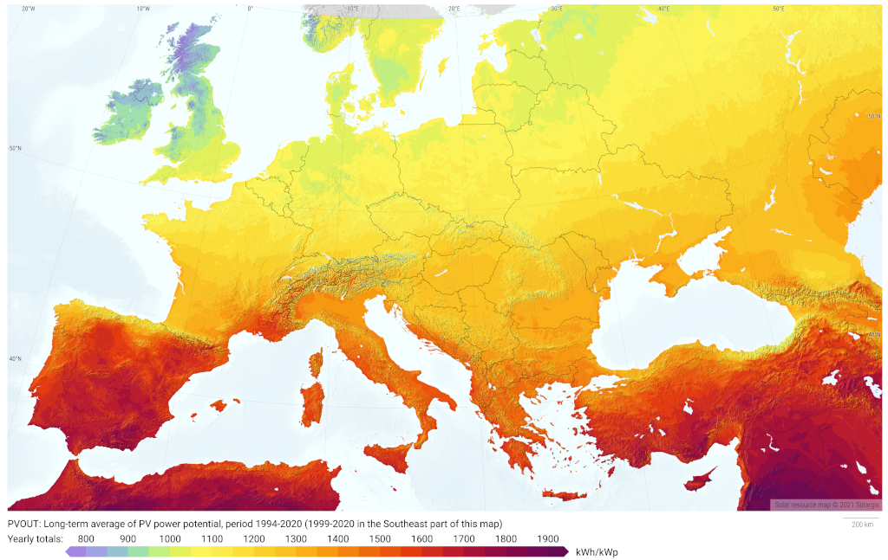

Zusammenfassung {#Zusammenfassung}
---------------

Mit einem sog. *Balkonkraftwerk* kann man sehr einfach und relativ günstig
Solarstrom gewinnen und über eine Steckdose direkt ins Hausnetz einspeisen.
Das spart Stromkosten und kann sich schon nach wenigen Jahren Betrieb rechnen,
allerdings nur soweit man den Strom auch gleichzeitig selbst verbraucht.
Weil diese Betriebsart den überschüssigen Strom an die Allgemeinheit weitergibt
und keine Batterie benötigt, ist sie für die ökologische Gesamtbilanz am besten.

Für eine gewisse Unabhängigkeit von der nicht ständig kräftig vorhandenen
Sonneneinstrahlung und vom allgemeinen Stromnetz
braucht man eine aufladbare Batterie als Stromspeicher und weitere Geräte,
was das Ganze aufwendiger und deutlich teurer macht. Damit lässt sich die
gewonnene Energie über den ganzen Tag und die Nacht verteilt einspeisen.
Eine sog. *Inselanlage* ist auch während Stromausfällen verwendbar,
soweit die Speicherkapazität und die Einstrahlung zum Nachladen reichen.

Abgrenzung {#Abgrenzung}
----------

Hier geht es nicht um *Solarthermie*, also die direkte Gewinnung von Wärme
durch Sonnenstrahlung, sondern um die Erzeugung von elektrischem Strom.
Es geht hier auch nicht um "große" PV-Anlagen z.B. auf Hausdächern
(dazu [hier ein fundierter Leitfaden](
https://solar.htw-berlin.de/wp-content/uploads/HTW-PV-Wegweiser.pdf)),
wobei die physikalischen und technischen Grundlagen natürlich die gleichen sind.

Außerdem kann ich als Privatperson und auch als naturwissenschaftlich-technisch
versierter Nichtprofi natürlich keine offiziellen Informationen bzw. absolut
verlässliche Hinweise geben und für die Inhalte keine Gewähr oder Haftung
übernehmen. Wer bezüglich steckerfertigen PV-Anlagen etwas Offizielleres sucht,
der sei z.B. auf den schönen [Leitfaden von SmartGridsBW](
https://smartgrids-bw.net/public/uploads/2020/04/IBZ-Leitfaden_Balkon-PV-Online.pdf)
und die ["Fachinformation" des DKE](https://www.dke.de/de/arbeitsfelder/energy/mini-pv-anlage-solar-strom-balkon-nachhaltig-erzeugen)
verwiesen.

Photovoltaik (PV) und ihr möglicher Energie-Ertrag {#Photovoltaik}
--------------------------------------------------

Mit Solarzellen kann man Sonnenlicht in elektrischen Strom umwandeln,
wenn auch leider nicht gerade effizient. Der
[Wirkungsgrad](https://de.wikipedia.org/wiki/Solarzelle#Wirkungsgrad)
der heutzutage üblichen Photovoltaik-Technologie mit Siliziumzellen
liegt typischerweise bei nur etwa 18 bis 20%, bei besonders hochwertigen
Modulen bis etwa 22%. Außerdem gibt es Verluste, wenn die Solarmodule
nicht senkrecht zur Einstrahlung ausgerichtet, (teil-)verschattet,
verschmutzt oder zu warm sind. Zu berücksichtigen ist zudem der
Wirkungsgrad der übrigen PV-Anlage von etwa 80 bis 95%.

### Sonnenstrahlung

[{:.right width="550"
style="margin-left: 30px; margin-right: 30px"}](
https://solargis.com/maps-and-gis-data/download/germany)
Die von Solarzellen abgegebene Leistung hängt ziemlich linear
von der Intensität der Sonnen-Einstrahlung ab.
Die maximale Einstrahlung
auf die Erde mittags bei klarem Himmel in Bodennähe auf eine Fläche
senkrecht zum Sonnenstand liegt bei 1361 W/m² und wird als
[*terrestrische Solarkonstante*](
http://www.energieinfo.de/eglossar/sonneneinstrahlung)
bezeichnet. Natürlich ist die tatsächliche Sonneneinstrahlung im
Durchschnitt viel geringer. Sie hängt stark vom Standort auf der Erde ab
und ist je nach Bewölkung, Tages- und Jahreszeit sehr variabel.\
Die nebenstehende
[Karte von Solargis](https://solargis.com/maps-and-gis-data/download)
gibt für Deutschland einen Überblick, welche Menge an Sonnenstrahlung
pro Quadratmeter horizontaler Fläche durchschnittlich im Jahr zusammenkommt.

### Maximalleistung von Solarmodulen

{:style="clear:both"}
Die **Nennleistung** von Solarmodulen wird in **Wp** ([*Watt Peak*](
https://de.wikipedia.org/wiki/Watt_Peak)) angegeben. Zu ihrer
Bestimmung verwendet man eine Referenzbestrahlung mit einem normierten
Sonnenlichtspektrum einer Stärke von 1000 W/m² bei Zelltemperatur 25°C.\
Bei näherer Betrachtung bedeutet die Nennleistung in kWp (also 1000 Wp)
die *effektive Solarfläche* des Moduls, also Fläche (in m²) ×
Wirkungsgrad.\
Daher lässt sich auch der **Wirkungsgrad** eines Solarmoduls sehr
einfach nachrechnen, indem man seine Nennleistung in kWp durch seine
Fläche in m² teilt.

Die Wp-Angaben von Herstellern und Händlern für Solarmodule sind mit
Vorsicht zu genießen --- hauptsächlich weil die tatsächliche Leistung
wie oben erwähnt stark von der Situation (Ausrichtung, Sonnenstand,
Bewölkung usw.) abhängig und meist deutlich geringer ist. Außerdem weil
besonders chinesische Händler von flexiblen Solarmodulen dazu tendieren,
bei den Leistungsangaben deutlich zu übertreiben. Daher lohnt sich als
Plausibiltäts-Check, den Wirkungsgrad nachzurechnen.

[{:.center}](
https://solargis.com/maps-and-gis-data/download/europe)
In unseren Breitengraden ist je nach Standort bei optimaler statischer
Ausrichtung der Solarmodule ein Jahres-Ertrag von 1100 kWh pro kWp installierter
PV-Nennleistung möglich. Manche Angaben dazu sind mit [etwa 900 bis 1000 kWh](
https://www.energie-experten.org/erneuerbare-energien/photovoltaik/planung/ertrag)
eher zu konservativ, andere übertreiben mit
[bis zu 1200 bis 1300kWh](https://gruenes.haus/photovoltaik-pv-ertrag/).\
Der Jahresertrag lässt sich leicht näherungsweise berechnen, und zwar
durch Multiplikation des standortspezifischen *PV-Potentials*
(welches bereits angenommene typische System-Verlustfaktoren
beinhaltet und auch *spezifischer Ertrag* genannt wird) in kWh/kWp
mit der PV-Nennleistung in kWp.\
Das PV-Potential (PVOUT) erhält man z.B. aus den groben
[Karten von Solargis](https://solargis.com/maps-and-gis-data/download),
aus dem [Global Solar Atlas der Weltbank](
https://globalsolaratlas.info/map?c=50.10,11.05,7&s=48.1807,11.604e)
(auch von Solargis) oder am Genauesten aus der [PVGIS-Datenbank der EU](
https://re.jrc.ec.europa.eu/pvg_tools/de/)
bei der Standard-Eingabe von 1 kWp für die installierte max. PV-Leistung.

### Optimale Ausrichtung von Solarmodulen

{:width="392" }
{:width="385" .right}
Den [besten Jahresertrag](
https://machdeinenstrom.de/optimaler-ertrag-mit-mini-solar-kraftwerken/)
bekommt man in süddeutschen Breitengraden bei Orientierung nach Süden
und mit ca. 38° Neigung (also Winkel relativ zur Waagerechten).
Genaueres kann man z.B. über
[PVGIS](https://re.jrc.ec.europa.eu/pvg_tools/de/) (oder einfacher über
[Solarserver](https://www.solarserver.de/pv-anlage-online-berechnen/))
standortspezifisch anhand von Geo- und Klimadaten berechnen/simulieren.
Allerdings kommt es auf ein paar Grad hin oder her nicht an.

{:.center}
Diese Grafik zeigt sehr schön die relative Änderung des Jahresertrages
einer PV-Anlage mit zunehmender Winkel-Abweichung von Süden (*Azimut*)
abhängig vom Neigungswinkel, wenn der optimale Neigungswinkel 35° beträgt.
Sie wurde von [bonotos](https://www.bonotos.com/) erzeugt,
basierend auf [Daten von Prof. Konrad Mertens](
https://www.fh-muenster.de/eti/downloads/personen/professoren/mertens/frei/2022_05_31_FH-MS_Nachhaltigkeitstag_Vortrag_Solarenergie_Kein_Dach_ohne_Solarstrom_PDF.pdf)
von der FH Münster.

Bei PV-Ertrags-Simulationen ist zu beachten, dass dabei üblicherweise
der Jahres-Gesamtertrag betrachtet und optimiert wird.
Dieser unterliegt der Annahme, dass man den zur jeweiligen Tageszeit
(und Jahreszeit) erzeugten Strom auch voll nutzen kann, sei es durch
Eigenverbrauch, Zwischenspeicherung (was allerdings auch Verluste bringt)
oder vergütete Einspeisung (die aber leider selten attraktiv ist).\
Wenn man --- wie mit den meisten Stecker-Solaranlagen --- den erzeugten Strom
nur direkt im Haushalt verbrauchen kann und der Rest ins externe Netz geht,
sollte man das Nutzungsprofil berücksichtigen, welches auch auch
[*Lastprofil*](https://www.energie-lexikon.info/lastprofil.html) genannt wird.

{:width="385" .right}
Bei einem durchschnittlichen Haushalts-Tages-Nutzungsprofil zeigt sich,
dass --- im Vergleich zu den bekannten Einbußen beim Jahres-Gesamtertrag ---
* Abweichungen von der allgemein optimalen Südorientierung
nur etwa halb so starke Einbußen bringen und
* bei senkrechter Anbringung im Verhältnis zur optimalen Neigung
die Einbuße etwa 15 Prozentpunkte geringer ausfällt.

Man hat also zur günstigen Ausrichtung seiner Solarmodule
meist größere Flexibilität als allgemein angenommen.\
Eine Aufteilung in zwei Orientierungen, z.B. nach Südosten und Südwesten,
um zu versuchen, auf die Vormittags- und Nachmittagssonne zu optimieren,
lohnt sich meist nicht, weil die Stahlungsintensität aus südlicher Richtung
einfach viel höher ist. Trotzdem dafür sprechen kann ein Verbrauchsprofil,
das stark auf die Morgen- und Abendstunden gespreizt ist. Dagegen spricht
aber oft die Tendenz zu stärkerer Verschattung durch den flacheren Sonnenstand.
Außerdem ist die geteilte Montage meist aufwendiger, und die beiden Richtungen
verlangen zur Optimierung eine getrennte [MPPT-Regelung](#Wechselrichter).
Bei einer Orientierung von z.B. 60° und -60° abweichend von Süden
ist eine Neigung von ca. 30° optimal.\
Wer aus irgendeinem Grund (meist wegen der Befestigung)
eine möglichst flache Neigung wählt, sollte trotzdem mindestens 12° verwenden,
um eine Selbstreinigung der Moduloberflächen durch Niederschlag zu ermöglichen.

Wenn man Solarmodule (z.B. auf dem Dach eines Wohnmobils) in
waagerechter Lage anbringt, ist man zwar von der Orientierung (Himmelsrichtung)
unabhängig, aber kommt nach meiner Erfahrung mit billigen flexiblen
Modulen selbst mittags an sehr sonnigen Tagen kaum über die Hälfte der
angegebenen Spitzenleistung hinaus.

Nutzungsmöglichkeiten {#Nutzung}
---------------------

Solarmodule liefern in direkter Abhängigkeit von der Einstrahlungsstärke
sehr variablen Gleichstrom (je nach Nennleistung maximal z.B. 11 A)
mit einer Spannung je nach Modultyp von üblicherweise 22 bis 44 V.
Dieser "rohe" Strom ist direkt erst mal kaum verwendbar,
außer z.B. zum Aufheizen eines Warmwasserspeichers mit einem [DC-Heizstab](
https://www.net4energy.com/de-de/energie/pv-heizstab#unterschiedliche).

Zum Thema *Stromspeicher* in verschiedensten Formen
und Nutzungsmöglichkeiten im Zusammenhang mit Photovoltaik
[hier ein ausführlicher Artikel](https://www.net4energy.com/de-de/stromspeicher).

### Direkte Netzeinspeisung (Stecker-Solaranlage, "Balkonkraftwerk") {#Balkonkraftwerk}

{:.left width="400"}
{:.right width="378"}

{:style="clear:both"}

Typischerweise speisen Solaranlagen den erzeugten Strom
nach Umwandlung durch einen netzgekoppelten Wechselrichter
([Solarwechselrichter](https://de.wikipedia.org/wiki/Solarwechselrichter),
engl. _grid-tie inverter_) direkt ins Hausnetz oder öffentliche Stromnetz ein,
wo er sofort in irgendeiner Form verbraucht wird (bzw. der Rest verlorengeht).

Wichtig zu beachten ist, dass diese Nutzungsart abseits eines bestehenden
Wechselstrom-Netzes und während eines Stromausfalls nicht funktioniert,
weil sich der verwendete Wechselrichter mit dem Stromnetz synchronisieren muss.

{:.right width="400"}
Wie schon der Name *Stecker-Solaranlage* ausdrückt, werden solche kleinen
Anlagen meist einfach über einen (Schuko-)Stecker mit dem Hausnetz verbunden,
z.B. an einer Außensteckdose auf dem Balkon oder der Terrasse. Das ist sehr
flexibel und ermöglicht, sehr einfach ein Energiemessgerät dazwischenzustecken,
wie es unten zur [Verbrauchsmessung](#Verbrauchsmessung) gezeigt ist.
Diese Lösung ist m.E. schon sicher genug,
weil der Wechselrichter die Stromzufuhr sofort unterbricht, wenn man den
Stecker aus der Dose zieht und seine blanken Kontakte berühren kann.\
Man kann, wie vom VDE empfohlen, aber auch eine spezielle *Energiesteckdose*
verwenden. Diese wird auch [*Einspeisesteckdose*](
https://www.solarenergie-info.de/wieland-einspeisesteckdose/) genannt
und ist meist von der Firma Wieland. Sie gilt als besonders sicher,
ist aber auch recht teuer und muss von einem Elektriker installiert werden.
[Hier](https://priwatt.de/blog/wieland-vs-schuko-stecker-was-eignet-sich-am-besten-fur-mein-balkonkraftwerk/)
ein ausführlicher Vergleich.
Eine weitere Möglichkeit ist, den Wechselrichter direkt fest mit dem Hausnetz
zu verdrahten, was den Betrieb sogar noch sicherer macht.

Die auch [*Balkonkraftwerk*](https://www.steckdosensolar.de/) genannten Anlagen
haben meist eine recht geringe PV-Nennleistung von etwa 600 bis 800 Wp.
Das hat neben der geringen Größe und sehr überschaubaren Kosten auch damit zu
tun, dass sie selbst installiert werden dürfen und genehmigungsfrei (jedoch
anmeldepflichtig) sind, wenn sie maximal 600 W in die Steckdose einspeisen.
Dies gilt für Deutschland und die Schweiz;
in Österreich gilt nach einer EU-Richtlinie eine Obergrenze von 800 W.

#### Beschränkung auf 600 W und ihre Gründe {#Kappung}

[{:.right width="450"}](
https://www.sonnenenergie.de/index.php?id=30&tx_ttnews[tt_news]=254)
Hintergrund dieser Beschränkung sind vornehmlich Sicherheitsbedenken:
Falls über die Wohnungs-Stromleitung, an der die Einspeisung
stattfindet, gleichzeitig sehr kräftig Strom verbraucht wird, kann es
unter sehr ungünstigen Umständen passieren, dass auf Teilen der Leitung mehr
Strom fließt als die Sicherung eigentlich erlauben würde, was dann zu
einer mehr oder weniger starken Erwärmung der Leitung führen kann.
Und zwar müsste bei einer 16 A-Sicherung einerseits mehr als 16 A,
andererseits aber weniger als die Summe aus 16 A und dem gerade eingespeisten
Strom (z.B. 16 A + 5 A = 21 A) fließen.
was allerdings insgesamt in der Praxis höchst unwahrscheinlich ist.
Von der ESTI (Schweiz) wird aus diesem Grund
die Leitungsüberlastung durch Stecker-Solaranlagen
[nicht normativ betrachtet](https://www.pvplug.de/positionspapier/).

Ein weiterer Grund für die Beschränkung könnte die Möglichkeit schlecht
kalkulierbarer Rückwirkungen auf die Stabilität des allgemeinen Stromnetzes
bei massenhafter Einspeisung und kräftigem stark schwankendem Sonnenschein sein.
Wenn jedoch durch sog.
[*Nulleinspeisung*](https://www.energie-experten.org/erneuerbare-energien/photovoltaik/eigenverbrauch/nulleinspeisung)
sichergestellt ist, dass kein überflüssiger Strom ins externe Netz fließt,
können Steckdosen-Anlagen [auch z.B. mit 1800 W Leistung](
https://www.pv-magazine.de/2022/07/04/indielux-startet-crowdfunding-fuer-serienproduktion-seines-einspeisewaechters-fuer-stecker-solar-geraete/)
normgerecht betrieben werden.

Man kann vermuten, dass die Beschränkung auch nichttechnische Gründe hat,
etwa dass die Energieversorgungsunternehmen möglichst wenig Konkurrenz wollen.

#### Kappungsverlust durch Beschränkung auf 600 W {#Kappungsverlust}

Die nominelle Leistung der verwendeten Solarmodule kann und sollte durchaus
größer sein aus 600 Wp (z.B. 800 bis 1000 Wp), denn in der Praxis werden die
600 W PV-Ausgangsleistung kaum erreicht, vor Allem in sonnenarmen Zeiten.
Man hat durch einen gewisse "Überdimensionierung" auch bei Verlusten im Bereich
der Module und zu ungünstigen Tages- und Jahreszeiten entsprechend mehr Ausbeute
(eigentlich sogar überproportional mehr, weil die Schwellspannung
schneller erreicht wird), allerdings auf recht niedrigem absoluten Niveau.

Leider realisieren die gängigen Mini-Wechselrichter eine Leistungsbegrenzung
auf 600 W nicht auf ihrer Ausgangsseite, sondern schon auf ihrer Eingangsseite,
und das auch noch aufgeteilt pro Eingang, so dass sie nach Abzug ihrer Verluste
von ca. 12% stets weniger als 530 W liefern.
Obwohl der Netto-Ertrag durch diese Form der Abregelung also sogar unnötig stark
verringert wird, ist der Effekt auf den nutzbaren Ertrag längst nicht so groß,
wie man meinen könnte.

Beispielsweise bei 1000 Wp Modulen, die je nach Standort und Ausrichtung
zu einem Ertrag von etwa 1215 kWh brutto pro Jahr führen können,
also bei einem Wechselrichter-Wirkungsgrad von 88% etwa 1070 kWh Netto-Ertrag,
macht der effektive Verlust durch eine Begrenzung auf 600 W Eingangsleistung
des Wechselrichters gerade mal 15 kWh aus. Dies erklärt sich durch zwei Effekte:
* Die Abregelung findet zwar während etwa 800 Sonnenstunden im Jahr statt, aber
die Differenz auf den sonst möglichen Netto-Ertrag ist moderat: etwa 110 kWh.
* Nur während (in Summe) ca. 120 Stunden wird zeitgleich zu dieser Abregelung
typischerweise überhaupt so viel Strom verbraucht, dass sich die Kappung beim
Eigenverbrauch bemerkbar macht, und die Menge dieses Verbrauchs, bei dem die
Leistung also bei mehr als 530 W liegt, ist typischerweise ziemlich gering.

Hingegen bieten 1000 statt 600 Wp PV-Nennleistung bei mäßigen Zusatzkosten eine
sinnvolle Reserve für schwächere Sonnenstunden, wodurch der Netto-Ertrag (trotz
Kappung) um etwa 315 kWh steigt, der Eigenverbrauch um etwa 130 kWh im Jahr.
Die Amortisationszeit der Gesamt-Anlage bleibt dabei ziemlich gleich, und auf
lange Sicht ergibt sich eine entsprechend höhere Kostenersparnis als mit 600 Wp.

#### Stromzähler und Rücklaufsperre {#Stromzähler}

Für den selbst erzeugten und gleichzeitig verbrauchten Strom spart man sich
die Verbrauchskosten, weil der *Stromzähler* nur die Differenz berücksichtigt
und entsprechend langsamer läuft.
Es wird also nur der vom Stromanbieter bezogene Anteil des Verbrauchs berechnet.

Übrigens ist es normalerweise egal, auf welcher Drehstrom-Phase (L1, L2 oder L3)
die Stecker-Solaranlage angeschlossen wird und auf welcher Phase
die gleichzeitig verwendeten Verbraucher angeschlossen sind ---
die Stromzähler arbeiten *phasensaldierend*, d.h. sie bilden die Gesamtsumme
von Verbrauch und Erzeugung, welche dabei negatives Vorzeichen hat.

{:.left width="400"}
{:.right width="370"}
Von gewonnenen Strom fließt der Anteil, der nicht aktuell im Haushalt
verbraucht (oder gespeichert) wird, automatisch ins allgemeine Stromnetz.
Moderne Stromzähler haben eine *Rücklaufsperre*, was man an dem entsprechenden
Symbol auf dem Gehäuse erkennen kann. Das führt dazu, dass der überflüssige
Strom praktisch ins externe Netz verschenkt wird.
Die klassischen *Ferrariszähler* mit mechanischer Drehscheibe
laufen dagegen rückwärts, wenn mehr Strom erzeugt als verbraucht wird.
Damit kann man "unter der Hand Strom verkaufen", was aber nicht erlaubt ist.

Ein *Zweirichtungszähler* kann die Menge des eingespeisten Stroms unabhängig
vom Verbrauch messen, was die Möglichkeit der Vergütung eröffnet.
Eine offiziell angemeldete und vergütete Einspeisung ist mit einiger Bürokratie
verbunden und bringt wenig --- die Vergütung sank in Deutschland gemäß eEG
[bis 2022 auf ca. 6 ct/kWh](
https://www.zolar.de/blog/entwicklung-der-eeg-einspeiseverguetung)
und steigt [ab 2023 auf etwa 8 ct/kWh](
https://www.aroundhome.de/solaranlage/einspeiseverguetung/),
--- immer noch sehr mager, besonders im Vergleich zum Verbrauchspreis.

### Stromverbrauch im Haushalt {#Stromverbrauch}

Eigentlich ist es im Vergleich zum Betrieb einer (möglicherweise
recht groß dimensionierten) Solaranlage immer noch günstiger und
umweltfreundlicher, von vornherein den Stromverbrauch zu senken.
Stromfressende Geräte sollte man möglichst meiden und Geräte, die einen
hohen Standby-Verbrauch haben, bei längerem Nichtgebrauch ausschalten.
Man kann damit in einem 3-Personen-Haushalt auf unter 1500 kWh im Jahr kommen.

Je stromhungriger ein Haushalt tagsüber ist, desto größer der zu erwartende
Einsparungseffekt durch eine Steckdosen-Anlage ohne Stromspeicher.
Denn diese Nutzungsart lohnt sich also nur insoweit, wie man während der
Sonnenscheindauer den erzeugten Strom direkt sinnvoll verbrauchen kann.
Am einfachsten und am besten planbar geschieht das über die sog. *Grundlast*,
also ständig und mehr oder weniger gleichmäßig laufende Verbraucher
wie Kühlschränke, Internetanschluss, Computerserver
und Geräte, die im Bereitschaftsmodus (engl. _standby_) sind.
Darüber hinaus kann man gezielt diverse Haushaltsgeräte und Ladegeräte
vorzugsweise dann betreiben, wenn hohe Sonneneinstrahlung vorhanden ist.
Dazu bieten sich insbesondere Waschmaschinen und das Laden von Batterien an,
wobei die Akkus von E-Bikes oder E-Rollern von der Größenordnung
und ihrem zeitlichen Nutzungsprofil besonders geeignet sind.

Eine ziemlich clevere Nutzung von überschüssigem Strom finde ich die verstärkte
Nutzung einer Wärmepumpe oder das zusätzliche Aufheizen des Warmwasserbehälters
über einen [Heizstab](https://www.net4energy.com/de-de/energie/pv-heizstab),
so dass man weniger fossile Brennstoffe verbraucht.

#### Verbrauchsmessung {#Verbrauchsmessung}

{:.right width="300"
style="margin-left: 70px; margin-right: 70px"}
Den Stromverbrauch von Elektrogeräten im Haushalt kann man recht einfach
mit Energiekosten-Messgeräten in Steckdosenform bestimmen. Diese messen
nicht nur den momentanen Stromverbrauch in Watt, sondern bei längerer
Verwendung auch die über die Zeit verbrauchte Strommenge in kWh.

Die Grundlast eines Haushalts kann man über den Haushalts-Stromzähler
noch einfacher bestimmen, indem man die Differenz der Zählerstände
über einen Zeitraum von mehreren Stunden, zu dem sonst keine Verbraucher
eingeschaltet sind (z.B. nachts), durch die Zahl der Stunden teilt.

Eine schöne Übersicht von Geräten zur Messung auch der eingespeisten Strommenge
z.B. [hier](https://greenergains.de/balkonkraftwerk-einspeisung-messen/).

### Ertragsberechnung {#Ertragsberechnung}

Wie eingangs geschrieben kann man bei optimaler Platzierung von Solarmodulen
pro Jahr etwa 1,1 kWh Strommenge pro Wp installierter Solarleistung gewinnen.
Rechnet man beispielsweise mit einer Investition von 1,10€/Wp
(inklusive anteiliger Kosten für Wechselrichter, Installation etc.),
ergeben sich Kosten von 1€/kWh erzeugtem Solarstrom pro Jahr.

* Falls der damit erzeugte Strom komplett selbst verbraucht wird,
was aber praktisch kaum der Fall ist,
und man einen dadurch eingesparten Arbeitspreis von 40 ct/kWh ansetzt,
ergibt sich eine Amortisation der Anschaffungskosten in nur 2,5 Jahren.
* Eine typische Balkonanlage mit 600 Wp Nennleistung erreicht einen
Jahres-Bruttoertrag von etwa 730 kWh, was bei 88% System-Wirkungsgrad
ca. 640 kWh hinter dem Wechselrichter Einspeisung an der Steckdose bedeutet.
Bei einem durchschnittlichen Haushalts-Tages-Nutzungsprofil und einem typischen
Jahresverbrauch von 3000 kWh liegt der selbst genutzte Ertrag bei etwa 450 kWh.
Der Eigendeckungsanteil liegt damit bei 15% des Verbrauchs,
der Eigenverbrauchsanteil bei 70% des Ertrags.
Bei einer Investition von 660€ und 40 Ct/kWh ergibt sich (ohne Berücksichtigung
von Kapitalkosten u.ä.) eine Amortisationszeit von 3,7 Jahren.\
Bei 1500 kWh Jahresverbrauch können immerhin etwa 320 kWh selbst genutzt werden,
was eine Amortisation in gut 5 Jahren ergibt.

Für die Amortisation des energetischen Aufwands
zur Herstellung einer Mini-PV-Anlage muss man nach [Angaben des DKE](
https://www.dke.de/de/arbeitsfelder/energy/mini-pv-anlage-solar-strom-balkon-nachhaltig-erzeugen)
allerdings noch 2-3 Jahre länger rechnen.
In die Gesamt-Ökobilanz einer PV-Anlage und ihrer Nutzung gehen natürlich
noch weitere Effekte ein, die sich aber kaum quantifizieren lassen.

#### Monatsbasierte Berechnung von Ertrag und Amortisation {#PV-Rechner}

[{:.center}](PV-Rechner_v6+.xls)
Beispielsweise mit
dem [PV-Rechner](PV-Rechner_v6+.xls) (der eigentlich für "große"
PV-Anlagen auf Hausdächern konzipiert ist) kann man die Rechnung
deutlich genauer machen. Er berücksichtigt u.A. die Ausrichtung der
Solarmodule, die jährliche Abschreibung, Reparatur- und Kapitalkosten,
den Anteil des während der Sonnenscheindauer im Haushalt nutzbaren
Ertrages, sowie optional Effekte durch das Laden eines E-Fahrzeugs (was
normalerweise öfter zu Sonnenscheinzeiten erfolgen kann), den Betrieb
einer Wärmepumpe und die Nutzung eines Stromspeichers. Dabei werden die
Energieflüsse der Einfachheit halber nur auf Monatsbasis gerechnet, so dass
selbst tageszeitliche Effekte nur näherungsweise berücksichtigt werden können.

Bei der o.g. typischen Balkonanlage für 660€ mit 600 Wp und 660 kWh Jahresertrag
ergibt sich mit dem PV-Rechner für einen Haushalt mit 3000 kWh Jahresverbrauch,
der zu 28% während der Haupt-Sonnenscheinzeiten erfolgt,
ein etwas zu optimistischer Solarstrom-Eigenverbrauch von etwa 530 kWh pro Jahr.
Damit könnte man bei 40 Ct/kWh jährlich ca. 205€ Stromkosten einsparen, was eine
Amortisationszeit von 3,2 Jahren und eine satte (Anfangs-)Rendite von 26% ergäbe.

Hinweis: Der PV-Rechner stammt von [Falko (bonotos)](https://www.bonotos.com/)
Der originale beinhaltet auch seiner letzten Version 22-06 einen groben Fehler
in der Rendite-Formel, der zu (fast) doppelt überhöhten Rendite-Zahlen führt.
Ich habe mich mit Falko zu diesen und anderen Punkten ausgetauscht.
Er möchte an dem Tool nichts mehr machen.
So stelle ich hier eine verbesserte und etwas erweiterte Version zur Verfügung.

#### Speichersimulation {#Speichersimulation}

[{:.center}](
https://brodsoft.de/stromverlauf/profiles/simulation)
Eine genauere Simulation des Eigenverbrauchs für einen gegebenen PV-Nettoertrag,
ohne oder mit Stromspeicher (mit Angabe von genutzter Kapazität und Wirkungsgrad),
gibt es von [brodsoft](https://brodsoft.de/stromverlauf/profiles/simulation).
Diese basiert auf realen Profildaten für PV-Erzeugung und Stromverbrauch,
mit denen die Berechnung immerhin auf Stundenbasis erfolgt.
Man kann sich in der Ausgabe auch für jeden Monat Grafiken ausgeben lassen,
auf denen man sich sehr schön den Verlauf der elektrischen Größen ansehen kann.
Außerdem gibt es gute Info-Seite mit guten Erklärungen zu Eigenverbrauchsanteil
und Eigendeckungsanteil zu Strategien zu ihrer Optimierung.
Diese Simulation berechnet für die o.g. 600 Wp Beispiel-Anlage je nach Auswahl
des Profils einen Eigenverbrauch von teils 601 kWh (Profil "allgemein 13/14")
und mehr, aber typischerweise eher 514 kWh (Profil "InGe 16") pro Jahr.

#### Simulation auf Minutenbasis {#Minutenbasis}

Eine eigene Simulation auf Minutenbasis
basierend auf den PV-Profildaten für ein [*typisches meteorologisches Jahr*](
https://help.valentin-software.com/pvsol/de/berechnungsgrundlagen/einstrahlung/klimadaten/)
von [PVGIS](https://re.jrc.ec.europa.eu/pvg_tools/de/)
und auf einem Mix der 74 minütlichen Haushaltsverbrauchs-Profile,
die von der Forschungsgruppe Solarspeichersysteme HTW Berlin [veröffentlicht](
https://solar.htw-berlin.de/elektrische-lastprofile-fuer-wohngebaeude/)
wurden, kommt auf realistischere Ergebnisse.
Mit einem [Lastprofil-Skript](Lastprofil.pl) können aus den genannten Rohdaten
Lastprofil-Dateien wie [diese](Lastprofil_4673_kWh.csv) synthetisiert werden.
So eine Datei wird dann zusammen mit von PVGIS heruntergeladenen Solardaten
wie [diesen](Solardaten_1215_kWh.csv) als Eingabe für ein
[Solarertrag-Skript](Solarertrag.pl) verwendet. Weitere Parameter sind die
Nennleistung und der Wirkungsgrad der Anlage sowie der Jahresverbrauch
und optional eine Limitierung des PV-Eingangs durch den Wechselrichter.

Mit dieser Simulation ergibt sich bei der o.g. Beispiel-Anlage
für den Raum München einen PV-Nettoertrag (nach Wechselrichter-Verlusten)
von etwa 640 kWh und eine Eigennutzung von etwa 450 kWh.
Damit kann man bei 40 Ct/kWh jährlich ca. 180€ Stromkosten einsparen,
was eine Amortisationszeit von 3,7 Jahren ergibt.

Das Ergebnis fällt nicht ganz so günstig wie bei den anderen beiden Simulationen
aus, v.A. weil hier die in der Praxis relativ häufigen Lastspitzen im
Minutenbereich berücksichtigt werden, die von einer Mini-Solaranlage natürlich
nicht abgefangen werden können, so dass der Eigenverbrauchsanteil geringer ist
als bei einer über Stunden oder gar Monate gemittelten Betrachtung.

### Hausnetzeinspeisung mit Batteriepuffer {#Batteriepuffer}

[{:.right width="350"}](
https://www.youtube.com/watch?v=f-iz6WE8GD8)
Statt den Solarstrom direkt einzuspeisen, kann man in auch in einer aufladbaren
Batterie zwischenspeichern und von dort nach Bedarf zeitlich versetzt über einen
[netzgekoppelten Wechselrichter](#Netzwechselrichter) ins Hausnetz einspeisen.
Diese Betriebsart kann man allgemein als *Strompufferung* bezeichnen.
Sie maximiert den Nutzen der PV-Anlage für den eigenen Stromverbrauch,
lohnt sich finanziell aber nur, wenn man die Batterie schon aus anderen Gründen
hat, z.B. für eine Notstromversorgung oder als Fahrzeugbatterie.
Außerdem ist es für die ökologische Gesamtbilanz eigentlich besser, den
überschüssigen Strom an die Allgemeinheit (auch ohne Vergütung) abzugeben.

#### Speicherbatterie

Zu berücksichtigen ist, dass die Zwischenspeicherung des Stroms je nach Art der
[Batterie](#Speicher) Verluste von etwa 5 bis 20% mit sich bringt -- bei LiFePO4
unter 10%. Auch kann man nicht die volle Nennkapazität entnehmen,
ohne dass die Akkuzellen stark leiden (d.h. schnell an Kapazität verlieren).
Bei LiFePO4 sind immerhin 90% Entladetiefe problemlos möglich.

Als Faustformel für die Dimensionierung [empfiehlt die Verbraucherzentrale NRW](
https://www.verbraucherzentrale.nrw/wissen/energie/lohnen-sich-batteriespeicher-fuer-photovoltaikanlagen-24589)
etwa 1 kWh pro 1000 kWh Jahresstromverbrauch, also gut 1/3 des Tagesverbrauchs.
Wer mit der Speicherbatterie zusätzlich eine Notstromversorgung über eine
[Inselanlage](#Inselanlage) realisieren möchte, wird die Kapazität je nach
Anwendungsszenario eher größer wählen.

#### Batterieladung

Das Laden der Batterie erfolgt am besten möglichst direkt aus der PV-Anlage
über einen [Solar-Laderegler](#Laderegler). Dies nennt man [*DC-Kopplung*](
https://www.photovoltaikforum.com/core/article/7-pv-und-batteriespeicher-besser-ac-oder-dc-gekoppelt/),
weil der Gleichstrom der PV-Module nicht umständlich und verlustreich
zwischendurch in Wechselstrom hin- und her-gewandelt wird.
Ein weiterer Vorteil ist (mit einem Inselwechselrichter) die Notstromfähigkeit.
Hingegen ist der einzige Vorteil der *AC-Kopplung* übers Haus-Wechselstromnetz
und ein 230 V-Ladegerät eine große Flexibilität bei der Wahl der Komponenten,
auch bzgl. eines späteren Ausbaus und der Betriebsspannung der Komponenten.

#### Einspeisung aus der Batterie

Für die Einspeisung aus der Batterie bietet sich ein [regelbarer
Netzwechselrichter](https://de.aliexpress.com/item/1005001445871590.html)
an wie in [diesem genialen Video von
Dimitri](https://www.youtube.com/watch?v=f-iz6WE8GD8).
Wenn man aber schon einen Solar-Wechselrichter hat und diesen verwenden
möchte, könnte es im einfachsten Fall genügen, ihn direkt mit der
Batterie zu verbinden und über einen Schalter manuell zu
steuern --- allerdings nur, wenn die Batteriespannung (z.B. 24 V) höher
ist als die minimale Eingangsspannung des Wechselrichters und dieser mit
seiner vollen Leistung betrieben werden kann
(z.B. mit einem auf 300 W begrenzten PV-Modul-Eingang).\
Um die Stromstärke regelbar zu drosseln, kann man ein
Labornetzteil verwenden, evtl. mit DC-DC-Wandler wie das [Joy-IT DPM8624](
https://www.idealo.de/preisvergleich/OffersOfProduct/202115817)
aus dem [Video von Andreas Schmitz](
https://www.youtube.com/watch?v=yOcoux9IbzM) oder einen günstigen
[Gleichspannungswandler](#Gleichspannungswandler) mit regelbarer Strombegrenzung.

Wenn man zudem bereits eine Powerstation hat, kann man zwischen ihren
Wechselstrom-Ausgang und den Netzwechselrichter ein regelbares Netzteil hängen,
siehe [sein Nachfolge-Video](https://www.youtube.com/watch?v=ZXHAXrJS9CU), was
allerdings zu unnötigen Verlusten durch Hin- und Her-Wandlung des Stroms führt.

Im Sinne der Stromkosten-Optimierung wäre es schön, wenn die Einspeisung
der gespeicherten Energie automatisch so stark erfolgt, wie sie jeweils gerade
benötigt wird, aber das wäre reglungstechnisch eine ziemliche Herausforderung.
Viel einfachster und für die meisten Anwendungsfälle ausreichend ist aber,
die (gedrosselte) Ausgangsleistung des Wechselrichters und die Batteriekapazität
so abzustimmen, dass lediglich die Grundlast (bzw. ein Großteil davon)
des Haushalts, z.B. 50 bis 100 W, für eine Dauer von 1-2 Tagen abgedeckt wird.
Das kann man bei Bedarf auch mit einer Zeitschaltuhr kombinieren.
Diese Betriebsart wird auch *Nachteinspeisung* genannt.

[{:.right width="400"}](
https://www.youtube.com/watch?v=N6NqMXQHP2I)
Auf jeden Fall muss für die Situation, dass die Batterieladung zur Neige geht
(bei LiFePO4 spätestens bei 90% Entladung) eine automatische Abschaltung
vorhanden sein, damit die Batterie nicht durch Tiefentladung geschädigt wird.
Falls man für den Notfall stets eine gewisse Strommenge zur Verfügung halten
möchte, sollte die Abschaltung schon entsprechend früher erfolgen.\
Wenn der Solar-Laderegler einen Lastausgang mit einstellbarer Schutzabschaltung
hat, wie z.B. beim Victron BlueSolar, kann man diesen so verwenden, wie in
[diesem schönen Video von PV&E](https://www.youtube.com/watch?v=N6NqMXQHP2I)
gezeigt. Zudem kann dessen Straßenlichtfunktion für die zeitliche Steuerung
genutzt werden.\
Ansonsten kann man zur Regelung einen recht simplen
[programmierbaren Batteriespannungswächter](#Spannungswächter) verwenden, wie im
[Video von Dimitri](https://www.youtube.com/watch?v=f-iz6WE8GD8) vorgeführt.
Er wird so eingestellt, dass bei es beim Erreichen einer Batteriespannung, die
z.B. annähernd einer Vollladung entspricht, den Wechselrichter einschaltet und
z.B. in der Nähe der Batterie-Entladeschlussspannung diesen wieder ausschaltet.
Damit wird die über die sonnenreiche Tageszeit gesammelte Solarenergie
auch über sonnenarme Zeiten (solange die Ladung reicht, typischerweise
bis zum nächsten Vormittag) gleichmäßig abgegeben,
mehr oder weniger ohne Strom nach extern zu verschenken.

{:.right width="400"
style="margin-left: 50px; margin-right: 50px"}
Hier als Analogie eine Skizze eines automatischen Wasserspeichers,
der z.B. über die Dachrinne eines Hauses gespeist wird. Wenn er voll genug ist,
läuft das Wasser über die rechte innere Begrenzung und lässt die Kugel
aufschwimmen, die bis dahin den Auslass blockiert hat. Dann fließt das
Wasser aus dem Speicher langsam und gleichmäßig nach unten aus. Wenn der
Speicher fast leer ist, verschließt die Kugel den Auslass wieder. Der
Speicher füllt sich (auch schon zwischendurch) bei Wasserzufuhr wieder
auf. Zusätzlich ist der Speicher am Einlass mit einem Überlaufschutz
ausgestattet, der die Wasserzufuhr stoppt, wenn der Speicher sehr voll
ist und das Wasser durch den kleinen Auslass nicht schnell genug
abfließt.

Diese einfache Regelung hat allerdings verschiedene Schwächen,
vor Allem dass damit nur die Grundlast effizient abdeckbar ist.
Außerdem geht Sonnenenergie verloren, wenn die Batterie voll ist,
z.B. an sonnenreichen Tagen am Nachmittag, wenn die Solarleistung relativ groß
ist im Vergleich zur Batteriekapazität bzw. dem Verbrauch durch die Grundlast.
Mit einer Zusatzschaltung könnte man dafür sorgen, dass in dieser Zeit der
Solarstrom direkt über einen Netzwechselrichter (idealerweise über den bereits
vorhandenen) eingespeist wird.
Das Umschaltsignal für den Überlaufmodus sollte wohl am besten vom Laderegler
kommen (z.B. optisch über die Ladekontrollleuchte). Es kann aber auch von der
Batteriespannung abhängig gemacht werden, wobei es dann auch vorkommen wird,
dass Laderegler und Wechselrichter gleichzeitig aktiv sind. Ob das eher stört
oder sogar vorteilhaft wäre, dürfte von den verwendeten Geräten abhängig sein.

### Inselanlage (mit Batteriespeicherung) {#Inselanlage}

{:.right width="400"}
Alternativ zur
Einspeisung ins Hausnetz kann man den von den Solarmodulen gelieferten
Strom auch in einer Batterie speichern und bei Bedarf darüber Geräte
unabhängig vom Hausnetz mit Strom versorgen. Diese Betriebsart wird als
[*Inselanlage*](http://www.inselanlage.info/) (engl. _off-grid_)
bezeichnet und ist für die Nutzung ohne externes Stromnetz (also z.B.
bei Stromausfall, beim Campen mit dem Wohnmobil oder Wohnwagen, auf
Booten und für abseits gelegene Häuser oder Hütten) die einzig mögliche.
Als Notstromversorgung bei Stromausfall sind Batterien allerdings nur bedingt
geeignet, weil sie bei einem längeren Stromausfall (engl. _blackout_) zu wenig
Kapazität haben (es seid denn, es scheint dann genug Sonne zum Nachladen), aber
bei kürzeren Stromausfällen (engl. _brownout_) können sie sehr hilfreich sein.

Neben der Speicherbatterie wird hier zumindest ein
[Solar-Laderegler](#Laderegler) benötigt, und sofern die Verbraucher
nicht direkt mit der Batteriespannung (z.B. 12 V oder 24 V Gleichstrom)
betrieben werden können, zusätzlich ein ausreichend leistungsstarker
[Inselwechselrichter](#Inselwechselrichter) zur Umwandlung
in den üblichen "Steckdosenstrom" (also Wechselstrom mit 230 V).\
An diesen Wechselrichter muss man bei Stromausfall alle
dann zu verwendenden Geräte (meist über eine Mehrfachsteckdose) anschließen.
Man speist dann also nicht einfach ins stromlose Hausnetz ein,
weil dazu die von außen kommende Stromleitung umgeschaltet werden und für eine
geeignete Erdung gesorgt werden müsste, was nur ein Elektriker machen kann/darf.

Ähnlich wie die o.g. [Batteriepufferung](#Batteriepuffer) ist diese Nutzungsart
flexibler aber wegen der nötigen zusätzlichen Komponenten (v.A. der Batterie)
auch deutlich teurer und auch etwas anfälliger und wartungsintensiver
als die [direkte Netzeinspeisung](#Balkonkraftwerk).
Wirtschaftlich rentabel für die Nutzung zu Hause kann das bei den
derzeitigen Preisen nur sein, wenn man eine geeignete Batterie schon aus
anderen Gründen (z.B. für den mobilen Einsatz in einem Fahrzeug) hat und
die zusätzliche Nutzungsart auch zeitlich alternativ dazu möglich ist.

### Kombination aus Hausnetzeinspeisung und Inselanlage {#Kombination}

Wenn man Zugang zum Stromnetz hat und die für die betreffenden Varianten nötigen
Funktionen gleichzeitig installiert sind, kann man zwischen Netz-, Puffer- und
Inselbetrieb auch bedarfsweise wechseln. Dabei wird der Ausgang
der Solarmodule zwischen dem netzgekoppelten Wechselrichter und dem
Solar-Laderegler umgeschaltet (oder ohne Schalter einfach umgestöpselt) bzw.
am Ausgang der Batterie zwischen Netz- und Insel-Wechselrichter umgeschaltet.

Hinweise für die Auswahl und Nutzung von Komponenten {#Komponenten}
--------------------------------------------------------------

### Solarmodule {#Solarmodule}

Solarmodule (engl. _solar panels_) werden intern aus vielen in Reihe
geschalteten Solarzellen zusammengesetzt, die Sonnenlicht in Gleichstrom
umwandeln.

{:.right width="550"}
Bei den üblichen Silizium-Solarzellen steigt der entnehmbare Strom
(Kurzschlussstrom) linear mit der Bestrahlungsstärke. Ihre
Leerlaufspannung hingegen steigt schon bei geringer Helligkeit stark an
und nähert sich dann nur noch langsam steigend dem Wert 0,63 V.

Generell sind *monokristalline* Zellen zu bevorzugen, auch wenn sie ein wenig
teurer sind als *polykristalline* oder *amorphe*, weil sie einen höheren
Wirkungsgrad haben.

{:.center}
Leider bricht die
Leistung von in Reihe geschalteten Zellen ein, sobald auch nur eine
davon verschattet ist. Daher werden in den üblichen größeren Modulen
sog. *Bypass-Dioden* eingesetzt, die bei Teilverschattung immerhin einen
Teil der Leistung fließen lassen.

{:width="392"}
{:.right width="392"}
[Klassische Solarmodule](https://gruenes.haus/pv-modul-groesse-gewicht/)
haben einen
Aluminiumrahmen und eine Größe von typischerweise ca. 1,7 m × 1 m × 3
cm, was eine Nennleistung von etwa 350 Wp ergibt, und eine Masse von ca.
20 kg. (Semi-)Flexible Module sind teurer als starre und weniger
langlebig, dafür aber viel leichter und nur wenige Millimeter dick. Sie
sind meist auch deutlich kleiner --- typischerweise 1,2 m × 0,5 m bei
einer Nennleistung von 100 Wp und einer Masse von 1 bis 2 kg.
[Hier](https://solar-generatoren.de/die-richtigen-solarmodule-fuers-wohnmobil/)
ein Vergleich verschiedener Solarmodul-Typen in Hinblick auf die
Verwendung für Wohnmobile.

{:width="392"}
{:.right width="392"}
Technisch besonders interessant finde ich die überlappende Anordnung und direkte
Verschaltung von Solarzellen ohne Stromschienen (engl. _busbars_) in
[*Schindel-Modulen*](https://www.strom-forschung.de/aktuelles/news/2022/schindel-solarmodule-innovativ-verschaltet-und-industriell-herstellbar)
(engl. _SSP_ = _shingle solar panel_). Dadurch steigt der Wirkungsgrad, weil
die Fläche besser genutzt wird und bei Teilverschattung und Wärme die
Verluste verringert werden. Allerdings ist diese Bauart selten zu finden
und verhältnismäßig teuer, so dass sie nur dann sinnvoll ist, wenn man
Platz sparen will/muss.

#### Anschluss von Solarmodulen

Solarmodule haben als Stromanschluss meist die praktischen MC4-Steckverbinder.
Generell sollten die Solarkabel, also die Verbindungen der Module
(untereinander und zum [Solar-Regler](#Wechselrichter)),
möglichst kurz sein, weil da relativ hohe Ströme fließen,
was proportional zur Länge zu spürbaren Verlusten führt.
Aus dem selben Grund sollte der Querschnitt nicht zu klein sein --- mind. 4mm²,
bei längeren Kabeln und höheren Strömen mind. 6mm² (was allerdings teurer ist).

Solarmodule --- aber bitte nur gleichartige --- kann man wie Batteriezellen
seriell und/oder parallel verbinden, um mehr Leistung zu erhalten, ohne
für jedes Modul einen eigenen Regler (bzw. Regler-Eingang) verwenden zu müssen.
Wenige große Solarmodule sind technisch und wirtschaftlich etwas günstiger als
entsprechend viele kleine, besonders wenn man einen Regler pro Modul verwendet.

-   Bei [*Reihenschaltung*](https://de.wikipedia.org/wiki/Reihenschaltung) (oft
    auch *Serienschaltung* genannt) hängt man die Module einfach hintereinander.
    Dabei addieren sich die Spannungen der einzelnen Module,
    wobei man unbedingt darauf achten muss, dass die maximale Eingangsspannung,
    die der genutzte Regler-Eingang verkraftet, nicht überschritten wird.
    Der wesentliche Vorteil gegenüber der Parallelschaltung ist, dass
    der Strom in den Kabeln und der damit verbundene Verlust nicht steigt.
    Ein Nachteil der Reihenschaltung ist,
    dass es dabei viel leichter zu [Verlusten durch Teilverschattung](
    https://photovoltaikbuero.de/pv-know-how-blog/teilverschattung-bei-solarmodulen-messungen/)
    kommt, weil die Gesamtleistung einbricht, sobald auch nur eines der Module
    verschattet wird.
    Man sollte aus diesem Grund nur Module in Reihe schalten, die
    die gleiche Ausrichtung haben und relativ gleich(zeitig) verschattet werden.

-   Bei [*Parallelschaltung*](https://de.wikipedia.org/wiki/Parallelschaltung)
    addieren sich die Ströme der einzelnen Module. Dabei sollte der je nach
    Einstrahlung mögliche Maximalstrom unter dem Maximalstrom des genutzten
    Regler-Eingangs liegen, weil sonst Leistung verschenkt wird (aber der Regler
    wird dadurch nicht geschädigt --- er nimmt nur so viel Strom, wie er kann).
    Der elektrische Verlust ist größer als bei Reihenschaltung,
    andererseits hat man weniger Verluste bei Teilverschattung.
    Für die parallele Verschaltung bieten sich Y-Kabel mit MC4-Anschlüssen an.
    Die Kabellänge auf parallelen Zweigen sollten ungefähr gleich sein.

{:.right width="530"}
Zu beachten ist noch, dass die Regler-Eingangsspannung je nach Modell
bis zu 5 V über der gewünschten Ausgangsspannung des Reglers (z.B. der
Speicherbatterie) liegen muss, damit der Regler effektiv Strom liefern
kann. Wenn man z.B. kleine Solarmodule mit 100 Wp und 22,6 V
Leerlaufspannung hat, wird es ohne Reihenschaltung bei einer
Ladeschlussspannung von ca. 14,5 V einer LiFePO4-Batterie bei wolkigem
Wetter (mit vielleicht nur 100 - 200 W/m²) ziemlich eng.

{:style="clear:both"}

{:.left width="386"}
{:.right width="386"}

{:style="clear:both"}
Zur Montage bzw.
Aufständerung von Solarmodulen auf einem Hausdach oder an einem Balkon
[hier](https://www.youtube.com/watch?v=TKeu6YGVuus) ein Überblick-Video.
[Hier](https://machdeinenstrom.de/balkonkraftwerk-montageloesungen-fuer-die-balkonbruestung/)
ein Artikel mit speziellen Tipps zur Installation an einer Balkonbrüstung.
Es gibt aber auch andere Möglichkeiten, wie z.B. auf einer Garage, einem
Gartenhaus, einer Gartenfläche, an der Hauswand oder als Teil einer Pergola.

### Solar-Regler und Wechselrichter {#Wechselrichter}

{:.right width="450"}
Für die Umwandlung des recht volatilen "rohen" Solarstroms auf die gewünschte
(nahezu) konstante Zielspannung benötigt man regelbare *Gleichspannungswandler*,
kurz *Regler* genannt.
Sehr einfache und billige Regler verwenden dazu *Pulsweitenmodulation* (*PWM*).
Wesentlich besser sind aber Regler mit Leistungsoptimierung durch
[*MPPT* (Maximal-Leistungspunkt-Suche, engl. _maximum power point tracking_)](
https://de.wikipedia.org/wiki/Maximum_Power_Point_Tracking), weil sie
auch unter stark schwankenden Bedingungen optimale Energieausbeute bringen.

{:.right width="500"}
Für die Umwandlung von Gleichstrom in Wechselstrom (bei uns meist mit
230 V) benötigt man einen
[*Wechselrichter*](https://de.wikipedia.org/wiki/Wechselrichter)
(manchmal auch *Spannungswandler* genannt, engl. _inverter_).
Bei jedem Wechselrichter sollte man darauf achten, dass er ordentlichen
Wechselstrom liefert (sog. *reine Sinuswelle*, engl. _pure sine wave_)
und einen hohen
[Wirkungsgrad](https://www.energie-experten.org/erneuerbare-energien/photovoltaik/wechselrichter/wirkungsgrad)
(engl. _efficiency_) hat.
Außerdem ist empfehlenswert, ihn mit etwas Leistungsreserve zu dimensionieren,
weil seine Lebensdauer sonst leiden und er je nach Bauart
unangenehm lautes Lüftergeräusch verbreiten kann.
Der kritischste Punkt ist, das seine maximale Eingangsspannung nicht
überschritten werden darf, weil er sonst zerstört wird.

#### Netzwechselrichter {#Netzwechselrichter}

Für die Einspeisung ins Stromnetz wird ein *netzgekoppelter Wechselrichter*
verwendet. Dieser wird auch *Netzwechselrichter*, *Einspeisewechselrichter*
oder *fremd geführter Wechselrichter* genannt, weil er sich automatisch
an die Frequenz und Phase des anliegenden Wechselstroms anpasst und bei
fehlendem Stromanschluss den Ausgang abschaltet --- auch aus
Sicherheitsgründen für den Fall, dass ein blanker Stecker berührt werden kann.
Bei Stecker-Solaranlagen wird meist ein *Solar-Mikrowechselrichter* verwendet,
der einen Spannungsregler mit einem Netzwechselrichter integriert.
Im Zusammenhang von Solaranlagen wird meist vereinfacht nur von einem
'*Wechselrichter*' (*WR*) gesprochen.
Zur Dimensionierung von Solar-Wechselrichtern gibt es
z.B. [hier und auf den Folgeseiten](
https://photovoltaikbuero.de/pv-know-how-blog/ist-bei-der-wechselrichterauslegung-zu-beachten-kriterium-1/)
ausführliche Hinweise.

Im Gegensatz zu Solarkabeln (s.o.) können 230 V-Kabel
zwischen Netzwechselrichter und Steckdose durchaus länger sein (z.B. 5 - 10 m).
Allerdings kann es dort je nach Kabellänge und -Querschnitt bei größeren Strömen
zu einem höheren Spannungsabfall kommen, der die Netzkoppelung des WR stört.

#### Gleichspannungswandler {#Gleichspannungswandler}

{:.right width="400"
style="margin-left: 40px; margin-right: 40px"}
Für die Nutzung zur [regelbaren Einspeisung](#Batteriepuffer) aus einem
Strompuffer ins Hausnetz braucht man eine einstellbaren Strombegrenzer,
wie er in manchen *Gleichspannungswandler* (engl. _DC-to-DC-converter_)
enthalten ist. Er sollte möglichst wenig Verluste haben. Wenn er einen
[Aufwärtswandler](https://de.wikipedia.org/wiki/Aufw%C3%A4rtswandler)
(engl. _boost converter_ oder _step-up converter_) enthält,
kann er zudem dazu benutzt werden,
die Spannung der Pufferbatterie (z.B. 12 V) auf eine für den Eingang
des Netzwechselrichters passende Spannung (z.B. mindestens 20 V) zu bringen.

#### Inselwechselrichter {#Inselwechselrichter}

{:.right width="500"}
*Inselwechselrichter*, auch *selbst geführte Wechselrichter* genannt,
werden vom Stromnetz unabhängig betrieben. Mit ihnen kann man die üblichen
Haushaltsgeräte auch im Falle eines Stromausfalls mit einer Batterie versorgen,
natürlich nur im Rahmen der Belastbarkeit und Kapazität der Batterie.
Auch bei dieser Art von Wechselrichter ist darauf zu achten,
dass er eine reine Sinusspannung liefert und sein Wirkungsgrad hoch ist.
Hinzukommt, dass sein Leerlauf-/Ruhestromverbrauch
(engl. _standby power consumption_) gering sein sollte,
seine Dauerleistung groß genug für die daran betriebenen Geräte sein muss
und dass seine Spitzenleistung auch deren Anlaufstrom abdecken muss.
Die benötigte Anlaufleistung eines Kühl- oder Gefrierschrankes kann das
[Fünffache der Scheinleistung](
http://www.off-grid-systems.de/mediafiles/Sonstiges/bedienungsanleitung/Wechselrichter/Handbuch-LMP3000W.pdf)
(angegeben in Volt × Ampere = VA, nicht nur [Wirkleistung](
https://www.energie-experten.org/energie-sparen/strom-sparen/elektrischer-strom/schein-wirk-blindleistung),
angegeben in Watt) im laufenden Betrieb betragen.
Da können schon mal 1000 VA zusammenkommen (wenn auch nur für 1-2 Sekunden).

#### Kombination aus Batterie und Wechselrichter

Ganz anders als herkömmliche Wechselrichter funktioniert die patentierte sog.
[*Kaskadierte H-Brücken*-Technologie](
https://www.finepower.com/fachartikel-hocheffizienter-umrichter-fuer-batteriespeichersysteme/),
der [Firma SAX](https://sax-power.net/).
Dabei schaltet eine komplexe Software-Regelung, die gleichzeitig als BMS dient,
einzelne LiFePO4-Batteriezellen mit geeigneter Frequenz zyklisch so zusammen,
dass darüber sehr direkt die Wechselstrom-Sinuskurve "zusammengesetzt" wird.
Daraus ergeben sich einige Vorteile, insbesondere ein Wirkungsgrad von über 99%,
besonders platzsparende und langlebige Batterien ohne externen Wechselrichter,
sowie die Nutzbarkeit zur Einspeisung und als Notstromanlage mit USV-Funktion.
Leider sind die Produkte sehr teuer: 5700€ für eine Anlage mit 5,2kWh.

### Solar-Laderegler {#Laderegler}

{:.right width="400"
style="margin-left: 70px; margin-right: 70px"}
Wenn man über Solarmodule eine Batterie laden möchte, benötigt man einen
*Solar-Laderegler*, der einen Spannungsregler mit einem Batterieladegerät
verbindet. Mit billigen chinesischen (angeblich) MPPT-Reglern habe ich
keine guten Erfahrungen gemacht, wohl aber mit den europäischen Marken
Victron und Votronic.

### Hybridgeräte: Solar-Laderegler mit Wechselrichter {#Hybrid}

{:.right width="450"}
Es gibt auch
[Kombigeräte](https://www.solarserver.de/2021/07/26/green-cell-bietet-neuen-solarwechselrichter-an/), welche
die Funktionen Solar-Laderegler, Batterie-Netzladegerät und
Inselwechselrichter in sich vereinen. Damit können Elektrogeräte
vorzugsweise direkt mit Solarstrom versorgt werden, wobei die
überschüssige Energie in einer Batterie gespeichert wird. Bei
unzureichender Stromversorgung aus den Solarmodulen ergänzt das Gerät
die benötigte Energie automatisch aus der Batterie und schaltet bei
leerer Batterie (oder je nach konfigurierter Präferenz auch schon bei
fehlendem Solarstrom) auf eine externe Stromquelle (Stromnetz oder
Generator) um, worüber auch die Batterie geladen wird.
Solch ein Kombigerät ist in seiner Funktionsweise sehr praktisch, braucht
weniger Platz, ist im Einkauf günstiger und zudem einfacher zu installieren
und zu verwenden als entsprechende Einzelkomponenten. Es hat aber [auch
Nachteile](https://www.oeko-energie.de/shop1/de/Solarstrom/Insel-WR/Kombigeraet-Laderegler-MPPT-Wechselrichter-Batterieladegeraet/)
wie geringe Flexibilität bei der Komponentenwahl
und größere Wahrscheinlichkeit für einen Ausfall und dann höhere Kosten.

Offenbar gibt es auf dem Markt kein Gerät, das neben der Nutzungsart
für eine Inselanlage (also netzunabhängige Stromversorgung) auch
die einer Stecker-Solaranlage (also Netzeinspeisung des Solarstroms,
idealerweise mit Nachteinspeisung aus der Batterie) ermöglicht.

### Speicherbatterien {#Speicher}

{:.right width="450"}
Für die Stromspeicherung bieten sich heutzutage
[*Lithium-Eisenphosphat*-Batterien](
https://de.wikipedia.org/wiki/Lithium-Eisenphosphat-Akkumulator)
(*LiFePO4* oder noch kürzer *LFP*) an.
Diese sind zwar erheblich teurer als *Blei-Säure-Batterien* (inkl. Varianten wie
AGM), wie man sie vom Auto kennt, aber sind wartungsfrei, nicht so groß und
schwer, sowie viel spannungsstabiler und langlebiger. Sie haben weniger
Selbstentladung, einen deutlich höheren Wirkungsgrad (über 90%) und vertragen
ein Vielfaches an Lade-/Entladezyklen sowie recht hohe Lade-/Entladeströme,
so dass sie in weniger als einer Stunde geladen bzw. entladen werden können.
Im Vergleich zu anderen Lithium-Ionen-Akkutypen wie Lithium-Polymer (LiPo),
welche eine noch höhere Energiedichte und keinerlei "Memory-Effekt" haben,
sind sie recht robust und sicher und sind weniger umweltschädlich.\
Alle Lithium-basierten Batterien benötigen, anders als Blei-Batterien, für die
Reihenschaltung der internen Akkuzellen ein sog. *Batteriemanagementsystem*
(*BMS*), das für eine gleichmäßige Spannungsverteilung der Zellen sorgt.\
Eine typische 100 Ah Autobatterie wiegt etwa 26 kg und kostet nur etwa 100€.
Aus ihrer Nennkapazität von 12 V × 100 Ah = 1200 Wh sollte man aber höchstens
50% entnehmen, damit die Batterie nicht durch Tiefentladung Schaden nimmt,
also maximal 600 Wh.
Selbst dann hält ein Bleiakku nur etwa 500 bis 1000 Lade-/Entladezyklen.\
Die Zahl der Lade-/Entladezyklen eines LiFePO4-Akkus, bis die Kapazität merklich
nachgelassen hat, wird mit etwa 5000 angegeben, die Zahl der Jahre mit 15 - 20.
Eine 12,8 V 100 Ah LiFePO4-Batterie wiegt etwa 11 kg und kann problemlos zu 90%
entladen werden, so dass sich eine effektive Kapazität von 1150 Wh ergibt.
Unter Berücksichtigung von Speicherungsverlusten und des Wandlungsverlustes
eines Wechselrichters lässt sich damit ein Gerät mit 1000 W Verbrauch
(z.B. Staubsauger, Kaffeemaschine oder Fön) etwa eine Stunde lang betreiben.

#### Batterie-Dimensionierung {#Dimensionierung}

Um den Wandlungsverlust von ca. 10% eines Wechselrichters zu vermeiden,
sollte man bei einer Inselanlage die Verbraucher möglichst direkt an der
Batterie anschließen, was z.B. bei LED-Lampen, Radios und
USB-Ladebuchsen gut machbar ist --- aber auch bei Laptops,
wenn man für sie ein Netzteil mit 12 V (statt 230 V) Eingang verwendet.
Bei mittlerer Last von 25 W ergeben sich mit einer voll geladenen 12,8 V 100 Ah
LiFePO4-Batterie gut 50 Stunden Betriebszeit. Ein durchschnittlicher 3,6 V
Smartphone-Akku mit 2500 mAh hat 9 Wh Kapazität.
Wenn er jeweils zu 80% entladen ist, lässt er sich damit etwa 160 mal aufladen.\
Zum Vergleich: Eine Powerbank mit nominell 20.000 mAh Kapazität hat
(aufgrund oft stark überzogener Hersteller-Angaben und Verlusten bei der
Wandlung von 3,6 V auf die 5 V eines USB-Anschlusses) effektiv eher die
Hälfte dieser Kapazität. Ein durchschnittlicher Smartphone-Akku lässt
sich über die Powerbank in der Praxis nur etwa 10 mal aufladen.

Der Preis einer Batterie pro kWh sinkt mit steigender Größe/Gesamtkapazität.

#### Batterie-Strukturierung {#Strukturierung}

{:.right width="400"}
Wenn man die Wahl
hat zwischen höherer Spannung (d.h. mehr Akkuzellen in Reihe) oder
größere bzw. mehr Zellen parallel, dann besser die höhere Spannung nehmen.
Also ist z.B. eine 24 V 100 Ah Batterie einer mit 12 V und 200 Ah vorzuziehen,
aus folgenden Gründen:

-   Hohe Ströme belasten elektronische Bauteile besonders stark, bringen
    mehr Verluste und verlangen größere Kabelquerschnitte, die schnell
    unhandlich werden.

-   Ein Solar-Laderegler ist vor Allem durch seinen Ausgangsstrom
    begrenzt. So verkraftet ein [Victron BlueSolar MPPT
    100/30](Datenblatt_BlueSolar-MPPT-100-30-100-50.pdf) eine
    PV-Leerspannung von max. 100 V (was die Reihenschaltung von
    mindestens 2 Solarmodulen erlaubt). Er liefert einen max. Ladestrom
    von 30 A, woraus sich bei Betrieb an einer 12 V Batterie eine
    maximale Leistung von 360 W ergibt, bzw. unter Berücksichtigung von
    PV-Verlusten eine sinnvolle maximale Leistung der Solarmodule von
    440 Wp. Bei 24 V Batteriespannung ist hingegen die doppelte Leistung
    (880 Wp) möglich. Wenn man anders herum für die doppele PV-Leistung
    bei 12 V Batteriespannung bleiben will bzw. muss, braucht man einen
    Laderegler mit doppelter Strom-Belastbarkeit, und der kostet ca. 50
    bis 80% mehr.

-   Vermutlich arbeiten Wechselrichter mit 24 V Eingangsspannung etwas
    effizienter als solche mit 12 V, zumal Strom und Spannungsspreizung
    geringer sind.

Man kann auch mehrere Batterien in Reihe (also hintereinander) schalten, um
z.B. auf 2 × 12 V = 24 V zu kommen,
muss dann aber für eine dauerhafte *Balancierung* (gleichmäßige Spannungslage)
der Einzelbatterien sorgen, wie es auch das BMS innerhalb einer Batterie
für die Einzelzellen tut. Dafür gibt es
spezielle *Batterie-Balancierer* (engl. _balancer_ oder _equalizer_),
wie im [Video von Dimitri](https://youtu.be/BcWKrPj6-qs) schön vorgeführt.

#### Tiefsetzsteller {#Tiefsetzsteller}

{:.right width="300"
style="margin-left: 70px; margin-right: 70px"}
Ein Problem bei einer
Batteriespannung von 24 V (oder 48 V) ist, dass Niederspannungs-Geräte
typischerweise eher mit 12 V zu betreiben sind. Aber dafür gibt es für
Geräte mit mäßigem Verbrauch (bis etwa 5 A, also 60 W) eine recht
effiziente und kostengünstige Lösung, nämlich sog. *Tiefsetzsteller*
(auch *Abwärtswandler*, engl. _DC-DC buck converter oder _step-down converter_).

#### Spannungswächter {#Spannungswächter}

{:style="clear:both"}
{:.right width="500"
style="margin-left: 50px; margin-right: 50px"}
Für die Nutzung als [automatischen Strompuffer](#Batteriepuffer) zur
zeitversetzten Einspeisung ins Hausnetz braucht man einen *Spannungswächter*,
der die Einspeisung bei nahezu voller Batterie einschaltet und bei nahezu
leerer Batterie wieder ausschaltet. Dazu gibt es einfache fertige Module,
die man nur noch geeignet anschließen und einstellen muss.

Beispiel-Konfigurationen {#Konfigurationen}
------------------------

### Mobile Inselanlage {#Mobilanlage}

Für unser Wohnmobil verwende ich seit Sommer 2019 folgende relativ günstige
Komponenten zu meiner vollen Zufriedenheit:

-   2 × 100 Wp flexible Solarpanels [Dokio
    DFSP-100M](https://www.amazon.de/DOKIO-Batterie-wasserdicht-Wohnmobil-Oberfl%C3%A4che/dp/B07FYW3C6W),
    ca. 180€\
    Diese habe ich einfach auf das Blechdach unseres Wohnmobils geklebt.
    Etwas lästig war die Kabelführung ins Innere.

-   15 A Solar-Laderegler [Victron BlueSolar MPPT
    75/15](https://www.ebay.de/itm/142083505206), ca. 90€\
    Dieser Regler unterstützt Batterien mit 12 oder 24 V und Ladeströme
    bis 15 A (wobei für die o.g. Solarzellen bei Dachmontage in der
    Praxis auch 10 A genügt hätten).\
    Sehr praktisch finde ich bei den BlueSolar-Modellen die
    Status-Abfrage auf dem Smartphone.\
    Leider unterbinden die Victron-Regler ohne Zusatzgerät nicht das Laden
    bei unter 0°C, was bei LiFePO4-Akkus zu Schäden führen kann,
    wenn man sie im Winter nicht abklemmt.

-   12,8 V 100 Ah 4S1P LiFePO4-Batterie inkl. 100 A BMS [Delong
    DL-12100](https://www.alibaba.com/product-detail/Delong-Factory-Rechargeable-12-8V-100Ah_62388029440.html),
    inkl. DDP-Versand direkt aus China ca. 400€\
    In Deutschland werden solche Batterien hingegen für ungefähr 1000€
    verkauft. Siehe auch [meinen
    myDealz-Beitrag](https://www.mydealz.de/deals/12v-100ah-lifepo4-akku-mit-bms-ab-400-zb-fur-solaranlage-oder-wohnmobilbatterie-ersatz-1350559)
    dazu mit interessanter Diskussion.

-   [2000 Wp
    Wechselrichter](https://de.aliexpress.com/wholesale?SearchText=pure+sine+wave+inverter+2000w),
    ebenfalls direkt aus China, ca. 70€

### Stecker-Solaranlage {#Steckeranlage}

Für eine sehr einfache, aber effiziente Anlage zur Netzeinspeisung finde
ich folgende Komponenten besonders interessant:

-   2 × 400 Wp starre SSP [EcoDelta -
    ECO-400M-66SA](Datenblatt_ECO-380-400M-66SA.pdf) mit besonders hoher
    Effizienz: 213 Wp/m², ca. 540€\
    oder 4 × 150 Wp flexible ETFE SSP Solarmodule [Solarfam
    SZ-150-36MFE](Solarfam_SSP_SZ-150-36MFE.pdf) mit 188 Wp/m², ca.
    [664€](https://stromvoll.com/shop/#!/150W-Flexible-Solar-panel-1170-x-680-x-2-mm/p/396304457)\
    oder 2 × 310 Wp sehr langlebige flexible Solarmodule [Sunman eArc
    SMF310M-6X10DW](Datenblatt_Sunman_flexible_310W.pdf) mit 187 Wp/m²,
    ca.
    [715€](https://shop-lieckipedia.de/Ab-2-Stueck-310-Watt-Solarmodul-monokristallin-flexibel-Sunman)

-   4-in-1 Mikrowechselrichter 1200 W [Hoymiles
    HM-1200](https://www.hoymiles.com/product/microinverter/hm-1200-1500-as/),
    ca. 230€\
    oder 1000 W Micro Grid Tie Inverter Inverter
    [SG1000MQ](https://www.ebay.de/itm/124731502486), ca. 200€\
    oder 600 W WR mit 2 × 400 W MPPT-Eingang und WLAN [Deye Sun1600g3-EU-230](
    https://deye.com/de/product/sun600-800-1000g3-eu-230-600-1000w-single-phase-2-mppt-micro-inverter-rapid-shutdown/),
    ca. 215€\
    _Achtung,
    die Wechselrichter von Deye, sowie baugleich Bosswerk und revolt (Pearl),
    reißen beim WLAN-Zugang [sträfliche Sicherheitslücken](
    https://www.photovoltaikforum.com/thread/187077-achtung-wifi-sicherheit-der-deye-und-bosswerk-mi600-300-sowie-baugleiche-microwe/).
    Daher sollte ihre WLAN-Funktion höchstens in einem Gastnetz genutzt werden._

### Kombi-Anlage {#Kombianlage}

Als Balkonanlage mit wahlweise direkter oder gepufferter Netzeinspeisung,
aber auch für eine Notstromversorgung daheim und für einen längeren autarken
Aufenthalt mit dem Wohnmobil habe ich seit Sommer 2022 folgende Komponenten:

-   4 × [150 Wp flexible ETFE SSP
    Solarmodule](https://www.solarfam.nl/150w-shingle-etfe-flexible-solar-panel-solarfam.html),
    für 600€\
    _Zuvor hatte ich mir gekauft, aber nicht verwendet, weil mir ihre
    Montage an der Balkonbrüstung im 4. Stock zu riskant war:\
    4 × [120Wp starre Eco-Worthy
    Solarpanel](https://www.manomano.de/p/2x120watt-solarpanel-solarmodul-12v-12volt-monocrystalline-wohnwagen-wohnmobil-48845318),
    für 320€\
    Diese Eco-Worthy Module kann ich empfehlen, wenn man keine größeren
    verwenden kann. Sie bringen jedenfalls die versprochene
    Spitzenleistung, was gerade bei günstigen Modellen nicht
    selbstverständlich ist._

-   700 W Netzwechselrichter mit 2 × MPPT und WLAN [Mars Rock
    EC700MD](https://de.aliexpress.com/item/1005002469159821.html) (oder
    [ähnlich mit LCD](https://www.ebay.de/itm/165694072328)), ca. 135€
    inkl. Versand\
    _Zumindest bei meinem Gerät funktioniert das WLAN nicht._

-   24 V Hybridwechselrichter
    [EASun ISolar SPH-3K](https://de.aliexpress.com/item/1005003665568494.html)
    mit 3000 VA (6000 VA Spitzenlast) reiner-Sinus-Wechselrichter
    (mit USV-Funktion und angeblich 93% max. Wirkungsgrad),
    40-50 A PWM Solar-Laderegler und 20-30 A Batterieladegerät über Netzstrom,
    für 185€\
    _Leider hatte ich nicht aufpasst, die
    [MPPT-Version](https://de.aliexpress.com/item/1005004488463489.html)
    zu bestellen, deren Solarwandlungs-Effizienz wohl deutlich besser wäre_.

-   24 V 100 Ah LiFePO4-Batterie mit 8S1P-Konfiguration inkl. 100 A BMS
    und Display [CERRNSS LF-24100
    small](https://de.aliexpress.com/item/1005003937833782.html), ca.
    570€\
    _Diese Zellen sind [qualitativ allerdings nicht ganz so
    gut](https://www.youtube.com/watch?v=4OYlp1aMtTU) wie die von
    Delong.\
    Noch günstiger und sehr hochwertig geht es im [Eigenbau: 12 V 280 Ah
    schon ab 600€](https://www.youtube.com/watch?v=F0Ot7JOR2VM)._

-   24 V auf 12 V Tiefsetzsteller 60W [Akozon GYVRM / LY-KREE / Cocar
    K241205](https://www.amazon.de/Netzteil-Spannungswandler-Transformator-Konverter-Sonnensystem-5A/dp/B01KQWWQUI)
    mit angeblich 96% Wirkungsgrad, ca. 13€

-   Programmierbarer Batteriespannungswächter [DC 6-40V LED Battery Charger
    Discharger Board Under Over Voltage Protection Module](
    https://www.ebay.de/itm/313940626703),  ca. 6€

-   Gleichspannungswandler mit Strombegrenzung [300W 20A DC DC Wandler
    Step Down Wandler Konverter Spannungsregler, einstellbar](
    https://www.ebay.de/itm/385099914040), ca. 12€
