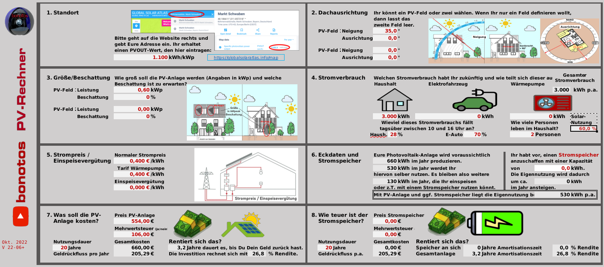
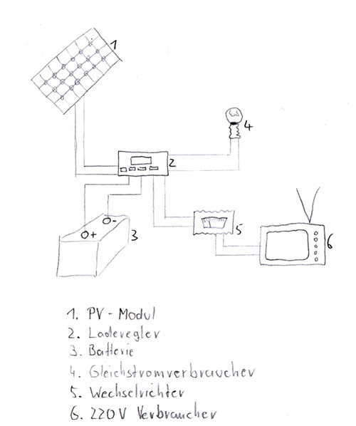
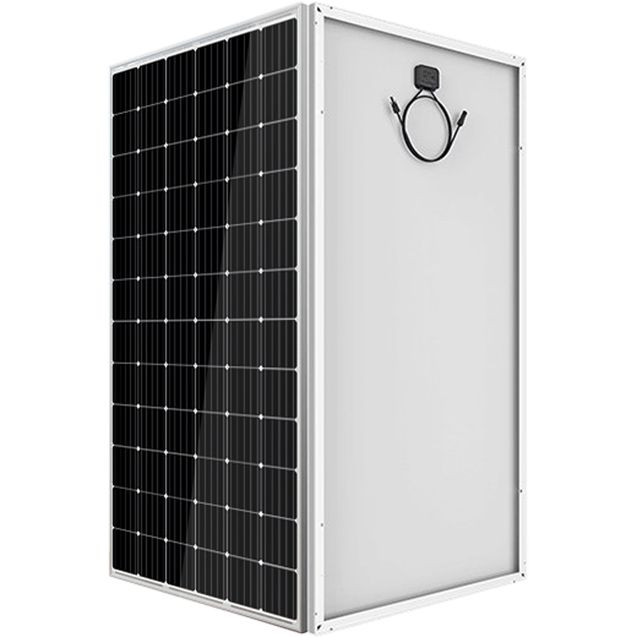
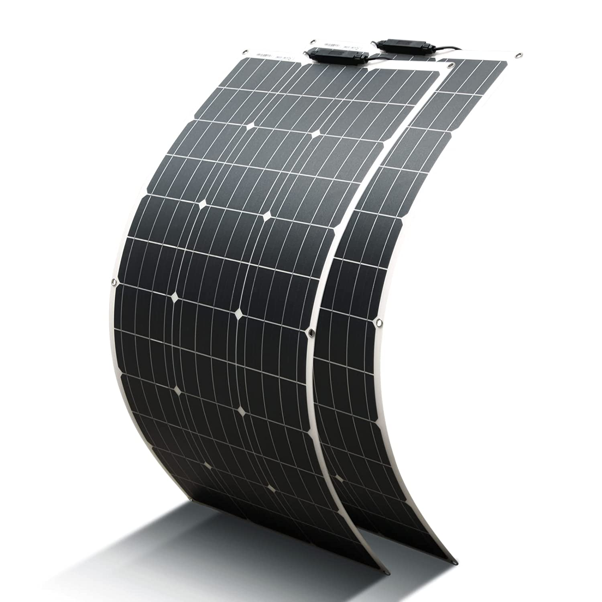
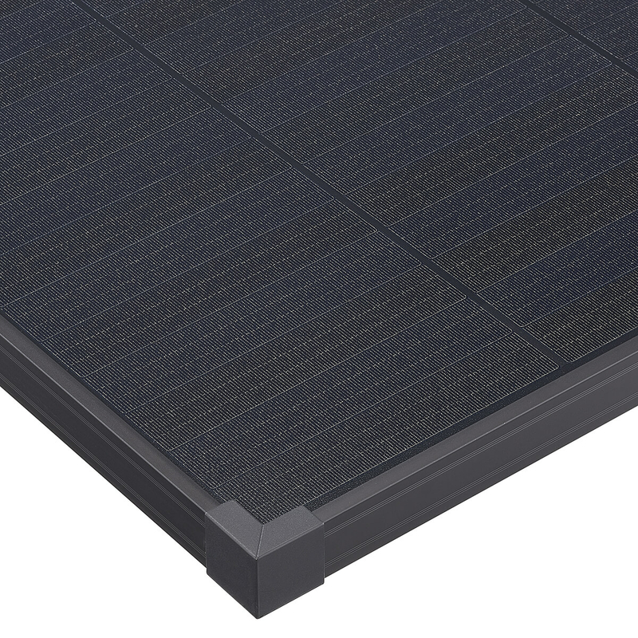
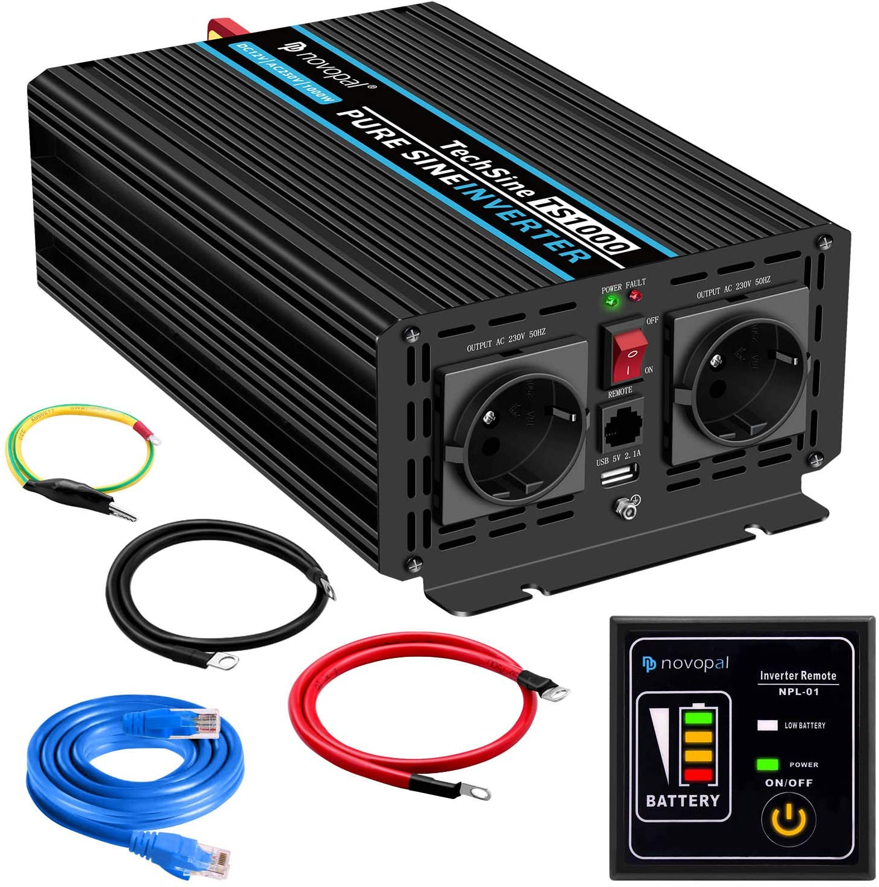
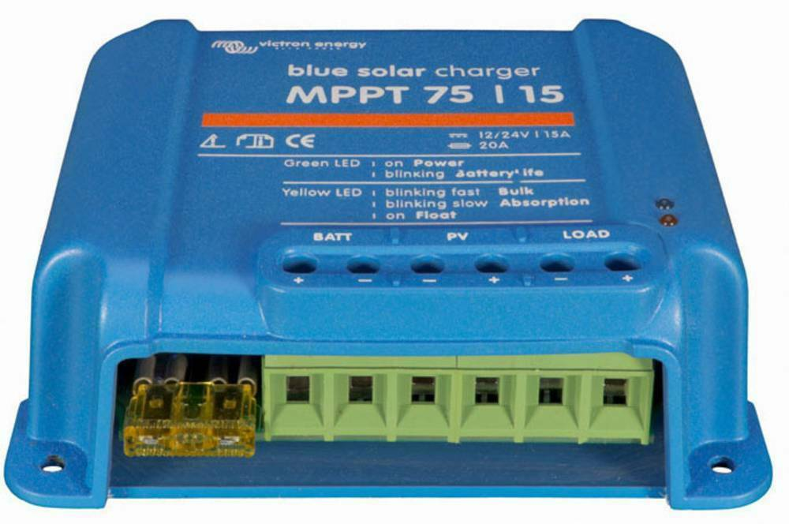
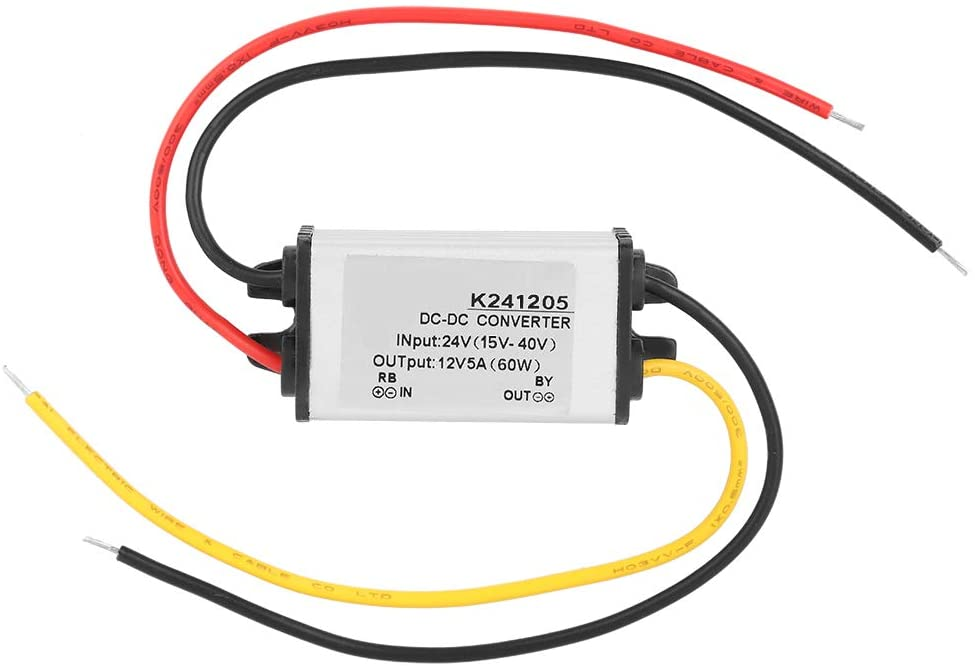

Zusammenfassung {#zusammenfassung}
---------------

Mit sog. Balkonkraftwerken kann man relativ einfach und günstig
Solarstrom gewinnen und über eine Steckdose direkt ins Hausnetz
einspeisen. Das spart Stromkosten und rechnet sich schon nach wenigen
Jahren Betrieb, allerdings nur soweit man den Strom auch gleichzeitig
selbst verbraucht.

Für eine gewisse Unabhängigkeit vom allgemeinen Stromnetz und von der
nicht immer kräftig vorhandenen Sonneneinstrahlung braucht man sog.
Inselanlagen. Diese benötigen zusätzlich aufladbare Batterien als
Stromspeicher sowie andere Wechselrichter und Solar-Laderegler als
Stecker-Solaranlagen, was sie aufwendiger und deutlich teurer macht.

Photovoltaik (PV) und ihr möglicher Energie-Ertrag {#photovoltaik}
--------------------------------------------------

Mit Solarzellen kann man Sonnenlicht in elektrische Energie umwandeln,
wenn auch leider nicht gerade effizient. Der
[Wirkungsgrad](https://de.wikipedia.org/wiki/Solarzelle#Wirkungsgrad)
der heutzutage üblichen Photovoltaik-Technologie mit Siliziumzellen
liegt typischerweise bei nur etwa 18 bis 20%, bei besonders hochwertigen
Modulen bis etwa 22%. Außerdem gibt es Verluste, wenn die Solarmodule
nicht senkrecht zur Einstrahlung ausgerichtet, (teil-)verschattet,
verschmutzt oder zu warm sind. Zu berücksichtigen ist zudem der
Wirkungsgrad der übrigen PV-Anlage von etwa 80 bis 95%.

{:.right width="500"}
Die maximale Einstrahlung
auf die Erde mittags bei klarem Himmel in Bodennähe auf eine Fläche
senkrecht zum Sonnenstand liegt bei 1361 W/m² und wird als
[terrestrische
Solarkonstante](http://www.energieinfo.de/eglossar/sonneneinstrahlung)
bezeichnet. Natürlich ist die tatsächliche Sonneneinstrahlung im
Durchschnitt viel geringer. Sie hängt stark vom Standort auf der Erde ab
(siehe z.B. [Simulationswerte von
Solargis](https://globalsolaratlas.info/map)) und ist je nach Bewölkung,
Tages- und Jahreszeit sehr variabel.

Die **Nennleistung** von Solarmodulen wird in **Wp** ([Watt
Peak](https://de.wikipedia.org/wiki/Watt_Peak)) angegeben. Zu ihrer
Bestimmung verwendet man eine Referenzbestrahlung mit einem normierten
Sonnenlichtspektrum einer Stärke von 1000 W/m² bei Zelltemperatur 25°C.\
Bei näherer Betrachtung bedeutet die Nennleistung in kWp (also 1000 Wp)
die *effektive Solarfläche* des Moduls, also Fläche (in m²) ×
Wirkungsgrad.\
Daher lässt sich auch der **Wirkungsgrad** eines Solarmoduls sehr
einfach nachrechnen, indem man seine Nennleistung in kWp durch seine
Fläche in m² teilt.

Die Wp-Angaben von Herstellern und Händlern für Solarmodule sind mit
Vorsicht zu genießen --- hauptsächlich weil die tatsächliche Leistung
wie oben erwähnt stark von der Situation (Ausrichtung, Sonnenstand,
Bewölkung usw.) abhängig und meist deutlich geringer ist. Außerdem weil
besonders chinesische Händler von flexiblen Solarmodulen dazu tendieren,
bei den Leistungsangaben deutlich zu übertreiben. Daher lohnt sich als
Plausibiltäts-Check, den Wirkungsgrad nachzurechnen.

{:.center}
In unseren
Breitengraden ist je nach Standort bei optimaler statischer Ausrichtung
von Solarmodulen ein Ertrag je nach Quelle von [etwa 900 bis 1000
kWh](https://www.energie-experten.org/erneuerbare-energien/photovoltaik/planung/ertrag)
oder gar [1200 bis 1300
kWh](https://gruenes.haus/photovoltaik-pv-ertrag/) pro kWp installierter
PV-Nennleistung und Jahr möglich. Der Jahresertrag lässt sich leicht
näherungsweise berechnen durch Multiplikation des standortspezifischen
PV-Potentials (das bereits angenommene typische System-Verlustfaktoren
beinhaltet und auch \"spezifischer Ertrag\" genannt wird) in kWh/kWp mit
der PV-Nennleistung in kWp. Das PV-Potential (PVOUT) erhält man z.B. aus
den groben [Karten von
Solargis](https://solargis.com/maps-and-gis-data/download), aus dem
[Global Solar Atlas der
Weltbank](https://globalsolaratlas.info/map?c=50.10,11.05,7&s=48.1807,11.604e)
(auch von Solargis) oder am Genauesten aus der [PVGIS-Datenbank der
EU](https://re.jrc.ec.europa.eu/pvg_tools/de/) bei der Standard-Eingabe
von 1 kWp für die installierte max. PV-Leistung.

{:width="49%" }
{:width="49%" .right}
Die [beste Ausbeute](
https://machdeinenstrom.de/optimaler-ertrag-mit-mini-solar-kraftwerken/)
bekommt man in süddeutschen Breitengraden bei Ausrichtung genau nach
Süden und mit ca. 38° Neigungswinkel (also relativ zur Waagerechten).
Genaueres kann man z.B. über
[PVGIS](https://re.jrc.ec.europa.eu/pvg_tools/de/) (oder einfacher über
[Solarserver](https://www.solarserver.de/pv-anlage-online-berechnen/))
standortspezifisch anhand von Geo- und Klimadaten berechnen/simulieren.

Bei den PV-Ertrags-Simulationen ist allerdings zu beachten, dass
üblicherweise der Jahres-Gesamtertrag optimiert wird, also unter der
Annahme, dass man den zur jeweiligen Tageszeit (und Jahreszeit)
erzeugten Strom auch voll nutzen kann (sei es durch Eigenverbrauch,
vergütete Einspeisung oder Zwischenspeicherung). Wenn man --- wie mit
den meisten Stecker-Solaranlagen --- den Strom nur direkt selbst im
Haushalt verbrauchen kann, ist es meist günstiger, die Ausrichtung der
Module eher für die Vormittags- und/oder Nachmittagssonne zu optimieren.
Also möglichst zwei Ausrichtungen, und zwar nach Südost und nach
Südwest, wählen (die dann aber bzgl. Solarstrom-Regelung (s.u.) getrennt
zu behandeln sind) und einen größerem Neigungswinkel, weil zu den Zeiten
die Sonne flacher steht, ansonsten eine eher flache Anordnung --- aber
nicht zu flach (sondern z.B. 20°), um weiterhin eine Selbstreinigung der
Moduloberflächen zu ermöglichen.

{:.center}
Diese Grafik zeigt
sehr schön die relative Änderung des Jahresertrages einer PV-Anlage mit
zunehmender Winkel-Abweichung von Süden (Azimut) abhängig vom
Neigungswinkel, wenn der optimale Neigungswinkel 35° beträgt. Sie wurde
von [bonotos](https://www.bonotos.com/) erzeugt, basierend auf [Daten
von Prof. Konrad
Mertens](https://www.fh-muenster.de/eti/downloads/personen/professoren/mertens/frei/2022_05_31_FH-MS_Nachhaltigkeitstag_Vortrag_Solarenergie_Kein_Dach_ohne_Solarstrom_PDF.pdf)
von der FH Münster.

Wenn man Solarmodule (z.B. auf dem Dach eines Wohnmobils) in
waagerechter Lage anbringt, ist man zwar von der Himmelsrichtung
unabhängig, aber kommt nach meiner Erfahrung mit billigen flexiblen
Modulen selbst mittags an sehr sonnigen Tagen kaum über die Hälfte der
angegebenen Spitzenleistung hinaus.

Nutzungsmöglichkeiten {#nutzungsmöglichkeiten}
---------------------

Solarmodule liefern in direkter Abhängigkeit von der Einstrahlungsstärke
sehr variablen Gleichstrom (je nach Nennleistung maximal z.B. 10 A) mit
einer Spannung je nach Modultyp von üblicherweise 22 bis 44 V. Dieser
\'rohe\' Strom ist direkt erst mal kaum verwendbar (außer z.B. zum
Aufheizen eines Warmwasserspeichers).

### Stecker-Solaranlage (\"Balkonkraftwerk\" mit direkter Netzeinspeisung) {#balkonkraftwerk}

{:.right width="400"}
Typischerweise
speisen Solaranlagen den erzeugten Strom nach Umwandlung durch einen
netzgekoppelten Wechselrichter
([Solarwechselrichter](https://de.wikipedia.org/wiki/Solarwechselrichter),
engl. grid-tie inverter) direkt ins (lokale oder öffentliche) Stromnetz
ein, wo er sofort in irgendeiner Form verbraucht wird (bzw. der Rest in
Form von Wärme verlorengeht). Zu beachten ist, dass diese Nutzungsart
abseits eines bestehenden Wechselstrom-Netzes und während eines
Stromausfalls (engl. blackout) nicht funktioniert, weil sich hierfür
verwendete Wechselrichter mit dem Stromnetz synchronisieren müssen.

Die auch \'[Balkonkraftwerk](https://www.steckdosensolar.de/)\'
genannten Anlagen haben meist eine recht geringe Nennleistung von etwa
600-700 Wp. Das hat neben der geringen Größe und sehr überschaubaren
Kosten auch damit zu tun, dass solche Anlagen selbst installiert werden
dürfen und genehmigungsfrei sind, wenn sie weniger als 600 W in die
Steckdose einspeisen. Dies gilt für Deutschland; anderswo sind meist 800
W (oder mehr) erlaubt.

{:.right width="377"}
Hintergrund dieser Beschränkung sind vornehmlich Sicherheitsbedenken:
Falls über die Wohnungs-Stromleitung, an der die Einspeisung
stattfindet, gleichzeitig sehr kräftig Strom verbraucht wird, kann es
unter ungünstigen Umständen passieren, dass auf Teilen der Leitung mehr
Strom fließt als die Sicherung eigentlich erlauben würde, was dann zu
einer mehr oder weniger starken Erwärmung der Leitung führen kann. Und
zwar müsste bei einer 16 A-Sicherung mehr als 3500 W, aber weniger als
3500 W + die gerade eingespeiste Leistung (z.B. 1300 W) verbraucht
werden, was allerdings insgesamt in der Praxis höchst unwahrscheinlich
ist.

Die nominale Leistung der verwendeten Solarmodule kann und sollte aber
durchaus größer sein (z.B. 800-1000 Wp), denn in der Praxis werden die
600 W Ausgangsleistung kaum erreicht, vor Allem in sonnenarmen Zeiten,
zumal es Verluste nicht nur an den Modulen, sondern auch im
Wechselrichter gibt. Man hat durch einen gewisse \"Überdimensionierung\"
auch zu ungünstigen Tages- und Jahreszeiten entsprechend mehr Ausbeute
(eigentlich sogar überproportional mehr, weil die Schwellspannung
schneller erreicht wird), allerdings auf recht niedrigem absoluten
Niveau. Wenn der Solar-Wechselrichter die Ausgangsleistung auf 600 W
begrenzt, wird der Gesamtertrag durch die Kappung zwar verringert, aber
der Effekt ist nicht so groß, wie man meinen könnte: Bei einem als
konstant angenommenen Gesamt-Systemverlust von 10% und optimal statisch
ausgerichteten 1000 Wp Modulen, die z.B. im Raum München eigentlich zu
einem Ertrag von etwa 1253 kWh pro Jahr führen würden, macht der Verlust
durch Begrenzung auf 600 W Ausgangsleistung nur etwa 124 kWh aus. Das
erklärt sich damit, dass die Kappung realistisch bei nur knapp 9% der
(Gesamt-)Stunden stattfindet und der dadurch verursachte Verlust im
Schnitt nur etwa 0,16 kWh pro \"gekappter\" Stunde ausmacht.

Von der gerade erzeugten Leistung fließt der Anteil, der nicht aktuell
lokal (also im Haushalt) durch Elektrogeräte verbraucht wird,
automatisch ins externe Stromnetz und wird praktisch an den jeweiligen
Stromlieferanten verschenkt. Die Zeiten, dass man durch einen rückwärts
laufenden Stromzähler \'unter der Hand Strom verkaufen\' konnte, sind
vorbei, und eine offiziell vergütete Einspeisung ist mit Extra-Aufwand
verbunden und bringt wenig --- sie beträgt in Deutschland gemäß eEG [zum
01.04.2022 nur noch 6,53
ct/kWh](https://www.zolar.de/blog/entwicklung-der-eeg-einspeiseverguetung).
Hingegen spart man sich die Verbrauchskosten für den selbst erzeugten
und gleichzeitig verbrauchten Anteil, weil der Zähler für den aus dem
externen Netz bezogenen Strom entsprechend langsamer läuft. Übrigens ist
es normalerweise egal, auf welcher Drehstrom-Phase (L1, L2 oder L3) die
Stecker-Solaranlage angeschlossen wird und auf welcher Phase die
gleichzeitig verwendeten Verbraucher angeschlossen sind --- jedenfalls
die neueren für die Abrechnung aktuell verwendeten Stromzähler arbeiten
saldierend (d.h. bilden die Gesamtsumme von Verbrauch und Erzeugung,
welche dabei negatives Vorzeichen hat).

Diese Nutzungsart lohnt sich also nur insoweit, wie man während der
Sonnenscheindauer den erzeugten Strom direkt sinnvoll verbrauchen kann,
z.B. durch diverse Haushaltsgeräte, Computer, Klimaanlagen oder zum
Laden von (Fahrzeug-)Batterien, wobei die Akkus von E-Bikes oder
E-Rollern von der Größenordnung und dem zeitlichen
Nutzungsprofil besonders geeignet sind. Am einfachsten und am
besten planbar ist es, wenn man ohnehin eine gewisse relativ
gleichmäßige Grundlast hat, z.B. durch Kühlschränke oder Wärmepumpen.
Eine Nutzung von überflüssigem Strom, die ich ziemlich clever fände,
aber von der Steuerung auch nicht ganz einfach wäre, ist das
(zusätzliche) Aufheizen eines Warmwasserboilers im Haus, so dass man
weniger fossile Brennstoffe dafür verbraucht.\
Je größer und tagsüber stromhungriger der Haushalt ist, desto größer der
zu erwartende Einsparungseffekt durch ein Steckdosen-Kraftwerk.

Wie eingangs geschrieben kann man bei optimaler Platzierung von
Solarmodulen pro Jahr etwa 1,1 kWh Strommenge pro Wp installierter
Solarleistung gewinnen. Rechnet man beispielsweise mit einer Investition
von 1,10€/Wp (inklusive anteiliger Kosten für Wechselrichter,
Installation etc.), ergeben sich Kosten von 1€/kWh erzeugtem Solarstrom
pro Jahr. Wenn der damit erzeugte Strom komplett selbst verbraucht wird
und man einen dadurch eingesparten Arbeitspreis von 40 ct/kWh ansetzt,
ergibt sich eine Amortisationszeit von nur 2,5 Jahren.

Beispielsweise mit
dem [PV-Rechner](PV-Rechner_v6+.xls) (der eigentlich für \"große\"
PV-Anlagen auf Hausdächern konzipiert ist) kann man die Rechnung
deutlich genauer machen. Er berücksichtigt u.A. die Ausrichtung der
Solarmodule, die jährliche Abschreibung, Reparatur- und Kapitalkosten,
den Anteil des während der Sonnenscheindauer im Haushalt nutzbaren
Ertrages, sowie optional Effekte durch das Laden eines E-Fahrzeugs (was
normalerweise öfter zu Sonnenscheinzeiten erfolgen kann), den Betrieb
einer Wärmepumpe und die Nutzung eines Stromspeichers. Dabei werden die
Energieflüsse der Einfachheit halber auf Monatsbasis gerechnet --- pro
Stunde wäre genauer. Für eine Balkonanlage mit 600 Wp, die 660€ kostet
und bei optimaler Ausrichtung pro Jahr 660 kWh Ertrag liefert, kann man
in einem Haushalt mit 3000 kWh Jahresverbrauch, der zu 28% während der
Sonnenscheinzeiten erfolgt, demnach etwa 530 kWh Solarstrom direkt
selbst verbrauchen und damit jährlich ca. 205€ Stromkosten einsparen.
Das ergibt eine Amortisationszeit von 3,2 Jahren und eine satte
(Anfangs-)Rendite von gut 26%.

Hinweis: Der PV-Rechner stammt von [bonotos](https://www.bonotos.com/)
und wurde hier etwas erweitert und verbessert, besonders weil der
originale (Version 22-06) einen groben Fehler in der Rendite-Formel
beinhaltet, der zu beinahe doppelt überhöhten Zahlen führt, aber
voraussichicht dort nicht mehr korrigiert wird.

### Stecker-Solaranlage mit Batteriepuffer {#batteriepuffer}

{:.right width="480"}
Es ist auch möglich, die
Solarenergie nicht direkt ins Netz, sondern über einen Solar-Laderegler
(s.u.) zunächst in einer aufladbaren Batterie (Akkumulator)
zwischenzuspeichern und von dort nach Bedarf zeitlich versetzt über
einen netzgekoppelten Wechselrichter (s.u.) ins Hausnetz einzuspeisen.
Das maximiert den Nutzen der PV-Anlage für den eigenen Stromverbrauch,
lohnt sich aber nur, wenn man die Batterie schon aus anderen Gründen
hat, z.B. für eine Notstromversorgung oder als Fahrzeugbatterie.

Dazu empfiehlt sich ein [regelbarer
(Solar-)Netzwechselrichter](https://de.aliexpress.com/item/1005001445871590.html)
wie in [diesem genialen Video von
Dimitri](https://www.youtube.com/watch?v=f-iz6WE8GD8).

Wenn man aber schon einen Solar-Wechselrichter hat und diesen verwenden
möchte, könnte es im einfachsten Fall genügen, ihn direkt mit der
Batterie zu verbinden und über einen Schalter manuell zu
steuern --- allerdings nur, wenn die Batteriespannung (z.B. 24 V) höher
ist als die minimale Eingangsspannung des Wechselrichters und dieser mit
seiner vollen Leistung betrieben werden kann (z.B. mit einem 300 W
PV-Modul-Eingang). Um die Stromstärke regeln zu können, kann man ein
Labornetzteil verwenden, evtl. mit DC-DC-Wandler wie das [Joy-IT
DPM8624](https://www.idealo.de/preisvergleich/OffersOfProduct/202115817)
aus dem [Video von Andreas
Schmitz](https://www.youtube.com/watch?v=yOcoux9IbzM) oder einen
günstigen regelbaren DC-DC-Wandler mit Strombegrenzung.

Oder wenn man zudem bereits eine Powerstation hat, kann man zwischen
ihren Wechselstrom-Ausgang und den Netzwechselrichter ein regelbares
Netzteil hängen, siehe [sein
Nachfolge-Video](https://www.youtube.com/watch?v=ZXHAXrJS9CU), was
allerdings zu unnötigen Verlusten durch Hin- und Her-Wandlung des Stroms
führt.

In jedem Fall muss für die Situation, dass die Batterieladung zur Neige
geht (bei LiFePO4 spätestens bei 90% Entladung) eine automatische
Abschaltung vorhanden sein, damit die Batterie nicht durch Tiefentladung
geschädigt wird. Außerdem wäre es v.A. im Sinne der
Stromkosten-Optimierung schön, wenn die Einspeisung der gespeicherten
Energie automatisch so stark erfolgt, wie sie auch benötigt wird, was
aber eine reglungstechnische Herausforderung wäre.

Am einfachsten ist aber, die Ausgangsleistung des Wechselrichters und
die Batteriekapazität so abzustimmen, dass lediglich ein Großteil der
Grundlast des Haushalts, z.B. 100 W, für eine Dauer von 1-2 Tagen
abgedeckt wird. Dann genügt zur Regelung ein recht simples
elektronisches Steuermodul, wie in [im Video von
Dimitri](https://www.youtube.com/watch?v=f-iz6WE8GD8) vorgeführt. Es
wird so eingestellt, dass bei es beim Erreichen einer Batteriespannung,
die annähernd einer Vollladung entspricht, den Wechselrichter
einschaltet und in der Nähe der Batterie-Entladeschlussspannung diesen
wieder ausschaltet. Damit wird die über die sonnenreiche Tageszeit
gesammelte Solarenergie dann über sonnenarme Zeiten (solange die Ladung
reicht, typischerweise bis zum nächsten Vormittag) gleichmäßig
abgegeben, mehr oder weniger ohne Strom nach extern zu verschenken.

{:.right width="400"}
Hier als
Analogie eine Skizze eines automatischen Wasserspeichers, der z.B. über
die Dachrinne eines Hauses gespeist wird. Wenn er voll genug ist, läuft
das Wasser über die rechte innere Begrenzung und lässt die Kugel
aufschwimmen, die bis dahin den Auslass blockiert hat. Dann fließt das
Wasser aus dem Speicher langsam und gleichmäßig nach unten aus. Wenn der
Speicher fast leer ist, verschließt die Kugel den Auslass wieder. Der
Speicher füllt sich (auch schon zwischendurch) bei Wasserzufuhr wieder
auf. Zusätzlich ist der Speicher am Einlass mit einem Überlaufschutz
ausgestattet, der die Wasserzufuhr stoppt, wenn der Speicher sehr voll
ist und das Wasser durch den kleinen Auslass nicht schnell genug
abfließt.

### Inselanlage mit Batteriespeicherung {#inselanlage}

{:.right width="400"}
Alternativ zur
Einspeisung ins Hausnetz kann man den von den Solarmodulen gelieferten
Strom auch in einer Batterie speichern und bei Bedarf darüber Geräte
unabhängig vom Hausnetz mit Strom versorgen. Diese Betriebsart wird als
\'[Inselanlage](http://www.inselanlage.info/)\' (engl. off-grid)
bezeichnet und ist für die Nutzung ohne externes Stromnetz (also z.B.
bei Stromausfall, beim Campen mit dem Wohnmobil oder Wohnwagen, auf
Booten und für abseits gelegene Häuser oder Hütten) die einzig mögliche.

Neben der Speicherbatterie wird hier zumindest ein Solar-Laderegler
benötigt, und sofern die Verbraucher nicht direkt mit der
Batteriespannung (z.B. 12 V Gleichstrom) betrieben werden können,
zusätzlich ein ausreichend leistungsstarker Wechselrichter (s.u.) zur
Umwandlung in den üblichen \'Steckdosenstrom\' (also Wechselstrom mit
ca. 230 V).

Ähnlich wie die zuvor genannte Variante ist diese Nutzungsart flexibler,
aber wegen der nötigen zusätzlichen Komponenten (v.A. Batterie) auch
deutlich teurer und auch etwas anfälliger und wartungsintensiver.
Wirtschaftlich rentabel für die Nutzung zu Hause kann das bei den
derzeitigen Preisen nur sein, wenn man eine geeignete Batterie schon aus
anderen Gründen (z.B. für den mobilen Einsatz in einem Fahrzeug) hat und
die zusätzliche Nutzungsart auch zeitlich alternativ dazu möglich ist.

### Kombination aus Stecker-Solaranlage und Inselanlage {#_kombination}

Wenn man Zugang zum Stromnetz hat und die für beide Varianten nötigen
Funktionen gleichzeitig installiert sind, kann man zwischen Netz- und
Inselbetrieb auch bedarfsweise wechseln. Dabei wird die Stromlieferung
der Solarmodule zwischen dem netzgekoppelten Wechselrichter und dem
Solar-Laderegler umgeschaltet (bzw. ohne Schalter einfach umgestöpselt).

Generelle Hinweise für die Auswahl und Nutzung von Komponenten {#komponenten}
--------------------------------------------------------------

### Solarmodule {#solarmodule}

Solarmodule (engl. solar panels) werden intern aus vielen in Reihe
geschalteten Solarzellen zusammengesetzt, die Sonnenlicht in Gleichstrom
umwandeln.

{:.right width="500"}
Bei den üblichen Silizium-Solarzellen steigt der entnehmbare Strom
(Kurzschlussstrom) linear mit der Bestrahlungsstärke. Ihre
Leerlaufspannung hingegen steigt schon bei geringer Helligkeit stark an
und nähert sich dann nur noch langsam steigend dem Wert 0,63 V. Generell
sind monokristalline Zellen zu bevorzugen, auch wenn sie ein wenig
teurer sind als polykristalline oder amorphe, weil sie einen höheren
Wirkungsgrad haben.

{:.center} Leider bricht die
Leistung von in Reihe geschalteten Zellen ein, sobald auch nur eine
davon verschattet ist. Daher werden in den üblichen größeren Modulen
sog. Bypass-Dioden eingesetzt, die bei Teilverschattung immerhin einen
Teil der Leistung fließen lassen.

{:width="49%"}
{:.right width="49%"}
[Klassische Solarmodule](https://gruenes.haus/pv-modul-groesse-gewicht/)
haben einen
Aluminiumrahmen und eine Größe von typischerweise ca. 1,7 m × 1 m × 3
cm, was eine Nennleistung von etwa 350 Wp ergibt, und eine Masse von ca.
20 kg. (Semi-)Flexible Module sind teurer als starre und weniger
langlebig, dafür aber viel leichter und nur wenige Millimeter dick. Sie
sind meist auch deutlich kleiner --- typischerweise 1,2 m × 0,5 m bei
einer Nennleistung von 100 Wp und einer Masse von 1 bis 2 kg.
[Hier](https://solar-generatoren.de/die-richtigen-solarmodule-fuers-wohnmobil/)
ein Vergleich verschiedener Solarmodul-Typen in Hinblick auf die
Verwendung für Wohnmobile.

{:width="49%"}
{:.right width="49%"}
Technisch besonders interessant finde ich die überlappende Anordnung und direkte
Verschaltung von Solarzellen ohne Stromschienen (engl. busbars) in
[Schindel-Modulen](https://www.strom-forschung.de/aktuelles/news/2022/schindel-solarmodule-innovativ-verschaltet-und-industriell-herstellbar)
(engl. SSP = shingle solar panel). Dadurch steigt der Wirkungsgrad, weil
die Fläche besser genutzt wird und bei Teilverschattung und Wärme die
Verluste verringert werden. Allerdings ist diese Bauart selten zu finden
und verhältnismäßig teuer, so dass sie nur dann sinnvoll ist, wenn man
Platz sparen will/muss.

Solarmodule --- aber bitte nur gleichartige --- kann man wie
Batteriezellen seriell und/oder parallel verbinden, um mehr Leistung zu
erhalten, ohne für jedes Modul einen eigenen Regler (bzw.
Regler-Eingang) verwenden zu müssen. Zum Thema Solar-Regler siehe unten.
Wenige große Solarmodule sind technisch und wirtschaftlich etwas
günstiger als entsprechend viele kleine, besonders wenn man einen Regler
pro Modul verwendet.

Solarmodule haben als Stromanschluss meist die praktischen
MC4-Steckverbinder. Für die parallele Verschaltung bieten sich Y-Kabel
mit MC4-Anschlüssen an. Man sollte Module nur insoweit zusammenschalten
und an einem gemeinsamen Regler-Eingang betrieben, wie sie in die
gleiche Ausrichtung und relativ gleich(zeitig) verschattet werden.

-   Bei [Reihenschaltung](https://de.wikipedia.org/wiki/Reihenschaltung)
    (oft auch \'Serienschaltung\' genannt) addieren sich die Spannungen
    der einzelnen Module, wobei man unbedingt darauf achten muss, dass
    die maximale Eingangsspannung, die der Regler verkraftet, nicht
    überschritten wird. Ein Nachteil der Reihenschaltung ist, dass es
    dabei leichter zu [Verlusten durch
    Teilverschattung](https://photovoltaikbuero.de/pv-know-how-blog/teilverschattung-bei-solarmodulen-messungen/)
    kommt, denn die Leistung bricht ein, wenn auch nur eines der Module
    verschattet wird.

-   Bei
    [Parallelschaltung](https://de.wikipedia.org/wiki/Parallelschaltung)
    addieren sich die Ströme der einzelnen Module, wobei der je nach
    Einstrahlung mögliche Maximalstrom unter dem Maximalstrom des
    Regler-Eingangs liegen sollte, weil sonst zumindest Leistung
    verschenkt wird. Auch sind höhere Ströme, besonders bei dünnen
    Kabeln, generell mit etwas mehr elektrischem Verlust verbunden.
    Dafür hat man aber weniger Verluste durch Teilverschattung.

{:.right width="500"}
Zu beachten ist noch, dass die Regler-Eingangsspannung je nach Modell
bis zu 5 V über der gewünschten Ausgangsspannung des Reglers (z.B. der
Speicherbatterie) liegen muss, damit der Regler effektiv Strom liefern
kann. Wenn man z.B. kleine Solarmodule mit 100 Wp und 22,6 V
Leerlaufspannung hat, wird es ohne Reihenschaltung bei einer
Ladeschlussspannung von ca. 14,5 V einer LiFePO4-Batterie bei wolkigem
Wetter (mit vielleicht nur 100 - 200 W/m²) ziemlich eng.

{:.center}
Zur Montage bzw.
Aufständerung von Solarmodulen auf einem Dach oder an einem Balkon
[hier](https://www.youtube.com/watch?v=TKeu6YGVuus) ein Überblick-Video.
[Hier](https://machdeinenstrom.de/balkonkraftwerk-montageloesungen-fuer-die-balkonbruestung/)
ein Artikel mit speziellen Tipps zur Installation an einer
Balkonbrüstung.

### Solar-Regler und Wechselrichter {#wechselrichter}

{:.right width="400"}
Für die
Umwandlung des \'rohen\' Solarstroms sind Spannungsregler mit [MPPT
(Maximal-Leistungspunkt-Suche, engl. maximum power point
tracking)](https://de.wikipedia.org/wiki/Maximum_Power_Point_Tracking)
zu empfehlen, weil sie auch bei stark wechselnder Einstrahlung optimale
Energieausbeute bringen. Sie sind allerdings deutlich teurer als die
wesentlich einfacheren PWM-Regler.

Für die Umwandlung von Gleichstrom in Wechselstrom (bei uns meist mit
230 V) benötigt man einen
[Wechselrichter](https://de.wikipedia.org/wiki/Wechselrichter) (manchmal
auch'Spannungswandler\' genannt, engl. inverter). Bei einem
Wechselrichter sollte man darauf achten, dass er ordentlichen
Wechselstrom liefert (sog. \'reine Sinuswelle\', engl. pure sine wave)
sowie einen hohen
[Wirkungsgrad](https://www.energie-experten.org/erneuerbare-energien/photovoltaik/wechselrichter/wirkungsgrad)
(engl. efficiency) und einen geringen Ruhe-/Leerlaufstromverbrauch
(engl. standby power consumption) hat. Außerdem ist empfehlenswert, ihn
mit ausreichend Leistungsreserve zu dimensionieren, auch weil er sonst
schnell unangenehm lautes Lüftergeräusch verbreiten und bei
Dauerbelastung leichter Schaden nehmen kann.

Für die Einspeisung ins Stromnetz muss ein *netzgekoppelter
Wechselrichter* verwendet werden. Dieser wird auch *Netzwechselrichter*
oder *fremd geführter Wechselrichter* genannt, weil er sich automatisch
an die Frequenz und Phase des anliegenden Wechselstroms anpasst und bei
fehlendem Stromanschluss den Ausgang abschaltet --- auch aus
Sicherheitsgründen für den Fall, dass ein blanker Stecker berührt werden
kann. Bei Stecker-Solaranlagen wird meist ein
*Solar-Mikrowechselrichter* verwendet, der einen Spannungsregler mit
einem Netzwechselrichter integriert. Im Zusammenhang von
Balkonkraftwerken wird dann meist nur vereinfacht von einem
*Wechselrichter* (*WR*) gesprochen.

{:.right width="400"}
Inselwechselrichter, die
auch *selbst geführte Wechselrichter* genannt werden, werden vom
Stromnetz unabhängig betrieben. Mit ihnen kann man die üblichen
Haushaltsgeräte auch im Falle eines Stromausfalls mit einer Batterie
versorgen, natürlich ausreichend Leistung vorausgesetzt.

### Solar-Laderegler {#laderegler}

{:.right width="400"}
Wenn man über
Solarmodule eine Batterie laden möchte, benötigt man einen
Solar-Laderegler, der einen Spannungsregler mit einem Batterieladegerät
verbindet. Mit billigen chinesischen (angeblich) MPPT-Reglern habe ich
keine guten Erfahrungen gemacht, wohl aber mit den europäischen Marken
Victron und Votronic.

### Hybridgeräte: Solar-Laderegler mit Wechselrichter {#hybridgeräte}

{:.right width="400"}
Es gibt auch
[Kombigeräte](https://www.solarserver.de/2021/07/26/green-cell-bietet-neuen-solarwechselrichter-an/),welche
die Funktionen Solar-Laderegler, Batterie-Netzladegerät und
Inselwechselrichter in sich vereinen. Damit können Elektrogeräte
vorzugsweise direkt mit Solarstrom versorgt werden, wobei die
überschüssige Energie in einer Batterie gespeichert wird. Bei
unzureichender Stromversorgung aus den Solarmodulen ergänzt das Gerät
die benötigte Energie automatisch aus der Batterie und schaltet bei
leerer Batterie (oder je nach konfigurierter Präferenz auch schon bei
fehlendem Solarstrom) auf eine externe Stromquelle (Stromnetz oder
Generator) um, worüber auch die Batterie geladen wird. Solch ein
Kombigerät ist in seiner Funktionsweise sehr praktisch, außerdem
einfacher zu installieren und zu verwenden, außerdem wirtschaftlicher
als entsprechende Einzelkomponenten. Es hat aber [auch
Nachteile](https://www.oeko-energie.de/shop1/de/Solarstrom/Insel-WR/Kombigeraet-Laderegler-MPPT-Wechselrichter-Batterieladegeraet/)
wie geringe Flexibilität bei der Komponentenwahl.\
Und offenbar gibt es kein Gerät, das neben der Nutzungsart als
Inselanlage (also netzunabhängige Versorgung) auch den einer
Stecker-Solaranlage (also direkte Netzeinspeisung des Solarstroms)
ermöglicht.

### Speicherbatterien {#speicherbatterien}

{:.right width="400"}
Für die Stromspeicherung bieten sich
heutzutage Lithium-Eisenphosphat-Batterien (LiFePO4) an. Diese sind zwar
erheblich teurer als Blei-Säure-Batterien (inkl. der AGM-Variante), wie
man sie vom Auto kennt, aber sind nicht so schwer, viel
spannungsstabiler und vertragen ein Mehrfaches an Lade-/Entladezyklen.
Im Vergleich zu Li-Ionen- und Li-Polymer-Akkus, welche eine noch höhere
Energiedichte haben, sind sie recht robust und sicher. Lithium-basierten
Batterien benötigen für die Reihenschaltung von Akkuzellen ein sog.
Batteriemanagementsystem (BMS), das für eine gleichmäßige
Spannungsverteilung der Zellen sorgt.\
Eine typische 100 Ah Autobatterie wiegt etwa 26 kg und kostet nur etwa
100€. Aus ihrer Nennkapazität von 12 V × 100 Ah = 1200 Wh sollte man pro
Entladung höchstens 50% entnehmen, damit die Batterie nicht durch
Tiefentladung Schaden nimmt, also maximal 600 Wh. Selbst dann hält ein
Bleiakku meist weniger als 1000 Lade-/Entladezyklen. Die Zahl der
Lade-/Entladezyklen eines Lithium-Eisenphosphat-Akkus liegt angeblich
bei etwa 5000. Eine 12,8 V 100 Ah LiFePO4-Batterie wiegt etwa 11 kg und
kann zu 90% entladen werden, ohne dass sie Schaden nimmt, so dass sich
eine effektive Kapazität von 1150 Wh ergibt. Unter Berücksichtigung der
Wandlungsverluste eines Wechselrichters lässt sich damit ein Gerät mit
1000 W Verbrauch (z.B. Staubsauger, Kaffeemaschine oder Fön) gut eine
Stunde lang betreiben.

Um den Wandlungsverlust von ca. 10% eines Wechselrichters zu vermeiden,
sollte man bei einer Inselanlage die Verbraucher möglichst direkt an der
Batterie anschließen, was z.B. bei LED-Lampen, Radios und
USB-Ladebuchsen gut machbar ist --- aber auch bei Laptops, wenn man für
sie ein Netzteil mit 12 V (statt 230 V) Eingang verwendet. Bei mittlerer
Last von 25 W ergeben sich mit einer voll geladenen 12,8 V 100 Ah
LiFePO4-Batterie gut 50 Stunden Betriebszeit. Ein durchschnittlicher 3,6
V Smartphone-Akku mit 2500 mAh hat 9 Wh Kapazität. Wenn er jeweils zu
80% entladen wird, lässt er sich damit etwa 160 mal aufladen.\
Zum Vergleich: Eine Powerbank mit nominell 20.000 mAh Kapazität hat
(aufgrund oft stark überzogener Hersteller-Angaben und Verlusten bei der
Wandlung von 3,6 V auf die 5 V eines USB-Anschlusses) effektiv eher die
Hälfte dieser Kapazität. Ein durchschnittlicher Smartphone-Akku lässt
sich über die Powerbank in der Praxis nur etwa 10 mal aufladen.

Der Preis einer Batterie pro kWh sinkt mit steigender
Größe/Gesamtkapazität.\

{:.right width="400"}
Wenn man die Wahl
hat zwischen höherer Spannung (d.h. mehr Akkuzellen in Reihe) oder
größere bzw. mehr Zellen parallel, dann besser die höhere Spannung
nehmen. Also ist z.B. eine 24 V 100 Ah Batterie einer mit 12 V und 200
Ah vorzuziehen, aus folgenden Gründen:

-   Hohe Ströme belasten elektronische Bauteile besonders stark, bringen
    mehr Verluste und verlangen größere Kabelquerschnitte, die schnell
    unhandlich werden.

-   Ein Solar-Laderegler ist vor Allem durch seinen Ausgangsstrom
    begrenzt. So verkraftet ein [Victron BlueSolar MPPT
    100/30](Datenblatt_BlueSolar-MPPT-100-30-100-50.pdf) eine
    PV-Leerspannung von max. 100 V (was die Reihenschaltung von
    mindestens 2 Solarmodulen erlaubt). Er liefert einen max. Ladestrom
    von 30 A, woraus sich bei Betrieb an einer 12 V Batterie eine
    maximale Leistung von 360 W ergibt, bzw. unter Berücksichtigung von
    PV-Verlusten eine sinnvolle maximale Leistung der Solarmodule von
    440 Wp. Bei 24 V Batteriespannung ist hingegen die doppelte Leistung
    (880 Wp) möglich. Wenn man anders herum für die doppele PV-Leistung
    bei 12 V Batteriespannung bleiben will bzw. muss, braucht man einen
    Laderegler mit doppelter Strom-Belastbarkeit, und der kostet ca. 50
    bis 80% mehr.

-   Vermutlich arbeiten Wechselrichter mit 24 V Eingangsspannung etwas
    effizienter als solche mit 12 V, zumal Strom und Spannungsspreizung
    geringer sind.

{:.right width="400"}
Ein Problem bei einer
Batteriespannung von 24 V (oder 48 V) ist, dass Niederspannungs-Geräte
typischerweise eher mit 12 V zu betreiben sind. Aber dafür gibt es für
Geräte mit mäßigem Verbrauch (bis etwa 5 A, also 60 W) eine recht
effiziente und kostengünstige Lösung, nämlich sog. Tiefsetzsteller
(Abwärtswandler, engl. DC-DC buck step-down converter.)

Beispiel-Konfigurationen {#konfigurationen}
------------------------

### Mobile Inselanlage {#mobil}

Für unser Wohnmobil verwende ich seit Mai 2019 folgende relativ günstige
Komponenten zu meiner vollen Zufriedenheit:

-   2 × 100 Wp flexible Solarpanels [Dokio
    DFSP-100M](https://www.amazon.de/DOKIO-Batterie-wasserdicht-Wohnmobil-Oberfl%C3%A4che/dp/B07FYW3C6W),
    ca. 180€\
    Diese habe ich einfach auf das Blechdach unseres Wohnmobils geklebt.
    Etwas lästig war die Kabelführung ins Innere.

-   15 A Solar-Laderegler [Victron BlueSolar MPPT
    75/15](https://www.ebay.de/itm/142083505206), ca. 90€\
    Dieser Regler unterstützt Batterien mit 12 oder 24 V und Ladeströme
    bis 15 A (wobei für die o.g. Solarzellen bei Dachmontage in der
    Praxis auch 10 A genügt hätten).\
    Sehr praktisch finde ich bei den BlueSolar-Modellen die
    Status-Abfrage auf dem Smartphone.\
    Leider unterbinden die Victron-Regler ohne Zusatzgerät nicht das Laden
    bei unter 0°C, was bei LiFePO4-Akkus zu Schäden führen kann,
    wenn man sie im Winter nicht abklemmt.

-   12,8 V 100 Ah 4S1P LiFePO4-Batterie inkl. 100 A BMS [Delong
    DL-12100](https://www.alibaba.com/product-detail/Delong-Factory-Rechargeable-12-8V-100Ah_62388029440.html),
    inkl. DDP-Versand direkt aus China ca. 400€\
    In Deutschland werden solche Batterien hingegen für ungefähr 1000€
    verkauft. Siehe auch [meinen
    myDealz-Beitrag](https://www.mydealz.de/deals/12v-100ah-lifepo4-akku-mit-bms-ab-400-zb-fur-solaranlage-oder-wohnmobilbatterie-ersatz-1350559)
    dazu mit interessanter Diskussion.

-   [2000 Wp
    Wechselrichter](https://de.aliexpress.com/wholesale?SearchText=pure+sine+wave+inverter+2000w),
    ebenfalls direkt aus China, ca. 70€

### Stecker-Solaranlage {#stecker}

Für eine sehr einfache, aber effiziente Anlage zur Netzeinspeisung finde
ich folgende Komponenten besonders interessant:

-   2 × 400 Wp starre SSP [EcoDelta -
    ECO-400M-66SA](Datenblatt_ECO-380-400M-66SA.pdf) mit besonders hoher
    Effizienz: 213 Wp/m², ca. 540€\
    oder 4 × 150 Wp flexible ETFE SSP Solarmodule [Solarfam
    SZ-150-36MFE](Solarfam_SSP_SZ-150-36MFE.pdf) mit 188 Wp/m², ca.
    [664€](https://stromvoll.com/shop/#!/150W-Flexible-Solar-panel-1170-x-680-x-2-mm/)\
    oder 2 × 310 Wp sehr langlebige flexible Solarmodule [Sunman eArc
    SMF310M-6X10DW](Datenblatt_Sunman_flexible_310W.pdf) mit 187 Wp/m²,
    ca.
    [715€](https://shop-lieckipedia.de/Ab-2-Stueck-310-Watt-Solarmodul-monokristallin-flexibel-Sunman)

-   4-in-1 Microinverter 1200W [Hoymiles
    HM-1200](https://www.hoymiles.com/product/microinverter/hm-1200-1500-as/),
    ca. 230€\
    oder 1000W Micro Grid Tie Inverter Inverter
    [SG1000MQ](https://www.ebay.de/itm/124731502486), ca. 200€\
    oder 4 × 400W Micro Solar Wechselrichter [Deye Sun1600g3-EU-230](
    https://de.made-in-china.com/co_skycorpsolar/product_Deye-Micro-Inverter-1600W-Sun1600g3-EU-230-Micro-Solar-Inverter-on-Grid-Solar-Home-System-Inverter_ysyyygenig.html),
    ca. 320€

### Kombi-Anlage für daheim und unterwegs {#kombi}

Als Balkonanlage mit Netzeinspeisung, aber auch für eine
Notfall-Stromversorgung daheim und für einen längeren autarken
Aufenthalt mit dem Wohnmobil habe ich folgende Komponenten:

-   4 × [150 Wp flexible ETFE SSP
    Solarmodule](https://www.solarfam.nl/150w-shingle-etfe-flexible-solar-panel-solarfam.html),
    für 600€\
    Zuvor hatte ich mir gekauft, aber nicht verwendet, weil mir ihre
    Montage an der Balkonbrüstung im 4. Stock zu riskant war:\
    4 × [120Wp starre Eco-Worthy
    Solarpanel](https://www.manomano.de/p/2x120watt-solarpanel-solarmodul-12v-12volt-monocrystalline-wohnwagen-wohnmobil-48845318),
    für 320€\
    Diese Eco-Worthy Module kann ich empfehlen, wenn man keine größeren
    verwenden kann. Sie bringen jedenfalls die versprochene
    Spitzenleistung, was gerade bei günstigen Modellen nicht
    selbstverständlich ist.

-   700 W Mars Rock Dual MPPT Grid Tie Inverter mit WLAN
    [EC700MD](https://de.aliexpress.com/item/1005002469159821.html) (oder
    [ähnlich mit LCD](https://www.ebay.de/itm/165694072328)), ca. 135€
    inkl. Versand

-   [EASun 3kW peak Pure Sine Wave Solar Inverter 24V 220V PV Power
    1500W PWM 50A Solar Charge Controller and AC
    Charger](https://de.aliexpress.com/item/1005003665568494.html), für
    185€\
    wobei ich leider nicht aufpasst habe, die
    [MPPT-Version](https://de.aliexpress.com/item/1005004488463489.html)
    zu bestellen, deren Solarwandlungs-Effizienz besser wäre.

-   24 V 100 Ah LiFePO4-Batterie mit 8S1P-Konfiguration inkl. 100 A BMS
    und Display [CERRNSS LF-24100
    small](https://de.aliexpress.com/item/1005003937833782.html), ca.
    570€\
    Diese Zellen sind [qualitativ allerdings nicht ganz so
    gut](https://www.youtube.com/watch?v=4OYlp1aMtTU) wie die von
    Delong.\
    Noch günstiger und sehr hochwertig geht es im [Eigenbau: 12 V 280 Ah
    schon ab 600€](https://www.youtube.com/watch?v=F0Ot7JOR2VM).

-   24 V auf 12 V Tiefsetzsteller 60W [Akozon GYVRM / LY-KREE / Cocar
    K241205](https://www.amazon.de/Netzteil-Spannungswandler-Transformator-Konverter-Sonnensystem-5A/dp/B01KQWWQUI)
    mit angeblich 96% Wirkungsgrad, ca. 13€
