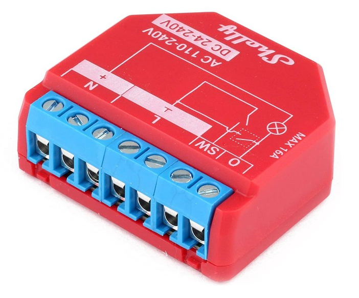
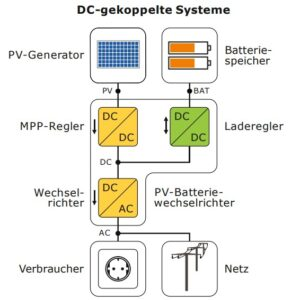
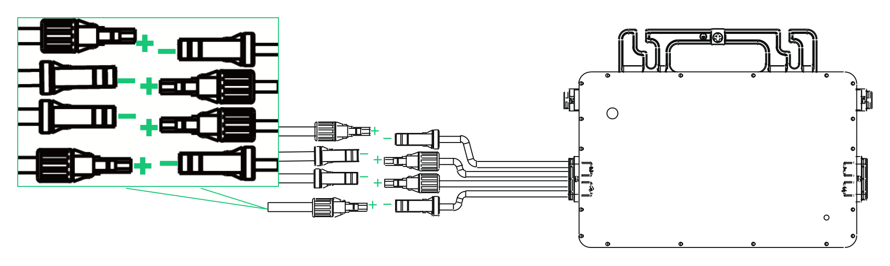
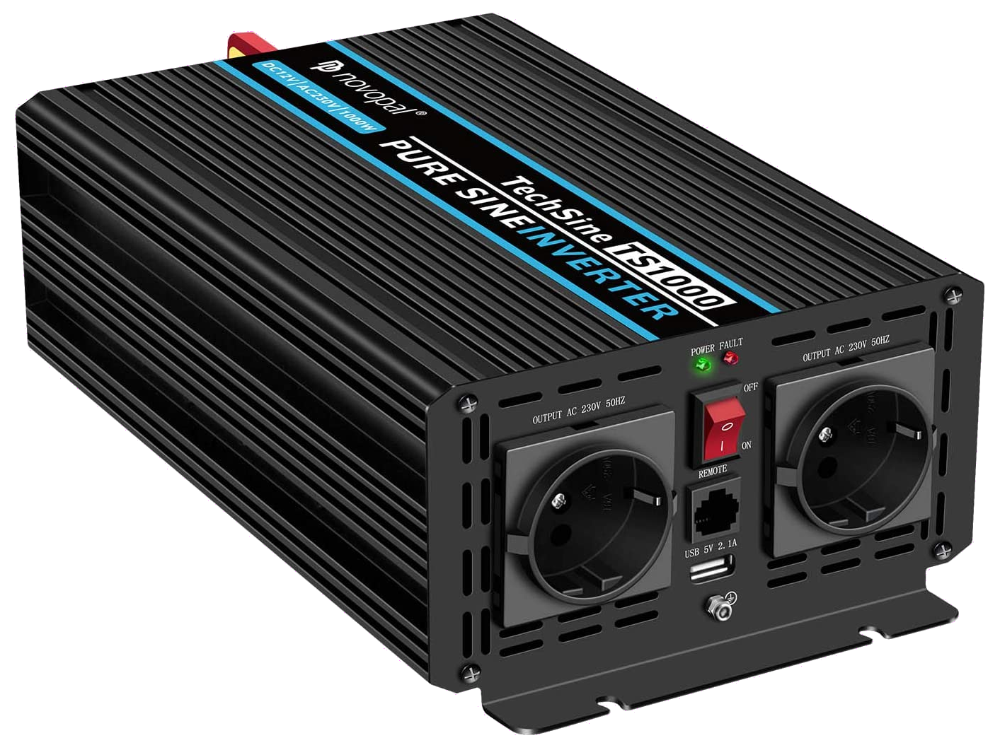

<!-- https://jekyllrb.com/docs/front-matter/
     https://pandoc.org/MANUAL.html#extension-yaml_metadata_block-->

Wichtige Hintergrund-Infos zur Photovoltaik und viele praktische Tipps für
Balkonkraftwerke und andere kleine Stecker-Solaranlagen -- einschließlich Hinweisen,
welche Komponenten und Verwendungsformen sich unter welchen Umständen lohnen:
exakte Simulationsergebnisse für Rentabilität, optimale Modul-Ausrichtung und
die Verwendung von Wechselrichtern und Speicherbatterien inklusive Regelung.

# Zusammenfassung {#Zusammenfassung}

Mit einem sog. *Steckersolargerät* kann man sehr einfach und relativ günstig
Solarstrom gewinnen und über eine Steckdose direkt ins Hausnetz einspeisen.
Das spart Stromkosten und kann sich je nach verwendeten Komponenten
und deren Aufstellung schon nach wenigen Jahren Betrieb rechnen ---
allerdings nur soweit man den Strom auch gleichzeitig selbst verbraucht.
Weil diese Betriebsart den überschüssigen Strom an die Allgemeinheit weitergibt
und keine Batterie benötigt, ist sie für die ökologische Gesamtbilanz am besten.

Für eine gewisse Unabhängigkeit von der nicht ständig kräftig vorhandenen
Sonneneinstrahlung und vom allgemeinen Stromnetz
braucht man eine aufladbare Batterie als Stromspeicher und weitere Geräte,
was das Ganze deutlich aufwendiger und teurer macht.\
Durch eine *Strompufferung* mit einer geeigneten vom aktuellen Verbrauch im
Haushalt abhängigen Regelung lässt sich überschüssige Energie zwischenspeichern
und bei Bedarf wieder abrufen und damit der Eigenverbrauchsanteil erhöhen.\
Eine sog. *Inselanlage* ist auch während Stromausfällen verwendbar,
soweit die Speicherkapazität und die Einstrahlung zum Nachladen reichen.

<!--https://www.handelsblatt.com/adv/firmen/balkonkraftwerk-solar.html-->
<!--https://cdn.daa.net/images/photovoltaik/balkonkraftwerk.jpg-->
<!--https://www.solaranlagen-portal.com/photovoltaik/balkonkraftwerk-->

# Zielsetzung und Abgrenzung {#Zielsetzung}

Hier geht es nicht um *Solarthermie*, also die direkte Gewinnung von Wärme
durch Sonneneinstrahlung, sondern um die Erzeugung von elektrischem Strom.
Es geht auch nicht primär um „große“ Photovoltaik-Anlagen etwa auf Hausdächern
(dazu gibt es z.B. einen fundierten [Leitfaden von der HTW Berlin](
https://solar.htw-berlin.de/wp-content/uploads/HTW-PV-Wegweiser.pdf)),
wobei viele Aspekte natürlich gleich oder leicht übertragbar sind.

Meine Motivation als Autor ist vor allem physikalisch-technische Bildung ---
also relevante Zusammenhänge zu verstehen und möglichst hilfreich darzustellen.
Ich verfolge keinerlei kommerzielle Interessen (Verkauf, Sponsoring, o.ä.) ---
finanziell geht mir es darum, wie ich selbst und Andere mit vertretbarem Aufwand
und geringen Kosten möglichst viel Nutzen aus eigenem Solarstrom ziehen können.

Alle Inhalte sind von mir selbst recherchiert (meist online) und beschrieben,
wobei ich viele Quellen verlinke, die ich interessant und hilfreich finde.
Sehr viel praktisch Relevantes habe ich durch den Austausch zu PV-Angeboten
auf [myDealz.de](https://www.mydealz.de/) mitbekommen, überprüft und eingebaut.
Auch über das [Photovoltaik-Forum](https://www.photovoltaikforum.com/)
und PV-Enthusiasten vom [Solar2030](https://solar2030.de/) e.V.,
bei dem ich sei der Gründung Mitglied bin, kamen einige wertvolle Hinweise.\
Um möglichst verlässliche und detaillierte Werte zum nutzbaren Ertrag von
PV-Anlagen auch mit besonderen Eigenschaften ohne oder mit Speicher zu erhalten,
habe ich einen eigenen [Simulator](#SolBatSim) mit vielen Optionen entwickelt,
dessen Ergebnisse an mehreren Stellen maßgeblich eingeflossen sind.

Als Privatperson und auch als naturwissenschaftlich-technisch versierter
Nichtprofi kann ich natürlich keine offiziellen Informationen bzw. absolut
verlässliche Hinweise geben und für die Inhalte keine Gewähr oder gar Haftung
übernehmen. Wer bezüglich Stecker-PV-Anlagen etwas Offizielleres sucht,
der sei z.B. auf den schönen [Leitfaden von SmartGridsBW](
https://smartgrids-bw.net/public/uploads/2020/04/IBZ-Leitfaden_Balkon-PV-Online.pdf)
und die [„Fachinformation“ des DKE](https://www.dke.de/de/arbeitsfelder/energy/mini-pv-anlage-solar-strom-balkon-nachhaltig-erzeugen)
verwiesen.

# Nutzungslizenz {#Nutzungslizenz}

Die Verlinkung, Weitergabe und sonstige Weiterverwendung dieser Inhalte,
auch in geeigneten Auszügen, ist ausdrücklich erlaubt und erwünscht.
Bedingungen sind dabei Quellenangabe und Weitergabe unter gleichen Bedingungen,
was bei Verlinkung automatisch der Fall ist.\
Lizenzkürzel:
[CC BY-SA 4.0](https://creativecommons.org/licenses/by-sa/4.0/deed.de)

<!-- markdown-toc start - Run M-x markdown-toc-refresh-toc -->
<!--
**Inhaltsverzeichnis**

- [Zusammenfassung { # Zusammenfassung}](#zusammenfassung-zusammenfassung)
-->
<!-- markdown-toc end -->

<!-- pandoc -s - -toc index.md -o output.md -->

# Inhaltsverzeichnis {#Inhaltsverzeichnis}

-   [Zusammenfassung](#Zusammenfassung)
-   [Zielsetzung und Abgrenzung](#Zielsetzung)
-   [Nutzunglizenz](#Nutzunglizenz)
-   [Inhaltsverzeichnis](#Inhaltsverzeichnis)
-   [Photovoltaik und ihr möglicher Ertrag](PV.md#Photovoltaik)
    -   [Sonneneinstrahlung](PV.md#Sonneneinstrahlung)
    -   [Nennleistung und Jahresertrag](PV.md#Nennleistung)
    -   [Optimale Ausrichtung von Solarmodulen](PV.md#Ausrichtung)
        - [Aufteilung in mehrere Orientierungen](PV.md#Aufteilung)
-   [Stromverbrauch und Einspeisung im Haushalt](#Stromverbrauch)
    - [Strommessung](#Strommessung)
        - [Einphasige Strommessung](#einphasig)
        - [Gesamt-Strommessung](#Gesamtstrom)
        - [Details zum Shelly 3EM](#Shelly3EM)
    - [Stromzähler und Rücklaufsperre](#Stromzähler)
-   [Eigenverbrauch und seine Berechnung](#Eigenverbrauch)
    -   [Typische Rentabilität kleiner PV-Anlagen](#rentabel)
    -   [Online-Berechnung](#online)
        - [Stecker-Solar-Simulator und Unabhängigkeitsrechner](#HTW)
        - [PV*SOL](#PVSOL)
        - [PVTool@AkkuDoktor](#PVTool)
        - [brodsoft Stromverlauf](#brodsoft)
        - [PV Calculator](#PVCalculator)
    -   [Ökonomisch orientierte PV-Rechner](#PV-Rechner)
    -   [SolBatSim: Hochauflösende flexible Simulation](#SolBatSim)
-   [Nutzungsvarianten](#Nutzung)
    -   [Direkte Netzeinspeisung (Steckersolargerät SSG, „Balkonkraftwerk“)](#SSG)
        - [Hintergrund der Beschränkung auf 600 bzw. 800&nbsp;W](#Bagatellgrenze)
        - [Kappungsverlust durch Drosselung auf 600 bzw. 800&nbsp;W](#Kappungsverlust)
    -   [Hausnetzeinspeisung mit Batteriepuffer](#Batteriepuffer)
        - [Regelungsstrategien für PV-Speicher](#Regelungsstrategien)
        - [Dimensionierung des Stromspeichers](#Speicherbatterie)
        - [Kommerzielle SSG-Speicherlösungen](#SSG-Speicher)
          - [Zendure SolarFlow und AIO 2400](#SolarFlow)
          - [Anker Solix](#Solix)
          - [Maxxisun Maxxicharge](#Maxxicharge)
          - [Tentek Tribune bzw. Anfuote EMS](#Tentek)
          - [Weitere Produkte](#SSG-Speicher-sonstige)
          - [Zusammenfassung und Effizienzbetrachtung](#SSG-Speicher-Effizienz)
        - [SSG-Speicherlösungen im Eigenbau](#SSG-Speicher-Eigenbau)
          - [Implementierung der Speicher-Regelung](#Regelungsimplementierung)
          - [Einfache und günstige Lösung: OpenDTU-OnBattery](#OpenDTU-OnBattery)
          - [Weiteres Beispiel für DC-gekoppelten Speicher](#SSG-DC-gekoppelt)
          - [Ladung des Stromspeichers](#Ladung)
          - [Konstanteinspeisung](#Konstanteinspeisung)
          - [Lastgeregelte Einspeisung](#lastgeregelt)
    -   [Inselanlage (mit Batteriespeicherung)](#Inselanlage)
    -   [Kombination aus Hausnetzeinspeisung und
        Inselanlage](#Kombination)
-   [Auswahl und Nutzung von Komponenten](#Komponenten)
    -   [PV-Module](#PV-Module)
        - [Elektrischer Anschluss](#Anschluss)
        - [Anbringung und Rechtliches](#Anbringung)
    -   [Mikrowechselrichter und andere Stromrichter](#Stromrichter)
        - [MPPT-Solarregler](#MPPT)
        - [Solar-Laderegler](#Laderegler)
        - [Wechselrichter](#Wechselrichter)
        - [Netzwechselrichter](#Netzwechselrichter)
        - [Inselwechselrichter](#Inselwechselrichter)
        - [Hybridgeräte: Solar-Laderegler mit Wechselrichter](#Hybrid)
        - [Gleichspannungswandler](#Gleichspannungswandler)
    -   [Speicherbatterien](#Speicher)
        - [Batterie-Ladezustand](#Ladezustand)
        - [Batterie-Kapazität](#Kapazität)
        - [Batterie-Strukturierung](#Strukturierung)
        - [Kombination aus Batterie und Wechselrichter](#Kaskadierte)
        - [Tiefsetzsteller](#Tiefsetzsteller)
        - [Spannungswächter](#Spannungswächter)
-   [Beispiel-Konfigurationen](#Konfigurationen)
    -   [Mobile Inselanlage](#Mobilanlage)
<!-- -   [Steckersolargerät](#Steckeranlage) -->
    -   [Kombi-Anlage](#Kombianlage)

Stromverbrauch und Einspeisung im Haushalt {#Stromverbrauch}
--------------------------------------------

Wenn man Strom(kosten) sparen möchte, ist der direkteste, effizienteste und
umweltfreundlichste Ansatz natürlich, erst mal den Stromverbrauch zu senken.
Stromfressende Geräte sollte man so weit wie möglich meiden.
Kandidaten dafür sind vor Allem elektrische Heizungen (auch für Warmwasser)
und alte und/oder unnötig große Kühlschränke und Gefriertruhen.
Wer die Möglichkeit hat, erhitzt Wasser und kocht deutlich effizienter mit Gas.
Zum Wäsche waschen genügt meist auch 30° (statt 40° oder höher).
Fernseher und Computer müssen normalerweise nicht immer laufen.
Geräte, die einen hohen Verbrauch im Bereitschaftsmodus haben,
könnte man bei längerem Nichtgebrauch auch ganz abschalten.
Man kann beispielsweise in einem 3-Personen-Haushalt
durchaus auf unter 1500&nbsp;kWh im Jahr kommen.

Erst der zweite Schritt zum Einsparen von Stromkosten ist dann eine
geeignet dimensionierte PV-Anlage.
Je mehr in Haushalt tagsüber verbraucht wird, desto größer der zu erwartende
Einsparungseffekt durch eine Anlage ohne Stromspeicher.
Denn diese Nutzungsart lohnt sich nur insoweit, wie man während der
Sonnenscheindauer den erzeugten Strom direkt sinnvoll verbrauchen kann.
Am einfachsten und am besten planbar geschieht das über
ständig und mehr oder weniger gleichmäßig laufende Verbraucher
wie Internetanschluss, Computerserver, Heizungspumpen, Lüftung, Kühlschränke,
Klimaanlage und Geräte, die im Bereitschaftsmodus (engl. _standby_) sind.
Darüber hinaus kann man gezielt diverse Haushaltsgeräte und Ladegeräte
vorzugsweise dann betreiben, wenn hohe Sonneneinstrahlung vorhanden ist.
Dazu bieten sich insbesondere Spülmaschinen, Waschmaschinen und das Laden von
Batterien an, wobei die Akkus von E-Bikes oder E-Rollern von der Größenordnung
und ihrem zeitlichen Nutzungsprofil besonders geeignet sind.

Eine ziemlich clevere Nutzung von überschüssigem Strom ist
[*Power-to-Heat (P2H)*](https://de.wikipedia.org/wiki/Power-to-Heat),
also die Verwendung für eine elektrische Heizung, die verstärkte Nutzung
einer Wärmepumpe (welche den Nutzeffekt sogar vervielfacht) oder
das zusätzliche Aufheizen des Warmwasserbehälters einer normalen Heizanlage
über einen [PV-Heizstab](https://www.net4energy.com/de-de/energie/pv-heizstab)
oder der Einsatz eines gesonderten PV-Boilers.
All dies führt zu weniger Verbrauch von fossilen Brennstoffen und kann
je nach Größe der dafür nötigen Investition längerfristig Kosten sparen.

{:style="clear:both"}
{:.right width="378"}
Ein *PV-Heizstab* funktioniert im Prinzip wie ein Tauchsieder und erfordert
keine Wandlung des Stroms, hat also praktisch keine elektrischen Verluste, wenn
er gleichstromseitig (DC-gekoppelt, ohne Wechselrichter) angeschlossen wird.
Es kommt aber zu thermischen Verlusten in Abhängigkeit von der Wärmedämmung,
wenn das darüber erwärmte Wasser nicht zeitnah verwendet wird.
Auf jeden Fall muss sichergestellt werden, dass das Wasser im Boiler
nicht überhitzt, falls zu viel PV-Energie vorhanden ist.\
Natürlich setzt eine Nutzung von Solarstrom aus Überschuss voraus,
dass der aktuelle sonstige Stromverbrauch gemessen wird [(z.B. von my-PV)](
https://www.my-pv.com/de/produkte/my-pv-wifi-meter), und in die Regelung
[(z.B. von Victron)](https://www.victronenergy.com/live/actor_ess) eingeht.
Beispielsweise beim [AC Thor](
https://www.klimaworld.com/ac-thor-set-pv-manager-fuer-eigenverbrauch-warmwasserbereitung-mit-solarstrom.html) und beim [MYPV AC ELWA 2](
https://www.klimaworld.com/mypv-ac-elwa-2-elektrischer-heizstab-3-5-kw.html)
ist das der Fall, und beim deutlich weniger teuren
[ATON](https://www.ta.co.at/x2-energiemanagement/aton-power-to-heat/).
Allerdings verwenden alle drei eine AC-Kopplung des Heizstabes,
was Wechselrichter-Verluste mit sich bringt, aber wohl die Regelung
vereinfacht und die Möglichkeit bietet, notfalls mit Netzstrom nachzuheizen.
Diverse andere Heizstäbe und
[Solarboiler](https://www.solarversand.de/photovoltaik-wasserboiler-30-liter/)
haben kein solches Energiemanagement, so dass dieses noch ergänzt werden müsste.
Es fallen besonders für PV-Heizstäbe und PV-Boiler also zusätzlichen Montage-
und Regelungs-Aufwände an, weshalb sie sich nur bei größeren PV-Anlagen lohnen.

### Strommessung {#Strommessung}

#### Einphasige Strommessung {#einphasig}

{:.right width="300"
style="margin-left: 30px; margin-right: 30px"}
Den Stromverbrauch von Elektrogeräten im Haushalt kann man recht einfach
mit Strom-Messgeräten in Steckdosenform bestimmen. Diese messen nicht nur
die momentan von angeschlossenen Verbrauchern beanspruchte Leistung in Watt,
sondern bei längerer Verwendung auch die über die Zeit verbrauchte Energie
(Strommenge) in kWh.\
Man kann ein solches Gerät auch dafür nutzen, die Einspeisung seines
Steckersolargeräts ins Hausnetz zu messen (wobei möglicherweise die
Zahlen etwas zu gering dargestellt werden, weil anscheinend einige solcher
Messgeräte die im Einspeise-Fall etwas erhöhte Spannung nicht berücksichtigen).\
Ein Test smarter Steckdosen mit Messfunktion findet sich z.B. [hier](
https://www.computerbild.de/bestenlisten/Smarte-Steckdose-Test-21931325.html)
und bescheinigt übrigens dem Shelly Plug S eine ungenaue Messung, was <!-- nach
Aussagen von Nutzern in Foren --> auch für den Shelly 1PM <!--und 3EM --> gilt.
Bei der neueren "Plus"-Generation des Plug S und 1PM wurde das behoben.

{:style="clear:both"}

{:.right width="300"}
[Hier](https://greenergains.de/balkonkraftwerk-einspeisung-messen/)
ein Artikel zur Messung der von einem Balkonkraftwerk gelieferten Strommenge
mit Fokus auf Messsteckdosen.
Technisch detaillierter ist [dieser schöner Artikel](
https://blog.helmutkarger.de/balkonkraftwerk-teil-6-monitoring/)
mit Schwerpunkt auf einphasigen Shelly-Messgeräten wie dem Plus 1PM.
Diese Geräte ermöglichen die detaillierte automatische Erfassung
von Spannung, Strom, Wirkleistung etc. in Sekundenauflösung.\
Zusammen mit einer Messung des nach außen ins Netz eingespeisten
[Gesamt-Strommenge](#Gesamtstrom) lässt sich der
[Eigenverbrauch](#Eigenverbrauch) bestimmen.

Übrigens sollte man einige Shelly Mini-Varianten mit Vorsicht genießen,
also besser nur mit einer passenden zusätzlichen Sicherung betreiben,
weil sie keinen eingebauten Überstromschutz haben. Insbesondere der
[Shelly 1 Mini Gen3](https://www.shelly.com/de/products/shop/shelly-1-mini-gen3),
welcher mit nur max. 8&nbsp;A belastbar ist, könnte bei Überlast
nicht nur kaputt gehen, sondern auch erst mal [unentdeckt eine unkontrollierte
Fehlschaltung herbeiführen](https://www.mydealz.de/comments/permalink/46432363).

<!--
Naja, so einfach ist es nicht, wie die Kollegen hier schreiben.
- Leitungsschutzschalter 16&nbsp;A ist, wie der Name schon sagt, um die Leitungen in der Wand zu schützen und kein Geräteschutz. Der Shelly ist aber in dem Fall ein Gerät, auch wenn es wiederum andere Geräte schaltet.
- Ein Geräteschutz ist eine zugängliche oder auch nicht zugängliche Feinsicherung bemessen am maximal zulässigen Strom des Gerätes (in dem Fall der Shelly mit seiner max. Strombelastung des Relais)
Keine Ahnung, ob die Shellys eine Feinsicherung eingelötet haben.
- Wenn der Shelly bei 10-15A bereits abraucht aber der LSS 16&nbsp;A (noch) nicht auslöst, kann auch Schlimmeres passieren, je nach abgerauchtem Schaltzustand der Relaiskontakte und des Shelly selbst. z.B. wenn er hinter der Gardine in der Jalousieschalterdose montiert ist und selbst Funken,Feuer schlägt.
- Ich finde es aber weitaus schlimmer, wenn durch wiederkehrende Überlastung die Relaiskontakte irgendwann mal UNBEMERKT kleben bleiben, denn je nach angeschlossenem Gerät (z.B. Heizung) kann das böse ins Auge gehen. Man sieht und riecht es dem Shelly nicht an. Selbst der Schaltzustand in der App würde einem suggerieren, dass das Gerät aus ist, aber die Kontakte kleben und das Gerät weiterhin mit Spannung versorgen.
Angeschlossene Geräte hoher Leistung sollten zumindest noch einen eigenen Schutz haben, wie z.B. Thermostate etc.
Bei einem Jalousiemotor, sollte das kein Problem sein, denn die schalten ja selbst ab und man darf sie ja auch mit (gegenseitig verriegelten) Schaltern verwenden.

Zur Sicherheit würde ich überhaupt nie Geräte mit mehr als 8-10&nbsp;A an irgendwelche WiFi-Steckdosen/Dosenaktoren im Miniaturformat betreiben.
Mir ist in letzten Jahren aufgefallen, dass die smarten Steckdosen immer kleiner werden, die Relais dementsprechend auch und viele Hersteller diese immer noch mit 16A bewerben.
Die alten, von vor 4-6 Jahren, die noch groß und klobig waren, wie eine Zeitschaltuhr, denen habe ich schon mehr Ampere anvertraut.
Ist aber ein generelles Problem der aktuellen smarten Technik. Alle Hersteller versuchen auf engstem Raum die Wandler von 230V auf 3,3 bzw 5V, die (Funk)-Elektronik und das Relais auf die Größe einer Streichholzschachtel zu minimieren und suggerieren einem, dass man damit locker seinen Ablufttrockner betreiben kann. Eine Zeit lang geht das alles sicher..eine Zeit lang..ja.
Woher soll ein Laie das alles auch wissen, wenn die Geräte so einfach zu montieren/einzustecken sind.
-->

#### Gesamt-Strommessung {#Gesamtstrom}

Den Netto-Jahresverbrauch seines Haushalts erfährt man automatisch über die
jährliche Stromabrechnung bzw. bestimmt ihn selbst durch die Differenz der
Zählerstände im Jahresabstand.

Sowohl als Basis der Energieabrechnung für einen Haushalt als auch für die
optimale [Regelung](#Regelungsstrategien) eines Stromspeichers ist es nötig,
den *Gesamt-Leistungssaldo* (in Summe über alle drei Phasen) zu bestimmen.
Diese geschieht am Einspeisepunkt des Haushalts, also am Hauptverteiler
eines Einfamilienhauses bzw. am Unterverteiler/Sicherungkasten einer Wohnung.
Ein [Stromzähler](#Stromzähler) bestimmt daraus die verbrauchte (und teils auch
eingespeiste) Energie durch zeitliche Integration des Gesamt-Leistungssaldos.

Besonders im Zusammenhang mit einer [Konstanteinspeisung](#Konstanteinspeisung)
aus [Batteriespeichern](#Batteriepuffer) ist die *Minimallast* interessant,
also der im Laufe der Zeit geringste Leistungsbezug (Verbrauch) im Haushalt.
Dieser Wert wird gern (allerdings nicht ganz richtig)
als [Grundlast](https://de.wikipedia.org/wiki/Grundlast) bezeichnet.\
Die Minimallast lässt sich über den Haushalts-Stromzähler
näherungsweise bestimmen, indem man die Differenz der Zählerstände
über einen Zeitraum von mehreren Stunden, zu dem sonst keine Verbraucher
eingeschaltet sind (z.B. nachts), durch die Zahl der Stunden teilt.\
Elektronische Zähler geben meist auch einen LED-Blinkimpuls z.B. pro bezogener
Wattstunde (Wh) ab - dann kann man die Maximalzeit in Sekunden
zwischen zwei Impulsen nehmen und 3600s durch diesen Wert teilen.\
Dabei sollten periodisch laufende Verbraucher wie Kühlschränke möglichst
ausgeschaltet sein, weil sie sonst das Messergebnis nach oben verfälschen.\
Genauer ist es, den Verlauf der aufgenommenen Leistung über mindestens einen Tag
zu messen, wie im Folgenden beschrieben, und davon den Minimalwert zu nehmen.

Der jeweils aktuelle Gesamt-Leistungssaldo und der Haushalts-Stromverbrauch
(ggf. abzüglich Erzeugung durch Photovoltaik) über die Zeit hinweg
lässt sich auch kontinuierlich und automatisiert messen und übertragen.
Das kann für eine Online-Ablesung und genauere Analyse
des Verbrauchs interessant sein. Besonders wichtig ist es aber für die optimale
lastabhängige [Regelung](#Regelungsstrategien) der Ladung und/oder Entladung
eines Stromspeichers.

* Man kann sich die Verbrauchsdaten über den
sog. [„Volkszähler“](https://www.volkszaehler.org/),
[„powerfox poweropti“](https://poweropti.powerfox.energy/),
[Tibber Pulse](https://tibber.com/de/pulse) o.ä.
aus dem offiziellen Haushalts-Stromzähler übermitteln lassen &mdash;
sofern ein digitaler Stromzähler verbaut ist und man Zugang zu diesem hat.
Allerdings kann man den powerfox inzwischen nur noch über die Cloud verwenden,
womit man [höchstens alle 25 Sekunden](
https://community.home-assistant.io/t/using-anker-solix-solarbank-e1600-in-ha/636063)
Daten bekommt und die vermutlich auch noch deutlich verzögert,
was ihn für eine lastbasierte Regelung ziemlich unbrauchbar macht.\
Zur Verwendung der [Tasmota](https://www.tasmota.info/)-Software
gibt es [hier](https://hessburg.de/tasmota-wifi-smartmeter-konfigurieren/)
eine schöne Anleitung.<!--, aber auch für andere
[Smarthome-Projekte](https://hessburg.de/category/technik/smarthome/).-->

{:.right width="140"}
{:.right width="150"}
* Alternativ kann man ein 3-Phasen-Energiemessgerät wie das
[Shelly 3EM](https://www.shelly.com/de/products/shop/shelly-3em-1) verwenden
oder das etwas teurere, aber wohl genauere
[Shelly Pro 3EM](https://www.shelly.com/de/products/shop/shelly-pro-3-em-120-a-1)
oder das [my-PV WiFi Meter](https://www.my-pv.com/de/produkte/my-pv-wifi-meter).
<!--https://www.mydealz.de/comments/permalink/44178073-->
So ein Messgerät wird in den Sicherungskasten bzw. Unterverteiler der Wohnung
[eingebaut](https://youtu.be/TqYkyg_2-z8), was aus Sicherheitsgründen durch
Fachpersonal erfolgen sollte &mdash; jedenfalls muss man genau wissen,
was man tut und was die einzelnen (Drehstrom- und Schutz-)Leitungen bedeuten.\
Immerhin wird über die mitgelieferten praktischen
Klapp-[Stromwandler](https://de.wikipedia.org/wiki/Stromwandler) der Stromfluss
gemessen, ohne dass die Leitungen dafür aufgetrennt werden müssen, im Gegensatz
etwa zum Billigartikel [Eastron SDM72D-M](https://www.amazon.de/dp/B08XDFK2W2).
 
Die Datenanbindung erfolgt meist über WLAN, wobei das neuere Shelly Pro 3EM auch
einen Bluetooth- und LAN-Anschluss hat, allerdings nicht mehr ein Relais.\
<!--https://www.mydealz.de/comments/permalink/44544522-->
Zum Shelly Pro 3EM
und seiner Verknüpfung mit dem [Zendure SolarFlow](#SolarFlow) gibt es [hier](
https://www.tueftler-und-heimwerker.de/shelly-pro-3em-stromverbrauch-ueberwachen-nulleinspeisung-regeln/)
einen sehr schönen und recht fundierten Artikel,
allerdings mit kommerzieller Verflechtung.
Das meiste davon gilt auch für die nicht-Pro-Variante.

#### Details zum Shelly (Pro) 3EM {#Shelly3EM}

<!--https://www.mydealz.de/comments/permalink/44178520-->
Die [Einbau-Anleitung des Herstellers](
https://kb.shelly.cloud/__attachments/63832224/User%20and%20Safety%20Guide%20-%20Multi%20language)
Allterco Robotics ist etwas unklar und teils unpassend:
Obwohl es nicht so aussieht, muss der Neutralleiter (N) auf jeden Fall (auch
zur Stromversorgung) angeschlossen werden, während die beim 3EM vorhandenen
Anschlüsse I und O für die Relais-Schaltung eines externen Geräts optional sind.
Und zumindest bei manchen 3EM muss der auf den Stromwandlern dargestellte Pfeil
entgegen der Anleitung zum externen Netz zeigen, nicht zum Haushalt &mdash;
bei richtiger Anbringung wird aus dem Netz bezogener Strom positiv dargestellt.

{:.right width="250"}
<!--https://www.mydealz.de/comments/permalink/44533142-->
Auf der
[Shelly Smart Control App](https://www.shelly.com/de/app/shelly-smart-control),
aber auch z.B. mit einem Browser, der mit dem lokalen HTTP-Zugang des Geräts
bzw. mit der [Shelly Cloud](https://control.shelly.cloud) verbunden wird, kann
man sich alle möglichen Daten über die angeschlossenen Phasen ausgeben lassen.

<!--https://www.mydealz.de/comments/permalink/44495110-->
Obwohl die Shelly [Online-Dokumentation](https://kb.shelly.cloud/knowledge-base/)
deutlich besser ist als im Bereich Heimautomatisierung üblich, kann man sie
nicht wirklich professionell nennen, sondern etwas chaotisch und unvollständig,
weil man dort relevante Informationen schwer und teils gar nicht findet,
und teilweise ist sie einfach irreführend oder zumindest veraltet.\
So habe ich nur über [einen Forums-Beitrag](
https://www.shelly-support.eu/forum/thread/16822-3-em-keine-csv-datei-gesamtverbrauch-mehr-zum-download/?postID=174227#post174227)
herausgefunden, dass der 3EM seit April 2022 keine über die drei Phasen
aufsummierten Daten mehr speichert bzw. sie nicht mehr als CSV-Datei ausgibt,
obwohl das in der &mdash; offenbar veralteten &mdash; [Dokumentation](
https://www.shelly-support.eu/attachment/5469-shell3em-data-export-pdf/)
anders behauptet wird. Man kann aber über ein
Online-Downgrade auf Version 1.11.8
(dazu einfach in einem Browser
``http://lokale-IP-Adresse-des-3EM/ota?url=http://archive.shelly-support.eu/v1.11.8-3EM-fix/SHEM-3_build.zip``
eingeben und ca. 30 Sekunden warten) das frühere Verhalten wieder herstellen,
wobei allerdings die bislang im Gerät gespeicherten Messdaten gelöscht werden.
<!--
Delivered version: 20220415-105853/v1.11.7-25-gb3b096857-v1.11.7-3em
Latest version: 20230913-114244/v1.14.0-gcb84623
Downgraded version: 20220324-123835/v1.11.8-3EM-fix-g0014dcb
-->
Danach bekommt man über das lokale Web-Interface
(``http://lokale-IP-Adresse-des-3EM/emeter/3/em_data.csv``) wieder
die über alle drei Phasen aufsummierte importierte und exportierte Energie.\
Wobei man diese Art der Summierung auch selbst durchführen kann,
indem man zeilenweise die jeweils drei entsprechenden Werte
in den einzeln pro Phase exportierbaren CSV-Dateien zusammenzählt.

Auf welchem der diversen Shelly-Interfaces auch immer man Energiedaten bezieht,
sie sind immer nur getrennt für jede einzelne der drei Phasen aufsummiert.
Das hilft einem nicht, wenn man eigentlich an den Riemann-Summen
des positiven und des negativen Leistungssaldos interessiert ist,
also an der über die Zeit hinweg bezogenen und eingespeisten Energie,
wie sie ein [Zweirichtungszähler](#Stromzähler) liefert.\
Dabei hält sich in Online-Foren hartnäckig die etwas irreführende Aussage,
der Shelly (Pro) 3EM könne nicht saldieren bzw. tue dies falsch.
Dies ist in der Hinsicht unrichtig, dass dabei das Wort „saldieren“
mit der Zweiwege-Energie-Summation des Leistungssaldos verwechselt wird.
Das Gerät und die Interfaces von Shelly können sehr wohl die momentane Leistung
saldieren, aber die Riemann-Summenbildung (also Akkumulation der Leistungswerte
über die Zeit) geschieht zwar auch getrennt nach Bezug und Einspeisung,
aber leider nur getrennt für jede der drei Phasen.

Wenn man &mdash; wie es der Shelly (Pro) 3EM macht &mdash; bei Einspeisung
auf einer Phase​ erst über eine gewisse Zeit die Werte phasenweise getrennt und
nach der Richtung aufgeteilt aufsummiert und anschließend den Bezug auf den drei
Phasen zusammenrechnet und ebenso die​ Einspeisung auf den drei Phasen, dann
verschiebt sich das Ergebnis in Richtung weniger Energiebezug im Vergleich
zur Zweiwegezählung, wo erst saldiert wird und daher öfter ein positiver Saldo
entsteht, bevor aufgeteilt nach Richtung über die Zeit aufsummiert wird.
Das Ergebnis wäre nur dann gleich, wenn es zwischen den Phasen keinen Ausgleich
gibt, also zu jeder Zeit entweder auf der Phase, wo der Wechselrichter
angeschlossen ist, mindestens so viel verbraucht wie eingespeist wird,
so dass keine Einspeisung auf dieser Phase stattfindet, oder während der
Einspeisung auf dieser Phase auf den anderen Phasen kein Verbrauch stattfindet.

Hier ein einfaches Beispiel:
Nehmen wir an, während einer Stunde liefert eine Balkonanlage konstant 500&nbsp;W,
und gleichzeitig hängt an der selben Phase ein Gerät, das konstant 200&nbsp;W zieht,
so dass im Unterverteiler auf dieser Phase 300&nbsp;W Einspeisung ankommen.
Gleichzeitig hängt an den beiden anderen Phasen in der ersten halben Stunde
eine Last von konstant je 200&nbsp;W, in der zweiten halben Stunde konstant je 100&nbsp;W.
Nachdem der Shelly (Pro) 3EM einzeln über die Phasen summiert/integriert,
sind es über die Beispiel-Stunde für die erste Phase 0&nbsp;Wh Bezug und 300&nbsp;Wh
Einspeisung, für die beiden anderen jeweils 150&nbsp;Wh Bezug und 0&nbsp;Wh Einspeisung.
Er meldet also für die Stunde insgesamt 300&nbsp;Wh Bezug und 300&nbsp;Wh Einspeisung,
was bei Nettomessung zu einer ausgeglichenen Energiebilanz (0&nbsp;Wh) führt.
Ein Zweiwegezähler hingegen saldiert zuerst, und nachdem per Phasensaldo in der
ersten halben Stunde 100&nbsp;W aus dem Netz gezogen und in der zweiten halben Stunde
mit 100&nbsp;W eingespeist wird, kommt er auf 50&nbsp;Wh Bezug und 50&nbsp;Wh Einspeisung für
diese Stunde. Wegen fehlender Einspeisevergütung wird für 50&nbsp;Wh abkassiert.

<!--
Vermutlich hat ein scheinbarer Profi diesen Unfug aufgebracht, der dann von
einflussreichen Leuten in ihren Blogs und YouTube-Kanälen verbreitet wurde und
von jeder Menge Foren-Nutzern ohne Bildung und Sachverstand nachgeplappert wird.
Richtigstellungen werden solchen Möchtegern-Experten zumeist nicht verstanden
und stattdessen zurückgewiesen oder ignoriert.
-->

<!--
So hat auch der semikommerzielle 'IAMKlaus' folgenden
[Kommentar zu seinem irreführenden Blog-Artikel kurzerhand zensiert](
https://iamklaus.org/de/shelly-3em-photovoltaik-home-assistant-saldieren/?unapproved=19194&moderation-hash=9d7c46b3671d66116d98704c39b36fa7#comment-19194):

Dr. David von Oheimb 
November 19, 2023 um 19:23 Uhr

Die Aussage “Der Shelly 3EM kann nicht saldieren – er schaut sich Phase für Phase an.”
ist in dieser Formulierung falsch und irreführend. Sie beruht auf einem Missverständnis, was Saldieren bedeutet.

(Phasen-)Saldierung bedeutet nämlich schlicht und ergreifend, dass die Werte über alle drei Phasen zusammengezählt werden, wobei Einspeisung mit negativem Vorzeichen eingeht.
Saldieren kann man aktuelle Leistungswerte, aber auch (über die Zeit integrierte) Energiewerte.
Die darauf beruhende Energie-Abrechnung wird Nettomessung (engl. net metering genannt).

Im Gegensatz dazu werden in Deutschland und einigen anderen Ländern für die Stromabrechnung meist saldierende Zähler mit (Simulation einer) Rücklaufsperre verwendet.
Dabei bleiben nach der Saldierung der Leistungswerte negative Werte für die Integration/Summenbildung über die Zeit unberücksichtigt – also wird für die Zeitabschnitte, bei denen man netto einspeist (also mehr erzeugt als in Summe verbraucht), nichts verrechnet.

Ein Shelly 3EM (auch die Pro-Variante) unterstützt diese verquere Abrechnungsmethode mit Rücklaufsperre nicht. Wer sie trotzdem braucht/will, muss sie sich anderweitig zusammenbasteln, z.B. wie in diesem Artikel beschrieben.

Aber: Selbstverständlich kann ein Shelly 3EM (auch die Pro-Variante) saldieren,
und je nach verwendetem Interface liefert er auch saldierte Leistungs- und Energiewerte.

Dein Kommentar wartet auf Freischaltung.
-->

<!--
https://iamklaus.org/de/shelly-3em-photovoltaik-home-assistant-saldieren/?unapproved=19198&moderation-hash=c82098ba602331ba907d9dfcbc38177f#comment-19198

Dr. David von Oheimb
November 19, 2023 um 21:27 Uhr

Klaus, erst schreibst du irreführend bzgl. Saldierung,
dann lässt du dir nicht mal was sagen und zensierst auch kommentarlos die Korrektur.

Man kann daraus eigentlich nur schließen, dass du ein Möchtegern-Experte ohne Manieren bist.
Die von dir zensierter Korrektur-Nachricht von mir steht daher nun mit passendem Kommentar auf
https://ddvo.github.io/Solar/#Shelly3EM

Dein Kommentar wartet auf Freischaltung.

-->

<!--
https://iamklaus.org/de/shelly-3em-photovoltaik-home-assistant-saldieren/?unapproved=20657&moderation-hash=fe65b3c618fb45edb3e83b77be383ea4#comment-20657
https://iamklaus.org/de/shelly-3em-photovoltaik-home-assistant-saldieren/#comment-20657

Peter
January 5, 2024 um 07:11 Uhr

Vielen Dank für den YAML Code und die Anleitung!
Ich hatte allerdings erst mal das Problem, dass es in meiner einfachen Docker-basierten Installation des Home Assistant Installation in den Settings keinen Menüpunkt für Add-ons gibt, weil sie dort gar nicht unter\
stützt werden!
Ich habe dann erst einmal versucht, eine mächtigere Installation zu verwenden, bis ich feststellen musste, dass Ubuntu von HA nicht unterstützt wird :-(
Aber ich konnte die Datei ‘configuration.yaml’ auf meinem Ubuntu-System finden und direkt editieren.
Bitte erwähne diese Möglichkeit in deiner Anleitung.

IAMKLAUS
January 5, 2024 um 11:08 Uhr

Das stimmt. Als reine Docker-Version ist Home Assistant leider nicht sinnvoll nutzbar. Das bezieht sich aber nicht nur auf die Nutzung von Addons, sondern vielem mehr.

Peter
January 5, 2024 um 14:21 Uhr

Außer dass es etwas umständlicher ist, HA über die Datei ‘configuration.yaml’ zu konfigurieren, bin ich bislang mit dem Möglichkeiten und dem Funktionsumfang von HA zufrieden.

Wäre echt gut, wenn du zumindest kurz erwähnst, dass das (allerdings mit gewissen Einschränkungen) auch möglich ist. Deine Konfiguration hier geht jedenfalls auch in der Docker-Version (Home Assistant Container).

Dein Kommentar wartet auf Freischaltung.
-->

<!--
https://iamklaus.org/de/shelly-3em-photovoltaik-home-assistant-saldieren/?unapproved=20658&moderation-hash=d7a7099405d506a675f633351a06b899#comment-20658
https://iamklaus.org/de/shelly-3em-photovoltaik-home-assistant-saldieren/#comment-20658

Peter
January 5, 2024 um 07:23 Uhr

Ja, das ist mir auch aufgefallen.
Zwischen

% if (states(‘sensor.power_export’)|float(0)) > 0 and (states(‘sensor.power_solargen’)|float(0) – states(‘sensor.power_export’)|float(0)) 0 and (states(‘sensor.power_solargen’)|float(0) – states(‘sensor.power_export’)|float(0)) > 0 %}

fehlt eine Zeile.
Ich würde da einfach
{{ 0 }}
einfügen, weil die erste Bedingung eigentlich gar nicht erfüllt werden kann.
Denn wie könnte der Export größer werden als die Solarerzeugung?
Höchstens, wenn noch irgendeine andere Erzeugung stattfindet.

IAMKLAUS
January 5, 2024 um 12:22 Uhr

Hi Christian, wenn im if-Zweig nichts ausgeführt wird, dann setzt HA automatisch eine “0”. Ich habe ein {{0}} eingefügt, falls andere auch über den Punkt stolpern und sich fragen ob das funktioniert.

Das wurde schon bzgl. der originalen Implementierung diskutiert.
Ihr Autor 'uksa007' nennt Gründe, warum er diesen merkwürdigen Fall berücksichtigt.
In diesem Fall wird ein leerer String produziert, der dann zu einem Fehler führt, so dass nichts ausgegeben wird.
Siehe https://community.home-assistant.io/t/shelly-3em-3-phase-net-metering-templates-for-import-export-and-consumption/390237/54 und die (erst mal eingeklappte) Antwort von 'tamorix'.
-->

Ein weiteres Problem bei den auf dem Shelly 3EM gespeicherten und über das
einfache Shelly-Browser-Interface exportierbaren Daten ist ihre geringe
zeitliche Detaillierung:
Für den aktuellen Tag und den Vortag immerhin in Minutenauflösung,
aber für die weiteren bis zu 365 Tage davor nur in 10-Minuten-Auflösung.\
Um ein minutengenaues Haushalts-Lastprofil etwa für ein ganzes Jahr zu erhalten,
kann man z.B. unter Linux einen sog. _cron job_ einrichten,
der die Datei täglich speichert.
Wenn auf mindestens einer der gemessenen Phasen Stromerzeugung z.B. über ein
Balkonkraftwerk stattfindet, muss man zur Bestimmung des Haushalts-Verbrauchs
noch die über die jeweiligen Zeitabschnitte produzierte Energie dazuzählen,
weil das Energiemessgerät nur die Differenz aus Verbrauch und Erzeugung erfasst.

Über das REST- und MQTT-Interface (z.B. über den HTTP-Endpunkt
``http://lokale-IP-Adresse-des-3EM/status``) kann man sekündlich
aktualisierte Statusdaten über das Gerät und die angeschlossenen Phasen beziehen
(inklusive der saldierten aktuellen Gesamtleistung und
dem bisherigen Netzbezug pro Phase und der bisherigen Einspeisung pro Phase)
und weiterverarbeiten, etwa mit [diesem Perl-Skript](
https://github.com/DDvO/SolBatSim/blob/master/3em_data_collect.pl).
Damit kann man auch parallel die Statusdaten eines Shelly Plus 1PM über den
HTTP-Endpunkt ``http://lokale-IP-Adresse-des-1PM//rpc/Shelly.GetStatus``)
auslesen, der am Wechselrichter einer kleinen PV-Anlage (Balkonkraftwerk o.ä.)
angeschlossen ist, und damit sowohl Verbrauch als auch Erzeugung protokollieren.
Der Verbrauch wird als Riemann-Summe über die Last berechnet,
welche sich als Summe aus Gesamt-Leistungssaldo und PV-Leistung ergibt.
Der [Eigenverbrauch](#Eigenverbrauch) wird als Riemann-Summe über
das Minimum aus Last und PV-Leistung berechnet. Das Skript
ist auch zur Bestimmung der importierten und exportierten Energie (wie mit
einen Zweiwegezähler) und zur Erzeugung von Ertrags- und Lastprofilen geeignet.\
Allerdings muss das Skript zur Protokollierung ständig laufen (wobei es eine
gewisse Robustheit gegen zeitweise Hänger und Neustarts hat), und bei den
HTTP-Verbindungen gibt es immer mal wieder Aussetzer von ein paar Sekunden,
welche dann per Interpolation der Last und Erzeugungsleistung abgefangen werden.

Eine etwas einfacher nutzbare und robustere Alternative ist die Verwendung der
Hausautomatisierungs-Software [Home Assistant](https://www.home-assistant.io/),
welche z.B. auf einem Mikrocontroller oder einem Heimserver ständig laufen kann.
Die Konfiguration mit YAML und Programmierung mit einer eingeschränkten Variante
von Python ist allerdings extrem mühsam, besonders die Fehlersuche (Debugging).
Man kann alle möglichen Sensordaten maximal im Sekundentakt auslesen und
über sog. [File Notifications](https://www.home-assistant.io/integrations/file/)
z.B. als CSV-Datei abspeichern, etwa wie in dieser [YAML-Konfiguration](
https://github.com/DDvO/SolBatHome/blob/master/configuration.yaml) definiert.
Diese Konfiguration bietet ebenfalls
* die sekundenweise Protokollierung der wichtigsten Leistungsdaten:
Bilanz am Unterverteiler pro Phase und saldierte Last,
sowie ggf. PV-Leistung, Speicher-Lade- und Entladeleistung
* die Erzeugung eines minutenweisen Ertrags- und Lastprofils
* die Bestimmung und stundenweise Protokollierung der verbrauchten
und ggf. erzeugten Energie inklusive des dabei erzielten PV-Eigenverbrauchs,
der Gesamt-Energiebilanz, sowie der importierten und exportierten Energie,
wie sie auch von einen Zweiwegezähler geliefert wird.
Bei Verwendung eines Batteriespeichers
kann auch die gespeicherte und entladene Energie protokolliert werden
sowie der Ladezustand jeweils zum Ende der vollen Stunde.

<!--https://www.mydealz.de/comments/permalink/44495110-->
Es gibt eine web-(REST/MQTT)-API-Dokumentation für den [3EM](
https://shelly-api-docs.shelly.cloud/gen1/#shelly-3em-emeter-index-em_data-csv),
den [Pro 3EM](
https://shelly-api-docs.shelly.cloud/gen2/ComponentsAndServices/EMData#csv-file-download)
und ähnliche Produkte, wo auch einigermaßen das Format
und die Bedeutung der vom Gerät gelieferten CSV-Daten beschrieben ist.
Man findet aber keine klaren Hersteller-Informationen, wie und in welcher
zeitlichen Auflösung die z.B. über ``/status`` gelieferten phasenweisen
Energiedaten ``total`` und ``total_returned`` intern akkumuliert werden, nämlich
phasenweise getrennt für positive und negative Werte und wohl im Sekundentakt.\
Eine sehr fundierte Frage zur genauen Bedeutung der gelieferten Werte wurde
(bezogen auf den Pro 3EM) [im Shelly-Forum gestellt](
https://www.shelly-support.eu/forum/thread/21453-shelly-pro-3em-api-total-act-total-act-ret-combined-instant-phases-power-instead/https://www.shelly-support.eu/forum/thread/21453-shelly-pro-3em-api-total-act-total-act-ret-combined-instant-phases-power-instead/?postID=222899#post222899).
verbunden mit dem Wunsch sehr vieler Nutzer, die Aufsummierung wie in einem
Zweiwegezähler (wie sie in Deutschland und einigen anderen Ländern leider
statt der Nettomessung üblich ist) zu unterstützen.

Die Shelly-Nutzer werden bzgl. einer zeitlichen Zweiwege-Akkumulation des
Leistungssaldos [von Allterco Robotics seit Jahren hingehalten](
https://www.shelly-support.eu/forum/thread/15874-z%C3%A4hlweise-bzw-saldierende-z%C3%A4hlung/),
so dass man weiterhin auf
Software-Basteleien angewiesen ist. Dazu gibt es verschiedenste Ansätze.
* Ein Saldieren und anschließendes zeitliches Akkumulieren der Energiewere
aus den oben erwähnten direkt exportierten CSV-Dateien liefert bei vorhandener
Einspeisung selbst dann falsche Resultate, wenn es in Minutenauflösung geschieht.
* Eine custom firmware für das Gerät oder ein Shelly Script wie [dieses](
https://www.shelly-support.eu/forum/thread/19204-saldierung-pro-3em-ja-nein-vielleicht/?postID=223945#post223945),
welches direkt auf dem Gerät z.B. alle 0,5 Sekunden
die saldierte Leistung getrennt für Import und Export akkumuliert,
wäre eine sehr genaue Lösung, ist aber für die wenigsten Nutzer machbar.
* Direkte Abfrage des Geräts im Sekundentakt über MQTT oder HTTP und
Aufbereitung der Leistungs-Daten wie etwa mit dem o.g. [Perl-Skript](
https://github.com/DDvO/SolBatSim/blob/master/3em_data_collect.pl).
Die Genauigkeit dieser und der folgenden Lösung
dürfte für die meisten Anwendungen ausreichen.
* Indirekte Abfrage des Geräts im Sekundentakt über
[Home Assistant](https://www.home-assistant.io/), welcher zur Aufbereitung der
Daten geeignet konfiguriert wird, wie etwa mit der o.g. [YAML-Konfiguration](
https://github.com/DDvO/SolBatHome/blob/master/configuration.yaml),
welche teils durch einen [Eintrag im HA-Forum](
https://community.home-assistant.io/t/shelly-3em-3-phase-net-metering-templates-for-import-export-and-consumption/390237) inspiriert ist.
<!-- https://community.home-assistant.io/t/shelly-3em-3-phase-net-metering-templates-for-import-export-and-consumption/390237/266?u=ddvo -->

### Stromzähler und Rücklaufsperre {#Stromzähler}

Für den selbst erzeugten und gleichzeitig verbrauchten Strom
spart man sich die Verbrauchskosten, weil der
[*Stromzähler*](https://de.wikipedia.org/wiki/Stromz%C3%A4hler)
nur die Differenz berücksichtigt
(jedenfalls solange sie positiv ist) und entsprechend langsamer läuft.
Es wird also nur der aus dem Netz bezogene Anteil des Verbrauchs berechnet.

<!--https://www.mydealz.de/comments/permalink/44533131-->
Übrigens ist es egal, auf welcher Drehstrom-Phase (L1, L2 oder L3) ein
Steckersolargerät angeschlossen wird und auf welcher Phase die möglicherweise
gleichzeitig verwendeten Verbraucher angeschlossen sind, weil (fast)
alle Stromzähler *phasensaldierend* arbeiten, d.h. sie bilden die Gesamtsumme
über alle drei Drehstrom-Leitungen aus dem Verbrauch und der Erzeugung, welche
dabei umgekehrtes Vorzeichen hat. Das hat erst mal noch nichts damit zu tun,
wie der Zähler mit dem Fall umgeht, dass mehr Solarstrom produziert als
in dem Moment im Haushalt verbraucht wird, dass also der Saldo negativ ist.

{:.right width="130"}
Von gewonnenen Strom fließt der Anteil, der nicht aktuell im Haushalt
verbraucht (oder gespeichert) wird, automatisch ins allgemeine Stromnetz.
Die in Deutschland inzwischen meist verbauten Stromzähler
simulieren allerdings für die Abrechnung eine *Rücklaufsperre*,
was man an dem entsprechenden Symbol auf dem Gehäuse erkennen kann.
Das bedeutet, dass ein negativer Saldo bei der Summierung für die Abrechnung
nicht berücksichtigt wird --- überschüssigen ins externe Netz eingespeisten
Strom verschenkt man damit praktisch an den Verteilnetzbetreiber.

{:.right width="550"}
Ein
[*Zweirichtungszähler*](https://www.4motions-energy.de/zweirichtungszaehler/),
<!--https://www.thermondo.de/info/rat/erneuerbare-energie/zweirichtungszaehler/-->
auch *Zweiwegezähler* genannt, differenziert die Menge des eingespeisten Stroms
(mit negativem Leistungssaldo) vom Netzbezug (mit positivem Leistungssaldo),
was durch ein Symbol mit Pfeilen in zwei Richtungen dargestellt wird.
Die Gesamtsumme (auch über ggf. verschiedene Tarifierungen hinweg)
des Energie-Bezugs wird dabei in einem Register mit der [*OBIS-Kennzahl*](
https://de.wikipedia.org/wiki/OBIS-Kennzahlen) 1.8.0 gespeichert und die
Gesamtsumme der Einspeisung in einem anderen Register mit Kennzahl 2.8.0.\
Das eröffnet die Möglichkeit der [*Einspeisevergütung*](
https://de.wikipedia.org/wiki/Einspeiseverg%C3%BCtung) (mit *Einspeisetarif*).
Eine angemeldete und vergütete Überschusseinspeisung ist möglich,
aber zumindest in Deutschland [mit Bürokratie und Kosten verbunden](
https://www.homeandsmart.de/balkonkraftwerk-einspeisung)
(einmalig Anmeldung und ggf. Zählertausch für etwa 100€;
jährlich Abrechnung, Steuererklärung, und Messstellengebühr meist 20€)
und bringt wenig --- die Einspeisevergütung ist staatlich festgelegt,
<!-- gemäß eEG [bis 2022 auf ca. 6&nbsp;ct/kWh](
https://www.zolar.de/blog/entwicklung-der-eeg-einspeiseverguetung)
und liegt--> [seit Anfang 2023 beträgt sie 8,2&nbsp;ct/kWh](
https://www.aroundhome.de/solaranlage/einspeiseverguetung/),
--- sehr mager im Vergleich zu den Marktpreisen für den Strombezug.

{:.right width="320"}
Die (meisten) klassischen *Ferrariszähler* mit mechanischer Drehscheibe
laufen einfach rückwärts, wenn mehr Strom erzeugt als verbraucht wird.
Das damit verbundene Abrechnungsmodell heißt
[Nettomessung](https://de.wikibrief.org/wiki/Net_metering)
(engl. _net metering_), weil hier direkt der (über den Abrechnungszeitraum
kumulierte) Saldo verrechnet wird.
Damit kann man überschüssigen Strom praktisch „unter der Hand verkaufen“,
und zwar zu dem gleichen Preis, den man auch für Strombezug bezahlen muss.
Das ist in vielen Ländern (z.B. in den Niederlanden, Italien und USA) offiziell
so geregelt, während es in Deutschland im Allgemeinen nicht erlaubt ist.

Anfang 2023 [sprach sich der VDE dafür aus](
https://www.vde.com/de/presse/pressemitteilungen/2023-01-11-mini-pv), dass
bei PV-Anlagen bis 800&nbsp;W die Zähler künftig „auch rückwärtslaufen dürfen“.
Nach den [Solar-Plänen des dt. BMWK vom 10.03.2023](
https://www.inside-digital.de/news/bundesregierung-plant-beseitigung-buerokratische-huerden-fuer-balkonkraftwerke)
wollte man allerdings nicht so weit gehen, sondern nur
„rückwärtsdrehende Zähler vorübergehend dulden, bis Zähler getauscht ist“. Es
wurde daraufhin eine Stellungnahme eingereicht mit dem Ziel, das noch zu ändern:

> Dass nicht [...] einfach Nettomessung gemacht wird, hemmt doch sehr den Ausbau privater Solaranlagen, weil sich diese daher allein durch den Eigenverbrauch (also vermiedenen Netzbezug) amortisieren müssen, was besonders für den sehr großen Teil der Bevölkerung schwer möglich ist,  der tagsüber daheim wenig Eigenverbrauch hat. Dass überschüssiger PV-Strom an den Verteilnetzbetreiber verschenkt wird, ist ein Ärgernis für die meisten Interessenten und Anlagenbetreiber und verleitet diejenigen, die sich technisch besser auskennen, sich zumindest Gedanken über Stromspeicher mit aufladbaren Batterien zu machen, welche jedenfalls für Steckersolaranlagen  schon regelungstechnisch unverhältnismäßig aufwendig sowie ökonomisch und ökologisch unsinnig bis kontraproduktiv sind.

> Daher zum Ziel der schnelleren und noch wesentlich weiteren Verbreitung kleiner privater PV-Anlagen unser Plädoyer, für Anlagen bis zur Bagatellgrenze von 800&nbsp;VA die Nettomessung einzuführen.

> Um das umzusetzen müssten auch keine bestehenden Zähler getauscht werden, denn alte (Ferraris-)Zähler können  meist ohnehin rückwärts laufen, und auch bei allen modernen Zweirichtungszählern inklusive Smart-Metering-Geräten kann man zur Abrechnung nach dem Nettomessungs-Prinzip einfach die Differenz aus Netzbezug und Einspeisung bilden.

> Die sich dadurch ergebende Reduktion der Umlagen und Entgelte aus dem Strompreis sollte für Staat und Netzbetreiber nicht ins Gewicht fallen, weil die Änderung nur die Nettoeinspeisung betrifft und durch die Bagatellgrenze gedeckelt wird.

> Durch den Wegfall der Rücklaufsperre für Steckersolargeräte entfällt für private Interessenten ein erhebliches psychologisches und ökonomisches Hindernis beim Einstieg in diese zukunftsweisende Technik, die der breiten Bevölkerung ermöglicht, ihren persönlichen Beitrag zu Ökologie und Klimaschutz im Zusammenhang mit der Energiewende zu leisten.

Inzwischen wurde allerdings klar, dass dieser Vorstoß nicht erfolgreich war. In
einer Zusammenfassung der Ergebnisse des [zweiten Photovoltaik-Gipfels des BMWK](
https://www.computerbild.de/artikel/cb-News-Energie-Habeck-PV-Strategie-Balkonkraftwerk-Gesetze-35705479.html)
am 5.5.2023 steht u.A.:

> *Rückwärtsdrehende Zähler dulden:* Wer ein Balkonkraftwerk anschließt, muss das an einem Zähler mit Rücklaufsperre tun, sodass bei mehr Stromproduktion als -verbrauch der Zähler nicht rückwärts drehen kann. Künftig will das Bundeswirtschaftsministerium ausdrücklich auch den Betrieb an rückwärtsdrehenden Ferraris-Zählern erlauben, und zwar übergangsweise -- bis ein Zweirichtungszähler installiert wird. Dies soll legal möglich machen, dass Menschen nicht auf den Zählerwechsel warten müssen, bevor sie ihr Balkonkraftwerk anschließen. Die Legalisierung des dauerhaften Betriebs von Balkonkraftwerken an solchen Zählern ist aber "nicht geplant".

In dem [finalisierten Photovoltaik-Strategie-Dokument](
https://www.bmwk.de/Redaktion/DE/Publikationen/Energie/photovoltaik-stategie-2023.pdf?__blob=publicationFile&v=4)
heißt es darüber hinaus:
> Ein dauerhafter Betrieb der Balkon-PV-Anlage hinter rückwärtsdrehenden Zählern sowie eine Ausweitung dieser Regelung auf leistungsstärkere PV-Anlagen ist nicht geplant und wäre auch nicht sachgerecht.

Eigenverbrauch und seine Berechnung {#Eigenverbrauch}
-----------------------------------------------------

Wer privat eine PV-Anlage betreibt, möchte möglichst viel von ihrem Ertrag
auch selbst verbrauchen, und zwar am besten direkt. Überschüssigen Strom in
einer Batterie für spätere Nutzung [zwischenzuspeichern](#Batteriepuffer)
ist technisch aufwendig, teuer und mit zusätzlichen Verlusten behaftet.

Der *Eigenverbrauch* über einen gegebenen Zeitraum bestimmt sich
als Integral (bzw. näherungsweise als Riemann-Summe) über

min(PV-Leistung(t) + Speicher-Entnahmeleistung(t), Haushaltslast(t))

wobei PV-Leistung(t) die im Zeitpunkt t vom Wechselrichter abgegebene Leistung
ist, Speicher-Entnahmeleistung(t) die einem ggf. vorhandenen Speicher entnommene
Leistung (gemessen ebenfalls am Ausgang des jeweiligen Wechselrichters) und
Haushaltslast(t) die im Zeitpunkt t insgesamt vom Haushalt benötigte Leistung.\
Meist kann man die Haushaltslast nicht direkt messen, weil Wechselrichter
üblicherweise hinter dem Messpunkt für die [Gesamt-Strommessung](#Gesamtstrom)
einspeisen. Weil erzeugte oder einem Speicher entnommene Leistung dann
mit umgekehrten Vorzeichen in den Leistungssaldo am Unterverteiler eingeht,
errechnet sich die Last
* ohne Speicher und bei DC-gekoppeltem Speicher
als Summe aus dem Gesamt-Leistungssaldo am Unterverteiler
  und der Ausgangsleistung des Wechselrichters, bzw.
* bei AC-gekoppeltem Speicher
  als Summe aus Gesamt-Leistungssaldo, Ausgangsleistung des PV-Wechselrichters
  und Ausgangsleistung des Batterie-Wechselrichters,
  abzüglich Eingangsleistung des Ladegeräts.

Wenn die Daten eines [Zweirichtungszählers](#Stromzähler) vorliegen, lässt sich
der Eigenverbrauch einfach durch die Differenz aus PV-Nettoertrag (+ ggf. einem
Speicher entnommene Energie) und extern eingespeister Energie berechnen.

Der direkte (nicht ggf. über einen Speicher erhöhte) PV-Eigenverbrauch ergibt
sich, wenn in der Berechnung die Speicher-Entnahme durch 0 ersetzt wird.

Der nicht selbst genutzte Anteil, also die &mdash; stets nicht-negative &mdash;
Differenz aus PV-Leistung (+ Speicher-Entnahmeleistung) und
davon selbst verwendeter Leistung, wird meist ins externe Netz eingespeist.
Bei Steckersolargeräten geschieht dies ohne Vergütung,
aber auch wenn man selbst erzeugten Strom als Kleinunternehmer verkauft,
hat man zusätzliche Bürokratie und bekommt ziemlich wenig heraus.

Ökonomisches Ziel ist also, den Eigenverbrauchsanteil zu maximieren.
Der *Eigenverbrauchsanteil* (*Nutzungsgrad*) ist
der Anteil der Netto-Stromerzeugung, der direkt verbraucht wird
(oder ggf. nach gewissen Verlusten über einen Speicher).
Je höher er ist, desto weniger Energie wird ins externe Stromnetz eingespeist.
Je kleiner die Anlage ist, umso leichter kann man eine hohe Eigenverbrauchsquote
erreichen, allerdings dann bei entsprechend kleinerem Stromvolumen.

Damit verwandt ist der *Eigendeckungsanteil* (*Selbstversorgungsgrad*), also der
Anteil des Eigenverbrauchs (ggf. mit Batterieentladung abzüglich Ladeverlusten)
am Gesamtverbrauch.
Je höher er ist, desto weniger Energie muss von extern bezogen werden.
Er wird oft auch als
[*Autarkiegrad*](https://klarsolar.de/unterschied-eigenverbrauch-autarkie/)
bezeichnet, was etwas irreführend ist, denn typischerweise arbeitet
der Wechselrichter der PV-Anlage auch dann nicht ohne Verbindung zum Netzstrom,
wenn gerade kein *Netzbezug* (also Stromfluss von außen) stattfindet.
Je größer die Anlage ist, umso höher fällt der Autarkiegrad aus,
allerdings oft zu Lasten des Eigendeckungsanteils.
Eine Quasi-Autarkie (Eigendeckungsanteil 100%)
kann man aber nur mit enormer Stromspeicher-Kapazität erreichen.

[{:.center}](
https://klarsolar.de/wp-content/uploads/2022/10/Eigenverbrauchsanteil-bei-einer-7kWp-Anlage-mit-5kW-Speicher.pnghttps://klarsolar.de/unterschied-eigenverbrauch-autarkie/)
Das Bild veranschaulicht den typischen Stromverlauf bei einer Hausdach-PV-Anlage
mit 7kWp Nennleistung und 5kWh Stromspeicher an einem ziemlich sonnigen Tag mit
mittags etwas Wolken. Weitere schöne Erklärungen mit Grafiken gibt es
[hier](https://brodsoft.de/stromverlauf/pages/simulation).

### Typische Rentabilität kleiner PV-Anlagen {#rentabel}

Wenn die Einsparung an Stromkosten durch eine PV-Anlage die Kosten eingeholt hat,
hat sich die Anlage *amortisiert*, also die Investition kaufmännisch gelohnt.
Die Investition rentiert sich im Verhältnis der Jahres-Ersparnis zu den Kosten.

Wie eingangs geschrieben kann man bei optimaler Platzierung von Solarmodulen
pro Jahr etwa 1,1&nbsp;kWh Strommenge pro Wp installierter Solarleistung gewinnen.
Rechnen wir beispielsweise mit einer Investition für die PV-Anlage von 0,55€/Wp
(inklusive anteiliger Kosten für Wechselrichter, Montage, Reparatur, etc.),
dann ergeben sich einmalige Kosten von 0,5€ pro&nbsp;kWh Jahresertrag.\
Nehmen wir für die folgenden Beispiele zudem an, dass der sog. *Arbeitspreis*,
also die Kosten für vom Stromanbieter bezogenen Strom, 30&nbsp;ct/kWh beträgt.
Dann spart man also 0,30€ für jede kWh Strom, die von der PV-Anlage produziert
wird und die man auch selbst verbraucht, statt sie von außen einzukaufen.\
Anfang 2023 fiel in Deutschland die Mehrwertsteuer für die Komponenten kleiner
privaten PV-Anlagen weg, aber auch die Strompreise sanken im Frühjahr wieder auf
etwa 30&nbsp;ct/kWh. Außerdem wurden PV-Module und Mikrowechselrichter durch ein
globales Überangebot günstiger, so dass man Steckersolargeräte mit über
800&nbsp;Wp inzwischen für unter 400€ bekommt.

Eine Balkonanlage mit 850&nbsp;Wp Nennleistung kann einen Jahres-Bruttoertrag
von etwa 1080&nbsp;kWh erreichen, was bei 86% Gesamtsystem-Wirkungsgrad ca.
935&nbsp;kWh Netto-Ertrag (Einspeisung des Wechselrichters) pro Jahr bedeutet.
Wenn wir mit Kosten von 0,55€/Wp rechnen, ergibt das für diese Anlage 467,50€.

- Falls man den erzeugten PV-Strom komplett selbst verbraucht, was aber
praktisch kaum der Fall sein wird, ergäbe sich eine Einsparung von 280€
pro Jahr und somit eine Amortisation der Investition in nur 20 Monaten.
Die Rendite würde in diesem Fall satte 60% betragen.

- Bei einem durchschnittlichen Haushalts-Nutzungsprofil und Jahresverbrauch von
3000&nbsp;kWh liegt der selbst genutzte Ertrag bei etwa 620&nbsp;kWh pro Jahr.
Der Eigenverbrauchsanteil liegt also bei 67% des Nettoertrags
(und der Eigendeckungsanteil bei 21% des Verbrauchs).\
Damit werden bei 30&nbsp;ct/kWh Arbeitspreis jährlich 186€ eingespart.
Für die Investition von 467,50€ ergibt sich eine Amortisationszeit
von 2,5 Jahren und eine immer noch ausgezeichnete Rendite von 40%.

[//]: #
<!--
./Solar.pl Lastprofil_17_teils_31.csv 3000 Timeseries_48.215_11.727_SA2_1kWp_crystSi_14_35deg_0deg_2005_2020.csv 850 -peff 92
Lastprofil-Datei            : Lastprofil_17_teils_31.csv
Nächtliche Durchschnittslast=  189 W von 0 bis 6 Uhr
Minimallast (Grundlast)     =   10 W am *-06-15 um 05:22
Maximallast                 =11028 W am *-12-03 um 14:44

PV-Nennleistung             =  850 Wp
Max. PV-Bruttoleistung      =  920 W am 2020-03-23 um 12h
PV-Bruttoertrag             = 1083 kWh
PV-DC-Ertrag                =  996 kWh, PV-System-Wirkungsgrad 92%
PV-Nettoertrag              =  936 kWh bei Wechselrichter-Wirkungsgrad 94%
Max. PV-Nettoleistung       =  796 W am 2020-03-23 um 12h

Verbrauch                   = 3000 kWh über ein Jahr
PV-Eigenverbrauch           =  623 kWh
PV-Überschuss               =  313 kWh
Max. PV-Überschuss          = 4.05 kWh am 2020-03-24
Netzeinspeisung             =  313 kWh
PV-Eigenverbrauchsanteil    =   67 % des PV-Nettoertrags (Nutzungsgrad)
Eigendeckungsanteil         =   21 % des Verbrauchs (Autarkiegrad)

TODO check/update ./Solar.pl Lastprofil_4673_kWh.csv 3000 Timeseries_48.215_11.727_SA2_1kWp_crystSi_14_35deg_0deg_2005_2020.csv 600 -peff 92 -tmy
-->
<!--
Mittlere Last/Tag je Stunde = 210 175 162 160 171 224 307 339 351 365 366 381
                              383 365 362 361 395 450 509 538 516 464 382 284
Last-Anteil pro 3 Stunden   =  7%  7% 12% 14% 14% 15% 19% 14%
Last-Anteil pro Monat       = 10%  9%  9%  8%  8%  7%  7%  7%  7%  8%  9% 10%
Anteil pro Wochentag (Mo-So)= 14% 13% 13% 14% 15% 15% 16%

PV-Nominalleistung          =  600 Wp
Max. PV-Bruttoleistung      =  607 W am TMY (2008..2020)-04-15 um 13:00 h
PV-Bruttoertrag             =  764 kWh, PV-System-Wirkungsgrad 92%
Mittlere PV-Leistung je Std = 0 0 0 0 0 1 9 49 115 205 252 284 282 272 245 190 120 55 12 2 0 0 0 0
PV-Anteil pro 3 Stunden     =  0%  0%  8% 35% 38% 17%  1%  0%
PV-Anteil pro Monat         =  4%  5%  9% 12% 11% 11% 12% 11%  9%  7%  5%  4%
Max. PV-Nettoleistung       =  525 W am TMY (2008..2020)-04-15 um 13:00 h
PV-Nettoertrag              =  660 kWh bei Wechselrichter-Wirkungsgrad 94%

Verbrauch durch Haushalt    = 3000 kWh
PV-Eigenverbrauch           =  463 kWh
Netzeinspeisung             =  197 kWh
Mittlere Einspeisung je Std = 0 0 0 0 0 0 0 3 19 49 75 92 89 84 69 41 16 3 0 0 0 0 0 0
PV-Eigenverbrauchsanteil    =   70 % des Nettoertrags (Nutzungsgrad)
Eigendeckungsanteil         =   15 % des Verbrauchs (Autarkiegrad)

Bei Lastprofil_4685_kWh.csv Eigenverbrauch (509 kWh) 578 kW
TODO check/update ./Solar.pl Lastprofil_4685_kWh.csv 4685 Timeseries_48.215_11.727_SA2_1kWp_crystSi_14_35deg_0deg_2005_2020.csv 600 -peff 92 -tmy
PV-Nominalleistung          =  600 Wp
Max. PV-Bruttoleistung      =  607 W am TMY (2008..2020)-04-15 um 13:00 h
PV-Bruttoertrag             =  764 kWh, PV-System-Wirkungsgrad 92%
Max. PV-Nettoleistung       =  525 W am TMY (2008..2020)-04-15 um 13:00 h
PV-Nettoertrag              =  660 kWh bei Wechselrichter-Wirkungsgrad 94%

Verbrauch durch Haushalt    = 4685 kWh
PV-Eigenverbrauch           =  578 kWh
Netzeinspeisung             =   83 kWh
PV-Eigenverbrauchsanteil    =   87 % des Nettoertrags (Nutzungsgrad)
Eigendeckungsanteil         =   12 % des Verbrauchs (Autarkiegrad)

TODO check/update ./Solar.pl Lastprofil_H0_BDEW.csv 3000 Timeseries_48.215_11.727_SA2_1kWp_crystSi_14_35deg_0deg_2005_2020.csv 600 -peff 92 -tmy
Info: assuming Lastprofil_H0_BDEW.csv is a BDEW load profile
Mittlere Last/Tag je Stunde = 209 156 135 129 130 148 239 335 388 416 425 445
                              481 454 394 355 342 389 475 537 504 444 390 298
Last-Anteil pro 3 Stunden   =  6%  5% 12% 16% 16% 13% 18% 14%
Last-Anteil pro Monat       = 10%  9%  9%  8%  8%  7%  7%  7%  7%  8%  9% 10%
Anteil pro Wochentag (Mo-So)= 14% 14% 14% 14% 14% 16% 14%

PV-Nettoertrag              =  660 kWh bei PV-System-Eff. 92%, Wechselrichter-Eff. 94%
Verbrauch durch Haushalt    = 3000 kWh
PV-Eigenverbrauch           =  642 kWh
Netzeinspeisung             =   19 kWh
PV-Eigenverbrauchsanteil    =   97 % des Nettoertrags (Nutzungsgrad)
Eigendeckungsanteil         =   21 % des Verbrauchs (Autarkiegrad)

-->

- Bei einem hohen Jahresverbrauch von 6000&nbsp;kWh können durchschnittlich
sogar 800&nbsp;kWh im Jahr (also 86% des Nettoertrags) selbst genutzt werden.

[//]: #
<!--
./Solar.pl Lastprofil_17_teils_31.csv 6000 Timeseries_48.215_11.727_SA2_1kWp_crystSi_14_35deg_0deg_2005_2020.csv 850 -peff 92 

Verbrauch                   = 6000 kWh über ein Jahr
PV-Eigenverbrauch           =  801 kWh
Netzeinspeisung             =  136 kWh
PV-Eigenverbrauchsanteil    =   86 % des PV-Nettoertrags (Nutzungsgrad)
Eigendeckungsanteil         =   13 % des Verbrauchs (Autarkiegrad)
-->

- Bei geringem Jahresverbrauch von 1500&nbsp;kWh können durchschnittlich nur
430&nbsp;kWh im Jahr (also 46% des Nettoertrags) selbst genutzt werden.

[//]: #
<!--
./Solar.pl Lastprofil_17_teils_31.csv 1500 Timeseries_48.215_11.727_SA2_1kWp_crystSi_14_35deg_0deg_2005_2020.csv 850 -peff 92
Verbrauch                   = 1500 kWh über ein Jahr
PV-Eigenverbrauch           =  428 kWh
Netzeinspeisung             =  508 kWh
PV-Eigenverbrauchsanteil    =   46 % des PV-Nettoertrags (Nutzungsgrad)
Eigendeckungsanteil         =   29 % des Verbrauchs (Autarkiegrad)
-->

- Wenn bei 3000&nbsp;kWh Jahresverbrauch montags bis freitags von 8 bis 16 Uhr
nur eine konstante Last von 100&nbsp;W anfällt, liegt der Eigenverbrauch
entsprechend relativ gering bei 465&nbsp;kWh im Jahr (also 50% des Nettoertrags)
und die Amortisationszeit für die veranschlagten Kosten bei 3,3 Jahren.

In den beiden zuletzt genannten Fällen könnte man zwar überlegen, nur 1 PV-Modul
(statt 2) zu installieren, aber dann hätte man auch langfristig weniger Nutzen,
so dass das angesichts der geringen Kosten für PV-Module nicht ratsam wäre.

[//]: #
<!--
./Solar.pl Lastprofil_17_teils_31.csv 3000 Timeseries_48.215_11.727_SA2_1kWp_crystSi_14_35deg_0deg_2005_2020.csv 850 -peff 92 -load 83

Verbrauch                   = 3000 kWh über ein Jahr
Adaptierte konstante Last   =  100 W an Mo..Fr von 8 bis 16 Uhr
PV-Eigenverbrauch           =  465 kWh
Netzeinspeisung             =  472 kWh
PV-Eigenverbrauchsanteil    =   50 % des PV-Nettoertrags (Nutzungsgrad)
Eigendeckungsanteil         =   15 % des Verbrauchs (Autarkiegrad)
-->

Für die Amortisation des energetischen Aufwands
zur Herstellung einer Mini-PV-Anlage sollte man nach [Angaben des DKE](
https://www.dke.de/de/arbeitsfelder/energy/mini-pv-anlage-solar-strom-balkon-nachhaltig-erzeugen)
allerdings noch 2-3 Jahre zusätzlich rechnen.
In die Gesamt-Ökobilanz einer PV-Anlage und ihrer Nutzung gehen natürlich
noch weitere Effekte ein, die sich aber kaum quantifizieren lassen.

### Online-Berechnung {#online}

Achtung: Die in diesem Abschnitt genannten Simulatoren
setzen bei Einsatz eines Pufferspeichers eine ideale Speicherstrategie voraus.
Ihre Ergebnisse **gelten nicht bei Verwendung einer primitiven Regelung**, wie
sie für [Steckersolargeräte mit Speicherbatterie](#Batteriepuffer) typisch sind.
Für diese kann aber der [u.g. 'SolBatSim'](#SolBatSim) verwendet werden.

#### Stecker-Solar-Simulator und Unabhängigkeitsrechner {#HTW}

Der Eigendeckungsanteil und Eigenverbrauchsanteil lässt sich sehr einfach
näherungsweise mit dem „[Stecker-Solar-Simulator](
https://solar.htw-berlin.de/rechner/stecker-solar-simulator/)“
für Balkonkraftwerke bzw. dem „[Unabhängigkeitsrechner](
https://solar.htw-berlin.de/rechner/unabhaengigkeitsrechner/)“
für Hausdach-PV-Anlagen der HTW Berlin berechnen. Hier im Bild die Ausgabe
bei 3000&nbsp;kWh Jahres-Stromverbrauch, einem Strompreis von 40&nbsp;ct/kWh und für
PV-Module mit Südausrichtung, 35° Anstellwinkel (Neigung) und ohne Verschattung.

Beide Simulationen nutzen intern Daten der Wetterstation Lindenberg bei Berlin
aus dem Jahr 2017, in dem die Sonneneinstrahlung schwächer als normal war ---
für Süddeutschland kann man also gut 15% mehr PV-Leistung ansetzen. Als Eingabe
verwenden sie den >Jahresstromverbrauch (mit einer typischen Lastverteilung) und
die PV-Nennleistung (mit einem spezifischen PV-Jahresertrag von 1024&nbsp;kWh/kWp).
Man kann auch eine (nutzbare) Speicherkapazität angeben, wobei ein typischer
Wirkungsgrad für LiFePO4-Batterien von 95% und typische Wandlungsverluste
des Ladereglers und des Wechselrichters von jeweils 94% angenommen werden.
Implizit wird eine optimale bedarfsgerechte Lade-/Entladeregelung vorausgesetzt.

Der Unabhängigkeitsrechner liefert auch den Anteil der Batterieentladung an der
Stromversorgung, den man zur Ertrags- und [Wirtschaftlichkeitsberechnung von
PV-Speichern](https://www.youtube.com/watch?v=bE5fLy0w3MM&t=674s)
verwenden kann (und zwar durch Multiplikation mit dem Stromverbrauch).
Für Anlagen ohne Stromspeicher sind die Ergebnisse sehr realistisch.

#### PV*SOL {#PVSOL}

Von der sehr soliden kommerziellen
[Simulationssoftware PV*SOL](https://valentin-software.com/)
gibt es auch eine kostenlose
[Online-Variante](https://pvsol-online.valentin-software.com/).
Auch diese ist eigentlich für große Haus-PV-Anlagen gedacht, aber wenn man beim
Wechselrichter 'TSUN' auswählt, lässt sie sich für Balkonanlagen u.ä. verwenden,
geht aber von einem für Steckersolargeräte zu hohen System-Wirkungsgrad
(über 92%) aus.

Der mögliche Eigenverbrauch hängt natürlicherweise stark vom gewählten
Lastprofil ab. Mit der Auswahl '2 Personen mit einem Kind'
bekommt man Ergebnisse, die dem von der HTW Berlin verwendeten Durchschnitt
am nächsten kommen (aber etwas niedriger ausfallen).
<!-- Leider werden die Details der Lastprofile nicht offengelegt. -->

#### PVTool@AkkuDoktor {#PVTool}

Eine sehr einfache Möglichkeit, online die Amortisation zu berechnen, bietet
auch das [PVTool von „AkkuDoktor“](https://www.akkudoktor.net/pvtool-rechner/).
Als Besonderheit kann man hier schön sehen, wie sich Eigenverbrauchsquote,
Autarkiegrad und Amortisation in Abhängigkeit von der Anwesenheit und Kapazität
eines Stromspeichers ändern.

 <!-- Andreas Schmitz -->
Inzwischen kann man für die Simulation ein eigenes Lastprofil
(allerdings nur in Stundenauflösung) hochladen und verwenden lassen.\
Für Speicher wird stillschweigend eine [optimale lastbasierte Lade- und
Entladestrategie](https://github.com/nick81nrw/PVTools/issues/53) angenommen.
<!-- Es werden keine Speicherverluste berücksichtigt.-->
Die Lade- und Entlade-Wirkungsgrade der Speicherbatterie (inkl. Verluste während
der Speicherzeit) werden standardmäßig sehr hoch angenommenen: 99%.
Das mag für [DC-Kopplung](#Ladung) passen, ist aber für AC-Kopplung
viel zu hoch, wobei man das in den erweiterten Einstellungen anpassen kann.\
Standardmäßig wird die Lade- und Entladeleistung etwas praxisfern nicht begrenzt,
was sich aber ebenfalls in den erweiterten Einstellungen korrigieren lässt.

Bis Anfang Dezember 2023 waren die Simulationsergebnisse v.A. ohne Speicher
und bei kleineren Speicherkapazitäten deutlich zu optimistisch.
Das lag v.A. daran, dass das [Standard-Haushalts-Lastprofil H0 des VDEW](
https://www.bdew.de/energie/standardlastprofile-strom/) (inzwischen: BDEW)
von 1996/97 verwendet wurde, und zwar auch nur in Stundenauflösung
(statt in der verfügbaren 15-minütigen Auflösung).
Damit konnten keinerlei Lastspitzen berücksichtigt werden,
wozu mindestens Minutenauflösung (besser: Sekundenauflösung) benötigt wird.\
Das wurde [deutlich verbessert](
https://www.akkudoktor.net/2023/12/11/pv-tool-grosses-update/).

Stand April 2024 gibt es allerdings noch
[Unklarheiten z.B. bei den Wirkungsgraden](
https://github.com/nick81nrw/PVTools/issues/11#issuecomment-1858879387),
[Merkwürdigkeiten wie kleine nächtliche PV-Erträge und konstante Netzbezüge](
https://github.com/nick81nrw/PVTools/issues/37) und
[eindeutige Fehler](https://github.com/nick81nrw/PVTools/issues/47).

#### brodsoft Stromverlauf {#brodsoft}

[{:.center}](
https://brodsoft.de/stromverlauf/profiles/simulation)
Eine ältere Simulation des Eigenverbrauchs für einen gegebenen PV-Nettoertrag
mit Fokus auf Stromspeicher (mit gegebener nutzbarer Kapazität und Effizienz),
gibt es von [brodsoft](https://brodsoft.de/stromverlauf/profiles/simulation).
Diese basiert auf realen Profildaten für PV-Erzeugung und Stromverbrauch,
mit denen die Berechnung auf Stundenbasis erfolgt.
Man kann sich in der Ausgabe auch für jeden Monat Grafiken ausgeben lassen
darauf sehr schön den Verlauf der elektrischen Größen ansehen.
Außerdem gibt es gute Info-Seite mit guten Erklärungen zu Eigenverbrauchsanteil
und Eigendeckungsanteil zu Strategien zu ihrer Optimierung.
Diese Simulation berechnet für die o.g. 600&nbsp;Wp Beispiel-Anlage je nach Auswahl
des Profils einen Eigenverbrauch von teils 601&nbsp;kWh (Profil „allgemein 13/14“)
und mehr, aber typischerweise eher 514&nbsp;kWh (Profil „InGe 16“) pro Jahr.

#### PV Calculator {#PVCalculator}

[{:.right width="400"}](
https://play.google.com/store/apps/details?id=com.pvstrom.pvcalculator)

Es gibt auch eine Android-App namens [PV Calculator](
https://play.google.com/store/apps/details?id=com.pvstrom.pvcalculator)
von SusEnergy mit sehr schöner Darstellung der Ergebnisse.
Sie verwendet die Daten von PVGIS und rechnet leider nur auf Stundenbasis.

Für die o.g. Beispiel-Anlage mit 850&nbsp;Wp kommt sie für die gegebenen
Wirkungsgrade auf einen zu geringen Jahres-Nettoertrag von 764&nbsp;kWh,
aber auf einen zu hohen Eigenverbrauch von 686&nbsp;kWh. Das liegt teils an den
angebotenen Profilen (z.B. VDEW-H0-Werktag), die eine sehr geringe zeitliche
Auflösung haben und täglich die gleiche Last annehmen, wobei man
in der Premium-Variante immerhin selbst welche pro Jahreszeit definieren kann.
Aber das Hauptproblem ist, dass die Last nur im stundenweisen Durchschnitt
betrachtet wird, also die typischen Lastspitzen unberücksichtigt bleiben.
Damit ergibt sich bei 3000&nbsp;kWh Jahres-Strombedarf für die meisten Profile
unrealistischerweise so gut wie keine Netzeinspeisung und selbst für das Profil
„Peak Morgen Abends“ eine viel zu niedrige Netzeinspeisung von 137&nbsp;kWh.
Außerdem wird etwas verwirrend im Gesamtergebnis nicht der resultierende
Eigenverbrauch (hier 627&nbsp;kWh) dargestellt,
sondern der Nettoertrag und der Netzbezug.

Man kann auch Speichernutzung mit simulieren lassen, aber die Ergebnisse können
schon wegen der stundenweisen Berechnung ebenfalls nicht realistisch sein.

Interessante Funktionen wie die Verwendung eigener Lastprofile
und der Export der Simulationsergebnisse sind inzwischen
der kostenpflichtigen Premium-Variante vorenthalten.

### Ökonomisch orientierte PV-Rechner {#PV-Rechner}

Für die rein kaufmännische Berechnung der Rendite einer PV-Anlage
und/oder Stromspeicher gibt es ein einfaches [Online-Tool namens *pvroi*](
https://r4nt.github.io/pvroi/?inflation=0.02&sell_price=0.082&initial_buy_price=0.35&show_panels=on&show_battery=on&panels_years=25&panels_initial_output_pa=900&panels_self_use=0.25&panels_decay=0.8&panels_select_method=irr_from_price&panels_price=1800&panels_irr=&battery_years=10&battery_contribution=8400&battery_output_per_kwh=0.8&battery_decay=0.8&battery_select_method=irr_from_price&battery_price=13000&battery_irr=0.06)
auf Englisch. Es berücksichtigt Inflation und Degradation,
aber keine darüber hinausgehende Reparaturen bzw. Abschreibung.
Als Ergebnis bekommt man entweder für gegebenen Preis die jährliche Rendite in %
(und kann dann vergleichen, ob die Investition mehr bringt als eine andere)
oder umgekehrt: Für eine Wunsch-Rendite den Maximalpreis für die Komponenten.

<!--
Zyklenzahl pro Jahr = EV-Steigerung pro Jahr / Speicher-Wirkungsgrad / ( Kapazität * Entladetiefe )
Gesamt-EV-Steigerung = EV-Steigerung pro Jahr * Lebensdauer
Gesamt-Speicherertrag = Gesamt-EV-Steigerung * (Strompreis - Einspeisevergütung  / Speicher-Wirkungsgrad)
break-even: Speicherkosten = Gesamt-Speicherertrag

Zyklenzahl pro Jahr =
Speicherkosten / (Strompreis - Einspeisevergütung/Speicher-Wirkungsgrad)
/ Lebensdauer / Speicher-Wirkungsgrad / ( Kapazität * Entladetiefe )

EV-Steigerung pro Jahr  =
Speicherkosten / (Strompreis - Einspeisevergütung/Speicher-Wirkungsgrad)
/ Lebensdauer
-->

Die Offline-Tabellenkalkulation [*PV-Rechner*](PV-Rechner_v6+.xls)
hat als besonderen Schwerpunkt die kaufmännische Betrachtung inklusive Rendite
und Kapitalkosten unter Berücksichtigung von Abschreibung für Reparaturen u.ä.
Er ist für „große“ PV-Anlagen auf Hausdächern konzipiert, und behandelt optional
gesondert das Laden eines E-Fahrzeugs<!-- (was normalerweise öfter zu
Sonnenscheinzeiten erfolgen kann)-->, den Betrieb einer Wärmepumpe und
die Nutzung eines Stromspeichers, funktioniert aber auch für Steckersolargeräte.
Als Eingabe erwartet er u.A. den spezifischen PV-Jahresertrag, die Ausrichtung
der Module und den geschätzten Anteil des während der Sonnenscheindauer
im Haushalt nutzbaren Ertrages.
Energieflüsse werden der Einfachheit halber nur grob auf Monatsbasis gerechnet,
so dass wichtige tageszeitliche Effekte und Lastspitzen nicht berücksichtigt
werden. Besonders die Simulation des Stromspeichers ist stark idealisiert.

[{:.center}](PV-Rechner_v6+.xls)

Bei der o.g. typischen Balkonanlage für 660€ mit 600&nbsp;Wp und 660&nbsp;kWh Jahresertrag
ergibt sich mit dem PV-Rechner für einen Haushalt mit 3000&nbsp;kWh Jahresverbrauch,
der zu 28% während der Haupt-Sonnenscheinzeiten erfolgt,
ein etwas zu optimistischer Solarstrom-Eigenverbrauch von etwa 530&nbsp;kWh pro Jahr.
Damit könnte man bei 40&nbsp;ct/kWh jährlich ca. 205€ Stromkosten einsparen, was eine
Amortisationszeit von 3,2 Jahren und eine satte (Anfangs-)Rendite von 26% ergäbe.

Hinweis: Der PV-Rechner stammt von [Falko (bonotos)](https://www.bonotos.com/)
Der originale beinhaltet auch seiner letzten Version 22-06 einen groben Fehler
in der Rendite-Formel, der zu (fast) doppelt überhöhten Rendite-Zahlen führt.
Ich habe mich mit Falko zu diesen und anderen Punkten ausgetauscht.
Er möchte an dem Tool nichts mehr machen.
So stelle ich hier eine verbesserte und etwas erweiterte Version zur Verfügung.

### SolBatSim: Hochauflösende flexible Simulation {#SolBatSim}

[*SolBatSim*](https://github.com/DDvO/SolBatSim),
ein selbst entwickelter Simulator, basiert auf Lastprofilen
des Stromverbrauchs mit mindestens stündlicher, aber besser minütlicher
(oder noch höherer) Auflösung. Daher und weil er die verschiedenen
Arten von möglichen Verlusten differenziert berücksichtigt
kommt er auf sehr realistische Ergebnisse.
Aufgrund seiner großen Flexibilität deckt er fast alle üblichen Situationen ab.
Aus diesen Gründen ist er auch als Referenz für andere Simulationen verwendbar.

Für die [o.g. Beispiel-Anlage](#rentabel) für den Raum München mit 600&nbsp;Wp
und einem  PV-Nettoertrag (nach Wechselrichter-Verlusten) von etwa 662&nbsp;kWh
ergibt sich mit dieser Simulation unter Verwendung minutengenauer Lastprofile
ohne Speicher je nach Profil ein Eigenverbrauch von ca. 460&nbsp;kWh.

Das Ergebnis fällt nicht so günstig wie bei den zuvor genannten Simulationen
aus, v.A. weil hier die in der Praxis relativ häufigen Lastspitzen immerhin im
Minutenbereich berücksichtigt werden, die von einer Mini-Solaranlage praktisch
kaum abgefangen werden können, so dass der Eigenverbrauchsanteil geringer ist
als bei einer über Stunden oder gar ganze Monate gemittelten Betrachtung.

<!-- TODO: Testbeispiele in Solar.txt durchgehen -->   
<!-- TODO: CSV_74_Loadprofiles_1s_W_var.zip verwenden -->   
Vergleichsrechnungen auf Grundlage eines Lastprofils mit (annähernd)
sekündlicher Auflösung haben ergeben, dass die Lastspitzen nur teilweise einen
spürbaren Einfluss auf die Nutzbarkeit des PV-Ertrags von kleinen Anlagen haben.
Bei 600&nbsp;Wp sind die Eigenverbrauchs-Ergebnisse bei Lastdaten auf Stundenbasis
etwa 3 bis 6% zu optimistisch, auf Minutenbasis nur bis etwa 1%.
<!-- bei 3000 kWh: 593 562 557  6%   bei 6000 kWh: 630 623 622  1% -->

Nutzungsvarianten {#Nutzung}
----------------------------

Solarmodule liefern in direkter Abhängigkeit von der Einstrahlungsstärke
sehr variablen Gleichstrom (je nach Nennleistung maximal z.B. 11&nbsp;A)
mit einer Spannung je nach Modultyp von üblicherweise 22 bis 44&nbsp;V.
Dieser „rohe“ Strom ist direkt erst mal kaum verwendbar,
außer z.B. zum Aufheizen eines Warmwasserspeichers mit einem [PV-Heizstab](
https://www.net4energy.com/de-de/energie/pv-heizstab) --
siehe dazu [weiter unten](#Stromverbrauch).

Normalerweise wird der PV-Strom daher in Wechselstrom umgewandelt und
direkt ins Hausnetz eingespeist, was das Thema des nächsten Abschnitts ist.

Man kann gerade nicht benötigten PV-Strom auch in einer Batterie
zwischenspeichern, was ein Abschnitt [weiter unten](#Batteriepuffer) behandelt,
der auch erklärt, dass sich das in den seltensten Fällen lohnt.

### Direkte Netzeinspeisung (Steckersolargerät SSG, „Balkonkraftwerk“) {#SSG}

{:.left width="400"}
{:.right width="378"}

{:style="clear:both"}

Typischerweise speisen PV-Anlagen, Balkonkraftwerke u.ä. den erzeugten Strom
nach Umwandlung durch einen netzgekoppelten Wechselrichter
([Netzwechselrichter](#Netzwechselrichter),
[Solarwechselrichter](https://de.wikipedia.org/wiki/Solarwechselrichter),
engl. _grid-tie inverter_) direkt ins Hausnetz oder öffentliche Stromnetz ein,
wo er sofort in irgendeiner Form verbraucht wird (bzw. der Rest verlorengeht).

Wichtig zu beachten ist, dass diese Nutzungsart abseits eines bestehenden
Wechselstrom-Netzes und während eines Stromausfalls nicht funktioniert,
weil sich der verwendete Wechselrichter mit dem Stromnetz synchronisieren muss.

Hier geht es um *Steckersolargeräte* (*SSG*) &mdash; das sind kleine
Photovoltaikanlagen (mit typischerweise zwei PV-Modulen), die über einen
Mikrowechselrichter und eine Steckdose einfach mit dem Hausnetz verbunden
werden, z.B. an einer Außensteckdose auf dem Balkon oder der Terrasse.
Sie werden auch z.B. *Stecker-PV-Anlage*, *Steckersolaranlage*,
oder *Balkonkraftwerk* (*BKW*) genannt.
Im [§ 3 Nr. 43 EEG-E (*Erneuerbare-Energien-Gesetz*)](https://www.haufe.de/recht/deutsches-anwalt-office-premium/balkonkraftwerke-wemog-1-einfuehrung_idesk_PI17574_HI15563245.html) werden sie
<!--[voraussichtich](
https://www.bmwk.de/Redaktion/DE/Downloads/Gesetz/20230816-entwurf-eines-gesetzes-zur-aenderung-des-erneuerbare-energien-gesetzes.pdf)-->
wie folgt definiert:
> Steckersolargerät ein Gerät, das aus einer Solaranlage oder aus mehreren Solaranlagen, einem Wechselrichter, einer Anschlussleitung und einem Stecker zur Verbindung mit dem Endstromkreis eines Letztverbrauchers besteht.

Rechtlich bedeutsam ist die Einstufung durch den VDE als _Gerät_,
denn im Gegensatz zu elektrischen Anlagen
dürfen elektrische Geräte auch von Laien in Betrieb genommen werden.

Meist werden Steckersolargeräte über einen normalen Schukostecker angeschlossen.
Das ist sehr einfach und flexibel. Es ermöglicht auch, ganz simpel und günstig
ein Energiemessgerät für die erzeugte Strommenge dazwischenzustecken,
wie es unten zur [Strommessung](#Strommessung) dargestellt ist.
Der im Abschnitt über [Netzwechselrichter](#Netzwechselrichter) beschriebene
NA-Schutz macht diese Lösung sicher genug, weil der Wechselrichter
die Stromzufuhr sofort unterbricht, wenn man den
Stecker aus der Dose zieht und seine blanken Kontakte berühren kann.
Anfang 2023 [sprach sich der VDE dafür aus](
https://www.vde.com/de/presse/pressemitteilungen/2023-01-11-mini-pv), „den
Schuko-Stecker für die Einspeisung [...] zu dulden“, und [das BMWK](
https://www.bmwk.de/Redaktion/DE/Publikationen/Energie/photovoltaik-stategie-2023.pdf?__blob=publicationFile)
will „Schukostecker als Energiesteckvorrichtung ebenfalls zulassen“,
was vsl. [im Laufe des Jahres 2024](
https://www.dke.de/de/arbeitsfelder/energy/news/produktnorm-fuer-steckerfertige-pv-anlagen)
offiziell geregelt wird.

{:.right width="450"}
Man kann aber auch, wie vom VDE bislang empfohlen, eine spezielle
*Energiesteckdose* verwenden. Diese wird auch [*Einspeisesteckdose*](
https://www.solarenergie-info.de/wieland-einspeisesteckdose/) genannt
und ist meist von der Firma Wieland. Sie gilt als besonders sicher,
ist aber auch recht teuer und muss von einem Elektriker installiert werden.
[Hier](https://priwatt.de/blog/wieland-vs-schuko-stecker-was-eignet-sich-am-besten-fur-mein-balkonkraftwerk/)
ein ausführlicher Vergleich.
Eine weitere Möglichkeit ist, den Wechselrichter direkt fest mit dem Hausnetz
zu verdrahten, was den Betrieb sogar noch sicherer macht.

Die oft [*Balkonkraftwerk*](https://www.steckdosensolar.de/) genannten Anlagen
haben meist eine recht geringe PV-Nennleistung von etwa 600 bis 800&nbsp;Wp.
Das hat neben der geringen Größe und sehr überschaubaren Kosten auch damit zu
tun, dass sie selbst installiert werden dürfen und genehmigungsfrei sind,
wenn sie [maximal 600&nbsp;W in die Steckdose einspeisen](
https://solarblitz.blogspot.com/2019/08/zulassigkeit-von-balkonkraftwerken-plug.html).
Dies gilt bislang für Deutschland und die Schweiz; in Österreich gilt nach einer
allgemeineren EU-Regel für die vereinfachte Nutzung eine Obergrenze von 800&nbsp;W.
Seit Anfang 2023 [empfiehlt selbst der VDE](
https://www.vde.com/de/presse/pressemitteilungen/2023-01-11-mini-pv),
sich in Abweichung zur bislang geltenden technischen Norm VDE-AR-N 4105
künftig auch in Deutschland an der „Bagatellgrenze bis 800&nbsp;W“ zu orientieren.\
Anfang März 2023 startete eine Petition für die
[schnelle Umsetzung des VDE-Positionspapiers](https://balkon.solar/petition/),
<!--https://epetitionen.bundestag.de/content/petitionen/_2023/_02/_17/Petition_146290.html-->
und auch die [PV-Strategie 2023 des dt. BMWK](
https://www.bmwk.de/Redaktion/DE/Publikationen/Energie/photovoltaik-stategie-2023.pdf?__blob=publicationFile)
will „die Grenze auf 800&nbsp;VA Wechselstromleistung zu erhöhen“.\
Die Erhöhung der Obergrenze in Deutschland, wobei der [VDE federführend ist](
https://www.dke.de/de/arbeitsfelder/energy/news/produktnorm-fuer-steckerfertige-pv-anlagen),
wird [sich noch hinziehen](https://youtu.be/gi36KzH5VhA), nach Informationen
der DGS noch bis mindestens Sommer 2024, wahrscheinlich eher Herbst 2024.

In Deutschland sind PV-Anlagen anmeldepflichtig, wenn sie ins externe Netz
einspeisen können.
Für Steckersolargeräte ist der Aufwand der Online-Registrierung im
[Marktstammdatenregister (MaStR)](https://www.marktstammdatenregister.de/MaStR)
der Bundesnetzagentur gering.
Eigentlich sollte ab Anfang 2024 die ihre zusätzliche Anmeldung beim
Netzbetreiber entfallen, aber das hat sich [erst einmal verzögert](
https://www.giga.de/news/neue-regeln-fuer-2024-balkonkraftwerk-besitzer-muessen-weiter-warten/).

Nach einem [Artikel im pv magazine von 2022](
https://www.pv-magazine.de/2022/02/24/markt-groesser-als-gedacht-rund-190-000-stecker-solar-geraete-bereits-installiert/)
wurde geschätzt, dass nur 10 bis 20% der Steckersolargeräte tatsächlich beim
Netzbetreiber angemeldet wurden. Eine dort genannte Umfrage hat auch ergeben,
dass etwa 77% der Anlagen mit einem Schuko-Stecker angeschlossen wurden.
Bei etwa 1/3 der Anlagen befinden sich die PV-Module auf oder an einem Balkon;
bei etwa der Hälfte werden die Module z.B. auf einem Flachdach oder im Garten
aufgeständert.

#### Hintergrund der Beschränkung auf 600 bzw. 800&nbsp;W {#Bagatellgrenze}

Gründe für die Leistungsbegrenzung bei der Einspeisung von PV-Strom
sind nicht nur Sicherheitsbedenken bzgl. der Stromleitungen im Haushalt.
Weitere technische und wirtschaftliche Gründe sind mögliche und
nicht immer gut kalkulierbare Rückwirkungen auf das allgemeine Stromnetz.
* Bei massenhafter Einspeisung von Solarstrom und kräftigem Sonnenschein
kann der Strom im Verteilnetz z.B. durch ziehende Wolken sehr stark schwanken,
was seine Stabilität beeinträchtigen könnte.
* Außerdem kann es passieren, dass der Netzbetreiber bei großen Schwankungen
teils besonders teuren Strom nachkaufen muss bzw. für überschüssigen Strom einen
sehr geringen oder gar negativen Preis bekommt, sprich „Strafe zahlen“ muss.
* Auch könnten sich Freileitungen, durch die ungewöhnlich viel Strom fließt,
stärker als üblich ausdehnen und eventuell gefährlich durchhängen.

Wenn jedoch durch sog.
[*Nulleinspeisung*](https://www.energie-experten.org/erneuerbare-energien/photovoltaik/eigenverbrauch/nulleinspeisung)
sichergestellt ist, dass kein lokal erzeugter Strom ins externe Netz fließt,
können PV-Anlagen [auch z.B. mit 1800&nbsp;W Leistung](
https://www.pv-magazine.de/2022/07/04/indielux-startet-crowdfunding-fuer-serienproduktion-seines-einspeisewaechters-fuer-stecker-solar-geraete/)
aus Sicht der Netzbetreiber problemlos und normgerecht betrieben werden.\
[{:.right}](
https://www.indielux.com/produkt/ready2plugin-einspeisewaechter/)
Für die Nulleinspeisung gibt es inzwischen eine spezielle Lösung zu kaufen,
nämlich den [indielux ready2plugin Stromwächter](https://www.indielux.com/produkt/ready2plugin-einspeisewaechter/),
der allerdings etwa 400€ kostet.
Er wird auch *Einspeisewächter* genannt, weil er für Steckersolargeräte
<!-- mit oder ohne Speicher --> eine Nulleinspeisung realisiert und damit
nebenbei dafür sorgt, dass nicht mehr als 600 bzw. 800&nbsp;VA eingespeist werden.
Der Stromwächter ist inzwischen mit vielen steuerbaren Wechselrichtern
kompatibel und setzt eine per RS485 mit Modbus oder WLAN angebundene Messung des
aktuellen Netz-Strombezugs z.B. mit einem Shelly 3EM voraus.\
Wesentlich günstiger und relativ wenig aufwenig ist
ein Eigenbau mit [OpenDTU-OnBattery](#OpenDTU-OnBattery),
das eine Nulleinspeisung auch ohne Batterie realisieren kann.

Man kann durchaus annehmen, dass Beschränkungen auch dadurch motiviert sind,
dass die Energieversorgungsunternehmen möglichst wenig Konkurrenz haben wollen.

Die sog. [*Bagatellgrenze* bei 600 bzw. 800&nbsp;Watt](
https://www.computerbild.de/artikel/cb-Tipps-Energie-Balkonkraftwerk-800-Watt-erlaubt-35272303.html)
dient in erster Linie der erleichterten Anmeldung kleiner Steckersolargeräte.
Die Beschränkung leistet aber auch einen aus Sicht des VDE wichtigen Beitrag zum
Schutz der Stromleitungen im Haus in folgendem sehr selten auftretenden Fall:\
[{:.right width="400"}](
https://www.sonnenenergie.de/index.php?id=30&tx_ttnews%5Btt_news%5D=254)
Wenn über die Wohnungs-Stromleitung, an der die Einspeisung
stattfindet, gleichzeitig sehr kräftig Strom verbraucht wird, kann es unter
ungünstigen Umständen passieren, dass über längere Zeit auf Teilen der Leitung
mehr Strom fließt als die Sicherung eigentlich erlauben würde, was dann zu
einer mehr oder weniger übermäßigen Erwärmung der Leitung führt.\
Wenn L der momentane Gesamt-Verbrauch auf der Leitung ist und P die momentane
Erzeugung auf derselben Leitung, kommt bei der Sicherung die Leistung L&nbsp;-&nbsp;P an.
Wenn die Sicherung auf 16&nbsp;A ausgelegt ist und die dort ankommende Leistung
vom Betrag her, also |L&nbsp;-&nbsp;P|, kleiner als 3680&nbsp;W (= 230&nbsp;V × 16&nbsp;A) ist,
löst die Sicherung nicht aus. (Ein 16&nbsp;A Leitungsschutzschalter wird genau
genommen sogar erst dann auslösen, wenn über ihn dauerhaft mindestens 18&nbsp;A
fließen oder länger als eine Stunde mehr als ca. 23&nbsp;A. Daher will der VDE
Stand März 2024 die [PV-Leistung von SSGs auf 960 Wp beschränken](
https://www.youtube.com/watch?v=Vrv4s94gejY).)
Wen L oder P größer als 3680&nbsp;W ist,
fließen auf einem Teilabschnitt der Leitung mehr als 16&nbsp;A Strom.\
Das kann beispielsweise passieren, wenn gerade die Erzeugung 6&nbsp;A Strom liefert
und der Stromverbrauch zwischen 16&nbsp;A und 22&nbsp;A liegt.\
Das ist allerdings insgesamt in der Praxis höchst unwahrscheinlich,
denn fast niemand betreibt an derselben Leitung gleichzeitig Geräte, die in
Summe einen Verbrauch L von über 3680&nbsp;W haben, und dass z.B. durch einen
Kurzschluss extrem viel Strom fließt, ist möglich, aber kommt selten vor.
Und selbst wenn das der Fall ist und die Balkonanlage währenddessen für eine
gewisse Zeit weniger Leistung als L&nbsp;-&nbsp;3680&nbsp;W (bzw. bei einem
16&nbsp;A Leitungsschutzschalter erhöht um Faktor 1,13 bzw. 1,45) liefert,
löst die Sicherung wie üblich aus und die Überlast ist beendet.

Von der ESTI (Schweiz) wird aus diesem Grund
die Leitungsüberlastung durch Steckersolargeräte
[nicht normativ betrachtet](https://www.pvplug.de/positionspapier/).
In Irland macht man sich da auch keine Sorgen und [erlaubt sogar 6&nbsp;kW für
einphasige bzw. 11&nbsp;kW für dreiphasige Einspeisung](
https://www.energiezukunft.eu/erneuerbare-energien/solar/grosszuegige-bagatellgrenze-fuer-pv-anlagen/)
zu einfachen Anschluss- und Abrechnungsregeln.\
In Deutschland [schreibt VDE&nbsp;V 0100-551-1 vor](
https://myblogexperience.de/balkonkraftwerk-warum-nur-600-watt-teil-2/),
dass die Strombelastbarkeit des Leiters größer sein muss als der Nennstrom
der Sicherung und der Ausgangsstrom des Netzwechselrichters zusammen.
Dann ist man auf jeden Fall auf der sicheren Seite, aber von dieser Regel hat
man als Nichtelektriker wenig, weil man die Belastbarkeit der Leitung kaum
wissen wird und man auch nicht einfach den Sicherungsautomaten wechseln kann.
<!--
Besonders in Deutschland herrscht die Neigung, alles möglichst idiotensicher zu
machen, damit unter keinen Umständen etwas passieren kann. Dann besteht aber
die Gefahr, dass das Verhältnis von Aufwand zu Nutzen viel zu ungünstig wird.
https://www.mydealz.de/comments/permalink/40887036
-->

#### Kappungsverlust durch Drosselung auf 600 bzw. 800&nbsp;W {#Kappungsverlust}

Die Nennleistung der verwendeten Solarmodule kann und sollte in Summe durchaus
größer sein als die maximale Ausgangsleistung des Wechselrichters &mdash;
also bei einem 600&nbsp;W Wechselrichter statt 600&nbsp;Wp eher 800 bis 1000&nbsp;Wp.
Denn in der Praxis wird auch mit solchen Modul-Nennleistungen
eine Wechselrichter-Ausgangsleistung von 600&nbsp;W ohnehin kaum erreicht,
und wenn, dann auch nicht oft, besonders nicht in sonnenarmen Zeiten.
**Der Unterschied beim nutzbaren Jahres-Gesamtertrag ohne/mit Drosselung des
Wechselrichters auf 600&nbsp;W ist sehr gering: etwa 10&nbsp;kWh**, also knapp 3€ im Jahr.

Diese Erkenntnis ist schon recht alt und wurde wohl erst [für größere Anlagen](
https://www.photovoltaikforum.com/thread/79306-wechselrichter-unterdimensionierung-welche-ertragseinbu%C3%9Fen/)
diskutiert, aber wird auch immer wieder [für kleine Anlagen neu entdeckt](
https://mini-pv-anlage-600-w-oder-800-w.jimdosite.com/).\
Nochmal geringer ist der Unterschied beim Eigenverbrauch für ein Steckersolargerät,
wie die u.g. Ergebnisse [genauer Simulationen](#SolBatSim) zeigen.

Man hat durch eine gewisse [Überdimensionierung der PV-Module](
https://energiewende-tipps.de/ueberbelegung-eines-balkonkraftwerkes/)
(auch *Überbelegung* oder *Unterdimensionierung* des Wechselrichters genannt,
engl. _overpaneling_)
auch zu ungünstigen Tages- und Jahreszeiten entsprechend mehr Ausbeute
(eigentlich sogar überproportional mehr, weil die Anlaufspannung der Regelung
schneller erreicht wird), allerdings auf eher niedrigem absoluten Niveau.

Die Drosselung der Wechselrichter wird aus energetischen Gründen durch
eine Leistungsbegrenzung bereits auf Eingangsseite umgesetzt.
Leider verwenden einige Modelle (zumindest die von Bosswerk/revolt/Deye G2
und G3, aber nicht die von Hoymiles), wie man in [Diagrammen](
https://www.photovoltaikforum.com/thread/180129-deye-sun600-und-sun2000-erfahrungen/)
sehen kann, dabei direkt den Ziel-Grenzwert, statt zu berücksichtigen,
dass aufgrund des Wirkungsgrades auf der Ausgangsseite 5-10% weniger ankommen
&mdash; pro genutztem Eingang sind es z.B. beim Deye Sun 600 maximal etwa 270&nbsp;W.
So können bei real 90% Wirkungsgrad höchstens 540&nbsp;W geliefert werden.
Obwohl der Netto-Ertrag durch diese ungeschickte Form der Abregelung also oft
sogar unnötig stark verringert wird, ist der Effekt auf den nutzbaren Ertrag
längst nicht so groß wie man meinen könnte.

Nehmen wir beispielsweise eine PV-Anlage mit 1000&nbsp;Wp, die je nach Standort
und Ausrichtung zu einem Ertrag von 1272&nbsp;kWh brutto pro Jahr führen kann,
also bei einem PV-System-Wirkungsgrad von 92% und einem typischen
Wechselrichter-Wirkungsgrad von 94% etwa 1100&nbsp;kWh Netto-Ertrag.
Bei 3000&nbsp;kWh Jahresverbrauch mit einem durchschnittlichen Lastprofil
macht der effektive Verlust durch Drosselung auf 600&nbsp;W Eingangsleistung
des Wechselrichters (also 564&nbsp;W Ausgangsleistung bei den 94% Wirkungsgrad)
nur ungefähr 10&nbsp;kWh aus. Dies erklärt sich durch zwei Effekte:
* Die Abregelung findet zwar während etwa 650 Sonnenstunden im Jahr statt, aber
die Differenz auf den sonst möglichen Netto-Ertrag ist moderat: etwa 80&nbsp;kWh.
Dieser Verlust ist schon nicht groß, und er wird durch Folgendes nochmal
deutlich kleiner:
* Nur während in Summe etwa 90 Stunden wird zeitgleich zu dieser Abregelung
bei einem durchschnittlichen Lastprofil überhaupt so viel Strom verbraucht,
dass sich die Drosselung beim Eigenverbrauch bemerkbar macht. Und die Menge
dieses Verbrauchs, bei dem also mehr als 528&nbsp;W Leistung beansprucht werden,
ist ziemlich gering, so dass der Verlust effektiv nur 10&nbsp;kWh ausmacht.

Selbst wenn man es schafft, die Last innerhalb des Tages so zu verschieben,
dass täglich zwischen 8 und 16 Uhr doppelt so viel verbraucht wird wie normal
und morgens und abends entsprechend weniger, ist der effektive Kappungsverlust
im Jahr immer noch nur 20&nbsp;kWh (während in Summe effektiv 190 Stunden).\
Und wenn man täglich zwischen 8 und 16 Uhr keine Lastspitzen hat, die über die
Kappungsgrenze gehen (sondern z.B. nur eine konstante Grundlast von 100&nbsp;W),
dann verschwindet der effektive Kappungsverlust natürlich völlig.

[//]: #
<!--
https://www.mydealz.de/comments/permalink/40266559
https://www.mydealz.de/comments/permalink/40042755

./Solar.pl Lastprofil_4673_kWh.csv 3000 Timeseries_48.215_11.727_SA2_1kWp_crystSi_14_35deg_0deg_2005_2020.csv 1000 -tmy -peff 92
88%: -peff 93.617
Verbrauch gemäß Lastprofil  = 4674 kWh
Grundlast                   =  184 W

PV-Nominalleistung          = 1000 Wp
Bruttoleistung max.         = 1009 W am TMY-04-15 um 13:00 h
PV-Bruttoertrag             = 1272 kWh
PV-Nettoertrag              = 1100 kWh bei PV-System-Eff. 92%, WR-Eff. 94%
Ertragsanteil 9-15 Uhr MEZ  =   73 %

Last durch Haushalt         = 3000 kWh
PV-Eigenverbrauch           =  612 kWh
Netzeinspeisung             =  488 kWh

./Solar.pl Lastprofil_4673_kWh.csv 3000 Timeseries_48.215_11.727_SA2_1kWp_crystSi_14_35deg_0deg_2005_2020.csv 1000 -tmy -peff 92 -curb 564

PV-Nettoertrag              = 1023 kWh bei PV-System-Eff. 92%, WR-Eff. 94%
Eigenverbrauch mit Drossel  =  603 kWh
Eigenverbrauchsverlust      =    9 kWh während 90 h durch Drosselung auf 564 W
Netzeinspeisung             =  420 kWh

./Solar.pl Lastprofil_4673_kWh.csv 3000 Timeseries_48.215_11.727_SA2_1kWp_crystSi_14_35deg_0deg_2005_2020.csv 1000 -tmy -peff 92 -curb 564 -bend 1,1,1,1,.5,.5,.5,.5,2,2,2,2,2,2,2,2,.5,.5,.5,.5,1,1,1,1

Last-Verzerrung je Stunde   = 1 1 1 1 .5 .5 .5 .5 2 2 2 2 2 2 2 2 .5 .5 .5 .5 1 1 1 1
PV-Eigenverbrauch           =  716 kWh mit Drosselung
PV-Eigenverbrauchsverlust   =   19 kWh netto während 190 h durch Drosselung auf 564 W
Netzeinspeisung             =  307 kWh

./Solar.pl Lastprofil_4673_kWh.csv 3000 Timeseries_48.215_11.727_SA2_1kWp_crystSi_14_35deg_0deg_2005_2020.csv 1000 -tmy -peff 92 -curb 564 -load 111 7:8..16

Konstante Last              =  100 W  von 8 bis 16 Uhr
PV-Eigenverbrauch           =  371 kWh mit Drosselung
PV-Eigenverbrauchsverlust   =    0 kWh netto während 0 h durch Drosselung auf 564 W
Netzeinspeisung             =  652 kWh
-->

<!--
./Solar.pl Lastprofil_4673_kWh.csv 3000 Timeseries_48.215_11.727_SA2_1kWp_crystSi_14_35deg_0deg_2005_2020.csv 1000 -tmy -peff 92 -ieff 94 -curb 564 -capacity 1250 -dc

Lastprofil-Datei            : Lastprofil_4673_kWh.csv
Grundlast                   =  184 W
Maximallast                 =13795 W am 2010-02-26 um 06:55 h

PV-Daten-Datei              : Timeseries_48.215_11.727_SA2_1kWp_crystSi_14_35deg_0deg_2005_2020.csv
Neigungswinkel, Azimut      = 35°, 0°
Breitengrad, Längengrad     = 48.215, 11.727
Simuliertes PV-Jahr         = TMY (2008..2020)

PV-Nominalleistung          = 1000 Wp
Max. PV-Bruttoleistung      = 1009 W am TMY (2008..2020)-04-15 um 13:00 h
PV-Bruttoertrag             = 1272 kWh, PV-System-Wirkungsgrad 92%
Max. PV-Nettoleistung       =  564 W am TMY (2008..2020)-01-03 um 11:00 h
PV-Netto-Ertragsverlust     =   77 kWh während 678 h durch WR-Ausgangsdrosselung auf 564 W
TODO wrong: PV-Netto-Ertragsverlust     = 5.18 kWh während 641 h durch WR-Ausgangs-Drosselung auf 564 W   
PV-Nettoertrag              = 1023 kWh bei Wechselrichter-Wirkungsgrad 94%
-->
<!--
Verbrauch durch Haushalt    = 3000 kWh

Speicherkapazität           = 1250 Wh mit max. Ladehöhe 90%, max. Entladetiefe 90%, DC-gekoppelt
Optimale Ladestrategie (nicht gebrauchte Energie), max. Laderate 1 C
Optimale Entladestrategie (so viel wie gebraucht), max. Entladerate 1 C
Verlust durch Überlauf      =    0 kWh
Ladeverlust                 =   21 kWh durch Lade-Wirkungsgrad 94%
Speicherverlust             =   17 kWh durch Speicher-Wirkungsgrad 95%
Verlust während Entladung   =   68 kWh durch Entlade-WR-Wirkungsgrad 94%
PV-Nutzung über Speicher    =  301 kWh
Zwischenspeicherung         =  337 kWh (nach Ladeverlust)
Vollzyklen pro Jahr         =  337 der effektiven Kapazität

PV-Eigenverbrauch           =  903 kWh
PV-Eigenverbrauchsverlust   = 5.18 kWh netto - nur näherungsweise, tatsächlich 3 kWh - während 38?? h durch WR-Ausgangsdrosselung auf 564 W   
Netzeinspeisung             =  161 kWh
PV-Eigenverbrauchsanteil    =   77 % des PV-DC-Ertrags (Nutzungsgrad)
Eigendeckungsanteil         =   30 % des Verbrauchs (Autarkiegrad)
-->
<!--
 # -curb hat keine Auswirkung mit -dc und -pass 0
./Solar.pl Lastprofil_4673_kWh.csv 3000 Timeseries_48.215_11.727_SA2_1kWp_crystSi_14_35deg_0deg_2005_2020.csv 1000 -tmy -peff 92 -ieff 94 -curb 564 -capacity 1250 -dc -pass 0 -feed 600

Speicherkapazität           = 1250 Wh mit max. Ladehöhe 90%, max. Entladetiefe 90%, DC-gekoppelt
Speicher-Umgehung           =    0 W, max. Laderate 1 C
Konstanteinspeisung         =  600 W, max. Entladerate 1 C
Verlust durch Überlauf      = 0.94 kWh
Ladeverlust                 =   70 kWh durch Lade-Wirkungsgrad 94%
Speicherverlust             =   55 kWh durch Speicher-Wirkungsgrad 95%
Verlust während Entladung   =   63 kWh durch Entlade-WR-Wirkungsgrad 94%
PV-Nutzung über Speicher    =  579 kWh
Zwischenspeicherung         = 1099 kWh (nach Ladeverlust)
Vollzyklen pro Jahr         =  1099 der effektiven Kapazität

PV-Eigenverbrauch           =  579 kWh
PV-Eigenverbrauchsverlust   =    0 kWh netto während 0 h durch WR-Ausgangsdrosselung auf 564 W
Netzeinspeisung             =  402 kWh
PV-Eigenverbrauchsanteil    =   50 % des PV-DC-Ertrags (Nutzungsgrad)
Eigendeckungsanteil         =   19 % des Verbrauchs (Autarkiegrad)
-->
<!--
 # -curb hat keine Auswirkung mit -dc und -pass 0
./Solar.pl Lastprofil_4673_kWh.csv 3000 Timeseries_48.215_11.727_SA2_1kWp_crystSi_14_35deg_0deg_2005_2020.csv 1000 -tmy -peff 92 -ieff 94 -curb 564 -capacity 1250 -dc -pass 0 -feed lim 1000

Speicherkapazität           = 1250 Wh mit max. Ladehöhe 90%, max. Entladetiefe 90%, DC-gekoppelt
Speicher-Umgehung           =    0 W, max. Laderate 1 C
Maximaleinspeisung          = 1000 W, max. Entladerate 1 C
Verlust durch Überlauf      =  164 kWh
Ladeverlust                 =   60 kWh durch Lade-Wirkungsgrad 94%
Speicherverlust             =   47 kWh durch Speicher-Wirkungsgrad 95%
Verlust während Entladung   =   53 kWh durch Entlade-WR-Wirkungsgrad 94%
PV-Nutzung über Speicher    =  836 kWh
Zwischenspeicherung         =  936 kWh (nach Ladeverlust)
Vollzyklen pro Jahr         =  936 der effektiven Kapazität

PV-Eigenverbrauch           =  836 kWh
PV-Eigenverbrauchsverlust   =    0 kWh netto während 0 h durch WR-Ausgangsdrosselung auf 564 W
Netzeinspeisung             =    0 kWh
PV-Eigenverbrauchsanteil    =   71 % des PV-DC-Ertrags (Nutzungsgrad)
Eigendeckungsanteil         =   28 % des Verbrauchs (Autarkiegrad)
-->

Bei Abweichung von der optimalen Südausrichtung verschwinden,
zumindest wenn Module mit unterschiedlicher Ausrichtung parallel geschaltet
werden (also für sie nur ein gemeinsamer MPPT-Eingang verwendet wird),
die ohnehin äußerst geringen Eigenverbrauchs-Einbußen durch Kappung von
z.B. 1000&nbsp;Wp auf 600&nbsp;W zusehends
und sind bei Ost-West-Aufteilung (Azimut +/-90°) gar nicht mehr vorhanden.

<!--
https://www.photovoltaikforum.com/thread/195109-optimale-ausrichtung-bei-2-modulen/?postID=3031434#post3031434

Verbrauch durch Haushalt    = 3000 kWh
PV-Nominalleistung          = 500+500 Wp
Breitengrad                 =   48.269
Längengrad                  =   10.408
-->

<!-- Neigungswinkel              =   30° Azimut = +/-90°
./Solar.pl Lastprofil_4673_kWh.csv 3000 Timeseries_48.269_10.408_SA2_1kWp_crystSi_14_30deg_90deg_2005_2020.csv 500 Timeseries_48.269_10.408_SA2_1kWp_crystSi_14_30deg_-90deg_2005_2020.csv 500 -peff 92 -tmy -curb 800

PV-Nettoertrag              =  889 kWh
PV-Netto-Ertragsverlust     =    0 kWh während 0 h durch Drosselung auf 800 W
PV-Eigenverbrauch           =  576 kWh mit Drosselung
PV-Eigenverbrauchsverlust   =    0 kWh netto während 0 h durch Drosselung auf 800 W
-->
<!--
./Solar.pl Lastprofil_4673_kWh.csv 3000 Timeseries_48.269_10.408_SA2_1kWp_crystSi_14_30deg_90deg_2005_2020.csv 500 Timeseries_48.269_10.408_SA2_1kWp_crystSi_14_30deg_-90deg_2005_2020.csv 500 -peff 92 -tmy -curb 600

PV-Nettoertrag              =  888 kWh
PV-Netto-Ertragsverlust     =    1 kWh während 72 h durch Drosselung auf 600 W
PV-Eigenverbrauch           =  575 kWh mit Drosselung
PV-Eigenverbrauchsverlust   =    0 kWh netto während 9 h durch Drosselung auf 600 W
-->

<!-- Neigungswinkel              =   30° Azimut = +/-45°
./Solar.pl Lastprofil_4673_kWh.csv 3000 Timeseries_48.269_10.408_SA2_1kWp_crystSi_14_30deg_45deg_2005_2020.csv 500 Timeseries_48.269_10.408_SA2_1kWp_crystSi_14_30deg_-45deg_2005_2020.csv 500 -peff 92 -tmy -curb 800

PV-Nettoertrag              = 1031 kWh
PV-Netto-Ertragsverlust     =    0 kWh während 0 h durch Drosselung auf 800 W
PV-Eigenverbrauch           =  606 kWh mit Drosselung
PV-Eigenverbrauchsverlust   =    0 kWh netto während 0 h durch Drosselung auf 800 W
-->
<!--
./Solar.pl Lastprofil_4673_kWh.csv 3000 Timeseries_48.269_10.408_SA2_1kWp_crystSi_14_30deg_45deg_2005_2020.csv 500 Timeseries_48.269_10.408_SA2_1kWp_crystSi_14_30deg_-45deg_2005_2020.csv 500 -peff 92 -tmy -curb 600

PV-Nettoertrag              = 1003 kWh
PV-Netto-Ertragsverlust     =   28 kWh während 382 h durch Drosselung auf 600 W
PV-Eigenverbrauch           =  603 kWh mit Drosselung
PV-Eigenverbrauchsverlust   =    3 kWh netto während 46 h durch Drosselung auf 600 W
-->

<!-- Neigungswinkel              =   30° Azimut = 0°
./Solar.pl Lastprofil_4673_kWh.csv 3000 Timeseries_48.269_10.408_SA2_1kWp_crystSi_14_30deg_0deg_2005_2020.csv 1000 -peff 92 -tmy -curb 800

PV-Nettoertrag              = 1088 kWh bei PV-System-Eff. 92%, Wechselrichter-Eff. 94%
PV-Netto-Ertragsverlust     =    1 kWh während 31 h durch Drosselung auf 800 W
PV-Eigenverbrauch           =  609 kWh mit Drosselung
PV-Eigenverbrauchsverlust   =    0 kWh netto während 3 h durch Drosselung auf 800 W
-->
<!--
./Solar.pl Lastprofil_4673_kWh.csv 3000 Timeseries_48.269_10.408_SA2_1kWp_crystSi_14_30deg_0deg_2005_2020.csv 1000 -peff 92 -tmy -curb 600

PV-Nettoertrag              = 1037 kWh
PV-Netto-Ertragsverlust     =   52 kWh während 532 h durch Drosselung auf 600 W
PV-Eigenverbrauch           =  603 kWh mit Drosselung
PV-Eigenverbrauchsverlust   =    6 kWh netto während 64 h durch Drosselung auf 600 W
-->

Aus den genannten Gründen lohnt es sich (jedenfalls bei PV-Nennleistungen
bis um die 1000&nbsp;Wp) nicht, statt eines auf 600&nbsp;W gedrosselten Wechselrichters
einen teureren mit 800&nbsp;W Maximalleistung zu nehmen oder darauf zu warten,
bis diese in Deutschland offiziell unter die Bagatellgrenze fallen.

Hingegen **bieten 800 bis 1000&nbsp;Wp statt 600&nbsp;Wp PV-Nennleistung bei relativ
geringen Zusatzkosten eine sinnvolle Reserve für schwächere Sonnenstunden**,
wodurch der Netto-Ertrag trotz Kappung etwa 200 bis 350&nbsp;kWh höher liegt,
und der Eigenverbrauch immerhin 80 bis 140&nbsp;kWh höher im Jahr.
Die Amortisationszeit der Gesamt-Anlage bleibt dabei ziemlich gleich, und auf
lange Sicht ergibt sich eine entsprechend höhere Kostenersparnis als mit 600&nbsp;Wp.

<!--
Neigungswinkel              =   38°
Azimut                      =    0°
Breitengrad                 =   48.215
Längengrad                  =   11.727

./Solar.pl Lastprofil_4673_kWh.csv 3000 Timeseries_48.269_10.408_SA2_1kWp_crystSi_14_30deg_0deg_2005_2020.csv 600 -curb 564 -tmy -peff 92

PV-Nominalleistung          =  600 Wp
Max. PV-Bruttoleistung      =  631 W am TMY-04-15 um 12:00 h
PV-Bruttoertrag             =  755 kWh
PV-Nettoertrag              =  663 kWh bei PV-System-Eff. 92%, Wechselrichter-Eff. 94%
PV-Netto-Ertragsverlust     =    0 kWh während 0 h durch Drosselung auf 564 W
Ertragsanteil 9-15 Uhr MEZ  =   72 %

Verbrauch durch Haushalt    = 3000 kWh
PV-Eigenverbrauch           =  461 kWh mit Drosselung
PV-Eigenverbrauchsverlust   =    0 kWh netto während 0 h durch Drosselung auf 564 W
Netzeinspeisung             =  192 kWh
PV-Eigenverbrauchsanteil    =   70 % des Nettoertrags (Nutzungsgrad)
Eigendeckungsanteil         =   15 % des Verbrauchs (Autarkiegrad)
-->
<!--
./Solar.pl Lastprofil_4673_kWh.csv 3000 Timeseries_48.269_10.408_SA2_1kWp_crystSi_14_30deg_0deg_2005_2020.csv 800 -curb 564 -tmy -peff 92

PV-Nominalleistung          =  800 Wp
Max. PV-Bruttoleistung      =  841 W am TMY-04-15 um 12:00 h
PV-Bruttoertrag             = 1007 kWh
PV-Nettoertrag              =  861 kWh bei PV-System-Eff. 92%, Wechselrichter-Eff. 94%
PV-Netto-Ertragsverlust     =    9 kWh während 220 h durch Drosselung auf 564 W
Ertragsanteil 9-15 Uhr MEZ  =   72 %

Verbrauch durch Haushalt    = 3000 kWh
PV-Eigenverbrauch           =  542 kWh mit Drosselung
PV-Eigenverbrauchsverlust   =    1 kWh netto während 29 h durch Drosselung auf 564 W
Netzeinspeisung             =  319 kWh
PV-Eigenverbrauchsanteil    =   63 % des Nettoertrags (Nutzungsgrad)
Eigendeckungsanteil         =   18 % des Verbrauchs (Autarkiegrad)
-->
<!--
./Solar.pl Lastprofil_4673_kWh.csv 3000 Timeseries_48.269_10.408_SA2_1kWp_crystSi_14_30deg_0deg_2005_2020.csv 1000 -curb 564 -tmy -peff 92

PV-Nominalleistung          = 1000 Wp
Max. PV-Bruttoleistung      = 1051 W am TMY-04-15 um 12:00 h
PV-Bruttoertrag             = 1259 kWh
PV-Nettoertrag              = 1015 kWh bei PV-System-Eff. 92%, Wechselrichter-Eff. 94%
PV-Netto-Ertragsverlust     =   73 kWh während 682 h durch Drosselung auf 564 W
Ertragsanteil 9-15 Uhr MEZ  =   70 %

Verbrauch durch Haushalt    = 3000 kWh
PV-Eigenverbrauch           =  601 kWh mit Drosselung
PV-Eigenverbrauchsverlust   =    8 kWh netto während 89 h durch Drosselung auf 564 W
Netzeinspeisung             =  414 kWh
PV-Eigenverbrauchsanteil    =   59 % des Nettoertrags (Nutzungsgrad)
Eigendeckungsanteil         =   20 % des Verbrauchs (Autarkiegrad)
-->

Wenn PV-Module in zwei Ausrichtungen aufgeteilt sind, sollten jeweils
Module mit unterschiedlicher Ausrichtung (z.B. Südost und Südwest) parallel
geschaltet werden, weil sich dann sowohl die Last für den Wechselrichter
als auch der Nutzen für den Haushalt besser über den Tagesverlauf verteilen.
Dies ist besonders ratsam, wenn der Wechselrichter stark gedrosselt wird, weil
der Limit-Wert leider meist [einfach gleichmäßig auf die Eingänge aufgeteilt wird](
https://mikrowechselrichter.eu/blogs/drosselung-leistungsbegrenzung-von-hoymiles-wechselrichtern/warum-sollten-mikrowechselrichter-besser-nicht-gedrosselt-werden)
und somit erhebliche unnötige Verluste entstehen können.
<!-- https://www.mydealz.de/comments/permalink/46760795 -->
Etwa ist es bei 4 PV-Modulen mit je 400&nbsp;Wp nicht sehr sinnvoll, einen
Wechselrichter mit z.B. 1600&nbsp;W Leistung und 4 MPPT zu verwenden, besonders
wenn man diesen auf 600 bzw. 800&nbsp;W Ausgangsleistung drosselt. Denn dann
sind durch die gleichmäßige Aufteilung der Drosselung auf alle MPPT-Eingänge
nur noch 150 bzw. 200&nbsp;W je Eingang möglich.\
Stattdessen kann man auch einen günstigeren 600 bzw. 800&nbsp;W Wechselrichter
nutzen und an jedem seiner zwei Eingänge dabei jeweils zwei Module parallel anschließen.
Dass die Eingänge dabei dann teilweise an die Grenze ihres Eingangsstroms
kommen, ist typischerweise [unproblematisch](#Anschluss). Wer das trotzdem
vermeiden will, kann auch z.B. einen HM-1500 verwenden, der nur 2 MPPT hat.

Anders sieht es bei den seit Frühjahr 2024 verfügbaren Deye G4 Wechselrichtern
aus, denn bei diesen wird die [Höhe der Limitierung wirklich auf die
Ausgangsleistung bezogen](https://www.youtube.com/watch?v=9W1WTIYNEyo&t=532s)
und nicht dumm gleichmäßig auf alle MPPT-Eingänge verteilt.

### Hausnetzeinspeisung mit Pufferung in Batteriespeicher {#Batteriepuffer}

{:.right width="400"
style="margin-left: 40px}
Statt den Solarstrom direkt einzuspeisen, kann man ihn auch in einer aufladbaren
Batterie zwischenspeichern und von dort zeitlich versetzt über einen
[netzgekoppelten Wechselrichter](#Netzwechselrichter) ins Hausnetz einspeisen.
Diese Betriebsart kann man allgemein als *Strompufferung* bezeichnen.

Für die Auslastung eines Speichers gibt es eine Kennzahl, die von der
Kapazität des Speichers abstrahiert, nämlich die Zahl der *Vollzyklen*
in einem Zeitraum, typischerweise ein Jahr.
Sie ist definiert als die Menge, das in dem Zeitraum insgesamt aus dem
Speicher entnommen wird (nachdem sie natürlich vorher irgendwann eingespeichert
wurde), geteilt durch seine nutzbare Kapazität
(also bei LiFePO4-Batterien z.B. 90% der Nennkapazität).
Bei typischen Dach-PV-Anlagen mit üblicher Dimensionierung des Speichers liegt
die Zahl der Jahres-Vollzyklen bei etwa 200.
Aber je nach Größe der PV-Anlage und des Speichers sowie der zeitlichen
Verteilung von Ertrag und Verbrauch kann die Zyklenzahl auch
deutlich höher oder niedriger sein, z.B. 300 oder 100.
Bei einem Wert von 183 wird die verfügbare Speicherkapazität im Jahresschnitt
alle zwei Tage verwendet --- was aber nicht heißt, dass der Speicher im Schnitt
jeden zweiten Tag erst mal voll aufgeladen und dann wieder ganz entladen wird.

Die Strompufferung soll den Nutzen der PV-Anlage für den eigenen Stromverbrauch
erhöhen. Aber **finanziell lohnt sie sich für kleine PV-Anlagen fast nie** ---
außer wenn sie über eine nahezu optimale (lastgesteuerte)
[Lade- und Entladeregelung](#Regelungsstrategien) verfügt und man den
Speicher sehr günstig bekommt oder schon aus anderen Gründen hat, z.B. für
eine Notstromversorgung (mit Inselwechselrichter) oder als Fahrzeugbatterie.
Außerdem ist es für die ökologische Gesamtbilanz eigentlich besser, den
überschüssigen Strom an die Allgemeinheit (auch ohne Vergütung) abzugeben.

<!-- https://www.mydealz.de/comments/permalink/46085250 -->
In diesem Zusammenhang wird von Anbietern und Nutzer oft eine
naive (Milchmädchen-)Rechnung in folgender Art gemacht:
> Der Speicher hat eine nutzbare Kapazität von 1,5&nbsp;kWh und 6000 Ladezyklen. Damit lassen sich also 9000&nbsp;kWh einsparen, was bei 30&nbsp;ct/kWh 2700€ Ertrag bringt.

Das berücksichtigt aber keine Verluste und vor allem nicht, wie lange
es dauern würde, um auf die (angeblich erreichbare) Zyklenzahl zu kommen.
Pro Jahr hat man nur mäßig viele sonnige Tage, so dass man typischerweise auf
nur 150 bis 250 Vollzyklen im Jahr kommt, je nach PV-Leistung, Verbrauch und
Speicher-Dimensionierung. Somit werden 6000 Vollzyklen erst in ungefähr 30
Jahren erreicht, und so lange wird das Speicher-Equipment bestimmt nicht halten!
Zudem beträgt bei 30 Jahren Laufzeit die Rendite bei einem Einkaufspreis von
1500€ nur 6%, so dass man sich fragen muss, ob sich so eine Investition mit
sehr langfristiger Kapitalbindung überhaupt lohnt.
Wobei auch unklar ist, wie sich das Verhältnis
des Preises für so eine Speicheranlage zum Strompreis langfristig entwickelt.

Besser sieht es bei größeren PV-Anlagen aus.
<!-- https://www.mydealz.de/comments/permalink/44464786 -->
Hier das Ergebnis von Simulationen für ein Wohnhaus mit angenommenen 5000&nbsp;kWh
Jahresverbrauch und 200&nbsp;W Mindestlast und ansonsten typischem Lastprofil,
optimal ausgerichteter PV-Anlage in Süddeutschland mit 10&nbsp;kWp,
mit einem kleinen Speicher mit effektiv 2&nbsp;kWh
und typischen Verlusten/Wirkungsgraden.
Nehmen wir Einspeisevergütung und 30 - 8 = 22&nbsp;ct/kWh Strompreisdifferenz​ an.

* Wenn der Speicher <!--AC-gekoppelt ist und--> optimal lastabhängig geladen und
entladen wird, dann steigt der PV-Eigenverbrauch von 2020​ auf 2746​&nbsp;kWh im Jahr,
was bei den 22&nbsp;ct/kWh Strompreisdifferenz etwa 160€/Jahr Einsparung ausmacht.
Bei einem Eigenbau mit günstigen Komponenten, die insgesamt 1000€ kosten,
würde sich das nach gut 6 Jahren amortisieren.
* Bei ansonsten gleichen Daten, aber 4&nbsp;kWh nutzbarer Speicherkapazität
steigt der Eigenverbrauch auf 3308&nbsp;kWh im Jahr, was 283€ Einsparung pro Jahr
bringt und bei 1500€ Kosten eine Amortisationszeit von knapp 6 Jahren bringt.
* Bei 6&nbsp;kWh Kapazität steigt der Eigenverbrauch noch etwas weiter auf 3734&nbsp;kWh,
bei 8&nbsp;kWh Kapazität auf 3988&nbsp;kWh, wobei sich Amortisationszeit kaum ändert.

<!--
* Wenn der Speicher AC-gekoppelt ist und optimal (also nur mit PV-Überschuss)
geladen, aber einfach zwischen 19 und 5 Uhr konstant mit 200&nbsp;W entladen wird,
dann steigt durch die Nachteinspeisung
der PV-Eigenverbrauch von 2020​ auf immerhin 2650​&nbsp;kWh im Jahr.
-->
<!--
./Solar.pl Lastprofil_17_teils_31.csv 5000 Timeseries_48.215_11.727_SA2_1kWp_crystSi_14_35deg_0deg_2005_2020.csv 10000  -peff 92 -tmy -load min 124 7:0..24 -capacity 2000 -max_charge 100 -max_discharge 100 -feed 200 19..5
Lastprofil-Datei            : Lastprofil_17_teils_31.csv
Nächtliche Durchschnittslast=  349 W von 0 bis 6 Uhr
Minimallast (Grundlast)     =  200 W am *-01-01 um 00:00
Maximallast                 =17762 W am *-12-03 um 14:44

PV-Daten-Datei              : Timeseries_48.215_11.727_SA2_1kWp_crystSi_14_35deg_0deg_2005_2020.csv
Neigungswinkel, Azimut      = 35°, 0°
Breitengrad, Längengrad     = 48.215, 11.727
Simuliertes PV-Jahr         : TMY (2008..2020)

PV-Nennleistung             =10000 Wp
Max. PV-Bruttoleistung      =10087 W am TMY-04-15 um 13h
PV-Bruttoertrag             =12721 kWh
PV-DC-Ertrag                =11703 kWh, PV-System-Wirkungsgrad 92%
PV-Nettoertrag              =11001 kWh bei Wechselrichter-Wirkungsgrad 94%
Max. PV-Nettoleistung       = 8724 W am TMY-04-15 um 13h

Verbrauch                   = 5000 kWh über ein Jahr
Adaptierte minimale Last    =  200 W

Speicherkapazität           = 2000 Wh mit max. Ladehöhe 100%, max. Entladetiefe 100%, AC-gekoppelt
Optimale Ladestrategie (nicht gebrauchte Energie), max. Laderate 1 C
Konstanteinspeisung         =  200 W von 19 bis 5 Uhr, max. Entladerate 1 C
Verlust durch Überlauf      =    0 kWh weil AC-gekoppelt
Ladeverlust                 =   45 kWh durch Lade-Wirkungsgrad 94%
Speicherverlust             =   35 kWh durch Speicher-Wirkungsgrad 95%
Verlust mit AC-Kopplung     =   40 kWh durch Entlade-WR-Wirkungsgrad 94%
PV-Nutzung über Speicher    =  624 kWh
Netzeinspeisung via Speicher= 3.18 kWh
max. Ladehöhe               = 2000 Wh am TMY-01-01 um 10:08
Zwischenspeicherung         =  703 kWh nach Ladeverlust
Vollzyklen                  =  351 (der effektiven Kapazität 2000 Wh)

PV-Eigenverbrauch           = 2650 kWh
Netzeinspeisung             = 8231 kWh
PV-Eigenverbrauchsanteil    =   24 % des PV-Nettoertrags (Nutzungsgrad)
Eigendeckungsanteil         =   53 % des Verbrauchs (Autarkiegrad)
-->

<!--
* Wenn aber kein lastgeregeltes Überschussladen verwendet wird, sondern der
Einfachheit halber ein DC-gekoppeltes Ladegerät mit Bypass bei vollem Speicher,
das der Speicherladung Priorität gibt,
und Konstanteinspeisung mit 200&nbsp;W (was hier besser ist als nur Nachteinspeisung),
dann steigt der Eigenverbrauch von 2020 nur auf 2490&nbsp;kWh im Jahr,
was bei 22 ct/kWh Strompreisdifferenz nur etwa 103€/Jahr Einsparung ausmacht.​
Ohne lastabhängige Regelung zieht sich also (trotz etwas weniger Kosten für die
Komponenten) die Amortisation deutlich länger hin.
-->
<!--
./Solar.pl Lastprofil_17_teils_31.csv 5000 Timeseries_48.215_11.727_SA2_1kWp_crystSi_14_35deg_0deg_2005_2020.csv 10000  -peff 92 -tmy -load min 124 7:0..24 -capacity 2000 -max_charge 100 -max_discharge 100 -feed 200 -pass spill 0 -dc
Speicherkapazität           = 2000 Wh mit max. Ladehöhe 100%, max. Entladetiefe 100%, DC-gekoppelt
Speicher-Umgehung           =    0 W und für Überschuss, max. Laderate 1 C
Konstanteinspeisung         =  200 W, max. Entladerate 1 C
Verlust durch Überlauf      =    0 kWh
Ladeverlust                 =  102 kWh durch Lade-Wirkungsgrad 94%
Speicherverlust             =   80 kWh durch Speicher-Wirkungsgrad 95%
Verlust während Entladung   =  691 kWh durch Entlade-WR-Wirkungsgrad 94%
PV-Nutzung über Speicher    =  920 kWh
Netzeinspeisung via Speicher=  512 kWh
max. Ladehöhe               = 2000 Wh am TMY-01-01 um 10:07
Zwischenspeicherung         = 1604 kWh nach Ladeverlust
Vollzyklen                  =  802 (der effektiven Kapazität 2000 Wh)
TODO Simulation-Fehler durch gleichzeitiges Laden und Entladen

PV-Eigenverbrauch           = 2496 kWh
Netzeinspeisung             = 8333 kWh
PV-Eigenverbrauchsanteil    =   21 % des PV-DC-Ertrags (Nutzungsgrad)
Eigendeckungsanteil         =   50 % des Verbrauchs (Autarkiegrad)
--->

Im Folgenden werden konkrete Zahlen gegeben für einen Haushalt mit 3000&nbsp;kWh
Jahresverbrauch (bei nächtlicher Durchschnittslast von 190&nbsp;W zwischen 0 und
6&nbsp;Uhr und tagsüber Durchschnittslast von 375&nbsp;W zwischen 8 und 16 Uhr)
mit einer typischen Balkonanlage in Süddeutschland mit optimal ausgerichteten
Modulen mit 850&nbsp;Wp Nennleistung und typischen Wirkungsgraden, der eine
Pufferbatterie mit 1&nbsp;kWh effektiv nutzbarer Kapazität hinzugefügt wurde.
Dazu passt sehr gut eine 25,6&nbsp;V 50&nbsp;Ah LiFePO4-Batterie,
also mit nominell 1,28&nbsp;kWh Kapazität, denn davon muss man ohnehin
mindestens 90% für eine gesunde Entladetiefe abziehen, und nochmal ungefähr 90%
für die durchschnittliche Degradation durch Alterungseffekte etc. Die
Eigenverbrauch-Ergebnisse wurden mit dem [o.g. SolBatSim](#SolBatSim) berechnet,
unter Annahme einer (effizienteren) [DC-Kopplung](#Ladung)
mit Lade-Wirkungsgrad 94% und Speicherungs-Wirkungsgrad 95%.
Wie zuvor sind für den Wirkungsgrad des PV-Systems 92% angenommen
und für die Wechselrichtung (auch bei Entladung aus der Batterie) 94%.

Bei [optimaler Lade-/Entlageregelung, s.u.](#Regelungsstrategien),
die leider nur schwer zu realisieren ist, gibt es keinen Verlust durch Überlauf
des Speichers, und anstatt dass der PV-Überschuss von ca. 310&nbsp;kWh komplett
ins Netz eingespeist wird, kommt es nur noch zu 84&nbsp;kWh Netzeinspeisung.
Hinzu kommen kleine Verluste des Ladereglers und der Speicherbatterie
von etwa 14 + 11&nbsp;kWh. Durch die Verwendung des Speichers lässt sich somit
der jährliche Eigenverbrauch von ca. 610 auf etwa 810&nbsp;kWh und
der Eigenverbrauchsanteil von ca. 66 auf etwa 83% des Nettoertrags steigern.
Der PV-Bruttoertrag von 1062&nbsp;kWh bzw. Nettoertrag 918&nbsp;kWh wird also
gut genutzt. Der Speicher mit effektiv 1&nbsp;kWh Kapazität
ist mit ca. 225 Vollzyklen pro Jahr nur mäßig belastet.
Bei 30&nbsp;ct/kWh Strompreis ergibt sich durch die Hinzunahme des Speichers
eine jährliche Stromkosten-Einsparung von ca. 60€.

Selbst wenn die dafür nötigen Komponenten günstig für z.B. 600€ erworben werden,
würde die Amortisationszeit für die Aufrüstung etwa 10 Jahre betragen --
eher länger. Allerdings kann es sein, dass in dieser Zeitspanne bereits ein
Teil der nötigen Geräte erneuert werden muss. Vor Allem aber ist für kleine
PV-Anlagen eine optimale Regelung im Eigenbau schwer erreichbar, und kommerziell
erhältliche Lösungen ([siehe unten](#SSG-Speicher)) sind bislang zu teuer.
<!--und auch eine Annäherung daran unverhältnismäßig aufwendig.-->

<!--
./Solar.pl Lastprofil_17_teils_31.csv 3000 Timeseries_48.215_11.727_SA2_1kWp_crystSi_14_35deg_0deg_2005_2020.csv 850 -peff 92 -tmy
Lastprofil-Datei            : Lastprofil_17_teils_31.csv
Nächtliche Durchschnittslast=  189 W von 0 bis 6 Uhr
Tagsüber Durchschnittslast  =  375 W von 8 bis 16 Uhr

PV-Nennleistung             =  850 Wp
Max. PV-Bruttoleistung      =  920 W am TMY-03-23 um 12h
PV-Bruttoertrag             = 1062 kWh
PV-DC-Ertrag                =  977 kWh, PV-System-Wirkungsgrad 92%
PV-Nettoertrag              =  918 kWh bei Wechselrichter-Wirkungsgrad 94%
Max. PV-Nettoleistung       =  796 W am TMY-03-23 um 12h

Verbrauch                   = 3000 kWh über ein Jahr
PV-Eigenverbrauch           =  610 kWh
PV-Überschuss               =  309 kWh
Max. PV-Überschuss          = 4.05 kWh am TMY-03-24
Netzeinspeisung             =  309 kWh
PV-Eigenverbrauchsanteil    =   66 % des PV-Nettoertrags (Nutzungsgrad)
Eigendeckungsanteil         =   20 % des Verbrauchs (Autarkiegrad)

./Solar.pl Lastprofil_17_teils_31.csv 3000 Timeseries_48.215_11.727_SA2_1kWp_crystSi_14_35deg_0deg_2005_2020.csv 850 -peff 92 -tmy -dc -max_charge 100 -max_discharge 100 -capacity 1000

Speicherkapazität           = 1000 Wh mit max. Ladehöhe 100%, max. Entladetiefe 100%, DC-gekoppelt
Optimale Ladestrategie (nicht gebrauchte Energie), max. Laderate 1 C
Optimale Entladestrategie (so viel wie gebraucht), max. Entladerate 1 C
Verlust durch Überlauf      =    0 kWh
Ladeverlust                 =   14 kWh durch Lade-Wirkungsgrad 94%
Speicherverlust             =   11 kWh durch Speicher-Wirkungsgrad 95%
Verlust während Entladung   =   57 kWh durch Entlade-WR-Wirkungsgrad 94%
PV-Nutzung über Speicher    =  201 kWh
Netzeinspeisung via Speicher=    0 kWh
max. Ladehöhe               = 1000 Wh am TMY-01-15 um 14:28
Zwischenspeicherung         =  225 kWh nach Ladeverlust
Vollzyklen                  =  225 (der effektiven Kapazität 1000 Wh)

PV-Eigenverbrauch           =  810 kWh
Netzeinspeisung             =   84 kWh
PV-Eigenverbrauchsanteil    =   83 % des PV-DC-Ertrags (Nutzungsgrad)
Eigendeckungsanteil         =   27 % des Verbrauchs (Autarkiegrad)
-->

Wenn man dieselben PV-Daten verwendet wie der [Stecker-Solar-Simulator der
HTW Berlin](https://solar.htw-berlin.de/rechner/stecker-solar-simulator/),
kommt man mit gleichen Speicher-Daten und einem ähnlichen Lastprofil
sowohl beim [Stecker-Solar-Simulator](#HTW)
als auch beim [PVTool](#PVTool) auf
[nahezu identische Ergebnisse](https://github.com/nick81nrw/PVTools/issues/58).

<!--
https://www.akkudoktor.net/pvtool-rechner/ Systemverluste PV: 14,5%
D-16356 Lindenberg, Ahrensfelde, Barnim, Brandenburg 52.6023748,13.524606
Lastprofil_3000_Haushalt_05-PVTool.csv

|Speicher|SolBatSim| HTW | PVTool |
|-------:|--------:|----:|-------:|
|   0 Wh |   480   | 490 | 437 kWh|
| 500 Wh |   610   | 613 | 610 kWh|
|1000 Wh |   680   | 685 | 680 kWh|
|1500 Wh |   725   | 723 | 724 kWh|
|2000 Wh |   754   |  -  | 753 kWh|
|3000 Wh |   775   |  -  | 771 kWh|
|4000 Wh |   777   |  -  | 773 kWh|
|5000 Wh |   777   |  -  | 773 kWh|
-->

<!--
./Solar.pl Lastprofile/Lastprofil_3196_Haushalt_05.csv 3000 Timeseries_Lindenberg_SA2_1kWp_crystSi_14_35deg_0deg_2005_2020.csv 850 -only 2017 -curb 600 # -capacity 1250 -dc
Lastprofil-Datei            : Lastprofile/Lastprofil_3196_Haushalt_05.csv
Nächtliche Durchschnittslast=  160 W von 0 bis 6 Uhr
Minimallast (Grundlast)     =   38 W am *-02-21 um 00:12
Maximallast                 =24260 W am *-10-23 um 14:12

PV-Daten-Datei              : Timeseries_Lindenberg_SA2_1kWp_crystSi_14_35deg_0deg_2005_2020.csv
Neigungswinkel, Azimut      = 35°, 0°
Breitengrad, Längengrad     = 52.604, 13.524
Simuliertes PV-Jahr         : 2017

PV-Nennleistung             =  850 Wp nur während 2017
Max. PV-Bruttoleistung      =  853 W am 2017-04-30 um 11h
PV-Bruttoertrag             =  944 kWh
PV-DC-Ertrag                =  864 kWh, PV-System-Wirkungsgrad 91%
PV-Netto-Ertragsverlust     = 7.15 kWh während 167 h durch WR-Ausgangs-Drosselung auf 600 W
PV-Nettoertrag              =  805 kWh bei Wechselrichter-Wirkungsgrad 94%
Max. PV-Nettoleistung       =  600 W am 2017-02-16 um 12h

Verbrauch                   = 3000 kWh nur während 2017
PV-Eigenverbrauch           =  480 kWh
PV-Eigenverbrauchsverlust   = 0.41 kWh netto während 14 h durch WR-Ausgangs-Drosselung auf 600 W
Netzeinspeisung             =  326 kWh
PV-Eigenverbrauchsanteil    =   60 % des PV-Nettoertrags (Nutzungsgrad)
Eigendeckungsanteil         =   16 % des Verbrauchs (Autarkiegrad)

https://solar.htw-berlin.de/rechner/stecker-solar-simulator/
2 * 300 Wp Module ohne Batteriespeicher
Stromerzeugung pro Jahr 820 kWh
Vermiedener Strombezug pro Jahr 490 kWh
Nutzungsgrad 60 %
Selbstversorgung 16 %
-->
<!--
./Solar.pl Lastprofile/Lastprofil_3196_Haushalt_05.csv 3000 Timeseries_Lindenberg_SA2_1kWp_crystSi_14_35deg_0deg_2005_2020.csv 850 -only 2017 -curb 600 -max_charge 100 -max_discharge 100 -dc -capacity 1000
./Solar.pl Lastprofile/Lastprofil_3196_Haushalt_05.csv 3000 Timeseries_Lindenberg_SA2_850Wp_crystSi_14_35deg_0deg_2017.csv 850 -curb 600 -max_charge 100 -max_discharge 100 -dc -capacity 1000

Speicherkapazität           = 1250 Wh mit max. Ladehöhe 90%, max. Entladetiefe 90%, DC-gekoppelt
Optimale Ladestrategie (nicht gebrauchte Energie), max. Laderate 1 C
Optimale Entladestrategie (so viel wie gebraucht), max. Entladerate 1 C
Verlust durch Überlauf      =    0 kWh
Ladeverlust                 =   14 kWh durch Lade-Wirkungsgrad 94%
Speicherverlust             =   11 kWh durch Speicher-Wirkungsgrad 95%
Verlust während Entladung   =   50 kWh durch Entlade-WR-Wirkungsgrad 94%
PV-Nutzung über Speicher    =  201 kWh
Netzeinspeisung via Speicher=    0 kWh
max. Ladehöhe               = 1125 Wh am 2017-01-27 um 12:24
Zwischenspeicherung         =  225 kWh nach Ladeverlust
Vollzyklen                  =  225 (der effektiven Kapazität 1000 Wh)

PV-Eigenverbrauch           =  680 kWh
PV-Eigenverbrauchsverlust   = 0.18 kWh netto - nur näherungsweise - während 6 h durch WR-Ausgangs-Drosselung auf 600 W
Netzeinspeisung             =  108 kWh
PV-Eigenverbrauchsanteil    =   79 % des PV-DC-Ertrags (Nutzungsgrad)
Eigendeckungsanteil         =   23 % des Verbrauchs (Autarkiegrad)

PV-Eigenverbrauchsanteil    =   84,4 % des PV-Nettoertrags (Nutzungsgrad)

https://solar.htw-berlin.de/rechner/stecker-solar-simulator/
2 * 300 Wp Module mit Batteriespeicher
Stromerzeugung pro Jahr 820 kWh
Vermiedener Strombezug pro Jahr 685 kWh
Nutzungsgrad 83 %
Selbstversorgung 23 %
-->

Eine wichtige Rolle spielt natürlich die Verteilung des Haushalts-Verbrauchs
über den Tag. Im o.g. typischen Fall ergab sich bei Durchschnittslast von
375&nbsp;W zwischen 8 und 16&nbsp;Uhr und Durchschnittslast von 190&nbsp;W
zwischen 0 und 6&nbsp;Uhr durch den Speicher ein Jahresgewinn von 200&nbsp;kWh.\
Wenn stattdessen die Durchschnittslast tagsüber nur 100&nbsp;W beträgt und
nachts 234&nbsp;W, dann steigt der Gewinn durch den Speicher auf 270&nbsp;kWh.\
Wenn andererseits die Durchschnittslast tagsüber sogar 600&nbsp;W beträgt und
nachts 124&nbsp;W, dann sinkt der Gewinn durch den Speicher auf 180&nbsp;kWh.

<!--
./Solar.pl Lastprofil_17_teils_31.csv 3000 Timeseries_48.215_11.727_SA2_1kWp_crystSi_14_35deg_0deg_2005_2020.csv 850 -peff 92 -tmy -dc -max_charge 100 -max_discharge 100 -capacity 1000 -bend 1,1,1,1,2,2,2,2,.295,.295,.295,.295,.295,.295,.295,.285,2,2,2,2,1,1,1,1
Nächtliche Durchschnittslast=  234 W von 0 bis 6 Uhr
Tagsüber Durchschnittslast  =  100 W von 8 bis 16 Uhr

Speicherkapazität           = 1000 Wh mit max. Ladehöhe 100%, max. Entladetiefe 100%, DC-gekoppelt
Optimale Ladestrategie (nicht gebrauchte Energie), max. Laderate 1 C
Optimale Entladestrategie (so viel wie gebraucht), max. Entladerate 1 C
Verlust durch Überlauf      =    0 kWh
Ladeverlust                 =   17 kWh durch Lade-Wirkungsgrad 94%
Speicherverlust             =   14 kWh durch Speicher-Wirkungsgrad 95%
Verlust während Entladung   =    0 kWh durch Entlade-WR-Wirkungsgrad 94%
PV-Nutzung über Speicher    =  242 kWh
Netzeinspeisung via Speicher=    0 kWh
max. Ladehöhe               = 1000 Wh am TMY-01-10 um 12:27
Zwischenspeicherung         =  271 kWh nach Ladeverlust
Vollzyklen                  =  271 (der effektiven Kapazität 1000 Wh)

PV-Eigenverbrauch           =  566 kWh
PV-Überschuss               =  594 kWh
Max. PV-Überschuss          = 4.81 kWh am TMY-03-24
Netzeinspeisung             =  323 kWh
PV-Eigenverbrauchsanteil    =   58 % des PV-DC-Ertrags (Nutzungsgrad)
Eigendeckungsanteil         =   19 % des Verbrauchs (Autarkiegrad)
-->
<!--
./Solar.pl Lastprofil_17_teils_31.csv 3000 Timeseries_48.215_11.727_SA2_1kWp_crystSi_14_35deg_0deg_2005_2020.csv 850 -peff 92 -tmy -dc -max_charge 100 -max_discharge 100 -capacity 1000 -bend 1,1,1,1,1,1,1,1,2.45,2.45,2.45,2.45,2.45,2.45,2.44,2.44,1,1,1,1,1,1,1,1
Nächtliche Durchschnittslast=  124 W von 0 bis 6 Uhr
Tagsüber Durchschnittslast  =  600 W von 8 bis 16 Uhr

Speicherkapazität           = 1000 Wh mit max. Ladehöhe 100%, max. Entladetiefe 100%, DC-gekoppelt
Optimale Ladestrategie (nicht gebrauchte Energie), max. Laderate 1 C
Optimale Entladestrategie (so viel wie gebraucht), max. Entladerate 1 C
Verlust durch Überlauf      =    0 kWh
Ladeverlust                 =   11 kWh durch Lade-Wirkungsgrad 94%
Speicherverlust             = 8.95 kWh durch Speicher-Wirkungsgrad 95%
Verlust während Entladung   =    0 kWh durch Entlade-WR-Wirkungsgrad 94%
PV-Nutzung über Speicher    =  160 kWh
Netzeinspeisung via Speicher=    0 kWh
max. Ladehöhe               = 1000 Wh am TMY-03-15 um 11:03
Zwischenspeicherung         =  179 kWh nach Ladeverlust
Vollzyklen                  =  179 (der effektiven Kapazität 1000 Wh)

PV-Eigenverbrauch           =  877 kWh
PV-Überschuss               =  201 kWh
Max. PV-Überschuss          = 3.63 kWh am TMY-03-23
Netzeinspeisung             =   22 kWh
PV-Eigenverbrauchsanteil    =   90 % des PV-DC-Ertrags (Nutzungsgrad)
Eigendeckungsanteil         =   29 % des Verbrauchs (Autarkiegrad)
-->

#### Regelungsstrategien für PV-Speicher {#Regelungsstrategien}

Weil man für ins externe Netz eingespeisten Strom keine Vergütung bekommt oder
jedenfalls deutlich weniger erhält als man für vom Netz bezogenen Strom zahlen
muss, sollte zur Strom-Kostenersparnis
die Einspeisung vermieden und der Netzbezug minimiert werden.\
Daher wäre es es optimal, wenn zu jeder Zeit gilt:

Haushalts-Last + Auflade-Leistung in den Speicher

≥

PV-Leistung + Entlade-Leistung aus dem Speicher

Nachdem der Gesamt-Leistungssaldo am externen Netzanschluss des Haushalts gleich

(Haushalts-Last + Speicher-Aufladeleistung) −
(PV-Leistung + Speicher-Entladeleistung)

ist, kann die Ungleichung auch abgekürzt geschrieben werden als

Gesamt-Leistungssaldo ≥ 0

Wenn die Ungleichung erfüllt ist, dann wird trotz PV-Leistung
überhaupt kein Strom ins Netz eingespeist (sondern höchstens bezogen).

Wenn die PV-Leistung nie größer als die Last durch den Haushalt wäre,
bräuchte man dafür keinen Speicher, aber das ist nicht realistisch.
Mit Hilfe des Speichers kann die Ungleichung immerhin viel öfter erfüllt
werden als ohne, indem bei PV-Leistungsüberschuss der Speicher aufgeladen
und bei Mehrbedarf durch Last im Haushalt der Speicher entladen wird.

Die Anbindung des Speichers an die PV-Anlage erfolgt
entweder *DC-gekoppelt*, also schon gleichstromseitig,
oder *AC-gekoppelt*, also indirekt über das Wechselstromnetz im Haushalt.
Details dazu im Abschnitt [Ladung des Stromspeichers](#Ladung).

{:style="clear:both"}

{:.left width="408"
style="margin-right: 2px"}
{:.right width="380"
style="margin-left: 2px"}
<!--
https://selecta-solar.de/stromspeicher/
https://solar.htw-berlin.de/effizienzleitfaden-fuer-pv-speichersysteme/
-->

{:style="clear:both"}

Aus der o.g. Regelungs-Ungleichung folgt nebenbei, dass es
nicht zielführend wäre, den Speicher gleichzeitig zu laden und zu entladen.
Das ist auch schon physikalisch-technisch gar nicht möglich.
Bei ungeschickter Laderegelung eines AC-gekoppelten Speichers könnte es aber
passieren, dass sowohl das Ladegerät als auch der Wechselrichter zur Entnahme
aus dem Speicher aktiv ist. Dies führt dazu, dass je nach Differenz aus Lade-
und Wechselrichter-Leistung der Speicher entweder geladen oder entladen wird
und dass das Minimum der beiden Leistungen sinnlos und mit Verlusten
zunächst in Gleichstrom und umgehend wieder in Wechselstrom gewandelt wird.

Für die Regelung wird die PV-Leistung und normalerweise auch die Last durch
den Haushalt als gegeben vorausgesetzt. Allerdings könnte die Regelung
durchaus gewisse [Überschuss-Verbraucher](#Stromverbrauch) steuern.
Als die wesentlichen Stellschrauben der Regelung bleibt die Lade- und
Entladeleistung des Speichers. \
Unter Berücksichtigung, dass ein Speicher mit gegebener Kapazität nur begrenzt
geladen und entladen werden kann und sich Laden und Entladen des Speichers
zeitlich ausschließen, ergibt sich folgende ideale Lade- und Entladeregelung:

* Solange der Speicher nicht voll ist,
wird immer genau der Anteil an PV-Leistung zum Laden verwendet, der übrig ist,
also aktuell nicht anderweitig direkt gebraucht werden kann.\
Dies wird *Lastvorrang* oder *Überschussladung* genannt.

* Solange sein [Ladezustand](#Ladezustand) oberhalb der Entladegrenze ist,
wird der Speicher immer genau so stark entladen wie nötig ist, um den Anteil der
aktuellen Last auszugleichen, den die PV-Leistung nicht abdeckt.

Damit kann man eine sogenannte *Nulleinspeisung*
realisieren, also dass überschüssiger Strom nicht ins externe Netz fließt.
Bei vollem Speicher kann man aber auch einen *Bypass* erlauben, also dass
die gesamte PV-Leistung an der Batterie vorbei ins Hausnetz gespeist wird.
Dies geschieht bei AC-Kopplung automatisch,
weil bei vollem Speicher das Ladegerät abschaltet.
Durch den Bypass bei vollem Speicher wird überschüssiger Strom nach extern
abgegeben, solange die Last geringer als PV-Leistung ist.

Bei AC-Kopplung ist die Maximalleistung einer bedarfsgerechten Ausspeisung aus
dem Speicher übrigens ziemlich unerheblich. Etwa bei einem Jahresverbrauch von
3000&nbsp;kWh zeigen Simulationen, dass selbst wenn sie auf nur 100&nbsp;W begrenzt wird,
das für die Speichernutzung und den Eigenverbrauch so gut wie nichts ausmacht.
Daher genügt für AC-gekoppelte Pufferspeicher ein kleiner Wechselrichter.

In teilweiser Abweichung von den bisher genannten Punkten sollten zur Schonung
der Batteriezellen gewisse Lade- und Entladeströme nicht überschritten werden,
wobei die verwendeten Komponenten da ohnehin Grenzen setzen.
Außerdem ist die Reaktionsgeschwindigkeit der Lade- und Entladeregelung
aus verschiedenen Gründen begrenzt,
so dass es kurzzeitig z.B. zu unerwünschter Netzeinspeisung kommen kann.
Auch lassen sich Lastspitzen meist nicht ausgleichen.
Durch solche Randbedingungen leidet die Effizienz ein wenig.

Ein 'intelligentes' Energiemanagement berücksichtigt auch noch diverse weitere
Faktoren, etwa Uhrzeit, Sonnenstand, Temperatur, die bisherige Entwicklung
der PV-Leistung, der Last und des Speicher-Ladezustandes, der in nächster Zeit
erwartete PV-Ertrag, Verbrauch im Haushalt, Strompreis, usw.

Die [Implementierung einer Speicher-Regelung](#Regelungsimplementierung),
welche [lastbasiert](#lastgeregelt) sein sollte, ist regelungstechnisch
ziemlich aufwendig. Sie lohnt sich finanziell bislang eher nur für
größere PV-Anlagen und (wegen der Speicherkosten) für nicht sehr große Speicher.

Statt einer lastabhängigen Regelung ist es besonders für Steckersolargeräte
viel einfacher, aber leider wenig effizient,
die (gedrosselte) Ausgangsleistung des Wechselrichters und die Batteriekapazität
so abzustimmen, dass lediglich ein Großteil der Grundlast des Haushalts,
z.B. 100&nbsp;W, für eine Dauer von etwa 1-2 Tagen abgedeckt wird.
Wenn man diese [*Konstanteinspeisung*](#Konstanteinspeisung) noch mit einer
Zeitschaltuhr (oder einem Helligkeitssensor) zur Beschränkung zwischen
Sonnenunter- und Aufgang kombiniert, bekommt man eine *Nachteinspeisung*.\
Ziel der Konstanteinspeisung ist zwar, die über die sonnenreiche Tageszeit
gesammelte Solarenergie auch über sonnenarme Zeiten gleichmäßig abzugeben
(solange die Ladung reicht, zumindest bis zum nächsten Vormittag),
und dabei möglichst wenig Strom nach extern zu verschenken.
Allerdings zeigen die [u.g. Simulationsergebnisse](#Ladung),
dass sich auf diese Weise nicht mal die Grundlast effizient abdecken lässt.

{:.right width="400"
style="margin-left: 50px; margin-right: 50px"}
Hier als Analogie eine Skizze eines automatischen Wasserspeichers,
der z.B. über die Dachrinne eines Hauses gespeist wird. Wenn er voll genug ist,
läuft das Wasser über die rechte innere Trennwand und lässt eine leichte Kugel
aufschwimmen, die bis dahin den Auslass blockiert hat. Dann fließt das
Wasser aus dem Speicher langsam und gleichmäßig nach unten aus.
Wenn der Speicher fast leer ist, verschließt die Kugel den Auslass wieder.
Der Speicher füllt sich (auch schon zwischendurch) bei Wasserzufuhr wieder auf.
Zusätzlich ist der Speicher am Einlass mit einem Überlaufschutz
ausgestattet, der die Wasserzufuhr stoppt, wenn der Speicher voll ist
und das Wasser durch den kleinen Auslass nicht schnell genug abfließt.

#### Dimensionierung des Stromspeichers {#Speicherbatterie}

Zum Thema *Stromspeicher* in verschiedensten Formen
und Nutzungsmöglichkeiten im Zusammenhang mit Photovoltaik
[hier ein ausführlicher Artikel](https://www.net4energy.com/de-de/stromspeicher)
und [hier](
https://www.wegatech.de/ratgeber/photovoltaik/stromspeicher/speicher-kennzahlen/)
eine gute Erklärung der wichtigsten Begriffe in diesem Zusammenhang,
z.B. der *Entladetiefe* und der *Zyklenanzahl*.

Die meisten Nutzer legen ihren PV-Speicher zu groß aus,
was unnötigen Materialaufwand und überzogene Kosten verursacht.
Die effektiv nutzbare Kapazität des Speichers sollte nur so groß sein, dass
damit der typische PV-Überschuss eines ertragreichen Sonnentages aufgenommen
und diese Strommenge bis zum nächsten Morgen sinnvoll genutzt werden kann.

Für das [o.g. Balkonkraftwerk-Beispiel](#Batteriepuffer) beträgt der tägliche
PV-Überschuss maximal etwa 4&nbsp;kWh und im Jahres-Durchschnitt 0,85&nbsp;kWh.
An ca. 130 Tagen beträgt er über 1&nbsp;kWh, an nur 50 Tagen über 2&nbsp;kWh,
und sogar nur an 5 Tagen über 3&nbsp;kWh.
Erst ab effektiv ca. 4&nbsp;kWh Speicherkapazität gibt es ein paar Tage,
wo der gespeicherte Strom über Mitternacht reicht.\
Mit effektiv 1&nbsp;kWh Speicherkapazität liegt bei optimaler Regelung
die Steigerung des jährlichen Eigenverbrauchs bei 200&nbsp;kWh.
Eine Erhöhung der nutzbaren Speicherkapazität auf 2&nbsp;kWh bringt nur noch
etwa 60&nbsp;kWh weitere Steigerung und lohnt damit den Speicher-Aufpreis nicht.
Hingegen brächte schon eine effektive Speicherkapazität auf 0,5&nbsp;kWh eine
Steigerung des Eigenverbrauchs von 140&nbsp;kWh.

Deutlich interessanter wäre die Speichernutzung bei Verdoppelung der PV-Leistung
auf 1700&nbsp;Wp. Dann brächte 1&nbsp;kWh Speicherkapazität bei optimaler
Regelung eine Steigerung des jährlichen Eigenverbrauchs von 300&nbsp;kWh,
und bei 2&nbsp;kWh effektiver Kapazität immerhin nochmal 170&nbsp;kWh mehr.

<!--
./Solar.pl Lastprofil_17_teils_31.csv 3000 Timeseries_48.215_11.727_SA2_1kWp_crystSi_14_35deg_0deg_2005_2020.csv 1700 -peff 92 -tmy -dc -max_charge 100 -max_discharge 100 -capacity 2000
Lastprofil-Datei            : Lastprofil_17_teils_31.csv
Nächtliche Durchschnittslast=  189 W von 0 bis 6 Uhr
Minimallast (Grundlast)     =   10 W am *-06-15 um 05:22
Maximallast                 =11028 W am *-12-03 um 14:44

PV-Daten-Datei              : Timeseries_48.215_11.727_SA2_1kWp_crystSi_14_35deg_0deg_2005_2020.csv
Neigungswinkel, Azimut      = 35°, 0°
Breitengrad, Längengrad     = 48.215, 11.727
Simuliertes PV-Jahr         : TMY (2008..2020)

PV-Nennleistung             = 1700 Wp
Max. PV-Bruttoleistung      = 1841 W am TMY-03-23 um 12h
PV-Bruttoertrag             = 2124 kWh
PV-DC-Ertrag                = 1954 kWh, PV-System-Wirkungsgrad 92%
PV-Nettoertrag              = 1837 kWh bei Wechselrichter-Wirkungsgrad 94%
Max. PV-Nettoleistung       = 1592 W am TMY-03-23 um 12h

Verbrauch                   = 3000 kWh über ein Jahr

Speicherkapazität           = 2000 Wh mit max. Ladehöhe 100%, max. Entladetiefe 100%, DC-gekoppelt
Optimale Ladestrategie (nicht gebrauchte Energie), max. Laderate 1 C
Optimale Entladestrategie (so viel wie gebraucht), max. Entladerate 1 C
Verlust durch Überlauf      =    0 kWh
Ladeverlust                 =   33 kWh durch Lade-Wirkungsgrad 94%
Speicherverlust             =   26 kWh durch Speicher-Wirkungsgrad 95%
Verlust während Entladung   =    0 kWh durch Entlade-WR-Wirkungsgrad 94%
PV-Nutzung über Speicher    =  468 kWh
Netzeinspeisung via Speicher=    0 kWh
max. Ladehöhe               = 2000 Wh am TMY-01-10 um 13:53
Zwischenspeicherung         =  525 kWh nach Ladeverlust
Vollzyklen                  =  262 (der effektiven Kapazität 2000 Wh)

PV-Eigenverbrauch           = 1310 kWh
PV-Überschuss               =  995 kWh
Max. PV-Überschuss          = 9.48 kWh am TMY-03-24
Netzeinspeisung             =  471 kWh
PV-Eigenverbrauchsanteil    =   67 % des PV-DC-Ertrags (Nutzungsgrad)
Eigendeckungsanteil         =   44 % des Verbrauchs (Autarkiegrad)
--->

Eine Stromspeicherung über mehrere Tage hinweg lohnt sich nicht &mdash; außer
man will oder muss (etwa bei mobiler Nutzung) längere Zeiten ohne Stromanschluss
überbrücken. Wer mit seiner Speicherbatterie zusätzlich eine
(Not-)Stromversorgung über eine [Inselanlage](#Inselanlage) realisieren möchte,
wird die Kapazität je nach Anwendungsszenario entsprechend größer wählen.

Als Faustformel für die Dimensionierung [empfiehlt die Verbraucherzentrale NRW](
https://www.verbraucherzentrale.nrw/wissen/energie/lohnen-sich-batteriespeicher-fuer-photovoltaikanlagen-24589)
etwa 1&nbsp;kWh pro 1000&nbsp;kWh Jahresstromverbrauch
(also gut 1/3 des Verbrauchs pro 24 Stunden),
aber nicht mehr als 1&nbsp;kWh pro 1&nbsp;kWp PV-Nennleistung.

Die Forschungsgruppe Solarspeichersysteme der HTW Berlin
gibt [etwas genauere Empfehlungen und Begründungen](
https://solar.htw-berlin.de/publikationen/auslegung-von-solarstromspeichern/).
Kurz zusammengefasst:
Ein Batteriespeicher ist nur sinnvoll, wenn die PV-Leistung mind. 0,5&nbsp;kWp
je 1000&nbsp;kWh Jahresstromverbrauch beträgt.
Als Obergrenzen für die Kapazität empfiehlt sie
* 1,5&nbsp;kWh je 1000&nbsp;kWh Jahresverbrauch und
* 1,5&nbsp;kWh je kWp PV-Nennleistung.

Bei der Batterie-Dimensionierung sind noch folgende Punkte zu berücksichtigen:
* Die Speicherung des Stroms bringt je nach Lade- und Entladetechnik und
Art der [Batterie](#Speicher) Verluste von etwa 10 bis 25% mit sich. Bei
AC-Kopplung kommt man selbst mit LiFePO4-Batterien kaum über 80% Wirkungsgrad.
* Man kann nicht die volle Nennkapazität entnehmen,
ohne dass die Akkuzellen leiden (d.h. schneller an Kapazität verlieren).
Bei LiFePO4 sind immerhin 90% Entladetiefe problemlos möglich.
* Im Interesse einer langen Lebensdauer sollte man die Batterie je nach Typ
besser auch nicht ganz voll laden, sondern eher nur zu etwa 90%.

#### Kommerzielle SSG-Speicherlösungen {#SSG-Speicher}

Aufgrund des wachsenden Interesses an Speicherlösungen auch für kleine
PV-Anlagen gibt es seit 2023 ein paar steckerfertige Lösungen zu kaufen.
Eine brauchbare Übersicht findet sich
[hier](https://www.energiemagazin.com/balkonkraftwerk/speicher/) &mdash;
wobei das, was dort zur Amortisation geschrieben wurde, irreführend ist, weil es
unrealistischerweise von einer optimalen Lade- und Entladestrategie ausgeht.

Alle diese Produkte haben u.A. Folgendes gemeinsam.
* Der Speicher ist proprietär &mdash; man muss also die (recht teuren)
  Batterien des jeweiligen Herstellers verwenden.
* Der Speicher ist [DC-gekoppelt]((#Ladung)).
  Er wird also zusammen mit der Steuerung, welche eine MPPT-Laderegelung
  beinhaltet und teils direkt mit dem Speicher verbaut ist,
  zwischen PV-Module und Mikrowechselrichter gesteckt.
  Der wichtigste Vorteil davon ist größere Effizienz als mit AC-Kopplung.\
  Ein Nachteil ist, dass der Speicher meist außerhalb der Wohnung steht und
  eine Lithium-basierte Batterie bei Minustemperaturen nicht geladen sollte,
  so dass sie dann nur nutzbar ist, wenn sie auf über 0°C erwärmt wird.
* Zentral für die Regelung der Geräte ist die aktuelle Zielleistung,
  die über den angeschlossenen Wechselrichter ins Hausnetz gespeist werden soll.
* Wenn die verfügbare PV-Leistung mindestens so groß wie die Zielleistung ist,
 wird diese Leistung eingespeist und der Rest zum Laden des Speichers verwendet.
* Wenn die aktuelle PV-Leistung unter der Zielleistung liegt, wird (je nach
  Gerät) die PV-Leistung eingespeist und/oder Strom aus dem Speicher entnommen.
* Die Speicher-Entladung wird durch die (typischerweise einstellbare)
  maximale Entladetiefe begrenzt.

Hier eine Übersicht zu den jeweils unterstützten Lade- und Entladestrategien.

##### Zendure SolarFlow und AIO 2400 {#SolarFlow}

{:.right width="400"}

Das wohl erste und bekannteste Produkt seiner Art ist das [Zendure SolarFlow](
https://www.chinahandys.net/zendure-solarflow-im-test-der-speicher-fuer-das-balkonkraftwerk/).
<!--
https://www.energiemagazin.com/zendure-solarflow-balkonkraftwerk-speicher/
https://www.allround-pc.com/artikel/2023/test-zendure-solarflow-speicher-fuer-dein-balkonkraftwerk
-->
Das Gerät verfügt über zwei PV-Eingänge mit getrennten MPPT.\
Soweit vorhanden, wird zur Einspeisung PV-Strom verwendet
und die ggf. zur Zielleistung fehlende Differenz aus dem Speicher entnommen.\
Wenn der Speicher voll ist, wird im Bypass-Modus der gesamte Ertrag eingespeist.\
Zur Bestimmung der Zielleistung gibt es inzwischen im Wesentlichen drei Modi:
* Im *Terminmodus* kann man abhängig von der Uhrzeit eine feste
Einspeiseleistung (in gewissen Stufen) einstellen, also im Wesentlichen eine
[Konstanteinspeisung bzw. Nachteinspeisung](#Konstanteinspeisung).
Dem einfachen Spezialfall, ständig 100&nbsp;W einzuspeisen,
hat Zendure den Namen *Batterieprioritätsmodus* gegeben.
* Im sog. *Intelligenten Matching-Modus* wird mindestens so viel eingespeist
wie nötig, um den Verbrauch aller Geräte abzudecken, die an mit dem SolarFlow
online gekoppelten *Smart Plugs* (intelligente Steckdosen) hängen &mdash;
mindestens 100&nbsp;W und [meist deutlich mehr](
https://www.hartware.de/2023/08/21/zendure-solarflow-im-test/4/) als nötig.
* [Seit November 2023](https://www.prnewswire.com/news-releases/zendure-erreicht-bahnbrechende-integration-mit-shelly-pro-3em-shelly-3em-shelly-plus-plug-s-und-shelly-plug-s-und-verbessert-das-intelligente-energiemanagement-301985902.html)
gibt es den *Smart-CT-Modus*, bei dem die Einspeiseleistung dynamisch an den
über ein Shelly (Pro) 3EM gemessen Gesamtverbrauch im Haushalt angepasst wird.\
Nur diese Option ermöglicht eine effiziente Nutzung des PV-Ertrags.
Allerdings [zeigten Praxistests](https://youtu.be/YzKCvYB-axw&t=148s), dass die
Regelung auf Verbrauchs- und Ertrags-Schwankungen träge und ungenau reagiert.

Die größere (1.920&nbsp;Wh) Batterie hat eine eingebaute Heizung bei Minusgraden.

Ende Februar 2024 brachte Zendure die AIO 2400 heraus &mdash; [hier](
https://www.computerbase.de/2024-02/zendure-aio-2400-test-balkonkraftwerk-akku-speicher/)
eine Rezension dazu.
Sie scheint die selbe Steuerung wie beim SolarFlow zu verwenden.

##### Anker Solix {#Solix}

Das zweite relativ bekannte Produkt die [Anker Solix Solarbank](
https://www.energiemagazin.com/anker-solix-solarbank-balkonkraftwerk-speicher/).
<!--https://www.chinahandys.net/anker-solix-solarbank-test/-->
Es hat nur einen MPPT.
Der einzige Betriebsart ist Einspeisung mit einer von der Uhrzeit abhängigen
Zielleistung, welche hier *Familienlastleistungsrate* (FLLR) genannt wird.
Sie kann 0&nbsp;W sein (keine Einspeisung)
und ist ansonsten zwischen 100 und 800&nbsp;W in Stufen von 10&nbsp;W wählbar.
Aufgrund einer Design-Einschränkung kann das Gerät diese Leistung nur entweder
direkt aus PV-Strom oder aus dem Speicher erbringen, also nicht gleichzeitig
aus beiden Quellen. Deshalb ist die Regelung etwas eigenartig:

{:.right width="560"}
* Wenn die PV-Leistung mindestens so hoch ist wie die FLLR,
  wird mit FLLR eingespeist und der Rest in den Speicher geladen
  (außer wenn er voll ist, dann erfolgt ein Bypass).
* Wenn die PV-Leistung mindestens 100&nbsp;W unter der FLLR liegt und höchstens
  100&nbsp;W beträgt, wird die FLLR dem Speicher entnommen
  (solange die Kapazität reicht) und die PV-Leistung geht verloren.\
  Dieser Verlust passiert zum Glück nicht groß, siehe u.g. Simulationsergebnisse.
* Ansonsten, also wenn die PV-Leistung zwischen 100&nbsp;W und der FLLR liegt
  oder weniger als 100&nbsp;W unter der FLLR
  (was bei einer FLLR von 200&nbsp;W aufs Gleiche hinausläuft),
  wird dem Speicher nichts entnommen und die verfügbare PV-Leistung eingespeist.

Das Produkt hat offenbar noch diverse Kinderkrankheiten, von denen z.B. [hier](
https://www.giga.de/test/anker-solix-solarbank-im-test-bezahlbarer-balkonkraftwerk-speicher-mit-schwaechen/)
berichtet wurde.
Im Jahr 2024 [will Anker Verbesserungen bringen](
https://www.energiemagazin.com/anker-solix-solarbank-balkonkraftwerk-speicher/#unser-test-fazit-zur-anker-solix-solarbank),
um auch Smart Plugs und Lastmessgeräte (Smart Home Integration) zu unterstützen.

<!-- https://www.mydealz.de/comments/permalink/45921047 -->
Es gibt Bastler, die dem Solix eine [nachgelagerte lastabhängige Drosselung](
https://community.home-assistant.io/t/using-anker-solix-solarbank-e1600-in-ha/636063)
über einen regelbaren Wechselrichter verpassen, so dass er über Nacht nur so
viel einspeisen kann wie gerade verbraucht wird. Das macht ihn zwar relativ
effizient, aber wer diesen Aufwand treibt, kann sich eigentlich gleich besser
und v.A. günstiger etwas eigenes bauen wie [dies](#SSG-Speicher-Eigenbau).
(Zusätzlich auch tagsüber in die merkwürdige Solix-Steuerung einzugreifen oder
sie zu umgehen wäre noch deutlich komplizierter und würde wohl wenig bringen.)

##### Maxxisun Maxxicharge {#Maxxicharge}

Bislang kaum bekannt und erst ab März 2024 allgemein lieferbar ist der
[Maxxicharge Batteriespeicher](https://www.maxxisun.de/maxxicharge).
Seine Entwicklung erfolgt(e) in Zusammenarbeit mit Hochschule Anhalt komplett
in Deutschland und macht einen sehr soliden Eindruck.
<!-- Es wird 10 Jahre Garantie gegeben. -->
Im Gegensatz zu allen vergleichbaren Produkten wurde er von vornherein auf
[optimale lastabhängige Regelung der Speichernutzung konzipiert](https://www.maxxisun.de/post/zum-ersten-mal-wird-strom-aus-einem-balkonkraftwerk-wirklich-intelligent-verwaltet).

{:.right width="798"}

Bei der Steuereinheit, genannt Central Control Unit (CCU), wird entweder ein
[Shelly (Pro) 3EM](#Shelly3EM) mitgeliefert oder eine Variante des
[powerfox poweropti](https://poweropti.powerfox.energy/), welcher die CCU
mit Last-Daten im Sekundentakt versorgt, und zwar in einem eigens aufgespannten
WLAN, wobei die Reichweite durch eine mitgelieferte Antenne vergrößert wird.

In den Batterien ist eine Heizung eingebaut, die auch an einem Aufstellort
außerhalb des Hauses eine Ladung bei Minustemperaturen (bis -20°C) ermöglicht.\
Die größte Variante hat 5&nbsp;kWh nutzbare Kapazität und unterstützt bis zu 3&nbsp;kWp
Modulleistung. Es können auch mehrere Speicher zusammengeschaltet werden
(bis zu 80&nbsp;kWh). Der Regelungsalgorithmus berücksichtigen auch unterschiedliche
effektive Kapazitäten und Ladungsstände der [einzelnen Batterie(zell)en](
https://www.maxxisun.de/post/maxxicharge-batteriespeichersysteme-denken-mit).\
Nachdem normale SSGs künftig rechtlich auf 2000&nbsp;Wp Modulleistung beschränkt
sollen, wurde Hilfe bei der Anmeldung von Anlagen mit mehr Leistung
[in Aussicht gestellt](https://www.akkudoktor.net/forum/postid/148774/).
Am Ende [dieses Artikels](
https://energiewende-tipps.de/balkonkraftwerke-mit-nulleinspeisung-durch-maxxicharge-batteriespeicher/) dazu der interessante Hinweis, dass der Batteriespeicher
nicht ortsfeste PV-Anlagen offenbar nicht angemeldet werden müssen.

##### Tentek Tribune bzw. Anfuote EMS {#Tentek}

{:.right width="300"}

Seit März 2024 lieferbar ist der [Tentek Tribune EMS Controller](
https://www.notebookcheck.com/Balkonkraftwerke-effizient-nutzen-Neues-Dreiphasen-Energie-Steuersystem-von-Tentek-ist-vielseitig-und-anpassungsfaehig.775205.0.html)
bzw. baugleich die [Anfuote EMS-Steuerung](https://www.solarpower.anfuote.com/).

Dies ist das offenbar erste käufliche Steuergerät, das nicht nur mit allen
möglichen Netzwechselrichtern, sondern auch mit [angeblich so gut wie jeder Art
von Speicherbatterie mit 48&nbsp;V Systemspannung)](
https://www.tentekenergy.com/index.php/products/324.html) verwendbar ist.
Es hat [je nach Variante 2 bis 4 MPPT](
https://www.photovoltaikforum.com/thread/221060-tentek-tribune-ems-anfuote/?postID=3667554#post3667554)
zur Anbindung der PV-Module mit je 30&nbsp;A Ladeleistung
für einen DC-gekoppelten Speicher und bietet eine
[sehr gute lastabhängige Einspeise-Regelung](https://youtu.be/vRo15Xi9tMo),
wobei zur Messung des Haushalts-Lastsaldos ein mitgelieferter
WiFi-Energiemonitor [oder wahrscheinlich auch ein Shelly (Pro) 3EM](
https://www.youtube.com/watch?v=LFtjLljnRvA) verwendet werden kann.
<!--
https://www.mydealz.de/deals/balkonkraftwerkspeicher-plugplay-speicher-balkonkraftwerk-anfuote-tentek-2310245#comments
https://www.photovoltaikforum.com/thread/221060-tentek-tribune-ems-anfuote/?pageNo=8
-->

Für das Gerät soll man in Deutschland inklusive WiFi-Energiemonitor
[selbst mit MwSt-Befreiung 599€](https://titansolar.de/products/tentek) zahlen,
so dass man auch mit einer günstigen max. 2,5 kWh Batterie auf etwa 1000€ kommt.
Das wäre für ein Balkonkraftwerk ca. 300€ zu teuer,
denn [wie unten ausgeführt](#SSG-Speicher-Effizienz) kann man damit in einem
durchschnittlichen Fall nur etwa 70€ pro Jahr sparen, so dass man selbst bei
700€ Kosten schon eine grenzwertig lange Amortisationszeit von 10 Jahren hat.

Direkt aus China ist das Gerät angeblich für unter 300€ erhältlich.
Das wäre aufgrund der Ausstattung auch realistischer, denn es leistet nicht
mehr als eine Eigenbau-Lösung mit [OpenDTU-OnBattery](#OpenDTU-OnBattery) und
zwei MPPT-Ladereglern, was man mit mäßigem Aufwand selbst mit soliden Victron
BlueSolar-Geräten für ca. 140€ hinbekommen kann, mit einem MPPT für 100€.

##### Weitere Produkte {#SSG-Speicher-sonstige}

Es gibt weitere ähnliche Lösungen, etwa
* [EcoFlow PowerStream](
  https://www.chinahandys.net/ecoflow-powerstream-im-test/), welches ähnliche
  Modi bietet wie das ursprüngliche Zendure SolarFlow, also zeitabhängige
  Konstanteinspeisung oder die Verwendung von Smart Plugs,
  aber keine von der Gesamtlast abhängige Regelung.
* [GreenSolar Plug & Play Balkonkraftwerk Basisspeicher](
https://greensolar.de/produkt/plug-play-balkonkraftwerk-batteriespeicher-set-basisspeicher-erweiterungsspeicher)
  von der österreichischen Firma Green Solar
  (nicht zu verwechseln mit GreenAkku bzw. Bosswerk aus Deutschland), welches
  etwas günstiger ist, aber nur eine simple Konstanteinspeisung bietet, und
<!--
https://www.mydealz.de/deals/plug-play-balkonkraftwerk-batteriespeicher-basisspeicher-22-kwh-2249574#comments
https://www.notebookcheck.com/Deal-Balkonkraftwerk-Speicher-2-24-kWh-mit-Plug-Play-von-Greensolar-jetzt-mit-25-Rabatt-erhaeltlich.754099.0.html
https://www.homeandsmart.de/green-solar-speicher-ankuendigung
https://www.infranken.de/ratgeber/wohnen/energiesparen/balkonkraftwerk-speicher-fuer-899-euro-besser-als-anker-zendure-ecoflow-art-5639603
-->

##### Zusammenfassung und Effizienzbetrachtung {#SSG-Speicher-Effizienz}

Viele dieser Produkte haben mehr oder weniger starke Einschränkungen und
funktionieren in der Praxis nicht so gut und effizient wie vom Marketing behauptet.
Stand Anfang 2024 unterstützen nur Zendure SolarFlow und AIO 2400,
der Maxxisun Maxxicharge das Tentek/Anfuote EMS eine lastabhängige Regelung
und können damit unter realistischen Bedingungen rentabel sein.

Hier ein Vergleich des mit den unterschiedlichen Ansätzen erzielbaren
Jahres-Eigenverbrauchs auf Basis von Simulationen mit dem [SolBatSim](#SolBatSim)
für einen Haushalt mit 3000&nbsp;kWh Jahresverbrauch
(nächtliche Durchschnittslast 190&nbsp;W zwischen 0 und 6&nbsp;Uhr,
tagsüber Durchschnittslast 375&nbsp;W zwischen 8 und 16&nbsp;Uhr)
mit optimal ausgerichteten 850&nbsp;Wp Modul-Nennleistung in Süddeutschland
und typischen Wirkungsgraden.
Der besseren Vergleichbarkeit halber wurde hier generell eine Speicherkapazität
von 1600&nbsp;Wh (mit 90% Entladetiefe) wie beim Anker Solix vorausgesetzt
&mdash; ohnehin fällt sie kaum ins Gewicht.
* 610&nbsp;kWh Eigenverbrauch als Vergleichswert nur mit PV ohne Speicher-Nutzung
* 840&nbsp;kWh Eigenverbrauch (bei 1000&nbsp;Wh 800&nbsp;kWh, bei 2000&nbsp;Wh 860&nbsp;kWh)
  bei optimaler lastabhängiger Regelung
* 710&nbsp;kWh Eigenverbrauch bei Anker Solix Strategie mit optimaler FLLR, hier 160&nbsp;W;\
  mit diesen Parametern werden 10&nbsp;kWh PV-Nettoleistung verworfen
* 725&nbsp;kWh Eigenverbrauch bei Konstanteinspeisung
  mit für diesen Fall optimaler Zielleistung, hier 200&nbsp;W

Wenn man eine optimale lastabhängige Lade- und Entladestrategie nutzen kann, ist
das Ergebnis mit Abstand am besten: ein Gewinn von etwa 230&nbsp;kWh im Jahr.\
Selbst mit mehreren geschickt eingesetzten Smart Plugs oder einer ausgefeilten
Uhrzeit-abhängigen Steuerung wird man kaum an diesen Maximalwert herankommen.\
Ansonsten ist es bei konstanter Zielleistung selbst mit günstigster Wahl dieses
Parameters und mit Bypass-Funktion ziemlich egal, welche Strategie im Detail
verfolgt wird &mdash; man erhält nur magere 100 bis 125&nbsp;kWh Gewinn pro Jahr.

Allerdings bringt selbst eine Eigenverbrauchs-Steigerung von 230&nbsp;kWh
bei 30&nbsp;ct/kWh nur 70€ Ersparnis pro Jahr.
Damit kann sich so ein Gerät, das je nach Speichergröße
(und Zusatzkosten wie für einen Shelly 3EM) ungefähr 1000€ kostet
und hoffentlich gut 10 Jahre Lebensdauer hat, meist nicht amortisieren.\
Noch schlechter sieht es für das Anker Solix aus, denn es ermöglicht mit seiner
ungünstigen Regelung eine Ersparnis von realistisch nur etwa 35€ pro Jahr.\
Sprich, alle diese Lösungen sind einfach zu teuer, um wirklich rentabel zu sein.

<!--
./Solar.pl Lastprofil_17_teils_31.csv 3000 Timeseries_48.215_11.727_SA2_1kWp_crystSi_14_35deg_0deg_2005_2020.csv 850 -tmy
Nächtliche Durchschnittslast=  189 W von 0 bis 6 Uhr
PV-Eigenverbrauch           =  608 kWh

https://www.mydealz.de/comments/permalink/42396908
./Solar.pl Lastprofil_17_teils_31.csv 3000 Timeseries_48.215_11.727_SA2_1kWp_crystSi_14_35deg_0deg_2005_2020.csv 850 -tmy -capacity 1600 -dc -max_charge 100 # EcoFlow oder Maxxicharge 1600 Wh opt
PV-Eigenverbrauch           =  843 kWh   (bei 1000 Wh 798 kWh, 2000 Wh 861 kWh)

./Solar.pl Lastprofil_17_teils_31.csv 3000 Timeseries_48.215_11.727_SA2_1kWp_crystSi_14_35deg_0deg_2005_2020.csv 850 -tmy -capacity 1600 -dc -max_charge 100 -pass spill 160 -feed excl 100  # Anker Solix
Verworfene PV-Leistung      =   10 kWh
PV-Eigenverbrauch           =  710 kWh   (bei 2000 Wh 716 kWh)

./Solar.pl Lastprofil_17_teils_31.csv 3000 Timeseries_48.215_11.727_SA2_1kWp_crystSi_14_35deg_0deg_2005_2020.csv 850 -tmy -capacity 1600 -dc -max_charge 100 -pass spill 200 -feed comp 200   # Konstanteinspeisung
PV-Eigenverbrauch           =  726 kWh   (bei 2000 Wh 737 kWh)
-->
<!--

Zendure SolarFlow
https://www.mydealz.de/deals/balkonkraftwerk-750wp-set-mit-1kwh-speicher-wifi-22
36913
https://www.computerbild.de/artikel/cb-Tests-Energie-Zendure-SolarFlow-Akku-PV-Hub-Test-36635323.html
https://www.energiemagazin.com/zendure-solarflow-balkonkraftwerk-speicher/

Anker Solix
https://www.mydealz.de/comments/permalink/42351507
https://www.mydealz.de/comments/permalink/46690728

Habe jetzt mal meinen SolBatSim aufgebohrt, um auch diese Kompromiss-Strategie simulieren zu können.

Für einen Haushalt mit 3000&nbsp;kWh Jahresverbrauch und nächtlicher Mindestlast von 200 W
mit optimal ausgerichteten 880 Wp Modulen in Süddeutschland ergibt sich folgender Jahres-Eigenverbrauch:
* 611&nbsp;kWh ohne Speicher
* 875&nbsp;kWh mit 1,6&nbsp;kWh Speicher, DC-gekoppelt mit 90% Entladetiefe, bei optimaler Strategie
* 754&nbsp;kWh mit Speicher mit 140 W (Optimalwert) Bypass und Konstanteinspeisung 90 W (Optimalwert)
* 772&nbsp;kWh mit Speicher mit 180 W (Optimalwert) Bypass und Kompensation auf 110 W (Optimalwert), wie ich sie zuerst verstanden habe
* 760&nbsp;kWh mit Speicher mit 130 W (Optimalwert) Bypass und Anker Solix Entladestrategie (mit dem festen internen 100 W Grenzwert und 130 W konstanter Entladeleistung) - mit diesen Parametern werden immerhin nur 3,3&nbsp;kWh PV-Nettoleistung verworfen

Also, wenn man keine optimale lastabhängige Lade- und Entladestrategie fahren kann,
ist es bei DC-Kopplung und Ladestrategie mit einstellbarer konstanter Bypass-Leistung und vollem Bypass bei Überlauf der Batterie ziemlich egal,, welche sonstige Entladestrategie man hat/wählt,
sofern man die jeweils optimalen Parameter (Bypass-/Konstanteinspeisung-/Zielleistung) wählt.

Die Gewinne an Eigenverbrauch sind im Vergleich zur Situation ohne Speicher nicht berauschend: etwa 150&nbsp;kWh pro Jahr, also bei 35 ct/kWh um die 50€/Jahr.
So ein Gerät zum Preis von ca. 1000€ amortisiert sich daher nie.
--->
<!--

https://www.mydealz.de/comments/permalink/42371552
https://www.mydealz.de/comments/permalink/42363989 beide
https://www.mydealz.de/comments/permalink/44075989

Gut, dass es inzwischen bei anschlussfertig erhältlichen (aber immer noch
eigentlich zu teuren und damit nicht rentablen) Batteriepuffer-Produkten
für SSGs wie dem Zendure SolarFlow, Anker Solix oder GreenSolar Plug & Play
erste Ansätze gibt, Echtzeit-Lastmessgeräte wie das Shelly Pro 3EM
zur verbrauchsabhängigen Regelung zu verwenden, denn ohne eine solche Regelung
bleiben sie unrentables Nerd-Spielzeug bzw. teure Mogelpackungen.

https://www.mydealz.de/comments/permalink/44536868 Golem-Test
Doch wenn man einen [ersten Test-Artikel dazu](
https://www.golem.de/news/balkonkraftwerk-mit-shelly-pro-3em-den-zendure-batteriespeicher-steuern-2310-178813-3.html)
liest, drängt sich der Verdacht auf, dass der Verfasser und/oder Zendure
das nicht wirklich durchblicken und grobe Umsetzungs-Fehler gemacht haben,
so dass es (noch?) nicht so funktioniert wie es soll.
-->

#### SSG-Speicherlösungen im Eigenbau {#SSG-Speicher-Eigenbau}

Wer für sein Balkonkraftwerk einen rentablen Stromspeicher haben will, kommt
derzeit um einen Eigenbau nicht herum, allein schon wegen der Batteriepreise.
Außerdem muss man sich technisch gut auskennen und einige Arbeit investieren,
um eine effiziente Regelung hinzubekommen.
In diesem Abschnitt einige Hinweise und Beispiele,
wie es gelingen kann und wie es nicht wirklich effizient wird.

##### Implementierung der Speicher-Regelung {#Regelungsimplementierung}

Wie im Abschnitt über [Regelungsstrategien](#Regelungsstrategien) erklärt,
ist die wesentliche Eingangsgröße der Regelung eines Speichers
der Gesamt-Leistungssaldo am externen Netzanschluss des Haushalts.
Er lässt sich mit digitalem Zugang an einem modernen Stromzähler
oder mit einem Zusatzgerät im Unterverteiler messen,
wie im Abschnitt [Gesamt-Strommessung](#Gesamtstrom) beschrieben.

Über das Leistungssaldo sollte ein am Speicher angeschlossener dynamisch
drosselbarer [Netzwechselrichter](#Netzwechselrichter) so geregelt werden,
dass durch Entladung des Speichers zumindest ein Teil der Haushalts-Last
kompensiert wird, aber nicht durch zu starke Entladung Energie aus dem Speicher
ins externe Netz eingespeist und damit verschenkt wird.

Wenn der Wechselrichter, der zur Entladung des Speicherbatterie verwendet wird,
mehrere Eingänge hat, kann man an die übrigen Eingänge auch noch direkt
PV-Module anschließen, deren Ertrag dann nicht über die Batterie gepuffert wird.

Für die Ladung des Speichers ist es eine grundsätzliche Entscheidung, ob diese
DC- oder AC-gekoppelt geschehen soll &mdash; Details dazu im Abschnitt zur
[Ladung des Stromspeichers](#Ladung).

Bei DC-Kopplung bietet es sich an, einen [Solar-Laderegler](#Laderegler) zu
verwenden, denn der kümmert sich automatisch um die Regelung der Batterieladung.
Unabhängig davon, dass ein Wechselrichter angeschlossen und zeitweise mehr oder
weniger aktiv ist, versucht der Laderegler immer, die Batterie voll zu machen.
Je nachdem, wie viel Strom der Wechselrichter liefern soll, nimmt er dem Ausgang
des Ladereglers bzw. der Batterie entsprechend Strom weg, so dass zum Laden der
Batterie weniger oder gar nichts mehr übrig bleibt. Wenn der Wechselrichter
sich mehr Strom nimmt als der Laderegler liefert, wird die Batterie entladen.\
Für eine optimale [lastabhängige Regelung](#lastgeregelt)
muss also der Laderegler nicht von außen gesteuert werden,
sondern es genügt, die Ausgangsleistung des Wechselrichters so anzupassen,
dass der aktuelle Leistungssaldo am Einspeisepunkt der Haushalts
(der sich aus Haushalts-Last abzüglich PV-Leistung
und bisheriger Ausgangsleistung des Wechselrichters ergibt)
möglichst Null ist, jedenfalls nicht negativ.
Je nachdem, ob dabei die Differenz aus aktueller PV-Leistung und
Abruf durch den Wechselrichter positiv oder negativ ausfällt,
wird der Speicher mit dieser Differenz-Leistung geladen oder entladen.

Bei AC-Kopplung muss die Speicher-Ladung unabhängig von der PV-Erzeugung
erfolgen und erfordert ein steuerbares 230&nbsp;V-Ladegerät mit extra Regelung.
<!-- TODO Netzladegerät -->

Die (Lade- und) Entladeregelung wird auf irgendeine Weise programmiert und
muss ständig laufen, z.B. auf einen etwas stärkeren Einplatinen-Computer
wie Raspberry Pi 4 oder nebenbei auf einem Home-Server. Meist erfolgt
die Programmierung unter Zuhilfenahme einer Heimautomatisierungs-Software.

[Home Assistant](https://www.home-assistant.io/) ist da am bekanntesten.
Das bietet eine recht hübsche und flexible grafische Bedienungs-Oberfläche,
sowie eine relativ einfache Anbindung von Hardware-Komponenten z.B. von Shelly,
aber hat eine grauenhafte YAML -und Python-basierte Programmierumgebung mit nur
teilweise hilfreicher Dokumentation und schlechter Debugging-Unterstützung.

Wesentlich angenehmer programmierbar ist wohl die Perl-basierte „Freundliche
Hausautomation und Energie-Messung“ [(FHEM)](https://fhem.de/fhem_DE.html).

Weitere Möglichkeiten sind der [iobroker](https://www.iobroker.net/?lang=de#de/)
und das Projekt [Solaranzeige.de](https://solaranzeige.de/) für Raspberry Pi.

##### Einfache und günstige Lösung: OpenDTU-OnBattery {#OpenDTU-OnBattery}

Inzwischen gibt es eine relativ einfache und kostengünstige Möglichkeit, mit
wenig Arbeitsaufwand und ohne eigene Programmierung zu einer recht effizienten
Speicherlösung für ein SSG/Balkonkraftwerk zu kommen, und zwar dank des
Projekts [OpenDTU-OnBattery](https://github.com/helgeerbe/OpenDTU-OnBattery).
Dies ist eine Weiterentwicklung der
[OpenDTU](https://github.com/tbnobody/OpenDTU), welche wie im Abschnitt zur
[Einspeisung aus einer Batterie](#lastgeregelt) beschrieben einen Mikrocontroller
zur offenen Kommunikation per WLAN mit einem Hoymiles-Wechselrichter einrichtet.

{:.right width="755"}
* Der Clou dabei ist, den OpenDTU Mikrocontroller auch gleich zur lastbasierten
Regelung der Einspeisung des Wechselrichters zu verwenden, statt irgendwo
anders z.B. Home Assistant oder iobroker laufen lassen zu müssen.
* Zudem wird natürlich ein dreiphasiges Leistungsmessgerät mit Dateninterface
([Shelly 3EM](#Shelly3EM), Eastron SDM oder Stromzähler-Lesekopf mit
[Tasmota](https://www.tasmota.info/)-Software) benötigt, um den aktuellen
Leistungssaldo des Haushalts in Sekundenauflösung zu erhalten.
* Die Ladung des Speichers erfolgt effizient mit DC-Kopplung, und zwar über
einen [Solar-Laderegler](#Laderegler) von Victron, dessen [VE.Direct interface](
https://www.victronenergy.com/live/vedirect_protocol:faq) zur Regelung benötigt
wird, weil sich damit die PV-Leistung abfragen lässt.
Je nach der maximalen Gesamtspannung der hierbei meist in Reihe geschalteten
PV-Module genügt teils schon ein BlueSolar 75/15 und
sicherlich ein 100/15 (der 100&nbsp;V Eingangsspannung verträgt).
Die Batteriespannung muss für den (direkten) Anschluss des Wechselrichters
mindestens 24&nbsp;V betragen, was von allen Victron-Varianten unterstützt wird.
Für eine Batteriespannung von 48&nbsp;V eignet sich etwa der 100/20.
* Die aktuelle Batteriespannung kann über ein BMS-Interface, den Laderegler
und den Wechselrichter abgefragt werden, benötigt also kein Extra-Gerät.
* Außerdem werden nur noch ein USB-Anschluss o.ä. zur Stromversorgung sowie ein
paar Kabel zur Verbindung von Laderegler, Batterie und Wechselrichter gebraucht.
* Bei Betrieb des Speichers z.B. auf dem Balkon empfiehlt sich eine Heizmatte
mit Thermostat, um die Batterie auch bei Minustemperaturen laden zu können.

[Hier](https://github.com/helgeerbe/OpenDTU-OnBattery/wiki/Dynamic-Power-Limiter)
die Übersicht der konfigurierbaren Regelungsparameter.\
Der Regelungsalgorithmus, welcher in der C++-Quelldatei [PowerLimiter.cpp](
https://github.com/helgeerbe/OpenDTU-OnBattery/blob/development/src/PowerLimiter.cpp)
implementiert ist, arbeitet im Wesentlichen wie folgt:\
Berechne in einer Endlosschleife immer wieder einen neuen Zielwert (Limit)
für die Wechselrichter-Ausgangsleistung, sende ihn an das Gerät und warte, bis
positive Rückmeldung erfolgt, was beim Hoymiles meist 5-10&nbsp;Sekunden dauert.
Für den Zielwert gibt es verschiedene Fälle:

|Batterie-Ladezustand|PV-Leistung| resultierendes Wechselrichter-Limit | Effekt auf die Batterie |
|:-------------------|:----------|:------------------------------------|:------------------------|
|gering     |<&nbsp;20&nbsp;W|Wechselrichter aus   |Ladung ggf. mit schwacher PV-Leistung|
|gering     |≥&nbsp;20&nbsp;W|min(Last,PV−Leistung)|Ladung ggf. mit PV-Überschuss        |
|ausreichend|                |Last<!--img width=16ex/-->|Entladung&nbsp;falls&nbsp;Last&nbsp;>&nbsp;PV−Leistung,&nbsp;sonst&nbsp;Ladung|
|ausreichend|                |max(Last,PV−Leistung)|Entladung falls Last > PV−Leistung, keine Ladung falls (Full) Solar-Passthrough aktiviert|

Die Regelung ist so flink wie möglich, aber berücksichtigt nicht die
<!-- im [Abschnitt zur Einspeisung](lastgeregelt) genannten -->
bei Betrieb an einer 24&nbsp;V Batterie
[teils groben Abweichungen eines Hoymiles-Geräts](
https://www.photovoltaikforum.com/thread/221194-hm-400-an-batterie-limitierung-%C3%BCber-opendtu-eigenartig/?postID=3660691#post3660691)
von großen Limit-Sollwerten.

Geht man davon aus, dass ein SSG mit Hoymiles-Wechselrichter bereits vorhanden
ist und angesichts dessen, dass
für ein SSG eine Nenn-Speicherkapazität von 1,28&nbsp;kWh ausreichend ist,
ergeben sich (Stand März 2024) bei günstigem Einkauf in etwa folgende Kosten:
* LiFePO4-Batterie 25,6&nbsp;V 50 Ah mit BMS: 200€
* Victron MPPT Laderegler: je nach Variante ca. 70€
* Shelly 3EM: 80€
* ESP32-Mikrocontroller plus passendes WLAN-Modul, fertig konfektioniert: 30€
* Heizmatte mit Thermostat: 20€
* Kleinteile wie Kabel und Stecker: 20€

Das ergibt in Summe 420€.
Wie [oben](#Batteriepuffer) ausgeführt, lassen für ein Balkonkraftwerk in einem
Durchschnittshaushalt mit effektiv 1 kWh Speicherkapazität etwa 200&nbsp;kWh
zusätzlicher Eigenverbrauch pro Jahr erzielen, was ungefähr 60€ entspricht.
Damit amortisiert sich diese Speicherlösung in etwa 7 Jahren.

##### Weiteres Beispiel für DC-gekoppelten Speicher {#SSG-DC-gekoppelt}

Hier ein Beispiel für eine gelungene, aber etwas aufwendigere effiziente Lösung
mit DC-gekoppelter Anbindung eines 48&nbsp;V LiFePO4 Speichers
(bestehend aus einer oder zwei Batterien), wozu je ein Victron
SmartSolar MPPT 100/20-48V [Solar-Laderegler](#Laderegler) verwendet wird.
Sowohl für die sofortige Nutzung des erzeugten PV-Stroms als auch für das
bedarfsgerechte Laden und Entladen des Speichers kommt ein
(derzeit auf max. 600&nbsp;W Leistung gedrosselter) Hoymiles HM-800
[Netzwechselrichter](#Netzwechselrichter) zum Einsatz,
der per Heimautomatisierung über eine Ahoy-DTU oder OpenDTU geregelt wird.\
Optional wird hier ein Victron Phoenix 48&nbsp;V 800&nbsp;W
[Inselwechselrichter](#Inselwechselrichter) verwendet,
was dann Notstrom-Fähigkeit mit Batterie-gepufferter Sonnenenergie bietet.

{:.right width="798"}

Weil die Batteriespannung für eine Balkonanlage recht hoch ist
und die Solar-Laderegler bis zu 100&nbsp;V Eingangspannung vertragen,
können und müssen die PV-Module in Reihe geschaltet werden,
und die Kabelquerschnitte können auch auf DC-Seite relativ gering bleiben,
ohne dass es zu nennenswerten Leitungsverlusten kommt.\
Die hier beschriebene Lösung wäre aber auch basierend auf einem 24&nbsp;V Speicher
gut möglich, zumal der Eingangspannungs-Bereich des verwendeten Wechselrichters
auch den Bereich um 24&nbsp;V umfasst und die Kabel zwischen Laderegler,
Speicher und Wechselrichter kurz gehalten werden können.

Damit die Batterien auch bei Minusgraden geladen werden können,
kommt hier eine [Pflanzen-Heizmatte wie diese](
https://www.ebay.de/itm/354441767526?var=623842819621Plfan) zum Einsatz, welche
man dann allerdings noch temperaturgeregelt mit Strom versorgt werden muss.
Einfacher wäre, eine Wärmematte mit verbundenem Thermostat zu verwenden.

Die Regelung sollte nach den Optimierungs-Prinzipien erfolgen, die im Abschnitt
zu [Regelungsstrategien für Stromspeicher](#Regelungsstrategien) erklärt sind.
Die dazu nötige Messung des Gesamt-Leistungssaldos am Einspeisepunkt des Haushalts,
also wie viel gerade aus dem externen Netz gezogen oder dorthin eingespeist
wird, erfolgt wie im Abschnitt [Gesamt-Strommessung](#Gesamtstrom) beschrieben.
Wenn dazu (wie im Bild dargestellt) Tibber Pulse verwendet wird, kann die
Nutzung des Speichers auch vom aktuellen Strompreis abhängig gemacht werden.

Die Batteriespannung (damit indirekt der ungefähre [Ladezustand](#Ladezustand)
des Speichers) und die PV-Leistung kann z.B. über ein Victron VE.Direct USB-Kabel
von der [Victron Venus Firmware auf einem Raspberry Pi](
https://www.victronenergy.com/blog/2017/09/06/raspberry-pi-running-victrons-venus-firmware/)
(hier genügt 2. oder 3. Generation) abgefragt werden.

Als Grundlage für die selbst programmierte Regelung wurde hier die Perl-basierte
[(FHEM)](https://fhem.de/fhem_DE.html) auf einem Raspberry Pi 4 verwendet.
Alternativen dazu und Details zur DC-Kopplung sind im
[Abschnitt zur Implementierung der Speicher-Regelung](#Regelungsimplementierung)
aufgeführt.

In Minimalausstattung würde die Anlage mit ECO-WORTHY 48&nbsp;V 2,5&nbsp;kWh Speicher
ohne PV-Module unter 1000€ kosten.
Mit allen optionalen Komponenten inkl. Inselwechselrichter hat die Anlage
mit 5&nbsp;kWh Speicherkapazität ohne PV-Module im Herbst 2023 knapp 2200€ gekostet.\
Details zu der Anlage können bei
[Michael Steigemann](mailto:michael.steigemann) von
[Solar2030.de](https://solar2030.de/) erfragt werden.

##### Ladung des Stromspeichers {#Ladung}

Das Laden der Batterie erfolgt am besten möglichst direkt aus der PV-Anlage
über einen [Solar-Laderegler](#Laderegler). Dies nennt man [*DC-Kopplung*](
https://www.photovoltaikforum.com/core/article/7-pv-und-batteriespeicher-besser-ac-oder-dc-gekoppelt/),
weil der Gleichstrom der PV-Module nicht umständlich und mit Zusatz-Verlusten
zwischendurch in Wechselstrom und dann wieder zurück gewandelt wird.
Ein weiterer Vorteil ist, dass der Speicher auch bei Stromausfall mit PV-Strom
geladen werden kann, was (in Zusammenhang mit einem Inselwechselrichter)
zu Verlängerung der Notstromfähigkeit führt.
Dem steht der Nachteil gegenüber, dass relativ dicke Gleichstromkabel bis zum
Standort des Speichers geführt werden müssen.

<!-- Man braucht also entweder eine
spezielle Leitung ins Haus oder muss den Speicher außerhalb platzieren, wobei zu
bedenken ist, dass LiFePO4-Batterien bei Minustemperaturen nicht geladen werden
dürfen, wobei man da mit einer thermostatgeregelten Heizmatte abhelfen kann. -->
Um eine DC-Verkabelung ins Haus zu vermeiden, kann man Laderegler, Speicher
und Wechselrichter auch draußen (z.B. auf dem Balkon oder in einem Schuppen)
platzieren. Damit die Anlage dann auch bei Minustemperaturen nutzbar ist, wo
[Lithium-basierte Batterien nicht geladen werden sollten](
https://www.ipowerqueen.de/blogs/batteriewissenschaft/warum-ist-der-schutz-vor-niedrigen-temperaturen-fur-lithiumbatterien-wichtig),
kann man den Speicher mit einer Heizung versehen und gegen Kälte isolieren.
Dafür bietet sich Wärmematte mit Thermostat an, welche es auch schon
[für 15€ gibt](https://www.amazon.de/KIPIDA-Reptilienheizmatte-Einstellbar-Reptilienw%C3%A4rmematte-Temperaturregelung/dp/B0CG3FCJ9H).
Die Heizmatte braucht nur dann aktiv sein, wenn bei unter 0°C die Sonne scheint.

[Kommerzielle DC-gekoppelte Lösungen](#SSG-Speicher) für kleine PV-Anlagen wie
Balkonkraftwerke sind leider allesamt nicht rentabel. Mit etwas Eigenarbeit
lässt sich aber mit Hilfe von [OpenDTU-OnBattery](#OpenDTU-OnBattery) und einem
Victron-Laderegler eine günstige und effiziente Lösung zusammenbauen.

Bei *AC-Kopplung* hingegen wird der PV-Strom zunächst ins Wechselstromnetz
eingespeist, so dass die Ladung (an einem beliebigen Ort, meist im Haus)
mit einem 230&nbsp;V-Ladegerät geschieht, wobei man zur Entladung einen zweiten
(Batterie-)Wechselrichter benötigt.
Ihr besonderer Vorteil ist eine große Flexibilität bei der Wahl der Komponenten,
auch bzgl. eines späteren Ausbaus und der Betriebsspannung der Komponenten,
weil die Batteriespannung von der Systemspannung der PV-Anlage unabhängig ist.
Außerdem kann man den Speicher bei Bedarf (z.B. wenn er zu leer geworden ist
oder zu Testzwecken) auch unabhängig von der PV-Anlage mit Netzstrom laden.\
Eine AC-Kopplung ist im Allgemeinen aber nicht zu empfehlen, weil sie recht
umständlich ist und einen schlechten Wirkungsgrad hat: etwa 80%.

Für eine kleine Anlage kann man zur AC-Kopplung wie in
[diesem Video](https://www.youtube.com/watch?v=fcFFUN3Pkbo&t=300s) beschrieben
ein regelbares Netzteil wie den
[MeanWell HLG-600H](MeanWell_HLG-600H.pdf)-30AB LED-Treiber verwenden
und über einen [Shelly Plus 0-10V Dimmer](
https://www.shelly.com/de/products/shop/shelly-plus-0-10-v-dimmer)) und
geeignete Software so steuern, dass PV-Überschuss in die Batterie geladen wird.

{:.right width="798"}
Die Steuerung kann auch über einen Mikrocontroller erfolgen, der ein PWM-Signal
erzeugt, das dann in ein 0-10&nbsp;V Analogsignal gewandelt wird, wie in
[diesem Vorgänger-Video](https://www.youtube.com/watch?v=WK9PQ1_TpU8) erklärt.

Manche verwenden zu diesem Zweck ein [Meanwell NPB Batterieladegerät](
https://www.elkoba.com/magazin/produkt/npb-1200-24/),
welches über sein CAN-Bus-Interface verfügt und über einen
[*Trucki2MeanWell Gateway (T2MG)*](https://trucki.de/t2mg/) Stick
gesteuert werden kann.
Allerdings sind als Ladestrom offenbar nur [50-100% des Nennstroms einstellbar](
https://www.digikey.de/de/product-highlight/m/mean-well/npb-series).
Außerdem wird jede Änderung normalerweise ins interne EEPROM gespeichert,
was bei sehr vielen Schreibzugriffen das Gerät beschädigen würde,
weshalb man ihre Frequenz z.B. auf 30 Sekunden einschränken sollte &mdash;
bzw. bei Modellen ab 2024 kann man diese Schreibfunktion wohl abschalten.

Wie im [Abschnitt über Regelungsstrategien](#Regelungsstrategien) beschrieben,
sollte die Aufladung der Batterie zu jeder Zeit nur in dem Maße erfolgen, wie
der PV-Strom gerade nicht anderweitig direkt genutzt werden kann (Lastvorrang).
Das optimiert die Speichernutzung in mehrfacher Hinsicht:
* Eine Speicherung ist im Vergleich zur direkten Nutzung
  immer mit zusätzlichen Verlusten verbunden.
* Je intensiver eine Batterie genutzt wird, desto schneller sinkt ihre Kapazität
  --- daher sollte die Zahl der Lade-/Entladezyklen nicht unnötig groß sein.
* Je voller der Strompuffer ist, desto größer die Wahrscheinlichkeit, dass er
  keine zusätzliche Ladung mehr aufnehmen kann und der Überschuss verloren geht.

Der Lastvorrang bringt für die Effizienz fast so viel wie eine optimale
[lastabhängige Entnahme](#lastgeregelt) aus der Batterie.

##### Konstanteinspeisung {#Konstanteinspeisung}

In diesem und dem [folgenden Abschnitt](#lastgeregelt)
werden für die Entnahme von Energie aus einem Stromspeicher
verschiedene Strategien und mögliche Umsetzungen mit einem
[Netzwechselrichter](#Netzwechselrichter) behandelt.

Die einfachsten Anlagen verwenden eine *Konstanteinspeisung*,
wobei der Netzwechselrichter immer die gleiche Leistung abgibt.
Eine zeitgesteuerte Variante wird *Nachteinspeisung* genannt.

Anlagen mit Konstanteinspeisung, bei der die PV-Erzeugung
nur in den Speicher geleitet wird (also ohne Überschussableitung oder
eine deutlich aufwendigere lastabhängige Batterie-Regelung),
bringen selbst bei optimierter Wahl der Entnahmeleistung sehr wenig,
weil bei voller Batterie relativ viel überschüssige Energie verloren geht.
Eine höhere konstante Entnahmeleistung oder eine Überschussableitung verringert
zwar den Komplettverlust des Überschusses, führt aber dazu, dass mehr Energie
im Haushalt nicht genutzt und stattdessen ins externe Netz abgegeben wird.

Bei einer Konstanteinspeisung sollte man die Einspeiseleistung so einstellen,
dass sie sicher unter der Minimallast bleibt und anderseits so hoch ist,
dass man die gespeicherte Energie auch bis zum nächsten Laden verbraucht.
Auch sollte man irgendwie dafür sorgen, dass maximal so viel geladen wird,
wie gerade tatsächlich an PV-Überschuss vorliegt (also die aktuelle Erzeugung
größer als der Verbrauch ist), aber auch nicht zu wenig geladen wird,
so dass der Speicher am Ende des Tages möglichst voll ist.
Je größer die Speicherkapazität im Vergleich zum Verbrauch und zur Erzeugung,
desto schwieriger ist das ohne lastabhängige Regelung hinzubekommen.\
Viele scheitern schon an der Bestimmung der [Minimallast](#Strommessung),
den diese ist geringer als etwa die (leichter bestimmbare) Durchschnittslast in
der Nacht. Wer die Konstanteinspeisung auf die nächtliche Durchschnittslast
einstellt, verschenkt über die meiste Zeit, wo periodisch laufende Geräte
wie Kühlschränke nicht laufen, mehr oder weniger teurer gespeicherten Strom.

Wenn die [o.g. Balkonanlage mit 1&nbsp;kWh Pufferspeicher](#Batteriepuffer) nur eine
Konstanteinspeisung verwendet (wobei hier eine Entladeleistung von nur 40&nbsp;W
optimal ist), ergibt sich mit der optimalen Ladestrategie eine Steigerung des
Jahres-Eigenverbrauchs durch die Speichernutzung um immerhin 115&nbsp;kWh auf 575&nbsp;kWh.
Das sind allerdings 65&nbsp;kWh weniger als wenn auch die Entladung lastoptimiert
wäre, weil 66&nbsp;kWh nicht genutzt und ins externe Netz abgeführt werden.\
Eine Erhöhung der nutzbaren Speicherkapazität auf 2&nbsp;kWh brächte nur 10&nbsp;kWh mehr.

<!--
TODO check/update ./Solar.pl Lastprofil_4673_kWh.csv 3000 Timeseries_48.215_11.727_SA2_1kWp_crystSi_14_35deg_0deg_2005_2020.csv 600 -peff 92 -tmy -capacity 1250 -dc -feed 45

Speicherkapazität           = 1250 Wh mit max. Ladehöhe 90%, max. Entladetiefe 90%, DC-gekoppelt
Optimale Ladestrategie (nicht gebrauchte Energie), max. Laderate 1 C
Konstanteinspeisung         =   40 W, max. Entladerate 1 C
Verlust durch Überlauf      =    0 kWh
Ladeverlust                 =   11 kWh durch Lade-Wirkungsgrad 94%
Speicherverlust             =    9 kWh durch Speicher-Wirkungsgrad 95%
PV-Nutzung über Speicher    =  112 kWh
Zwischenspeicherung         =  185 kWh (nach Ladeverlust)
Vollzyklen pro Jahr         =  185 der effektiven Kapazität

PV-Eigenverbrauch           =  575 kWh
Netzeinspeisung             =   65 kWh
PV-Eigenverbrauchsanteil    =   87 % des Nettoertrags (Nutzungsgrad)
Eigendeckungsanteil         =   19 % des Verbrauchs (Autarkiegrad)
-->
<!--
TODO check/update ./Solar.pl Lastprofil_4673_kWh.csv 3000 Timeseries_48.215_11.727_SA2_1kWp_crystSi_14_35deg_0deg_2005_2020.csv 600 -peff 92 -tmy -capacity 2500 -dc -feed 35

Speicherkapazität           = 2500 Wh mit max. Ladehöhe 90%, max. Entladetiefe 90%, DC-gekoppelt
Optimale Ladestrategie (nicht gebrauchte Energie), max. Laderate 1 C
Konstanteinspeisung         =   35 W, max. Entladerate 1 C
Verlust durch Überlauf      =    0 kWh
Ladeverlust                 =   11 kWh durch Lade-Wirkungsgrad 94%
Speicherverlust             =    9 kWh durch Speicher-Wirkungsgrad 95%
PV-Nutzung über Speicher    =  122 kWh
Zwischenspeicherung         =  189 kWh (nach Ladeverlust)
Vollzyklen pro Jahr         =   95 der effektiven Kapazität

PV-Eigenverbrauch           =  585 kWh
Netzeinspeisung             =   55 kWh
PV-Eigenverbrauchsanteil    =   89 % des Nettoertrags (Nutzungsgrad)
Eigendeckungsanteil         =   20 % des Verbrauchs (Autarkiegrad)
-->

Die hier aufgeführten Entnahme-Varianten geben keinen Lastvorrang,
sondern führen den erzeugten Solarstrom vorzugsweise in die Batterie.
Das ist natürlich am einfachsten, hat aber den großen Nachteil, dass zu den
Zeiten, wo die Batterie voll ist, **viel PV-Energie verloren geht** ---
etwa an sonnenreichen Tagen am Nachmittag, wenn die Solarleistung relativ groß
ist im Vergleich zur Batteriekapazität bzw. dem Verbrauch durch die Grundlast.

Wenn die Anlage eine Konstanteinspeisung hat und den PV-Strom nur auf diese
Weise nutzt, ergibt sich Folgendes: Selbst bei optimierter Entnahmeleistung
(in diesem Fall 180&nbsp;W) bringt die Batteriepufferung fast nichts: der
Eigenverbrauch steigt durch Speichernutzung gerade mal um 29&nbsp;kWh auf 489&nbsp;kWh.
Das liegt hier vor Allem an einer Netzeinspeisung von 74&nbsp;kWh
und am Verlust durch Überlauf von 29&nbsp;kWh,
außerdem an Lade- und Speicherverlusten von 38 + 30&nbsp;kWh bei 631 Vollzyklen.\
Eine Erhöhung der nutzbaren Kapazität auf 2&nbsp;kWh
brächte immerhin einen Eigenverbrauch von 532&nbsp;kWh
bei einer dann optimalen Konstanteinspeisung von 125&nbsp;W.

<!--
TODO check/update ./Solar.pl Lastprofil_4673_kWh.csv 3000 Timeseries_48.215_11.727_SA2_1kWp_crystSi_14_35deg_0deg_2005_2020.csv 600 -peff 92 -tmy -capacity 1250 -dc -pass 0 -feed 180

Speicherkapazität           = 1250 Wh mit max. Ladehöhe 90%, max. Entladetiefe 90%, DC-gekoppelt
Speicher-Umgehung           =    0 W, max. Laderate 1 C
Konstanteinspeisung         =  180 W, max. Entladerate 1 C
Verlust durch Überlauf      =   29 kWh
Ladeverlust                 =   38 kWh durch Lade-Wirkungsgrad 94%
Speicherverlust             =   30 kWh durch Speicher-Wirkungsgrad 95%
PV-Nutzung über Speicher    =  489 kWh
Zwischenspeicherung         =  631 kWh (nach Ladeverlust)
Vollzyklen pro Jahr         =  631 der effektiven Kapazität

PV-Eigenverbrauch           =  489 kWh
Netzeinspeisung             =   74 kWh
PV-Eigenverbrauchsanteil    =   74 % des Nettoertrags (Nutzungsgrad)
Eigendeckungsanteil         =   16 % des Verbrauchs (Autarkiegrad)
-->
<!--
TODO check/update ./Solar.pl Lastprofil_4673_kWh.csv 3000 Timeseries_48.215_11.727_SA2_1kWp_crystSi_14_35deg_0deg_2005_2020.csv 600 -peff 92 -tmy -capacity 2500 -dc -pass 0 -feed 130

Speicherkapazität           = 2500 Wh mit max. Ladehöhe 90%, max. Entladetiefe 90%, DC-gekoppelt
Speicher-Umgehung           =    0 W, max. Laderate 1 C
Konstanteinspeisung         =  125 W, max. Entladerate 1 C
Verlust durch Überlauf      =    7 kWh
Ladeverlust                 =   39 kWh durch Lade-Wirkungsgrad 94%
Speicherverlust             =   31 kWh durch Speicher-Wirkungsgrad 95%
PV-Nutzung über Speicher    =  532 kWh
Zwischenspeicherung         =  653 kWh (nach Ladeverlust)
Vollzyklen pro Jahr         =  327 der effektiven Kapazität

PV-Eigenverbrauch           =  532 kWh
Netzeinspeisung             =   51 kWh
PV-Eigenverbrauchsanteil    =   81 % des Nettoertrags (Nutzungsgrad)
Eigendeckungsanteil         =   18 % des Verbrauchs (Autarkiegrad)
-->

Man kann bei Konstanteinspeisung mit einer zusätzlichen *Überschussableitung*
(Bypass) dafür sorgen, dass bei vollem Speicher der Solarstrom an der Batterie
vorbei geleitet wird (und zwar möglichst in den Netzwechselrichter,
der auch zur Ausspeisung aus der Batterie verwendet wird).
In diesem Fall sind für die Konstanteinspeisung etwa 100&nbsp;W Entnahme optimal,
und der Eigenverbrauch steigt durch die Speichernutzung ein wenig mehr,
nämlich um 54&nbsp;kWh auf 514&nbsp;kWh.\
Eine Erhöhung der nutzbaren Kapazität auf 2&nbsp;kWh
brächte einen Eigenverbrauch von 539&nbsp;kWh,
wobei die optimale Leistung der Konstanteinspeisung hier bei 110&nbsp;W liegt.

<!--
TODO check/update ./Solar.pl Lastprofil_4673_kWh.csv 3000 Timeseries_48.215_11.727_SA2_1kWp_crystSi_14_35deg_0deg_2005_2020.csv 600 -peff 92 -tmy -capacity 1250 -dc -pass spill 0 -feed 100

Speicherkapazität           = 1250 Wh mit max. Ladehöhe 90%, max. Entladetiefe 90%, DC-gekoppelt
Speicher-Umgehung           =    0 W und für Überschuss, max. Laderate 1 C
Konstanteinspeisung         =  100 W, max. Entladerate 1 C
Verlust durch Überlauf      =    0 kWh
Ladeverlust                 =   32 kWh durch Lade-Wirkungsgrad 94%
Speicherverlust             =   25 kWh durch Speicher-Wirkungsgrad 95%
PV-Nutzung über Speicher    =  425 kWh
Zwischenspeicherung         =  537 kWh (nach Ladeverlust)
Vollzyklen pro Jahr         =  537 der effektiven Kapazität

PV-Eigenverbrauch           =  514 kWh
Netzeinspeisung             =   89 kWh
PV-Eigenverbrauchsanteil    =   78 % des Nettoertrags (Nutzungsgrad)
Eigendeckungsanteil         =   17 % des Verbrauchs (Autarkiegrad)
-->
<!--
TODO check/update ./Solar.pl Lastprofil_4673_kWh.csv 3000 Timeseries_48.215_11.727_SA2_1kWp_crystSi_14_35deg_0deg_2005_2020.csv 600 -peff 92 -tmy -capacity 2500 -dc -pass spill 0 -feed 110

Speicherkapazität           = 2500 Wh mit max. Ladehöhe 90%, max. Entladetiefe 90%, DC-gekoppelt
Speicher-Umgehung           =    0 W und für Überschuss, max. Laderate 1 C
Konstanteinspeisung         =  100 W, max. Entladerate 1 C
Verlust durch Überlauf      =    0 kWh
Ladeverlust                 =   37 kWh durch Lade-Wirkungsgrad 94%
Speicherverlust             =   29 kWh durch Speicher-Wirkungsgrad 95%
PV-Nutzung über Speicher    =  508 kWh
Zwischenspeicherung         =  619 kWh (nach Ladeverlust)
Vollzyklen pro Jahr         =  309 der effektiven Kapazität

PV-Eigenverbrauch           =  539 kWh
Netzeinspeisung             =   55 kWh
PV-Eigenverbrauchsanteil    =   82 % des Nettoertrags (Nutzungsgrad)
Eigendeckungsanteil         =   18 % des Verbrauchs (Autarkiegrad)
-->

Das Signal für die Überschussableitung wird wohl am besten vom Laderegler
kommen (z.B. optisch über die Ladekontrollleuchte). Es kann aber auch von der
Batteriespannung abhängig gemacht werden, wobei dann auch (meist ohne Probleme)
vorkommen kann, dass Laderegler und Wechselrichter gleichzeitig aktiv sind.

Wenn man schon einen Solar-Wechselrichter hat und diesen für eine ganz einfache
Netzeinspeisung verwenden möchte, könnte es schon genügen, ihn (über eine
Sicherung und wenn nötig eine gesonderte automatische Unterspannungsabschaltung)
mit der Batterie zu verbinden und nach Bedarf über einen Schalter zu steuern ---
natürlich nur, wenn die Batteriespannung im Eingangsspannungsbereich des
Wechselrichters liegt und es passt, ihn mit seiner vollen oder fest limitierten
Leistung zu betreiben. Dazu kann man beispielsweise einen auf 300&nbsp;W begrenzten
PV-Eingang nutzen oder die Drosselung konfigurieren, wie man es z.B. beim Deye
[selbst machen](https://www.photovoltaikforum.com/thread/191715-deye-sun600-umstellen-auf-800w/?pageNo=9#post3019090)
oder vom Kundendienst (Mail an service@deye.com.cn) programmieren lassen kann.

{:width="600" .right}
Etwas besser ist allerdings, die Einspeisung manuell regelbar zu gestalten.
Dazu bietet sich ein Netzwechselrichter wie von
[Soyosource](https://de.aliexpress.com/item/1005001445871590.html) bzw.
[PMSUN](https://www.amazon.de/PMSUN-netzgekoppelter-Wechselrichter-einstellbare-Batterieentladung/dp/B0B4RZNHF3)
an, der für die Verwendung an einer Batterie als Quelle ausgelegt ist
und dessen Ausgangsleistung innerhalb gewisser Grenzen einstellbar ist.

Wer zudem bereits eine Powerstation hat,
kann zwischen ihren Wechselstrom-Ausgang und den Netzwechselrichter ein
regelbares Netzteil hängen, wie [von Andreas Schmitz vorgeschlagen](
https://www.youtube.com/watch?v=ZXHAXrJS9CU),
was allerdings zu Zusatz-Verlusten durch Hin- und Her-Wandlung des Stroms führt.

Man kann auch einen normalen Solar-Wechselrichter verwenden und ihm
einen günstigen [Gleichspannungswandler](#Gleichspannungswandler)
mit regelbarer Strombegrenzung (engl. _limiter_) vorschalten.
Allerdings passiert es dann leicht, dass sich die Regelungen der beiden Geräte
ins Gehege kommen. Daher stellt man die Eingangsspannung für den Wechselrichter
besser etwas unterhalb des [MPPT](#MPPT)-Bereichs ein,
aber (zumindest anfangs) oberhalb seiner Anlaufspannung.
Außerdem kann es sein, dass der Wechselrichter versucht,
stets seine maximale Ausgangsleistung zu liefern, was bei eher geringer
Eingangsspannung zu einem entsprechend hohen Eingangsstrom führt,
der auch über der Stärke liegen kann, die das Gerät über längere Zeit verträgt.
Daher und aus Effizienzgründen ist es zu empfehlen, einen Wechselrichter zu
wählen, der direkt elektronisch regelbar ist, und das lastabhängig zu machen.

<!--
Allerdings hat keine der in diesem Abschnitt genannten Anlagen mit
Pufferspeicher eine Überschussableitung (Bypass) oder gar eine optimale Laderegelung.
* Bei bedarfsgerechter Einspeisung
  aus dem Speicher ohne Überschussableitung bei der Ladung des Speichers
  fällt die Steigerung des Eigenverbrauchs durch die Speichernutzung
  identisch aus, also wieder 128&nbsp;kWh auf 588&nbsp;kWh. Die Zahl der Vollzyklen
  pro Jahr (658) und die Lade- und Speicherverluste sind fast gleich.
  Darüber hinaus fällt wieder nur ein gleich kleiner Verlust von 3 kWh an, in
  diesem Fall nicht durch Netzeinspeisung, sondern durch Überlauf des Speichers.\
  Auch hier *bringt eine Erhöhung der nutzbaren Speicherkapazität praktisch nichts,
  und eine Verringerung auf 0,5&nbsp;kWh liefert aber wesentlich weniger*: 545&nbsp;kWh.

[//]: #
-->
<!--
TODO check/update ./Solar.pl Lastprofil_4673_kWh.csv 3000 Timeseries_48.215_11.727_SA2_1kWp_crystSi_14_35deg_0deg_2005_2020.csv 600 -peff 92 -tmy -capacity 1250 -dc -pass 0 -feed lim 600

Speicherkapazität           = 1250 Wh mit max. Ladehöhe 90%, max. Entladetiefe 90%, DC-gekoppelt
Speicher-Umgehung           =    0 W, max. Laderate 1 C
Maximaleinspeisung          =  600 W, max. Entladerate 1 C
Verlust durch Überlauf      =    2 kWh
Ladeverlust                 =   40 kWh durch Lade-Wirkungsgrad 94%
Speicherverlust             =   31 kWh durch Speicher-Wirkungsgrad 95%
PV-Nutzung über Speicher    =  588 kWh
Zwischenspeicherung         =  658 kWh (nach Ladeverlust)
Vollzyklen pro Jahr         =  658 der effektiven Kapazität

PV-Eigenverbrauch           =  588 kWh
Netzeinspeisung             =    0 kWh
PV-Eigenverbrauchsanteil    =   89 % des Nettoertrags (Nutzungsgrad)
Eigendeckungsanteil         =   20 % des Verbrauchs (Autarkiegrad)
-->
<!--
TODO check/update ./Solar.pl Lastprofil_4673_kWh.csv 3000 Timeseries_48.215_11.727_SA2_1kWp_crystSi_14_35deg_0deg_2005_2020.csv 600 -peff 92 -tmy -capacity 1875 -dc -pass 0 -feed lim 600

Speicherkapazität           = 1875 Wh mit max. Ladehöhe 90%, max. Entladetiefe 90%, DC-gekoppelt
Speicher-Umgehung           =    0 W, max. Laderate 1 C
Maximaleinspeisung          =  600 W, max. Entladerate 1 C
Verlust durch Überlauf      =    0 kWh
Ladeverlust                 =   40 kWh durch Lade-Wirkungsgrad 94%
Speicherverlust             =   31 kWh durch Speicher-Wirkungsgrad 95%
PV-Nutzung über Speicher    =  590 kWh
Zwischenspeicherung         =  660 kWh (nach Ladeverlust)
Vollzyklen pro Jahr         =  440 der effektiven Kapazität

PV-Eigenverbrauch           =  590 kWh
Netzeinspeisung             =    0 kWh
PV-Eigenverbrauchsanteil    =   89 % des Nettoertrags (Nutzungsgrad)
Eigendeckungsanteil         =   20 % des Verbrauchs (Autarkiegrad)
-->
<!--
TODO check/update ./Solar.pl Lastprofil_4673_kWh.csv 3000 Timeseries_48.215_11.727_SA2_1kWp_crystSi_14_35deg_0deg_2005_2020.csv 600 -peff 92 -tmy -capacity 625 -dc -pass 0 -feed lim 600

Speicherkapazität           =  625 Wh mit max. Ladehöhe 90%, max. Entladetiefe 90%, DC-gekoppelt
Speicher-Umgehung           =    0 W, max. Laderate 1 C
Maximaleinspeisung          =  600 W, max. Entladerate 1 C
Verlust durch Überlauf      =   51 kWh
Ladeverlust                 =   37 kWh durch Lade-Wirkungsgrad 94%
Speicherverlust             =   29 kWh durch Speicher-Wirkungsgrad 95%
PV-Nutzung über Speicher    =  545 kWh
Zwischenspeicherung         =  610 kWh (nach Ladeverlust)
Vollzyklen pro Jahr         =  1220 der effektiven Kapazität

PV-Eigenverbrauch           =  545 kWh
Netzeinspeisung             =    0 kWh
PV-Eigenverbrauchsanteil    =   82 % des Nettoertrags (Nutzungsgrad)
Eigendeckungsanteil         =   18 % des Verbrauchs (Autarkiegrad)
-->
<!--
* Bei Anlagen mit konstanter (nicht bedarfsgeregelter) Einspeisung hingegen
gibt es wie [oben beschrieben](#Ladung) auf die eine oder andere Weise
große Verluste, so dass die Steigerung des Eigenverbrauchs sehr gering ausfällt.
-->

{:style="clear:both"}

[{:.right width="380"
style="margin-left: 40px}](
https://www.youtube.com/watch?v=N6NqMXQHP2I)
Auf jeden Fall muss für die Situation, dass die Batterieladung zur Neige geht
(bei LiFePO4 spätestens bei 90% Entladung) eine automatische Abschaltung
vorhanden sein, damit die Batterie nicht durch Tiefentladung geschädigt wird.
Wenn für den Notfall stets eine gewisse Strommenge zur Verfügung bleiben soll,
muss die Abschaltung schon entsprechend früher erfolgen.

Wenn der Solar-Laderegler einen Lastausgang mit einstellbarer Schutzabschaltung
hat, wie z.B. der Victron BlueSolar, kann man ihn so verwenden, wie Tobias Volk
(PV&E) in [diesem schönen Video](https://youtu.be/N6NqMXQHP2I) zeigt. Zudem
kann dessen Straßenlichtfunktion für die zeitliche Steuerung genutzt werden.

Eine Konstanteinspeisung auch noch zeitlich z.B. auf 18 Uhr abends bis 6 Uhr
morgens einzuschränken (also eine Nachteinspeisung) erweist sich aber als
völlig kontraproduktiv, weil der Speicher dann
sehr oft und schnell überläuft und damit massiv Energie verschwendet wird.
Es ergibt sich für die o.g. Anlage selbst bei einer optimierten Entnahmeleistung
von 80&nbsp;W dann nur noch ein Eigenverbrauch von 269&nbsp;kWh, also im Vergleich
zur Basis-Anlage ohne Speicher eine Verringerung um 190&nbsp;kWh!\
Durch Erhöhung der nutzbaren Speicherkapazität auf 2&nbsp;kWh
lassen sich zwar immerhin 398&nbsp;kWh Eigenverbrauch erreichen,
aber auch dann bleibt der Ansatz kontraproduktiv.

<!--
TODO check/update ./Solar.pl Lastprofil_4673_kWh.csv 3000 Timeseries_48.215_11.727_SA2_1kWp_crystSi_14_35deg_0deg_2005_2020.csv 600 -peff 92 -tmy -capacity 1250 -dc -pass 0 -feed 80 18..6

Speicherkapazität           = 1250 Wh mit max. Ladehöhe 90%, max. Entladetiefe 90%, DC-gekoppelt
Speicher-Umgehung           =    0 W, max. Laderate 1 C
Konstanteinspeisung         =   80 W von 18 bis 6 Uhr, max. Entladerate 1 C
Verlust durch Überlauf      =  344 kWh
Ladeverlust                 =   19 kWh durch Lade-Wirkungsgrad 94%
Speicherverlust             =   15 kWh durch Speicher-Wirkungsgrad 95%
PV-Nutzung über Speicher    =  269 kWh
Zwischenspeicherung         =  316 kWh (nach Ladeverlust)
Vollzyklen pro Jahr         =  315 der effektiven Kapazität

PV-Eigenverbrauch           =  269 kWh
Netzeinspeisung             =   13 kWh
PV-Eigenverbrauchsanteil    =   41 % des Nettoertrags (Nutzungsgrad)
Eigendeckungsanteil         =    9 % des Verbrauchs (Autarkiegrad)

TODO check/update ./Solar.pl Lastprofil_4673_kWh.csv 3000 Timeseries_48.215_11.727_SA2_1kWp_crystSi_14_35deg_0deg_2005_2020.csv 600 -peff 92 -tmy -capacity 2500 -dc -pass 0 -feed 150 18..6

Speicherkapazität           = 2500 Wh mit max. Ladehöhe 90%, max. Entladetiefe 90%, DC-gekoppelt
Speicher-Umgehung           =    0 W, max. Laderate 1 C
Konstanteinspeisung         =  150 W von 18 bis 6 Uhr, max. Entladerate 1 C
Verlust durch Überlauf      =  144 kWh
Ladeverlust                 =   31 kWh durch Lade-Wirkungsgrad 94%
Speicherverlust             =   24 kWh durch Speicher-Wirkungsgrad 95%
PV-Nutzung über Speicher    =  398 kWh
Zwischenspeicherung         =  516 kWh (nach Ladeverlust)
Vollzyklen pro Jahr         =  257 der effektiven Kapazität

PV-Eigenverbrauch           =  398 kWh
Netzeinspeisung             =   62 kWh
PV-Eigenverbrauchsanteil    =   60 % des Nettoertrags (Nutzungsgrad)
Eigendeckungsanteil         =   13 % des Verbrauchs (Autarkiegrad)

-->

Eine zusätzliche Überschussableitung bringt das Ergebnis zwar wieder ins
Positive, so dass sich bei dann optimaler Entnahmeleistung von 75&nbsp;W ein Gewinn
an Eigenverbrauch von 33&nbsp;kWh auf 493&nbsp;kWh ergibt, aber lohnenswert ist das nicht,
denn auch dann fällt der Gewinn immer nach geringer aus als ohne Einschränkung
auf die Nachtstunden (wo der [Gewinn 54&nbsp;kWh](#Ladung) beträgt).\
Eine Erhöhung der nutzbaren Kapazität auf 2&nbsp;kWh
brächte beim Eigenverbrauch nur 10&nbsp;kWh mehr.

<!--
TODO check/update ./Solar.pl Lastprofil_4673_kWh.csv 3000 Timeseries_48.215_11.727_SA2_1kWp_crystSi_14_35deg_0deg_2005_2020.csv 600 -peff 92 -tmy -capacity 1250 -dc -pass spill 0 -feed 75 18..6

Speicherkapazität           = 1250 Wh mit max. Ladehöhe 90%, max. Entladetiefe 90%, DC-gekoppelt
Speicher-Umgehung           =    0 W und für Überschuss, max. Laderate 1 C
Konstanteinspeisung         =   75 W von 18 bis 6 Uhr, max. Entladerate 1 C
Verlust durch Überlauf      =    0 kWh
Ladeverlust                 =   19 kWh durch Lade-Wirkungsgrad 94%
Speicherverlust             =   15 kWh durch Speicher-Wirkungsgrad 95%
PV-Nutzung über Speicher    =  268 kWh
Zwischenspeicherung         =  313 kWh (nach Ladeverlust)
Vollzyklen pro Jahr         =  312 der effektiven Kapazität

PV-Eigenverbrauch           =  493 kWh
Netzeinspeisung             =  134 kWh
PV-Eigenverbrauchsanteil    =   75 % des Nettoertrags (Nutzungsgrad)
Eigendeckungsanteil         =   16 % des Verbrauchs (Autarkiegrad)
-->
<!--
TODO check/update ./Solar.pl Lastprofil_4673_kWh.csv 3000 Timeseries_48.215_11.727_SA2_1kWp_crystSi_14_35deg_0deg_2005_2020.csv 600 -peff 92 -tmy -capacity 2500 -dc -pass spill 0 -feed 110 18..6

Speicherkapazität           = 2500 Wh mit max. Ladehöhe 90%, max. Entladetiefe 90%, DC-gekoppelt
Speicher-Umgehung           =    0 W und für Überschuss, max. Laderate 1 C
Konstanteinspeisung         =  110 W von 18 bis 6 Uhr, max. Entladerate 1 C
Verlust durch Überlauf      =    0 kWh
Ladeverlust                 =   27 kWh durch Lade-Wirkungsgrad 94%
Speicherverlust             =   21 kWh durch Speicher-Wirkungsgrad 95%
PV-Nutzung über Speicher    =  363 kWh
Zwischenspeicherung         =  445 kWh (nach Ladeverlust)
Vollzyklen pro Jahr         =  222 der effektiven Kapazität

PV-Eigenverbrauch           =  503 kWh
Netzeinspeisung             =  109 kWh
PV-Eigenverbrauchsanteil    =   76 % des Nettoertrags (Nutzungsgrad)
Eigendeckungsanteil         =   17 % des Verbrauchs (Autarkiegrad)
-->

{:style="clear:both"}

[{:.right width="350"}](
https://www.youtube.com/watch?v=f-iz6WE8GD8)
Um die Einspeisung automatisch in Abhängigkeit vom Ladezustand der Batterie
ein- und auszuschalten, kann man auch einen recht simplen
[programmierbaren Batteriespannungswächter](#Spannungswächter) verwenden,
wie im [Video von Dimitri](https://www.youtube.com/watch?v=f-iz6WE8GD8) gezeigt.

Der Spannungswächter wird so eingestellt,
dass er beim Erreichen einer Batteriespannung, die
z.B. annähernd einer Vollladung entspricht, den Wechselrichter einschaltet und
z.B. in der Nähe der Batterie-Entladeschlussspannung diesen wieder ausschaltet.

Wie [oben ausgeführt](#Ladung) haben allerdings Anlagen mit Konstanteinspeisung
wie die gerade erwähnten Bastellösungen von Tobias Volk (PV&E) und von
Dimitri selbst mit zusätzlicher Überschussableitung eine miserable Rentabilität.

##### Lastgeregelte Einspeisung {#lastgeregelt}

Deutlich effizienter als eine [Konstanteinspeisung](#Konstanteinspeisung)
ist es, das Ausspeisen aus einer Speicherbatterie ins Wechselstromnetz
lastabhängig zu machen und damit eine Nulleinspeisung zu realisieren.

{:style="clear:both"}

[{:.right width="500"}](
https://www.youtube.com/watch?v=jPgWE-qQ3SE&t=1012s)
Ein Netzwechselrichter mit eingebauter lastbasierter Strom-Begrenzungs-Regelung,
engl. _Grid Tie Inverter with Limiter (GTIL)_ wie der [Sun GTIL](
https://de.aliexpress.com/item/32840070519.html) von Y&H
oder ein ähnliches Gerät von [Soyosource](
https://mona-stefan.de/index.php?option=com_content&view=article&id=765)
<!--, gibt es mit 1000 und 2000&nbsp;W Leistung -->
ermöglicht eine einphasige Nulleinspeisung ohne Basteln und Programmieren.
Man muss nur den Limiter-Sensor im Unterverteiler (Sicherungskasten)
an der Phase anbringen, über die die Einspeisung laufen soll.
Dann lässt sich der Wechselrichter so einstellen, dass er maximal so viel
einspeist wie zum Ausgleich der aktuellen Last auf dieser Phase benötigt wird,
wie [von Dimitri vorgeführt](https://youtu.be/jPgWE-qQ3SE).
Für dreiphasige Anwendung ist gedacht, je Phase ein solches Gerät einzusetzen,
was sich eher nur für größere Anlagen lohnt. Man kann sich aber auch
einen 3-Phasen-Sensor für ein Gerät zusammenstricken, etwa wie [hier](
https://www.photovoltaikforum.com/thread/193693-sun1000-gti-nulleinspeisung-mit-3-phasen-limiter/?pageNo=1)
beschrieben.

Am Elegantesten und Flexibelsten, aber **deutlich aufwendiger** ist es,
einen per Software regelbaren Netzwechselrichter zu verwenden.
Wenn in die Regelung ein elektronisch auslesbarer möglichst
[dreiphasiger Lastsensor](#Gesamtstrom) eingebunden wird,
lässt sich die Einspeisung abhängig vom aktuellen Stromverbrauch (mit einer
gewissen Verzögerung) etwa über [OpenDTU-OnBattery](#OpenDTU-OnBattery)
<!-- einen mit einer Heimautomatisierung entsprechend programmierten Raspberry Pi-->
so regeln, dass eine Nulleinspeisung erreicht wird.
Mehr zum Thema Automatisierungssoftware im Abschnitt zur
[Implementierung einer Speicher-Regelung](#Regelungsimplementierung).

[{:.center}](
https://www.youtube.com/watch?v=yOcoux9IbzM)
Eine Möglichkeit wäre, vor einen Netzwechselrichter einen elektronisch
regelbaren DC-DC-Wandler zu hängen, z.B. den [Joy-IT DPM8616](
https://www.idealo.de/preisvergleich/ProductCategory/10314.html?q=DPM8616),
wobei die Regelung den aktuellen Verbrauch über einen
[„Volkszähler“](https://www.volkszaehler.org/) mitgeteilt bekommt, wie in einem
[Video von Andreas Schmitz](https://www.youtube.com/watch?v=yOcoux9IbzM)
vorgeführt, aber das diente eigentlich nur Demonstration der Idee.

{:style="clear:both"}

Inzwischen recht weit verbreitet ist,
einen Hoymiles Wechselrichter zu verwenden und über sein
[DTU-Interface](https://www.hoymiles.com/de/products/microinverter/dtu/)
(*Datenübertragungseinheit*,
engl. *data transfer unit* oder allgemein *telemetry gateway*)
die nicht-permanente Limitierung seiner Ausgangsleistung zu regeln.
Hierbei ist es wichtig, nicht die permanente Limitierung zu verwenden, weil das
mit der Zeit den dafür intern verwendenten Flash-Speicher schädigen würde.

[{:.right width="330"}](
https://blog.helmutkarger.de/balkonkraftwerk-teil-8-opendtu-und-ahoydtu-fuer-hoymiles-wechselrichter/)
An einem Netzwechselrichter der Hoymiles HM-Serie und für manche TSUN-Geräte
kann man anstelle der teuren proprietären DTU die offene
Bastel-Lösung [OpenDTU](https://github.com/roastedelectrons/HoymilesOpenDTU)
bzw. [AhoyDTU](https://ahoydtu.de/) verwenden. Für beide Varianten gibt es
schöne Anleitungen wie [diese](
https://blog.helmutkarger.de/balkonkraftwerk-teil-8-opendtu-und-ahoydtu-fuer-hoymiles-wechselrichter/)
und hilfreiche Videos auf YouTube wie [dieses](https://youtu.be/YJM913e0tiQ).
Wer nicht selbst die Elektronik zusammenlöten kann oder will, findet z.B. auf
[eBay-Kleinanzeigen](https://www.ebay-kleinanzeigen.de/s-hoymiles-dtu-ahoy/k0)
[{:.left width="230"; margin-right: 20px"}](
https://github.com/tbnobody/OpenDTU)
auch betriebsfertige Geräte ab 30€, Bausätze ab 20€. Man kann sie sowohl zum
[Auslesen](https://www.heise.de/select/ct/2022/24/2224315343257577596)
der PV-Ertrags- und Geräte- Daten als auch zum [Steuern](
https://community.symcon.de/t/modul-beta-hoymiles-modulwechselrichter-mit-opendtu/130965)
des Wechselrichters verwenden.

Leider ist die Reaktionszeit eines Hoymiles-WR auf Änderungen des
(relativen oder absoluten) Limits recht lang und auch noch sehr ungleichmäßig:
er braucht meist etwa 5 bis 10, teils aber auch über 20 Sekunden,
um den eingestellten Wert (hoffentlich) zu erreichen.
Und wenn man zu schnell (z.B. nach 3 Sekunden) wieder neue Limit-Werte setzt,
verhält er sich teils chaotisch.
So ist durch seine Trägheit keine sehr flinke und exakte Regelung möglich.\
Zudem kommt es beim Betrieb an einer 24&nbsp;V Batterie bei höheren Limit-Werten
(also im oberen Leistungsbereich) teils zu [groben Abweichungen vom Sollwert](
https://www.photovoltaikforum.com/thread/221194-hm-400-an-batterie-limitierung-%C3%BCber-opendtu-eigenartig/?postID=3660691#post3660691).
Um Feedback über die tatsächliche aktuelle Ausgangsleistung des Hoymiles zu
erhalten, sollte man da auch nicht den über die DTU gelieferten Daten trauen,
weil sie besonders bei höheren Werten stark von der Realität abweichen.
Stattdessen kann man sehr gut z.B. einen Shelly Plus 1PM verwenden,
welcher verlässliche Daten im Sekundentakt bietet.

{:style="clear:both"}

[{:.left width="400"}](
https://github.com/KlausLi/Esp-Soyosource-Controller)
Eine [alternative Lösung](https://github.com/KlausLi/Esp-Soyosource-Controller)
mit dreiphasiger Lastmessung ermöglicht der [Soyosource 1200](
https://mona-stefan.de/index.php?option=com_content&view=article&id=765)
in der Variante mit Limiter, wobei der mitgelieferte einphasige Lastsensor hier
nicht verwendet wird. Stattdessen wird ein ESP8266 Mikrocontroller
an einem RS485-Adapter zur Steuerung mit einer fertigen Software verwendet,
wobei er die Lastinformation per WLAN von einem Shelly 3EM erhält.

{:style="clear:both"}

Ohne eigene Programmierung und Gebastel kommt man mit
dem [Tentek Tribune EMS](#Tentek) aus.

<!-- falsch:
Die Maximalleistung der bedarfsgerechten Einspeisung sollte möglichst hoch sein.
Bei einer z.B. auf 600&nbsp;W begrenzten Einspeisung beträgt für die o.g.
[Balkonanlage mit 1&nbsp;kWh Pufferspeicher und Überschussableitung](#Ladung)
die Steigerung des Eigenverbrauch durch die Speichernutzung 128&nbsp;kWh auf 588&nbsp;kWh.
Hier findet nur noch eine minimale Netzeinspeisung von 3&nbsp;kWh statt,
welche aus ungenutzter Überschussableitung resultiert.
Allerdings wird die Batterie im Schnitt pro Tag fast zweimal auf- und entladen
(655 Vollzyklen im Jahr), was neben größerer Degradation
zu erheblichen Lade- und Speicherverlusten von 39 + 31&nbsp;kWh führt.\
Eine Erhöhung der nutzbaren Speicherkapazität bringt praktisch nichts,
und eine Verringerung auf 0,5&nbsp;kWh liefert etwas weniger: 560&nbsp;kWh.
-->
<!--
TODO check/update ./Solar.pl Lastprofil_4673_kWh.csv 3000 Timeseries_48.215_11.727_SA2_1kWp_crystSi_14_35deg_0deg_2005_2020.csv 600 -peff 92 -capacity 1250 -dc -tmy -pass spill 0 -feed lim 600

Speicherkapazität           = 1250 Wh mit max. Ladehöhe 90%, max. Entladetiefe 90%, DC-gekoppelt
Speicher-Umgehung           =    0 W und für Überschuss, max. Laderate 1 C
Maximaleinspeisung          =  600 W, max. Entladerate 1 C
Verlust durch Überlauf      =    0 kWh
Ladeverlust                 =   39 kWh durch Lade-Wirkungsgrad 94%
Speicherverlust             =   31 kWh durch Speicher-Wirkungsgrad 95%
PV-Nutzung über Speicher    =  585 kWh
Zwischenspeicherung         =  655 kWh (nach Ladeverlust)
Vollzyklen pro Jahr         =  655 der effektiven Kapazität

PV-Eigenverbrauch           =  588 kWh
Netzeinspeisung             =    2 kWh
PV-Eigenverbrauchsanteil    =   89 % des Nettoertrags (Nutzungsgrad)
Eigendeckungsanteil         =   20 % des Verbrauchs (Autarkiegrad)
-->
<!--
TODO check/update ./Solar.pl Lastprofil_4673_kWh.csv 3000 Timeseries_48.215_11.727_SA2_1kWp_crystSi_14_35deg_0deg_2005_2020.csv 600 -peff 92 -capacity 2500 -dc -tmy -pass spill 0 -feed lim 600
Lastprofil-Datei            : Lastprofil_4673_kWh.csv
Grundlast                   =  184 W
Maximallast                 =13795 W am 2010-02-26 um 06:55 h

PV-Daten-Datei              : Timeseries_48.215_11.727_SA2_1kWp_crystSi_0_38deg_0deg_2005_2020.csv, enthaltene System-Effizienz 100% wurde übersteuert
Neigungswinkel, Azimut      = 38°, 0°
Breitengrad, Längengrad     = 48.215, 11.727
Simuliertes PV-Jahr         = TMY (2008..2020)

PV-Nominalleistung          =  600 Wp
Max. PV-Bruttoleistung      =  607 W am TMY (2008..2020)-04-15 um 13:00 h
PV-Bruttoertrag             =  764 kWh, PV-System-Wirkungsgrad 92%
Max. PV-Nettoleistung       =  525 W am TMY (2008..2020)-04-15 um 13:00 h
PV-Nettoertrag              =  660 kWh bei Wechselrichter-Wirkungsgrad 94%

Verbrauch durch Haushalt    = 3000 kWh

Speicherkapazität           = 2500 Wh mit max. Ladehöhe 90%, max. Entladetiefe 90%, DC-gekoppelt
Speicher-Umgehung           =    0 W und für Überschuss, max. Laderate 1 C
Maximaleinspeisung          =  600 W, max. Entladerate 1 C
Verlust durch Überlauf      =    0 kWh
Ladeverlust                 =   40 kWh durch Lade-Wirkungsgrad 94%
Speicherverlust             =   31 kWh durch Speicher-Wirkungsgrad 95%
PV-Nutzung über Speicher    =  590 kWh
Zwischenspeicherung         =  660 kWh (nach Ladeverlust)
Vollzyklen pro Jahr         =  330 der effektiven Kapazität

PV-Eigenverbrauch           =  590 kWh
Netzeinspeisung             =    0 kWh
PV-Eigenverbrauchsanteil    =   89 % des Nettoertrags (Nutzungsgrad)
Eigendeckungsanteil         =   20 % des Verbrauchs (Autarkiegrad)
-->
<!--
TODO check/update ./Solar.pl Lastprofil_4673_kWh.csv 3000 Timeseries_48.215_11.727_SA2_1kWp_crystSi_14_35deg_0deg_2005_2020.csv 600 -peff 92 -capacity 625 -dc -tmy -pass spill 0 -feed lim 600

Speicherkapazität           =  625 Wh mit max. Ladehöhe 90%, max. Entladetiefe 90%, DC-gekoppelt
Speicher-Umgehung           =    0 W und für Überschuss, max. Laderate 1 C
Maximaleinspeisung          =  600 W, max. Entladerate 1 C
Verlust durch Überlauf      =    0 kWh
Ladeverlust                 =   33 kWh durch Lade-Wirkungsgrad 94%
Speicherverlust             =   26 kWh durch Speicher-Wirkungsgrad 95%
PV-Nutzung über Speicher    =  495 kWh
Zwischenspeicherung         =  554 kWh (nach Ladeverlust)
Vollzyklen pro Jahr         =  1109 der effektiven Kapazität

PV-Eigenverbrauch           =  560 kWh
Netzeinspeisung             =   42 kWh
PV-Eigenverbrauchsanteil    =   85 % des Nettoertrags (Nutzungsgrad)
Eigendeckungsanteil         =   19 % des Verbrauchs (Autarkiegrad)
-->

### Inselanlage (mit Batteriespeicherung) {#Inselanlage}

{:.right width="400"}
Alternativ zur
Einspeisung ins Hausnetz kann man den von den Solarmodulen gelieferten
Strom auch in einer Batterie speichern und bei Bedarf darüber Geräte
unabhängig vom Hausnetz mit Strom versorgen. Diese Betriebsart wird als
[*Inselanlage*](http://www.inselanlage.info/) (engl. _off-grid_)
bezeichnet und ist für die Nutzung ohne externes Stromnetz (also z.B.
bei Stromausfall, beim Campen mit dem Wohnmobil oder Wohnwagen, auf
Booten und für abseits gelegene Häuser oder Hütten) die einzig mögliche.
Als Notstromversorgung bei Stromausfall sind Batterien allerdings nur bedingt
geeignet, weil sie bei einem längeren Stromausfall (engl. _blackout_) zu wenig
Kapazität haben (es seid denn, es scheint dann genug Sonne zum Nachladen), aber
bei kürzeren Stromausfällen (engl. _brownout_) können sie sehr hilfreich sein.

Neben der Speicherbatterie wird hier zumindest ein
[Solar-Laderegler](#Laderegler) benötigt,
welcher die PV-Module DC-seitig koppelt.

Verbraucher werden am Effizientesten mit dem Gleichstrom der Batterie betrieben.
Sollte die Batteriespannung (z.B. 12&nbsp;V oder 24&nbsp;V) dafür nicht passen,
können [Gleichspannungswandler](#Gleichspannungswandler) verwendet werden,
die natürlich ausreichend dimensioniert und möglichst verlustarm sein sollten.
Auch Geräte (wie z.B. Laptops und Radios), die ein externes Netzteil haben,
lassen sich relativ leicht direkt mit Gleichstrom versorgen.

Zum Anschluss sonstiger Verbraucher, welche mit dem üblichen „Steckdosenstrom“
betrieben werden, braucht man einen ausreichend leistungsstarken
[Inselwechselrichter](#Inselwechselrichter) zur Umwandlung in 230&nbsp;V Wechselstrom.\
An diesen Wechselrichter muss man bei Stromausfall alle
dann zu verwendenden Geräte (meist über eine Mehrfachsteckdose) anschließen.
Man speist dann also nicht einfach ins stromlose Hausnetz ein,
weil dazu die von außen kommende Stromleitung umgeschaltet werden und für eine
geeignete Erdung gesorgt werden müsste, was nur ein Elektriker machen sollte.

Ähnlich wie die o.g. [Batteriepufferung](#Batteriepuffer) ist diese Nutzungsart
flexibler, aber wegen der nötigen zusätzlichen Komponenten (v.A. der Batterie)
auch deutlich teurer und auch etwas anfälliger und wartungsintensiver
als die [direkte Netzeinspeisung](#SSG).
Wirtschaftlich rentabel für die Nutzung zu Hause kann das bei den
derzeitigen Preisen nur sein, wenn man eine geeignete Batterie schon aus
anderen Gründen (z.B. für den mobilen Einsatz in einem Fahrzeug) hat und
die zusätzliche Nutzungsart auch zeitlich alternativ dazu möglich ist.

### Kombination aus Hausnetzeinspeisung und Inselanlage {#Kombination}

Wenn man Zugang zum Stromnetz hat und die für die betreffenden Varianten nötigen
Funktionen gleichzeitig installiert sind, kann man zwischen Netz-, Puffer- und
Inselbetrieb auch bedarfsweise wechseln. Dabei wird der Ausgang
der Solarmodule zwischen dem netzgekoppelten Wechselrichter und dem
Solar-Laderegler umgeschaltet (oder ohne Schalter einfach umgestöpselt) bzw.
am Ausgang der Batterie zwischen Netz- und Insel-Wechselrichter umgeschaltet.

Auswahl und Nutzung von Komponenten {#Komponenten}
--------------------------------------------------

### PV-Module {#PV-Module}

Solarmodule (engl. _solar panels_) werden intern aus vielen in Reihe
geschalteten Solarzellen zusammengesetzt, die Sonnenlicht in Gleichstrom
umwandeln.

{:.right width="550"}
Bei den üblichen Silizium-Solarzellen steigt der entnehmbare Strom
(Kurzschlussstrom) linear mit der Bestrahlungsstärke. Ihre
Leerlaufspannung hingegen steigt schon bei geringer Helligkeit stark an
und nähert sich dann nur noch langsam steigend dem Wert 0,63&nbsp;V.

Generell sind *monokristalline* Zellen zu bevorzugen, auch wenn sie ein wenig
teurer sind als *polykristalline* oder *amorphe*, weil sie einen höheren
Wirkungsgrad haben.

{:.center}
Leider bricht die Leistung von in Reihe geschalteten Zellen ein, sobald auch
nur eine davon verschattet wird. Daher werden in den üblichen größeren Modulen
sog. *Bypass-Dioden* eingesetzt, die bei *Teilverschattung* immerhin einen
Teil der Leistung fließen lassen.

In vielen PV-Modulen werden inzwischen sog.
[*Halbzellen*](https://gruenes.haus/halbzellenmodule/) (engl. *half cut cells*)
in doppelter Anzahl verwendet. Durch die Halbierung der Größe fließt durch
sie nur halb so viel Strom, was die inneren elektrischen Verluste verringert
und damit die [Leistung um 2 bis 3 Prozentpunkte erhöht](
https://www.energie-experten.org/erneuerbare-energien/photovoltaik/solarmodule/halbzellen).
Entsprechend größer ist der Effekt bei [Modulen aus Drittelzellen](
https://www.csp.fraunhofer.de/content/dam/imws/csp/de/documents/Modultechnologie/Produktblatt/Drittelzellenmodul/FhG-CSP_Drittelzellenmodul_DE.pdf).

{:.center}
Bei Halbzellenmodulen und noch mehr bei Drittelzellenmodulen
verringert sich durch geschickte interne Parallelschaltung von Zellsträngen
die Empfindlichkeit auf Teilverschattung.

{:width="442"}
{:.right width="342"}
[Klassische Solarmodule](https://gruenes.haus/pv-modul-groesse-gewicht/) haben
einen Aluminiumrahmen und eine Größe von typischerweise ca. 1,7&nbsp;m × 1&nbsp;m × 3&nbsp;cm,
was eine Nennleistung von etwa 350&nbsp;Wp ergibt, und eine Masse von ca. 20&nbsp;kg.\
Die günstigeren herkömmlichen Module haben auf der Vorderseite Glasscheibe
und auf der Rückseite eine Folie und werden daher Glas-Folien-Module genannt.
Für die Montage auf stabilen Flächen (z.B. Hausdach) gelten sie als ausreichend.
[Glas-Glas-Module](
https://solarenergie.de/solarmodule/arten/glas-glas-solarmodule)
sind robuster und langlebiger, allerdings auch etwas teurer und schwerer.
Wegen meist dünnerem Glas auf der Vorderseite und besserer Wärmeableitung
auf der Rückseite sind sie ein wenig effizienter als Glas-Folien-Module.

[{:.right width="550"}](
https://www.roedl.de/themen/erneuerbare-energien/2020-08/vertikale-bifaziale-photovoltaiksysteme-potenzial-landwirtschaft)
Eine besondere Variante der Glas-Glas-Module sind [bifaziale Module](
https://www.energie-experten.org/erneuerbare-energien/solarenergie/solarzelle/bifacial),
also „zweigesichtige“ Module, welche einfallendes Licht nicht nur auf ihrer
Vorderseite nutzen können, sondern in einem gewissen Maß auch gestreutes Licht
auf ihrer Rückseite --- natürlich nur, wenn sie geeignet montiert sind.
Günstig ist in diesem Fall eine hohe *Albedo* der Flächen hinter den Modulen,
also ein möglichst hohes Reflexions- oder Rückstrahlvermögen der Oberflächen.

{:style="clear:both"}

(Semi-)Flexible Module sind teurer und gelten (bis auf Ausnahmen) als weniger
langlebig als starre, aber viel leichter und nur wenige Millimeter dick.
Sie sind meist auch wesentlich kleiner --- üblicherweise 1,2&nbsp;m × 0,5&nbsp;m
bei einer Nennleistung von 100&nbsp;Wp und einer Masse von 1 bis 2&nbsp;kg. Vorsicht, bei
flexiblen Modulen übertreiben Händler besonders gern mit den Leistungsdaten.\
[Hier](https://solar-generatoren.de/die-richtigen-solarmodule-fuers-wohnmobil/)
ein Vergleich verschiedener Solarmodul-Typen in Hinblick auf die
Verwendung für Wohnmobile.

{:width="392"}
{:.right width="392"}
Technisch besonders interessant finde ich die überlappende Anordnung und direkte
Verschaltung von Solarzellen ohne Stromschienen (engl. _busbars_) in
[*Schindel-Modulen*](https://www.strom-forschung.de/aktuelles/news/2022/schindel-solarmodule-innovativ-verschaltet-und-industriell-herstellbar)
(engl. _SSP_ = _shingle solar panel_). Dadurch steigt der Wirkungsgrad, weil
die Fläche besser genutzt wird und bei Teilverschattung und Wärme die
Verluste verringert werden. Allerdings ist diese Bauart selten zu finden
und verhältnismäßig teuer, so dass sie nur dann sinnvoll ist, wenn man
Platz sparen will/muss.

#### Elektrischer Anschluss {#Anschluss}

Solarmodule haben als Stromanschluss meist die praktischen MC4-Steckverbinder.
Diese sind einpolig, aber insofern verpolungssicher, dass per Konvention
auf Seite der Stromquelle für den Pluspol ein (männlicher) Stecker
und für den Minuspol eine Buchse (als ein weiblicher Verbinder) verwendet wird.
Allerdings ist unsinnigerweise auf allen MC4-Steckern ein "+" aufgeprägt
und auf allen MC4-Buchsen ein "-", was für PV-Module passt, aber
für den Wechselrichters (also auf Seite des Verbrauchers) genau verkehrt ist.
{:width="720"}
<!-- https://www.photovoltaikforum.com/thread/159926-hoymiles-300-polarit%C3%A4t-falsch-beschriftet/?postID=3585375#post3585375 -->

Generell sollten die Solarkabel, also die Verbindungen der Module
(untereinander und zum [Solarregler bzw. Wechselrichter](#Stromrichter)),
möglichst kurz sein, weil da relativ hohe Ströme fließen,
was proportional zur Länge zu spürbaren Verlusten führt.
Aus dem selben Grund sollte der [Leitungsquerschnitt](
https://electronicbase.net/de/leitungsquerschnitt-berechnen/)
nicht zu klein sein --- mindestens 4&nbsp;mm², bei längeren Kabeln
und höheren Strömen eher 6&nbsp;mm² (was allerdings teurer ist).

Wer keine Außensteckdose hat und kein Loch durch die Außenwand bohren will bzw.
darf, kann eine kleine PV-Anlage auf dem Balkon oder im Garten auch über ein
Fenster oder eine Tür mit einem Flachbandkabel (z.B. [MC4-Fensterdurchführung](
https://solarmodule-gladbeck.de/produkt/solar-mc4-fensterdurchfuehrung/?sld=3)
oder [selbst gebaut](https://www.youtube.com/watch?v=S7qKzvbc_Gg))
anschließen. Das kann auch dann interessant sein, wenn man einen
[DC-gekoppelten](#Ladung) Speicher nicht außerhalb der Wohnung platzieren will.

Solarmodule kann man wie Batteriezellen [seriell und/oder parallel](
https://photovoltaik-guru.de/module/reihenschaltung-und-parallelschaltung-elektronik-kurz-erklaert.html),
verbinden, um mehr Leistung zu erhalten, ohne für jedes Modul
einen eigenen [Regler](#MPPT) bzw. Regler-Eingang verwenden zu müssen.
Dabei sollten die Module den gleichen Strom bzw. ungefähr die gleiche Spannung
liefern, weil es sonst Verluste gibt.\
Wenige große Solarmodule sind technisch und wirtschaftlich typischerweise
etwas günstiger als entsprechend viele kleine.

-   Bei [*Reihenschaltung*](https://de.wikipedia.org/wiki/Reihenschaltung) (oft
    auch *Serienschaltung* genannt) hängt man die Module einfach hintereinander,
    wobei sich die Spannungen der einzelnen Module addieren
    und der Gesamtstrom sich aus dem Minimum der möglichen Einzelströme ergibt.

    Der wesentliche Vorteil gegenüber der Parallelschaltung ist, dass
    der Strom in den Kabeln und der damit verbundene Verlust nicht steigt.

    Ein wesentlicher Nachteil der Reihenschaltung ist,
    dass es dabei viel leichter zu [Verlusten durch Teilverschattung](
    https://photovoltaikbuero.de/pv-know-how-blog/teilverschattung-bei-solarmodulen-messungen/)
    kommt, weil der Gesamtstrom und damit die Gesamtleistung einbricht,
    sobald auch nur eines der Module verschattet wird.
    Aus diesem Grund sollten nur gleichartige Module in Reihe geschaltet werden,
    die zudem gleich ausgerichtet sind und nur gleich(zeitig) verschattet werden,
    wobei hier [Bypass-Dioden](#PV-Module) eine gewisse Abhilfe schaffen.

-   Bei [*Parallelschaltung*](https://de.wikipedia.org/wiki/Parallelschaltung)
    addieren sich die Ströme der einzelnen Module bzw. parallelen Modulstränge.
    Weil dabei der Teil mit der geringsten Spannung alle anderen auf sein Niveau
    herunterzieht, sollten die zusammenzuschaltenden Spannungen etwa gleich sein.

    Der elektrische Verlust ist größer als bei Reihenschaltung, andererseits
    gibt es deutlich weniger Verluste durch Verschattung einzelner Module
    bzw. Modul-Stränge, weil die Modulspannungen bei Verschattung kaum abnehmen
    und somit ein verschatteter Strang die Spannung anderer unverschatteter
    parallele Stränge kaum herunterzieht.

    Wenn in einem Strang mindestens zwei Module in Reihe geschaltet sind,
    kann es bei Kurzschluss eines Moduls (etwa durch einen Defekt, aber sehr
    unwahrscheinlich) zu einem Rückstrom über andere parallele Stränge kommen.
    Wenn es mindestens zwei andere Stränge gibt, kann der so groß sein,
    dass die übrigen Module des ersten Strangs überhitzen und zerstört werden.
    Deswegen werden in einem solchen Szenario Sicherungen oder
    sog. *Strangdioden* (auch *Stringdioden* oder *Sperrdioden* genannt)
    [empfohlen](https://files.sma.de/downloads/Rueckstrom-UDE083010.pdf).\
    Wenn bei einem Balkonkraftwerk PV-Module nur parallel angeschlossen werden,
    kann das allerdings nicht passieren, und dann wäre die Verwendung von Dioden
    sogar kontraproduktiv, weil sie zu einem gewissen Leistungsverlust führen.

    Für die parallele Verschaltung bieten sich Y-Kabel mit MC4-Anschlüssen an.
    Die Kabel auf parallelen Zweigen sollten möglichst kurz und ungefähr gleich
    lang sein, damit nicht zusätzliche Verluste durch unterschiedlichen
    Spannungsabfall entstehen.

    [Hier](
    https://www.photovoltaikforum.com/core/article/49-ost-west-anlage-mit-einem-wechselrichter/)
    ein schöner Artikel für eine klassische Anwendung der Parallelschaltung:
    geteilte Ost-West-Ausrichtung von PV-Modulen auf einem Hausdach
    oder um den Ertrag über den Tag möglichst gleichmäßig zu verteilen,
    ohne dafür unbedingt mehr als einen [MPPT](#MPPT)-Eingang zu benötigen.

Generell **muss man tunlichst darauf achten**, dass an jedem Eingang eines
[Ladereglers oder Wechselrichters](#Stromrichter) die Spannung die erlaubte
maximale Eingangsspannung (*VDC max*) des Geräts nicht überschreiten
kann, weil dieses sonst leicht zerstört wird.
Die maximale Spannung eines PV-Moduls wird durch die im Datenblatt angegebene
(*Leerlaufspannung*, engl. *open-circuit voltage, VOC*) gegeben.
Die erlaubte Eingangsspannung muss nicht nur bei [*Normalbedingungen (NOCT)*](
https://photovoltaiksolarstrom.com/photovoltaiklexikon/noct/)
mit 45°C Betriebstemperatur bzw. idealisierten Standard-Testbedingungen (STC)
mit 25°C eingehalten werden, sondern auch bei sehr niedrigen Temperaturen, wo
die Modulspannung je nach Temperaturkoeffizient etwa 10 bis 20% höher sein kann.
Allerdings werden PV-Module gerade im Winter durch den niedrigen Sonnenstand
eher nicht unter Optimalbedingungen betrieben, so dass die Leerlaufspannungen
auch da kaum über den für NOCT oder STC angegebenen Wert kommen.

Im Gegensatz dazu ist der je nach Einstrahlung und Temperatur maximal gelieferte
Strom, welcher im Modul-Datenblatt als *Kurzschlussstrom* (engl.
*short-circuit current, ISC*) angegeben wird, weniger kritisch.
Er darf den maximal nutzbaren Strom eines Regler-Eingangs (*IDC max*)
durchaus überschreiten -- allerdings wird in dem Moment PV-Leistung verschenkt,
weil der Regler (bzw. Wechselrichter) die Leistung der angeschlossenen Module
nur bis zu einem bestimmten Maximalwert aufnimmt.\
Es ist ähnlich wie z.B. bei einem an einer Wohnungssteckdose angeschlossenen
Gerät, das durch seinen Innenwiderstand seine Stromaufnahme begrenzt, obwohl
die Steckdose viel mehr (je nach Absicherung z.B. 16&nbsp;A) liefern könnte.\
Ein [MPPT-Regler](#MPPT) beginnt mit seiner Optimierung mit der Leerlaufspannung
der angeschlossenen PV-Module oder sonstigen Stromquelle, wobei anfangs noch
fast kein Strom fließt, und verringert dann seinen Innenwiderstand sukzessive
so lange, bis das Maximum an PV-Leistung erreicht wurde
oder er an der Grenze seiner Fähigkeit zur Stromaufnahme angekommen ist.

<!--https://www.photovoltaikforum.com/thread/135363-envertech-erlaubt-keine-%C3%BCberbelegung-der-neuen-evt-300-und-evt-560/-->

Wenn allerdings ein Regler und der nachgeschaltete Wechselrichter für längere
Zeit unter Volllast läuft und das Gerät nicht gut dafür ausgelegt ist,
kann es sein, dass es das nicht so gut verträgt und schneller altert als normal.
<!-- https://www.mydealz.de/comments/permalink/46048287 -->
Es könnte bei PV-Strom-Überangebot und schnell wechselnder Einstrahlung
auch zu möglicherweise schädlichen kurzzeitigen Überlastungen kommen,
wenn der MPPT-Regler nicht schnell genug nachregelt.
Außerdem könnte sich der Regler bzw. Wechselrichter durch eine Fehlfunktion
selbst überlasten. Daher und wegen der Garantiebedingungen empfiehlt es sich,
den im Datenblatt des Geräts genannten absoluten Maximal-Eingangsstrom,
welcher auch [*maximaler DC-Kurzschlussstrom* (*ISC PV max*)](
https://www.sma-sunny.com/wechselrichter-hochstrommodule-missverstaendnis-i-dc-max/)
genannt wird, nicht längerfristig zu überschreiten oder zumindest
für ausreichende Kühlung des Geräts in solchen Situationen zu sorgen.
<!-- https://www.mydealz.de/comments/permalink/46587457 -->
Zum Beispiel schreibt der Hoymiles-Support zum maximalen Eingangsstrom eines
HM-600:
> 1. Bedeutet das, dass egal wieviel Strom anliegt nur 11,5&nbsp;Ampere verarbeitet / abgenommen werden können.
> 2. Lassen Sie bitte den Strom nicht über 15A ansteigen, da dies den Wechselrichter beschädigen kann.

Dies alles gilt im Prinzip auch dann, wenn ein Solar-Mikrowechselrichter
statt an PV-Module an eine Batterie als Stromquelle angeschlossen wird,
welche meist wesentlich mehr Strom (z.B. 100 A) liefern kann.
Der Einschaltstrom des Geräts hält sich entgegen mancher Befürchtungen
in Grenzen &mdash; ich konnte je nach Modell max. 1,5&nbsp;A messen.\
Die üblichen Hoymiles-Geräte, z.B. HM-800, funktionieren an einer Batterie
erfahrungsgemäß ohne Probleme. Auch ein Deye Sun 600, wobei der nicht selbst
regelbar ist und dann konstant 270&nbsp;W je Eingang liefert.
Ein Eingang meines billigen Mars Rock SG-700W hat den Test allerdings nicht
bestanden und ist nun tot, nachdem sich das Gerät beim Hochfahren des MPPT
überlastet hat.\
Wer da auf der sicheren Seite sein will, kann je Eingang eine auf die gegebene
maximale Belastbarkeit abgestimmte Sicherung (z.B. 15&nbsp;A) dazwischenschalten.

Übrigens ist es bei einem HM-1500 und der Verwendung von drei großen Modulen
mit gleicher Ausrichtung merkwürdigerweise besonders günstig, das dritte Modul
über ein Y-Kabel am Minuspol mit beiden MPPT zu verbinden (z.B. an Eingang 2
und 3), aber seinen Pluspol nur an einem der beiden Eingänge anzuschließen,
um eine [möglichst gleichmäßige Aufteilung der Eingangsleistung](
https://github.com/tbnobody/OpenDTU/discussions/1078#discussioncomment-8971629)
zu erhalten.

{:.right width="530"}
Zu beachten ist noch:
* Die Betriebsspannung der PV-Module am Eingang des Wechselrichters bzw.
[Solar-Ladereglers](#Laderegler) muss über seiner Anlaufspannung liegen,
damit er starten kann, und sollte im [MPPT](#MPPT)-Bereich der Regelung liegen,
weil sonst Leistung verloren geht.
* Die Eingangsspannung eines Solar-Ladereglers muss
je nach Modell bis zu 5&nbsp;V über der gewünschten Ausgangsspannung (z.B. der
Speicherbatterie) liegen, damit der Regler effektiv Strom liefern kann.
Wenn man z.B. kleine Solarmodule mit 100&nbsp;Wp und 22,6&nbsp;V Leerlaufspannung hat,
wird es ohne Reihenschaltung bei einer Ladeschlussspannung von ca. 14,5&nbsp;V
einer LiFePO4-Batterie bei wolkigem Wetter (mit einer Einstrahlung von
vielleicht nur 100 - 200&nbsp;W/m²) ziemlich eng.

#### Anbringung und Rechtliches {#Anbringung}

{:.left width="386"}
{:.right width="386"}

{:style="clear:both"}
Zur Montage bzw.
Aufständerung von Solarmodulen auf einem Hausdach oder an einem Balkon
[hier](https://www.youtube.com/watch?v=TKeu6YGVuus) ein Überblick-Video.
[Hier](https://machdeinenstrom.de/balkonkraftwerk-montageloesungen-fuer-die-balkonbruestung/)
ein Artikel mit speziellen Tipps zur Installation an einer Balkonbrüstung.
Es gibt aber auch andere Möglichkeiten, wie z.B. auf einer Garage, einem
Gartenhaus, einer Gartenfläche, an der Hauswand oder als Teil einer Pergola.

{:.right width="798"}

Bei Anbringung von PV-Modulen am Gemeinschaftseigentum einer Wohnanlage,
also z.B. an der Hausfassade oder außen an einer Balkonbrüstung,
ist meist eine vorherige Genehmigung
durch die Wohnungseigentümergemeinschaft (WEG) erforderlich. Und zwar
typischerweise wegen Sicherheitsbedenken, Haftungsfragen, möglichen Folgekosten
und eventuell wegen des optischen Gesamt-Erscheinungsbilds der Wohnanlage.
Musteranträge dafür gibt es u.A. [hier](https://solar2030.de/balkonkraftwerk/).

<!--
Erfreulicherweise sieht die [PV-Strategie 2023 des dt. BMWK](
https://www.bmwk.de/Redaktion/DE/Publikationen/Energie/photovoltaik-stategie-2023.pdf?__blob=publicationFile)
„einen Anspruch auf Zustimmung für den Betrieb eines Steckersolargerätes“ vor.
-->
Voraussichtlich [im zweiten Quartal 2024](
https://www.computerbild.de/artikel/cb-News-Energie-Bundeskabinett-Balkonkraftwerk-Wohnung-Privileg-36684829.html)
werden Steckersolargeräte in den [Katalog
privilegierter Maßnahmen im Wohnungseigentumsgesetz und im BGB aufgenommen](
https://www.bmj.de/SharedDocs/Pressemitteilungen/DE/2023/0913_WEG.html).
Vermieter und WEGs können dann Balkonkraftwerke u.ä. nicht mehr ablehnen,
haben aber weiterhin ein Mitspracherecht, Rahmenbedingungen dafür festzulegen.

Durch PV-Geräte auf Sondereigentum, z.B. innerhalb eines Balkons bzw. einer
Dachterrasse und in Gärten (auch auf einem Gartenhaus), ist die WEG nicht
betroffen und daher eine Regelung über sie weder erforderlich noch möglich.

Auch zu gesetzlichen Regelungen und technischen Normen (z.B. des VDE) können
Vermieter und die WEG/Hausverwaltung keine inhaltlichen Vorgaben machen.

[Hier ein guter Artikel](https://www.homeandsmart.de/balkonkraftwerk-mieter)
auch mit weiteren Informationen zu rechtlichen Aspekten.

Wichtig ist, dass die PV-Module sicher angebracht werden, so dass sie sich auch
z.B. bei Sturm nicht lösen und etwa auf darunter befindliche Flächen fallen
können, wo sich Menschen bewegen oder aufhalten können
([Verkehrssicherungspflicht](https://de.wikipedia.org/wiki/Verkehrssicherungspflicht)).

<!--
https://www.dibt.de/de/aktuelles/meldungen/nachricht-detail/meldung/aktualisiert-welche-bauaufsichtlichen-bestimmungen-gelten-fuer-photovoltaik-module-pv-module

Das Deutsches Institut für Bautechnik (DIBt) hat seine Information
zu Stecker-PV-Anlagen im Oktober 2023 überarbeitet und ergänzt:

Sonderfall Stecker-PV-Anlagen („Balkonkraftwerke")

Stecker-PV-Anlagen – sogenannte „Balkonkraftwerke“ – bestehen aus PV-Modulen,
Wechselrichter, Kabel mit Stecker
und werden über eine Steckdose an den Verbraucherstromkreis angeschlossen.
Anders als bei PV-Anlagen, die mit dem Stromkreis fest verbunden werden
und bei denen die Verbindung zwischen baulicher Anlage und Stromquelle
nicht ohne weiteres aufzulösen ist, kann bei „Balkonkraftwerken“
die Verbindung zur baulichen Anlage im Hinblick auf die Energieeinspeisung
durch das einfache Ziehen des Steckers wieder gelöst und das „Balkonkraftwerk"
beliebig durch den Nutzer (z.B. bei Auszug eines Mieters)
vom Balkon einfach und ohne großen Aufwand abmontiert werden.
Da in diesem Fall die PV-Module nicht dauerhaft in die bauliche Anlage eingebaut
werden, sind sie keine Bauprodukte i.S.d. § 2 Abs. 10 Nr. 1 MBO.

Verwendbarkeitsnachweise scheiden demgemäß
für PV-Module von „Balkonkraftwerken" aus.
Bauteile der baulichen Anlage, an denen die Montage der PV-Module von
„Balkonkraftwerken“ erfolgen soll, müssen dafür geeignet sein (Aufnahme von
Windlasten u.a.). Haben die PV-Module jedoch selbst eine Funktion für die
bauliche Anlage, z.B. die Funktion der Absturzsicherung, sind sie
Teil der baulichen Anlage und damit Bauprodukt i.S.d. § 2 Abs. 10 Nr. 1 MBO.
-->
Wie das Deutsche Institut für Bautechnik (DIBt) im September 2023
klargestellt hat, [gelten Steckersolargeräte nicht als Bauprodukt](
https://www.golem.de/news/4-meter-regel-technische-bauvorschriften-gelten-nicht-fuer-balkonkraftwerke-2309-177565.html), weil sie nicht dauerhaft verbaut
werden, so dass technische Bauvorschriften (wie etwa besondere Verordnungen
für Glasoberflächen bei über 4&nbsp;m Montagehöhe) nicht anwendbar sind.
Somit ist auch für PV-Module mit ggf. mehr als 2&nbsp;m² Fläche
[kein Verwendbarkeitsnachweis gefordert](
https://www.computerbild.de/artikel/cb-News-Energie-Balkonkraftwerk-montieren-Bauvorschrift-4-Meter-36665659.html).\
Bei spiegelnden Oberflächen kann es allerdings Probleme mit Blendeffekten geben.

Es wird eine Privathaftpflichtversicherung benötigt, die PV-Anlagen einschließt.

Schäden am Steckersolargerät selbst, z.B. durch Wettereinflüsse wie Hagel und
Blitzeinschlag, kann der Besitzer [durch eine Hausratversicherung abdecken](
https://www.allianz.de/recht-und-eigentum/hausratversicherung/balkonkraftwerk/),
auch wenn das SSG am Balkon befestigt ist.

Für PV-Anlagen ist die Wohngebäudeversicherung nur relevant, wenn sie fest mit
dem Gebäude verbunden sind. Eine Montage an der Balkonbrüstung zählt dazu nicht.
Steckersolargeräte müssen nicht in die Gebäudeversicherung eingeschlossen
werden, aber der Versicherung muss mitgeteilt werden (durch die Hausverwaltung),
dass die Installation von Steckersolargeräten geplant ist.

### Mikrowechselrichter und andere Stromrichter {#Stromrichter}

Als [*Stromrichter*](https://www.energie-lexikon.info/stromrichter.html)
werden allgemein elektronische Geräte bezeichnet,
mit denen eine Stromart in eine andere umgewandelt werden kann.

#### MPPT-Solarregler {#MPPT}

{:.right width="500"
style="margin-left: 40px}
Für die Umwandlung des recht volatilen „rohen“ Solarstroms auf die
gewünschte Zielspannung benötigt man regelnde Gleichspannungswandler, die kurz
[*Solarregler*](http://solarwelten.de/solaranlagen-und-zubehoer/solarregler/)
genannt werden. Sie sollten aber nicht nur das Spannungsniveau anpassen.
Solarzellen sind beim Verhältnis von Spannung und Strom sehr flexibel, wobei
das Optimum ihrer Leistung, also dem Produkt aus Spannung und Strom, von der
Einstrahlung abhängt, und die kann sich z.B. durch Wolkenzug schnell ändern.
Daher sollte eine sich zügig anpassende Leistungsoptimierung stattfinden,
genannt [*MPPT*](https://de.wikipedia.org/wiki/Maximum_Power_Point_Tracking).
Das ist die Abkürzung des englischen Begriffs _maximum power point tracking_,
auf Deutsch *Maximal-Leistungspunkt-Suche*.
Die für den aktuellen Zeitpunkt ermittelte optimale Spannung muss dann noch
durch den Gleichspannungswandler auf die gewünschte Zielspannung gebracht werden.
Die komplexe Regelung bringt also auch bei großer Spannungsdifferenz zwischen
PV-Ausgang und Wechselrichter-Eingang bzw. Batterie-Anschluss und auch
unter stark schwankenden Bedingungen eine (nahezu) optimale Energieausbeute.

#### Solar-Laderegler {#Laderegler}

{:.right width="400"
style="margin-left: 30px; margin-right: 30px"}
Wenn man über Solarmodule eine Batterie laden möchte, verwendet man einen
*Solar-Laderegler*, also einen Solarregler mit Batterieladefunktion. Wie
im Abschnitt zuvor erklärt, sollte er für eine optimale Ausbeute MPPT betreiben.

Sehr einfache und billige Regler mit Batterieladefunktion
verwenden stattdessen *Pulsweitenmodulation* (*PWM*).
Ein PWM-Regler verbindet die Batterie zum Laden praktisch direkt mit dem
PV-Ausgang, wobei dieser auf das Niveau der Batterie heruntergezogen wird ---
unabhängig davon, ob die Solarzellen damit an ihrem Leistungsoptimum laufen.
Wenn die Batterie voll wird, also ihre Absorbtionsspannung erreicht,
findet nur noch eine pulsierte Ladung statt, die Ladungsverluste ausgleicht.
PWM-Regler arbeiten also nur dann effizient, wenn die optimale PV-Spannung
gleich der Batterie-Ladespannung ist. Der Unterschied zur MPPT-Regelung wird
[hier](https://www.amumot.de/solar-laderegler-12v-mppt/) sehr schön erklärt.
Der durchschnittliche Minderertrag durch PWM-Regelung wird mit 20% angegeben.

Mit billigen chinesischen Ladereglern, die angeblich MPPT machen
(aber vermutlich eigentlich nur PWM) habe ich keine guten Erfahrungen gemacht.
Die MPPT-Laderegler der europäischen Marken Victron und Votronic sind dagegen
sehr gut.

#### Wechselrichter {#Wechselrichter}

Für die Umwandlung von Gleichstrom in Wechselstrom (bei uns meist mit
230&nbsp;V) benötigt man einen
[*Wechselrichter*](https://de.wikipedia.org/wiki/Wechselrichter)
(manchmal auch *Spannungswandler* genannt, engl. _inverter_).
Eine schöne Übersicht zu den verschiedenen Arten von Wechselrichtern,
die für kleine PV-Anlagen geeignet sind, findet sich [hier](
https://mona-stefan.de/li-ion-akkus-18650/akkus/19-wechselrichter-inverter-3).

Bei jedem Wechselrichter sollte man darauf achten, dass er ordentlichen
Wechselstrom liefert (sog. *reine Sinuswelle*, engl. _pure sine wave_)
und einen hohen
[Wirkungsgrad](https://www.energie-experten.org/erneuerbare-energien/photovoltaik/wechselrichter/wirkungsgrad)
(engl. _efficiency_) hat.
Der kritischste Punkt ist, das seine maximale Eingangsspannung nicht
überschritten werden darf, weil er sonst zerstört wird.

#### Netzwechselrichter {#Netzwechselrichter}

{:.right width="500"}
Für die Einspeisung von Gleichstrom ins Wechselstromnetz kommt ein
*netzgekoppelter Wechselrichter* (engl. _grid-tie inverter_) zum Einsatz.
Dieser wird auch *Netzwechselrichter*, *Einspeisewechselrichter*,
*netzgeführter Wechselrichter* oder *fremd geführter Wechselrichter* genannt,
weil er sich automatisch an die Frequenz und Phase des anliegenden Wechselstroms
anpasst.

Bei wegfallender Stromverbindung schaltet ein Netzwechselrichter seinen Ausgang
v.A. aus Sicherheitsgründen ab.
Der sog. *Netz- und Anlagenschutz* (*[NA-Schutz](
https://www.energie-experten.org/erneuerbare-energien/photovoltaik/betrieb/na-schutz)*)
nach VDE-Anwendungsregel verhindert, dass bei Stromausfall und Reparaturarbeiten
am Netz unkontrolliert Strom ins Netz fließt. Er verhindert auch, dass man nach
Ziehen des 230&nbsp;V Netzsteckers eines Mikrowechselrichters beim Berühren der
blanken Kontakte einen Stromschlag bekommen kann.

Bei Steckersolargeräten wird meist ein *Solar-Mikrowechselrichter* verwendet,
welcher einen MPPT-Solarregler in einem Netzwechselrichter integriert.
Im Zusammenhang von Solaranlagen wird meist vereinfacht nur von einem
„*Wechselrichter*“ (*WR*) gesprochen.
Zur Dimensionierung von Solar-Wechselrichtern gibt es
z.B. [hier und auf den Folgeseiten](
https://photovoltaikbuero.de/pv-know-how-blog/ist-bei-der-wechselrichterauslegung-zu-beachten-kriterium-1/)
ausführliche Hinweise.

Der [Wirkungsgrad eines Wechselrichters](
https://www.energie-experten.org/erneuerbare-energien/photovoltaik/wechselrichter/wirkungsgrad)
ist meist deutlich geringer als vom Hersteller angegeben.
Hoymiles nennt einen nach CEC gewichteten Wert von 96,50%,
aber der ist nicht nur irreführend, sondern schlicht übertrieben.\
<!-- https://www.photovoltaikforum.com/thread/182721-wirkungsgrad/ -->
Mein HM-300 kommt (allerdings nur mit einfachen Geräten nachgemessen)
​im Durchschnitt der zehn Drosselungsstufen 10, 20, ... 100% auf einen
realen Wert von 92,9%.  Bei unter 10% der Nennleistung sind es um die 80%.\
Über die DTU (data transfer unit) bekommt man ziemlich konstant 95,5% geliefert.

Im Gegensatz zu Solarkabeln ([siehe oben](#Anschluss)) können 230&nbsp;V-Kabel
zwischen Netzwechselrichter und Steckdose durchaus länger sein (z.B. 5 - 10&nbsp;m),
ohne dass es größere Leitungsverluste gibt.
Allerdings kann es dort je nach Kabellänge und -Querschnitt bei größeren Strömen
zu einem höheren Spannungsabfall kommen, der die Netzkopplung des WR stört.

#### Inselwechselrichter {#Inselwechselrichter}

{:.right width="450"}
*Inselwechselrichter* (engl. _off-grid inverter_),
auch *selbst geführter Wechselrichter* genannt,
werden vom Stromnetz unabhängig betrieben. Mit ihnen kann man die üblichen
Haushaltsgeräte auch im Falle eines Stromausfalls mit einer Batterie versorgen,
natürlich nur im Rahmen der Belastbarkeit und Kapazität der Batterie.

Besonders bei dieser Art von Wechselrichter ist darauf zu achten,
dass er eine reine Sinusspannung liefert und dass sein Wirkungsgrad hoch ist.
Hinzu kommen weitere Punkte:
* Seine Dauerleistung muss für die daran betriebenen Geräte groß genug sein.
Es ist empfehlenswert, ihn mit etwas Leistungsreserve zu dimensionieren,
weil seine Lebensdauer sonst leiden und er je nach Bauart
unangenehm lautes Lüftergeräusch verbreiten kann.
* Seine Spitzenleistung muss auch den Anlaufstrom angeschlossener Geräte
abdecken. Die benötigte Anlaufleistung eines Kühl- oder Gefrierschranks
kann das [Fünffache der Scheinleistung](
http://www.off-grid-systems.de/mediafiles/Sonstiges/bedienungsanleitung/Wechselrichter/Handbuch-LMP3000W.pdf)
(angegeben in Volt × Ampere = VA, nicht nur [Wirkleistung](
https://www.energie-experten.org/energie-sparen/strom-sparen/elektrischer-strom/schein-wirk-blindleistung),
angegeben in Watt) im laufenden Betrieb betragen.
Da können schon mal 1000&nbsp;VA zusammenkommen (wenn auch nur für 1-2 Sekunden).
* Sein Leerlauf-/Ruhestromverbrauch (engl. _standby power consumption_)
sollte gering sein.

#### Hybridgeräte: Solar-Laderegler mit Wechselrichter {#Hybrid}

[{:.right width="450"}](
https://de.aliexpress.com/item/1005003665568494.html)
Kombigeräte, die die Funktionen Solar-Laderegler, Batterie-Netzladegerät und
Wechselrichter in sich vereinen, werden *Hybridwechselrichter* genannt.

Solche Geräte sind in ihrer Funktionsweise sehr praktisch, brauchen
weniger Platz, sind im Einkauf günstiger und zudem einfacher zu installieren
und zu verwenden als entsprechende Einzelkomponenten. Sie haben aber aber [auch
Nachteile](https://www.oeko-energie.de/shop1/de/Solarstrom/Insel-WR/Kombigeraet-Laderegler-MPPT-Wechselrichter-Batterieladegeraet/)
wie geringe Flexibilität bei der Komponentenwahl
und größere Wahrscheinlichkeit für einen Ausfall und dann höhere Kosten.

Es gibt einfache sehr günstige Hybridgeräte mit Inselwechselrichter,
z.B. von [EASun](https://de.aliexpress.com/item/1005003665568494.html)
bzw. [Y&H](https://de.aliexpress.com/item/1005002870436441.html) (Yong Hui),
aber auch recht solide, aber teurere z.B. von [Green Cell](
https://www.solarserver.de/2021/07/26/green-cell-bietet-neuen-solarwechselrichter-an/).
Verbraucher werden direkt daran angeschlossen, also nicht über das Hausnetz.
Damit können Elektrogeräte vorzugsweise mit Solarstrom versorgt werden.
Bei unzureichender Stromzufuhr aus den Solarmodulen ergänzt das Gerät
die benötigte Leistung automatisch aus der angeschlossenen Batterie und schaltet
bei leerer Batterie (oder je nach konfigurierter Präferenz auch schon bei
fehlendem Solarstrom) eine externe Stromquelle (Stromnetz oder Generator) hinzu.
Zum Laden der Batterie wird vorzugsweise Solarstrom verwendet,
optional aber auch die externe Stromquelle.

Hybridgeräte mit Netzwechselrichter dienen hingegen dem *Netzparallelbetrieb*.
Sie werden also (zusätzlich zur externen Stromversorgung, möglichst zentral)
ans Hausnetz angeschlossen und versorgen die Verbraucher mit Solarstrom
und unter konfigurierbaren Umständen mit Strom aus der angeschlossenen Batterie.
Diese Variante ist für daheim praktischer, aber auch teurer.\
Besonders sinnvoll ist hier die Option der Nulleinspeisung, also dass
der Wechselrichter nur so viel Leistung (aus den PV-Modulen oder der Batterie)
ins Hausnetz einspeist, wie für die aktuelle Last benötigt wird,
welche über ein Energiemessgerät dem Hybridgerät mitgeteilt wird.

Es gibt sogar Hybridgeräte, die neben der Nutzungsart für eine Inselanlage
(also die netzunabhängige Stromversorgung) auch den Netzparallelbetrieb
mit [lastabhängiger Strompufferung](#Regelungsstrategien) ermöglichen, etwa den
[SolarPower24 Infinisolar V](
https://gbc-solino.cz/headpage-de/hybrid-wechselrichter-de/infini-solar-de/).
Dieser kostet allerdings (zusammen mit einem für die lastabhängige Steuerung
nötigen Energiemessgerät) an die 1000€ und funktioniert nur mit PV-Spannungen
ab 250&nbsp;V und einer Batteriespannung von 48&nbsp;V, ist also für Steckersolargeräte
nicht geeignet. Details zu seiner Verwendung sind [hier](
https://mona-stefan.de/index.php?option=com_content&view=article&id=820)
schön beschrieben.

<!--
https://www.photovoltaikforum.com/thread/130146-infinisolar-v-ii-3k-modbus/?postID=3043629#post3043629

Die Beschreibungen z.B. auf https://www.ebay.de/itm/275488457372 sind zwar sehr dürftig, aber
immerhin liest man: „Mehrere programmierbare Betriebsmodi: Grid-Tie, Off-Grid und Grid-Tie mit Backup“
was ich sehr interessant finde, denn sonst habe ich kein Hybridgerät gefunden, das Insel- und Netzbetrieb unterstützt.

Hier gibt es mehr Informationen: https://gbc-solino.cz/headpage-de/hybrid-wechselrichter-de/infini-solar-de/
In den Datenblättern (im Anhang) wird Kommunikation mit RS485 bzw. Modbus erwähnt, was vermuten lassen könnte,
dass man auch was steuern kann, aber eigentlich sehe ich für eine externe Steuerung keine Notwendigkeit, denn:
Im Handbuch (auch im Anhang) auf Seite 21 ist eine RS-485-Verbindung zu einem dreiphasigen Energiemessgerät abgebildet. Und später werden verschiedene auch lastabhängige Modi erklärt die m.E. wenig Wünsche offen lassen, z.B.

Zitat

Grid-tie with backup (III)
-->

#### Gleichspannungswandler {#Gleichspannungswandler}

{:.right width="400"
style="margin-left: 40px; margin-right: 40px"}
Ein *Gleichspannungswandler* (engl. _DC-to-DC-converter_) dient zur Anpassung
des Niveaus von Gleichspannungen. Er sollte möglichst wenig Verluste haben.
Typisch sind, je nach Typ und aktueller Auslastung, etwa 5 bis 7%.

Ein [Aufwärtswandler](https://de.wikipedia.org/wiki/Aufw%C3%A4rtswandler)
(engl. _boost converter_ oder _step-up converter_) kann zum Beispiel dazu verwendet
werden, die Spannung einer 12&nbsp;V Pufferbatterie auf eine für den Eingang
des Netzwechselrichters passende Spannung (z.B. mindestens 20&nbsp;V) zu bringen.

Für die Nutzung zur [regelbaren Konstanteinspeisung](#Konstanteinspeisung)
aus einem Strompuffer ins Hausnetz sollte der Spannungswandler
über eine einstellbare Strombegrenzung verfügen.

Die Strombegrenzung durch einen DC-DC-Wandler kann auch dazu verwendet werden,
beim Anschluss eines Netzwechselrichters an eine Pufferbatterie
[den Einschaltstrom und MPPT-Anlaufstrom eines empfindlichen Geräts zu begrenzen
 und für eine Nulleinspeisung die Leistung per PWM zu steuern](
https://www.photovoltaikforum.com/thread/206537-hoymiles-hm-350-von-51-2v-akku/?postID=3657918#post3657918).

### Speicherbatterien {#Speicher}

Ein aufladbarer Speicher für elektrischen Strom wird auch *Akkumulator*
(lateinisch für "Aufsammler", kurz *Akku*) genannt. Besonders bei einem
Verbund von Akkuzellen spricht man gern auch von einer *Batterie*.
[Hier](https://linergy.de/wiki/grundlagen-der-akkutechnik/) eine informative
Seite zu den damit verbundenen elektrotechnischen Grundbegriffen.

{:.right width="450"}
Für die Stromspeicherung bieten sich heutzutage
[*Lithium-Eisenphosphat*-Batterien](
https://de.wikipedia.org/wiki/Lithium-Eisenphosphat-Akkumulator)
(*LiFePO4* oder noch kürzer *LFP*) an.
Diese sind zwar bei gleicher Nennkapazität bislang teurer als
*Blei-Batterien* (inkl. Varianten wie Gel und AGM), wie man sie vom Auto kennt,
aber sind <!-- wartungsfrei, --> nicht so groß und schwer.
Sie sind langlebiger und spannungsstabiler,
haben weniger Selbstentladung, einen höheren Wirkungsgrad
(etwa 95%, bei geringen Lade- und Entladeströmen auch 97%) und vertragen
ein Vielfaches an Lade-/Entladezyklen sowie recht hohe Lade-/Entladeströme,
so dass sie in weniger als einer Stunde geladen bzw. entladen werden können.
Außerdem haben sie keinen „Memory-Effekt“
und haben im Vergleich Bleiakkus eine fast doppelt so hohe
effektiv nutzbare Kapazität (nämlich etwa 90% der Nennkapazität).
Im Vergleich zu anderen Lithium-Ionen-Akkutypen inklusive Lithium-Polymer (LiPo),
welche eine noch höhere Energiedichte haben, sind sie recht robust und
[weniger gefährlich](https://www.youtube.com/watch?v=aIy6S0TdSSE&t=514s).
und vermutlich weniger umweltschädlich, weil sie weniger Lithium enthalten.
<!--
Es hat bei einem großen LiFePO4-Speicher aber auch schon eine Explosion gegeben.
https://www.pv-magazine.de/2023/10/27/ursache-fuer-die-explosion-des-30-kilowattstunden-batteriespeichers-wird-wohl-ungeklaert-bleiben/
-->
Alle Lithium-basierten Batterien benötigen, anders als Blei-Batterien, für die
Reihenschaltung der internen Akkuzellen ein sog. *Batteriemanagementsystem*
(*BMS*), das für eine gleichmäßige Spannungsverteilung der Zellen sorgt.

Eine typische 100&nbsp;Ah Starterbatterie wiegt etwa 26&nbsp;kg und kostet nur etwa 100€.
Aus ihrer Nennkapazität von 12&nbsp;V × 100&nbsp;Ah = 1200&nbsp;Wh sollte man aber höchstens
50% entnehmen, damit die Batterie nicht durch Tiefentladung Schaden nimmt,
also maximal 600&nbsp;Wh.
Selbst dann hält ein Bleiakku nur etwa 500 bis 1000 Lade-/Entladezyklen.

[{:.right width="500"}](
https://www.sciencedirect.com/science/article/pii/S0306261922004688?via%3Dihub#fig6)
Die Zahl der Lade-/Entladezyklen eines LiFePO4-Akkus, bis die Kapazität merklich
nachgelassen hat, wird mit etwa 5000 angegeben, die Zahl der Jahre mit 15 - 20.
Die Degradation und Lebensdauer
[hängt stark von der Maximalladung (SoC) und Entladetiefe (DoD) ab](
https://www.sciencedirect.com/science/article/pii/S0306261922004688?via%3Dihub#fig6),
aber auch von der Höhe der Lade- und Entladeströme.

Eine 12,8&nbsp;V 100&nbsp;Ah LiFePO4-Batterie wiegt etwa 11&nbsp;kg und kann problemlos zu 90%
entladen werden, so dass sich eine effektive Kapazität von 1150&nbsp;Wh ergibt.
Unter Berücksichtigung von Speicherungsverlusten und des Wandlungsverlustes
eines Wechselrichters lässt sich damit ein Gerät mit 1000&nbsp;W Leistungsaufnahme
(z.B. Staubsauger, Kaffeemaschine oder Fön) etwa eine Stunde lang betreiben.

#### Batterie-Ladezustand {#Ladezustand}

Der *Ladezustand* (engl. *state of charge*, kurz *SoC*) eines Speichers
wird meist in Prozent der Nennkapazität angegeben.
Die Bestimmung des aktuellen Ladezustands einer Lithium-basierten Batterie
ist nicht so einfach möglich wie man meinen könnte.
Das liegt nicht nur daran, dass die Spannungskurve beim Laden und Entladen
in Abhängigkeit vom Ladezustand nicht linear verläuft, sondern recht flach,
mit zunehmend größerer Steigung bei Annäherung an 0% und an 100%.
<!-- https://www.mydealz.de/comments/permalink/46614434 -->

Die Batteriespannung verhält sich beim Laden bzw. Entladen wie Kaugummi:
Zu Beginn eines Ladevorgangs steigt sie sofort stark, dann schwächer an
und sackt nach seinem Ende innerhalb ein paar Minuten Ruhe wieder etwas ab.
Umgekehrt fällt die Spannung zu Beginn eines Entladevorgangs erst stark,
dann schwächer, aber erholt sich nach seinem Ende wieder ein wenig.

[{:.left width="250"}](
https://www.amazon.de/dp/B092W19DMS)
Man kann also nur in Ruhe einigermaßen von der Spannung auf den Ladezustand
schließen. Daher empfiehlt sich sehr die Verwendung der Coulomb-Methode,
also das Mitschneiden der hinein- bzw. herausfließenden Ladungsmenge. Dann
ergibt sich aus dem Startzustand und dem Saldo der Strommenge der Ladezustand.
[Hier](https://github.com/DDvO/SolBatHome/blob/master/packages/battery.yaml)
eine Konfiguration für den Home Assistant, die den Ladezustand in Ruhe über
die Spannung und während des (Ent-)Ladens über die Coulomb-Methode bestimmt.

Zur Messung der relativ hohen Ströme wird meist ein *Nebenwiderstand* verwendet,
engl. [*shunt*](https://de.wikipedia.org/wiki/Shunt_(Elektrotechnik)).
Billige Mess- und Anzeigegeräte taugen oft nichts;
brauchbare Geräte wie den [Batteriecomputer TR16](
https://www.microcharge.de/anleitungen/Anleitung_Batteriecomputer_TR16_Deutsch.pdf)
bekommt man so [ab 35€](https://www.amazon.de/dp/B092W19DMS).

#### Batterie-Kapazität {#Kapazität}

Um den Wandlungsverlust von ca. 10% eines Wechselrichters zu vermeiden,
sollte man bei einer Inselanlage die Verbraucher möglichst direkt an der
Batterie anschließen, was z.B. bei LED-Lampen, Radios und
USB-Ladebuchsen gut machbar ist --- aber auch bei Laptops,
wenn man für sie ein Netzteil mit 12&nbsp;V (statt 230&nbsp;V) Eingang verwendet.
Bei mittlerer Last von 25&nbsp;W ergeben sich mit einer voll geladenen 12,8&nbsp;V 100&nbsp;Ah
LiFePO4-Batterie gut 50 Stunden Betriebszeit. Ein durchschnittlicher 3,6&nbsp;V
Smartphone-Akku mit 2500&nbsp;mAh hat 9&nbsp;Wh Kapazität.
Wenn er jeweils zu 80% entladen ist, lässt er sich damit etwa 160 mal aufladen.\
Zum Vergleich: Eine Powerbank mit nominell 20.000&nbsp;mAh Kapazität hat
(aufgrund oft stark überzogener Hersteller-Angaben und Verlusten bei der
Wandlung von 3,6&nbsp;V auf die 5&nbsp;V eines USB-Anschlusses) effektiv eher die
Hälfte dieser Kapazität. Ein durchschnittlicher Smartphone-Akku lässt
sich über die Powerbank in der Praxis nur etwa 10&nbsp;mal aufladen.

Der Preis einer Batterie pro kWh sinkt mit steigender Größe/Gesamtkapazität.

#### Batterie-Strukturierung {#Strukturierung}

{:.right width="400"}
Wenn man die Wahl
hat zwischen höherer Spannung (d.h. mehr Akkuzellen in Reihe) oder
größere bzw. mehr Zellen parallel, dann besser die höhere Spannung nehmen.
Also ist z.B. eine 24&nbsp;V 100&nbsp;Ah Batterie einer mit 12&nbsp;V und 200&nbsp;Ah vorzuziehen,
aus folgenden Gründen:

-   Hohe Ströme belasten elektronische Bauteile besonders stark, bringen
    mehr Verluste und verlangen größere Kabelquerschnitte, die schnell
    unhandlich werden.

-   Ein Solar-Laderegler ist vor Allem durch seinen Ausgangsstrom
    begrenzt. So verkraftet ein [Victron BlueSolar MPPT
    100/30](Datenblatt_BlueSolar-MPPT-100-30-100-50.pdf) eine
    PV-Leerspannung von max. 100&nbsp;V (was die Reihenschaltung von
    mindestens 2 Solarmodulen erlaubt). Er liefert einen max. Ladestrom
    von 30&nbsp;A, woraus sich bei Betrieb an einer 12&nbsp;V Batterie eine
    maximale Leistung von 360&nbsp;W ergibt, bzw. unter Berücksichtigung von
    PV-Verlusten eine sinnvolle maximale Leistung der Solarmodule von
    440&nbsp;Wp. Bei 24&nbsp;V Batteriespannung ist hingegen die doppelte Leistung
    (880&nbsp;Wp) möglich. Wenn man anders herum für die doppele PV-Leistung
    bei 12&nbsp;V Batteriespannung bleiben will bzw. muss, braucht man einen
    Laderegler mit doppelter Strom-Belastbarkeit, und der kostet ca. 50
    bis 80% mehr.

-   Vermutlich können Wechselrichter mit 24&nbsp;V Eingangsspannung etwas
    effizienter arbeiten als solche mit 12&nbsp;V, weil Strom und Spannungsspreizung
    geringer sind.

Man kann Batterien [parallel oder in Reihe schalten](
https://photovoltaik-guru.de/module/reihenschaltung-und-parallelschaltung-elektronik-kurz-erklaert.html).
* Bei Parallelschaltung muss die Spannung der Batterien gleich sein,
während ihre Kapazität unterschiedlich sein darf
und sich Kapazitäten sowie die Lade- bzw. Entladeströme addieren.
* Wenn man hingegen Batterien in Reihe (also hintereinander) schaltet,
müssen die Kapazitäten gleich sein, während die Spannungen unterschiedlich
sein dürfen und sich addieren. So kommt man z.B. von 2 × 12&nbsp;V auf 24&nbsp;V.
Dabei muss für eine dauerhafte *Balancierung* (gleichmäßige Spannungslage)
der Batterien gesorgt werden, wie es auch das BMS innerhalb einer Batterie
für die Einzelzellen tut. Dafür gibt es
spezielle *Batterie-Balancierer* (engl. _balancer_ oder _equalizer_),
wie im [Video von Dimitri](https://youtu.be/BcWKrPj6-qs) schön vorgeführt.

#### Kombination aus Batterie und Wechselrichter {#Kaskadierte}

Ganz anders als herkömmliche Batterien und Wechselrichter funktioniert
die patentierte sog. [*Kaskadierte H-Brücken*-Technologie](
https://www.finepower.com/fachartikel-hocheffizienter-umrichter-fuer-batteriespeichersysteme/),
der [Firma SAX](https://sax-power.net/).
Dabei schaltet eine komplexe Software-Regelung, die gleichzeitig als BMS dient,
einzelne LiFePO4-Batteriezellen zur Einspeisung zyklisch so zusammen, dass
darüber sehr direkt die nötige Wechselstrom-Sinuskurve synthetisiert wird.
Daraus ergeben sich einige Vorteile, insbesondere ein Wirkungsgrad von über 99%,
besonders platzsparende und langlebige Batterien ohne externen Wechselrichter,
sowie die Nutzbarkeit zur Einspeisung und als Notstromanlage mit USV-Funktion.
Leider sind die Produkte sehr teuer: 5700€ für eine Anlage mit 5,2&nbsp;kWh.

#### Tiefsetzsteller {#Tiefsetzsteller}

{:.right width="350"
style="margin-left: 10px; margin-right: 10px"}
Ein Problem bei der Verwendung von Gleichstrom ist, dass sehr unterschiedliche
Spannungen verwendet werden. Niederspannungs-Geräte im Fahrzeugbereich erwarten
meist 12&nbsp;V, während im IT-Bereich Spannungen von 5&nbsp;V und darunter üblich sind.
Das passt alles nicht zu Batteriespannungen von 24&nbsp;V oder&nbsp;48&nbsp;V.
Aber es gibt für Geräte mit mäßigem Strombedarf (bis etwa 5&nbsp;A)
eine recht effiziente und kostengünstige Möglichkeit, die Spannung anzupassen,
nämlich sog. *Tiefsetzsteller* (auch *Abwärtswandler* genannt,
engl. _DC-DC buck converter oder _step-down converter_).

#### Spannungswächter {#Spannungswächter}

{:style="clear:both"}
{:.right width="450"
style="margin-left: 50px; margin-right: 50px"}
Für die Nutzung einer Batterie als [Stromspeicher](#Batteriepuffer) zur
zeitversetzten Einspeisung ins Hausnetz braucht man einen *Spannungswächter*,
der die Einspeisung z.B. bei nahezu voller Batterie einschaltet und jedenfalls
bei nahezu leerer Batterie ausschaltet. Wenn dieser nicht schon z.B. in einem
Energiemanagement-System integriert ist, kann man auch ein einfaches fertiges
Modul verwenden, das man nur noch geeignet anschließen und einstellen muss.

Beispiel-Konfigurationen {#Konfigurationen}
------------------------

### Mobile Inselanlage {#Mobilanlage}

{:width="798" .right}

Für unser Wohnmobil verwende ich seit Sommer 2019 folgende relativ günstige
Komponenten<!-- zu meiner vollen Zufriedenheit-->:

-   2 × 100&nbsp;Wp flexible Solarpanels [Dokio
    DFSP-100M](https://www.amazon.de/DOKIO-Batterie-wasserdicht-Wohnmobil-Oberfl%C3%A4che/dp/B07FYW3C6W),
    ca. 180€\
    _Diese habe ich einfach mit extrem starken doppelseitigen Klebeband
    auf das Blechdach unseres Wohnmobils geklebt.
    Etwas lästig war die Kabelführung ins Innere.\
    Ich kann solche billigen flexiblen Module nicht empfehlen.
    Sie brachten selbst unter bester Einstrahlung nie die versprochene Leistung
    und waren bereits nach 5 Jahren so verschlissen (auch durch Verschmutzung
    und Reinigungsversuche) inkl. Rissbildung, dass sie kaum noch Ertrag brachten.\
    Daher wurden sie im Frühjahr 2024 ersetzt durch:_

    2 × [120&nbsp;Wp starre Eco-Worthy Solarpanel](https://www.manomano.de/p/eco-worthy-240-watt-12v-solarmodul-mit-aluminiumrahmen-hocheffizientes-monokristallines-solarpanel-solarenergieeingang-von-12v-fuer-boote-wohnmobile-vans-anhaengerhaushalt-75267927?product_id=128166485),
    für 100€ (Stand Ende März 2024)

-   15&nbsp;A Solar-Laderegler [Victron SmartSolar MPPT 75/15](
    https://www.victronenergy.de/solar-charge-controllers/smartsolar-mppt-75-10-75-15-100-15-100-20),
    [ca. 60€](
https://www.idealo.de/preisvergleich/OffersOfProduct/6019083_-smartsolar-mppt-75-15-victron.html)\
    Dieser Regler unterstützt Batterien mit 12 oder 24&nbsp;V und Ladeströme
    bis 15&nbsp;A (wobei selbst bei einer 12&nbsp;V Batterie für 200 Wp
    bei waagerechter Dachmontage in der Praxis auch 10&nbsp;A genügt hätten).\
    Die BlueSolar-Variante wäre günstiger, aber sehr praktisch finde ich bei den
    SmartSolar-Modellen die Status-Abfrage über Bluetooth mit dem Smartphone.\
    Leider unterbinden die Victron-Regler nicht das Laden bei unter 0°C,
    was bei LiFePO4-Akkus zu Schäden führen kann, wenn man sie im Winter nicht
    abklemmt. Allerdings bietet Victron eine Lösung mit einem Zusatzgerät namens
    [Smart Battery Sense](
    https://www.idealo.de/preisvergleich/OffersOfProduct/201937361_-smart-battery-sense-victron.html),
    das allerdings etwa 40€ extra kostet.

-   12,8&nbsp;V 100&nbsp;Ah 4S1P LiFePO4-Batterie inkl. 100&nbsp;A BMS [Delong
    DL-12100](https://www.alibaba.com/product-detail/Delong-Factory-Rechargeable-12-8V-100Ah_62388029440.html),
    inkl. DDP-Versand direkt aus China ca. 400€\
    In Deutschland werden solche Batterien hingegen für ungefähr 1000€
    verkauft. Siehe auch [meinen
    myDealz-Beitrag](https://www.mydealz.de/deals/12v-100ah-lifepo4-akku-mit-bms-ab-400-zb-fur-solaranlage-oder-wohnmobilbatterie-ersatz-1350559)
    dazu mit interessanter Diskussion.

-   [2000&nbsp;Wp
    Wechselrichter](https://de.aliexpress.com/wholesale?SearchText=pure+sine+wave+inverter+2000w),
    ebenfalls direkt aus China, ca. 70€

<!--
### Steckersolargerät {#Steckeranlage}

Für eine sehr einfache, aber effiziente Anlage zur Netzeinspeisung
finde ich folgende Komponenten besonders interessant bzw. zu empfehlen:

-   2 × 400&nbsp;Wp starre SSP [EcoDelta -
    ECO-400M-66SA](Datenblatt_ECO-380-400M-66SA.pdf) mit besonders hoher
    Effizienz: 213&nbsp;Wp/m², ca. 540€\
    oder 4 × 150&nbsp;Wp flexible ETFE SSP Solarmodule [Solarfam
    SZ-150-36MFE](Solarfam_SSP_SZ-150-36MFE.pdf) mit 188&nbsp;Wp/m², ca.
    [664€](https://stromvoll.com/shop/#!/150W-Flexible-Solar-panel-1170-x-680-x-2-mm/p/396304457)\
    oder 2 × 310&nbsp;Wp sehr langlebige flexible Solarmodule [Sunman eArc
    SMF310M-6X10DW](Datenblatt_Sunman_flexible_310W.pdf) mit 187&nbsp;Wp/m²,
    ca.
    [500€](https://www.idealo.de/preisvergleich/Liste/119495785/sunman-310.html?sortKey=minPrice)

-   Mikrowechselrichter mit 2 * 300&nbsp;W MPPT [Hoymiles
    HM-600](https://www.hoymiles.com/de/products/microinverter/single-phase/),
    ca. [200€](https://www.idealo.de/preisvergleich/OffersOfProduct/201802725_-hm-600-mikrowechselrichter-hoymiles.html)
-->
<!-- \
    oder 1000&nbsp;W Micro Grid Tie Inverter Inverter SG1000MQ(https://www.ebay.de/itm/124731502486), ca. 200€\
    oder 600&nbsp;W WR mit 2 × 400&nbsp;W Eingängen und WLAN [Deye Sun600g3-EU-230](
    https://deye.com/de/product/sun600-800-1000g3-eu-230-600-1000w-single-phase-2-mppt-micro-inverter-rapid-shutdown/),
    ca. [190€](https://www.idealo.de/preisvergleich/OffersOfProduct/202156668_-sun600g3-eu-230-600w-deye-inverter.html)
-->
<!-- \
    _Achtung_, in älteren Versionen (etwa 1.471, bis ca. Ende 2022) der
    [Firmware](https://github.com/dasrecht/deye-firmware/tree/main/0_D0002_18)
    reißen die Wechselrichter von Deye, sowie baugleich Bosswerk
    und revolt (Pearl), beim WLAN-Zugang [sträfliche Sicherheitslücken](
    https://www.photovoltaikforum.com/thread/187077-achtung-wifi-sicherheit-der-deye-und-bosswerk-mi600-300-sowie-baugleiche-microwe/).
    Man kann aber einfach per E-Mail ein [Firmware-Update übers Internet](
    https://www.heise.de/news/Sicherheitsluecke-bei-Mikrowechselrichtern-von-Deye-Haendler-nicht-zustaendig-7483376.html)
    <!- https://www.mydealz.de/comments/permalink/40076009 ->
    <!- customerservice@solarmanpv.com oder service@deye.com.cn auf  ->
    machen lassen oder das Update auf mindestens Version MW3\_16U_5406\_1.53
    selbst [über einen PC durchführen](
    https://zinnzgreen.de/service/deye-mikrowechselrichter-systemupdate/).
    <!-
    https://www.photovoltaikforum.com/thread/191598-fw-update-offline-deye-sun600g3-eu230-und-baugleiche/ ->
    Ohnehin empfiehlt sich, solchen Geräten nur Zugang zum Gastnetz zu geben.\
    **Update vom Juli 2023:** Aufgrund unvollständigen [NA-Schutzes](
    https://www.energie-experten.org/erneuerbare-energien/photovoltaik/betrieb/na-schutz)
    ist für dieses weit verbreitete Modell die [Betriebserlaubnis vorläufig erloschen](
    https://www.heise.de/news/Balkonkraftwerke-Fehlendes-Relais-bei-Deye-hat-weitere-Folgen-9218441.html).
    https://www.mydealz.de/comments/permalink/45968453 Relaisbox
-->

### Kombi-Anlage {#Kombianlage}

Als Steckersolargerät mit wahlweise direkter oder gepufferter Netzeinspeisung,
aber auch evtl. für eine Notstromversorgung daheim
und einen längeren autarken Aufenthalt mit dem Wohnmobil
habe ich im Sommer 2022 folgende Komponenten gekauft:

-   4 × [150&nbsp;Wp flexible ETFE SSP Solarmodule](
    https://www.solarfam.nl/150w-shingle-etfe-flexible-solar-panel-solarfam.html)
    für 600€, [Stand März 2024 ca. 400€](
    https://stromvoll.com/shop/#!/150W-Flexible-Solar-panel-1170-x-680-x-2-mm/p/396304457)\
    _Zuerst hatte ich gekauft, dann aber nicht verwendet,\
    weil mir ihre Anbringung an der Balkonbrüstung im 4.&nbsp;Stock zu riskant war:\
    4 × [120&nbsp;Wp starre Eco-Worthy
    Solarpanel](https://www.manomano.de/p/2x120watt-solarpanel-solarmodul-12v-12volt-monocrystalline-wohnwagen-wohnmobil-48845318),
    für 240€ ohne MwSt (Stand März 2024)\
    Diese Eco-Worthy Module kann ich empfehlen, wenn man keine größeren
    verwenden kann.
    Sie bringen jedenfalls die versprochene  Spitzenleistung,
    was gerade bei günstigen Modellen nicht selbstverständlich ist._

-   [Deye Sun600g3-EU-230](
    https://deye.com/de/product/sun600-800-1000g3-eu-230-600-1000w-single-phase-2-mppt-micro-inverter-rapid-shutdown/)
    600&nbsp;W (2 × 400&nbsp;W Eingänge) MPPT Mikrowechselrichter für 170€,
    [Stand März 2024 ca. 135€](
    https://www.idealo.de/preisvergleich/OffersOfProduct/202156668_-sun600g3-eu-230-600w-deye-inverter.html)\
    _Anfangs habe ich einen 700&nbsp;W Netzwechselrichter verwendet
    mit 2 × MPPT (und angeblich WLAN) SG-700W bzw.
    [Mars Rock EC700MD](https://de.aliexpress.com/item/1005002469159821.html)
    (oder [ähnlich mit LCD](https://www.ebay.de/itm/165694072328)), ca. 135€.\
    Zumindest bei meinem Gerät ist das WLAN nicht nutzbar.
    Die MPP-Tracker sind träge und für die Verwendung an einer Batterie
    [nicht geeignet](https://www.photovoltaikforum.com/thread/206537-hoymiles-hm-350-von-51-2v-akku/?postID=3657033#post3657033).
    Der Gesamt-Wirkungsgrad ist bescheiden --- ist also gar nicht zu empfehlen.
    Siehe auch ein [Reparatur-Video](https://youtu.be/i63ibUhQpjw)
    zu einem ähnlichen Gerät._

-   [EASun ISolar SPH-3K](https://de.aliexpress.com/item/1005003665568494.html)
    24&nbsp;V Hybridwechselrichter
    mit 3000&nbsp;VA (6000&nbsp;VA Spitzenlast) Sinus-Wechselrichter
    (mit USV-Funktion und angeblich 93% max. Wirkungsgrad),
    40-50&nbsp;A PWM Solar-Laderegler und 20-30&nbsp;A Batterieladegerät über Netzstrom,
    für 185€\
    _Die [MPPT-Version](https://de.aliexpress.com/item/1005004488463489.html)
    hätte vermutlich eine deutlich bessere Solarwandlungs-Effizienz.
    Sehr unschön ist, dass es während einer monatelangen Standby-Phase meine
    u.g. 2,5 kWh LiFePO4-Batterie tiefentladen und damit teilgeschädigt hat.
    Ich nutze das Gerät nicht mehr, höchstens als Inselwechselrichter._

-   [CERRNSS LF-24100](https://www.alibaba.com/product-detail/CERRNSS-4000-Deep-Cycles-24V-100Ah_1600380655812.html)
    24&nbsp;V 100&nbsp;Ah LiFePO4-Batterie mit 8S1P-Konfiguration
    inkl. 100&nbsp;A BMS und Spannungsanzeige, gekauft für ca. 570€\
    _Diese Zellen sind [qualitativ allerdings nicht ganz so
    gut](https://www.youtube.com/watch?v=4OYlp1aMtTU) wie die von Delong._\
    _Stand März 2024 gibt es 2,5&nbsp;kWh LFP-Speicher schon für [ca. 360€](
    https://www.mydealz.de/deals/eco-worthy-lifepo4-batterie-24v-100-ah-2330374)_

Im Winter 2023/24 kamen folgende Komponenten zur lastgeregelten
AC-Kopplung des Pufferspeichers hinzu:

-   [Meanwell HLG-600H-36AB](
    https://www.meanwell.com/Upload/PDF/HLG-600H/HLG-600H-SPEC.PDF)
    per Software dimmbarer LED-Treiber, hier als Batterie-Ladegerät genutzt,\
    mit max. 600&nbsp;W Ausgangleistung und bis zu 36 V Ausgangspannung,
    [ca. 230€](https://www.idealo.de/preisvergleich/ProductCategory/23615.html?q=MeanWell_HLG-600H-36AB)

-   [3,3V PWM zu 0-10V Analogwandler](https://ebay.us/aN5npL), ca. 10€,\
    [Wemos D1 Mini ESP8266](https://ebay.us/fLji3Y) Mikrocontroller Board mit
    WLAN, ca. 5€\
    und Spannungswandler zur Stromversorgung mit
    [12&nbsp;V, ca. 16€](https://ebay.us/PZJcI5) und
    [5&nbsp;V, ca. 12€](https://www.ebay.de/itm/174850731478)\
    <!--  https://www.der-kanal-homepage.de/affiliate-links-ebay -->
    _Viel einfacher und in Summe günstiger wäre ein [Shelly Plus 0-10V Dimmer](
    https://www.shelly.com/de/products/shop/shelly-plus-0-10-v-dimmer),
    [ca. 16€](
    https://www.idealo.de/preisvergleich/OffersOfProduct/203476653_-plus-0-10v-dimmer-shelly.html), welcher allerdings noch [eine 10&nbsp;V Quelle und einen
    Vorwiderstand benötigt](
    https://www.amazon.de/gp/customer-reviews/RH1HUSAUFMBX4/ref=cm_cr_getr_d_rvw_ttl?ie=UTF8&ASIN=B0CM28PJYL)._

-   [Hoymiles HM-300](
    https://pluginsolar.de/wp-content/uploads/2022/03/HM-300-Technische-Daten.pdf),
    per Software dynamisch limitierbarer Netzwechselrichter\
    mit max. 300&nbsp;W Ausgangleistung, [ca. 70€](
    https://www.idealo.de/preisvergleich/OffersOfProduct/201802732_-hm-300-mikrowechselrichter-hoymiles.html)

-   [ESP32](
    https://devarounder.de/welches-esp32-board-development-bords-furs-projekt/)
    mit [OpenDTU](https://github.com/tbnobody/OpenDTU),
    fertig konfektioniert mit WLAN-Modul und OLED-Display,
    [ca. 30€](https://www.kleinanzeigen.de/s-opendtu/k0)

-   [Shelly 3EM](https://www.shelly.com/de/products/shop/shelly-3em-1)
    dreiphasiges Leistungs- und Energiemessgerät mit WLAN und Relais, [ca. 75€](
    https://www.idealo.de/preisvergleich/OffersOfProduct/202769156_-3em-nur-fuer-pv-anlagen-shelly.html)

-   3 ×
    [Shelly Plus 1PM](https://www.shelly.com/de/products/shop/shelly-plus-1-pm)
    1-phasiges Leistungs- und Energiemessgerät mit WLAN und Relais, [ca. 17€](
    https://www.idealo.de/preisvergleich/OffersOfProduct/201650823_-plus-1pm-1-stck-shelly.html),\
    hier verwendet am Batterie-Ladegerät, -Wechselrichter und PV-Wechselrichter

<!--
    _Günstiger und sehr hochwertig geht es im [Eigenbau: 12&nbsp;V 280&nbsp;Ah
    schon ab 600€](https://www.youtube.com/watch?v=F0Ot7JOR2VM)._

-   24&nbsp;V auf 12&nbsp;V Tiefsetzsteller 60&nbsp;W [Akozon GYVRM / LY-KREE / Cocar
    K241205](https://www.amazon.de/Netzteil-Spannungswandler-Transformator-Konverter-Sonnensystem-5A/dp/B01KQWWQUI)
    mit angeblich 96% Wirkungsgrad, ca. 13€

-   Programmierbarer Batteriespannungswächter [DC 6-40&nbsp;V LED Battery Charger
    Discharger Board Under Over Voltage Protection Module](
    https://www.ebay.de/itm/313940626703),  ca. 6€

-   Gleichspannungswandler mit Strombegrenzung [300&nbsp;W 20&nbsp;A DC DC Wandler
    Step Down Wandler Konverter Spannungsregler, einstellbar](
    https://www.ebay.de/itm/385099914040), ca. 12€
-->
<!--
Local IspellDict: german8
LocalWords: title keywords toc start refresh markdown pandoc width style margin
LocalWords: zusammenfassung Messgeraet CC BY Std webp Ferrariszaehler IAMKlaus
LocalWords: Unabhaengigkeitsrechner Stromwaechter Play SDM clams comment fazit
LocalWords: output calculation power unit rating Europe TSUN InGe DPM anker only
LocalWords: left right irradiance GHI buehneTop clear both png tgl RS solix eArc
LocalWords: potential csv grid tie inverter tmy peff ieff curb WiFi align Naja
LocalWords: standby xls jpg Balkonsolar center limiter off to html Rs Controler
LocalWords: blackout brownout panels busbars shingle panel up number solarbank
LocalWords: maximum point tracking sine wave efficiency boost true SG Shellys DL
LocalWords: converter step consumption pdf balancer equalizer mppt em Script
LocalWords: buck down SA SZ DW MQ EC LF small LY KREE Battery test br ATON Full
LocalWords: Charger Discharger Board Under Over Voltage Protection sub cpp img
LocalWords: Speicherungs current  Regelungs Eigenverbrauchsv WSW if PowerLimiter
LocalWords: telemetry gateway distort cell document sections profile Passthrough
LocalWords: post text standard conditions Reflexions PVSOL SOL assuming MG Stick
LocalWords: operating temperature Timeseries crystSi PVCalculator and NPB
LocalWords: with entnahme bend OSO SSW SSO ready anlagen plugin date int limits
LocalWords: author today abstract This the ignored extension yaml txt interface
LocalWords: metadata add Austria description bagatellgrenze Loadprofiles
LocalWords: Yong Hui Green SolarPower backup net metering MPP Tracker SusEnergy
LocalWords: created changed nbsp pvroi ac dc break even fig SoC DoD MW Premium
LocalWords: Sense is end index output md ref of pv px Eff vs discussioncomment
LocalWords: my var pl zip load capacity feed spill deg magazine OC SC
LocalWords: data transfer solar cut cells open short circuit voltage lim
LocalWords: Ruecklaufsperre mdash Ueberlastung overpaneling LocalWords OW Heat
LocalWords: Bestrahlungsstaerke curves under different levels irradiation state
LocalWords: Microinverter What are Amps Volts SMF charge discharge Un Ent shunt
LocalWords: protector Micro Eco Worthy ISolar SPH GYVRM Cocar version cron job
LocalWords: Delivered Latest Downgraded shelly emeter file status returned MYPV
LocalWords: Zweirichtungszaehler issuecomment collect Notifications height ELWA
LocalWords: Plugs comments January Settings ons configuration states excl comp
LocalWords: sensor export float uksa tamorix custom firmware en Central zell TR
LocalWords: 
-->
